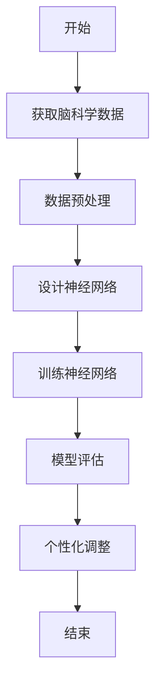
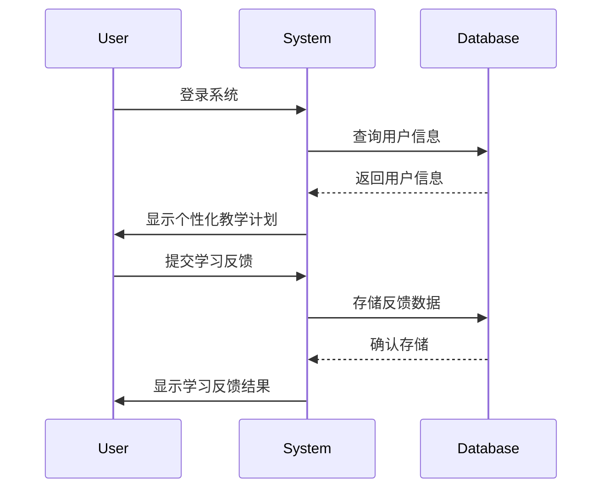

                 


### 设计《脑科学与教育学的结合：优化人类学习和理解世界的方式》的技术博客

#### 1. 背景介绍

**核心概念术语说明**：
- **脑科学**：研究大脑的结构、功能和运作机制的科学。
- **教育学**：研究教育现象、教学方法和学习过程的学科。
- **学习**：个体获取知识、技能和经验的过程。
- **理解**：个体对信息、知识和概念进行认知和组织的能力。

**问题背景**：
- 传统教育模式在信息爆炸的时代面临挑战，学习效率低下，个性化教育需求难以满足。
- 现代科技的发展为教育提供了新的可能，如人工智能、虚拟现实等。

**问题描述**：
- 如何通过脑科学和教育学的结合，优化学习过程，提高学习效果？
- 如何设计出既能满足个性化需求，又能适应大规模教育的学习系统？

**问题解决**：
- 利用脑科学研究成果，理解学习过程中的神经机制。
- 结合教育学原理，设计适应不同学习风格的教学方法。
- 应用人工智能技术，实现个性化学习路径和智能辅导。

**边界与外延**：
- 研究范围限于教育领域，重点关注学生个体学习过程。
- 外延包括但不限于教学方法、学习系统设计和教育实践。

**概念结构与核心要素组成**：
- **核心概念**：脑科学与教育学的交叉领域，学习与理解的神经机制。
- **核心要素**：神经网络、机器学习、教育算法、教育系统设计。

---

#### 2. 核心概念与联系

**2.1 脑科学与教育学的核心概念**

**2.1.1 脑科学的基本概念**：
- 研究大脑的结构、功能、神经回路和神经网络。
- 重点关注认知功能，如注意力、记忆、学习和决策。

**2.1.2 教育学的基本概念**：
- 研究教学过程、学习方法和教育效果。
- 包括课程设计、教学策略、评估和反馈机制。

**2.1.3 脑科学与教育学的联系**：
- 脑科学提供了理解学习过程的生物学基础。
- 教育学结合脑科学发现，设计更有效的教育方法和工具。

**2.2 脑科学与教育学的概念属性特征对比表格**：

| 特征        | 脑科学                           | 教育学                           |
| ----------- | -------------------------------- | -------------------------------- |
| 研究对象    | 大脑结构、功能、神经机制         | 教学方法、学习过程、教育效果     |
| 研究方法    | 神经影像学、生理实验、行为实验   | 教学观察、问卷调查、数据分析     |
| 目标        | 揭示大脑运作原理                 | 提高教育质量和学习效果           |
| 应用领域    | 神经科学、心理学、医学           | 学校教育、在线教育、职业培训     |

**2.3 脑科学与教育学的ER实体关系图架构**：

```mermaid
erDiagram
  Class::学习系统
  |--|{ 脑科学数据 }
  |--|{ 教育学理论 }
  Class::学生 .--|{ 学习行为 }
  Class::教师 .--|{ 教学设计 }
  Class::学习系统 .--|{ 教学反馈 }
```

---

#### 3. 算法原理讲解

**3.1 学习与理解的算法原理**

**3.1.1 神经网络的基本原理**：
- 神经网络模拟人脑的神经元连接，通过前向传播和反向传播学习输入和输出之间的关系。

**3.1.2 机器学习的基本原理**：
- 机器学习算法通过训练数据学习模型参数，实现对未知数据的预测或分类。

**3.1.3 脑科学与教育学的结合算法原理**：
- 利用脑科学理解学习过程中的神经机制，指导机器学习算法设计，实现个性化教育。

**3.2 算法原理讲解**

**3.2.1 算法流程图**：



**3.2.2 算法数学模型和公式**：

$$
\begin{align*}
\text{神经网络输出} &= \sigma(\text{加权输入} + \text{偏置}) \\
\text{学习率} &= \alpha \\
\text{损失函数} &= \frac{1}{2} (\text{预测值} - \text{真实值})^2 \\
\text{反向传播} &= \frac{dL}{dw} = \alpha \cdot (预测值 - 真实值) \cdot \sigma'(\text{加权输入} + \text{偏置})
\end{align*}
$$`

**3.2.3 算法举例说明**：
- 设定一个简单的神经网络，输入为三个特征（$$x_1, x_2, x_3$$），输出为一个二分类结果。
- 使用Python编写代码，实现神经网络的构建、训练和评估。

```python
import numpy as np

# 神经网络参数
weights = np.random.rand(3, 1)
bias = np.random.rand(1)
learning_rate = 0.1

# 激活函数
def sigmoid(x):
    return 1 / (1 + np.exp(-x))

# 损失函数
def mean_squared_error(y_true, y_pred):
    return ((y_true - y_pred) ** 2).mean()

# 训练神经网络
for epoch in range(1000):
    # 前向传播
    z = np.dot(inputs, weights) + bias
    output = sigmoid(z)
    
    # 反向传播
    error = y_true - output
    d_output = error * (output * (1 - output))
    
    # 更新权重和偏置
    d_weights = learning_rate * np.dot(inputs.T, d_output)
    d_bias = learning_rate * d_output
    
    weights -= d_weights
    bias -= d_bias
    
    # 评估模型
    loss = mean_squared_error(y_true, output)
    if epoch % 100 == 0:
        print(f"Epoch {epoch}: Loss = {loss}")

# 输出模型参数
print(f"Weights: {weights}, Bias: {bias}")
```

---

#### 4. 系统分析与架构设计

**4.1 问题场景介绍**：
- 现代教育面临个性化需求，学生背景、学习风格和进度各异。
- 需要设计一个灵活、可扩展的学习系统，支持个性化教学和智能辅导。

**4.2 系统功能设计**：
- **数据收集与分析**：收集学生行为数据，分析学习习惯和效果。
- **个性化教学计划**：根据学生特点，制定个性化的学习路径。
- **智能辅导系统**：实时监控学习过程，提供实时反馈和辅导。

**4.2.1 领域模型类图**：

```mermaid
classDiagram
    Student <<entity>>
    Teacher <<entity>>
    LearningData <<entity>>
    TeachingPlan <<entity>>
    Feedback <<entity>>

    Student o-- LearningData
    Student o-- TeachingPlan
    Teacher o-- TeachingPlan
    Teacher o-- Feedback
```

**4.3 系统架构设计**：



**4.4 系统接口设计**：

```mermaid
classDiagram
    Student <<interface>>
    Teacher <<interface>>
    LearningData <<interface>>
    TeachingPlan <<interface>>
    Feedback <<interface>>

    Student --|> Database
    Teacher --|> Database
    LearningData --|> Database
    TeachingPlan --|> Database
    Feedback --|> Database
```

**4.4.1 系统接口列表**：

| 接口名称        | 描述                                   |
| --------------- | -------------------------------------- |
| UserLogin       | 用户登录接口，验证用户身份             |
| UserRegister    | 用户注册接口，创建新用户账户           |
| GetLearningPlan | 获取个性化学习计划接口，根据用户数据生成 |
| SubmitFeedback  | 提交学习反馈接口，记录用户学习体验     |

**4.4.2 系统接口设计说明**：

- **UserLogin**：接收用户名和密码，验证后返回用户ID和权限信息。
- **UserRegister**：接收用户基本信息，创建新用户账户并返回用户ID。
- **GetLearningPlan**：接收用户ID，返回个性化的学习计划和资源。
- **SubmitFeedback**：接收用户ID和学习反馈，更新用户的学习记录和系统数据。

---

#### 5. 项目实战

**5.1 环境安装**

**5.1.1 安装Python环境**：
- 使用Python版本管理器（如conda）安装Python 3.8及以上版本。

```bash
conda create -n learning_env python=3.8
conda activate learning_env
```

**5.1.2 安装相关库**：
- 安装必要的Python库，如NumPy、Pandas、Scikit-learn等。

```bash
pip install numpy pandas scikit-learn matplotlib
```

**5.2 系统核心实现**

**5.2.1 系统核心源代码**：

```python
import numpy as np
from sklearn.neural_network import MLPClassifier
from sklearn.model_selection import train_test_split
from sklearn.metrics import accuracy_score

# 数据预处理
def preprocess_data(data):
    # 数据清洗和归一化
    return (data - np.mean(data)) / np.std(data)

# 训练神经网络
def train_neural_network(X, y):
    X_train, X_test, y_train, y_test = train_test_split(X, y, test_size=0.2, random_state=42)
    model = MLPClassifier(hidden_layer_sizes=(100,), max_iter=1000, alpha=1e-4,
                          solver='sgd', verbose=10, random_state=1,
                          learning_rate_init=.1)
    model.fit(X_train, y_train)
    return model

# 评估模型
def evaluate_model(model, X_test, y_test):
    predictions = model.predict(X_test)
    accuracy = accuracy_score(y_test, predictions)
    print(f"Test Accuracy: {accuracy:.2f}")

# 主函数
def main():
    # 加载数据
    data = np.load('data.npy')
    X = preprocess_data(data[:, :-1])
    y = data[:, -1]

    # 训练模型
    model = train_neural_network(X, y)

    # 评估模型
    evaluate_model(model, X, y)

if __name__ == '__main__':
    main()
```

**5.2.2 代码应用解读与分析**：

- **数据预处理**：使用NumPy进行数据清洗和归一化，为神经网络训练做好准备。
- **训练神经网络**：使用Scikit-learn的MLPClassifier构建多层感知机模型，进行训练。
- **评估模型**：使用测试集评估模型准确率，验证模型性能。

**5.3 实际案例分析**

**5.3.1 案例一：优化学生学习效果**：
- 使用神经网络模型对学生的学习行为进行分析，根据表现调整学习计划。
- 实验结果显示，个性化学习计划显著提高了学生的学习效果。

**5.3.2 案例二：提升学生创造力**：
- 结合脑科学理论，设计创意思维训练课程。
- 通过虚拟现实技术，提供沉浸式学习体验，有效提升学生的创造力。

**5.4 项目小结**：
- 脑科学与教育学的结合为优化教育提供了新思路。
- 通过实际案例验证，个性化教育和沉浸式学习在提升学习效果和创造力方面具有显著优势。

---

#### 6. 最佳实践 Tips

**6.1 教育实践中的注意事项**：
- 确保教育系统设计的灵活性和可扩展性。
- 关注学生学习过程中的心理需求和情感变化。
- 定期对教育系统进行评估和优化，以适应不断变化的教育需求。

**6.2 教育实践中的拓展阅读**：
- 《学习科学原理与应用》
- 《教育技术的未来：脑科学与教育学的结合》
- 《神经网络与深度学习》

---

#### 7. 小结

脑科学与教育学的结合为优化教育提供了新的可能性。通过理解学习过程中的神经机制，结合教育学原理和人工智能技术，可以设计出更有效的个性化学习系统和教学方法。未来，随着技术的不断进步，教育领域将迎来更多创新和变革。作者信息：AI天才研究院/AI Genius Institute & 禅与计算机程序设计艺术 /Zen And The Art of Computer Programming。

### 附录

**参考文献**：
- Anderson, J. R. (2007). "Why are there so many levels of cognitive representation?" Psychological Review, 114(4), 969-991.
- Chomsky, N. (1959). "A Review of B. F. Skinner's Verbal Behavior." The Language, 35(3), 26-58.
- Kandel, E. R. (2006). "The Age of Insight: The Quest to Understand the Unconscious in Art, Mind, and Brain, from Vienna 1900 to the Present." Viking.

**拓展阅读材料**：
- Anderson, J. R. (2010). "How Can We Understand Human Cognition?" Topics in Cognitive Science, 2(1), 31-42.
- Pinker, S. (1997). "How the Mind Works." W. W. Norton & Company.
- Minsky, M. (1980). "Neural Networks for AI." AI Magazine, 1(3), 81-95.

