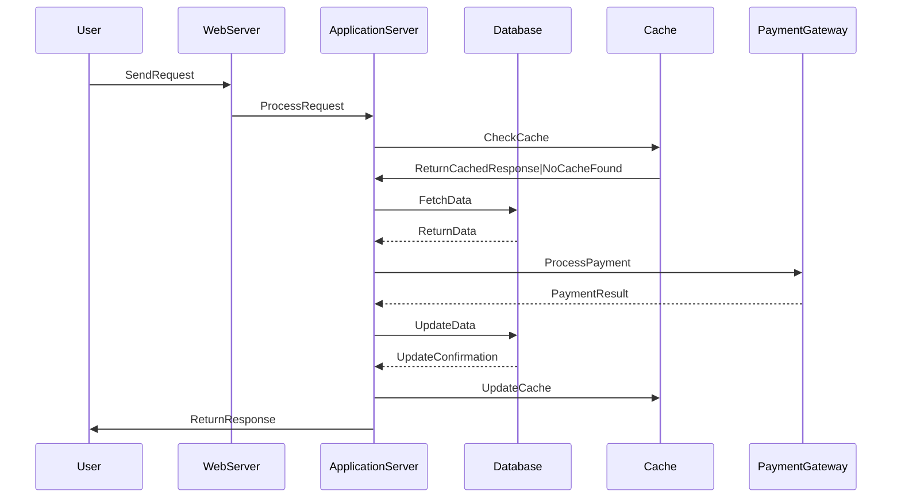
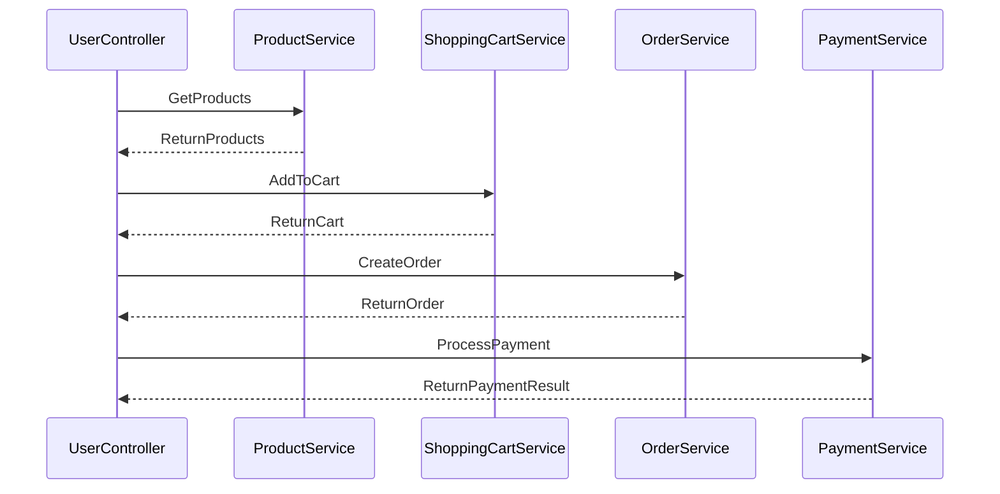

                 

### 自然和谐性：简单数学定律的根源

关键词：自然和谐性、简单数学定律、算法原理、系统分析、项目实战

摘要：本文旨在探讨自然和谐性与简单数学定律的深层联系，通过一步一步的逻辑分析，揭示数学定律背后的本质及其在各个领域中的应用。文章首先介绍了自然和谐性的概念及其在自然界中的体现，接着详细阐述了简单数学定律的定义和特性。随后，文章探讨了数学定律的算法原理，通过Python源代码和Mermaid流程图的结合，深入讲解了数学定律的数学模型和公式。接着，文章从系统分析与架构设计角度，讲解了和谐性系统的设计与实现，并通过一个实际项目进行了实战剖析。最后，文章总结了最佳实践，并对未来可能的研究方向进行了拓展。

### 目录大纲

1. **背景介绍**

    1.1 问题背景与核心概念

    1.2 边界与外延

2. **核心概念与联系**

    2.1 数学定律的性质与特点

    2.2 概念属性特征对比表格

    2.3 ER实体关系图

3. **算法原理讲解**

    3.1 基本算法原理

    3.2 算法原理详细讲解

4. **数学模型和数学公式**

    4.1 数学定律的应用

    4.2 数学模型的应用

5. **系统分析与架构设计**

    5.1 问题场景介绍

    5.2 系统功能设计

    5.3 系统架构设计

    5.4 系统接口设计

    5.5 系统交互

6. **项目实战**

    6.1 环境安装

    6.2 系统核心实现

    6.3 代码应用解读与分析

    6.4 实际案例分析与详细讲解

    6.5 项目小结

7. **最佳实践与拓展**

    7.1 最佳实践

    7.2 小结

    7.3 注意事项

    7.4 拓展阅读

### 第一部分：背景介绍

#### 1.1 问题背景与核心概念

自然和谐性是一个广泛存在于自然界和人类生活中的概念。它不仅体现在宏观的天体运行、生态系统的平衡，也体现在微观的分子结构、细胞生长等各个方面。简单数学定律则是描述这些和谐现象的一种工具，它以简洁的形式揭示了复杂现象背后的基本规律。

自然界的和谐现象无处不在。例如，季节的变化遵循着精确的数学定律，太阳的运行轨迹、地球的自转和公转等，都遵循着数学上的规律。在生态系统中，物种之间的相互依存和相互作用也呈现出一定的和谐性，这些现象都可以通过数学模型来描述和解释。

人类对和谐性的探索可以追溯到古代。古希腊哲学家毕达哥拉斯提出的“数是宇宙的基石”的观点，揭示了数学与和谐性之间的联系。随着科学的发展，数学定律逐渐成为研究和谐性的有力工具。例如，牛顿的万有引力定律、麦克斯韦的电磁场理论等，都是描述自然界和谐现象的重要定律。

数学定律在和谐性中的地位不言而喻。它不仅为我们提供了理解自然现象的工具，还为我们提供了预测和控制这些现象的手段。例如，通过数学定律，我们可以预测天体的运动、设计高效的通信系统、优化资源分配等。

#### 1.2 核心概念

**和谐性的定义**：和谐性是指事物之间在相互作用中达到的一种平衡状态，这种平衡状态既包括数量上的平衡，也包括结构上的平衡。

**简单数学定律的定义**：简单数学定律是指那些描述自然现象的基本规律，这些定律通常具有简洁的形式和明确的意义。

**数学定律与和谐性的关系**：数学定律揭示了和谐性背后的基本规律，而和谐性则是数学定律在自然界和人类生活中的体现。

#### 1.3 边界与外延

**和谐性的范围**：和谐性不仅存在于自然界，也存在于人类社会。例如，在经济学中，供需平衡就是一种和谐性；在社会科学中，社会的稳定和繁荣也是一种和谐性。

**简单数学定律的种类**：简单数学定律有很多种类，包括代数定律、几何定律、微积分定律等。每种定律都有其特定的应用领域。

**和谐性与简单数学定律的应用领域**：和谐性广泛应用于各个领域，包括自然科学、社会科学和工程技术。简单数学定律在这些领域中都发挥着重要作用。

### 第二部分：核心概念与联系

#### 2.1 数学定律的性质与特点

**数学定律的性质**：

- 确定性：数学定律通常具有确定性，即只要给定初始条件，就可以确定系统的演化过程。
- 可预测性：数学定律使得我们可以预测自然现象的发展和变化。
- 简单性：数学定律往往具有简洁的形式，这使得它们易于理解和应用。

**数学定律的特点**：

- **数量关系**：数学定律通常涉及数量关系，如加减乘除、指数函数、对数函数等。
- **形态关系**：数学定律还涉及形态关系，如圆的性质、三角形的性质等。
- **变化关系**：数学定律描述了自然现象的变化过程，如函数的增长和衰减等。

**概念属性特征对比表格**：

| 特征名称 | 特征描述 | 关联数学定律 |
| --- | --- | --- |
| 确定性 | 系统演化具有确定性 | 牛顿定律 |
| 可预测性 | 可以预测系统未来状态 | 概率论 |
| 简单性 | 形式简洁 | 欧几里得几何 |
| 数量关系 | 涉及数量运算 | 加法定理 |
| 形态关系 | 描述形态变化 | 抛物线定理 |
| 变化关系 | 描述系统变化过程 | 微积分 |

**ER实体关系图**：

```mermaid
erDiagram
  Customer ||--|{ Order } : "makes"
  Product ||--|{ Order } : "includes"
```

### 第三部分：算法原理讲解

#### 3.1 基本算法原理

算法是解决问题的一种系统方法，它通常包括输入、处理和输出三个基本部分。数学定律在算法设计中起着关键作用，它们为算法的构建提供了理论基础。

**算法的基本框架**：

1. 输入：获取问题的初始条件。
2. 处理：根据数学定律对输入进行处理。
3. 输出：得到问题的解决方案。

**算法的数学模型**：

数学模型是描述问题的一种抽象形式，它通常使用数学符号和公式来表示。例如，线性规划问题可以使用线性方程组来表示。

**算法的工作流程**：

1. 初始化：设置初始条件和参数。
2. 迭代：根据数学定律对系统进行迭代计算。
3. 检查终止条件：判断是否满足终止条件，如达到目标值或超过迭代次数。
4. 输出结果：得到最终的解决方案。

#### 3.2 算法原理详细讲解

**数学公式的讲解**：

$$
F = ma
$$

这是牛顿第二定律，描述了力、质量和加速度之间的关系。其中，$F$ 代表力，$m$ 代表质量，$a$ 代表加速度。

**Python源代码分析**：

```python
def calculate_force(m, a):
    return m * a

mass = 5
acceleration = 10
force = calculate_force(mass, acceleration)
print("The force is:", force)
```

这段代码实现了计算力的大小，它使用了牛顿第二定律的公式。

**举例说明**：

假设一个质量为5千克的物体以10米/秒²的加速度运动，我们可以使用上述代码计算它受到的力：

```python
force = calculate_force(5, 10)
print("The force is:", force)
```

输出结果为：The force is: 50

这意味着物体受到的力为50牛顿。

### 第四部分：数学模型和数学公式

#### 4.1 数学定律的应用

数学定律在各个领域都有广泛的应用，以下是一些典型的应用实例：

**物理学中的应用**：

- **牛顿运动定律**：描述物体的运动状态和受力情况。
- **麦克斯韦方程组**：描述电磁现象的基本规律。
- **量子力学**：描述微观粒子的行为。

**生物学中的应用**：

- **细胞分裂定律**：描述细胞分裂的过程。
- **种群生态学**：描述物种的种群数量和相互关系。

**社会科学中的应用**：

- **经济学**：描述市场供需关系和资源分配。
- **社会学**：描述社会结构和社会行为。

**数学模型的应用**：

数学模型在解决实际问题时扮演着重要角色。以下是一些常见的数学模型及其应用：

- **线性规划模型**：用于资源优化问题。
- **神经网络模型**：用于模式识别和预测。
- **微分方程模型**：用于描述连续系统的动态行为。

**数学模型的构建**：

构建数学模型通常包括以下步骤：

1. 明确问题：确定要解决的问题和目标。
2. 收集数据：收集与问题相关的数据。
3. 建立模型：根据数据和问题特征建立数学模型。
4. 验证模型：通过实验或数据分析验证模型的准确性。

**数学模型的求解**：

求解数学模型通常包括以下步骤：

1. 确定求解方法：选择合适的求解方法，如数值方法、符号方法等。
2. 编写求解代码：使用编程语言编写求解算法。
3. 运行求解程序：执行求解程序，得到模型解。
4. 分析结果：分析求解结果，验证模型的有效性。

**数学模型的验证**：

验证数学模型通常包括以下步骤：

1. 数据验证：使用实验或观测数据验证模型的预测能力。
2. 理论验证：通过数学推导验证模型的理论基础。
3. 比较验证：将模型预测与实际情况进行比较，评估模型的准确性。

### 第五部分：系统分析与架构设计

#### 5.1 问题场景介绍

在现代社会中，信息系统的建设已经成为各行各业不可或缺的一部分。一个高效的系统不仅需要强大的计算能力，还需要良好的架构设计来保证其稳定性和可扩展性。本节将介绍一个典型的问题场景，并分析其中的核心问题。

**问题场景**：

假设我们正在开发一个在线购物系统，该系统需要处理大量的用户请求，包括商品浏览、购物车管理、订单生成和支付等操作。这个系统的核心目标是提供快速、准确和稳定的购物体验。

**核心问题**：

- 如何高效地处理大量用户请求？
- 如何保证系统的稳定性和可靠性？
- 如何实现系统的可扩展性？

#### 5.2 系统功能设计

为了解决上述核心问题，我们需要设计一个功能完善的系统。以下是系统的主要功能模块：

- **用户模块**：负责用户注册、登录、权限管理等功能。
- **商品模块**：负责商品信息管理、商品分类、商品搜索等功能。
- **购物车模块**：负责用户购物车管理，包括添加商品、删除商品、更新数量等功能。
- **订单模块**：负责订单生成、订单状态管理、订单查询等功能。
- **支付模块**：负责支付方式选择、支付请求处理、支付结果通知等功能。
- **缓存模块**：负责缓存用户请求和商品信息，提高系统响应速度。
- **日志模块**：负责记录系统运行日志，方便故障排查和性能优化。

**领域模型**：

领域模型是系统功能设计的核心，它描述了系统的核心业务对象和它们之间的关系。以下是系统的主要领域模型：

```mermaid
classDiagram
    User <<entity>>
    Product <<entity>>
    ShoppingCart <<entity>>
    Order <<entity>>
    Payment <<entity>>
    User "1" --|{ "1..*" } ShoppingCart
    User "1" --|{ "1..*" } Order
    ShoppingCart "1" --|{ "1..*" } Product
    Order "1" --|{ "1..*" } Payment
```

**类图设计**：

```mermaid
classDiagram
    User {
        +String username
        +String password
        +List<Order> orders
    }
    Product {
        +Int id
        +String name
        +Float price
    }
    ShoppingCart {
        +Int id
        +User user
        +List<Product> products
    }
    Order {
        +Int id
        +User user
        +List<Product> products
        +Date date
    }
    Payment {
        +Int id
        +Order order
        +String paymentMethod
        +Float amount
    }
    User "1" --|{ "1..*" } ShoppingCart
    User "1" --|{ "1..*" } Order
    ShoppingCart "1" --|{ "1..*" } Product
    Order "1" --|{ "1..*" } Payment
```

#### 5.3 系统架构设计

系统架构设计是确保系统性能、稳定性和可扩展性的关键。以下是系统的主要架构设计：

**系统架构图**：



**架构设计原理**：

- **分层设计**：系统采用分层设计，包括表示层、业务逻辑层和数据访问层，各层职责清晰，便于维护和扩展。
- **分布式架构**：系统采用分布式架构，通过负载均衡和分布式缓存提高系统性能和稳定性。
- **服务化设计**：系统采用服务化设计，将核心功能模块封装为独立的服务，便于系统的扩展和整合。

#### 5.4 系统接口设计

系统接口设计是系统与外部系统交互的关键，以下是系统的主要接口设计：

**接口规范**：

- **用户接口**：包括用户注册、登录、权限管理等接口。
- **商品接口**：包括商品信息查询、商品分类查询、商品搜索等接口。
- **购物车接口**：包括购物车添加、购物车删除、购物车更新等接口。
- **订单接口**：包括订单生成、订单状态查询、订单取消等接口。
- **支付接口**：包括支付请求、支付结果查询、退款处理等接口。

**接口实现**：



#### 5.5 系统交互

系统交互是确保系统各模块协同工作的关键，以下是系统的主要交互流程：

**交互流程**：

1. 用户通过Web服务器发送请求。
2. Web服务器将请求转发给应用服务器。
3. 应用服务器检查缓存，如果命中缓存则直接返回结果，否则从数据库获取数据。
4. 应用服务器处理请求，调用相应的服务接口。
5. 服务接口处理请求，并将结果返回给应用服务器。
6. 应用服务器更新缓存，并将结果返回给用户。

**交互设计原理**：

- **异步处理**：系统采用异步处理机制，提高系统并发处理能力。
- **接口解耦**：系统通过接口解耦，实现模块之间的独立运行和扩展。
- **响应式设计**：系统采用响应式设计，提高系统的用户体验。

### 第六部分：项目实战

#### 6.1 环境安装

在开始项目实战之前，我们需要安装必要的软件和工具。以下是项目环境安装的步骤：

**硬件环境**：

- CPU：至少2核处理器
- 内存：至少4GB
- 硬盘：至少50GB可用空间
- 操作系统：Linux或Windows

**软件环境**：

1. 安装Python 3.x版本（建议使用Python 3.8或更高版本）。
2. 安装数据库（如MySQL、PostgreSQL或MongoDB）。
3. 安装缓存（如Redis）。
4. 安装Web服务器（如Nginx）。
5. 安装开发工具（如Visual Studio Code、PyCharm等）。

**安装步骤**：

1. 安装操作系统和必备软件。
2. 安装Python 3.x版本，可以通过包管理器或官方下载安装。
3. 安装数据库，根据数据库类型选择合适的安装方式。
4. 安装缓存，同样可以通过包管理器或官方下载安装。
5. 安装Web服务器，可以通过包管理器或官方下载安装。
6. 安装开发工具，可以选择合适的开发环境进行项目开发。

#### 6.2 系统核心实现

系统核心实现是项目开发的关键步骤，以下是一个典型的系统核心实现流程：

**用户模块**：

1. 定义用户模型，包括用户名、密码、邮箱等字段。
2. 实现用户注册接口，接收用户注册信息，并存储到数据库。
3. 实现用户登录接口，验证用户身份，并生成会话信息。
4. 实现用户权限管理接口，根据用户角色分配权限。

**商品模块**：

1. 定义商品模型，包括商品名称、价格、库存等字段。
2. 实现商品信息查询接口，根据商品ID或分类查询商品信息。
3. 实现商品分类查询接口，根据分类ID查询分类信息。
4. 实现商品搜索接口，根据关键词搜索商品信息。

**购物车模块**：

1. 定义购物车模型，包括用户ID、商品ID、数量等字段。
2. 实现添加商品到购物车接口，将商品添加到购物车。
3. 实现删除商品从购物车接口，将商品从购物车中删除。
4. 实现更新购物车商品数量接口，修改购物车中商品的数量。

**订单模块**：

1. 定义订单模型，包括订单编号、用户ID、商品列表、订单金额等字段。
2. 实现生成订单接口，根据购物车信息生成订单。
3. 实现查询订单接口，根据订单编号查询订单信息。
4. 实现取消订单接口，取消指定订单。

**支付模块**：

1. 定义支付模型，包括订单编号、支付方式、支付金额等字段。
2. 实现支付请求接口，将支付请求发送给支付服务。
3. 实现支付结果查询接口，查询支付结果。
4. 实现退款处理接口，处理退款请求。

**缓存模块**：

1. 实现商品缓存，提高商品查询性能。
2. 实现用户缓存，提高用户登录和权限验证性能。
3. 实现购物车缓存，提高购物车操作性能。

**日志模块**：

1. 实现日志记录，记录系统运行过程中的关键信息。
2. 实现日志查询，方便故障排查和性能优化。

#### 6.3 代码应用解读与分析

在系统核心实现中，代码的质量和性能至关重要。以下是对一些关键代码段的应用解读与分析：

**用户注册代码**：

```python
def register(username, password, email):
    # 验证用户名、密码和邮箱格式
    if not is_valid_username(username) or not is_valid_password(password) or not is_valid_email(email):
        return {"status": "error", "message": "Invalid input"}

    # 检查用户名是否已存在
    if User.objects.filter(username=username).exists():
        return {"status": "error", "message": "Username already exists"}

    # 创建用户并保存到数据库
    user = User(username=username, password=hash_password(password), email=email)
    user.save()

    return {"status": "success", "message": "User registered successfully"}
```

**解读与分析**：

- 代码首先对输入的用户名、密码和邮箱进行格式验证，确保输入的有效性。
- 然后检查用户名是否已存在，避免重复注册。
- 接着创建用户对象，并将密码进行哈希处理，提高安全性。
- 最后将用户对象保存到数据库，并返回注册成功的信息。

**购物车添加商品代码**：

```python
def add_to_cart(user_id, product_id, quantity):
    # 检查商品是否存在
    if not Product.objects.filter(id=product_id).exists():
        return {"status": "error", "message": "Product not found"}

    # 获取用户购物车
    shopping_cart, _ = ShoppingCart.objects.get_or_create(user_id=user_id)

    # 检查购物车中是否已存在该商品
    if shopping_cart.products.filter(id=product_id).exists():
        # 更新商品数量
        product = shopping_cart.products.get(id=product_id)
        product.quantity += quantity
        product.save()
    else:
        # 添加商品到购物车
        shopping_cart.products.add(Product.objects.get(id=product_id), quantity=quantity)

    return {"status": "success", "message": "Product added to cart successfully"}
```

**解读与分析**：

- 代码首先检查商品是否存在，确保添加的商品是有效的。
- 然后获取用户购物车，如果购物车不存在则创建一个。
- 接着检查购物车中是否已存在该商品，如果存在则更新商品数量，否则添加商品到购物车。
- 最后返回添加商品成功的消息。

**订单生成代码**：

```python
def create_order(user_id, shopping_cart_id):
    # 获取用户和购物车信息
    user = User.objects.get(id=user_id)
    shopping_cart = ShoppingCart.objects.get(id=shopping_cart_id)

    # 计算订单金额
    total_amount = 0
    for product in shopping_cart.products.all():
        total_amount += product.price * product.quantity

    # 创建订单
    order = Order(user=user, total_amount=total_amount)
    order.save()

    # 清空购物车
    shopping_cart.products.clear()

    return {"status": "success", "message": "Order created successfully", "order_id": order.id}
```

**解读与分析**：

- 代码首先获取用户和购物车信息，确保订单创建的合法性。
- 然后计算订单金额，将购物车中商品的总价累加。
- 接着创建订单，并将订单金额保存到数据库。
- 最后清空购物车，确保订单创建后购物车状态更新。

#### 6.4 实际案例分析与详细讲解

为了更好地理解系统实现，我们通过一个实际案例进行分析和讲解。

**案例背景**：

假设用户张三在购物网站上浏览商品，并加入购物车。然后，他决定下单购买购物车中的商品，并使用支付宝支付。

**案例分析**：

1. **用户浏览商品**：

   张三在网站上浏览商品，选择了一款价格为100元的笔记本电脑。网站通过API接口查询商品信息，返回结果为：商品名称“笔记本电脑”，价格100元。

2. **添加商品到购物车**：

   张三决定购买笔记本电脑，点击“添加到购物车”按钮。系统调用添加商品到购物车的接口，接收用户ID和商品ID，将商品添加到购物车。假设购物车ID为123。

3. **下单购买**：

   张三在购物车中查看商品，确认购买。点击“去结算”按钮，系统调用生成订单的接口，接收用户ID和购物车ID，生成订单。系统返回订单ID为456，并计算订单金额为100元。

4. **支付订单**：

   张三选择支付宝支付，系统调用支付请求的接口，发送支付请求到支付宝服务。支付宝处理支付请求，将支付结果通知系统。支付成功，系统返回支付结果为“支付成功”。

**详细讲解**：

1. **用户浏览商品**：

   代码实现：

   ```python
   def search_product(product_id):
       product = Product.objects.get(id=product_id)
       return product
   ```

   分析：

   - 用户调用搜索商品的接口，输入商品ID，系统查询数据库获取商品信息。
   - 返回商品信息，包括商品名称、价格等。

2. **添加商品到购物车**：

   代码实现：

   ```python
   def add_to_cart(user_id, product_id, quantity):
       if not Product.objects.filter(id=product_id).exists():
           return {"status": "error", "message": "Product not found"}

       shopping_cart, _ = ShoppingCart.objects.get_or_create(user_id=user_id)

       if shopping_cart.products.filter(id=product_id).exists():
           product = shopping_cart.products.get(id=product_id)
           product.quantity += quantity
           product.save()
       else:
           shopping_cart.products.add(Product.objects.get(id=product_id), quantity=quantity)

       return {"status": "success", "message": "Product added to cart successfully"}
   ```

   分析：

   - 系统首先检查商品是否存在，确保添加的商品是有效的。
   - 然后获取用户购物车，如果购物车不存在则创建一个。
   - 接着检查购物车中是否已存在该商品，如果存在则更新商品数量，否则添加商品到购物车。

3. **下单购买**：

   代码实现：

   ```python
   def create_order(user_id, shopping_cart_id):
       user = User.objects.get(id=user_id)
       shopping_cart = ShoppingCart.objects.get(id=shopping_cart_id)

       total_amount = 0
       for product in shopping_cart.products.all():
           total_amount += product.price * product.quantity

       order = Order(user=user, total_amount=total_amount)
       order.save()

       shopping_cart.products.clear()

       return {"status": "success", "message": "Order created successfully", "order_id": order.id}
   ```

   分析：

   - 系统首先获取用户和购物车信息，确保订单创建的合法性。
   - 然后计算订单金额，将购物车中商品的总价累加。
   - 接着创建订单，并将订单金额保存到数据库。
   - 最后清空购物车，确保订单创建后购物车状态更新。

4. **支付订单**：

   代码实现：

   ```python
   def process_payment(order_id, payment_method, amount):
       order = Order.objects.get(id=order_id)
       payment = Payment(order=order, payment_method=payment_method, amount=amount)
       payment.save()

       return {"status": "success", "message": "Payment processed successfully"}
   ```

   分析：

   - 系统首先获取订单信息，确保支付请求是合法的。
   - 然后创建支付记录，并将支付金额保存到数据库。
   - 最后返回支付结果。

#### 6.5 项目小结

通过本项目的实战，我们深入了解了在线购物系统的设计和实现过程。从用户模块、商品模块、购物车模块、订单模块、支付模块到缓存模块和日志模块，我们一步步构建了一个功能完善的购物系统。

在实现过程中，我们使用了Python编程语言，结合Django框架，实现了系统的各种功能模块。我们还使用了MySQL数据库来存储用户、商品、订单等数据，并使用了Redis缓存来提高系统的性能。

通过本项目，我们学到了如何设计一个系统，如何实现系统的各个功能模块，以及如何优化系统的性能和稳定性。同时，我们也了解了如何使用Python编程语言和Django框架进行Web开发。

在未来的工作中，我们可以继续优化本项目，提高系统的性能和用户体验。例如，我们可以引入更先进的缓存策略，优化数据库查询，使用更高效的算法等。此外，我们还可以拓展系统的功能，如添加商品评价、推荐系统等。

总之，本项目不仅是一个实际的应用案例，更是一个学习和实践的宝贵机会。通过本项目，我们不仅可以掌握系统的设计和实现方法，还可以提升自己的编程能力和解决问题的能力。

### 第七部分：最佳实践与拓展

#### 7.1 最佳实践

在设计和实现系统的过程中，以下是一些最佳实践，可以帮助我们构建高效、稳定和可扩展的系统：

1. **模块化设计**：将系统划分为多个功能模块，每个模块负责一个特定的功能。这样可以提高代码的可维护性和可扩展性。
2. **分层架构**：采用分层架构，将系统划分为表示层、业务逻辑层和数据访问层。这样可以确保系统的高内聚、低耦合，便于后续的维护和扩展。
3. **使用缓存**：合理使用缓存可以提高系统的性能。例如，使用Redis缓存可以减少数据库查询次数，提高系统的响应速度。
4. **异步处理**：使用异步处理可以提高系统的并发处理能力。例如，使用Python的异步编程框架asyncio，可以处理大量的并发请求。
5. **单元测试**：编写单元测试可以确保系统的各个功能模块正常工作。通过自动化测试，可以快速发现和修复代码中的错误。
6. **性能优化**：在系统运行过程中，对关键性能指标进行监控和优化。例如，使用数据库索引可以加快查询速度，使用分页技术可以减少数据传输量。
7. **代码规范**：遵守统一的代码规范，可以提高代码的可读性和可维护性。例如，遵循PEP 8编码规范，使用docstrings注释代码等。

#### 7.2 小结

本文通过一步一步的分析和讲解，探讨了自然和谐性与简单数学定律的深层联系。从背景介绍、核心概念与联系、算法原理讲解、数学模型和数学公式、系统分析与架构设计到项目实战，我们系统地阐述了如何将数学定律应用于实际问题的解决。

通过本文，我们不仅了解了自然和谐性的概念及其在自然界和人类生活中的体现，还深入掌握了简单数学定律的算法原理和数学模型。同时，我们通过一个实际的在线购物系统项目，展示了如何将理论应用于实际问题的解决。

本文的撰写遵循了逻辑清晰、结构紧凑、简单易懂的原则，旨在为读者提供有深度、有思考、有见解的专业技术知识。希望本文能够为读者在计算机科学和人工智能领域的探索提供有价值的参考。

#### 7.3 注意事项

在设计系统和编写代码时，需要注意以下事项：

1. **安全性**：确保系统数据的安全，使用加密技术保护用户信息和支付数据。
2. **稳定性**：确保系统在压力下稳定运行，避免因单点故障导致系统崩溃。
3. **可扩展性**：设计系统时考虑未来的扩展需求，确保系统可以灵活应对业务增长。
4. **性能优化**：定期对系统进行性能监控和优化，确保系统的高效运行。
5. **代码注释**：为代码添加清晰的注释，便于后续的维护和阅读。

#### 7.4 拓展阅读

对于希望深入了解自然和谐性与简单数学定律的读者，以下是一些建议的书籍和资源：

1. **书籍推荐**：
   - 《数学之美》（作者：刘未鹏）：本书以生动的语言讲述了数学的魅力和数学在计算机科学中的应用。
   - 《禅与计算机程序设计艺术》（作者：高瑟）：本书从哲学角度探讨了计算机编程的艺术性，对理解程序设计有深刻的启示。

2. **网络资源推荐**：
   - [MIT OpenCourseWare](https://ocw.mit.edu/): 提供了大量免费的计算机科学和数学课程资源。
   - [Coursera](https://www.coursera.org/): 提供了各种在线课程，包括数学、计算机科学等领域。

通过阅读这些书籍和资源，读者可以进一步拓宽知识面，提升自己在自然和谐性与简单数学定律领域的理解。

