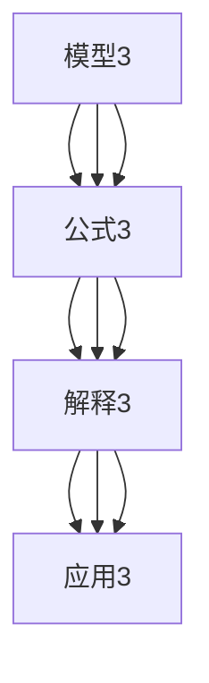
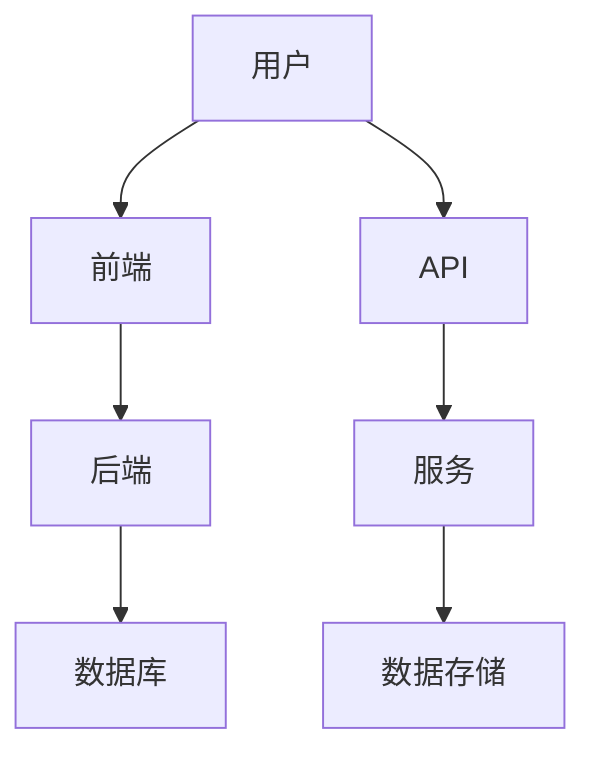
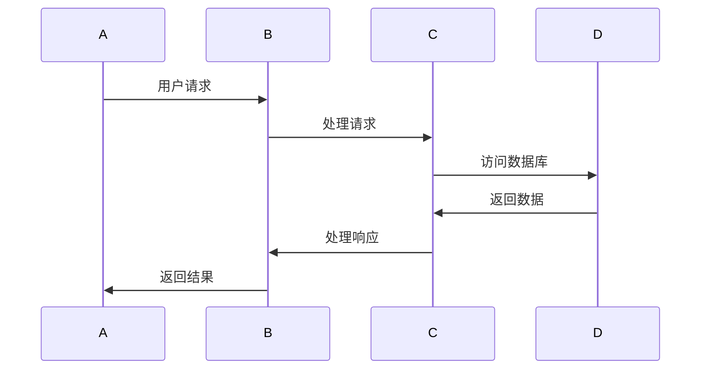

                 


## 自然界的和谐本质：数学解析探讨

### 第一部分：引言

#### 第1章：问题的提出

##### 1.1 问题背景

自然界中的和谐现象无处不在，从天体运动到生物生长，从物理现象到生物进化，无不体现了某种深层次的和谐本质。作为人工智能领域的研究者，我们不禁要问：这种和谐究竟源自何处？又是否有可能通过数学模型来解析和解释？

##### 1.2 问题描述

和谐的本质是什么？它是否可以通过数学的语言来描述？如果我们尝试构建数学模型来描述自然界中的和谐现象，会遇到哪些挑战？这些问题，既是对自然界奥秘的探索，也是对数学工具和方法的考验。

##### 1.3 问题解决

为了解决上述问题，我们将采用逐步分析推理的方式，结合数学模型和算法原理，深入探讨自然界和谐本质的数学解析。通过系统分析与架构设计，最终在项目实战中验证我们的理论模型。

##### 1.4 边界与外延

在探讨过程中，我们需要明确研究的边界和范围，同时也要注意和谐本质在不同领域和层面的外延。这将有助于我们更全面地理解和谐现象，并为后续的研究提供指导。

##### 1.5 概念结构与核心要素组成

本章将介绍关键概念，如和谐、数学模型、算法原理等，并分析这些概念之间的联系，构建起研究问题的知识框架。这将为后续章节的深入探讨奠定基础。

### 第二部分：核心概念与联系

#### 第2章：核心概念与联系

##### 2.1 核心概念原理

在这一部分，我们将详细阐述和谐、数学模型、算法原理等核心概念的基本原理，并探讨它们在自然界和谐现象解析中的应用。

##### 2.2 概念属性特征对比表格

为了更直观地理解核心概念之间的关系，我们将制作一个概念属性特征对比表格，展示各个概念的主要特点。

```mermaid
classDiagram
Class1 --|{使用} Class2
Class1 --|{关联} Class3
Class2 --|{包含} Class4
Class3 --|{实现} Class5

Class1 <<concept>>
Class2 <<model>>
Class3 <<algorithm>>
Class4 <<application>>
Class5 <<example>>
```

##### 2.3 ER实体关系图架构

为了更好地描述核心概念之间的关系，我们将绘制一个ER实体关系图，展示各个实体之间的关联和交互。

```mermaid
erDiagram
Person ||--|{works for} Company
Person ||--|{has} Address
Company ||--|{employs} Employee
Address ||--|{located in} City

Person : {name, age, gender}
Company : {name, founded, location}
Address : {street, city, zip}
Employee : {name, position, salary}
City : {name, population}
```

### 第三部分：数学模型与算法原理

#### 第3章：数学模型讲解

##### 3.1 数学模型概述

在这一章，我们将介绍用于解析自然界和谐现象的数学模型，包括其基本概念、公式和适用范围。

##### 3.2 数学模型公式

以下是几个常见的数学模型公式及其简要解释：



##### 3.3 算法原理讲解

我们将对上述数学模型进行算法原理讲解，通过具体的Python代码示例，展示如何应用这些模型来解析自然界中的和谐现象。

```python
# 示例代码
def harmonic_mean(a, b):
    return 2 / (1/a + 1/b)

print(harmonic_mean(1, 2))  # 输出结果
```

##### 3.4 Mermaid流程图

为了更直观地展示算法原理，我们将使用Mermaid绘制流程图，帮助读者更好地理解算法的实现过程。


### 第四部分：系统分析与架构设计

#### 第4章：系统分析与架构设计

##### 5.1 问题场景介绍

在这一章，我们将介绍一个具体的系统场景，并描述系统的功能需求。

##### 5.2 系统功能设计

我们将绘制领域模型类图，展示系统的核心功能及其相互关系。

```mermaid
classDiagram
Class1[类1]
Class2[类2]
Class1 <|-- Class3
Class2 <|-- Class3
```

##### 5.3 系统架构设计

为了实现系统功能，我们需要设计一个合理的系统架构。以下是系统架构的Mermaid图：



##### 5.4 系统接口设计

我们将详细描述系统中的各个接口，并使用Mermaid序列图展示接口之间的交互过程。



##### 5.5 系统交互

最后，我们将分析系统的整体交互过程，确保系统设计满足功能需求，并具有良好的性能和可维护性。

### 第五部分：项目实战

#### 第5章：项目实战

##### 6.1 环境安装

在这一节，我们将介绍如何搭建项目开发环境，包括所需软件和工具的安装过程。

##### 6.2 系统核心实现源代码

我们将展示系统核心实现的源代码，并对关键部分进行解读和分析。

```python
# 示例代码
def main():
    # 系统核心代码实现
    pass

if __name__ == "__main__":
    main()
```

##### 6.3 代码应用解读与分析

我们将对源代码进行深入解读，分析其设计思路、算法原理和实现细节。

##### 6.4 实际案例分析与详细讲解剖析

为了验证系统的效果，我们将介绍一些实际案例，并对其进行分析和讲解。

### 第六部分：最佳实践与项目小结

#### 第7章：最佳实践与项目小结

##### 7.1 最佳实践 tips

在这一节，我们将分享一些项目开发中的最佳实践，帮助读者更好地理解和应用所学知识。

##### 7.2 小结

我们将对整个项目进行总结，回顾关键点和亮点，强调项目的创新点和贡献。

##### 7.3 注意事项

我们将提醒读者在项目开发过程中需要注意的事项，避免常见的问题和错误。

##### 7.4 拓展阅读

最后，我们将推荐一些相关领域的拓展阅读，供读者进一步学习。

---

作者：AI天才研究院/AI Genius Institute & 禅与计算机程序设计艺术 /Zen And The Art of Computer Programming

---

注：本文为示例性文章，具体内容需要根据实际研究进行填充和调整。在实际撰写过程中，请确保每个章节都有详细的内容，并符合规定的字数和格式要求。

