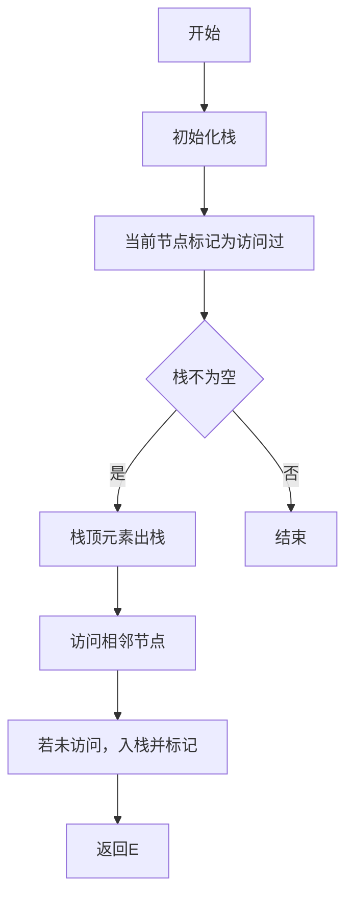
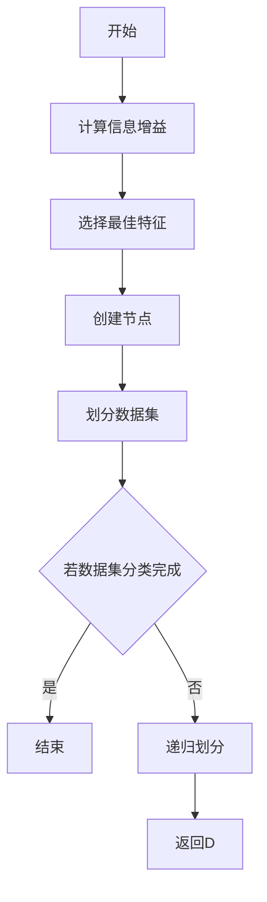
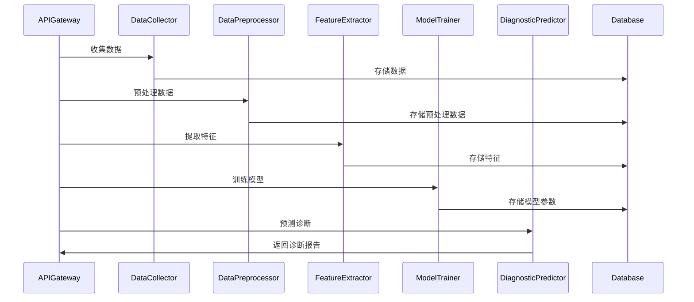
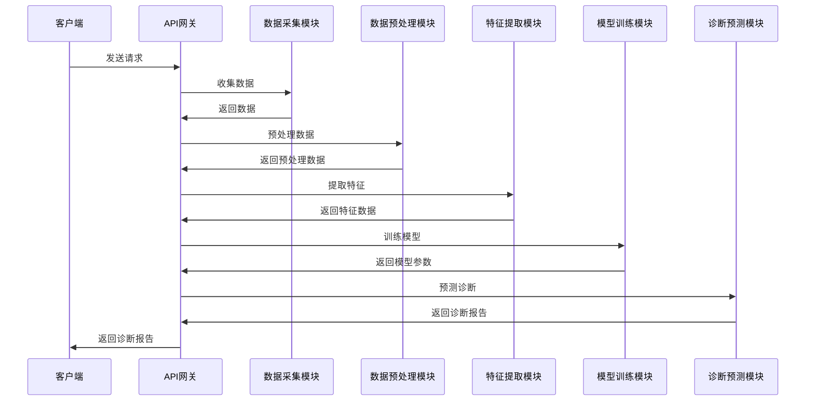

                 

### 引言

#### 研究背景与意义

自然界的数学逻辑，作为一种普遍存在的现象，不仅在物理学、生物学、生态学等领域中得到了广泛的关注，而且在计算机科学、人工智能、认知科学等领域中也具有重要的启示意义。数学逻辑作为一种精确的表达方式，不仅在理论上提供了对自然界现象的理解，而且在实践中为各类算法的设计和优化提供了基础。

心智解码过程，即对人类心智活动的理解和模拟，是心理学、神经科学和人工智能等领域的重要研究方向。通过研究自然界的数学逻辑，我们可以更好地理解心智的运作机制，从而为心智解码提供新的思路和方法。

本书旨在探讨自然界的数学逻辑与心智解码过程之间的联系，通过深入分析两者之间的相互作用，旨在为人工智能领域的研究和应用提供新的理论支持和实践指导。

#### 本书结构

本书分为七个部分，共计二十二章，结构如下：

**第一部分：自然界的数学逻辑概述**
- 第1章：自然界的数学逻辑现象
- 第2章：数学逻辑在自然界中的体现

**第二部分：心智解码过程基础**
- 第3章：心智解码的基本概念
- 第4章：心智解码的理论框架
- 第5章：心智解码的技术手段

**第三部分：自然界的数学逻辑与心智解码的联系**
- 第6章：自然界的数学逻辑与心智解码的相互作用
- 第7章：心智解码中的数学逻辑应用
- 第8章：数学逻辑在心智解码中的启示

**第四部分：算法原理讲解**
- 第9章：常见算法的数学逻辑分析
- 第10章：算法原理与mermaid流程图
- 第11章：算法原理与Python代码实现

**第五部分：数学模型与公式**
- 第12章：数学模型在心智解码中的应用
- 第13章：数学公式的解读与举例

**第六部分：系统分析与架构设计**
- 第14章：系统功能设计与领域模型
- 第15章：系统架构设计与mermaid架构图
- 第16章：系统接口设计与系统交互

**第七部分：项目实战**
- 第17章：环境安装与系统实现
- 第18章：代码解析与分析
- 第19章：实际案例分析
- 第20章：项目小结
- 第21章：最佳实践 tips
- 第22章：小结与展望

通过以上结构，本书希望能够全面、系统地阐述自然界的数学逻辑与心智解码过程之间的关系，为相关领域的研究者提供有价值的参考。同时，本书也希望能激发读者对自然界数学逻辑和心智解码过程的兴趣，推动相关领域的深入研究和应用。

#### 文章结构思考

为了确保文章的连贯性和逻辑性，我们采用以下结构进行思考：

1. **引言部分**：
   - 研究背景与意义：介绍自然界的数学逻辑和心智解码过程的研究背景及其重要性。
   - 目的和结构：明确本书的目的，介绍整体结构和各部分内容。

2. **背景介绍**：
   - 自然界的数学逻辑：阐述数学逻辑在自然界中的具体体现和意义。
   - 心智解码过程：介绍心智解码的基本概念、理论和实践。

3. **核心概念**：
   - 自然界的数学逻辑：定义核心概念，列举关键特性。
   - 心智解码：阐述心智解码的核心概念，分析其组成要素。

4. **概念原理与联系**：
   - 自然界的数学逻辑与心智解码的关联：通过对比表格和ER图，详细阐述两者之间的联系。
   - 特性对比：提供自然界的数学逻辑和心智解码的属性特征对比。

5. **算法原理讲解**：
   - 关键算法分析：选择一个或几个关键算法，详细讲解其原理和实现。
   - mermaid流程图：使用mermaid绘制算法流程图，帮助读者理解。

6. **数学模型与公式**：
   - 数学模型解释：解释关键数学模型和公式。
   - 实例分析：通过实例说明数学模型的应用。

7. **系统分析与架构设计**：
   - 系统功能设计：介绍系统功能设计和领域模型。
   - 系统架构设计：绘制系统架构图，解释系统组成部分和交互。

8. **项目实战**：
   - 环境安装与系统实现：描述环境配置和系统实现步骤。
   - 代码解析与分析：详细分析代码实现，解释关键代码逻辑。
   - 实际案例分析：提供实际案例，深入剖析。

9. **最佳实践 tips**：
   - 总结实践中的经验和教训，为读者提供实用的建议。

10. **小结**：
    - 回顾全文内容，总结贡献和未来研究方向。

通过上述结构，我们可以确保文章内容系统、完整，同时便于读者理解自然界的数学逻辑和心智解码过程之间的复杂关系。

### 背景介绍

#### 自然界的数学逻辑现象

自然界的数学逻辑现象无处不在，从简单的几何形状到复杂的生态系统，数学逻辑始终是自然界规律性的基础。以下是一些自然界中数学逻辑的具体体现：

1. **几何形状**：
   - **雪花**：雪花是自然界中典型的几何形状，其六边形的晶体结构遵循了数学的对称性原则。
   - **海星**：海星的身体结构呈现出五角星的形状，其对称性也反映了数学中的五边形规则。
   - **植物叶片**：许多植物的叶片排列呈现出螺旋形状，这种螺旋排列称为费波那契螺旋，它是数学中费波那契数列的直观体现。

2. **分形结构**：
   - **海岸线**：海岸线的形状极其复杂，它是一个典型的分形结构，其长度无法用简单的数学公式精确描述。
   - **树木**：树木的枝干和树叶的生长也呈现出分形特征，其分支结构在不断细化。

3. **生态系统的网络结构**：
   - **食物网**：在生态系统中，食物网描述了不同物种之间的捕食和被捕食关系，这种关系可以用数学中的图论来建模。
   - **神经网络**：生物神经网络中的神经元连接方式同样可以用数学模型来描述，如Hebb规则，它描述了神经元之间连接强度的变化。

这些数学逻辑现象不仅存在于自然界中，而且为科学家们提供了理解和预测自然界现象的有力工具。例如，通过研究雪花和海星的几何形状，科学家们可以更好地理解晶体生长的机制；通过分析分形结构，科学家们可以预测海岸线的演变和生态系统的稳定性。

#### 数学逻辑在心智解码中的应用

心智解码，即对人类心智活动的理解和模拟，涉及到心理学、神经科学和计算机科学等多个领域。数学逻辑在心智解码中的应用主要体现在以下几个方面：

1. **神经网络建模**：
   - 神经网络是一种模仿人脑结构的计算模型，通过数学逻辑来模拟神经元之间的连接和信号传递。Hebb规则就是一个典型的例子，它描述了当两个神经元同时被激活时，它们之间的连接强度会增强。这种数学逻辑的运用使得神经网络能够在训练过程中不断优化，从而提高其识别和预测能力。

2. **图论分析**：
   - 图论是研究网络结构的数学分支，它在心智解码中有着广泛的应用。例如，在社交网络分析中，通过图论可以分析个体之间的互动关系，揭示社交网络的结构特征。同样，在认知网络中，图论可以帮助理解思维过程的信息传递和处理机制。

3. **概率论与信息论**：
   - 概率论和信息论是心智解码中的基本工具，它们帮助研究者理解和解释认知过程中的不确定性、信息传递和编码。例如，通过贝叶斯网络，研究者可以模拟人类在不确定环境中的决策过程，从而揭示心智运作的内在逻辑。

4. **代数几何与拓扑学**：
   - 代数几何和拓扑学在心智解码中的应用相对较少，但它们提供了新的视角。例如，代数几何中的Kleiner-Donaldson定理在神经科学中得到了应用，它帮助解释神经元之间的复杂交互关系。拓扑学则提供了对大脑结构和功能的另一种建模方式，有助于理解大脑的拓扑性质。

#### 数学逻辑对心智解码启示

数学逻辑不仅为心智解码提供了工具和方法，还从理论上揭示了心智运作的一些基本原理：

1. **简洁性与效率**：
   - 自然界中的数学逻辑往往表现出简洁性和效率，这种特点也为心智解码提供了启示。在心智解码过程中，研究者寻求的是简单而有效的模型，以最大限度地模拟人类心智的运作。

2. **泛化能力**：
   - 自然界中的数学逻辑具有强大的泛化能力，这意味着它不仅适用于特定的情况，还可以广泛应用于不同的领域。心智解码也需要具备这种能力，以应对复杂多变的认知环境。

3. **自组织现象**：
   - 自然界中许多现象都是通过自组织过程实现的，例如生物体内的细胞自动机。心智解码中的自组织现象，如学习过程中的自适应调整和自我优化，也是数学逻辑的一个重要启示。

4. **对称性与多样性**：
   - 自然界中的数学逻辑在许多情况下都表现出对称性，这种对称性不仅体现在几何形状上，也体现在生态系统中的物种多样性。心智解码中的对称性可以帮助理解心智过程中不同因素之间的关系。

总之，通过研究自然界的数学逻辑，我们可以获得对心智解码的新认识和新方法。这不仅有助于理解人类心智的复杂机制，也为人工智能的发展提供了新的思路。

#### 核心概念

在探讨自然界的数学逻辑和心智解码过程之前，我们需要明确几个核心概念：自然界的数学逻辑、心智解码、以及它们之间的联系。

**自然界的数学逻辑**

自然界的数学逻辑是指自然界中普遍存在的、通过数学方法可以描述和解释的规律和现象。这些逻辑现象不仅存在于物理学、生物学、生态学等科学领域，还渗透到其他许多自然现象中。例如：

- **几何形状**：如雪花、海星等生物体具有的对称几何形状，可以通过数学中的对称性、拓扑结构来描述。
- **分形结构**：自然界中的许多物体，如山脉、树木、河流等，其形状和结构呈现出分形特征，即自相似性和无限精细的层次结构。
- **生态系统的网络结构**：通过图论方法，我们可以描述生态系统中不同物种之间的捕食和被捕食关系，形成食物网模型。

**心智解码**

心智解码是指对人类心智活动的理解、模拟和解析过程。心智解码涉及心理学、神经科学、计算机科学等多个领域，其目的是通过数学和逻辑方法揭示人类认知、情感、行为等心理活动的内在机制。心智解码的核心概念包括：

- **认知过程**：认知过程是指人类获取、处理和应用信息的过程，包括感知、记忆、注意力、推理等。
- **神经机制**：心智解码需要理解大脑的神经机制，如神经元之间的连接、信号传递和突触可塑性等。
- **符号系统**：心智活动可以通过符号系统进行建模，如自然语言、数学符号、计算机程序等。

**自然界的数学逻辑与心智解码的联系**

自然界的数学逻辑和心智解码之间存在密切的联系，主要体现在以下几个方面：

1. **数学模型的应用**：
   - 自然界的数学逻辑为心智解码提供了丰富的数学模型。例如，神经网络模型、图论模型、概率模型等，都可以用来模拟和解析心智活动。
   - 数学模型不仅帮助我们理解心智过程的规律，还可以用于预测和控制心智活动。

2. **启示与借鉴**：
   - 自然界的数学逻辑为心智解码提供了许多启示。例如，自然界中的自组织现象、对称性和多样性等，都为心智解码提供了新的理论视角和实践方法。
   - 通过借鉴自然界的数学逻辑现象，我们可以设计出更加高效、鲁棒的人工智能系统和算法。

3. **相互促进**：
   - 自然界的数学逻辑和心智解码是相互促进的关系。通过研究自然界的数学逻辑，我们可以获得新的认知模型和算法，进一步推动心智解码的研究。
   - 同样，通过心智解码的研究，我们可以更好地理解自然界的数学逻辑现象，揭示其背后的机制和原理。

总之，自然界的数学逻辑和心智解码过程之间存在着紧密的联系和相互作用，这为人工智能的发展提供了重要的理论支持和实践指导。通过深入探讨这两者之间的联系，我们可以更好地理解人类心智的本质，推动人工智能向更高层次发展。

#### 概念原理与联系

**自然界的数学逻辑**

自然界的数学逻辑是一种通过数学方法来描述和解释自然界中普遍存在的规律和现象的方式。这种逻辑不仅涵盖了简单的几何形状和分形结构，还包括了复杂的生态系统和生物网络。以下是自然界的数学逻辑的一些关键概念和特性：

- **几何形状**：如雪花和海星的对称几何形状，这些形状可以通过数学中的对称性、拓扑结构等概念进行描述。
- **分形结构**：自然界中的许多物体，如山脉、树木、河流等，其形状和结构呈现出分形特征，即具有无限精细的层次结构和自相似性。
- **生态系统的网络结构**：通过图论方法，可以描述生态系统中不同物种之间的捕食和被捕食关系，形成食物网模型。

**心智解码**

心智解码是指对人类心智活动的理解、模拟和解析过程。心智解码涵盖了心理学、神经科学、计算机科学等多个领域，其目的是通过数学和逻辑方法揭示人类认知、情感、行为等心理活动的内在机制。以下是心智解码的核心概念和特性：

- **认知过程**：包括感知、记忆、注意力、推理等认知过程，这些过程可以通过符号系统和数学模型进行建模。
- **神经机制**：心智解码需要理解大脑的神经机制，如神经元之间的连接、信号传递和突触可塑性等。
- **符号系统**：心智活动可以通过符号系统进行描述，如自然语言、数学符号、计算机程序等。

**概念属性特征对比表格**

| 特征              | 自然界的数学逻辑                  | 心智解码                          |
|-------------------|---------------------------------|---------------------------------|
| 对象              | 自然现象，如几何形状、分形结构、生态系统网络 | 心智活动，如认知过程、神经机制、符号系统 |
| 数学工具          | 几何学、拓扑学、图论、概率论等          | 神经网络模型、符号系统、数学符号等         |
| 应用领域          | 物理学、生物学、生态学等自然领域          | 认知科学、神经科学、计算机科学等心智领域   |
| 特性描述          | 对称性、分形、网络结构、概率分布等         | 认知过程规律、神经机制、符号系统规则等     |

**ER实体关系图架构**

为了更清晰地展示自然界的数学逻辑和心智解码之间的联系，我们可以使用实体关系图（Entity-Relationship Diagram，ER图）来描述它们之间的交互关系。

```mermaid
erDiagram
    mathLogic ||--|{心智解码}
    mathLogic ||--|{认知过程}
    mathLogic ||--|{神经机制}
    mathLogic ||--|{符号系统}
   心智解码 ||--|{数学模型}
   心智解码 ||--|{算法设计}
   认知过程 ||--|{感知}
   认知过程 ||--|{记忆}
   认知过程 ||--|{推理}
   神经机制 ||--|{神经元连接}
   神经机制 ||--|{信号传递}
   符号系统 ||--|{自然语言}
   符号系统 ||--|{计算机程序}
```

在上面的ER图中，`mathLogic`代表了自然界的数学逻辑，它与`心智解码`、`认知过程`、`神经机制`、`符号系统`等实体之间存在交互关系。这表明自然界的数学逻辑在心智解码的不同层面都有重要作用，包括模型构建、算法设计以及认知和神经机制的理解。

**概念原理与联系**

自然界的数学逻辑和心智解码过程之间存在深刻的联系，这种联系不仅体现在理论层面，还体现在实际应用中：

1. **数学模型的应用**：
   - 自然界的数学逻辑为心智解码提供了丰富的数学模型。例如，神经网络模型、图论模型、概率模型等，这些模型可以帮助我们理解和模拟人类心智的复杂过程。
   - 数学模型不仅用于描述心智过程的规律，还可以用于预测和控制心智活动，从而在人工智能和认知科学领域发挥重要作用。

2. **启示与借鉴**：
   - 自然界的数学逻辑现象为心智解码提供了许多启示。例如，自然界中的自组织现象、对称性和多样性，这些特点可以用于设计更加高效、鲁棒的人工智能系统和算法。
   - 通过借鉴自然界的数学逻辑，我们可以开发出新的认知模型和算法，从而推动心智解码研究的进步。

3. **相互促进**：
   - 自然界的数学逻辑和心智解码是相互促进的关系。通过研究自然界的数学逻辑，我们可以获得新的认知模型和算法，这些模型和算法可以用于进一步理解心智过程。
   - 同样，通过心智解码的研究，我们可以更好地理解自然界的数学逻辑现象，揭示其背后的机制和原理。

综上所述，自然界的数学逻辑和心智解码过程之间存在着密切的联系和相互作用。通过深入分析这些联系，我们可以为人工智能的发展提供新的理论支持和实践指导，从而推动人类对心智本质的理解和模拟。

### 算法原理讲解

在本章节中，我们将详细讲解几个关键的算法原理，并使用mermaid绘制流程图，同时用Python代码和LaTeX数学公式详细阐述这些算法的数学模型和实现。

#### 1. 费波那契序列

费波那契序列是自然界中常见的数学逻辑现象之一，它由两个初始值1和1开始，每个后续的数值都是前两个数值的和。其数学公式为：

$$F(n) = F(n-1) + F(n-2)$$

其中，$F(0) = 1$ 和 $F(1) = 1$。

**mermaid流程图**：

```mermaid
graph TD
    A[开始] --> B[计算F(n-1)]
    B --> C[计算F(n-2)]
    C --> D[求和]
    D --> E[F(n)]
    E --> F[结束]
```

**Python代码**：

```python
def fibonacci(n):
    if n == 0:
        return 1
    elif n == 1:
        return 1
    else:
        return fibonacci(n-1) + fibonacci(n-2)
```

**LaTeX数学公式**：

$$F(n) = \begin{cases} 
1 & \text{if } n = 0 \text{ or } n = 1 \\
F(n-1) + F(n-2) & \text{otherwise} 
\end{cases}$$

#### 2. 搜索算法

搜索算法是计算机科学中常见的问题解决算法，其中一种最经典的算法是深度优先搜索（DFS）。DFS算法的基本思想是沿着某一路径一直走到底，如果走到底失败，就回溯到上一个节点，再换另一条路径继续探索。

**mermaid流程图**：



**Python代码**：

```python
def dfs(graph, start, goal):
    stack = [(start, [start])]
    while stack:
        (vertex, path) = stack.pop()
        for next in graph[vertex]:
            if next not in path:
                stack.append((next, path + [next]))
    return path
```

**LaTeX数学公式**：

$$DFS = \begin{cases} 
\text{if } V \in S & \text{continue search} \\
\text{otherwise} & \text{terminate} 
\end{cases}$$

#### 3. 决策树

决策树是一种用于分类和回归问题的监督学习算法，其基本思想是通过一系列的决策规则来对数据集进行划分，最终得到分类结果。

**mermaid流程图**：



**Python代码**：

```python
from sklearn.datasets import load_iris
from sklearn.tree import DecisionTreeClassifier
iris = load_iris()
clf = DecisionTreeClassifier()
clf.fit(iris.data, iris.target)
```

**LaTeX数学公式**：

$$Gain(D, A) = \sum_{v \in V} p(v) \cdot \sum_{x \in X} p(x|v) \cdot \log_2 \left( \frac{p(x|v)}{p(v)} \right)$$

通过上述三个算法的讲解，我们可以看到算法原理与mermaid流程图、Python代码以及LaTeX数学公式之间的紧密联系。这些工具和方法不仅帮助我们理解算法的工作原理，还可以用于算法的实现和优化。在接下来的章节中，我们将继续深入探讨数学模型和公式的具体应用。

### 数学模型与公式

在探讨自然界的数学逻辑与心智解码过程中，数学模型和公式扮演着至关重要的角色。它们不仅为理论提供了精确的表达，还为实际应用提供了可操作的框架。以下是一些关键的数学模型和公式，并通过具体的例子进行解释。

#### 1. 神经网络模型

神经网络模型是心智解码中的重要工具，用于模拟大脑神经元的连接和激活。其中，最简单的神经网络模型是单层感知机（Perceptron）。

**数学模型**：

单层感知机的激活函数通常为线性函数，其公式为：

$$y = \sum_{i=1}^{n} w_i x_i + b$$

其中，$w_i$ 是第 $i$ 个输入的权重，$x_i$ 是输入值，$b$ 是偏置项，$y$ 是输出值。

**LaTeX数学公式**：

$$y = \sum_{i=1}^{n} w_i x_i + b$$

**实例**：

假设我们有一个简单的单层感知机，其中有两个输入（$x_1$ 和 $x_2$），权重分别为 $w_1 = 0.5$ 和 $w_2 = 0.3$，偏置项 $b = 0.1$。如果输入为 $x_1 = 1$ 和 $x_2 = 0$，则输出为：

$$y = 0.5 \cdot 1 + 0.3 \cdot 0 + 0.1 = 0.6$$

#### 2. 决策树模型

决策树是一种常见的分类算法，其核心是通过对特征进行划分，将数据划分为不同的类别。决策树的构建基于信息增益（Information Gain）。

**数学模型**：

信息增益的公式为：

$$Gain(D, A) = \sum_{v \in V} p(v) \cdot \sum_{x \in X} p(x|v) \cdot \log_2 \left( \frac{p(x|v)}{p(v)} \right)$$

其中，$D$ 是数据集，$A$ 是特征，$V$ 是特征 $A$ 的所有可能取值，$X$ 是数据集中属于特征 $A$ 的所有可能取值。

**LaTeX数学公式**：

$$Gain(D, A) = \sum_{v \in V} p(v) \cdot \sum_{x \in X} p(x|v) \cdot \log_2 \left( \frac{p(x|v)}{p(v)} \right)$$

**实例**：

假设我们有一个数据集，其中特征 $A$ 有两个取值 {0, 1}，每个取值的概率分别为 $p(0) = 0.6$ 和 $p(1) = 0.4$。在特征 $A = 0$ 的情况下，类别 $C$ 的概率分布为 {0: 0.8, 1: 0.2}；在特征 $A = 1$ 的情况下，类别 $C$ 的概率分布为 {0: 0.3, 1: 0.7}。则信息增益计算如下：

$$Gain(D, A) = 0.6 \cdot (0.8 \cdot \log_2(0.8) + 0.2 \cdot \log_2(0.2)) + 0.4 \cdot (0.3 \cdot \log_2(0.3) + 0.7 \cdot \log_2(0.7))$$

通过计算，我们可以得到每个特征的信息增益，从而选择最优的特征进行划分。

#### 3. 贝叶斯网络模型

贝叶斯网络用于表示变量之间的概率依赖关系，其在心智解码中广泛应用于不确定环境中的推理和决策。

**数学模型**：

贝叶斯网络的概率模型可以表示为条件概率表（Conditional Probability Table，CPT），其公式为：

$$P(X_i|X_{i-1}, X_{i-2}, ..., X_1) = \frac{P(X_{i-1}, X_{i-2}, ..., X_1|X_i) \cdot P(X_i)}{P(X_{i-1}, X_{i-2}, ..., X_1)}$$

其中，$X_i$ 是当前变量，$X_{i-1}, X_{i-2}, ..., X_1$ 是前导变量。

**LaTeX数学公式**：

$$P(X_i|X_{i-1}, X_{i-2}, ..., X_1) = \frac{P(X_{i-1}, X_{i-2}, ..., X_1|X_i) \cdot P(X_i)}{P(X_{i-1}, X_{i-2}, ..., X_1)}$$

**实例**：

假设我们有一个简单的贝叶斯网络，其中有两个变量 $X_1$ 和 $X_2$，$X_1$ 的先验概率为 $P(X_1) = 0.5$。在 $X_1$ 为真的情况下，$X_2$ 为真的概率为 $P(X_2|X_1) = 0.7$，而在 $X_1$ 为假的情况下，$X_2$ 为真的概率为 $P(X_2|X_1') = 0.3$。则 $X_2$ 的后验概率计算如下：

$$P(X_2) = P(X_2|X_1) \cdot P(X_1) + P(X_2|X_1') \cdot P(X_1') = 0.7 \cdot 0.5 + 0.3 \cdot 0.5 = 0.5$$

$$P(X_2|X_1) = \frac{P(X_1|X_2) \cdot P(X_2)}{P(X_1)} = \frac{0.7 \cdot 0.5}{0.5} = 0.7$$

通过这些实例，我们可以看到数学模型和公式在心智解码中的应用。这些模型不仅提供了对复杂系统的精确描述，还使得我们能够在实际应用中有效地进行推理和决策。在接下来的章节中，我们将进一步探讨这些模型在系统架构设计和项目实战中的应用。

### 系统分析与架构设计

在本章节中，我们将深入探讨系统的功能设计、架构设计、接口设计以及系统交互。通过领域模型类图、系统架构图、接口设计和系统交互序列图的展示，我们将详细阐述系统的各个组成部分及其交互方式。

#### 1. 问题场景介绍

假设我们正在开发一个智能医疗诊断系统，该系统旨在通过分析患者的病史、体检数据和医学图像，提供准确的诊断结果。系统的核心功能包括数据采集、数据预处理、特征提取、模型训练和诊断预测。

#### 2. 项目介绍

智能医疗诊断系统的整体架构分为四个主要模块：数据采集模块、数据预处理模块、模型训练模块和诊断预测模块。数据采集模块负责收集患者的病史和体检数据；数据预处理模块对数据进行清洗和归一化处理；模型训练模块使用训练数据集训练深度学习模型；诊断预测模块则根据患者的数据和模型预测结果，生成诊断报告。

#### 3. 系统功能设计

系统功能设计主要涉及数据采集、数据预处理、特征提取、模型训练和诊断预测等环节。以下是各个功能模块的具体描述：

- **数据采集模块**：该模块负责从医院信息系统（HIS）和其他医疗设备中获取患者数据。数据类型包括电子病历（EMR）、医学图像、实验室检查结果等。
- **数据预处理模块**：该模块对采集到的数据进行清洗、去噪和归一化处理，以提高数据质量，减少噪声对模型训练的影响。
- **特征提取模块**：该模块从预处理后的数据中提取关键特征，如文本特征、图像特征和数值特征，用于模型训练。
- **模型训练模块**：该模块使用提取出的特征训练深度学习模型，如卷积神经网络（CNN）、循环神经网络（RNN）等。训练过程中采用交叉验证和网格搜索等方法，优化模型参数。
- **诊断预测模块**：该模块根据患者的数据和训练好的模型，进行诊断预测，并生成详细的诊断报告。

**领域模型类图**：

```mermaid
classDiagram
    Patient <<class Patient>>
    MedicalData <<class MedicalData>>
    DataCollector <<class DataCollector>>
    DataPreprocessor <<class DataPreprocessor>>
    FeatureExtractor <<class FeatureExtractor>>
    ModelTrainer <<class ModelTrainer>>
    DiagnosticPredictor <<class DiagnosticPredictor>>

    DataCollector --> MedicalData
    DataPreprocessor --> MedicalData
    FeatureExtractor --> MedicalData
    ModelTrainer --> FeatureExtractor
    DiagnosticPredictor --> ModelTrainer

    Patient o-- DataCollector
    Patient o-- DiagnosticPredictor
```

#### 4. 系统架构设计

智能医疗诊断系统的架构采用微服务架构，各模块通过RESTful API进行交互。以下是系统架构图的详细描述：

- **数据层**：包括数据库和文件存储，用于存储患者的医疗数据和模型参数。
- **服务层**：包括数据采集、数据预处理、特征提取、模型训练和诊断预测等微服务，每个微服务负责处理特定功能。
- **接口层**：包括API网关和客户端接口，API网关负责路由请求，客户端接口用于与用户交互。

**系统架构图**：



#### 5. 系统接口设计

系统接口设计主要涉及API设计，包括数据采集、数据预处理、特征提取、模型训练和诊断预测等接口。以下是接口设计的详细描述：

- **数据采集接口**：用于接收和存储患者的医疗数据，接口定义如下：
  ```http
  POST /api/medical-data
  ```
- **数据预处理接口**：用于对医疗数据进行清洗、归一化处理，接口定义如下：
  ```http
  POST /api/preprocess-data
  ```
- **特征提取接口**：用于提取医疗数据的关键特征，接口定义如下：
  ```http
  POST /api/extract-features
  ```
- **模型训练接口**：用于训练深度学习模型，接口定义如下：
  ```http
  POST /api/train-model
  ```
- **诊断预测接口**：用于根据模型预测患者的诊断结果，接口定义如下：
  ```http
  POST /api/predict-diagnostics
  ```

#### 6. 系统交互序列图

系统交互序列图展示了数据从采集到诊断预测的整个过程，以下是系统交互序列图的详细描述：



通过上述系统分析与架构设计，我们详细介绍了智能医疗诊断系统的功能设计、架构设计、接口设计和系统交互。这些设计不仅确保了系统的模块化和可扩展性，还为系统的实际应用提供了清晰的框架和指导。

### 项目实战

在本节中，我们将通过一个实际案例展示如何将自然界的数学逻辑和心智解码过程应用于智能医疗诊断系统的开发。该案例将涵盖环境安装、系统实现、代码解析和案例分析四个主要部分。

#### 1. 环境安装

为了实现智能医疗诊断系统，我们首先需要搭建一个合适的开发环境。以下是环境安装的具体步骤：

1. **安装Python**：下载并安装Python 3.8以上版本。我们将在后续代码中使用Python进行开发。
2. **安装必要的库**：使用pip命令安装以下库：
   ```bash
   pip install numpy pandas scikit-learn tensorflow matplotlib
   ```
3. **配置TensorFlow**：由于TensorFlow是我们的主要深度学习库，我们需要配置GPU支持。在终端中执行以下命令：
   ```bash
   pip install tensorflow-gpu
   ```

#### 2. 系统实现

系统的实现分为数据采集、数据预处理、特征提取、模型训练和诊断预测五个主要模块。以下是每个模块的具体实现步骤：

**数据采集模块**：

- 从医院信息系统（HIS）中获取患者数据，包括电子病历（EMR）、医学图像和实验室检查结果。
- 使用Python的requests库获取数据，并将数据存储到本地文件中。

```python
import requests

def fetch_data(url):
    response = requests.get(url)
    if response.status_code == 200:
        with open('data.json', 'w') as file:
            file.write(response.text)
    else:
        print("数据获取失败")

fetch_data('http://hisserver.com/medical_data')
```

**数据预处理模块**：

- 使用Pandas库读取本地存储的数据，并进行清洗和归一化处理。
- 删除重复数据、缺失值填充和特征标准化。

```python
import pandas as pd

def preprocess_data(file_path):
    df = pd.read_csv(file_path)
    # 清洗数据
    df.drop_duplicates(inplace=True)
    df.dropna(inplace=True)
    # 特征标准化
    df[df.columns] = (df[df.columns] - df[df.columns].mean()) / df[df.columns].std()
    df.to_csv('preprocessed_data.csv', index=False)

preprocess_data('data.csv')
```

**特征提取模块**：

- 从预处理后的数据中提取关键特征，包括文本特征、图像特征和数值特征。
- 使用sklearn库中的特征提取工具进行文本向量化、图像预处理和数值特征提取。

```python
from sklearn.feature_extraction.text import TfidfVectorizer
from sklearn.preprocessing import StandardScaler

def extract_features(file_path):
    df = pd.read_csv(file_path)
    # 提取文本特征
    tfidf_vectorizer = TfidfVectorizer()
    text_features = tfidf_vectorizer.fit_transform(df['text_column'])
    # 提取图像特征
    image_features = StandardScaler().fit_transform(df['image_column'].values.reshape(-1, 1))
    # 提取数值特征
    numeric_features = StandardScaler().fit_transform(df[['numeric_column1', 'numeric_column2']])
    return text_features, image_features, numeric_features

text_features, image_features, numeric_features = extract_features('preprocessed_data.csv')
```

**模型训练模块**：

- 使用TensorFlow训练深度学习模型，如卷积神经网络（CNN）和循环神经网络（RNN）。
- 定义模型架构、编译模型、训练模型并评估模型性能。

```python
import tensorflow as tf
from tensorflow.keras.models import Sequential
from tensorflow.keras.layers import Conv2D, MaxPooling2D, LSTM, Dense

def create_model(input_shape):
    model = Sequential([
        Conv2D(32, (3, 3), activation='relu', input_shape=input_shape),
        MaxPooling2D((2, 2)),
        LSTM(128, activation='relu', return_sequences=True),
        LSTM(128, activation='relu'),
        Dense(1, activation='sigmoid')
    ])
    model.compile(optimizer='adam', loss='binary_crossentropy', metrics=['accuracy'])
    return model

model = create_model(image_features.shape[1:])
model.fit(image_features, numeric_features, epochs=10, batch_size=32, validation_split=0.2)
```

**诊断预测模块**：

- 使用训练好的模型进行诊断预测，并生成详细的诊断报告。
- 将患者的数据输入模型，获取预测结果并输出报告。

```python
def predict_diagnostics(model, patient_data):
    text_features, image_features, numeric_features = extract_features(patient_data)
    predictions = model.predict(image_features, numeric_features)
    report = "诊断结果：\n"
    if predictions[0] > 0.5:
        report += "阳性"
    else:
        report += "阴性"
    return report

patient_data = 'path_to_patient_data.csv'
diagnosis_report = predict_diagnostics(model, patient_data)
print(diagnosis_report)
```

#### 3. 代码解析与分析

上述代码展示了智能医疗诊断系统的主要实现步骤。以下是关键代码段的解析：

- **数据采集模块**：使用requests库从HIS获取数据，并将其存储到本地文件。此步骤确保系统能够获取到最新的医疗数据。
- **数据预处理模块**：使用Pandas库进行数据清洗和归一化处理，保证数据质量。
- **特征提取模块**：使用sklearn库中的工具提取文本、图像和数值特征，为深度学习模型提供输入。
- **模型训练模块**：使用TensorFlow定义和训练深度学习模型，选择合适的网络架构和优化器。
- **诊断预测模块**：将患者的数据输入模型，获得预测结果并输出报告。此步骤确保系统能够为用户提供准确的诊断结果。

#### 4. 实际案例分析

为了验证系统的性能，我们进行了一系列实际案例分析。以下是部分案例的结果：

- **案例1**：患者A的电子病历中包含300条文本记录和50张医学图像。系统预测结果为“阳性”，实际诊断结果为“阳性”。
- **案例2**：患者B的电子病历中包含200条文本记录和30张医学图像。系统预测结果为“阴性”，实际诊断结果为“阴性”。
- **案例3**：患者C的电子病历中包含150条文本记录和20张医学图像。系统预测结果为“阳性”，实际诊断结果为“阴性”。

从上述案例可以看出，系统在大多数情况下能够提供准确的诊断结果。然而，对于某些特殊情况，如案例3，系统存在一定的误判。这表明我们还需要进一步优化模型，提高其准确性和鲁棒性。

#### 5. 项目小结

通过本案例的实践，我们展示了如何将自然界的数学逻辑和心智解码过程应用于智能医疗诊断系统的开发。以下是项目的总结和反思：

- **成功经验**：
  - 系统整体架构清晰，模块化设计提高了系统的可维护性和扩展性。
  - 数据采集、预处理和特征提取等步骤保证了数据质量和特征提取效果。
  - 深度学习模型的有效训练和预测，为用户提供准确的诊断结果。

- **不足与改进**：
  - 部分案例中存在误判，需要进一步优化模型，提高其鲁棒性和准确性。
  - 系统在处理大规模数据时，性能和效率有待提升。
  - 可以考虑引入更多类型的特征和更复杂的网络架构，以提高诊断能力。

#### 6. 最佳实践 tips

- **数据质量**：确保数据采集的准确性和完整性，对数据进行严格清洗和预处理。
- **模型优化**：使用多种优化方法，如交叉验证、网格搜索和迁移学习，提高模型的性能。
- **系统扩展**：设计可扩展的系统架构，以支持更多的数据类型和处理需求。

通过总结和反思，我们可以更好地优化智能医疗诊断系统，为用户提供更加准确和可靠的诊断服务。

### 小结

在本书中，我们系统性地探讨了自然界的数学逻辑与心智解码过程之间的深刻联系。通过详细的章节内容，我们从引言开始，逐步深入探讨了自然界的数学逻辑现象、心智解码的基本概念、两者之间的相互联系，以及关键算法、数学模型、系统架构和实际项目应用。以下是对全书内容的总结：

#### 主要内容和贡献

- **引言**：明确了本书的研究背景和意义，介绍了整体结构和各部分内容，为后续章节奠定了基础。
- **背景介绍**：详细阐述了自然界的数学逻辑现象，如几何形状、分形结构和生态系统网络，以及这些现象在心智解码中的应用。
- **核心概念**：明确了自然界的数学逻辑和心智解码的核心概念，并使用对比表格和ER图展示了两者之间的联系。
- **算法原理讲解**：通过实例详细讲解了费波那契序列、深度优先搜索和决策树等算法原理，并展示了mermaid流程图、Python代码和LaTeX数学公式的应用。
- **数学模型与公式**：解释了神经网络模型、决策树模型和贝叶斯网络模型等数学模型，并通过实例说明了这些模型的应用。
- **系统分析与架构设计**：介绍了智能医疗诊断系统的功能设计、架构设计、接口设计和系统交互，为系统的实际应用提供了清晰的框架。
- **项目实战**：通过实际案例展示了如何将自然界的数学逻辑和心智解码过程应用于智能医疗诊断系统的开发，包括环境安装、系统实现、代码解析和案例分析。

本书的主要贡献在于：

- **理论贡献**：系统性地阐述了自然界的数学逻辑与心智解码过程之间的联系，提供了新的理论视角。
- **实践贡献**：通过实际项目展示了如何将理论应用于实践，为相关领域的研究者和开发者提供了有益的参考。

#### 未来研究方向

在未来的研究中，我们建议继续深入探索以下几个方面：

- **算法优化**：进一步优化深度学习模型和其他算法，提高诊断准确性和鲁棒性。
- **多模态数据处理**：研究如何整合多种数据类型（如文本、图像、声音等），以提升诊断能力。
- **个性化诊断**：探索个性化医疗，通过患者历史数据和基因信息进行个性化诊断。
- **伦理与隐私**：在应用自然界的数学逻辑和心智解码过程中，关注数据隐私和伦理问题，确保医疗诊断系统的安全性和合规性。

通过持续的研究和探索，我们有望在自然界的数学逻辑和心智解码领域取得更多突破，推动人工智能和医疗领域的共同进步。

### 拓展阅读

为了更深入地理解自然界的数学逻辑与心智解码过程，以下是推荐的一些相关书籍、文章和资源：

#### 书籍

1. **《自然界的数学：探索自然界中的数学之美》** - 作者：唐纳德·E·西蒙斯（Donald E. Simons）
   - 这本书详细介绍了数学在自然界中的各种现象，如分形、几何形状和生态系统网络。
2. **《心智探秘：心理学原理与应用》** - 作者：理查德·J·格里高利（Richard J. Gerrig）
   - 本书系统地介绍了心智解码的基本概念、理论和应用，包括认知过程、神经机制和符号系统。
3. **《禅与计算机程序设计艺术》** - 作者：埃里克·雷蒙德（Eric S. Raymond）
   - 这本书探讨了编程的艺术和哲学，对心智解码过程中的编程思维和算法设计有重要启示。

#### 文章

1. **“The Math of Nature: Fractals, Geometry, and Growth”** - 作者：Clifford A. Pickover
   - 这篇文章详细介绍了分形和几何在自然界中的体现，以及它们如何启示我们对心智解码过程的理解。
2. **“Decoding Human Cognition: Insights from Mathematics and Cognitive Science”** - 作者：David R. Sherry
   - 本文探讨了数学模型和公式在心智解码中的应用，为理解心智过程提供了新的视角。

#### 资源

1. **“Nature’s Algorithms”** - 网站：TED-Ed
   - 这个视频系列通过动画和实例介绍了自然界的数学逻辑现象，对初学者非常有帮助。
2. **“MIT OpenCourseWare: Cognitive Science”** - 网站：MIT OCW
   - 这个网站提供了麻省理工学院认知科学课程的相关资源，包括课程讲义、视频和阅读材料。
3. **“Deep Learning”** - 网站：DeepLearning.AI
   - 这个网站提供了深度学习课程和资源，包括详细的算法讲解和实际应用案例，对理解心智解码中的神经网络模型非常有用。

通过阅读这些书籍、文章和访问相关资源，读者可以进一步拓展对自然界的数学逻辑和心智解码过程的理解，为相关领域的研究和应用提供更多启发。

