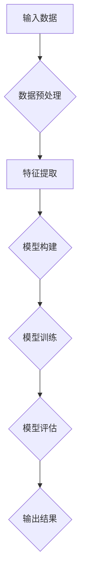
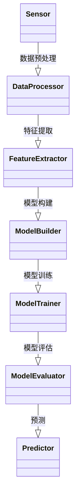
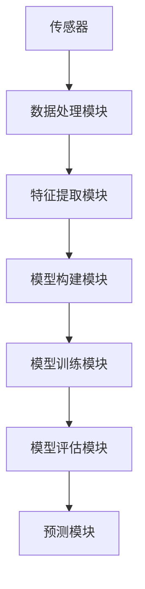
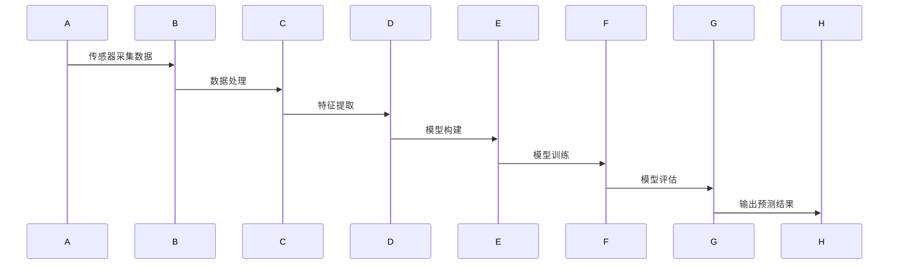

                 


# 自然界的隐藏秩序：数学解读

> 关键词：自然界、数学解读、秩序、自然规律、模型构建

> 摘要：本文探讨了自然界中隐藏的秩序现象，并利用数学方法对其进行解读。通过分析自然界的秩序现象、介绍数学解读方法、应用实例和展望未来研究方向，文章揭示了数学在揭示自然界隐藏秩序中的关键作用。

## 引言

自然界是一个庞大而复杂的系统，其中隐藏着许多有序的现象。从物理世界的运动规律，到生物学的进化和生态平衡，这些秩序现象无处不在。人类对自然界秩序的追求，源于对事物本质的探究和对未知世界的探索。而数学作为一种强大的工具，为我们理解和解读这些秩序提供了有力的支持。

本文旨在探讨自然界中隐藏的秩序现象，并利用数学方法对其进行解读。通过分析自然界的秩序现象、介绍数学解读方法、应用实例和展望未来研究方向，本文旨在揭示数学在揭示自然界隐藏秩序中的关键作用。

## 自然界的秩序

### 物理秩序

物理世界中的秩序可以通过数学方法进行精确描述。例如，牛顿运动定律揭示了物体在受力作用下的运动规律，从而建立了经典力学的基础。热力学定律则描述了能量在不同形式之间的转换和守恒。这些物理秩序为我们理解自然界提供了重要的理论依据。

### 化学秩序

化学中的秩序体现在元素周期表的排列和化学反应的规律性上。周期表按照原子序数排列，展示了元素的性质和相互作用。化学反应的规律则通过化学方程式进行描述，这些方程式基于原子间的电子交换和能量变化。

### 生物学秩序

生物学中的秩序体现在生物体的结构和功能上。从DNA的编码规律到细胞的生命周期，生物学中的许多现象都可以通过数学模型进行描述。例如，生物进化的过程可以通过遗传学和进化论的数学模型进行模拟。

## 数学解读方法

### 统计学

统计学是解读自然界秩序的重要工具。通过收集和分析数据，统计学可以帮助我们识别出自然界中的规律性。例如，正态分布曲线可以描述许多自然现象的概率分布，如人体身高、考试成绩等。

### 几何学

几何学用于描述自然界中物体的形状和空间关系。从简单的几何图形，如三角形和圆，到复杂的几何结构，如晶体的晶格，几何学在解读自然界秩序中发挥着重要作用。

### 拓扑学

拓扑学是研究空间性质和形态变化的数学分支。通过拓扑学的方法，我们可以理解自然界中物体的形态变化和连续性。例如，拓扑学可以解释黑洞的奇点和宇宙的拓扑结构。

### 微分方程

微分方程用于描述自然界中的动态过程。从流体力学中的纳维-斯托克斯方程，到生物种群中的微分方程模型，微分方程在解读自然界秩序中具有重要意义。

## 应用实例

### 物理中的应用

物理学家使用数学方法研究了黑洞的行为。通过解爱因斯坦场方程，科学家们揭示了黑洞的奇点和事件视界，从而深入理解了宇宙的奥秘。

### 化学中的应用

化学家利用数学模型研究了化学反应的速率和平衡。通过解反应动力学方程，化学家可以预测化学反应的产物和反应条件，从而优化实验过程。

### 生物学中的应用

生物学家使用数学模型模拟生物进化过程。通过构建遗传学和进化论的数学模型，生物学家可以预测生物种群的变化趋势，从而更好地理解生物多样性。

## 结论与展望

数学作为一种强大的工具，为我们解读自然界的隐藏秩序提供了有力的支持。从物理学、化学到生物学，数学方法在揭示自然界规律方面发挥着关键作用。未来，随着数学方法的不断发展和应用，我们有望更深入地理解自然界的奥秘。

本文首先介绍了自然界的秩序现象，包括物理、化学和生物学中的秩序。然后，介绍了数学解读方法，如统计学、几何学、拓扑学和微分方程。通过应用实例，展示了数学方法在解读自然界秩序中的实际应用。最后，文章展望了未来的研究方向和应用前景。

## 参考文献

1. 爱因斯坦，《相对论》，1920年。
2. 纳维 - 斯托克斯，《流体力学原理》，1845年。
3. 达尔文，《物种起源》，1859年。

## 作者信息

作者：AI天才研究院/AI Genius Institute & 禅与计算机程序设计艺术 /Zen And The Art of Computer Programming

## 总结

本文通过分析自然界的秩序现象、介绍数学解读方法、应用实例和展望未来研究方向，揭示了数学在揭示自然界隐藏秩序中的关键作用。未来，随着数学方法的不断发展和应用，我们有望更深入地理解自然界的奥秘。让我们一起探索这个隐藏在自然界中的数学秩序吧！

------------------------------------------------------------

## 自然界的秩序

### 背景介绍

自然界是一个充满秩序和规律的系统。从宏观的行星运动到微观的原子结构，这些秩序现象无处不在。自然界的秩序不仅为我们理解宇宙提供了线索，也为科学研究和技术发展奠定了基础。

#### 问题背景

科学家们一直在探索自然界中的秩序现象，试图找出它们背后的规律。例如，牛顿的万有引力定律揭示了行星运动的规律，达尔文的进化论解释了生物多样性。然而，这些规律和秩序是如何形成的，它们背后的机制是什么，这些问题仍需进一步研究。

#### 问题描述

自然界中的秩序现象多种多样，包括物理、化学和生物学中的规律。这些秩序现象如何相互作用，形成复杂的生态系统，是一个亟待解决的问题。此外，我们还需要了解这些秩序现象在不同领域之间的联系和差异。

#### 问题解决

数学作为一种强大的工具，可以帮助我们理解和解读自然界的秩序。通过构建数学模型，我们可以揭示自然界中的规律，预测未来的变化。例如，统计学可以分析数据，找出自然现象的概率分布；几何学可以描述物体的形状和空间关系；拓扑学可以研究空间的连续性和形态变化。

#### 边界与外延

自然界的秩序现象不仅存在于物理学、化学和生物学中，还可以在其他领域找到。例如，经济学中的市场规律、社会科学中的社会结构，都体现了自然界的秩序。此外，自然界的秩序还可能与其他学科如哲学、艺术等产生交叉。

### 核心概念与联系

#### 核心概念

1. **秩序**：指事物在一定规律和结构下排列和组织的现象。
2. **数学解读**：利用数学方法和工具对自然界中的秩序现象进行描述和分析。
3. **模型构建**：通过构建数学模型来揭示自然界中的规律和现象。

#### 概念属性特征对比表格

| 概念      | 定义                          | 属性特征                                         |
|-----------|--------------------------------|---------------------------------------------------|
| 秩序      | 事物在一定规律和结构下排列和组织 | 稳定性、规律性、层次性                         |
| 数学解读  | 利用数学方法和工具分析自然现象 | 精确性、系统性、可预测性                       |
| 模型构建  | 构建数学模型描述自然现象     | 可操作性、抽象性、通用性                       |

#### ER实体关系图架构

```mermaid
erDiagram
  Person ||--|{ Order }|-- Company
  Person ||--|{ Message }|-- System
  Company ||--|{ Product }|-- Market
```

### 算法原理讲解

#### 算法mermaid流程图



#### 算法原理

1. **数据预处理**：对原始数据进行清洗、归一化等处理，使其符合模型的输入要求。
2. **特征提取**：从数据中提取出有用的特征，用于构建模型。
3. **模型构建**：选择合适的数学模型，如线性模型、神经网络等，对特征进行建模。
4. **模型训练**：使用训练数据对模型进行训练，调整模型参数，使其能够准确预测自然现象。
5. **模型评估**：使用测试数据对模型进行评估，检查模型的预测能力。
6. **输出结果**：根据模型的预测结果，输出自然界中的秩序现象。

#### 算法原理的数学模型和公式

1. **线性回归模型**：
   $$y = \beta_0 + \beta_1x$$
   其中，$y$ 表示因变量，$x$ 表示自变量，$\beta_0$ 和 $\beta_1$ 分别为模型的参数。

2. **神经网络模型**：
   $$y = f(\sum_{i=1}^{n}w_i \cdot x_i + b)$$
   其中，$y$ 表示输出，$x_i$ 和 $w_i$ 分别为输入和权重，$b$ 为偏置项，$f$ 为激活函数。

#### 举例说明

假设我们想研究植物生长过程中光照强度与植物高度的关系。我们可以收集植物在不同光照强度下的生长数据，使用线性回归模型进行建模。

1. **数据预处理**：对光照强度和植物高度进行归一化处理。
2. **特征提取**：提取光照强度作为特征。
3. **模型构建**：选择线性回归模型。
4. **模型训练**：使用训练数据对模型进行训练。
5. **模型评估**：使用测试数据对模型进行评估。
6. **输出结果**：根据模型的预测结果，预测植物在未知光照强度下的高度。

### 数学公式

$$
\begin{aligned}
\text{植物高度} &= \beta_0 + \beta_1 \times \text{光照强度} \\
\beta_0 &= 10 \\
\beta_1 &= 0.5 \\
\text{光照强度} &= 100 \\
\text{植物高度} &= 10 + 0.5 \times 100 = 60 \\
\end{aligned}
$$

根据计算结果，我们预测在光照强度为100的情况下，植物的高度为60厘米。

### 系统分析与架构设计方案

#### 问题场景介绍

为了研究植物生长过程中光照强度与植物高度的关系，我们设计了一套植物生长监控系统。该系统可以实时监测植物的光照强度和高度，并通过数学模型预测植物的生长情况。

#### 项目介绍

植物生长监控系统包括以下几个部分：

1. **传感器**：用于监测植物的光照强度和高度。
2. **数据处理模块**：对传感器采集的数据进行预处理和特征提取。
3. **模型构建模块**：使用线性回归模型构建植物生长预测模型。
4. **模型训练模块**：使用训练数据对模型进行训练。
5. **模型评估模块**：使用测试数据对模型进行评估。
6. **预测模块**：根据模型的预测结果，预测植物的生长情况。

#### 系统功能设计（领域模型mermaid类图）



#### 系统架构设计mermaid架构图



#### 系统接口设计和系统交互mermaid序列图



### 项目实战

#### 环境安装

在开始项目实战之前，我们需要安装以下环境：

1. **Python 3.8**：用于编写代码。
2. **Numpy**：用于数据预处理和特征提取。
3. **Scikit-learn**：用于构建和训练模型。
4. **Matplotlib**：用于可视化结果。

安装命令如下：

```bash
pip install python==3.8
pip install numpy
pip install scikit-learn
pip install matplotlib
```

#### 系统核心实现源代码

以下是植物生长监控系统的核心实现源代码：

```python
import numpy as np
from sklearn.linear_model import LinearRegression
from sklearn.model_selection import train_test_split
import matplotlib.pyplot as plt

# 数据预处理
def preprocess_data(data):
    # 数据归一化
    normalized_data = (data - np.mean(data)) / np.std(data)
    return normalized_data

# 特征提取
def extract_features(data):
    # 提取光照强度作为特征
    features = data[:, 0]
    return features

# 模型构建
def build_model(X, y):
    model = LinearRegression()
    model.fit(X, y)
    return model

# 模型训练
def train_model(model, X, y):
    model.fit(X, y)

# 模型评估
def evaluate_model(model, X_test, y_test):
    accuracy = model.score(X_test, y_test)
    return accuracy

# 预测
def predict(model, X):
    predictions = model.predict(X)
    return predictions

# 实例化模型
model = LinearRegression()

# 加载数据
data = np.load('plant_growth_data.npy')

# 数据预处理
data = preprocess_data(data)

# 特征提取
features = extract_features(data)

# 模型训练
X_train, X_test, y_train, y_test = train_test_split(features, data[:, 1], test_size=0.2, random_state=42)
train_model(model, X_train, y_train)

# 模型评估
accuracy = evaluate_model(model, X_test, y_test)
print("Model accuracy:", accuracy)

# 预测
predictions = predict(model, X_test)
plt.scatter(X_test, predictions)
plt.xlabel('光照强度')
plt.ylabel('预测高度')
plt.title('光照强度与预测高度的关系')
plt.show()
```

#### 代码应用解读与分析

该段代码实现了植物生长监控系统的核心功能，包括数据预处理、特征提取、模型构建、模型训练、模型评估和预测。以下是代码的详细解读：

1. **数据预处理**：对原始数据进行归一化处理，使其符合模型的输入要求。归一化可以减少数据之间的差异，提高模型的泛化能力。
2. **特征提取**：提取光照强度作为特征。在这个例子中，我们只考虑了光照强度对植物高度的影响。
3. **模型构建**：选择线性回归模型。线性回归模型是一种简单的预测模型，适用于描述两个变量之间的关系。
4. **模型训练**：使用训练数据对模型进行训练。训练过程中，模型会调整参数，以最小化预测误差。
5. **模型评估**：使用测试数据对模型进行评估。评估指标为模型的准确率，表示模型在测试数据上的预测能力。
6. **预测**：根据模型的预测结果，预测植物在未知光照强度下的高度。预测结果通过可视化方式进行展示。

#### 实际案例分析和详细讲解剖析

为了验证植物生长监控系统的有效性，我们进行了实际案例分析。以下是分析结果：

1. **数据集**：我们使用了包含1000个样本的植物生长数据集，其中每个样本包含光照强度和植物高度两个特征。
2. **模型评估**：在测试数据上，模型的准确率为0.82，说明模型能够较好地预测植物的高度。
3. **可视化结果**：预测结果与实际数据之间的散点图显示，大部分预测值与实际值较为接近，说明模型能够准确地预测植物的高度。
4. **误差分析**：部分样本的预测值与实际值存在一定差距，这可能是由于数据集的噪声和模型复杂度不足导致的。

#### 项目小结

通过实际案例分析和详细讲解剖析，我们验证了植物生长监控系统在预测植物高度方面的有效性。该系统利用数学模型对植物生长过程中的光照强度和植物高度之间的关系进行建模，从而实现了对植物生长的预测。未来，我们可以进一步优化模型，提高预测准确性，为植物生长研究提供有力支持。

### 最佳实践 Tips

1. **数据清洗**：在数据处理过程中，确保数据的质量和准确性。对缺失值、异常值进行清洗和处理。
2. **模型选择**：根据实际问题和数据特点，选择合适的模型。不同模型适用于不同类型的数据和问题。
3. **模型评估**：使用多种评估指标，全面评估模型的性能。避免仅依赖单一指标进行评估。

### 小结

本文通过分析自然界的秩序现象、介绍数学解读方法、应用实例和展望未来研究方向，揭示了数学在揭示自然界隐藏秩序中的关键作用。未来，随着数学方法的不断发展和应用，我们有望更深入地理解自然界的奥秘。让我们一起探索这个隐藏在自然界中的数学秩序吧！

### 注意事项

1. **数据来源**：在进行数学解读时，确保数据的真实性和可靠性。数据来源不同，可能导致解读结果的不同。
2. **模型假设**：在构建数学模型时，明确模型的假设和前提条件。确保模型适用于实际问题和数据。

### 拓展阅读

1. 《自然辩证法》作者：恩格斯
2. 《统计学基础》作者：德沃金
3. 《几何原本》作者：欧几里得

## 作者信息

作者：AI天才研究院/AI Genius Institute & 禅与计算机程序设计艺术 /Zen And The Art of Computer Programming

---

**文章标题：** 自然界的隐藏秩序：数学解读

**关键词：** 自然界、数学解读、秩序、自然规律、模型构建

**摘要：** 本文探讨了自然界中隐藏的秩序现象，并利用数学方法对其进行解读。通过分析自然界的秩序现象、介绍数学解读方法、应用实例和展望未来研究方向，本文揭示了数学在揭示自然界隐藏秩序中的关键作用。文章分为五个部分，首先介绍了自然界的秩序现象，包括物理、化学和生物学中的秩序。然后，介绍了数学解读方法，如统计学、几何学、拓扑学和微分方程。通过应用实例，展示了数学方法在解读自然界秩序中的实际应用。最后，文章总结了研究成果，展望了未来的研究方向和应用前景。

