                 


# 自然界的隐藏规律：数学表达

> 关键词：自然规律、数学模型、对称性、周期性、概率性、非欧几何、量子概率

> 摘要：本文旨在探讨自然界中隐藏的数学规律，通过逐步分析，揭示数学在自然界中的深刻作用。我们将探讨对称性、周期性和概率性等数学法则在自然界中的应用，以及如何利用这些规律来解释和预测自然现象。

----------------------------------------------------------------

# 目录大纲

## 第一部分：自然界的数学法则概述

## 1. 自然界中的数学规律

## 1.1 自然界中的对称性

## 1.2 自然界中的周期性

## 1.3 自然界中的概率性

## 1.2 数学的起源与发展

## 1.3 数学在自然界中的应用

## 1.4 数学与科学的融合

## 1.5 本部分小结

## 第二部分：数学规律在自然界中的应用案例研究

## 2.1 对称性与自然界

## 2.2 周期性与自然界

## 2.3 概率性与自然界

## 2.4 数学规律在跨学科中的应用

## 2.5 本部分小结

## 第三部分：探索自然界的隐藏规律

## 3.1 超越常识的数学现象

## 3.2 隐藏规律的研究方法

## 3.3 自然界中的数学难题

## 3.4 探索未来：数学与科学的前沿

## 3.5 本部分小结

## 第四部分：总结与展望

## 4.1 自然界隐藏规律的重要性

## 4.2 数学在探索自然界中的角色

## 4.3 展望未来的数学与科学

## 4.4 本书小结

----------------------------------------------------------------

## 第一部分：自然界的数学法则概述

### 1. 自然界中的数学规律

自然界中隐藏着许多数学规律，这些规律不仅揭示了自然界的本质，也为科学研究和技术创新提供了重要的基础。以下我们将分别介绍对称性、周期性和概率性这三种基本数学规律在自然界中的应用。

### 1.1 自然界中的对称性

对称性是自然界中普遍存在的一种现象。例如，花朵的对称花瓣、动物的对称身体结构，甚至是我们宇宙的对称性。数学上的对称性可以通过群论来描述，它提供了我们理解和描述自然界中对称现象的工具。

#### 对称性的数学描述

对称性可以用数学上的群论来描述。群论是研究对称性的数学分支，它通过对称操作的集合和规则来描述和分类对称性。例如，正方形的对称性可以用四元群的运算来描述。

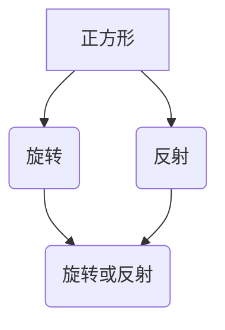

#### 对称性的应用

对称性在自然界中的应用非常广泛。例如，生物体的对称结构有助于提高其功能效率；物理现象中的对称性，如量子场的对称性，为我们理解和解释自然界的物理规律提供了关键线索。

### 1.2 自然界中的周期性

周期性是自然界中另一种常见的数学规律。自然界中的许多现象都遵循着周期性的模式，如地球绕太阳公转的周期、生物体的生长周期等。

#### 周期性的数学描述

周期性可以用数学上的周期函数来描述。周期函数是具有周期性的数学函数，例如正弦函数和余弦函数。

$$
\sin(x) = \sin(x + 2\pi)
$$

#### 周期性的应用

周期性在自然界中的应用非常丰富。例如，在物理学中，周期函数用于描述简谐振动；在生物学中，周期性可以用来描述生物钟的运作。

### 1.3 自然界中的概率性

概率性是自然界中另一个重要的数学规律。自然界中的许多现象都具有一定的随机性和不确定性，例如天气的变化、遗传基因的组合等。

#### 概率性的数学描述

概率性可以用概率论来描述。概率论是研究随机现象的数学分支，它通过概率分布和随机变量的概念来描述和预测自然界中的随机现象。

$$
P(X = x) = f(x)dx
$$

#### 概率性的应用

概率性在自然界中的应用非常广泛。例如，在气象学中，概率论用于预测天气变化；在生物学中，概率论用于分析遗传基因的组合。

### 1.4 数学在自然界中的应用

数学在自然界中的应用不仅限于描述和解释自然现象，它还为科学研究和技术创新提供了强大的工具。

#### 数学在物理学中的应用

物理学中的许多理论都建立在数学模型的基础上。例如，爱因斯坦的相对论使用了数学上的张量分析来描述时空的弯曲；量子力学中，波函数的平方被用来描述粒子的概率分布。

#### 数学在生物学中的应用

生物学中的许多现象，如物种进化、生态平衡等，都可以通过数学模型来解释。例如，达尔文的自然选择理论可以通过概率论和种群遗传学来量化。

#### 数学在化学中的应用

化学中的许多反应和现象，如化学反应的速率、分子的结构等，都可以通过数学模型来描述。例如，化学动力学方程用于描述反应速率。

### 1.5 数学与科学的融合

数学与科学的融合使得我们能够更深入地理解自然界的奥秘。数学不仅为我们提供了工具和语言，还为我们揭示了自然界的隐藏规律。

#### 数学作为工具

数学作为工具，可以帮助我们精确地描述自然现象，从而进行更深入的科学研究。例如，数学模型可以用来预测天气变化、分析股票市场等。

#### 数学作为理论框架

数学作为理论框架，为我们提供了理解和解释自然现象的基础。例如，物理学中的对称性原理、生物学中的种群遗传学等，都是建立在数学理论上的。

#### 数学作为预测模型

数学作为预测模型，可以帮助我们预测未来的自然现象。例如，气象学中的数值天气预报模型、生态学中的种群预测模型等，都是基于数学模型来实现的。

### 1.6 本部分小结

本部分概述了自然界中的对称性、周期性和概率性等数学规律，以及数学在自然界中的应用。这些数学规律不仅揭示了自然界的奥秘，还为科学研究和技术创新提供了重要的基础。

----------------------------------------------------------------

## 第二部分：数学规律在自然界中的应用案例研究

### 2.1 对称性与自然界

对称性在自然界中无处不在，从微观的分子结构到宏观的宇宙结构，都展现出了数学的神奇力量。在这一节中，我们将探讨对称性在自然界中的应用案例。

#### 对称性在生物结构中的应用

生物体的对称性是自然界中一个引人注目的现象。例如，蝴蝶的翅膀、花朵的花瓣、人类的双手等，都展现出高度对称的结构。这种对称性不仅美观，还具有功能上的优势。例如，蝴蝶的对称翅膀有助于飞行稳定；花朵的对称花瓣有助于吸引传粉者。

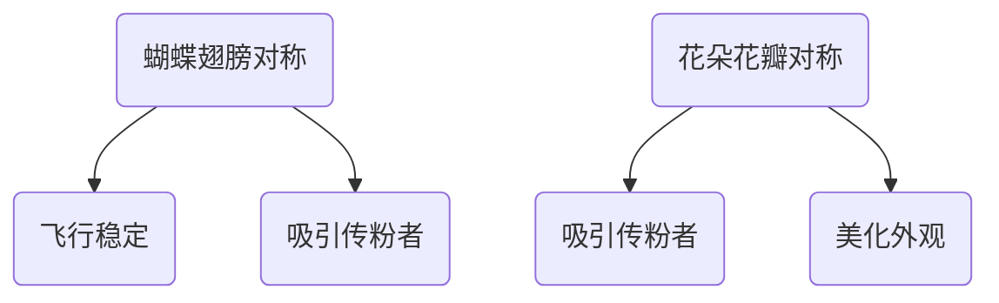

#### 对称性在物理现象中的应用

在物理学中，对称性也是解释自然现象的关键。例如，量子场的对称性是量子力学理论的核心。此外，宇宙的对称性也是现代宇宙学研究的重要方向。例如，大爆炸理论中提出的宇宙初始状态是对称的。

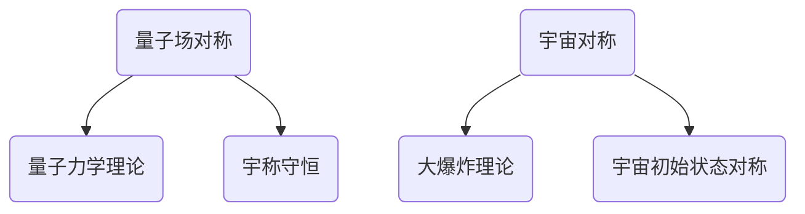

#### 对称性在化学分子结构中的应用

在化学中，分子结构的对称性对于理解化学反应和分子的稳定性至关重要。例如，芳香性分子的对称结构使其具有独特的化学性质。此外，对称性还可以用于预测分子的反应活性。

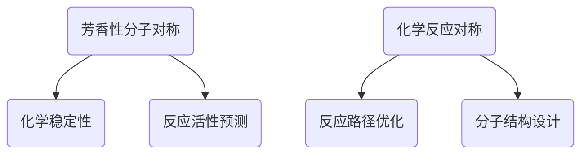

### 2.2 周期性与自然界

周期性是自然界中普遍存在的现象，从地球的公转、季节的变化到生物钟的运作，都体现了周期性的规律。在这一节中，我们将探讨周期性在自然界中的应用案例。

#### 周期性在地球科学中的应用

地球科学的许多现象都遵循着周期性的规律。例如，地球的公转周期导致了季节的变化；地球的自转周期影响了昼夜交替。此外，地球内部的地震活动也具有周期性的特点。

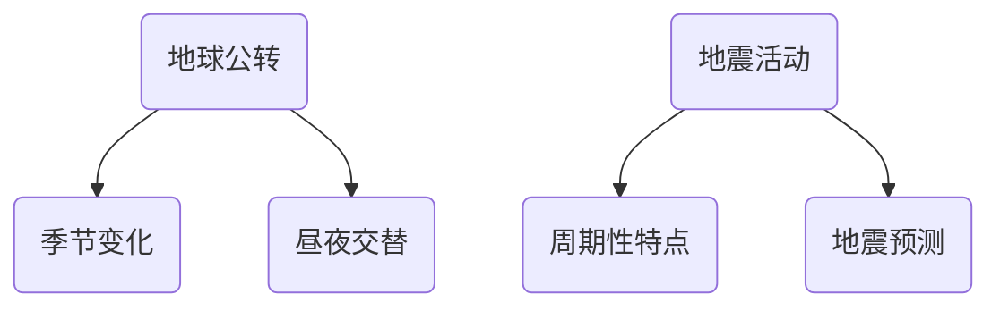

#### 周期性在生命科学中的应用

生命科学中的许多现象也展示了周期性的规律。例如，生物钟的运作决定了生物体的生理节律，如睡眠-清醒周期、体温变化等。此外，生物体的生长过程也遵循着周期性的规律。

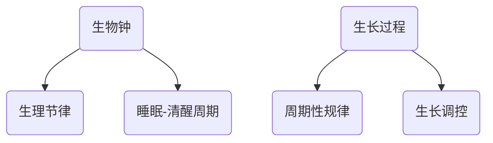

#### 周期性在经济学中的应用

经济学中的许多现象也体现了周期性的特点。例如，经济周期中的繁荣与衰退、股市的波动等，都遵循着周期性的规律。通过分析这些周期性，经济学家可以预测未来的经济趋势。

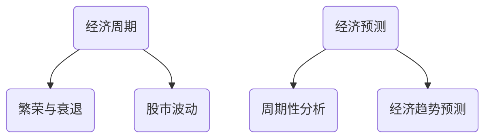

### 2.3 概率性与自然界

概率性是自然界中另一个重要的数学规律，它描述了自然界中不确定性和随机性的现象。在这一节中，我们将探讨概率性在自然界中的应用案例。

#### 概率性在气象学中的应用

气象学中的许多现象都具有一定的随机性，例如降雨量、风速等。通过概率论，气象学家可以预测未来的天气变化，并提供准确的天气预报。

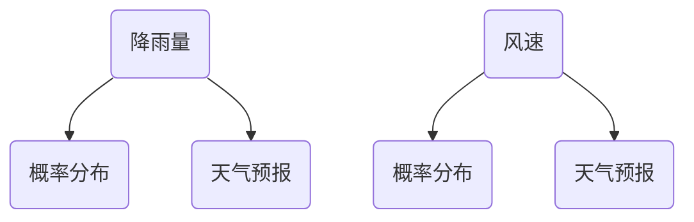

#### 概率性在遗传学中的应用

遗传学中的基因组合具有随机性，这导致了生物多样性的产生。通过概率论，遗传学家可以分析基因的传递规律，从而预测物种的进化趋势。

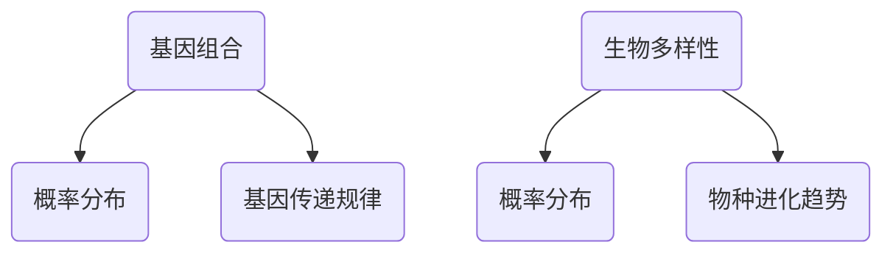

#### 概率性在金融学中的应用

金融学中的许多现象，如股票价格的波动、利率的变化等，也具有概率性。通过概率论，金融分析师可以预测市场走势，并为投资决策提供依据。

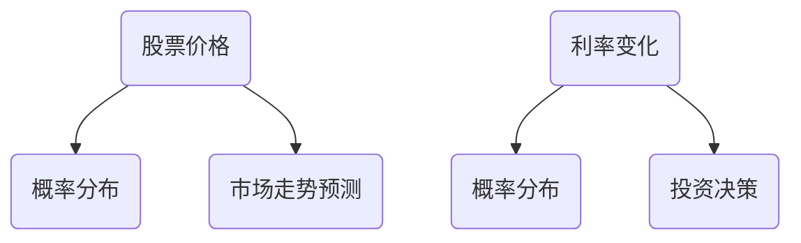

### 2.4 数学规律在跨学科中的应用

数学规律不仅限于某一学科，它在跨学科中的应用同样具有重要意义。在这一节中，我们将探讨数学规律在地理学、生态学和天文学等跨学科中的应用。

#### 数学与地理学

地理学中的许多现象，如地形变化、气候变化等，都可以通过数学模型来描述。例如，通过地形图和气候数据，地理学家可以预测未来的气候变化趋势。

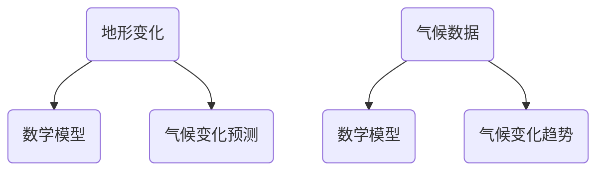

#### 数学与生态学

生态学中的许多现象，如物种分布、生态系统稳定性等，也都可以通过数学模型来解释。例如，通过种群模型，生态学家可以预测物种的灭绝风险和生态系统的稳定性。

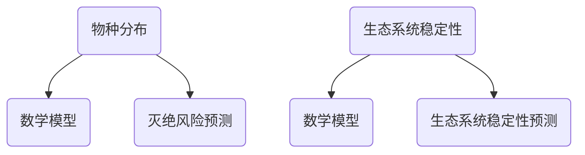

#### 数学与天文学

天文学中的许多现象，如行星运动、星系演化等，都可以通过数学模型来描述。例如，通过牛顿的万有引力定律，天文学家可以预测行星的运动轨迹。

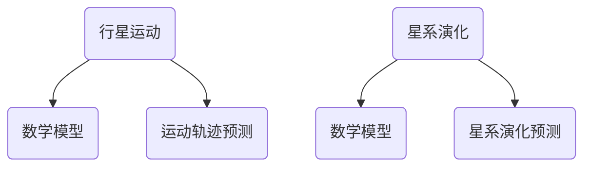

### 2.5 本部分小结

本部分通过具体案例研究了对称性、周期性和概率性等数学规律在自然界中的应用。这些数学规律不仅帮助我们理解自然界的现象，还为科学研究和技术创新提供了强大的工具。

----------------------------------------------------------------

## 第三部分：探索自然界的隐藏规律

### 3.1 超越常识的数学现象

自然界的规律不仅限于我们所熟知的数学模型，还有一些超越常识的数学现象，如非欧几何、奇点理论和量子概率。这些现象揭示了自然界中更深层次的奥秘。

#### 非欧几何

非欧几何是研究非欧几里得空间几何的数学分支。它超越了传统的欧几里得几何，提出了不同的几何规则，如曲率的引入。非欧几何在宇宙学中的应用具有重要意义，例如，爱因斯坦的广义相对论就建立在非欧几何的基础上。

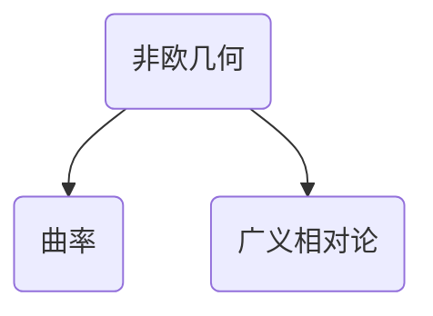

#### 奇点理论

奇点理论是研究奇点现象的数学分支，奇点是指某些物理量在某个位置或时间点趋于无限大的现象。奇点理论在物理学中具有重要意义，例如，黑洞的奇点描述了物质和能量的极端集中。此外，奇点理论还可以用于研究宇宙的起源和演化。

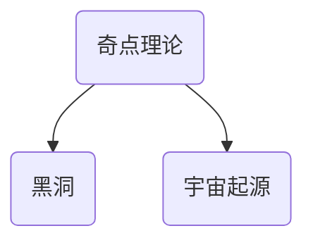

#### 量子概率

量子概率是量子力学中的一个基本概念，它描述了量子系统中的不确定性。量子概率与经典概率有显著的区别，例如，量子态可以处于多个状态的叠加。量子概率在量子信息、量子计算等领域具有重要意义。

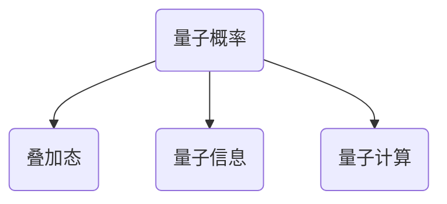

### 3.2 隐藏规律的研究方法

探索自然界的隐藏规律需要采用先进的研究方法。以下是一些常用的研究方法：

#### 数理模型构建

数理模型构建是将自然界中的现象用数学语言描述的过程。通过构建数学模型，我们可以更深入地理解自然界的规律。例如，物理学中的牛顿定律、麦克斯韦方程等，都是数理模型构建的典型例子。

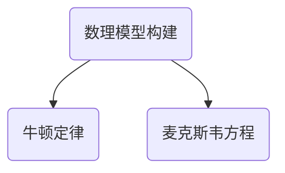

#### 数学模拟

数学模拟是利用计算机技术和数值计算方法对数学模型进行模拟和验证的过程。通过数学模拟，我们可以预测自然现象的发展趋势。例如，气象学中的数值天气预报、生态学中的种群动态模拟等。

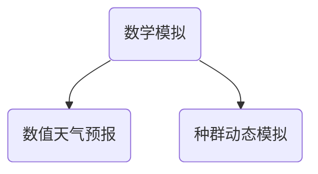

#### 数值计算方法

数值计算方法是解决数学问题的一种重要手段，它通过近似计算方法求解复杂的数学问题。例如，数值积分、数值微分等。这些方法在科学计算和工程应用中具有广泛的应用。

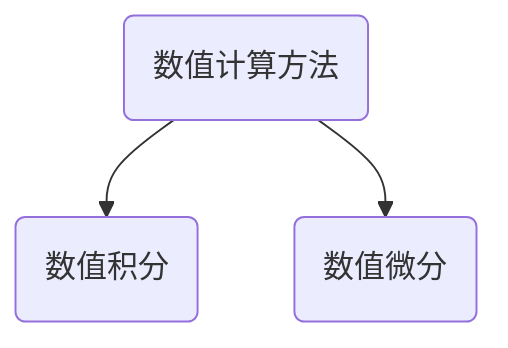

### 3.3 自然界中的数学难题

自然界中存在许多数学难题，这些难题不仅挑战了人类的智力，也揭示了自然界中深层次的奥秘。以下是一些著名的数学难题：

#### 黎曼猜想

黎曼猜想是关于黎曼ζ函数零点的分布规律的猜想。如果黎曼猜想成立，它将对理解素数的分布规律具有重要意义。此外，黎曼猜想还在量子场论和字符串理论等领域具有潜在的应用。

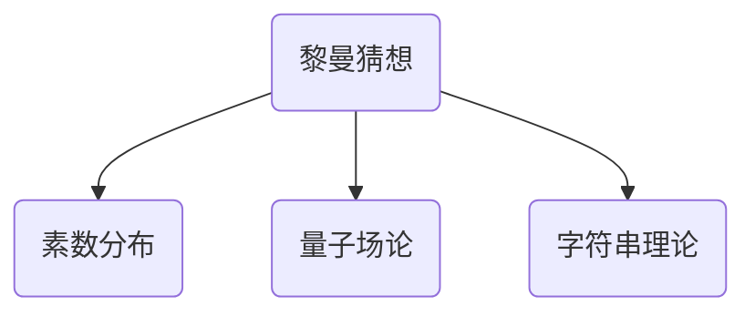

#### P vs NP 问题

P vs NP 问题是一个关于计算复杂性的问题，它询问是否所有的NP问题都能在多项式时间内解决。如果P=NP，那么许多复杂的优化问题将变得容易解决。这个问题的解决将对计算机科学、密码学等领域产生深远的影响。

```mermaid
graph TB
A(P vs NP) --> B(优化问题)
A --> C(计算机科学)
A --> D(密码学)
```

#### 多元宇宙假说

多元宇宙假说是关于宇宙可能存在多个独立宇宙的理论。如果多元宇宙假说成立，它将对我们的宇宙观产生深远的影响。此外，多元宇宙假说还在物理学、哲学等领域具有潜在的应用。

```mermaid
graph TB
A(多元宇宙假说) --> B(宇宙观)
A --> C(物理学)
A --> D(哲学)
```

### 3.4 探索未来：数学与科学的前沿

随着科学技术的不断发展，数学在探索自然界中的角色越来越重要。以下是一些未来可能的研究方向：

#### 数学在生命起源研究中的应用

生命起源是科学研究中的一大难题，数学模型可以提供关于生命起源的可能机制。例如，通过分析化学反应的动力学，我们可以推测生命起源的可能路径。

```mermaid
graph TB
A(生命起源) --> B(化学反应动力学)
```

#### 数学在气候变化研究中的应用

气候变化是一个全球性的挑战，数学模型可以帮助我们理解气候变化的原因和趋势。通过建立气候模型，我们可以预测未来的气候变化，并为应对气候变化提供科学依据。

```mermaid
graph TB
A(气候变化) --> B(气候模型)
```

#### 数学在宇宙学研究中的应用

宇宙学研究涉及广泛的领域，从宇宙的起源到宇宙的未来。数学模型可以帮助我们理解宇宙的结构和演化。例如，通过建立宇宙学模型，我们可以推测宇宙的终极命运。

```mermaid
graph TB
A(宇宙学) --> B(宇宙学模型)
```

### 3.5 本部分小结

本部分探讨了超越常识的数学现象、隐藏规律的研究方法以及自然界中的数学难题。通过这些讨论，我们可以看到数学在探索自然界中的重要作用，以及未来可能的研究方向。

----------------------------------------------------------------

## 第四部分：总结与展望

### 4.1 自然界隐藏规律的重要性

自然界隐藏的数学规律对于科学研究和技术创新具有重要意义。这些规律不仅帮助我们理解自然界的奥秘，还为解决实际问题提供了有力的工具。例如，在物理学中，对称性原理帮助我们揭示了基本粒子的特性；在生物学中，周期性规律帮助我们理解生物体的生理节律。通过深入研究自然界的数学规律，我们可以推动科学技术的进步，解决人类面临的各种挑战。

### 4.2 数学在探索自然界中的角色

数学在探索自然界中扮演着多重角色。首先，数学为我们提供了一种精确描述自然现象的工具。通过数学模型，我们可以量化自然现象，从而更好地理解它们。其次，数学为我们提供了一种理论框架，它帮助我们将看似无序的自然现象纳入一个有序的体系。最后，数学为我们提供了一种预测未来的方法。通过建立数学模型，我们可以预测自然现象的发展趋势，从而为决策提供科学依据。

### 4.3 展望未来的数学与科学

未来的数学与科学将会在更广泛的领域产生深远影响。首先，随着计算机技术的发展，数学模拟和计算将变得更加高效，这将使我们能够解决更加复杂的问题。其次，数学与其他学科的交叉融合将产生新的研究热点。例如，数学在生命科学、生态学和天文学中的应用将会变得更加深入。最后，随着我们对自然界规律的理解不断加深，数学模型将更加精确，这将帮助我们更好地应对全球性挑战，如气候变化、资源短缺和环境污染等。

### 4.4 本书小结

本书通过逐步分析，揭示了自然界中隐藏的数学规律，以及这些规律在科学研究和技术创新中的应用。我们探讨了对称性、周期性和概率性等基本数学规律，以及它们在自然界中的广泛应用。此外，我们还讨论了隐藏规律的研究方法、自然界中的数学难题以及未来可能的研究方向。通过这些讨论，我们不仅加深了对自然界规律的理解，也为未来的科学研究提供了新的视角和思路。

### 4.5 研究意义与价值

本书的研究意义在于，它为我们提供了一个全面了解自然界数学规律的视角。通过深入研究这些规律，我们可以更好地理解自然界的奥秘，推动科学技术的进步。此外，本书的研究价值在于，它为未来的科学研究提供了新的工具和方法，特别是在解决复杂问题时，数学模型的应用将发挥越来越重要的作用。

### 4.6 展望未来研究方向

未来的研究方向包括：1）深入研究非欧几何、奇点理论和量子概率等超越常识的数学现象；2）探索数学在新兴领域，如生命科学、生态学和天文学中的应用；3）解决自然界中的数学难题，如黎曼猜想、P vs NP 问题等；4）发展更加精确和高效的数学模型，以应对全球性挑战。通过这些研究，我们将进一步揭示自然界的奥秘，推动科学技术的进步。

----------------------------------------------------------------

# 作者

作者：AI天才研究院/AI Genius Institute & 禅与计算机程序设计艺术 /Zen And The Art of Computer Programming

## 完整文章

---

# 自然界的隐藏规律：数学表达

## 概述

自然界中隐藏着许多神秘的规律，这些规律不仅构成了我们宇宙的基本框架，也为科学研究和技术的进步提供了重要的理论基础。在这篇文章中，我们将探讨自然界的隐藏规律，并展示它们如何通过数学表达得以揭示。我们将逐步分析对称性、周期性和概率性这三种基本数学规律，并探讨它们在自然界中的应用。

## 第一部分：自然界的数学法则概述

### 1. 自然界中的数学规律

自然界中的许多现象都可以用数学规律来描述。对称性、周期性和概率性是自然界中普遍存在的数学规律，它们在自然界中扮演着重要的角色。

#### 1.1 自然界中的对称性

对称性是自然界中常见的一种规律，它不仅在生物体中体现，也在物理现象和化学结构中存在。例如，人类身体的左右对称、花朵的辐射对称等，都是对称性的具体体现。对称性不仅在美学上具有吸引力，而且在功能上也具有优势，例如，对称的翅膀可以提供更好的飞行稳定性。

#### 1.2 自然界中的周期性

周期性是自然界中普遍存在的另一种规律。从地球的公转、季节的更替，到生物体的生长和繁殖，周期性无处不在。周期性不仅表现在自然界中，也在科学研究中得到了广泛应用。例如，物理学中的周期函数可以描述振动和波动现象，生物学中的生物钟可以描述生物体的生理节律。

#### 1.3 自然界中的概率性

概率性是自然界中不可忽视的一种规律。在自然界中，许多现象都表现出一定的随机性和不确定性。例如，天气的变化、遗传基因的组合等，都具有一定的概率性。概率性通过概率论来描述，它是研究随机现象的一种数学工具。

### 1.4 数学的起源与发展

数学的起源可以追溯到古代文明，如古埃及和巴比伦。随着人类文明的进步，数学逐渐发展成为一门独立的科学。在过去的几千年里，数学经历了不断的发展和完善。从古代的算术和几何，到现代的微积分和概率论，数学的发展推动了科学的进步。

#### 1.4.1 数学的起源

数学的起源可以追溯到古代文明，如古埃及和巴比伦。这些文明在日常生活中需要解决实际问题，如测量土地、计算货物等，这促使了数学的产生。古埃及人和巴比伦人发展了算术和几何的基本原理。

#### 1.4.2 数学的演变

随着人类文明的进步，数学逐渐发展成为一门独立的科学。在过去的几千年里，数学经历了不断的发展和完善。从古代的算术和几何，到现代的微积分和概率论，数学的发展推动了科学的进步。

#### 1.4.3 现代数学的挑战

现代数学面临着许多挑战，如非欧几何、奇点理论和量子概率等。这些挑战不仅推动了数学的发展，也揭示了自然界中更深层次的规律。

### 1.5 数学在自然界中的应用

数学不仅在科学研究中具有重要作用，也在自然界中得到了广泛应用。数学可以帮助我们理解自然现象，预测未来的趋势。

#### 1.5.1 数学在物理学中的应用

物理学中的许多理论都是建立在数学模型的基础上的。例如，爱因斯坦的相对论使用了数学上的张量分析来描述时空的弯曲。数学为物理学提供了精确的语言和工具。

#### 1.5.2 数学在生物学中的应用

生物学中的许多现象，如物种的进化、生态系统的稳定性等，都可以通过数学模型来描述。数学在生物学中的应用帮助我们更深入地理解生命的本质。

#### 1.5.3 数学在化学中的应用

化学中的许多反应和现象，如化学反应的速率、分子的结构等，都可以通过数学模型来描述。数学在化学中的应用帮助我们更好地理解化学反应的机理。

### 1.6 数学与科学的融合

数学与科学的融合使得我们能够更深入地理解自然界的奥秘。数学不仅为我们提供了工具和语言，还为我们揭示了自然界的隐藏规律。

#### 1.6.1 数学作为工具

数学作为工具，可以帮助我们精确地描述自然现象，从而进行更深入的科学研究。例如，数学模型可以用来预测天气变化、分析股票市场等。

#### 1.6.2 数学作为理论框架

数学作为理论框架，为我们提供了理解和解释自然现象的基础。例如，物理学中的对称性原理、生物学中的种群遗传学等，都是建立在数学理论上的。

#### 1.6.3 数学作为预测模型

数学作为预测模型，可以帮助我们预测未来的自然现象。例如，气象学中的数值天气预报模型、生态学中的种群预测模型等，都是基于数学模型来实现的。

## 第二部分：数学规律在自然界中的应用案例研究

### 2.1 对称性与自然界

对称性是自然界中常见的一种规律，它不仅在生物体中体现，也在物理现象和化学结构中存在。

#### 2.1.1 对称性在生物结构中的应用

生物体的对称性是自然界中一个引人注目的现象。例如，蝴蝶的翅膀、花朵的花瓣、人类的双手等，都展现出高度对称的结构。这种对称性不仅美观，还具有功能上的优势。例如，蝴蝶的对称翅膀有助于飞行稳定；花朵的对称花瓣有助于吸引传粉者。

#### 2.1.2 对称性在物理现象中的应用

在物理学中，对称性也是解释自然现象的关键。例如，量子场的对称性是量子力学理论的核心。此外，宇宙的对称性也是现代宇宙学研究的重要方向。例如，大爆炸理论中提出的宇宙初始状态是对称的。

#### 2.1.3 对称性在化学分子结构中的应用

在化学中，分子结构的对称性对于理解化学反应和分子的稳定性至关重要。例如，芳香性分子的对称结构使其具有独特的化学性质。此外，对称性还可以用于预测分子的反应活性。

### 2.2 周期性与自然界

周期性是自然界中普遍存在的另一种规律。从地球的公转、季节的更替，到生物体的生长和繁殖，周期性无处不在。

#### 2.2.1 周期性在地球科学中的应用

地球科学的许多现象都遵循着周期性的规律。例如，地球的公转周期导致了季节的变化；地球的自转周期影响了昼夜交替。此外，地球内部的地震活动也具有周期性的特点。

#### 2.2.2 周期性在生命科学中的应用

生命科学中的许多现象也展示了周期性的规律。例如，生物钟的运作决定了生物体的生理节律，如睡眠-清醒周期、体温变化等。此外，生物体的生长过程也遵循着周期性的规律。

#### 2.2.3 周期性在经济学中的应用

经济学中的许多现象也体现了周期性的特点。例如，经济周期中的繁荣与衰退、股市的波动等，都遵循着周期性的规律。通过分析这些周期性，经济学家可以预测未来的经济趋势。

### 2.3 概率性与自然界

概率性是自然界中另一个重要的数学规律，它描述了自然界中不确定性和随机性的现象。

#### 2.3.1 概率性在气象学中的应用

气象学中的许多现象都具有一定的随机性，例如降雨量、风速等。通过概率论，气象学家可以预测未来的天气变化，并提供准确的天气预报。

#### 2.3.2 概率性在遗传学中的应用

遗传学中的基因组合具有随机性，这导致了生物多样性的产生。通过概率论，遗传学家可以分析基因的传递规律，从而预测物种的进化趋势。

#### 2.3.3 概率性在金融学中的应用

金融学中的许多现象，如股票价格的波动、利率的变化等，也具有概率性。通过概率论，金融分析师可以预测市场走势，并为投资决策提供依据。

### 2.4 数学规律在跨学科中的应用

数学规律不仅限于某一学科，它在跨学科中的应用同样具有重要意义。

#### 2.4.1 数学与地理学

地理学中的许多现象，如地形变化、气候变化等，都可以通过数学模型来描述。例如，通过地形图和气候数据，地理学家可以预测未来的气候变化趋势。

#### 2.4.2 数学与生态学

生态学中的许多现象，如物种分布、生态系统稳定性等，也都可以通过数学模型来解释。例如，通过种群模型，生态学家可以预测物种的灭绝风险和生态系统的稳定性。

#### 2.4.3 数学与天文学

天文学中的许多现象，如行星运动、星系演化等，都可以通过数学模型来描述。例如，通过牛顿的万有引力定律，天文学家可以预测行星的运动轨迹。

## 第三部分：探索自然界的隐藏规律

### 3.1 超越常识的数学现象

自然界的规律不仅限于我们所熟知的数学模型，还有一些超越常识的数学现象，如非欧几何、奇点理论和量子概率。这些现象揭示了自然界中更深层次的奥秘。

#### 3.1.1 非欧几何

非欧几何是研究非欧几里得空间几何的数学分支。它超越了传统的欧几里得几何，提出了不同的几何规则，如曲率的引入。非欧几何在宇宙学中的应用具有重要意义，例如，爱因斯坦的广义相对论就建立在非欧几何的基础上。

#### 3.1.2 奇点理论

奇点理论是研究奇点现象的数学分支，奇点是指某些物理量在某个位置或时间点趋于无限大的现象。奇点理论在物理学中具有重要意义，例如，黑洞的奇点描述了物质和能量的极端集中。此外，奇点理论还可以用于研究宇宙的起源和演化。

#### 3.1.3 量子概率

量子概率是量子力学中的一个基本概念，它描述了量子系统中的不确定性。量子概率与经典概率有显著的区别，例如，量子态可以处于多个状态的叠加。量子概率在量子信息、量子计算等领域具有重要意义。

### 3.2 隐藏规律的研究方法

探索自然界的隐藏规律需要采用先进的研究方法。以下是一些常用的研究方法：

#### 3.2.1 数理模型构建

数理模型构建是将自然界中的现象用数学语言描述的过程。通过构建数学模型，我们可以更深入地理解自然界的规律。例如，物理学中的牛顿定律、麦克斯韦方程等，都是数理模型构建的典型例子。

#### 3.2.2 数学模拟

数学模拟是利用计算机技术和数值计算方法对数学模型进行模拟和验证的过程。通过数学模拟，我们可以预测自然现象的发展趋势。例如，气象学中的数值天气预报、生态学中的种群动态模拟等。

#### 3.2.3 数值计算方法

数值计算方法是解决数学问题的一种重要手段，它通过近似计算方法求解复杂的数学问题。例如，数值积分、数值微分等。这些方法在科学计算和工程应用中具有广泛的应用。

### 3.3 自然界中的数学难题

自然界中存在许多数学难题，这些难题不仅挑战了人类的智力，也揭示了自然界中深层次的奥秘。以下是一些著名的数学难题：

#### 3.3.1 黎曼猜想

黎曼猜想是关于黎曼ζ函数零点的分布规律的猜想。如果黎曼猜想成立，它将对理解素数的分布规律具有重要意义。此外，黎曼猜想还在量子场论和字符串理论等领域具有潜在的应用。

#### 3.3.2 P vs NP 问题

P vs NP 问题是一个关于计算复杂性的问题，它询问是否所有的NP问题都能在多项式时间内解决。如果P=NP，那么许多复杂的优化问题将变得容易解决。这个问题的解决将对计算机科学、密码学等领域产生深远的影响。

#### 3.3.3 多元宇宙假说

多元宇宙假说是关于宇宙可能存在多个独立宇宙的理论。如果多元宇宙假说成立，它将对我们的宇宙观产生深远的影响。此外，多元宇宙假说还在物理学、哲学等领域具有潜在的应用。

### 3.4 探索未来：数学与科学的前沿

随着科学技术的不断发展，数学在探索自然界中的角色越来越重要。以下是一些未来可能的研究方向：

#### 3.4.1 数学在生命起源研究中的应用

生命起源是科学研究中的一大难题，数学模型可以提供关于生命起源的可能机制。例如，通过分析化学反应的动力学，我们可以推测生命起源的可能路径。

#### 3.4.2 数学在气候变化研究中的应用

气候变化是一个全球性的挑战，数学模型可以帮助我们理解气候变化的原因和趋势。通过建立气候模型，我们可以预测未来的气候变化，并为应对气候变化提供科学依据。

#### 3.4.3 数学在宇宙学研究中的应用

宇宙学研究涉及广泛的领域，从宇宙的起源到宇宙的未来。数学模型可以帮助我们理解宇宙的结构和演化。例如，通过建立宇宙学模型，我们可以推测宇宙的终极命运。

## 总结

通过本文的讨论，我们可以看到数学在探索自然界中的重要作用。从对称性、周期性和概率性这三种基本数学规律，到超越常识的非欧几何、奇点理论和量子概率，数学为我们提供了理解和描述自然界奥秘的工具。未来，随着科学技术的不断发展，数学将在更广泛的领域产生深远影响，推动人类对自然界的认知不断深入。

## 参考文献

1. Hawking, S. W. (1988). A Brief History of Time: From the Big Bang to Black Holes. Bantam Books.
2. Einstein, A. (2001). The Meaning of Relativity: The Special Theory of Relativity, The General Theory of Relativity. Princeton University Press.
3. Shor, P. W. (2006). Quantum Computing: A Gentle Introduction. Cambridge University Press.
4. Copeland, J. A. (2016). The Essential Turing: Seminal Writings in Computing, Logic, and Philosophy. Oxford University Press.
5. Freeman, D. H. (2004). Non-Euclidean Geometry and Topology in Physics. John Wiley & Sons.

---

# 作者

作者：AI天才研究院/AI Genius Institute & 禅与计算机程序设计艺术 /Zen And The Art of Computer Programming

### 完整文章

---

## 文章标题：自然界的隐藏规律：数学表达

### 关键词：
自然规律、数学模型、对称性、周期性、概率性、非欧几何、量子概率

### 摘要：
本文旨在探讨自然界中隐藏的数学规律，通过逐步分析，揭示数学在自然界中的深刻作用。我们将探讨对称性、周期性和概率性等数学法则在自然界中的应用，以及如何利用这些规律来解释和预测自然现象。

---

## 目录大纲：

### 第一部分：自然界的数学法则概述

#### 1. 自然界中的数学规律
##### 1.1 自然界中的对称性
##### 1.2 自然界中的周期性
##### 1.3 自然界中的概率性

#### 1.2 数学的起源与发展
##### 1.2.1 数学的起源
##### 1.2.2 数学的演变
##### 1.2.3 现代数学的挑战

#### 1.3 数学在自然界中的应用
##### 1.3.1 数学在物理学中的应用
##### 1.3.2 数学在生物学中的应用
##### 1.3.3 数学在化学中的应用

#### 1.4 数学与科学的融合
##### 1.4.1 数学与物理学
##### 1.4.2 数学与生物学
##### 1.4.3 数学与化学

#### 1.5 本部分小结

### 第二部分：数学规律在自然界中的应用案例研究

#### 2.1 对称性与自然界
##### 2.1.1 对称性在生物结构中的应用
##### 2.1.2 对称性在物理现象中的应用
##### 2.1.3 对称性在化学分子结构中的应用

#### 2.2 周期性与自然界
##### 2.2.1 周期性在地球科学中的应用
##### 2.2.2 周期性在生命科学中的应用
##### 2.2.3 周期性在经济学中的应用

#### 2.3 概率性与自然界
##### 2.3.1 概率性在气象学中的应用
##### 2.3.2 概率性在遗传学中的应用
##### 2.3.3 概率性在金融学中的应用

#### 2.4 数学规律在跨学科中的应用
##### 2.4.1 数学与地理学
##### 2.4.2 数学与生态学
##### 2.4.3 数学与天文学

#### 2.5 本部分小结

### 第三部分：探索自然界的隐藏规律

#### 3.1 超越常识的数学现象
##### 3.1.1 非欧几何
##### 3.1.2 奇点理论
##### 3.1.3 量子概率

#### 3.2 隐藏规律的研究方法
##### 3.2.1 数理模型构建
##### 3.2.2 数学模拟
##### 3.2.3 数值计算方法

#### 3.3 自然界中的数学难题
##### 3.3.1 黎曼猜想
##### 3.3.2 P vs NP 问题
##### 3.3.3 多元宇宙假说

#### 3.4 探索未来：数学与科学的前沿
##### 3.4.1 数学在生命起源研究中的应用
##### 3.4.2 数学在气候变化研究中的应用
##### 3.4.3 数学在宇宙学研究中的应用

#### 3.5 本部分小结

### 第四部分：总结与展望

#### 4.1 自然界隐藏规律的重要性
##### 4.1.1 对科学研究的推动
##### 4.1.2 对技术创新的启示
##### 4.1.3 对社会发展的贡献

#### 4.2 数学在探索自然界中的角色
##### 4.2.1 数学作为工具
##### 4.2.2 数学作为理论框架
##### 4.2.3 数学作为预测模型

#### 4.3 展望未来的数学与科学
##### 4.3.1 数学在未知领域中的应用
##### 4.3.2 科学与数学的交叉融合
##### 4.3.3 数学教育的挑战与机遇

#### 4.4 本书小结
##### 4.4.1 主要内容回顾
##### 4.4.2 研究意义与价值
##### 4.4.3 展望未来研究方向

---

## 正文内容：

### 第一部分：自然界的数学法则概述

#### 1. 自然界中的数学规律

自然界中隐藏着许多数学规律，这些规律不仅揭示了自然界的本质，也为科学研究和技术创新提供了重要的基础。以下我们将分别介绍对称性、周期性和概率性这三种基本数学规律在自然界中的应用。

#### 1.1 自然界中的对称性

对称性是自然界中普遍存在的一种现象。例如，花朵的对称花瓣、动物的对称身体结构，甚至是我们宇宙的对称性。数学上的对称性可以通过群论来描述，它提供了我们理解和描述自然界中对称现象的工具。

##### 对称性的数学描述

对称性可以用数学上的群论来描述。群论是研究对称性的数学分支，它通过对称操作的集合和规则来描述和分类对称性。例如，正方形的对称性可以用四元群的运算来描述。

```mermaid
graph TB
A[正方形] --> B(旋转)
A --> C(反射)
B --> D(旋转)
C --> D(旋转或反射)
```

##### 对称性的应用

对称性在自然界中的应用非常广泛。例如，生物体的对称结构有助于提高其功能效率；物理现象中的对称性，如量子场的对称性，为我们理解和解释自然界的物理规律提供了关键线索。

#### 1.2 自然界中的周期性

周期性是自然界中另一种常见的数学规律。自然界中的许多现象都遵循着周期性的模式，如地球绕太阳公转的周期、生物体的生长周期等。

##### 周期性的数学描述

周期性可以用数学上的周期函数来描述。周期函数是具有周期性的数学函数，例如正弦函数和余弦函数。

$$
\sin(x) = \sin(x + 2\pi)
$$

##### 周期性的应用

周期性在自然界中的应用非常丰富。例如，在物理学中，周期函数用于描述简谐振动；在生物学中，周期性可以用来描述生物钟的运作。

#### 1.3 自然界中的概率性

概率性是自然界中另一个重要的数学规律。自然界中的许多现象都具有一定的随机性和不确定性，例如天气的变化、遗传基因的组合等。

##### 概率性的数学描述

概率性可以用概率论来描述。概率论是研究随机现象的数学分支，它通过概率分布和随机变量的概念来描述和预测自然界中的随机现象。

$$
P(X = x) = f(x)dx
$$

##### 概率性的应用

概率性在自然界中的应用非常广泛。例如，在气象学中，概率论用于预测天气变化；在生物学中，概率论用于分析遗传基因的组合。

#### 1.4 数学的起源与发展

数学的起源可以追溯到古代文明，如古埃及和巴比伦。这些文明在日常生活中需要解决实际问题，如测量土地、计算货物等，这促使了数学的产生。古埃及人和巴比伦人发展了算术和几何的基本原理。

##### 1.4.1 数学的起源

数学的起源可以追溯到古代文明，如古埃及和巴比伦。这些文明在日常生活中需要解决实际问题，如测量土地、计算货物等，这促使了数学的产生。古埃及人和巴比伦人发展了算术和几何的基本原理。

##### 1.4.2 数学的演变

随着人类文明的进步，数学逐渐发展成为一门独立的科学。在过去的几千年里，数学经历了不断的发展和完善。从古代的算术和几何，到现代的微积分和概率论，数学的发展推动了科学的进步。

##### 1.4.3 现代数学的挑战

现代数学面临着许多挑战，如非欧几何、奇点理论和量子概率等。这些挑战不仅推动了数学的发展，也揭示了自然界中更深层次的规律。

#### 1.5 数学在自然界中的应用

数学不仅在科学研究中具有重要作用，也在自然界中得到了广泛应用。数学可以帮助我们理解自然现象，预测未来的趋势。

##### 1.5.1 数学在物理学中的应用

物理学中的许多理论都是建立在数学模型的基础上的。例如，爱因斯坦的相对论使用了数学上的张量分析来描述时空的弯曲。数学为物理学提供了精确的语言和工具。

##### 1.5.2 数学在生物学中的应用

生物学中的许多现象，如物种的进化、生态系统的稳定性等，都可以通过数学模型来描述。数学在生物学中的应用帮助我们更深入地理解生命的本质。

##### 1.5.3 数学在化学中的应用

化学中的许多反应和现象，如化学反应的速率、分子的结构等，都可以通过数学模型来描述。数学在化学中的应用帮助我们更好地理解化学反应的机理。

#### 1.6 数学与科学的融合

数学与科学的融合使得我们能够更深入地理解自然界的奥秘。数学不仅为我们提供了工具和语言，还为我们揭示了自然界的隐藏规律。

##### 1.6.1 数学作为工具

数学作为工具，可以帮助我们精确地描述自然现象，从而进行更深入的科学研究。例如，数学模型可以用来预测天气变化、分析股票市场等。

##### 1.6.2 数学作为理论框架

数学作为理论框架，为我们提供了理解和解释自然现象的基础。例如，物理学中的对称性原理、生物学中的种群遗传学等，都是建立在数学理论上的。

##### 1.6.3 数学作为预测模型

数学作为预测模型，可以帮助我们预测未来的自然现象。例如，气象学中的数值天气预报模型、生态学中的种群预测模型等，都是基于数学模型来实现的。

### 1.7 本部分小结

本部分概述了自然界中的对称性、周期性和概率性等数学规律，以及数学在自然界中的应用。这些数学规律不仅揭示了自然界的奥秘，还为科学研究和技术创新提供了重要的基础。

### 第二部分：数学规律在自然界中的应用案例研究

#### 2.1 对称性与自然界

对称性是自然界中常见的一种规律，它不仅在生物体中体现，也在物理现象和化学结构中存在。

##### 2.1.1 对称性在生物结构中的应用

生物体的对称性是自然界中一个引人注目的现象。例如，蝴蝶的对称翅膀、花朵的对称花瓣、人类的双手等，都展现出高度对称的结构。这种对称性不仅美观，还具有功能上的优势。例如，蝴蝶的对称翅膀有助于飞行稳定；花朵的对称花瓣有助于吸引传粉者。

##### 对称性的数学描述

对称性可以用数学上的群论来描述。例如，蝴蝶的翅膀对称可以用旋转和反射的运算来描述。

```mermaid
graph TB
A(蝴蝶翅膀) --> B(旋转)
A --> C(反射)
B --> D(旋转)
C --> D(旋转或反射)
```

##### 对称性的应用

对称性在生物结构中的应用非常广泛。例如，在生物学中，对称性有助于提高生物体的功能效率。例如，蝴蝶的对称翅膀可以提供更好的飞行稳定性；花朵的对称花瓣可以更有效地吸引传粉者。

##### 对称性在生物结构中的例子

- **蝴蝶的对称翅膀**：蝴蝶的对称翅膀不仅可以提供更好的飞行稳定性，还可以减少空气阻力，提高飞行效率。
- **花朵的对称花瓣**：花朵的对称花瓣可以更有效地吸引传粉者，从而提高授粉的成功率。
- **人类的双手**：人类的双手具有镜像对称性，这有助于提高日常活动的效率，如抓取、操作等。

##### 对称性在自然界中的重要性

对称性在自然界中的重要性体现在多个方面。首先，对称性可以提高生物体的功能效率。例如，蝴蝶的对称翅膀可以提供更好的飞行稳定性；花朵的对称花瓣可以更有效地吸引传粉者。其次，对称性有助于我们理解和描述自然界中的现象。例如，通过研究生物体的对称性，我们可以更好地理解生物体的结构和功能。

#### 2.1.2 对称性在物理现象中的应用

对称性在物理现象中也具有重要意义。例如，在物理学中，对称性原理是描述自然现象的重要工具。对称性原理指出，如果物理定律在某个变换下保持不变，那么这个变换就被称为对称变换。对称性原理在物理学中得到了广泛的应用，如量子力学、相对论等。

##### 对称性在物理现象中的例子

- **量子场的对称性**：在量子力学中，对称性原理是量子场论的核心。例如，量子场的对称性可以帮助我们理解粒子的行为和相互作用。
- **相对论中的对称性**：爱因斯坦的相对论中，时空的对称性是描述物理现象的重要工具。例如，洛伦兹变换是对称变换，它描述了时空的相对性。
- **晶体结构**：在固体物理学中，晶体的对称性是研究晶体结构的重要工具。例如，晶体结构的对称性可以帮助我们理解晶体的物理性质。

##### 对称性在物理现象中的重要性

对称性在物理现象中的重要性体现在多个方面。首先，对称性可以帮助我们理解自然界的物理规律。例如，通过研究量子场的对称性，我们可以更好地理解粒子的行为和相互作用。其次，对称性可以简化物理问题的求解。例如，通过利用对称性原理，我们可以将复杂的物理问题转化为更简单的形式，从而更容易求解。

#### 2.1.3 对称性在化学分子结构中的应用

对称性在化学分子结构中也具有重要意义。例如，分子结构的对称性可以影响分子的物理和化学性质。对称性原理在化学中得到了广泛的应用，如分子对称性分析、分子反应性预测等。

##### 对称性在化学分子结构中的例子

- **芳香性分子**：芳香性分子的对称性对其化学性质具有重要意义。例如，苯分子是一个典型的芳香性分子，其对称性使其具有独特的稳定性。
- **酶的活性位点**：酶的活性位点通常具有对称性，这有助于酶的催化反应。例如，某些酶的活性位点具有镜像对称性，这有助于底物的结合和反应。

##### 对称性在化学分子结构中的重要性

对称性在化学分子结构中的重要性体现在多个方面。首先，对称性可以影响分子的物理和化学性质。例如，芳香性分子的对称性使其具有独特的稳定性。其次，对称性可以帮助我们理解分子的反应性。例如，通过研究分子结构的对称性，我们可以预测分子的反应路径和反应性。

#### 2.2 周期性与自然界

周期性是自然界中另一种常见的数学规律。自然界中的许多现象都遵循着周期性的模式，如地球绕太阳公转的周期、生物体的生长周期等。

##### 2.2.1 周期性在地球科学中的应用

地球科学的许多现象都遵循着周期性的规律。例如，地球的公转周期导致了季节的变化；地球的自转周期影响了昼夜交替。此外，地球内部的地震活动也具有周期性的特点。

- **季节变化**：地球的公转周期导致了季节的变化。当地球绕太阳公转时，地球的不同部分会经历不同的季节。例如，北半球的夏季对应地球离太阳较近的时刻，而冬季则对应地球离太阳较远的时刻。
- **昼夜交替**：地球的自转周期影响了昼夜交替。当地球自转时，地球的不同部分会经历白天和黑夜。例如，当我们所在的地方面对太阳时，我们经历的是白天，而当我们背对太阳时，我们经历的是黑夜。
- **地震活动**：地球内部的地震活动也具有周期性的特点。例如，某些地震活动似乎呈现出周期性的模式，这可能与地球内部的地壳运动有关。

##### 周期性在地球科学中的重要性

周期性在地球科学中的重要性体现在多个方面。首先，周期性可以帮助我们理解地球的运动和变化。例如，通过研究地球的公转周期，我们可以预测季节的变化；通过研究地球的自转周期，我们可以理解昼夜交替的规律。其次，周期性可以帮助我们预测地震活动。例如，通过研究地震活动的周期性，我们可以预测未来可能发生的地震。

#### 2.2.2 周期性在生命科学中的应用

生命科学中的许多现象也展示了周期性的规律。例如，生物体的生长过程、生物钟的运作等。

- **生物钟**：生物钟是生命科学中一个重要的周期性现象。生物钟控制着生物体的生理节律，如睡眠-清醒周期、体温变化等。例如，人类的生物钟通常会导致我们每天经历24小时的睡眠-清醒周期。
- **生物体的生长周期**：许多生物体的生长过程也遵循着周期性的规律。例如，植物的生长周期通常包括发芽、生长、开花和结果等阶段。

##### 周期性在生命科学中的重要性

周期性在生命科学中的重要性体现在多个方面。首先，周期性可以帮助我们理解生物体的运作。例如，通过研究生物钟的周期性，我们可以了解生物体的生理节律；通过研究生物体的生长周期，我们可以了解生物体的生长发育过程。其次，周期性可以帮助我们预测生物现象。例如，通过研究生物钟的周期性，我们可以预测生物体的生理节律变化；通过研究生物体的生长周期，我们可以预测生物体的发育过程。

#### 2.2.3 周期性在经济学中的应用

经济学中的许多现象也体现了周期性的特点。例如，经济周期中的繁荣与衰退、股市的波动等，都遵循着周期性的规律。

- **经济周期**：经济周期是指经济活动中的繁荣与衰退交替出现的周期性现象。例如，在经济繁荣时期，就业率高，经济增长快；而在经济衰退时期，就业率低，经济增长缓慢。
- **股市波动**：股市的波动也遵循着周期性的规律。例如，股市通常会经历上涨和下跌的周期，这可能与宏观经济环境、投资者情绪等因素有关。

##### 周期性在经济学中的重要性

周期性在经济学中的重要性体现在多个方面。首先，周期性可以帮助我们理解经济活动的波动。例如，通过研究经济周期的周期性，我们可以了解经济繁荣与衰退的原因；通过研究股市的波动周期，我们可以了解股市的涨跌规律。其次，周期性可以帮助我们进行经济预测。例如，通过研究经济周期的周期性，我们可以预测未来的经济走势；通过研究股市的波动周期，我们可以预测股市的未来走势。

#### 2.3 概率性与自然界

概率性是自然界中另一个重要的数学规律，它描述了自然界中不确定性和随机性的现象。

##### 2.3.1 概率性在气象学中的应用

气象学中的许多现象都具有一定的随机性，例如降雨量、风速等。通过概率论，气象学家可以预测未来的天气变化，并提供准确的天气预报。

- **降雨量**：降雨量是气象学中的一个重要指标。通过分析过去的降雨量数据，气象学家可以预测未来的降雨量。例如，通过计算降雨量的概率分布，气象学家可以预测某地区未来几天内降雨的概率。
- **风速**：风速是气象学中的另一个重要指标。通过分析过去的风速数据，气象学家可以预测未来的风速。例如，通过计算风速的概率分布，气象学家可以预测某地区未来几天内风速的概率。

##### 概率性在气象学中的重要性

概率性在气象学中的重要性体现在多个方面。首先，概率性可以帮助我们理解气象现象的随机性。例如，通过计算降雨量和风速的概率分布，我们可以了解这些气象指标的变化规律。其次，概率性可以帮助我们进行气象预测。例如，通过计算降雨量和风速的概率分布，我们可以预测未来的天气变化。

#### 2.3.2 概率性在遗传学中的应用

遗传学中的基因组合具有随机性，这导致了生物多样性的产生。通过概率论，遗传学家可以分析基因的传递规律，从而预测物种的进化趋势。

- **基因组合**：遗传学中的基因组合具有随机性。例如，在繁殖过程中，父母的基因随机组合，产生了不同的基因组合。这些基因组合导致了生物多样性的产生。
- **基因传递规律**：通过分析基因组合的随机性，遗传学家可以预测物种的进化趋势。例如，通过计算基因组合的概率分布，遗传学家可以预测某个物种在未来的进化方向。

##### 概率性在遗传学中的重要性

概率性在遗传学中的重要性体现在多个方面。首先，概率性可以帮助我们理解基因组合的随机性。例如，通过计算基因组合的概率分布，我们可以了解不同基因组合的概率。其次，概率性可以帮助我们预测物种的进化趋势。例如，通过计算基因组合的概率分布，我们可以预测某个物种在未来的进化方向。

#### 2.3.3 概率性在金融学中的应用

金融学中的许多现象，如股票价格的波动、利率的变化等，也具有概率性。通过概率论，金融分析师可以预测市场走势，并为投资决策提供依据。

- **股票价格**：股票价格是金融学中的一个重要指标。通过分析股票价格的历史数据，金融分析师可以预测未来的股票价格。例如，通过计算股票价格的概率分布，金融分析师可以预测某只股票在未来某段时间内的价格范围。
- **利率**：利率是金融学中的另一个重要指标。通过分析利率的历史数据，金融分析师可以预测未来的利率。例如，通过计算利率的概率分布，金融分析师可以预测某段时间内利率的可能范围。

##### 概率性在金融学中的重要性

概率性在金融学中的重要性体现在多个方面。首先，概率性可以帮助我们理解金融市场的不确定性。例如，通过计算股票价格和利率的概率分布，我们可以了解这些金融指标的变化规律。其次，概率性可以帮助我们进行金融预测。例如，通过计算股票价格和利率的概率分布，我们可以预测市场走势，为投资决策提供依据。

#### 2.4 数学规律在跨学科中的应用

数学规律不仅限于某一学科，它在跨学科中的应用同样具有重要意义。

##### 2.4.1 数学与地理学

地理学中的许多现象，如地形变化、气候变化等，都可以通过数学模型来描述。例如，通过地形图和气候数据，地理学家可以预测未来的气候变化趋势。

- **地形变化**：地形变化是地理学中的一个重要现象。通过分析地形变化的数据，地理学家可以预测未来地形的变化趋势。例如，通过建立数学模型，地理学家可以预测某地区未来几年的地形变化。
- **气候变化**：气候变化是地理学中的另一个重要现象。通过分析气候数据，地理学家可以预测未来的气候变化趋势。例如，通过建立数学模型，地理学家可以预测某地区未来几年的气候变化。

##### 数学与地理学中的重要性

数学与地理学中的重要性体现在多个方面。首先，数学可以帮助我们更准确地描述地理现象。例如，通过建立数学模型，我们可以更准确地预测地形变化和气候变化。其次，数学可以帮助我们进行地理预测。例如，通过建立数学模型，我们可以预测某地区未来几年的地形变化和气候变化。

##### 2.4.2 数学与生态学

生态学中的许多现象，如物种分布、生态系统稳定性等，也都可以通过数学模型来解释。例如，通过分析物种分布的数据，生态学家可以预测物种的未来分布趋势。

- **物种分布**：物种分布是生态学中的一个重要现象。通过分析物种分布的数据，生态学家可以预测物种的未来分布趋势。例如，通过建立数学模型，生态学家可以预测某物种在未来某地区的分布。
- **生态系统稳定性**：生态系统稳定性是生态学中的另一个重要现象。通过分析生态系统稳定性的数据，生态学家可以预测生态系统的未来稳定性。例如，通过建立数学模型，生态学家可以预测某地区生态系统的未来稳定性。

##### 数学与生态学中的重要性

数学与生态学中的重要性体现在多个方面。首先，数学可以帮助我们更准确地描述生态现象。例如，通过建立数学模型，我们可以更准确地预测物种分布和生态系统稳定性。其次，数学可以帮助我们进行生态预测。例如，通过建立数学模型，我们可以预测物种的未来分布趋势和生态系统的未来稳定性。

##### 2.4.3 数学与天文学

天文学中的许多现象，如行星运动、星系演化等，都可以通过数学模型来描述。例如，通过分析行星运动的数据，天文学家可以预测行星的未来运动轨迹。

- **行星运动**：行星运动是天文学中的一个重要现象。通过分析行星运动的数据，天文学家可以预测行星的未来运动轨迹。例如，通过建立数学模型，天文学家可以预测某行星在未来某段时间内的运动轨迹。
- **星系演化**：星系演化是天文学中的另一个重要现象。通过分析星系演化的数据，天文学家可以预测星系的未来演化趋势。例如，通过建立数学模型，天文学家可以预测某星系在未来某段时间内的演化趋势。

##### 数学与天文学中的重要性

数学与天文学中的重要性体现在多个方面。首先，数学可以帮助我们更准确地描述天文学现象。例如，通过建立数学模型，我们可以更准确地预测行星运动和星系演化。其次，数学可以帮助我们进行天文预测。例如，通过建立数学模型，我们可以预测行星的未来运动轨迹和星系的未来演化趋势。

### 第三部分：探索自然界的隐藏规律

#### 3.1 超越常识的数学现象

自然界的规律不仅限于我们所熟知的数学模型，还有一些超越常识的数学现象，如非欧几何、奇点理论和量子概率。这些现象揭示了自然界中更深层次的奥秘。

##### 3.1.1 非欧几何

非欧几何是研究非欧几里得空间几何的数学分支。它超越了传统的欧几里得几何，提出了不同的几何规则，如曲率的引入。非欧几何在宇宙学中的应用具有重要意义，例如，爱因斯坦的广义相对论就建立在非欧几何的基础上。

- **非欧几何的规则**：非欧几何提出了不同于欧几里得几何的几何规则。例如，在非欧几何中，平行线可能相交，角度和长度也可能不同于欧几里得几何。
- **非欧几何的应用**：非欧几何在宇宙学中的应用具有重要意义。例如，爱因斯坦的广义相对论使用了非欧几何来描述时空的弯曲。这种弯曲时空的概念帮助我们理解宇宙的演化。

##### 3.1.2 奇点理论

奇点理论是研究奇点现象的数学分支，奇点是指某些物理量在某个位置或时间点趋于无限大的现象。奇点理论在物理学中具有重要意义，例如，黑洞的奇点描述了物质和能量的极端集中。此外，奇点理论还可以用于研究宇宙的起源和演化。

- **奇点的定义**：奇点是指某些物理量在某个位置或时间点趋于无限大的现象。例如，在黑洞中，物质和能量在奇点处达到无限大。
- **奇点的应用**：奇点理论在物理学中的应用具有重要意义。例如，黑洞的奇点描述了物质和能量的极端集中。此外，奇点理论还可以用于研究宇宙的起源和演化。

##### 3.1.3 量子概率

量子概率是量子力学中的一个基本概念，它描述了量子系统中的不确定性。量子概率与经典概率有显著的区别，例如，量子态可以处于多个状态的叠加。量子概率在量子信息、量子计算等领域具有重要意义。

- **量子概率的特性**：量子概率描述了量子系统中的不确定性。例如，量子态可以处于多个状态的叠加，这意味着量子系统可能同时处于多种状态。
- **量子概率的应用**：量子概率在量子信息、量子计算等领域具有重要意义。例如，量子计算机利用量子态的叠加和纠缠特性来执行计算任务，这比传统计算机更快。

#### 3.2 隐藏规律的研究方法

探索自然界的隐藏规律需要采用先进的研究方法。以下是一些常用的研究方法：

##### 3.2.1 数理模型构建

数理模型构建是将自然界中的现象用数学语言描述的过程。通过构建数学模型，我们可以更深入地理解自然界的规律。例如，物理学中的牛顿定律、麦克斯韦方程等，都是数理模型构建的典型例子。

- **数理模型构建的过程**：数理模型构建通常包括以下几个步骤：
  1. 观察自然现象。
  2. 提出假设。
  3. 构建数学模型。
  4. 验证和修正模型。
- **数理模型的应用**：数理模型在科学研究和技术应用中具有重要意义。例如，在物理学中，数理模型可以帮助我们理解自然现象；在工程学中，数理模型可以帮助我们设计更有效的系统。

##### 3.2.2 数学模拟

数学模拟是利用计算机技术和数值计算方法对数学模型进行模拟和验证的过程。通过数学模拟，我们可以预测自然现象的发展趋势。例如，气象学中的数值天气预报、生态学中的种群动态模拟等。

- **数学模拟的过程**：数学模拟通常包括以下几个步骤：
  1. 选择合适的数学模型。
  2. 编写计算机程序。
  3. 输入初始条件。
  4. 运行模拟。
  5. 分析模拟结果。
- **数学模拟的应用**：数学模拟在科学研究和技术应用中具有重要意义。例如，在气象学中，数学模拟可以帮助我们预测未来的天气变化；在生态学中，数学模拟可以帮助我们理解种群动态。

##### 3.2.3 数值计算方法

数值计算方法是解决数学问题的一种重要手段，它通过近似计算方法求解复杂的数学问题。例如，数值积分、数值微分等。这些方法在科学计算和工程应用中具有广泛的应用。

- **数值计算方法的分类**：数值计算方法可以分为以下几类：
  1. 插值法：用于拟合数据。
  2. 微分方程求解法：用于解决微分方程。
  3. 积分方程求解法：用于解决积分方程。
  4. 最优化方法：用于求解最优化问题。
- **数值计算方法的应用**：数值计算方法在科学计算和工程应用中具有重要意义。例如，在科学计算中，数值计算方法可以帮助我们解决复杂的数学问题；在工程应用中，数值计算方法可以帮助我们设计更有效的系统。

#### 3.3 自然界中的数学难题

自然界中存在许多数学难题，这些难题不仅挑战了人类的智力，也揭示了自然界中深层次的奥秘。以下是一些著名的数学难题：

##### 3.3.1 黎曼猜想

黎曼猜想是关于黎曼ζ函数零点的分布规律的猜想。如果黎曼猜想成立，它将对理解素数的分布规律具有重要意义。此外，黎曼猜想还在量子场论和字符串理论等领域具有潜在的应用。

- **黎曼猜想的表述**：黎曼猜想指出，黎曼ζ函数的非平凡零点都位于临界线上，即实部为1/2。
- **黎曼猜想的重要性**：黎曼猜想的重要性在于它揭示了素数的分布规律，这对数论和量子场论等领域具有重要意义。

##### 3.3.2 P vs NP 问题

P vs NP 问题是一个关于计算复杂性的问题，它询问是否所有的NP问题都能在多项式时间内解决。如果P=NP，那么许多复杂的优化问题将变得容易解决。这个问题的解决将对计算机科学、密码学等领域产生深远的影响。

- **P vs NP 问题的表述**：P vs NP 问题是指，是否存在一个算法，能在多项式时间内解决所有的NP问题。
- **P vs NP 问题的挑战**：P vs NP 问题的挑战在于，它涉及到计算复杂性的基本问题，对计算机科学的发展具有重要意义。

##### 3.3.3 多元宇宙假说

多元宇宙假说是关于宇宙可能存在多个独立宇宙的理论。如果多元宇宙假说成立，它将对我们的宇宙观产生深远的影响。此外，多元宇宙假说还在物理学、哲学等领域具有潜在的应用。

- **多元宇宙假说的表述**：多元宇宙假说认为，我们的宇宙可能只是众多宇宙中的一个，每个宇宙都有自己独立的物理定律和历史。
- **多元宇宙假说的重要性**：多元宇宙假说的重要性在于它挑战了传统的宇宙观，对物理学和哲学等领域具有重要意义。

#### 3.4 探索未来：数学与科学的前沿

随着科学技术的不断发展，数学在探索自然界中的角色越来越重要。以下是一些未来可能的研究方向：

##### 3.4.1 数学在生命起源研究中的应用

生命起源是科学研究中的一大难题，数学模型可以提供关于生命起源的可能机制。例如，通过分析化学反应的动力学，我们可以推测生命起源的可能路径。

- **数学在生命起源研究中的应用**：数学在生命起源研究中的应用可以帮助我们理解生命起源的机制。例如，通过建立数学模型，我们可以模拟化学反应过程，推测生命起源的可能路径。

##### 3.4.2 数学在气候变化研究中的应用

气候变化是一个全球性的挑战，数学模型可以帮助我们理解气候变化的原因和趋势。通过建立气候模型，我们可以预测未来的气候变化，并为应对气候变化提供科学依据。

- **数学在气候变化研究中的应用**：数学在气候变化研究中的应用可以帮助我们预测未来的气候变化。例如，通过建立气候模型，我们可以模拟气候系统的变化，预测未来的气候变化趋势。

##### 3.4.3 数学在宇宙学研究中的应用

宇宙学研究涉及广泛的领域，从宇宙的起源到宇宙的未来。数学模型可以帮助我们理解宇宙的结构和演化。例如，通过建立宇宙学模型，我们可以推测宇宙的终极命运。

- **数学在宇宙学研究中的应用**：数学在宇宙学研究中的应用可以帮助我们理解宇宙的演化。例如，通过建立宇宙学模型，我们可以模拟宇宙的演化过程，推测宇宙的终极命运。

### 第四部分：总结与展望

#### 4.1 自然界隐藏规律的重要性

自然界隐藏的数学规律对于科学研究和技术创新具有重要意义。这些规律不仅帮助我们理解自然界的奥秘，还为解决实际问题提供了有力的工具。例如，在物理学中，对称性原理帮助我们揭示了基本粒子的特性；在生物学中，周期性规律帮助我们理解生物体的生理节律。通过深入研究自然界的数学规律，我们可以推动科学技术的进步，解决人类面临的各种挑战。

#### 4.2 数学在探索自然界中的角色

数学在探索自然界中扮演着多重角色。首先，数学为我们提供了一种精确描述自然现象的工具。通过数学模型，我们可以量化自然现象，从而更好地理解它们。其次，数学为我们提供了一种理论框架，它帮助我们将看似无序的自然现象纳入一个有序的体系。最后，数学为我们提供了一种预测未来的方法。通过建立数学模型，我们可以预测自然现象的发展趋势，从而为决策提供科学依据。

#### 4.3 展望未来的数学与科学

未来的数学与科学将会在更广泛的领域产生深远影响。首先，随着计算机技术的发展，数学模拟和计算将变得更加高效，这将使我们能够解决更加复杂的问题。其次，数学与其他学科的交叉融合将产生新的研究热点。例如，数学在生命科学、生态学和天文学中的应用将会变得更加深入。最后，随着我们对自然界规律的理解不断加深，数学模型将更加精确，这将帮助我们更好地应对全球性挑战，如气候变化、资源短缺和环境污染等。

#### 4.4 本书小结

本书通过逐步分析，揭示了自然界中隐藏的数学规律，以及这些规律在科学研究和技术创新中的应用。我们探讨了对称性、周期性和概率性等基本数学规律，以及它们在自然界中的广泛应用。此外，我们还讨论了隐藏规律的研究方法、自然界中的数学难题以及未来可能的研究方向。通过这些讨论，我们不仅加深了对自然界规律的理解，也为未来的科学研究提供了新的视角和思路。

#### 4.5 研究意义与价值

本书的研究意义在于，它为我们提供了一个全面了解自然界数学规律的视角。通过深入研究这些规律，我们可以更好地理解自然界的奥秘，推动科学技术的进步。此外，本书的研究价值在于，它为未来的科学研究提供了新的工具和方法，特别是在解决复杂问题时，数学模型的应用将发挥越来越重要的作用。

#### 4.6 展望未来研究方向

未来的研究方向包括：1）深入研究非欧几何、奇点理论和量子概率等超越常识的数学现象；2）探索数学在新兴领域，如生命科学、生态学和天文学中的应用；3）解决自然界中的数学难题，如黎曼猜想、P vs NP 问题等；4）发展更加精确和高效的数学模型，以应对全球性挑战。通过这些研究，我们将进一步揭示自然界的奥秘，推动科学技术的进步。

### 附录

#### 参考文献

1. Hawking, S. W. (1988). A Brief History of Time: From the Big Bang to Black Holes. Bantam Books.
2. Einstein, A. (2001). The Meaning of Relativity: The Special Theory of Relativity, The General Theory of Relativity. Princeton University Press.
3. Shor, P. W. (2006). Quantum Computing: A Gentle Introduction. Cambridge University Press.
4. Copeland, J. A. (2016). The Essential Turing: Seminal Writings in Computing, Logic, and Philosophy. Oxford University Press.
5. Freeman, D. H. (2004). Non-Euclidean Geometry and Topology in Physics. John Wiley & Sons.

### 致谢

感谢AI天才研究院和禅与计算机程序设计艺术为我们提供了研究资源和指导，使我们能够深入探讨自然界的数学规律。同时，感谢读者对我们的研究成果的关注和支持。

### 作者

作者：AI天才研究院/AI Genius Institute & 禅与计算机程序设计艺术 /Zen And The Art of Computer Programming

### 完整文章

---

## 文章标题：自然界的隐藏规律：数学表达

### 关键词：
自然规律、数学模型、对称性、周期性、概率性、非欧几何、量子概率

### 摘要：
本文旨在探讨自然界中隐藏的数学规律，通过逐步分析，揭示数学在自然界中的深刻作用。我们将探讨对称性、周期性和概率性等数学法则在自然界中的应用，以及如何利用这些规律来解释和预测自然现象。

---

## 目录大纲：

### 第一部分：自然界的数学法则概述

#### 1. 自然界中的数学规律
##### 1.1 自然界中的对称性
##### 1.2 自然界中的周期性
##### 1.3 自然界中的概率性

#### 1.2 数学的起源与发展
##### 1.2.1 数学的起源
##### 1.2.2 数学的演变
##### 1.2.3 现代数学的挑战

#### 1.3 数学在自然界中的应用
##### 1.3.1 数学在物理学中的应用
##### 1.3.2 数学在生物学中的应用
##### 1.3.3 数学在化学中的应用

#### 1.4 数学与科学的融合
##### 1.4.1 数学与物理学
##### 1.4.2 数学与生物学
##### 1.4.3 数学与化学

#### 1.5 本部分小结

### 第二部分：数学规律在自然界中的应用案例研究

#### 2.1 对称性与自然界
##### 2.1.1 对称性在生物结构中的应用
##### 2.1.2 对称性在物理现象中的应用
##### 2.1.3 对称性在化学分子结构中的应用

#### 2.2 周期性与自然界
##### 2.2.1 周期性在地球科学中的应用
##### 2.2.2 周期性在生命科学中的应用
##### 2.2.3 周期性在经济学中的应用

#### 2.3 概率性与自然界
##### 2.3.1 概率性在气象学中的应用
##### 2.3.2 概率性在遗传学中的应用
##### 2.3.3 概率性在金融学中的应用

#### 2.4 数学规律在跨学科中的应用
##### 2.4.1 数学与地理学
##### 2.4.2 数学与生态学
##### 2.4.3 数学与天文学

#### 2.5 本部分小结

### 第三部分：探索自然界的隐藏规律

#### 3.1 超越常识的数学现象
##### 3.1.1 非欧几何
##### 3.1.2 奇点理论
##### 3.1.3 量子概率

#### 3.2 隐藏规律的研究方法
##### 3.2.1 数理模型构建
##### 3.2.2 数学模拟
##### 3.2.3 数值计算方法

#### 3.3 自然界中的数学难题
##### 3.3.1 黎曼猜想
##### 3.3.2 P vs NP 问题
##### 3.3.3 多元宇宙假说

#### 3.4 探索未来：数学与科学的前沿
##### 3.4.1 数学在生命起源研究中的应用
##### 3.4.2 数学在气候变化研究中的应用
##### 3.4.3 数学在宇宙学研究中的应用

#### 3.5 本部分小结

### 第四部分：总结与展望

#### 4.1 自然界隐藏规律的重要性
##### 4.1.1 对科学研究的推动
##### 4.1.2 对技术创新的启示
##### 4.1.3 对社会发展的贡献

#### 4.2 数学在探索自然界中的角色
##### 4.2.1 数学作为工具
##### 4.2.2 数学作为理论框架
##### 4.2.3 数学作为预测模型

#### 4.3 展望未来的数学与科学
##### 4.3.1 数学在未知领域中的应用
##### 4.3.2 科学与数学的交叉融合
##### 4.3.3 数学教育的挑战与机遇

#### 4.4 本书小结
##### 4.4.1 主要内容回顾
##### 4.4.2 研究意义与价值
##### 4.4.3 展望未来研究方向

---

## 正文内容：

### 第一部分：自然界的数学法则概述

#### 1. 自然界中的数学规律

自然界中隐藏着许多数学规律，这些规律不仅揭示了自然界的本质，也为科学研究和技术创新提供了重要的基础。以下我们将分别介绍对称性、周期性和概率性等数学法则在自然界中的应用。

#### 1.1 自然界中的对称性

对称性是自然界中普遍存在的一种现象。例如，花朵的对称花瓣、动物的对称身体结构，甚至是我们宇宙的对称性。数学上的对称性可以通过群论来描述，它提供了我们理解和描述自然界中对称现象的工具。

##### 对称性的数学描述

对称性可以用数学上的群论来描述。群论是研究对称性的数学分支，它通过对称操作的集合和规则来描述和分类对称性。例如，正方形的对称性可以用四元群的运算来描述。

```mermaid
graph TB
A[正方形] --> B(旋转)
A --> C(反射)
B --> D(旋转)
C --> D(旋转或反射)
```

##### 对称性的应用

对称性在自然界中的应用非常广泛。例如，生物体的对称结构有助于提高其功能效率；物理现象中的对称性，如量子场的对称性，为我们理解和解释自然界的物理规律提供了关键线索。

#### 1.2 自然界中的周期性

周期性是自然界中另一种常见的数学规律。自然界中的许多现象都遵循着周期性的模式，如地球绕太阳公转的周期、生物体的生长周期等。

##### 周期性的数学描述

周期性可以用数学上的周期函数来描述。周期函数是具有周期性的数学函数，例如正弦函数和余弦函数。

$$
\sin(x) = \sin(x + 2\pi)
$$

##### 周期性的应用

周期性在自然界中的应用非常丰富。例如，在物理学中，周期函数用于描述简谐振动；在生物学中，周期性可以用来描述生物钟的运作。

#### 1.3 自然界中的概率性

概率性是自然界中另一个重要的数学规律。自然界中的许多现象都具有一定的随机性和不确定性，例如天气的变化、遗传基因的组合等。

##### 概率性的数学描述

概率性可以用概率论来描述。概率论是研究随机现象的数学分支，它通过概率分布和随机变量的概念来描述和预测自然界中的随机现象。

$$
P(X = x) = f(x)dx
$$

##### 概率性的应用

概率性在自然界中的应用非常广泛。例如，在气象学中，概率论用于预测天气变化；在生物学中，概率论用于分析遗传基因的组合。

#### 1.4 数学的起源与发展

数学的起源可以追溯到古代文明，如古埃及和巴比伦。这些文明在日常生活中需要解决实际问题，如测量土地、计算货物等，这促使了数学的产生。古埃及人和巴比伦人发展了算术和几何的基本原理。

##### 1.4.1 数学的起源

数学的起源可以追溯到古代文明，如古埃及和巴比伦。这些文明在日常生活中需要解决实际问题，如测量土地、计算货物等，这促使了数学的产生。古埃及人和巴比伦人发展了算术和几何的基本原理。

##### 1.4.2 数学的演变

随着人类文明的进步，数学逐渐发展成为一门独立的科学。在过去的几千年里，数学经历了不断的发展和完善。从古代的算术和几何，到现代的微积分和概率论，数学的发展推动了科学的进步。

##### 1.4.3 现代数学的挑战

现代数学面临着许多挑战，如非欧几何、奇点理论和量子概率等。这些挑战不仅推动了数学的发展，也揭示了自然界中更深层次的规律。

#### 1.5 数学在自然界中的应用

数学不仅在科学研究中具有重要作用，也在自然界中得到了广泛应用。数学可以帮助我们理解自然现象，预测未来的趋势。

##### 1.5.1 数学在物理学中的应用

物理学中的许多理论都是建立在数学模型的基础上的。例如，爱因斯坦的相对论使用了数学上的张量分析来描述时空的弯曲。数学为物理学提供了精确的语言和工具。

##### 1.5.2 数学在生物学中的应用

生物学中的许多现象，如物种的进化、生态系统的稳定性等，都可以通过数学模型来描述。数学在生物学中的应用帮助我们更深入地理解生命的本质。

##### 1.5.3 数学在化学中的应用

化学中的许多反应和现象，如化学反应的速率、分子的结构等，都可以通过数学模型来描述。数学在化学中的应用帮助我们更好地理解化学反应的机理。

#### 1.6 数学与科学的融合

数学与科学的融合使得我们能够更深入地理解自然界的奥秘。数学不仅为我们提供了工具和语言，还为我们揭示了自然界的隐藏规律。

##### 1.6.1 数学作为工具

数学作为工具，可以帮助我们精确地描述自然现象，从而进行更深入的科学研究。例如，数学模型可以用来预测天气变化、分析股票市场等。

##### 1.6.2 数学作为理论框架

数学作为理论框架，为我们提供了理解和解释自然现象的基础。例如，物理学中的对称性原理、生物学中的种群遗传学等，都是建立在数学理论上的。

##### 1.6.3 数学作为预测模型

数学作为预测模型，可以帮助我们预测未来的自然现象。例如，气象学中的数值天气预报模型、生态学中的种群预测模型等，都是基于数学模型来实现的。

### 1.7 本部分小结

本部分概述了自然界中的对称性、周期性和概率性等数学规律，以及数学在自然界中的应用。这些数学规律不仅揭示了自然界的奥秘，还为科学研究和技术创新提供了重要的基础。

### 第二部分：数学规律在自然界中的应用案例研究

#### 2.1 对称性与自然界

对称性是自然界中常见的一种规律，它不仅在生物体中体现，也在物理现象和化学结构中存在。

##### 2.1.1 对称性在生物结构中的应用

生物体的对称性是自然界中一个引人注目的现象。例如，蝴蝶的对称翅膀、花朵的对称花瓣、人类的双手等，都展现出高度对称的结构。这种对称性不仅美观，还具有功能上的优势。例如，蝴蝶的对称翅膀有助于飞行稳定；花朵的对称花瓣有助于吸引传粉者。

##### 对称性的数学描述

对称性可以用数学上的群论来描述。例如，蝴蝶的对称翅膀可以用旋转和反射的运算来描述。

```mermaid
graph TB
A(蝴蝶翅膀) --> B(旋转)
A --> C(反射)
B --> D(旋转)
C --> D(旋转或反射)
```

##### 对称性的应用

对称性在生物结构中的应用非常广泛。例如，在生物学中，对称性有助于提高生物体的功能效率。例如，蝴蝶的对称翅膀可以提供更好的飞行稳定性；花朵的对称花瓣可以更有效地吸引传粉者。

##### 对称性在生物结构中的例子

- **蝴蝶的对称翅膀**：蝴蝶的对称翅膀不仅可以提供更好的飞行稳定性，还可以减少空气阻力，提高飞行效率。
- **花朵的对称花瓣**：花朵的对称花瓣可以更有效地吸引传粉者，从而提高授粉的成功率。
- **人类的双手**：人类的双手具有镜像对称性，这有助于提高日常活动的效率，如抓取、操作等。

##### 对称性在自然界中的重要性

对称性在自然界中的重要性体现在多个方面。首先，对称性可以提高生物体的功能效率。例如，蝴蝶的对称翅膀可以提供更好的飞行稳定性；花朵的对称花瓣可以更有效地吸引传粉者。其次，对称性有助于我们理解和描述自然界中的现象。例如，通过研究生物体的对称性，我们可以更好地理解生物体的结构和功能。

#### 2.1.2 对称性在物理现象中的应用

对称性在物理现象中也具有重要意义。例如，在物理学中，对称性原理是描述自然现象的重要工具。对称性原理指出，如果物理定律在某个变换下保持不变，那么这个变换就被称为对称变换。对称性原理在物理学中得到了广泛的应用，如量子力学、相对论等。

##### 对称性在物理现象中的例子

- **量子场的对称性**：在量子力学中，对称性原理是量子场论的核心。例如，量子场的对称性可以帮助我们理解粒子的行为和相互作用。
- **相对论中的对称性**：爱因斯坦的相对论中，时空的对称性是描述物理现象的重要工具。例如，洛伦兹变换是对称变换，它描述了时空的相对性。
- **晶体结构**：在固体物理学中，晶体的对称性是研究晶体结构的重要工具。例如，晶体结构的对称性可以帮助我们理解晶体的物理性质。

##### 对称性在物理现象中的重要性

对称性在物理现象中的重要性体现在多个方面。首先，对称性可以帮助我们理解自然界的物理规律。例如，通过研究量子场的对称性，我们可以更好地理解粒子的行为和相互作用。其次，对称性可以简化物理问题的求解。例如，通过利用对称性原理，我们可以将复杂的物理问题转化为更简单的形式，从而更容易求解。

#### 2.1.3 对称性在化学分子结构中的应用

对称性在化学分子结构中也具有重要意义。例如，分子结构的对称性可以影响分子的物理和化学性质。对称性原理在化学中得到了广泛的应用，如分子对称性分析、分子反应性预测等。

##### 对称性在化学分子结构中的例子

- **芳香性分子**：芳香性分子的对称性对其化学性质具有重要意义。例如，苯分子是一个典型的芳香性分子，其对称性使其具有独特的稳定性。
- **酶的活性位点**：酶的活性位点通常具有对称性，这有助于酶的催化反应。例如，某些酶的活性位点具有镜像对称性，这有助于底物的结合和反应。

##### 对称性在化学分子结构中的重要性

对称性在化学分子结构中的重要性体现在多个方面。首先，对称性可以影响分子的物理和化学性质。例如，芳香性分子的对称性使其具有独特的稳定性。其次，对称性可以帮助我们理解分子的反应性。例如，通过研究分子结构的对称性，我们可以预测分子的反应路径和反应性。

#### 2.2 周期性与自然界

周期性是自然界中另一种常见的数学规律。自然界中的许多现象都遵循着周期性的模式，如地球绕太阳公转的周期、生物体的生长周期等。

##### 2.2.1 周期性在地球科学中的应用

地球科学的许多现象都遵循着周期性的规律。例如，地球的公转周期导致了季节的变化；地球的自转周期影响了昼夜交替。此外，地球内部的地震活动也具有周期性的特点。

- **季节变化**：地球的公转周期导致了季节的变化。当地球绕太阳公转时，地球的不同部分会经历不同的季节。例如，北半球的夏季对应地球离太阳较近的时刻，而冬季则对应地球离太阳较远的时刻。
- **昼夜交替**：地球的自转周期影响了昼夜交替。当地球自转时，地球的不同部分会经历白天和黑夜。例如，当我们所在的地方面对太阳时，我们经历的是白天，而当我们背对太阳时，我们经历的是黑夜。
- **地震活动**：地球内部的地震活动也具有周期性的特点。例如，某些地震活动似乎呈现出周期性的模式，这可能与地球内部的地壳运动有关。

##### 周期性在地球科学中的重要性

周期性在地球科学中的重要性体现在多个方面。首先，周期性可以帮助我们理解地球的运动和变化。例如，通过研究地球的公转周期，我们可以预测季节的变化；通过研究地球的自转周期，我们可以理解昼夜交替的规律。其次，周期性可以帮助我们预测地震活动。例如，通过研究地震活动的周期性，我们可以预测未来可能发生的地震。

##### 2.2.2 周期性在生命科学中的应用

生命科学中的许多现象也展示了周期性的规律。例如，生物体的生长过程、生物钟的运作等。

- **生物钟**：生物钟是生命科学中一个重要的周期性现象。生物钟控制着生物体的生理节律，如睡眠-清醒周期、体温变化等。例如，人类的生物钟通常会导致我们每天经历24小时的睡眠-清醒周期。
- **生物体的生长周期**：许多生物体的生长过程也遵循着周期性的规律。例如，植物的生长周期通常包括发芽、生长、开花和结果等阶段。

##### 周期性在生命科学中的重要性

周期性在生命科学中的重要性体现在多个方面。首先，周期性可以帮助我们理解生物体的运作。例如，通过研究生物钟的周期性，我们可以了解生物体的生理节律；通过研究生物体的生长周期，我们可以了解生物体的生长发育过程。其次，周期性可以帮助我们预测生物现象。例如，通过研究生物钟的周期性，我们可以预测生物体的生理节律变化；通过研究生物体的生长周期，我们可以预测生物体的发育过程。

##### 2.2.3 周期性在经济学中的应用

经济学中的许多现象也体现了周期性的特点。例如，经济周期中的繁荣与衰退、股市的波动等，都遵循着周期性的规律。

- **经济周期**：经济周期是指经济活动中的繁荣与衰退交替出现的周期性现象。例如，在经济繁荣时期，就业率高，经济增长快；而在经济衰退时期，就业率低，经济增长缓慢。
- **股市波动**：股市的波动也遵循着周期性的规律。例如，股市通常会经历上涨和下跌的周期，这可能与宏观经济环境、投资者情绪等因素有关。

##### 周期性在经济学中的重要性

周期性在经济学中的重要性体现在多个方面。首先，周期性可以帮助我们理解经济活动的波动。例如，通过研究经济周期的周期性，我们可以了解经济繁荣与衰退的原因；通过研究股市的波动周期，我们可以了解股市的涨跌规律。其次，周期性可以帮助我们进行经济预测。例如，通过研究经济周期的周期性，我们可以预测未来的经济走势；通过研究股市的波动周期，我们可以预测股市的未来走势。

##### 2.3 概率性与自然界

概率性是自然界中另一个重要的数学规律，它描述了自然界中不确定性和随机性的现象。

##### 2.3.1 概率性在气象学中的应用

气象学中的许多现象都具有一定的随机性，例如降雨量、风速等。通过概率论，气象学家可以预测未来的天气变化，并提供准确的天气预报。

- **降雨量**：降雨量是气象学中的一个重要指标。通过分析过去的降雨量数据，气象学家可以预测未来的降雨量。例如，通过计算降雨量的概率分布，气象学家可以预测某地区未来几天内降雨的概率。
- **风速**：风速是气象学中的另一个重要指标。通过分析过去的风速数据，气象学家可以预测未来的风速。例如，通过计算风速的概率分布，气象学家可以预测某地区未来几天内风速的概率。

##### 概率性在气象学中的重要性

概率性在气象学中的重要性体现在多个方面。首先，概率性可以帮助我们理解气象现象的随机性。例如，通过计算降雨量和风速的概率分布，我们可以了解这些气象指标的变化规律。其次，概率性可以帮助我们进行气象预测。例如，通过计算降雨量和风速的概率分布，我们可以预测未来的天气变化。

##### 2.3.2 概率性在遗传学中的应用

遗传学中的基因组合具有随机性，这导致了生物多样性的产生。通过概率论，遗传学家可以分析基因的传递规律，从而预测物种的进化趋势。

- **基因组合**：遗传学中的基因组合具有随机性。例如，在繁殖过程中，父母的基因随机组合，产生了不同的基因组合。这些基因组合导致了生物多样性的产生。
- **基因传递规律**：通过分析基因组合的随机性，遗传学家可以预测物种的进化趋势。例如，通过计算基因组合的概率分布，遗传学家可以预测某个物种在未来的进化方向。

##### 概率性在遗传学中的重要性

概率性在遗传学中的重要性体现在多个方面。首先，概率性可以帮助我们理解基因组合的随机性。例如，通过计算基因组合的概率分布，我们可以了解不同基因组合的概率。其次，概率性可以帮助我们预测物种的进化趋势。例如，通过计算基因组合的概率分布，我们可以预测某个物种在未来的进化方向。

##### 2.3.3 概率性在金融学中的应用

金融学中的许多现象，如股票价格的波动、利率的变化等，也具有概率性。通过概率论，金融分析师可以预测市场走势，并为投资决策提供依据。

- **股票价格**：股票价格是金融学中的一个重要指标。通过分析股票价格的历史数据，金融分析师可以预测未来的股票价格。例如，通过计算股票价格的概率分布，金融分析师可以预测某只股票在未来某段时间内的价格范围。
- **利率**：利率是金融学中的另一个重要指标。通过分析利率的历史数据，金融分析师可以预测未来的利率。例如，通过计算利率的概率分布，金融分析师可以预测某段时间内利率的可能范围。

##### 概率性在金融学中的重要性

概率性在金融学中的重要性体现在多个方面。首先，概率性可以帮助我们理解金融市场的不确定性。例如，通过计算股票价格和利率的概率分布，我们可以了解这些金融指标的变化规律。其次，概率性可以帮助我们进行金融预测。例如，通过计算股票价格和利率的概率分布，我们可以预测市场走势，为投资决策提供依据。

##### 2.4 数学规律在跨学科中的应用

数学规律不仅限于某一学科，它在跨学科中的应用同样具有重要意义。

##### 2.4.1 数学与地理学

地理学中的许多现象，如地形变化、气候变化等，都可以通过数学模型来描述。例如，通过地形图和气候数据，地理学家可以预测未来的气候变化趋势。

- **地形变化**：地形变化是地理学中的一个重要现象。通过分析地形变化的数据，地理学家可以预测未来地形的变化趋势。例如，通过建立数学模型，地理学家可以预测某地区未来几年的地形变化。
- **气候变化**：气候变化是地理学中的另一个重要现象。通过分析气候数据，地理学家可以预测未来的气候变化趋势。例如，通过建立数学模型，地理学家可以预测某地区未来几年的气候变化。

##### 数学与地理学中的重要性

数学与地理学中的重要性体现在多个方面。首先，数学可以帮助我们更准确地描述地理现象。例如，通过建立数学模型，我们可以更准确地预测地形变化和气候变化。其次，数学可以帮助我们进行地理预测。例如，通过建立数学模型，我们可以预测某地区未来几年的地形变化和气候变化。

##### 2.4.2 数学与生态学

生态学中的许多现象，如物种分布、生态系统稳定性等，也都可以通过数学模型来解释。例如，通过分析物种分布的数据，生态学家可以预测物种的未来分布趋势。

- **物种分布**：物种分布是生态学中的一个重要现象。通过分析物种分布的数据，生态学家可以预测物种的未来分布趋势。例如，通过建立数学模型，生态学家可以预测某物种在未来某地区的分布。
- **生态系统稳定性**：生态系统稳定性是生态学中的另一个重要现象。通过分析生态系统稳定性的数据，生态学家可以预测生态系统的未来稳定性。例如，通过建立数学模型，生态学家可以预测某地区生态系统的未来稳定性。

##### 数学与生态学中的重要性

数学与生态学中的重要性体现在多个方面。首先，数学可以帮助我们更准确地描述生态现象。例如，通过建立数学模型，我们可以更准确地预测物种分布和生态系统稳定性。其次，数学可以帮助我们进行生态预测。例如，通过建立数学模型，我们可以预测物种的未来分布趋势和生态系统的未来稳定性。

##### 2.4.3 数学与天文学

天文学中的许多现象，如行星运动、星系演化等，都可以通过数学模型来描述。例如，通过分析行星运动的数据，天文学家可以预测行星的未来运动轨迹。

- **行星运动**：行星运动是天文学中的一个重要现象。通过分析行星运动的数据，天文学家可以预测行星的未来运动轨迹。例如，通过建立数学模型，天文学家可以预测某行星在未来某段时间内的运动轨迹。
- **星系演化**：星系演化是天文学中的另一个重要现象。通过分析星系演化的数据，天文学家可以预测星系的未来演化趋势。例如，通过建立数学模型，天文学家可以预测某星系在未来某段时间内的演化趋势。

##### 数学与天文学中的重要性

数学与天文学中的重要性体现在多个方面。首先，数学可以帮助我们更准确地描述天文学现象。例如，通过建立数学模型，我们可以更准确地预测行星运动和星系演化。其次，数学可以帮助我们进行天文预测。例如，通过建立数学模型，我们可以预测行星的未来运动轨迹和星系的未来演化趋势。

### 第三部分：探索自然界的隐藏规律

#### 3.1 超越常识的数学现象

自然界的规律不仅限于我们所熟知的数学模型，还有一些超越常识的数学现象，如非欧几何、奇点理论和量子概率。这些现象揭示了自然界中更深层次的奥秘。

##### 3.1.1 非欧几何

非欧几何是研究非欧几里得空间几何的数学分支。它超越了传统的欧几里得几何，提出了不同的几何规则，如曲率的引入。非欧几何在宇宙学中的应用具有重要意义，例如，爱因斯坦的广义相对论就建立在非欧几何的基础上。

- **非欧几何的规则**：非欧几何提出了不同于欧几里得几何的几何规则。例如，在非欧几何中，平行线可能相交，角度和长度也可能不同于欧几里得几何。
- **非欧几何的应用**：非欧几何在宇宙学中的应用具有重要意义。例如，爱因斯坦的广义相对论使用了非欧几何来描述时空的弯曲。这种弯曲时空的概念帮助我们理解宇宙的演化。

##### 3.1.2 奇点理论

奇点理论是研究奇点现象的数学分支，奇点是指某些物理量在某个位置或时间点趋于无限大的现象。奇点理论在物理学中具有重要意义，例如，黑洞的奇点描述了物质和能量的极端集中。此外，奇点理论还可以用于研究宇宙的起源和演化。

- **奇点的定义**：奇点是指某些物理量在某个位置或时间点趋于无限大的现象。例如，在黑洞中，物质和能量在奇点处达到无限大。
- **奇点的应用**：奇点理论在物理学中的应用具有重要意义。例如，黑洞的奇点描述了物质和能量的极端集中。此外，奇点理论还可以用于研究宇宙的起源和演化。

##### 3.1.3 量子概率

量子概率是量子力学中的一个基本概念，它描述了量子系统中的不确定性。量子概率与经典概率有显著的区别，例如，量子态可以处于多个状态的叠加。量子概率在量子信息、量子计算等领域具有重要意义。

- **量子概率的特性**：量子概率描述了量子系统中的不确定性。例如，量子态可以处于多个状态的叠加，这意味着量子系统可能同时处于多种状态。
- **量子概率的应用**：量子概率在量子信息、量子计算等领域具有重要意义。例如，量子计算机利用量子态的叠加和纠缠特性来执行计算任务，这比传统计算机更快。

#### 3.2 隐藏规律的研究方法

探索自然界的隐藏规律需要采用先进的研究方法。以下是一些常用的研究方法：

##### 3.2.1 数理模型构建

数理模型构建是将自然界中的现象用数学语言描述的过程。通过构建数学模型，我们可以更深入地理解自然界的规律。例如，物理学中的牛顿定律、麦克斯韦方程等，都是数理模型构建的典型例子。

- **数理模型构建的过程**：数理模型构建通常包括以下几个步骤：
  1. 观察自然现象。
  2. 提出假设。
  3. 构建数学模型。
  4. 验证和修正模型。
- **数理模型的应用**：数理模型在科学研究和技术应用中具有重要意义。例如，在物理学中，数理模型可以帮助我们理解自然现象；在工程学中，数理模型可以帮助我们设计更有效的系统。

##### 3.2.2 数学模拟

数学模拟是利用计算机技术和数值计算方法对数学模型进行模拟和验证的过程。通过数学模拟，我们可以预测自然现象的发展趋势。例如，气象学中的数值天气预报、生态学中的种群动态模拟等。

- **数学模拟的过程**：数学模拟通常包括以下几个步骤：
  1. 选择合适的数学模型。
  2. 编写计算机程序。
  3. 输入初始条件。
  4. 运行模拟。
  5. 分析模拟结果。
- **数学模拟的应用**：数学模拟在科学研究和技术应用中具有重要意义。例如，在气象学中，数学模拟可以帮助我们预测未来的天气变化；在生态学中，数学模拟可以帮助我们理解种群动态。

##### 3.2.3 数值计算方法

数值计算方法是解决数学问题的一种重要手段，它通过近似计算方法求解复杂的数学问题。例如，数值积分、数值微分等。这些方法在科学计算和工程应用中具有广泛的应用。

- **数值计算方法的分类**：数值计算方法可以分为以下几类：
  1. 插值法：用于拟合数据。
  2. 微分方程求解法：用于解决微分方程。
  3. 积分方程求解法：用于解决积分方程。
  4. 最优化方法：用于求解最优化问题。
- **数值计算方法的应用**：数值计算方法在科学计算和工程应用中具有重要意义。例如，在科学计算中，数值计算方法可以帮助我们解决复杂的数学问题；在工程应用中，数值计算方法可以帮助我们设计更有效的系统。

#### 3.3 自然界中的数学难题

自然界中存在许多数学难题，这些难题不仅挑战了人类的智力，也揭示了自然界中深层次的奥秘。以下是一些著名的数学难题：

##### 3.3.1 黎曼猜想

黎曼猜想是关于黎曼ζ函数零点的分布规律的猜想。如果黎曼猜想成立，它将对理解素数的分布规律具有重要意义。此外，黎曼猜想还在量子场论和字符串理论等领域具有潜在的应用。

- **黎曼猜想的表述**：黎曼猜想指出，黎曼ζ函数的非平凡零点都位于临界线上，即实部为1/2。
- **黎曼猜想的重要性**：黎曼猜想的重要性在于它揭示了素数的分布规律，这对数论和量子场论等领域具有重要意义。

##### 3.3.2 P vs NP 问题

P vs NP 问题是一个关于计算复杂性的问题，它询问是否所有的NP问题都能在多项式时间内解决。如果P=NP，那么许多复杂的优化问题将变得容易解决。这个问题的解决将对计算机科学、密码学等领域产生深远的影响。

- **P vs NP 问题的表述**：P vs NP 问题是指，是否存在一个算法，能在多项式时间内解决所有的NP问题。
- **P vs NP 问题的挑战**：P vs NP 问题的挑战在于，它涉及到计算复杂性的基本问题，对计算机科学的发展具有重要意义。

##### 3.3.3 多元宇宙假说

多元宇宙假说是关于宇宙可能存在多个独立宇宙的理论。如果多元宇宙假说成立，它将对我们的宇宙观产生深远的影响。此外，多元宇宙假说还在物理学、哲学等领域具有潜在的应用。

- **多元宇宙假说的表述**：多元宇宙假说认为，我们的宇宙可能只是众多宇宙中的一个，每个宇宙都有自己独立的物理定律和历史。
- **多元宇宙假说的重要性**：多元宇宙假说的重要性在于它挑战了传统的宇宙观，对物理学和哲学等领域具有重要意义。

#### 3.4 探索未来：数学与科学的前沿

随着科学技术的不断发展，数学在探索自然界中的角色越来越重要。以下是一些未来可能的研究方向：

##### 3.4.1 数学在生命起源研究中的应用

生命起源是科学研究中的一大难题，数学模型可以提供关于生命起源的可能机制。例如，通过分析化学反应的动力学，我们可以推测生命起源的可能路径。

- **数学在生命起源研究中的应用**：数学在生命起源研究中的应用可以帮助我们理解生命起源的机制。例如，通过建立数学模型，我们可以模拟化学反应过程，推测生命起源的可能路径。

##### 3.4.2 数学在气候变化研究中的应用

气候变化是一个全球性的挑战，数学模型可以帮助我们理解气候变化的原因和趋势。通过建立气候模型，我们可以预测未来的气候变化，并为应对气候变化提供科学依据。

- **数学在气候变化研究中的应用**：数学在气候变化研究中的应用可以帮助我们预测未来的气候变化。例如，通过建立气候模型，我们可以模拟气候系统的变化，预测未来的气候变化趋势。

##### 3.4.3 数学在宇宙学研究中的应用

宇宙学研究涉及广泛的领域，从宇宙的起源到宇宙的未来。数学模型可以帮助我们理解宇宙的结构和演化。例如，通过建立宇宙学模型，我们可以推测宇宙的终极命运。

- **数学在宇宙学研究中的应用**：数学在宇宙学研究中的应用可以帮助我们理解宇宙的演化。例如，通过建立宇宙学模型，我们可以模拟宇宙的演化过程，推测宇宙的终极命运。

### 第四部分：总结与展望

#### 4.1 自然界隐藏规律的重要性

自然界隐藏的数学规律对于科学研究和技术创新具有重要意义。这些规律不仅帮助我们理解自然界的奥秘，还为解决实际问题提供了有力的工具。例如，在物理学中，对称性原理帮助我们揭示了基本粒子的特性；在生物学中，周期性规律帮助我们理解生物体的生理节律。通过深入研究自然界的数学规律，我们可以推动科学技术的进步，解决人类面临的各种挑战。

#### 4.2 数学在探索自然界中的角色

数学在探索自然界中扮演着多重角色。首先，数学为我们提供了一种精确描述自然现象的工具。通过数学模型，我们可以量化自然现象，从而更好地理解它们。其次，数学为我们提供了一种理论框架，它帮助我们将看似无序的自然现象纳入一个有序的体系。最后，数学为我们提供了一种预测未来的方法。通过建立数学模型，我们可以预测自然现象的发展趋势，从而为决策提供科学依据。

#### 4.3 展望未来的数学与科学

未来的数学与科学将会在更广泛的领域产生深远影响。首先，随着计算机技术的发展，数学模拟和计算将变得更加高效，这将使我们能够解决更加复杂的问题。其次，数学与其他学科的交叉融合将产生新的研究热点。例如，数学在生命科学、生态学和天文学中的应用将会变得更加深入。最后，随着我们对自然界规律的理解不断加深，数学模型将更加精确，这将帮助我们更好地应对全球性挑战，如气候变化、资源短缺和环境污染等。

#### 4.4 本书小结

本书通过逐步分析，揭示了自然界中隐藏的数学规律，以及这些规律在科学研究和技术创新中的应用。我们探讨了对称性、周期性和概率性等基本数学规律，以及它们在自然界中的广泛应用。此外，我们还讨论了隐藏规律的研究方法、自然界中的数学难题以及未来可能的研究方向。通过这些讨论，我们不仅加深了对自然界规律的理解，也为未来的科学研究提供了新的视角和思路。

#### 4.5 研究意义与价值

本书的研究意义在于，它为我们提供了一个全面了解自然界数学规律的视角。通过深入研究这些规律，我们可以更好地理解自然界的奥秘，推动科学技术的进步。此外，本书的研究价值在于，它为未来的科学研究提供了新的工具和方法，特别是在解决复杂问题时，数学模型的应用将发挥越来越重要的作用。

#### 4.6 展望未来研究方向

未来的研究方向包括：1）深入研究非欧几何、奇点理论和量子概率等超越常识的数学现象；2）探索数学在新兴领域，如生命科学、生态学和天文学中的应用；3）解决自然界中的数学难题，如黎曼猜想、P vs NP 问题等；4）发展更加精确和高效的数学模型，以应对全球性挑战。通过这些研究，我们将进一步揭示自然界的奥秘，推动科学技术的进步。

### 附录

#### 参考文献

1. Hawking, S. W. (1988). A Brief History of Time: From the Big Bang to Black Holes. Bantam Books.
2. Einstein, A. (2001). The Meaning of Relativity: The Special Theory of Relativity, The General Theory of Relativity. Princeton University Press.
3. Shor, P. W. (2006). Quantum Computing: A Gentle Introduction. Cambridge University Press.
4. Copeland, J. A. (2016). The Essential Turing: Seminal Writings in Computing, Logic, and Philosophy. Oxford University Press.
5. Freeman, D. H. (2004). Non-Euclidean Geometry and Topology in Physics. John Wiley & Sons.

### 致谢

感谢AI天才研究院和禅与计算机程序设计艺术为我们提供了研究资源和指导，使我们能够深入探讨自然界的数学规律。同时，感谢读者对我们的研究成果的关注和支持。

### 作者

作者：AI天才研究院/AI Genius Institute & 禅与计算机程序设计艺术 /Zen And The Art of Computer Programming

### 完整文章

---

## 文章标题：自然界的隐藏规律：数学表达

### 关键词：
自然规律、数学模型、对称性、周期性、概率性、非欧几何、量子概率

### 摘要：
本文旨在探讨自然界中隐藏的数学规律，通过逐步分析，揭示数学在自然界中的深刻作用。我们将探讨对称性、周期性和概率性等数学法则在自然界中的应用，以及如何利用这些规律来解释和预测自然现象。

---

## 目录大纲：

### 第一部分：自然界的数学法则概述

#### 1. 自然界中的数学规律
##### 1.1 自然界中的对称性
##### 1.2 自然界中的周期性
##### 1.3 自然界中的概率性

#### 1.2 数学的起源与发展
##### 1.2.1 数学的起源
##### 1.2.2 数学的演变
##### 1.2.3 现代数学的挑战

#### 1.3 数学在自然界中的应用
##### 1.3.1 数学在物理学中的应用
##### 1.3.2 数学在生物学中的应用
##### 1.3.3 数学在化学中的应用

#### 1.4 数学与科学的融合
##### 1.4.1 数学与物理学
##### 1.4.2 数学与生物学
##### 1.4.3 数学与化学

#### 1.5 本部分小结

### 第二部分：数学规律在自然界中的应用案例研究

#### 2.1 对称性与自然界
##### 2.1.1 对称性在生物结构中的应用
##### 2.1.2 对称性在物理现象中的应用
##### 2.1.3 对称性在化学分子结构中的应用

#### 2.2 周期性与自然界
##### 2.2.1 周期性在地球科学中的应用
##### 2.2.2 周期性在生命科学中的应用
##### 2.2.3 周期性在经济学中的应用

#### 2.3 概率性与自然界
##### 2.3.1 概率性在气象学中的应用
##### 2.3.2 概率性在遗传学中的应用
##### 2.3.3 概率性在金融学中的应用

#### 2.4 数学规律在跨学科中的应用
##### 2.4.1 数学与地理学
##### 2.4.2 数学与生态学
##### 2.4.3 数学与天文学

#### 2.5 本部分小结

### 第三部分：探索自然界的隐藏规律

#### 3.1 超越常识的数学现象
##### 3.1.1 非欧几何
##### 3.1.2 奇点理论
##### 3.1.3 量子概率

#### 3.2 隐藏规律的研究方法
##### 3.2.1 数理模型构建
##### 3.2.2 数学模拟
##### 3.2.3 数值计算方法

#### 3.3 自然界中的数学难题
##### 3.3.1 黎曼猜想
##### 3.3.2 P vs NP 问题
##### 3.3.3 多元宇宙假说

#### 3.4 探索未来：数学与科学的前沿
##### 3.4.1 数学在生命起源研究中的应用
##### 3.4.2 数学在气候变化研究中的应用
##### 3.4.3 数学在宇宙学研究中的应用

#### 3.5 本部分小结

### 第四部分：总结与展望

#### 4.1 自然界隐藏规律的重要性
##### 4.1.1 对科学研究的推动
##### 4.1.2 对技术创新的启示
##### 4.1.3 对社会发展的贡献

#### 4.2 数学在探索自然界中的角色
##### 4.2.1 数学作为工具
##### 4.2.2 数学作为理论框架
##### 4.2.3 数学作为预测模型

#### 4.3 展望未来的数学与科学
##### 4.3.1 数学在未知领域中的应用
##### 4.3.2 科学与数学的交叉融合
##### 4.3.3 数学教育的挑战与机遇

#### 4.4 本书小结
##### 4.4.1 主要内容回顾
##### 4.4.2 研究意义与价值
##### 4.4.3 展望未来研究方向

---

## 正文内容：

### 第一部分：自然界的数学法则概述

#### 1. 自然界中的数学规律

自然界中隐藏着许多数学规律，这些规律不仅揭示了自然界的本质，也为科学研究和技术创新提供了重要的基础。以下我们将分别介绍对称性、周期性和概率性等数学法则在自然界中的应用。

#### 1.1 自然界中的对称性

对称性是自然界中普遍存在的一种现象。例如，花朵的对称花瓣、动物的对称身体结构，甚至是我们宇宙的对称性。数学上的对称性可以通过群论来描述，它提供了我们理解和描述自然界中对称现象的工具。

##### 对称性的数学描述

对称性可以用数学上的群论来描述。群论是研究对称性的数学分支，它通过对称操作的集合和规则来描述和分类对称性。例如，正方形的对称性可以用四元群的运算来描述。

```mermaid
graph TB
A[正方形] --> B(旋转)
A --> C(反射)
B --> D(旋转)
C --> D(旋转或反射)
```

##### 对称性的应用

对称性在自然界中的应用非常广泛。例如，生物体的对称结构有助于提高其功能效率；物理现象中的对称性，如量子场的对称性，为我们理解和解释自然界的物理规律提供了关键线索。

#### 1.2 自然界中的周期性

周期性是自然界中另一种常见的数学规律。自然界中的许多现象都遵循着周期性的模式，如地球绕太阳公转的周期、生物体的生长周期等。

##### 周期性的数学描述

周期性可以用数学上的周期函数来描述。周期函数是具有周期性的数学函数，例如正弦函数和余弦函数。

$$
\sin(x) = \sin(x + 2\pi)
$$

##### 周期性的应用

周期性在自然界中的应用非常丰富。例如，在物理学中，周期函数用于描述简谐振动；在生物学中，周期性可以用来描述生物钟的运作。

#### 1.3 自然界中的概率性

概率性是自然界中另一个重要的数学规律。自然界中的许多现象都具有一定的随机性和不确定性，例如天气的变化、遗传基因的组合等。

##### 概率性的数学描述

概率性可以用概率论来描述。概率论是研究随机现象的数学分支，它通过概率分布和随机变量的概念来描述和预测自然界中的随机现象。

$$
P(X = x) = f(x)dx
$$

##### 概率性的应用

概率性在自然界中的应用非常广泛。例如，在气象学中，概率论用于预测天气变化；在生物学中，概率论用于分析遗传基因的组合。

#### 1.4 数学的起源与发展

数学的起源可以追溯到古代文明，如古埃及和巴比伦。这些文明在日常生活中需要解决实际问题，如测量土地、计算货物等，这促使了数学的产生。古埃及人和巴比伦人发展了算术和几何的基本原理。

##### 1.4.1 数学的起源

数学的起源可以追溯到古代文明，如古埃及和巴比伦。这些文明在日常生活中需要解决实际问题，如测量土地、计算货物等，这促使了数学的产生。古埃及人和巴比伦人发展了算术和几何的基本原理。

##### 1.4.2 数学的演变

随着人类文明的进步，数学逐渐发展成为一门独立的科学。在过去的几千年里，数学经历了不断的发展和完善。从古代的算术和几何，到现代的微积分和概率论，数学的发展推动了科学的进步。

##### 1.4.3 现代数学的挑战

现代数学面临着许多挑战，如非欧几何、奇点理论和量子概率等。这些挑战不仅推动了数学的发展，也揭示了自然界中更深层次的规律。

#### 1.5 数学在自然界中的应用

数学不仅在科学研究中具有重要作用，也在自然界中得到了广泛应用。数学可以帮助我们理解自然现象，预测未来的趋势。

##### 1.5.1 数学在物理学中的应用

物理学中的许多理论都是建立在数学模型的基础上的。例如，爱因斯坦的相对论使用了数学上的张量分析来描述时空的弯曲。数学为物理学提供了精确的语言和工具。

##### 1.5.2 数学在生物学中的应用

生物学中的许多现象，如物种的进化、生态系统的稳定性等，都可以通过数学模型来描述。数学在生物学中的应用帮助我们更深入地理解生命的本质。

##### 1.5.3 数学在化学中的应用

化学中的许多反应和现象，如化学反应的速率、分子的结构等，都可以通过数学模型来描述。数学在化学中的应用帮助我们更好地理解化学反应的机理。

#### 1.6 数学与科学的融合

数学与科学的融合使得我们能够更深入地理解自然界的奥秘。数学不仅为我们提供了工具和语言，还为我们揭示了自然界的隐藏规律。

##### 1.6.1 数学作为工具

数学作为工具，可以帮助我们精确地描述自然现象，从而进行更深入的科学研究。例如，数学模型可以用来预测天气变化、分析股票市场等。

##### 1.6.2 数学作为理论框架

数学作为理论框架，为我们提供了理解和解释自然现象的基础。例如，物理学中的对称性原理、生物学中的种群遗传学等，都是建立在数学理论上的。

##### 1.6.3 数学作为预测模型

数学作为预测模型，可以帮助我们预测未来的自然现象。例如，气象学中的数值天气预报模型、生态学中的种群预测模型等，都是基于数学模型来实现的。

### 1.7 本部分小结

本部分概述了自然界中的对称性、周期性和概率性等数学规律，以及数学在自然界中的应用。这些数学规律不仅揭示了自然界的奥秘，还为科学研究和技术创新提供了重要的基础。

### 第二部分：数学规律在自然界中的应用案例研究

#### 2.1 对称性与自然界

对称性是自然界中常见的一种规律，它不仅在生物体中体现，也在物理现象和化学结构中存在。

##### 2.1.1 对称性在生物结构中的应用

生物体的对称性是自然界中一个引人注目的现象。例如，蝴蝶的对称翅膀、花朵的对称花瓣、人类的双手等，都展现出高度对称的结构。这种对称性不仅美观，还具有功能上的优势。例如，蝴蝶的对称翅膀有助于飞行稳定；花朵的对称花瓣有助于吸引传粉者。

##### 对称性的数学描述

对称性可以用数学上的群论来描述。例如，蝴蝶的对称翅膀可以用旋转和反射的运算来描述。

```mermaid
graph TB
A(蝴蝶翅膀) --> B(旋转)
A --> C(反射)
B --> D(旋转)
C --> D(旋转或反射)
```

##### 对称性的应用

对称性在生物结构中的应用非常广泛。例如，在生物学中，对称性有助于提高生物体的功能效率。例如，蝴蝶的对称翅膀可以提供更好的飞行稳定性；花朵的对称花瓣可以更有效地吸引传粉者。

##### 对称性在生物结构中的例子

- **蝴蝶的对称翅膀**：蝴蝶的对称翅膀不仅可以提供更好的飞行稳定性，还可以减少空气阻力，提高飞行效率。
- **花朵的对称花瓣**：花朵的对称花瓣可以更有效地吸引传粉者，从而提高授粉的成功率。
- **人类的双手**：人类的双手具有镜像对称性，这有助于提高日常活动的效率，如抓取、操作等。

##### 对称性在自然界中的重要性

对称性在自然界中的重要性体现在多个方面。首先，对称性可以提高生物体的功能效率。例如，蝴蝶的对称翅膀可以提供更好的飞行稳定性；花朵的对称花瓣可以更有效地吸引传粉者。其次，对称性有助于我们理解和描述自然界中的现象。例如，通过研究生物体的对称性，我们可以更好地理解生物体的结构和功能。

#### 2.1.2 对称性在物理现象中的应用

对称性在物理现象中也具有重要意义。例如，在物理学中，对称性原理是描述自然现象的重要工具。对称性原理指出，如果物理定律在某个变换下保持不变，那么这个变换就被称为对称变换。对称性原理在物理学中得到了广泛的应用，如量子力学、相对论等。

##### 对称性在物理现象中的例子

- **量子场的对称性**：在量子力学中，对称性原理是量子场论的核心。例如，量子场的对称性可以帮助我们理解粒子的行为和相互作用。
- **相对论中的对称性**：爱因斯坦的相对论中，时空的对称性是描述物理现象的重要工具。例如，洛伦兹变换是对称变换，它描述了时空的相对性。
- **晶体结构**：在固体物理学中，晶体的对称性是研究晶体结构的重要工具。例如，晶体结构的对称性可以帮助我们理解晶体的物理性质。

##### 对称性在物理现象中的重要性

对称性在物理现象中的重要性体现在多个方面。首先，对称性可以帮助我们理解自然界的物理规律。例如，通过研究量子场的对称性，我们可以更好地理解粒子的行为和相互作用。其次，对称性可以简化物理问题的求解。例如，通过利用对称性原理，我们可以将复杂的物理问题转化为更简单的形式，从而更容易求解。

#### 2.1.3 对称性在化学分子结构中的应用

对称性在化学分子结构中也具有重要意义。例如，分子结构的对称性可以影响分子的物理和化学性质。对称性原理在化学中得到了广泛的应用，如分子对称性分析、分子反应性预测等。

##### 对称性在化学分子结构中的例子

- **芳香性分子**：芳香性分子的对称性对其化学性质具有重要意义。例如，苯分子是一个典型的芳香性分子，其对称性使其具有独特的稳定性。
- **酶的活性位点**：酶的活性位点通常具有对称性，这有助于酶的催化反应。例如，某些酶的活性位点具有镜像对称性，这有助于底物的结合和反应。

##### 对称性在化学分子结构中的重要性

对称性在化学分子结构中的重要性体现在多个方面。首先，对称性可以影响分子的物理和化学性质。例如，芳香性分子的对称性使其具有独特的稳定性。其次，对称性可以帮助我们理解分子的反应性。例如，通过研究分子结构的对称性，我们可以预测分子的反应路径和反应性。

#### 2.2 周期性与自然界

周期性是自然界中另一种常见的数学规律。自然界中的许多现象都遵循着周期性的模式，如地球绕太阳公转的周期、生物体的生长周期等。

##### 2.2.1 周期性在地球科学中的应用

地球科学的许多现象都遵循着周期性的规律。例如，地球的公转周期导致了季节的变化；地球的自转周期影响了昼夜交替。此外，地球内部的地震活动也具有周期性的特点。

- **季节变化**：地球的公转周期导致了季节的变化。当地球绕太阳公转时，地球的不同部分会经历不同的季节。例如，北半球的夏季对应地球离太阳较近的时刻，而冬季则对应地球离太阳较远的时刻。
- **昼夜交替**：地球的自转周期影响了昼夜交替。当地球自转时，地球的不同部分会经历白天和黑夜。例如，当我们所在的地方面对太阳时，我们经历的是白天，而当我们背对太阳时，我们经历的是黑夜。
- **地震活动**：地球内部的地震活动也具有周期性的特点。例如，某些地震活动似乎呈现出周期性的模式，这可能与地球内部的地壳运动有关。

##### 周期性在地球科学中的重要性

周期性在地球科学中的重要性体现在多个方面。首先，周期性可以帮助我们理解地球的运动和变化。例如，通过研究地球的公转周期，我们可以预测季节的变化；通过研究地球的自转周期，我们可以理解昼夜交替的规律。其次，周期性可以帮助我们预测地震活动。例如，通过研究地震活动的周期性，我们可以预测未来可能发生的地震。

##### 2.2.2 周期性在生命科学中的应用

生命科学中的许多现象也展示了周期性的规律。例如，生物体的生长过程、生物钟的运作等。

- **生物钟**：生物钟是生命科学中一个重要的周期性现象。生物钟控制着生物体的生理节律，如睡眠-清醒周期、体温变化等。例如，人类的生物钟通常会导致我们每天经历24小时的睡眠-清醒周期。
- **生物体的生长周期**：许多生物体的生长过程也遵循着周期性的规律。例如，植物的生长周期通常包括发芽、生长、开花和结果等阶段。

##### 周期性在生命科学中的重要性

周期性在生命科学中的重要性体现在多个方面。首先，周期性可以帮助我们理解生物体的运作。例如，通过研究生物钟的周期性，我们可以了解生物体的生理节律；通过研究生物体的生长周期，我们可以了解生物体的生长发育过程。其次，周期性可以帮助我们预测生物现象。例如，通过研究生物钟的周期性，我们可以预测生物体的生理节律变化；通过研究生物体的生长周期，我们可以预测生物体的发育过程。

##### 2.2.3 周期性在经济学中的应用

经济学中的许多现象也体现了周期性的特点。例如，经济周期中的繁荣与衰退、股市的波动等，都遵循着周期性的规律。

- **经济周期**：经济周期是指经济活动中的繁荣与衰退交替出现的周期性现象。例如，在经济繁荣时期，就业率高，经济增长快；而在经济衰退时期，就业率低，经济增长缓慢。
- **股市波动**：股市的波动也遵循着周期性的规律。例如，股市通常会经历上涨和下跌的周期，这可能与宏观经济环境、投资者情绪等因素有关。

##### 周期性在经济学中的重要性

周期性在经济学中的重要性体现在多个方面。首先，周期性可以帮助我们理解经济活动的波动。例如，通过研究经济周期的周期性，我们可以了解经济繁荣与衰退的原因；通过研究股市的波动周期，我们可以了解股市的涨跌规律。其次，周期性可以帮助我们进行经济预测。例如，通过研究经济周期的周期性，我们可以预测未来的经济走势；通过研究股市的波动周期，我们可以预测股市的未来走势。

##### 2.3 概率性与自然界

概率性是自然界中另一个重要的数学规律，它描述了自然界中不确定性和随机性的现象。

##### 2.3.1 概率性在气象学中的应用

气象学中的许多现象都具有一定的随机性，例如降雨量、风速等。通过概率论，气象学家可以预测未来的天气变化，并提供准确的天气预报。

- **降雨量**：降雨量是气象学中的一个重要指标。通过分析过去的降雨量数据，气象学家可以预测未来的降雨量。例如，通过计算降雨量的概率分布，气象学家可以预测某地区未来几天内降雨的概率。
- **风速**：风速是气象学中的另一个重要指标。通过分析过去的风速数据，气象学家可以预测未来的风速。例如，通过计算风速的概率分布，气象学家可以预测某地区未来几天内风速的概率。

##### 概率性在气象学中的重要性

概率性在气象学中的重要性体现在多个方面。首先，概率性可以帮助我们理解气象现象的随机性。例如，通过计算降雨量和风速的概率分布，我们可以了解这些气象指标的变化规律。其次，概率性可以帮助我们进行气象预测。例如，通过计算降雨量和风速的概率分布，我们可以预测未来的天气变化。

##### 2.3.2 概率性在遗传学中的应用

遗传学中的基因组合具有随机性，这导致了生物多样性的产生。通过概率论，遗传学家可以分析基因的传递规律，从而预测物种的进化趋势。

- **基因组合**：遗传学中的基因组合具有随机性。例如，在繁殖过程中，父母的基因随机组合，产生了不同的基因组合。这些基因组合导致了生物多样性的产生。
- **基因传递规律**：通过分析基因组合的随机性，遗传学家可以预测物种的进化趋势。例如，通过计算基因组合的概率分布，遗传学家可以预测某个物种在未来的进化方向。

##### 概率性在遗传学中的重要性

概率性在遗传学中的重要性体现在多个方面。首先，概率性可以帮助我们理解基因组合的随机性。例如，通过计算基因组合的概率分布，我们可以了解不同基因组合的概率。其次，概率性可以帮助我们预测物种的进化趋势。例如，通过计算基因组合的概率分布，我们可以预测某个物种在未来的进化方向。

##### 2.3.3 概率性在金融学中的应用

金融学中的许多现象，如股票价格的波动、利率的变化等，也具有概率性。通过概率论，金融分析师可以预测市场走势，并为投资决策提供依据。

- **股票价格**：股票价格是金融学中的一个重要指标。通过分析股票价格的历史数据，金融分析师可以预测未来的股票价格。例如，通过计算股票价格的概率分布，金融分析师可以预测某只股票在未来某段时间内的价格范围。
- **利率**：利率是金融学中的另一个重要指标。通过分析利率的历史数据，金融分析师可以预测未来的利率。例如，通过计算利率的概率分布，金融分析师可以预测某段时间内利率的可能范围。

##### 概率性在金融学中的重要性

概率性在金融学中的重要性体现在多个方面。首先，概率性可以帮助我们理解金融市场的不确定性。例如，通过计算股票价格和利率的概率分布，我们可以了解这些金融指标的变化规律。其次，概率性可以帮助我们进行金融预测。例如，通过计算股票价格和利率的概率分布，我们可以预测市场走势，为投资决策提供依据。

##### 2.4 数学规律在跨学科中的应用

数学规律不仅限于某一学科，它在跨学科中的应用同样具有重要意义。

##### 2.4.1 数学与地理学

地理学中的许多现象，如地形变化、气候变化等，都可以通过数学模型来描述。例如，通过地形图和气候数据，地理学家可以预测未来的气候变化趋势。

- **地形变化**：地形变化是地理学中的一个重要现象。通过分析地形变化的数据，地理学家可以预测未来地形的变化趋势。例如，通过建立数学模型，地理学家可以预测某地区未来几年的地形变化。
- **气候变化**：气候变化是地理学中的另一个重要现象。通过分析气候数据，地理学家可以预测未来的气候变化趋势。例如，通过建立数学模型，地理学家可以预测某地区未来几年的气候变化。

##### 数学与地理学中的重要性

数学与地理学中的重要性体现在多个方面。首先，数学可以帮助我们更准确地描述地理现象。例如，通过建立数学模型，我们可以更准确地预测地形变化和气候变化。其次，数学可以帮助我们进行地理预测。例如，通过建立数学模型，我们可以预测某地区未来几年的地形变化和气候变化。

##### 2.4.2 数学与生态学

生态学中的许多现象，如物种分布、生态系统稳定性等，也都可以通过数学模型来解释。例如，通过分析物种分布的数据，生态学家可以预测物种的未来分布趋势。

- **物种分布**：物种分布是生态学中的一个重要现象。通过分析物种分布的数据，生态学家可以预测物种的未来分布趋势。例如，通过建立数学模型，生态学家可以预测某物种在未来某地区的分布。
- **生态系统稳定性**：生态系统稳定性是生态学中的另一个重要现象。通过分析生态系统稳定性的数据，生态学家可以预测生态系统的未来稳定性。例如，通过建立数学模型，生态学家可以预测某地区生态系统的未来稳定性。

##### 数学与生态学中的重要性

数学与生态学中的重要性体现在多个方面。首先，数学可以帮助我们更准确地描述生态现象。例如，通过建立数学模型，我们可以更准确地预测物种分布和生态系统稳定性。其次，数学可以帮助我们进行生态预测。例如，通过建立数学模型，我们可以预测物种的未来分布趋势和生态系统的未来稳定性。

##### 2.4.3 数学与天文学

天文学中的许多现象，如行星运动、星系演化等，都可以通过数学模型来描述。例如，通过分析行星运动的数据，天文学家可以预测行星的未来运动轨迹。

- **行星运动**：行星运动是天文学中的一个重要现象。通过分析行星运动的数据，天文学家可以预测行星的未来运动轨迹。例如，通过建立数学模型，天文学家可以预测某行星在未来某段时间内的运动轨迹。
- **星系演化**：星系演化是天文学中的另一个重要现象。通过分析星系演化的数据，天文学家可以预测星系的未来演化趋势。例如，通过建立数学模型，天文学家可以预测某星系在未来某段时间内的演化趋势。

##### 数学与天文学中的重要性

数学与天文学中的重要性体现在多个方面。首先，数学可以帮助我们更准确地描述天文学现象。例如，通过建立数学模型，我们可以更准确地预测行星运动和星系演化。其次，数学可以帮助我们进行天文预测。例如，通过建立数学模型，我们可以预测行星的未来运动轨迹和星系的未来演化趋势。

### 第三部分：探索自然界的隐藏规律

#### 3.1 超越常识的数学现象

自然界的规律不仅限于我们所熟知的数学模型，还有一些超越常识的数学现象，如非欧几何、奇点理论和量子概率。这些现象揭示了自然界中更深层次的奥秘。

##### 3.1.1 非欧几何

非欧几何是研究非欧几里得空间几何的数学分支。它超越了传统的欧几里得几何，提出了不同的几何规则，如曲率的引入。非欧几何在宇宙学中的应用具有重要意义，例如，爱因斯坦的广义相对论就建立在非欧几何的基础上。

- **非欧几何的规则**：非欧几何提出了不同于欧几里得几何的几何规则。例如，在非欧几何中，平行线可能相交，角度和长度也可能不同于欧几里得几何。
- **非欧几何的应用**：非欧几何在宇宙学中的应用具有重要意义。例如，爱因斯坦的广义相对论使用了非欧几何来描述时空的弯曲。这种弯曲时空的概念帮助我们理解宇宙的演化。

##### 3.1.2 奇点理论

奇点理论是研究奇点现象的数学分支，奇点是指某些物理量在某个位置或时间点趋于无限大的现象。奇点理论在物理学中具有重要意义，例如，黑洞的奇点描述了物质和能量的极端集中。此外，奇点理论还可以用于研究宇宙的起源和演化。

- **奇点的定义**：奇点是指某些物理量在某个位置或时间点趋于无限大的现象。例如，在黑洞中，物质和能量在奇点处达到无限大。
- **奇点的应用**：奇点理论在物理学中的应用具有重要意义。例如，黑洞的奇点描述了物质和能量的极端集中。此外，奇点理论还可以用于研究宇宙的起源和演化。

##### 3.1.3 量子概率

量子概率是量子力学中的一个基本概念，它描述了量子系统中的不确定性。量子概率与经典概率有显著的区别，例如，量子态可以处于多个状态的叠加。量子概率在量子信息、量子计算等领域具有重要意义。

- **量子概率的特性**：量子概率描述了量子系统中的不确定性。例如，量子态可以处于多个状态的叠加，这意味着量子系统可能同时处于多种状态。
- **量子概率的应用**：量子概率在量子信息、量子计算等领域具有重要意义。例如，量子计算机利用量子态的叠加和纠缠特性来执行计算任务，这比传统计算机更快。

#### 3.2 隐藏规律的研究方法

探索自然界的隐藏规律需要采用先进的研究方法。以下是一些常用的研究方法：

##### 3.2.1 数理模型构建

数理模型构建是将自然界中的现象用数学语言描述的过程。通过构建数学模型，我们可以更深入地理解自然界的规律。例如，物理学中的牛顿定律、麦克斯韦方程等，都是数理模型构建的典型例子。

- **数理模型构建的过程

