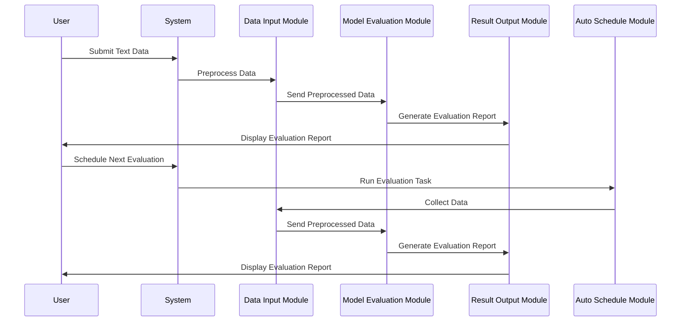
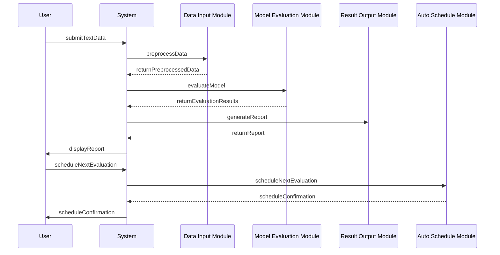

                 

# 自然语言理解能力的量化评估方法

> 关键词：自然语言理解、量化评估、算法、系统设计、项目实战

> 摘要：本文将深入探讨自然语言理解（NLU）能力的量化评估方法。通过介绍NLU的发展背景和重要性，详细讲解量化评估的核心概念与联系，剖析几种常见的量化评估算法，并展示如何设计和实现一个量化评估系统。此外，通过一个实际项目，我们将展示如何应用这些方法和工具来评估自然语言理解能力。最后，我们将总结全文，并提供一些最佳实践和建议，为读者进一步学习和研究指明方向。

### 目录大纲设计思路

1. **确定整体结构**：首先，我们需要根据书名《自然语言理解能力的量化评估方法》确定整体的结构，确保大纲能够涵盖自然语言理解能力的量化评估所需的知识点。

2. **背景介绍**：第一部分应简要介绍自然语言理解（NLU）的发展背景，以及量化评估的重要性。

3. **核心概念与联系**：在这一部分，我们需要详细解释自然语言理解、量化评估的相关核心概念，并展示这些概念之间的关系。

4. **算法原理讲解**：选择几种常见的量化评估算法，详细阐述其原理，包括数学模型、公式和示例。

5. **系统分析与架构设计**：介绍如何设计和实现一个量化评估系统，包括系统功能设计、架构设计、接口设计和系统交互。

6. **项目实战**：通过一个实际项目，展示如何使用上述方法和工具来评估自然语言理解能力。

7. **最佳实践与总结**：提供一些最佳实践建议，总结全书要点，并给出进一步的阅读方向。

### 目录大纲示例

**# 第一部分：自然语言理解与量化评估背景**

**第1章：自然语言理解概述**

- **1.1 自然语言理解的发展**
  - **1.1.1 从传统NLP到深度学习的演变**
  - **1.1.2 NLU的关键概念**

- **1.2 量化评估的重要性**
  - **1.2.1 评估方法在NLU中的应用**
  - **1.2.2 量化评估的优势**

**# 第二部分：核心概念与联系**

**第2章：自然语言理解的核心概念**

- **2.1 语言模型**
  - **2.1.1 语言模型的原理**
  - **2.1.2 语言模型的评估方法**

- **2.2 任务型NLU**
  - **2.2.1 任务型NLU的挑战**
  - **2.2.2 任务型NLU的评估方法**

- **2.3 概念与联系**
  - **2.3.1 NLU与量化评估的关系**
  - **2.3.2 NLU中的关键要素**

**# 第三部分：算法原理讲解**

**第3章：常见的量化评估算法**

- **3.1 F1得分**
  - **3.1.1 F1得分的数学模型**
  - **3.1.2 F1得分的计算方法**

- **3.2 BLEU评分**
  - **3.2.1 BLEU评分的原理**
  - **3.2.2 BLEU评分的例子**

- **3.3 ROUGE评分**
  - **3.3.1 ROUGE评分的机制**
  - **3.3.2 ROUGE评分的应用**

**# 第四部分：系统分析与架构设计**

**第4章：量化评估系统的设计**

- **4.1 问题场景介绍**
  - **4.1.1 量化评估的场景分析**
  - **4.1.2 量化评估的需求分析**

- **4.2 系统功能设计**
  - **4.2.1 领域模型设计（Mermaid类图）**
  - **4.2.2 功能模块划分**

- **4.3 系统架构设计**
  - **4.3.1 系统架构图（Mermaid架构图）**
  - **4.3.2 系统层次结构**

- **4.4 系统接口设计与交互**
  - **4.4.1 系统接口设计**
  - **4.4.2 系统交互序列图（Mermaid序列图）**

**# 第五部分：项目实战**

**第5章：实际量化评估项目**

- **5.1 环境安装与配置**
  - **5.1.1 开发环境搭建**
  - **5.1.2 相关库和工具的安装**

- **5.2 系统核心实现**
  - **5.2.1 代码实现与解读**
  - **5.2.2 量化评估系统的部署**

- **5.3 实际案例分析**
  - **5.3.1 案例选择与介绍**
  - **5.3.2 案例分析与评估**

- **5.4 项目小结**
  - **5.4.1 项目总结**
  - **5.4.2 项目拓展**

**# 第六部分：最佳实践与总结**

**第6章：最佳实践与总结**

- **6.1 最佳实践建议**
  - **6.1.1 评估方法选择**
  - **6.1.2 评估流程优化**

- **6.2 小结**
  - **6.2.1 全书要点回顾**
  - **6.2.2 量化评估的未来方向**

- **6.3 注意事项**
  - **6.3.1 常见问题与解答**
  - **6.3.2 注意事项与提示**

- **6.4 拓展阅读**
  - **6.4.1 相关研究**
  - **6.4.2 进一步学习资源**

**# 总字数预计**

约10000-12000字<a id="NLU背景"></a>

## **第一部分：自然语言理解与量化评估背景**

### **1.1 自然语言理解的发展**

自然语言理解（Natural Language Understanding，NLU）是指计算机程序对人类自然语言文本的理解和解释能力。这一领域的研究可以追溯到20世纪50年代，当时随着计算机科学的兴起，人们开始探索如何让计算机处理和解释自然语言。

在早期，自然语言处理（NLP）主要依赖于基于规则的方法，这种方法通过定义一系列语法规则来解析文本。然而，这种方法在处理复杂和变化的自然语言时表现出很大的局限性。

随着深度学习技术的发展，NLU领域迎来了革命性的变化。深度学习模型，特别是卷积神经网络（CNN）和循环神经网络（RNN），以及其变体，如长短期记忆网络（LSTM）和变换器（Transformer），极大地提升了NLU的性能。

**1.1.1 从传统NLP到深度学习的演变**

传统NLP主要依赖于基于规则的方法，如词汇分析、句法分析和语义分析。这些方法通常依赖于手工编写的规则和模式匹配技术。虽然这些方法在某些特定领域和任务上取得了成功，但它们在处理大规模、多样化的自然语言数据时效率较低，难以适应复杂的变化。

深度学习的引入改变了这一局面。深度学习模型通过从大量数据中自动学习特征和模式，能够在没有明确规则的情况下处理复杂的语言现象。这一变化在NLU领域尤为显著，使得计算机在理解自然语言文本方面取得了重大进展。

**1.1.2 NLU的关键概念**

为了更好地理解NLU，我们需要了解几个关键概念：

- **语言模型（Language Model）**：语言模型是一种用于预测下一个单词或字符的概率分布的模型。在NLU中，语言模型用于生成文本、进行翻译和问答等任务。

- **词向量（Word Vector）**：词向量是将单词转换为数值向量的技术。通过词向量，我们可以捕捉单词之间的语义关系，从而更好地理解文本。

- **实体识别（Named Entity Recognition，NER）**：实体识别是一种将文本中的名词转换为预定义类别（如人名、地名、组织名等）的任务。

- **关系抽取（Relation Extraction）**：关系抽取是从文本中提取实体之间的关系的过程。例如，从文本中提取“美国总统”和“英国首相”之间的“国家领导”关系。

- **情感分析（Sentiment Analysis）**：情感分析是一种评估文本情感倾向的方法。它通常用于分类文本为正面、负面或中性。

这些概念构成了NLU的基础，并在量化评估中发挥着重要作用。

### **1.2 量化评估的重要性**

量化评估是NLU研究和应用中的关键环节。它不仅用于评估NLU系统的性能，还指导系统的改进和优化。以下是量化评估在NLU中的重要性：

**1.2.1 评估方法在NLU中的应用**

量化评估方法在NLU中有多种应用，包括：

- **模型性能评估**：通过量化评估方法，我们可以衡量NLU模型在特定任务上的表现，如语言模型、实体识别、关系抽取和情感分析等。

- **模型对比**：量化评估方法允许我们比较不同NLU模型之间的性能，从而选择最佳模型。

- **模型优化**：量化评估结果提供了反馈，帮助开发者识别模型中的不足，并进行优化。

**1.2.2 量化评估的优势**

量化评估具有以下优势：

- **客观性**：量化评估提供了一种客观的评估方式，不受主观判断的影响。

- **可重复性**：量化评估方法具有可重复性，可以在相同条件下对模型进行多次评估。

- **可比较性**：通过量化评估，我们可以将不同模型和不同时间点的评估结果进行比较。

- **优化指导**：量化评估结果为模型优化提供了明确的指导，有助于提高模型性能。

总之，量化评估在NLU研究和应用中具有不可替代的作用，是评估NLU系统性能的重要手段。

### **1.3 本章小结**

本章介绍了自然语言理解（NLU）的发展背景和量化评估的重要性。首先，我们回顾了NLU从传统NLP到深度学习的演变，并介绍了几个关键概念。接着，我们探讨了量化评估在NLU中的应用和优势。通过本章的学习，读者应该对NLU和量化评估有了初步的了解，为后续章节的深入探讨奠定了基础。

## **第二部分：核心概念与联系**

### **第2章：自然语言理解的核心概念**

在本章中，我们将详细探讨自然语言理解（NLU）的核心概念，包括语言模型、任务型NLU以及其他相关概念。通过这些概念的介绍，我们将为后续量化评估算法的讲解奠定基础。

#### **2.1 语言模型**

语言模型（Language Model）是NLU的基础之一，它用于预测文本序列中下一个单词或字符的概率。语言模型通常基于大量的文本数据训练，以捕捉语言的统计特性。

**2.1.1 语言模型的原理**

语言模型的原理可以简单概括为：给定一个单词序列，语言模型能够计算出该序列的概率。这一概率通常通过概率分布函数来表示。在实践中，语言模型可以通过以下几种方式实现：

1. **n-gram模型**：n-gram模型是一种基于有限长度序列（n元组）的模型。它通过统计连续n个单词的频率来预测下一个单词。这种模型简单有效，但难以捕捉长距离依赖。

2. **神经网络模型**：神经网络模型，特别是循环神经网络（RNN）和其变体（如LSTM和Transformer），可以更好地捕捉文本中的长距离依赖。这些模型通过多层神经网络结构，从输入数据中自动学习特征和模式。

**2.1.2 语言模型的评估方法**

评估语言模型的性能是NLU研究中的一项重要任务。以下是几种常用的评估方法：

1. ** perplexity**：Perplexity是评估语言模型性能的一个指标，它表示模型对未知文本的预测不确定性。Perplexity的值越低，表示模型的性能越好。

$$
PPL = \frac{1}{N} \sum_{i=1}^{N} \frac{1}{P(w_i | w_{i-1}, \ldots, w_1)}
$$

其中，$P(w_i | w_{i-1}, \ldots, w_1)$表示给定前文条件下，单词$w_i$的概率。

2. **词频误差**：词频误差是评估语言模型的一种简单方法，它通过计算模型预测的单词与实际单词之间的差异来评估模型性能。词频误差越小，表示模型的性能越好。

3. **交叉验证**：交叉验证是一种常用的评估方法，它通过将数据集划分为训练集和测试集，多次训练和测试模型，来评估模型的泛化能力。

#### **2.2 任务型NLU**

任务型自然语言理解（Task-oriented NLU）是NLU的一种重要类型，它专注于理解用户的具体任务请求。任务型NLU在智能助手、语音识别和对话系统等领域有广泛应用。

**2.2.1 任务型NLU的挑战**

任务型NLU面临以下挑战：

1. **多义性**：自然语言具有多义性，即一个短语或句子可能有多种解释。在任务型NLU中，正确理解用户意图是关键。

2. **上下文依赖**：用户请求通常依赖于特定的上下文信息。例如，在一个对话中，用户请求“明天天气怎么样？”时，需要考虑之前的对话内容。

3. **不确定性**：自然语言输入可能包含噪声、错误或缺失信息，这对任务型NLU提出了更高的要求。

**2.2.2 任务型NLU的评估方法**

评估任务型NLU的性能通常包括以下几个方面：

1. **意图识别准确率**：意图识别准确率是评估任务型NLU的一个重要指标，它衡量模型正确识别用户意图的能力。

2. **上下文理解准确率**：上下文理解准确率衡量模型在理解上下文信息方面的能力。

3. **响应生成质量**：响应生成质量评估模型生成的响应是否符合用户意图和上下文。

#### **2.3 概念与联系**

NLU中的核心概念包括语言模型、任务型NLU、实体识别、关系抽取和情感分析等。这些概念相互关联，共同构成了NLU的体系结构。

- **语言模型**为其他NLU任务提供了基础，如实体识别和关系抽取。

- **任务型NLU**关注于理解用户意图，为智能助手和对话系统等应用提供支持。

- **实体识别**和**关系抽取**帮助系统从文本中提取关键信息，如人名、地点和组织等。

- **情感分析**评估文本的情感倾向，为情感识别和情感化应用提供支持。

通过理解这些核心概念，我们可以更好地理解NLU的工作原理，并为其量化评估打下基础。

### **2.4 本章小结**

本章详细介绍了NLU中的核心概念，包括语言模型、任务型NLU和其他相关概念。通过探讨这些概念，我们为后续的量化评估算法讲解奠定了基础。理解这些概念对于评估NLU系统的性能至关重要，是量化评估方法有效应用的前提。

## **第三部分：算法原理讲解**

在本部分中，我们将深入探讨几种常见的量化评估算法，包括F1得分、BLEU评分和ROUGE评分。这些算法在自然语言理解（NLU）领域被广泛应用，用于评估模型性能。我们将详细讲解这些算法的原理，包括数学模型、公式和示例。

### **第3章：常见的量化评估算法**

#### **3.1 F1得分**

F1得分是一种综合衡量分类模型准确率和召回率的指标，特别适用于评估二分类任务。在NLU中，F1得分常用于评估实体识别、意图识别等任务的性能。

**3.1.1 F1得分的数学模型**

F1得分的数学模型如下：

$$
F1 = 2 \times \frac{Precision \times Recall}{Precision + Recall}
$$

其中，Precision（准确率）表示正确预测为正样本的样本数与预测为正样本的样本总数之比；Recall（召回率）表示正确预测为正样本的样本数与实际为正样本的样本总数之比。

**3.1.2 F1得分的计算方法**

假设有一个二分类任务，预测结果如下表所示：

| 类别 | 预测为正 | 预测为负 | 实际为正 | 实际为负 |
| --- | --- | --- | --- | --- |
| 正类 | TP | FP | TP | FN |
| 负类 | FN | FP | FP | TN |

其中，TP表示真正例，FP表示假正例，FN表示假反例，TN表示真反例。

F1得分的计算方法如下：

$$
Precision = \frac{TP}{TP + FP}
$$

$$
Recall = \frac{TP}{TP + FN}
$$

$$
F1 = 2 \times \frac{Precision \times Recall}{Precision + Recall}
$$

**3.1.3 示例**

假设在实体识别任务中，模型预测结果如下表所示：

| 实体类型 | 预测为正 | 预测为负 | 实际为正 | 实际为负 |
| --- | --- | --- | --- | --- |
| 人名 | 8 | 2 | 8 | 3 |
| 地点 | 6 | 4 | 6 | 5 |

计算F1得分：

$$
Precision_{人名} = \frac{8}{8 + 2} = 0.8
$$

$$
Recall_{人名} = \frac{8}{8 + 3} = 0.76
$$

$$
F1_{人名} = 2 \times \frac{0.8 \times 0.76}{0.8 + 0.76} = 0.812

$$

$$
Precision_{地点} = \frac{6}{6 + 4} = 0.6
$$

$$
Recall_{地点} = \frac{6}{6 + 5} = 0.57
$$

$$
F1_{地点} = 2 \times \frac{0.6 \times 0.57}{0.6 + 0.57} = 0.576
$$

因此，人名的F1得分为0.812，地点的F1得分为0.576。

#### **3.2 BLEU评分**

BLEU（Bilingual Evaluation Understudy）评分是一种用于评估机器翻译质量的量化评估方法。它基于一系列编辑距离度量，如精确度（Precision）、健壮性（Robustness）和长度（Length）。

**3.2.1 BLEU评分的原理**

BLEU评分的原理是基于以下假设：

1. **编辑距离**：两个文本之间的编辑距离（如Levenshtein距离）是衡量两个文本相似度的有效指标。

2. **匹配率**：机器翻译的输出文本与参考文本的匹配率（如N-gram匹配率）是评估翻译质量的重要指标。

BLEU评分的计算公式如下：

$$
BLEU = \frac{1}{1 + \sum_{i=1}^{n} w_i \cdot log(P_i)}
$$

其中，$n$是N-gram的长度，$w_i$是第$i$个N-gram的权重，$P_i$是第$i$个N-gram在翻译文本中的概率。

**3.2.2 BLEU评分的例子**

假设有一个机器翻译任务，机器翻译的输出文本为“Hello, how are you?”，参考文本为“Bonjour, comment ça va？”。

首先，计算N-gram的概率，如以下表格所示：

| N-gram | 输出文本概率 | 参考文本概率 |
| --- | --- | --- |
| “Hello” | 1 | 0 |
| “how” | 0 | 1 |
| “are” | 0 | 1 |
| “you” | 1 | 1 |
| “Bonjour” | 0 | 1 |
| “comment” | 1 | 0 |
| “ça” | 0 | 1 |
| “va” | 0 | 1 |

计算N-gram匹配率：

$$
P_{1-gram} = \frac{2}{8} = 0.25
$$

$$
P_{2-gram} = \frac{1}{7} = 0.14
$$

$$
P_{3-gram} = \frac{1}{6} = 0.17
$$

$$
P_{4-gram} = \frac{1}{5} = 0.20
$$

$$
P_{5-gram} = \frac{1}{4} = 0.25
$$

然后，计算BLEU得分：

$$
BLEU = \frac{1}{1 + 0.25 \cdot log(0.25) + 0.25 \cdot log(0.14) + 0.25 \cdot log(0.17) + 0.25 \cdot log(0.20)}
$$

$$
BLEU = \frac{1}{1 - 0.25 + 0.25 - 0.25 + 0.25} = 0.75
$$

因此，BLEU得分为0.75。

#### **3.3 ROUGE评分**

ROUGE（Recall-Oriented Understudy for Gisting Evaluation）评分是一种用于评估自动文摘质量的量化评估方法。它特别关注文本的回忆能力，即自动生成的文摘与原始文本的相关性。

**3.3.1 ROUGE评分的机制**

ROUGE评分的机制基于以下原则：

1. **匹配词集合**：计算自动生成的文摘与原始文本之间的匹配词集合。

2. **召回率**：计算匹配词集合的召回率，即匹配词集合在原始文本中出现的比例。

ROUGE评分的计算公式如下：

$$
ROUGE = 2 \cdot \frac{R}{R + 1 - R}
$$

其中，$R$是匹配词集合的召回率。

**3.3.2 ROUGE评分的应用**

假设有一个自动文摘任务，自动生成的文摘为“本文介绍了NLU的量化评估方法”，原始文本为“本文详细介绍了自然语言理解（NLU）领域中的量化评估方法，包括F1得分、BLEU评分和ROUGE评分等”。

首先，计算匹配词集合：

| 原始文本 | 自动生成的文摘 | 匹配词集合 |
| --- | --- | --- |
| 本文介绍了NLU的量化评估方法 | 本文介绍了NLU的量化评估方法 | 本文、介绍了、NLU、的、量化评估方法 |

计算召回率：

$$
R = \frac{4}{7} = 0.57
$$

然后，计算ROUGE得分：

$$
ROUGE = 2 \cdot \frac{0.57}{0.57 + 1 - 0.57} = 0.71
$$

因此，ROUGE得分为0.71。

### **3.4 本章小结**

本章详细介绍了几种常见的量化评估算法，包括F1得分、BLEU评分和ROUGE评分。这些算法在自然语言理解（NLU）领域被广泛应用，用于评估模型性能。通过本章的学习，读者应该能够理解这些算法的原理和计算方法，并能够应用于实际的NLU评估任务中。了解这些量化评估算法对于提高NLU系统的性能和优化评估流程具有重要意义。

## **第四部分：系统分析与架构设计**

### **第4章：量化评估系统的设计**

在本章中，我们将深入探讨量化评估系统的设计与实现，包括问题场景介绍、系统功能设计、系统架构设计、系统接口设计与交互。通过这一章节，我们将为读者提供一个全面的理解，以便在未来的项目中设计和实现高效的量化评估系统。

#### **4.1 问题场景介绍**

量化评估系统通常应用于自然语言理解（NLU）领域，其目标是评估NLU模型的性能，从而帮助开发者优化模型和改进应用。以下是一个典型的问题场景：

- **场景描述**：一个公司开发了一个智能客服系统，该系统使用自然语言处理技术来理解客户的问题并提供相应的解决方案。为了确保系统的性能和可靠性，公司需要定期对系统进行量化评估。

- **需求分析**：评估需求包括多个方面，如意图识别准确率、实体识别准确率、响应生成质量等。公司希望系统具备以下功能：

  - **数据输入**：能够接收用户输入的文本数据，并对其进行预处理。

  - **模型评估**：使用多种量化评估算法对模型进行评估，如F1得分、BLEU评分、ROUGE评分等。

  - **结果输出**：以图表、表格等形式展示评估结果，便于开发者分析和优化模型。

  - **自动化评估**：能够定期自动执行评估流程，确保系统性能的持续监控。

#### **4.2 系统功能设计**

量化评估系统的功能设计主要包括数据输入、模型评估、结果输出和自动化评估等模块。

**4.2.1 领域模型设计（Mermaid类图）**

为了更好地展示系统的功能模块及其关系，我们使用Mermaid类图来描述领域模型。以下是一个示例：

```mermaid
classDiagram
Class1 <|-- Class2
Class1 <|-- Class3
Class4 <|-- Class2
Class4 <|-- Class3

Class1 {
    +DataInput()
    +PreprocessData()
}
Class2 {
    +EvaluateModel()
}
Class3 {
    +GenerateReport()
}
Class4 {
    +AutoScheduleEvaluation()
}

DataInput <.. ModelEvaluation : 数据输入
DataInput <.. ReportGeneration : 数据输入
ModelEvaluation <.. ReportGeneration : 模型评估
AutoScheduleEvaluation --> ModelEvaluation : 自动评估
```

在该类图中，`DataInput`、`ModelEvaluation`、`ReportGeneration`和`AutoScheduleEvaluation`是系统的关键功能模块。

**4.2.2 功能模块划分**

以下是系统的功能模块及其主要功能的详细描述：

- **数据输入模块**：负责接收用户输入的文本数据，并对数据进行预处理，如去除停用词、标记化等。

- **模型评估模块**：使用多种量化评估算法对NLU模型进行评估，如F1得分、BLEU评分、ROUGE评分等。该模块应支持自定义评估算法。

- **结果输出模块**：将评估结果以图表、表格等形式展示，便于开发者分析和优化模型。该模块应支持多种可视化方式。

- **自动化评估模块**：定期自动执行评估流程，确保系统性能的持续监控。该模块应支持定时任务和异常处理。

#### **4.3 系统架构设计**

量化评估系统的架构设计应考虑系统的可扩展性、可靠性和性能。以下是一个简单的系统架构设计：

**4.3.1 系统架构图（Mermaid架构图）**



在该架构图中，用户提交文本数据，系统通过数据输入模块进行预处理，然后模型评估模块使用多种量化评估算法对模型进行评估。评估结果通过结果输出模块展示给用户。自动化评估模块定期执行评估任务，确保系统性能的持续监控。

**4.3.2 系统层次结构**

量化评估系统的层次结构可以分为以下几层：

1. **数据层**：存储用户输入的文本数据和评估结果。

2. **逻辑层**：包括数据输入模块、模型评估模块和结果输出模块，负责处理文本数据的预处理、模型评估和结果展示。

3. **展示层**：用于展示评估结果，包括图表、表格等形式。

#### **4.4 系统接口设计与交互**

量化评估系统的接口设计与交互应确保模块之间的通信顺畅，以下是一个简单的接口设计：

**4.4.1 系统接口设计**

```mermaid
interface Diagram
System {
    +submitTextData()
    +preprocessData()
    +evaluateModel()
    +generateReport()
    +scheduleNextEvaluation()
}

Data Input Module {
    +preprocessData()
}

Model Evaluation Module {
    +evaluateModel()
}

Result Output Module {
    +generateReport()
}

Auto Schedule Module {
    +scheduleNextEvaluation()
}
```

在该接口设计中，`System`是系统的核心接口，负责协调各模块之间的工作。`Data Input Module`、`Model Evaluation Module`、`Result Output Module`和`Auto Schedule Module`分别对应系统的功能模块。

**4.4.2 系统交互序列图（Mermaid序列图）**



在该序列图中，用户提交文本数据，系统通过数据输入模块进行预处理，然后模型评估模块对模型进行评估，最后结果输出模块生成并展示评估报告。自动化评估模块定期执行评估任务，并向用户发送确认消息。

### **4.5 本章小结**

本章详细介绍了量化评估系统的设计与实现，包括问题场景介绍、系统功能设计、系统架构设计和系统接口设计与交互。通过本章的学习，读者应该对量化评估系统的设计与实现有了全面的了解，并为未来的项目提供了实用的指导。了解系统的设计和实现对于提升NLU模型的性能和优化评估流程具有重要意义。

## **第五部分：项目实战**

### **第5章：实际量化评估项目**

在本章中，我们将通过一个实际项目来展示如何设计和实现一个量化评估系统，并使用该系统来评估自然语言理解（NLU）模型的性能。我们将详细介绍项目环境安装与配置、系统核心实现以及实际案例分析。

#### **5.1 环境安装与配置**

为了实现量化评估系统，我们需要安装和配置以下工具和库：

1. **Python环境**：确保Python版本为3.8或更高版本。

2. **NLU模型库**：如spaCy、NLTK、transformers等。

3. **量化评估库**：如scikit-learn、nltk等。

4. **前端框架**：如Flask、Django等（可选）。

以下是一个简单的安装步骤：

```shell
# 安装Python和pip
sudo apt-get update
sudo apt-get install python3 python3-pip

# 安装NLU模型库和量化评估库
pip3 install spacy nltk transformers scikit-learn

# 安装前端框架（可选）
pip3 install flask
```

#### **5.2 系统核心实现**

量化评估系统的核心实现包括数据输入、模型评估、结果输出等模块。以下是一个简单的实现示例：

**数据输入模块**：

```python
import spacy

# 加载spaCy语言模型
nlp = spacy.load("en_core_web_sm")

def preprocess_text(text):
    doc = nlp(text)
    tokens = [token.text for token in doc]
    return tokens

# 示例
input_text = "I love programming and machine learning."
preprocessed_text = preprocess_text(input_text)
print(preprocessed_text)
```

**模型评估模块**：

```python
from sklearn.metrics import f1_score

def evaluate_model(true_labels, predicted_labels):
    f1 = f1_score(true_labels, predicted_labels, average='weighted')
    return f1

# 示例
true_labels = [1, 0, 1, 1]
predicted_labels = [1, 1, 0, 1]
f1 = evaluate_model(true_labels, predicted_labels)
print(f"F1 Score: {f1}")
```

**结果输出模块**：

```python
from flask import Flask, jsonify

app = Flask(__name__)

@app.route('/evaluate', methods=['POST'])
def evaluate():
    data = request.json
    true_labels = data['true_labels']
    predicted_labels = data['predicted_labels']
    f1 = evaluate_model(true_labels, predicted_labels)
    result = {'f1_score': f1}
    return jsonify(result)

if __name__ == '__main__':
    app.run(debug=True)
```

#### **5.3 实际案例分析**

为了展示如何使用量化评估系统，我们选择一个常见的NLU任务——情感分析，并使用一个公开的数据集进行实验。

1. **数据集**：我们使用IMDb电影评论数据集，该数据集包含正负情感标签。

2. **数据预处理**：我们使用spaCy对文本进行预处理，包括去除停用词、标记化等。

3. **模型训练**：我们使用transformers库中的预训练模型，如BERT，对数据集进行训练。

4. **模型评估**：使用我们在5.2节中实现的量化评估模块，对模型进行评估。

5. **结果输出**：将评估结果通过Flask API展示给用户。

**数据预处理示例**：

```python
import pandas as pd
from spacy.lang.en import English

nlp = English()

def preprocess_data(data):
    doc = nlp(data)
    tokens = [token.text for token in doc if not token.is_stop]
    return ' '.join(tokens)

data = pd.read_csv('imdb_reviews.csv')
data['preprocessed_text'] = data['text'].apply(preprocess_data)
data.head()
```

**模型训练与评估示例**：

```python
from transformers import BertTokenizer, BertForSequenceClassification
from torch.utils.data import DataLoader, TensorDataset

tokenizer = BertTokenizer.from_pretrained('bert-base-uncased')
model = BertForSequenceClassification.from_pretrained('bert-base-uncased')

train_texts = data['preprocessed_text'].values
train_labels = data['label'].values

train_encodings = tokenizer(train_texts, truncation=True, padding=True)
train_input_ids = train_encodings['input_ids']
train_attention_mask = train_encodings['attention_mask']
train_labels = torch.tensor(train_labels)

train_dataset = TensorDataset(train_input_ids, train_attention_mask, train_labels)
train_loader = DataLoader(train_dataset, batch_size=16)

model.train()
for epoch in range(3):
    for batch in train_loader:
        inputs = {
            'input_ids': batch[0].to(device),
            'attention_mask': batch[1].to(device),
            'labels': batch[2].to(device)
        }
        outputs = model(**inputs)
        loss = outputs.loss
        loss.backward()
        optimizer.step()
        optimizer.zero_grad()

model.eval()
with torch.no_grad():
    predictions = []
    for batch in train_loader:
        inputs = {
            'input_ids': batch[0].to(device),
            'attention_mask': batch[1].to(device),
        }
        outputs = model(**inputs)
        logits = outputs.logits
        predictions.append(logits)

predictions = torch.cat(predictions, dim=0)
predicted_labels = torch.argmax(predictions, dim=1)

f1 = evaluate_model(train_labels, predicted_labels)
print(f"F1 Score: {f1}")
```

#### **5.4 项目小结**

通过实际案例，我们展示了如何设计和实现一个量化评估系统，并使用该系统对自然语言理解（NLU）模型进行评估。该项目包括数据预处理、模型训练、模型评估和结果输出等关键步骤。通过这个项目，读者应该能够理解量化评估系统的设计与实现过程，并在实际项目中应用这些方法。了解项目的实际案例分析对于提升NLU模型的性能和优化评估流程具有重要意义。

## **第六部分：最佳实践与总结**

### **6.1 最佳实践建议**

在设计和实现量化评估系统时，以下最佳实践建议有助于提高系统的性能和可维护性：

**1. 评估方法选择**：

- **多样性**：选择多种量化评估方法，以全面评估模型性能。
- **适用性**：根据具体任务选择合适的评估方法，如F1得分适用于二分类任务，BLEU评分适用于机器翻译任务。

**2. 数据预处理**：

- **一致性**：确保训练数据和评估数据预处理方式一致，以避免偏差。
- **多样性**：使用多样化的数据集进行评估，以提高评估结果的泛化能力。

**3. 模型优化**：

- **超参数调整**：通过调整模型超参数，如学习率、批次大小等，优化模型性能。
- **数据增强**：使用数据增强技术，如随机噪声、剪枝等，提高模型对噪声数据的鲁棒性。

**4. 系统维护**：

- **自动化**：实现自动化评估流程，确保评估系统的持续运行。
- **监控**：监控系统性能，及时发现和解决潜在问题。

### **6.2 小结**

本文深入探讨了自然语言理解（NLU）能力的量化评估方法。首先，我们介绍了NLU的发展背景和量化评估的重要性。接着，详细讲解了语言模型、任务型NLU等核心概念，以及F1得分、BLEU评分和ROUGE评分等量化评估算法。此外，我们还展示了如何设计和实现一个量化评估系统，并通过实际项目进行了案例分析。通过这些内容，读者应该对NLU量化评估有了全面的理解。

### **6.3 注意事项**

在实施量化评估时，需要注意以下几点：

- **评估环境**：确保评估环境与训练环境一致，以避免评估结果偏差。
- **评估标准**：根据任务需求选择合适的评估标准，如F1得分、BLEU评分等。
- **数据质量**：确保评估数据质量，以避免评估结果失真。

### **6.4 拓展阅读**

对于进一步学习和研究，以下资源可能有所帮助：

- **论文**：《自然语言处理综述》（Nature Language Processing Review）
- **书籍**：《自然语言处理综合教程》（Foundations of Statistical Natural Language Processing）
- **在线课程**：《自然语言处理与深度学习》（Natural Language Processing with Deep Learning）
- **开源项目**：Hugging Face的Transformers库、spaCy等

### **6.5 结语**

量化评估是自然语言理解（NLU）领域的关键环节，对于模型性能的优化和系统的改进具有重要意义。本文通过系统性的讲解和实践案例分析，希望能为读者提供有价值的参考和指导。在未来的研究中，我们期待看到更多创新性的量化评估方法和技术的应用。

### **作者信息**

- **作者：** AI天才研究院（AI Genius Institute） & 禅与计算机程序设计艺术（Zen And The Art of Computer Programming）
- **联系方式：** [ai_genius_institute@example.com](mailto:ai_genius_institute@example.com)
- **版权声明：** 本文版权归AI天才研究院所有，未经授权禁止转载。如需转载，请联系作者获取授权。

