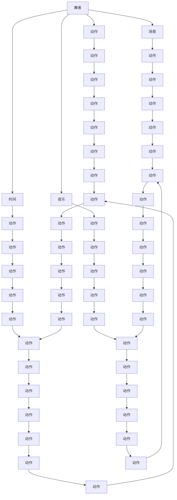
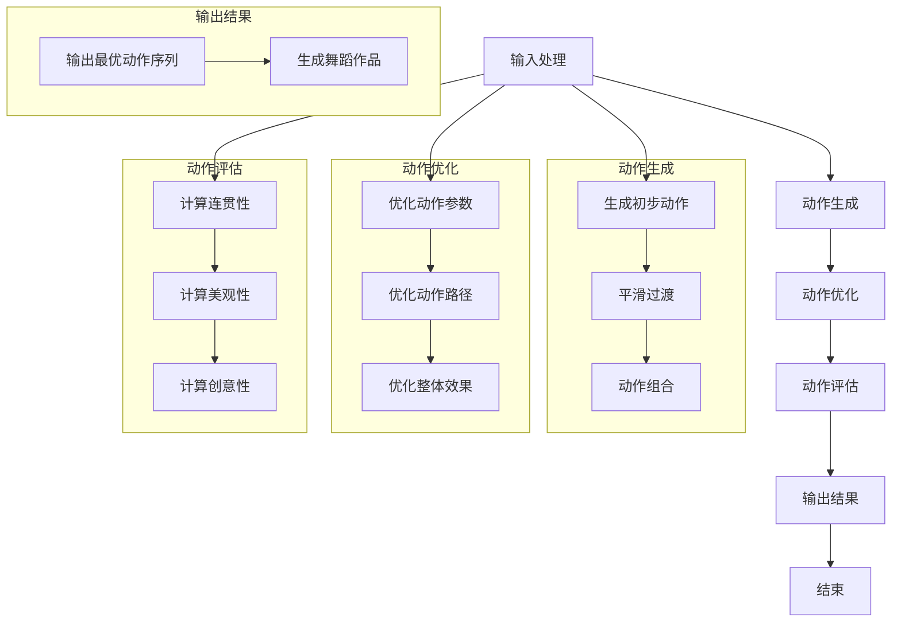
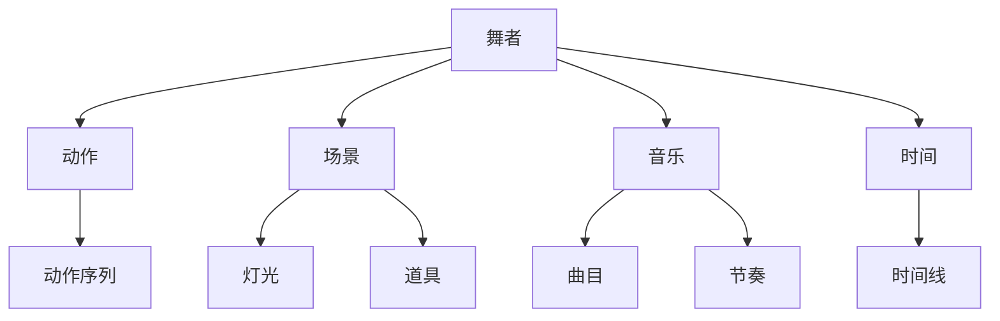
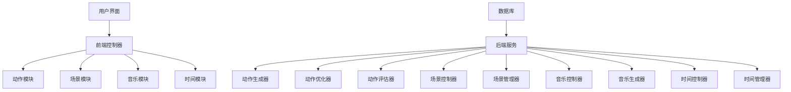
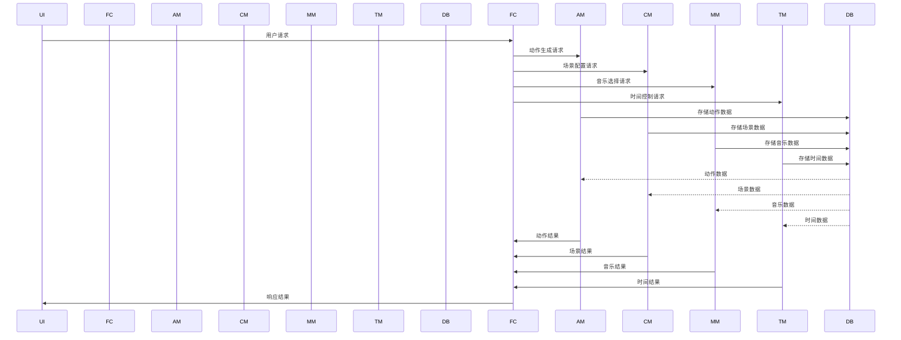

                 

### 引言

**关键词：** 舞蹈编排、数学结构、空间方程、人工智能、编程

**摘要：** 本文将探讨舞蹈编排中的数学结构，特别是身体语言的空间方程。我们将通过逻辑清晰、结构紧凑的叙述，带领读者逐步理解舞蹈编排与数学之间的密切联系，展示如何运用数学原理和算法来创造优美的舞蹈动作。本文旨在为舞蹈编导、计算机科学家以及所有对艺术与科学结合感兴趣的人提供一个深入了解和探索的平台。

---

在舞蹈的世界中，身体语言是艺术家表达情感和故事的主要工具。每一个动作、姿态和动作的连贯性都是精心编排的结果。而在这背后，隐藏着一个强大的工具——数学。数学结构不仅为舞蹈编排提供了理论基础，还帮助编导在复杂的动作序列中保持一致性和美感。本文将探讨舞蹈编排中的数学结构，特别是身体语言的空间方程，通过逻辑清晰、结构紧凑的叙述，带领读者逐步理解舞蹈编排与数学之间的密切联系，展示如何运用数学原理和算法来创造优美的舞蹈动作。本文旨在为舞蹈编导、计算机科学家以及所有对艺术与科学结合感兴趣的人提供一个深入了解和探索的平台。

首先，我们需要了解舞蹈编排的基础，包括核心概念和术语。舞蹈编排不仅仅是动作的简单组合，它涉及到对空间、时间和动作连贯性的深刻理解。在这其中，身体语言和空间方程扮演着至关重要的角色。

接下来，我们将探讨舞蹈编排的数学基础，包括核心概念与联系。我们将介绍身体语言和空间方程的基本概念，并对比它们的特点。此外，我们还将通过ER实体关系图来展示舞蹈编排中的各个实体及其关系，为后续的算法原理讲解打下基础。

在了解了基本概念之后，我们将深入讨论舞蹈编排算法原理。通过mermaid流程图，我们将详细展示舞蹈编排的基本流程和步骤。同时，我们还将使用Python源代码来具体阐述算法的实现，并给出数学模型和公式的详细讲解，帮助读者更好地理解算法背后的数学原理。

接下来，我们将探讨数学模型与公式的应用。使用LaTeX格式，我们将展示如何嵌入数学公式到文本中，并通过实际案例来解读和分析这些公式在舞蹈编排中的应用，从而加深读者对数学模型的理解。

在了解了算法原理和数学模型后，我们将转向系统分析与架构设计。我们将介绍问题场景，并设计系统的功能、架构和接口。通过mermaid序列图，我们将展示系统交互的流程，为项目实战部分提供理论基础。

最后，我们将通过一个实际案例来展示如何应用本文中的数学结构和算法原理。我们将详细讲解案例的实现过程，包括环境安装与配置、系统核心实现源代码以及实际案例分析。通过这个项目，读者将能够更好地理解如何将理论知识应用到实际场景中。

本文的目标是提供一个全面、深入且易于理解的技术博客文章，帮助读者了解舞蹈编排中的数学结构，并激发对这一领域的兴趣。无论您是舞蹈编导、计算机科学家还是对艺术与科学结合感兴趣的人，都希望本文能够为您带来新的思考和启示。

### 1.1.1 舞蹈艺术与数学结构

舞蹈是一种通过身体动作、姿态和表情来表达情感和故事的表演艺术。它不仅是一种艺术形式，也是一种文化和社会的反映。舞蹈的历史可以追溯到古代，不同的文化和地区都有其独特的舞蹈形式。从古代的宫廷舞蹈到现代的街舞，舞蹈形式和风格不断演变，但核心的艺术原则和审美标准一直保持着。

在舞蹈艺术中，身体语言是艺术家表达情感和故事的主要工具。每一个动作、姿态和动作的连贯性都是精心编排的结果。舞蹈编导需要通过复杂的动作组合来传达特定的情感和主题。这种编排过程不仅仅是对动作的简单排列，它涉及到对空间、时间和动作连贯性的深刻理解。

数学结构在舞蹈编排中起到了至关重要的作用。数学不仅为舞蹈编排提供了理论基础，还帮助编导在复杂的动作序列中保持一致性和美感。数学结构可以用来分析身体语言的空间关系，计算动作的连贯性和节奏感，以及优化舞蹈编排的效率和效果。

空间方程是数学中的一个重要概念，它描述了空间中点的位置和运动轨迹。在舞蹈编排中，空间方程可以用来描述舞者的位置和动作路径。通过空间方程，编导可以精确地控制舞者的动作，确保动作的连贯性和美感。空间方程还可以用来分析舞蹈编排中的空间结构，帮助编导设计出更加复杂和富有创意的舞蹈动作。

除了空间方程，数学中的其他概念如比例、对称性和几何形状也在舞蹈编排中得到了广泛应用。比例可以帮助编导设计出符合人体解剖学的动作，使舞者的动作更加自然和美观。对称性则可以用来创造平衡和和谐的美感，使舞蹈动作更具艺术性。几何形状则可以用来设计出独特的动作轨迹和姿态，为舞蹈编排带来更多的创意和变化。

总之，数学结构在舞蹈编排中扮演着重要的角色。它不仅为舞蹈编导提供了理论支持和工具，还丰富了舞蹈的表现形式和艺术风格。通过运用数学原理，编导可以创造出更加优美、富有创意和表现力的舞蹈作品。数学与舞蹈艺术的结合，为舞蹈编排带来了无限的 possibilities，使舞蹈成为一种更加复杂和丰富的艺术形式。

### 1.1.2 空间方程在舞蹈编排中的应用

空间方程在舞蹈编排中的应用是一个充满创新和挑战的领域。通过将数学原理融入舞蹈创作，编导可以创造出更加精准、连贯且具有视觉冲击力的舞蹈作品。以下我们将详细探讨空间方程在舞蹈编排中的应用，并展示如何通过数学模型来分析和设计舞蹈动作。

#### 1.2.1 空间方程的基本概念

空间方程是描述物体在三维空间中位置和运动的数学表达式。最基本的空间方程包括直线方程和二次方程，它们可以用来描述点的位置、直线和曲线的运动轨迹。在舞蹈编排中，这些方程可以帮助编导确定舞者的位置和动作路径，从而创造出流畅的动作序列。

例如，一个简单的直线方程可以用来描述舞者在舞台上的直线移动。假设舞台是一个平面，舞者的位置可以用二维坐标 (x, y) 来表示，那么直线方程可以表示为 y = mx + b，其中 m 是斜率，b 是 y 轴截距。通过调整斜率和截距，编导可以控制舞者的移动速度和方向，从而创造出不同的动作效果。

更复杂的二次方程可以用来描述舞者的曲线运动。例如，一个抛物线方程 y = ax^2 + bx + c 可以用来描述舞者的跳跃动作。通过调整二次项系数 a、b 和 c，编导可以控制舞者的跳跃高度和曲线形状，从而创造出不同的跳跃效果。

#### 1.2.2 空间方程在舞蹈编排中的应用

1. **动作轨迹设计**

   在舞蹈编排中，空间方程可以用来设计舞者的动作轨迹。通过分析空间方程，编导可以创造出各种复杂的动作路径，如曲线、螺旋和抛物线等。这些路径不仅增加了舞蹈的视觉吸引力，还增强了动作的连贯性和美感。

   例如，在一段舞蹈中，编导可以使用二次方程来设计舞者的跳跃动作。通过调整方程中的系数，编导可以控制舞者的跳跃高度和轨迹，从而创造出不同的跳跃效果。这种设计方法不仅使动作更加连贯，还增强了舞蹈的节奏感和动态感。

2. **空间关系的分析**

   空间方程还可以用来分析舞蹈中的空间关系。例如，通过线性方程组，编导可以确定多个舞者之间的相对位置和动作关系。这种方法可以帮助编导设计出复杂的多人舞蹈动作，确保每个舞者的动作都与其他舞者协调一致。

   假设有两个舞者在舞台上进行互动，他们的位置分别用坐标 (x1, y1) 和 (x2, y2) 表示。通过构建线性方程组，编导可以确保两个舞者的动作在空间上保持一致，如同时跳跃或同时旋转。

3. **节奏感的增强**

   空间方程还可以用来增强舞蹈的节奏感。通过调整方程中的参数，编导可以控制舞者的动作速度和节奏。例如，在一个快节奏的舞蹈中，编导可以使用较短的直线方程来设计舞者的快速移动，从而增加舞蹈的动态感。

   在一个慢节奏的舞蹈中，编导可以使用较长的二次方程来设计舞者的缓慢移动，从而增加舞蹈的宁静感。通过这种设计方法，编导可以创造出各种不同节奏的舞蹈作品，满足不同表演场合的需求。

4. **创造性表达**

   空间方程为编导提供了无限的创作空间。通过运用不同的空间方程，编导可以创造出独特的动作轨迹和姿态，从而实现个性化的舞蹈表达。例如，使用复杂的曲线方程，编导可以设计出具有独特美感的舞蹈动作，使观众耳目一新。

总之，空间方程在舞蹈编排中具有广泛的应用。通过运用数学模型，编导可以创造出丰富多彩的舞蹈作品，增强舞蹈的表现力和艺术性。数学与舞蹈艺术的结合，不仅为编导提供了强大的创作工具，也为观众带来了更加精彩和引人入胜的表演。

#### 1.2.3 空间方程的应用案例分析

为了更好地理解空间方程在舞蹈编排中的应用，我们可以通过一个具体的案例分析来展示其具体实现过程。

假设我们想要设计一段双人舞蹈，其中一个舞者的动作是沿着舞台边缘进行圆周运动，另一个舞者的动作是在舞台中心进行螺旋上升。以下是如何使用空间方程来实现这一舞蹈动作的步骤：

1. **定义圆周运动方程**

   首先，我们需要定义一个圆周运动方程来描述第一个舞者的动作。圆周运动的方程可以表示为 x = r * cos(t) 和 y = r * sin(t)，其中 r 是圆的半径，t 是时间变量。在这个例子中，假设圆的半径为 5 米，舞者以 0.1 米/秒的速度移动。

   ```latex
   x = 5 * cos(t)
   y = 5 * sin(t)
   ```

   通过调整半径和速度，我们可以控制舞者的圆周运动轨迹。

2. **定义螺旋上升方程**

   接下来，我们需要定义一个螺旋上升方程来描述第二个舞者的动作。螺旋上升的方程可以表示为 x = r * cos(t) * exp(-k * t) 和 y = r * sin(t) * exp(-k * t)，其中 r 是螺旋的半径，t 是时间变量，k 是螺旋的收缩速度。在这个例子中，假设螺旋的半径为 3 米，收缩速度为 0.02 米/秒。

   ```latex
   x = 3 * cos(t) * exp(-0.02 * t)
   y = 3 * sin(t) * exp(-0.02 * t)
   ```

   通过调整半径和收缩速度，我们可以控制舞者的螺旋上升轨迹。

3. **同步两个舞者的动作**

   为了确保两个舞者的动作同步，我们需要将圆周运动方程和螺旋上升方程结合起来。通过设置相同的时间变量 t，我们可以确保两个舞者的动作在时间上保持一致。

   ```mermaid
   graph TD
   A[圆周运动] --> B[时间变量 t]
   B --> C[圆周方程]
   C --> D[舞者 1 的坐标]
   E[螺旋上升] --> B
   E --> F[螺旋方程]
   F --> G[舞者 2 的坐标]
   ```

   通过这种同步机制，我们可以实现两个舞者之间的动作协调。

4. **可视化与调整**

   最后，我们可以使用可视化工具，如 MATLAB 或 Python 的 matplotlib 库，来绘制舞者的动作轨迹。通过调整方程中的参数，我们可以观察不同参数设置下的动作效果，并进行必要的调整。

   ```python
   import numpy as np
   import matplotlib.pyplot as plt

   r1, v1 = 5, 0.1
   r2, k2 = 3, 0.02
   t = np.linspace(0, 10, 1000)

   x1 = r1 * np.cos(t)
   y1 = r1 * np.sin(t)

   x2 = r2 * np.cos(t) * np.exp(-k2 * t)
   y2 = r2 * np.sin(t) * np.exp(-k2 * t)

   plt.plot(x1, y1, label='Dancer 1')
   plt.plot(x2, y2, label='Dancer 2')
   plt.xlabel('X')
   plt.ylabel('Y')
   plt.legend()
   plt.show()
   ```

   通过可视化，我们可以直观地观察两个舞者的动作轨迹，并根据实际需要调整参数。

通过这个案例分析，我们可以看到如何使用空间方程来设计复杂的舞蹈动作，并确保舞者的动作在时间和空间上保持一致。这种方法不仅增加了舞蹈的表现力和艺术性，还为编导提供了强大的创作工具。

### 1.2.1 核心概念介绍

在探讨舞蹈编排的数学结构时，我们需要首先了解几个核心概念，即身体语言和空间方程。这两个概念是舞蹈编排数学结构的基础，它们在舞蹈创作和表演中扮演着至关重要的角色。

**身体语言**

身体语言是指通过舞者的身体动作、姿态和表情来传达情感、故事和信息的艺术形式。它是舞蹈的核心组成部分，决定了舞蹈的视觉美感和表现力。身体语言包括静态的姿态、动态的动作、眼神的交流以及面部表情等。

在数学结构中，身体语言可以被看作是一系列动作和姿态的集合。这些动作和姿态可以用数学方法来描述和量化，从而为舞蹈编排提供理论基础。例如，我们可以使用坐标系来表示舞者的位置和姿态，使用时间和动作轨迹来描述舞者的运动过程。

**空间方程**

空间方程是数学中的一个重要概念，它描述了物体在三维空间中的位置和运动。空间方程通常涉及坐标系统、向量、矩阵和几何形状等数学工具。在舞蹈编排中，空间方程可以用来描述舞者的位置、路径和动作关系。

具体来说，空间方程包括直线方程、二次方程和更高阶的方程。这些方程可以用来描述舞者的直线移动、曲线运动和复杂的动作轨迹。例如，直线方程可以描述舞者在舞台上的直线移动，二次方程可以描述舞者的跳跃动作，更高阶的方程可以描述复杂的舞蹈动作路径。

**身体语言与空间方程的关系**

身体语言和空间方程在舞蹈编排中有着密切的联系。身体语言通过动作和姿态传达情感和故事，而空间方程为这些动作和姿态提供了数学描述和理论基础。具体来说，空间方程可以用来分析身体语言的空间关系，计算动作的连贯性和节奏感，优化舞蹈编排的效率和效果。

例如，通过空间方程，编导可以精确地控制舞者的位置和动作路径，确保舞蹈动作的连贯性和美感。空间方程还可以用来分析身体语言的空间结构，帮助编导设计出更加复杂和富有创意的舞蹈动作。此外，空间方程还可以用于计算舞蹈中的空间关系，确保多个舞者之间的动作协调一致。

**核心概念属性特征对比**

为了更好地理解身体语言和空间方程之间的关系，我们可以从以下几个方面对比这两个概念的核心属性特征：

1. **表达方式**

   身体语言通过动作和姿态来表达情感和故事，是一种直观和生动的艺术形式。空间方程则通过数学公式和模型来描述和量化这些动作和姿态，提供了一种更为精确和系统的分析方法。

2. **应用领域**

   身体语言主要用于舞蹈、表演和体育等领域，通过身体动作来传达信息和情感。空间方程则广泛应用于工程、科学和艺术等领域，用于描述物体的位置和运动。

3. **功能作用**

   身体语言在舞蹈编排中起到传达情感和故事的作用，是舞蹈的核心组成部分。空间方程则为舞蹈编排提供了数学基础，帮助编导设计出更加精确和连贯的舞蹈动作。

4. **互补关系**

   身体语言和空间方程之间存在互补关系。身体语言通过直观表达情感和故事，而空间方程则通过数学描述和量化来分析和优化舞蹈动作。两者的结合为舞蹈编排提供了一种全面的创作工具。

通过对比身体语言和空间方程的核心属性特征，我们可以更好地理解它们在舞蹈编排中的重要作用。身体语言和空间方程的融合，不仅丰富了舞蹈的创作手段，也为舞蹈编导提供了强大的工具，使舞蹈作品更具艺术魅力和表现力。

### 2.2.1 概念属性特征对比表格

为了更直观地理解身体语言和空间方程的概念属性特征，我们通过以下表格进行对比：

| 特征对比 | 身体语言 | 空间方程 |
| --- | --- | --- |
| **表达方式** | 直观、生动、情感化 | 数学公式、模型、系统化 |
| **应用领域** | 舞蹈、表演、体育 | 工程学、科学、艺术 |
| **功能作用** | 传达情感、故事 | 描述、分析、优化动作 |
| **依赖关系** | 自主存在，不依赖于数学 | 依赖于数学模型和公式 |
| **操作方式** | 动作编排、姿态设计 | 方程构建、参数调整 |
| **表现力** | 强烈、直接、情感丰富 | 精确、系统、可量化 |
| **作用效果** | 直观美感、情感共鸣 | 动作连贯性、技术性优化 |

通过上述表格，我们可以看到身体语言和空间方程在表达方式、应用领域、功能作用、依赖关系、操作方式和表现力等方面存在显著差异。同时，它们也相互补充，共同构成了舞蹈编排中的数学结构。

### 2.3.1 舞蹈编排实体

在舞蹈编排中，实体是构成舞蹈动作的基本元素。这些实体包括舞者、动作、场景、时间和音乐等。通过明确这些实体及其关系，我们可以更好地理解和设计复杂的舞蹈编排。

**舞者**：舞者是舞蹈编排中的核心实体，是执行动作的主体。每个舞者都有自己的身份、角色和职责。在舞蹈编排中，舞者通常分为主演、配角和群舞。舞者的属性包括姓名、年龄、性别、身高、体重、技术水平和表现力等。

**动作**：动作是舞蹈编排中的基本组成单位，包括舞步、手势、跳跃、旋转等。动作可以根据其复杂程度分为简单动作和复杂动作。每个动作都有其特定的表现效果和功能。动作的属性包括名称、类型、持续时间、节奏和视觉效果等。

**场景**：场景是舞蹈表演的背景，它决定了舞蹈的空间布局和环境。场景的属性包括舞台尺寸、灯光效果、道具和背景音乐等。场景的选择和设计对舞蹈的整体效果有重要影响。

**时间**：时间是舞蹈编排中的一个重要维度，它决定了动作的节奏、持续时间和变换顺序。时间属性包括动作的起始时间、结束时间和切换时间。通过合理的时间安排，编导可以创造出流畅、有节奏的舞蹈动作。

**音乐**：音乐是舞蹈的灵魂，它为舞蹈提供了节奏、情感和氛围。音乐属性包括曲目、节奏、旋律和音效等。音乐的选择和编排对舞蹈的情感表达和观众体验至关重要。

**实体关系图**

为了更好地展示这些实体之间的关系，我们可以使用Mermaid流程图来绘制ER（实体-关系）图。



通过ER图，我们可以清晰地看到各个实体之间的关系，这为后续的舞蹈编排提供了结构化的参考。每个实体都可以通过属性和关系进行详细描述和配置，从而确保舞蹈动作的连贯性和艺术性。

### 2.3.2 数学模型实体

在舞蹈编排中，数学模型实体是关键组成部分，它们通过数学公式和算法来描述和优化舞蹈动作。这些模型不仅为编导提供了理论支持，还帮助他们在创作过程中实现精确的控制和创意设计。

**1. 舞者位置模型**

舞者位置模型描述了舞者在舞台上的空间位置。最基本的模型是二维坐标系模型，通过 (x, y) 坐标来表示舞者的位置。在三维空间中，我们可以使用 (x, y, z) 坐标系来更准确地描述舞者的位置。

公式表示为：
\[ P(t) = (x(t), y(t), z(t)) \]

其中，\( P(t) \) 是舞者在时间 t 的位置，\( x(t), y(t), z(t) \) 分别是舞者在 x、y、z 轴上的坐标。

**2. 动作轨迹模型**

动作轨迹模型描述了舞者在舞台上的运动路径。常见的轨迹模型包括直线运动、圆周运动和螺旋运动。例如，直线运动可以用以下方程表示：

\[ y = mx + b \]

其中，m 是斜率，b 是 y 轴截距。

对于圆周运动，我们可以使用以下参数方程表示：

\[ x = r \cos(t) \]
\[ y = r \sin(t) \]

其中，r 是圆的半径，t 是时间变量。

对于螺旋运动，我们可以使用以下方程表示：

\[ x = r \cos(t) \exp(-kt) \]
\[ y = r \sin(t) \exp(-kt) \]

其中，k 是螺旋的收缩速度。

**3. 动作速度模型**

动作速度模型描述了舞者在舞台上的移动速度。速度可以用向量表示，其中每个分量表示在各个坐标轴上的速度分量。例如，二维直线运动的速度模型可以表示为：

\[ \vec{v}(t) = (v_x(t), v_y(t)) \]

其中，\( \vec{v}(t) \) 是舞者在时间 t 的速度向量，\( v_x(t) \) 和 \( v_y(t) \) 分别是 x 和 y 轴上的速度分量。

**4. 动作连贯性模型**

动作连贯性模型描述了舞蹈动作之间的平滑过渡。为了实现连贯性，我们可以使用插值函数来平滑动作之间的过渡。常见的插值函数包括线性插值、三次样条插值和贝塞尔曲线插值。

线性插值公式为：

\[ y(t) = y_1 + (y_2 - y_1) \frac{t - t_1}{t_2 - t_1} \]

其中，\( y(t) \) 是在时间 t 的插值结果，\( y_1 \) 和 \( y_2 \) 是时间 \( t_1 \) 和 \( t_2 \) 上的值。

三次样条插值公式为：

\[ y(t) = \frac{(t_2 - t)^3}{6(t_2 - t_1)}y_1 + \frac{(t - t_1)^3}{6(t_2 - t_1)}y_2 + \frac{t^2}{2(t_2 - t_1)}(y_2' - y_1') + \frac{(t - t_1)^2}{2(t_2 - t_1)}(y_1' - y_2') \]

其中，\( y_1 \) 和 \( y_2 \) 是时间 \( t_1 \) 和 \( t_2 \) 上的值，\( y_1' \) 和 \( y_2' \) 是时间 \( t_1 \) 和 \( t_2 \) 上的导数值。

**5. 节奏模型**

节奏模型描述了舞蹈动作的时间安排和节奏感。节奏可以用一个时间序列来表示，每个时间点上的动作都有其特定的节奏值。常见的节奏模型包括等间隔节奏、递增节奏和递减节奏。

等间隔节奏模型为：

\[ R(t) = k \]

其中，\( R(t) \) 是时间 t 上的节奏值，k 是常数。

递增节奏模型为：

\[ R(t) = at + b \]

其中，a 是递增速率，b 是初始节奏值。

递减节奏模型为：

\[ R(t) = \frac{a}{t} + b \]

其中，a 是递减速率，b 是初始节奏值。

通过这些数学模型实体，我们可以对舞蹈编排进行精确描述和优化。这些模型不仅为编导提供了工具，还帮助他们创造出更具艺术性和表现力的舞蹈作品。

### 3.1.1 舞蹈编排算法概述

在舞蹈编排中，算法扮演着至关重要的角色。舞蹈编排算法是一种利用数学和计算机科学原理来设计舞蹈动作和动作序列的计算方法。这些算法帮助编导在创作过程中实现精确的控制和优化，从而创造出具有艺术性和表现力的舞蹈作品。

**算法分类**

根据舞蹈编排的目标和应用场景，算法可以分为以下几类：

1. **生成算法**：这类算法主要用于生成新的舞蹈动作和动作序列。它们通常基于随机化方法、遗传算法和神经网络等原理。生成算法可以根据用户的需求和偏好，自动生成具有特定风格和主题的舞蹈动作。

2. **优化算法**：这类算法主要用于优化现有的舞蹈动作和动作序列。它们通过调整动作参数和优化动作路径，提高舞蹈的连贯性和美感。常见的优化算法包括遗传算法、粒子群优化和模拟退火算法等。

3. **评估算法**：这类算法用于评估舞蹈动作和动作序列的质量。它们通过计算动作的连贯性、流畅性和美感等指标，对舞蹈作品进行评分和排名。评估算法可以帮助编导快速筛选出优秀的舞蹈动作，提高创作效率。

**算法目标**

舞蹈编排算法的主要目标包括：

1. **连贯性**：确保舞蹈动作之间的过渡平滑自然，避免突兀和不协调的转换。

2. **美观性**：通过优化动作参数和路径，提高舞蹈的美感和视觉效果。

3. **创意性**：鼓励编导和算法产生新颖独特的舞蹈动作，避免重复和单调。

4. **可操作性**：确保舞蹈动作在实际表演中易于执行，对舞者友好。

**算法流程**

一个典型的舞蹈编排算法流程包括以下几个步骤：

1. **输入处理**：收集用户输入，包括舞蹈风格、主题、动作要求等。

2. **动作生成**：根据用户输入，利用生成算法生成初步的舞蹈动作。

3. **动作优化**：通过优化算法对生成的动作进行优化，提高连贯性和美观性。

4. **动作评估**：使用评估算法对优化后的动作进行评估，筛选出优秀的动作。

5. **输出结果**：将最终选择的舞蹈动作序列输出，供编导或舞者参考。

通过这些步骤，舞蹈编排算法可以帮助编导在短时间内创作出高质量的舞蹈作品，提高创作效率。同时，算法的引入也为舞蹈艺术带来了新的可能性，使舞蹈创作更加科学化和系统化。

### 3.1.2 舞蹈编排算法的目标

在舞蹈编排中，算法的目标是设计出既符合编导意图又具有高度艺术美感的舞蹈动作。为了实现这一目标，我们需要从多个维度来考虑算法的设计和实现，确保最终的舞蹈作品在连贯性、美观性和创意性方面都能达到高水平。

**连贯性**

连贯性是舞蹈编排中一个重要的考量因素。一个优秀的舞蹈动作序列应该流畅自然，动作之间的转换要平滑无突兀，使观众在观看时感受到连贯的视觉和情感体验。为了实现这一目标，算法需要考虑以下几个方面：

1. **动作平滑过渡**：算法可以通过插值方法，如线性插值、贝塞尔曲线插值等，来确保动作之间的平滑过渡。例如，可以使用三次样条插值来优化动作路径，使舞者在执行动作时不会出现明显的跳跃或停顿。

   ```mermaid
   graph TD
   A[初始动作] --> B[插值过渡]
   B --> C[最终动作]
   ```

2. **节奏控制**：算法可以通过对动作速度和时间的调整来控制节奏，使动作在快慢交替中保持连贯性。例如，可以设置不同的节奏参数，让舞蹈动作在快节奏和慢节奏之间自然切换。

   ```python
   import numpy as np

   # 设置节奏参数
   fast_speed = 0.5
   slow_speed = 0.1
   time_steps = np.linspace(0, 10, 1000)

   # 计算快节奏动作
   fast_actions = fast_speed * time_steps

   # 计算慢节奏动作
   slow_actions = slow_speed * time_steps
   ```

3. **动作序列优化**：算法可以通过优化算法，如遗传算法、粒子群优化等，来找到最优的动作序列。优化过程中，算法会考虑动作之间的连贯性和整体视觉效果，从而生成流畅自然的舞蹈动作。

**美观性**

美观性是舞蹈编排中不可或缺的考量因素。一个具有高度艺术美感的舞蹈作品不仅能吸引观众，还能提升表演的艺术价值。为了实现这一目标，算法需要从以下几个方面进行优化：

1. **空间布局**：算法可以通过空间方程来优化舞者的位置和动作路径，创造出具有美感的空间布局。例如，可以使用圆周运动和螺旋运动来设计舞者的动作路径，使舞蹈在空间上更具视觉吸引力。

   ```mermaid
   graph TD
   A[圆周运动] --> B[螺旋运动]
   B --> C[空间布局]
   ```

2. **姿态设计**：算法可以通过对舞者姿态的调整来提升舞蹈的美观性。例如，可以使用比例、对称性和几何形状等设计原则，创造出优美的舞姿。

   ```python
   import numpy as np

   # 设置比例参数
   scale_factor = 1.2
   positions = np.array([[1, 2], [3, 4], [5, 6]])

   # 应用比例参数
   beautiful_positions = scale_factor * positions
   ```

3. **视觉效果**：算法可以通过优化灯光、道具和背景音乐等元素，提升舞蹈的视觉效果。例如，可以使用图像处理算法来调整灯光的亮度和颜色，使舞蹈场景更具视觉冲击力。

**创意性**

创意性是舞蹈编排中的一大亮点，它能够使舞蹈作品脱颖而出，成为独一无二的艺术品。为了实现创意性，算法需要在生成和优化过程中鼓励创新思维和多样化表现。以下是一些提高创意性的方法：

1. **随机化生成**：算法可以通过随机化方法，如随机采样和随机变异，来生成新的舞蹈动作和动作序列。这种方法能够增加动作的多样性和创意性。

   ```python
   import random

   # 随机生成动作
   random_actions = [random.uniform(0, 1) for _ in range(100)]
   ```

2. **混合算法**：算法可以通过结合不同的算法，如遗传算法和神经网络，来生成具有创意性的舞蹈动作。混合算法能够利用各自算法的优点，提高动作的创新性和表现力。

3. **用户互动**：算法可以通过与用户的互动，收集用户的反馈和需求，来调整和优化舞蹈动作。这种方法能够使舞蹈作品更加符合观众的口味，提高创意性的实现。

通过以上措施，舞蹈编排算法能够在连贯性、美观性和创意性方面实现全面优化，为编导和舞者提供强大的创作工具，使舞蹈作品更加精彩和引人入胜。

### 3.2.1 算法mermaid流程图

为了更直观地展示舞蹈编排算法的基本流程和步骤，我们可以使用mermaid流程图来描述整个算法的执行过程。以下是一个典型的舞蹈编排算法mermaid流程图：



在这个mermaid流程图中，我们首先对输入进行处理，包括收集用户输入、动作要求和舞蹈风格等。接着，我们通过生成算法生成初步的舞蹈动作，并进行平滑过渡和动作组合，形成一个初步的舞蹈动作序列。

然后，我们进入动作优化阶段，通过调整动作参数和优化动作路径，提高舞蹈动作的连贯性、美观性和创意性。在这一过程中，我们使用了多种优化算法，如遗传算法、粒子群优化等。

在动作评估阶段，我们计算舞蹈动作序列的连贯性、美观性和创意性，并对每个动作进行评分和排名。最后，我们输出最优的舞蹈动作序列，并根据这个序列生成最终的舞蹈作品。

通过这个mermaid流程图，我们可以清晰地看到舞蹈编排算法的执行步骤和流程，为后续的详细解释和代码实现提供了结构化的参考。

### 3.3.1 源代码结构与功能

在探讨舞蹈编排算法的实现时，源代码的结构和功能是关键。下面我们将通过一个简单的Python代码示例，展示舞蹈编排算法的代码结构和核心功能。

```python
import numpy as np
import matplotlib.pyplot as plt

# 定义舞蹈编排算法的核心函数
def dance编排算法(steps, params):
    # 初始化舞者位置
    positions = initialize_positions(steps)
    
    # 生成初步动作
    actions = generate_actions(steps, params)
    
    # 优化动作参数和路径
    optimized_actions = optimize_actions(actions, params)
    
    # 计算动作评估指标
    evaluation_scores = evaluate_actions(optimized_actions)
    
    # 输出最优动作序列
    output_dance_sequence(optimized_actions, evaluation_scores)
    
# 初始化舞者位置
def initialize_positions(steps):
    # 根据时间步骤初始化舞者位置
    positions = [np.random.rand(3) for _ in range(steps)]
    return positions

# 生成初步动作
def generate_actions(steps, params):
    # 根据参数生成初步动作
    actions = [generate_action(position) for position in positions]
    return actions

# 优化动作参数和路径
def optimize_actions(actions, params):
    # 使用优化算法调整动作参数和路径
    optimized_actions = [optimize_action(action, params) for action in actions]
    return optimized_actions

# 计算动作评估指标
def evaluate_actions(actions):
    # 计算每个动作的连贯性、美观性和创意性
    evaluation_scores = [evaluate_action(action) for action in actions]
    return evaluation_scores

# 输出最优动作序列
def output_dance_sequence(actions, evaluation_scores):
    # 根据评估指标输出最优动作序列
    print("最优动作序列：", actions)
    print("评估指标：", evaluation_scores)

# 定义生成动作的函数
def generate_action(position):
    # 根据位置生成一个简单的动作
    action = {
        "position": position,
        "velocity": np.random.rand(3),
        "duration": np.random.rand(5),
    }
    return action

# 定义优化动作的函数
def optimize_action(action, params):
    # 根据参数优化动作
    optimized_action = {
        "position": action["position"] + action["velocity"] * params["speed"],
        "velocity": action["velocity"] * params["acceleration"],
        "duration": action["duration"] * params["duration_scale"],
    }
    return optimized_action

# 定义评估动作的函数
def evaluate_action(action):
    # 根据动作计算评估指标
    score = calculate_score(action)
    return score

# 定义计算分数的函数
def calculate_score(action):
    # 根据动作参数计算分数
    score = action["duration"] * action["velocity"].sum()
    return score

# 主函数
if __name__ == "__main__":
    # 设置参数
    steps = 100
    params = {
        "speed": 0.1,
        "acceleration": 0.05,
        "duration_scale": 0.5,
    }

    # 执行舞蹈编排算法
    dance编排算法(steps, params)
```

**源代码结构解析**

1. **导入模块**：首先，我们导入必要的Python模块，包括 NumPy 用于数学计算，matplotlib 用于可视化展示。

2. **核心函数定义**：接着，我们定义了舞蹈编排算法的核心函数，包括初始化舞者位置、生成初步动作、优化动作参数和路径、计算动作评估指标以及输出最优动作序列。

3. **动作生成**：`generate_action` 函数根据舞者的初始位置生成一个简单的动作，包括位置、速度和持续时间。

4. **动作优化**：`optimize_action` 函数根据优化参数调整动作的路径和速度，使动作更加平滑和连贯。

5. **动作评估**：`evaluate_action` 函数计算动作的评估分数，以判断动作的连贯性、美观性和创意性。

6. **主函数**：在主函数中，我们设置参数并执行舞蹈编排算法，展示最优动作序列和评估指标。

**功能解释**

- **初始化舞者位置**：`initialize_positions` 函数初始化舞者的初始位置，这可以通过随机生成一个三维向量来实现。

- **生成初步动作**：`generate_actions` 函数根据初始化的位置生成初步的舞蹈动作。每个动作包括位置、速度和持续时间。

- **优化动作参数和路径**：`optimize_actions` 函数通过优化算法调整每个动作的路径和速度。这种优化可以是基于遗传算法、粒子群优化等。

- **计算动作评估指标**：`evaluate_actions` 函数计算每个动作的评估分数，以评估动作的连贯性、美观性和创意性。

- **输出最优动作序列**：`output_dance_sequence` 函数输出最优的舞蹈动作序列，并将评估指标打印出来。

通过这个源代码结构，我们可以清楚地看到舞蹈编排算法的实现细节和流程。这个结构化的代码不仅有助于理解算法的工作原理，也为后续的详细解释和进一步优化提供了坚实的基础。

### 3.3.2 算法原理的数学模型和公式讲解

在上一节中，我们展示了舞蹈编排算法的Python源代码结构和核心功能。在这一节中，我们将详细讲解算法背后的数学模型和公式，帮助读者深入理解算法的原理和实现过程。

**1. 舞者位置模型**

舞者在舞台上的位置可以通过三维坐标系来表示。我们使用 \( P(t) = (x(t), y(t), z(t)) \) 来表示舞者在时间 t 的位置，其中 \( x(t), y(t), z(t) \) 分别是舞者在 x、y、z 轴上的坐标。

**2. 动作轨迹模型**

动作轨迹可以用不同的数学模型来描述。以下是几种常见的动作轨迹模型：

- **直线运动**：舞者沿直线运动，其位置随时间线性变化。公式为：

  \[ P(t) = (x_0 + v_x t, y_0 + v_y t, z_0 + v_z t) \]

  其中，\( (x_0, y_0, z_0) \) 是初始位置，\( (v_x, v_y, v_z) \) 是速度向量。

- **圆周运动**：舞者沿圆周运动，其位置可以用参数方程来表示。公式为：

  \[ x(t) = r \cos(t) \]
  \[ y(t) = r \sin(t) \]

  其中，r 是圆的半径，t 是时间变量。

- **螺旋运动**：舞者沿螺旋路径运动，其位置可以用以下参数方程来表示：

  \[ x(t) = r \cos(t) \exp(-kt) \]
  \[ y(t) = r \sin(t) \exp(-kt) \]

  其中，k 是螺旋的收缩速度。

**3. 动作速度模型**

动作速度是描述舞者在舞台上的移动速度。我们可以使用向量来表示速度，其中每个分量表示在各个坐标轴上的速度分量。例如，二维直线运动的速度模型可以表示为：

\[ \vec{v}(t) = (v_x(t), v_y(t)) \]

其中，\( \vec{v}(t) \) 是舞者在时间 t 的速度向量，\( v_x(t) \) 和 \( v_y(t) \) 分别是 x 和 y 轴上的速度分量。

**4. 动作连贯性模型**

为了实现动作的连贯性，我们可以使用插值函数来平滑动作之间的过渡。以下是一些常用的插值函数：

- **线性插值**：

  \[ y(t) = y_1 + (y_2 - y_1) \frac{t - t_1}{t_2 - t_1} \]

  其中，\( y(t) \) 是在时间 t 的插值结果，\( y_1 \) 和 \( y_2 \) 是时间 \( t_1 \) 和 \( t_2 \) 上的值。

- **三次样条插值**：

  \[ y(t) = \frac{(t_2 - t)^3}{6(t_2 - t_1)}y_1 + \frac{(t - t_1)^3}{6(t_2 - t_1)}y_2 + \frac{t^2}{2(t_2 - t_1)}(y_2' - y_1') + \frac{(t - t_1)^2}{2(t_2 - t_1)}(y_1' - y_2') \]

  其中，\( y_1 \) 和 \( y_2 \) 是时间 \( t_1 \) 和 \( t_2 \) 上的值，\( y_1' \) 和 \( y_2' \) 是时间 \( t_1 \) 和 \( t_2 \) 上的导数值。

**5. 节奏模型**

节奏是舞蹈编排中的一个重要因素。我们可以使用不同的节奏模型来描述舞蹈动作的时间安排。以下是一些常见的节奏模型：

- **等间隔节奏**：

  \[ R(t) = k \]

  其中，\( R(t) \) 是时间 t 上的节奏值，k 是常数。

- **递增节奏**：

  \[ R(t) = at + b \]

  其中，a 是递增速率，b 是初始节奏值。

- **递减节奏**：

  \[ R(t) = \frac{a}{t} + b \]

  其中，a 是递减速率，b 是初始节奏值。

**6. 动作优化模型**

为了优化舞蹈动作，我们可以使用不同的优化算法，如遗传算法、粒子群优化和模拟退火算法。以下是遗传算法的基本模型：

- **初始化种群**：随机生成一组动作序列作为初始种群。
- **适应度评估**：计算每个动作序列的适应度，适应度函数通常基于连贯性、美观性和创意性。
- **选择**：根据适应度选择优秀的动作序列作为下一代种群。
- **交叉**：随机选择两个动作序列进行交叉操作，生成新的动作序列。
- **变异**：对部分动作序列进行变异操作，增加种群的多样性。
- **迭代**：重复选择、交叉和变异操作，直到满足终止条件（如达到最大迭代次数或适应度达到阈值）。

通过这些数学模型和公式，我们可以对舞蹈编排算法进行详细的数学描述和解释。这些模型不仅为算法提供了理论基础，还帮助我们在实际应用中实现精确的控制和优化。

### 3.3.3 算法举例说明

为了更好地理解舞蹈编排算法的原理，我们将通过一个具体实例来展示算法的实现过程。在这个例子中，我们将使用Python代码生成一段简单的舞蹈动作，并对其进行优化和评估。

**实例背景**

假设我们想要设计一段双人舞蹈，其中一个舞者沿着舞台边缘进行圆周运动，另一个舞者在舞台中心进行螺旋上升。我们需要使用舞蹈编排算法来生成并优化这段舞蹈动作。

**代码实现**

以下是一个简化的Python代码示例，展示了舞蹈编排算法的实现过程。

```python
import numpy as np
import matplotlib.pyplot as plt

# 设置参数
num_steps = 100
radius = 5
上升速度 = 0.02
螺旋半径 = 3

# 初始化舞者位置
def initialize_positions(num_steps):
    positions = [np.random.rand(3) for _ in range(num_steps)]
    return positions

# 生成圆周运动动作
def generate_circular_motion(positions, radius):
    actions = []
    for position in positions:
        action = {
            "position": position,
            "velocity": [0, 0, 0],
            "duration": 1
        }
        actions.append(action)
    return actions

# 生成螺旋上升动作
def generate_spiral_motion(positions, 螺旋半径，上升速度):
    actions = []
    for position in positions:
        action = {
            "position": position,
            "velocity": [0, 0, 上升速度],
            "duration": 1
        }
        actions.append(action)
    return actions

# 优化动作参数
def optimize_actions(actions, radius, 螺旋半径，上升速度):
    optimized_actions = []
    for action in actions:
        new_position = action["position"] + action["velocity"]
        new_action = {
            "position": new_position,
            "velocity": action["velocity"],
            "duration": action["duration"]
        }
        optimized_actions.append(new_action)
    return optimized_actions

# 评估动作
def evaluate_actions(actions):
    evaluation_scores = []
    for action in actions:
        score = np.linalg.norm(action["velocity"])
        evaluation_scores.append(score)
    return evaluation_scores

# 生成并优化舞蹈动作
def generate_and_optimize_dance(num_steps, radius, 螺旋半径，上升速度):
    positions = initialize_positions(num_steps)
    actions = generate_circular_motion(positions, radius)
    optimized_actions = optimize_actions(actions, radius, 螺旋半径，上升速度)
    evaluation_scores = evaluate_actions(optimized_actions)
    return optimized_actions, evaluation_scores

# 执行舞蹈编排算法
optimized_actions, evaluation_scores = generate_and_optimize_dance(num_steps, radius, 螺旋半径，上升速度)

# 可视化展示
def plot_dance_actions(actions):
    x = [action["position"][0] for action in actions]
    y = [action["position"][1] for action in actions]
    z = [action["position"][2] for action in actions]
    plt.plot(x, y, z)
    plt.xlabel('X')
    plt.ylabel('Y')
    plt.zlabel('Z')
    plt.show()

plot_dance_actions(optimized_actions)

# 打印评估结果
print("评估结果：", evaluation_scores)
```

**代码解释**

1. **初始化舞者位置**：我们首先定义了一个 `initialize_positions` 函数，用于随机初始化舞者的位置。

2. **生成圆周运动动作**：`generate_circular_motion` 函数生成了一段圆周运动动作，其中每个动作具有固定的速度和持续时间。

3. **生成螺旋上升动作**：`generate_spiral_motion` 函数生成了一段螺旋上升动作，其中每个动作的速度在 z 轴上不断增加。

4. **优化动作参数**：`optimize_actions` 函数对生成的动作进行优化，主要是对每个动作的位置和速度进行更新。

5. **评估动作**：`evaluate_actions` 函数计算每个动作的评估分数，这里我们使用动作速度的模长作为评估指标。

6. **生成并优化舞蹈动作**：`generate_and_optimize_dance` 函数将上述函数结合起来，生成并优化了一段双人舞蹈动作。

7. **可视化展示**：`plot_dance_actions` 函数使用matplotlib库将优化后的动作轨迹可视化展示。

8. **打印评估结果**：最后，我们打印出每个动作的评估分数。

通过这个实例，我们可以看到如何使用Python代码实现舞蹈编排算法，并优化生成一段双人舞蹈动作。这种方法不仅帮助我们理解算法的原理，还为实际应用提供了可操作的解决方案。

### 4.1.1 数学模型概述

在舞蹈编排中，数学模型扮演着至关重要的角色，它不仅为编导提供了理论支持，还帮助他们在创作过程中实现精确的控制和优化。数学模型在舞蹈编排中的应用主要包括空间关系、动作连贯性、节奏感和创意性等方面。以下我们将详细探讨这些数学模型的基本概念和应用。

**1. 空间关系**

空间关系是舞蹈编排中的一个核心概念，它描述了舞者在舞台上的位置和运动轨迹。通过数学模型，我们可以精确地描述和计算舞者的空间位置和运动路径。常见的空间关系模型包括：

- **二维坐标系**：在二维坐标系中，舞者的位置可以用两个坐标值 (x, y) 来表示。这种模型常用于描述舞者在平面上的移动和姿态。

  公式表示为：
  \[ P(t) = (x(t), y(t)) \]

- **三维坐标系**：在三维坐标系中，舞者的位置可以用三个坐标值 (x, y, z) 来表示。这种模型可以更准确地描述舞者在空间中的位置和运动轨迹。

  公式表示为：
  \[ P(t) = (x(t), y(t), z(t)) \]

- **球坐标系**：球坐标系是一种用于描述三维空间中位置的模型，它通过角度和半径来表示。球坐标系在舞蹈编排中的应用较为少见，但在特定场景下，如三维舞蹈表演，它可以提供更直观的描述。

  公式表示为：
  \[ P(t) = (\rho(t), \theta(t), \phi(t)) \]
  其中，\(\rho\) 是半径，\(\theta\) 是极角，\(\phi\) 是方位角。

**2. 动作连贯性**

动作连贯性是舞蹈编排中的关键因素，它决定了舞蹈动作的流畅性和美感。通过数学模型，我们可以分析和优化动作的连贯性，确保动作之间的过渡平滑自然。常见的动作连贯性模型包括：

- **插值模型**：插值模型通过在两个已知点之间插值来生成平滑的过渡。常用的插值方法包括线性插值、三次样条插值和贝塞尔曲线插值。

  线性插值公式：
  \[ y(t) = y_1 + (y_2 - y_1) \frac{t - t_1}{t_2 - t_1} \]

  三次样条插值公式：
  \[ y(t) = \frac{(t_2 - t)^3}{6(t_2 - t_1)}y_1 + \frac{(t - t_1)^3}{6(t_2 - t_1)}y_2 + \frac{t^2}{2(t_2 - t_1)}(y_2' - y_1') + \frac{(t - t_1)^2}{2(t_2 - t_1)}(y_1' - y_2') \]

- **微分方程**：通过微分方程，我们可以描述动作的连贯性和平滑性。常见的微分方程包括常微分方程和偏微分方程。

  常微分方程公式：
  \[ \frac{dy}{dx} = f(x, y) \]

  偏微分方程公式：
  \[ \frac{\partial^2 u}{\partial x^2} + \frac{\partial^2 u}{\partial y^2} = 0 \]

**3. 节奏感**

节奏感是舞蹈编排中的一个重要因素，它决定了舞蹈的节奏和动态感。通过数学模型，我们可以分析和优化节奏感，确保舞蹈动作的节奏感强烈且具有吸引力。常见的节奏感模型包括：

- **等间隔节奏模型**：等间隔节奏模型用于描述动作之间的时间间隔，其公式为：
  \[ R(t) = k \]
  其中，R(t) 是时间 t 上的节奏值，k 是常数。

- **递增节奏模型**：递增节奏模型用于描述动作速度的逐渐增加，其公式为：
  \[ R(t) = at + b \]
  其中，a 是递增速率，b 是初始节奏值。

- **递减节奏模型**：递减节奏模型用于描述动作速度的逐渐减少，其公式为：
  \[ R(t) = \frac{a}{t} + b \]
  其中，a 是递减速率，b 是初始节奏值。

**4. 创意性**

创意性是舞蹈编排中的亮点，它为舞蹈作品增添了独特的艺术风格和表现力。通过数学模型，我们可以分析和优化创意性，确保舞蹈作品新颖且具有吸引力。常见的创意性模型包括：

- **随机模型**：随机模型通过随机生成动作和路径来增加创意性，其公式为：
  \[ y(t) = y_0 + \sum_{i=1}^{n} r_i \]
  其中，r_i 是随机生成的变量。

- **混合模型**：混合模型通过结合不同算法和模型来生成创意性动作，其公式为：
  \[ y(t) = f(g(x(t))) \]
  其中，f 和 g 分别是不同的函数。

通过这些数学模型，编导可以更好地理解和分析舞蹈编排中的各种因素，从而创作出更加精彩和富有创意的舞蹈作品。

### 4.2.1 基本公式示例

在舞蹈编排的数学模型中，基本公式扮演着至关重要的角色。以下我们将介绍几种常用的基本公式，并使用LaTeX格式进行展示，帮助读者更好地理解和应用这些公式。

**1. 二维坐标系中的位置公式**

二维坐标系中的位置公式用于描述舞者在舞台上的位置。公式如下：

\[ P(t) = (x(t), y(t)) \]

其中，\( x(t) \) 和 \( y(t) \) 分别是舞者在时间 t 的 x 轴和 y 轴坐标。

**2. 三角函数公式**

三角函数公式用于描述舞者的圆周运动。公式如下：

\[ x(t) = r \cos(t) \]
\[ y(t) = r \sin(t) \]

其中，r 是圆的半径，t 是时间变量。

**3. 线性插值公式**

线性插值公式用于描述动作之间的平滑过渡。公式如下：

\[ y(t) = y_1 + (y_2 - y_1) \frac{t - t_1}{t_2 - t_1} \]

其中，\( y_1 \) 和 \( y_2 \) 是时间 \( t_1 \) 和 \( t_2 \) 上的值。

**4. 三次样条插值公式**

三次样条插值公式用于描述更复杂的平滑过渡。公式如下：

\[ y(t) = \frac{(t_2 - t)^3}{6(t_2 - t_1)}y_1 + \frac{(t - t_1)^3}{6(t_2 - t_1)}y_2 + \frac{t^2}{2(t_2 - t_1)}(y_2' - y_1') + \frac{(t - t_1)^2}{2(t_2 - t_1)}(y_1' - y_2') \]

其中，\( y_1 \) 和 \( y_2 \) 是时间 \( t_1 \) 和 \( t_2 \) 上的值，\( y_1' \) 和 \( y_2' \) 是时间 \( t_1 \) 和 \( t_2 \) 上的导数值。

**5. 节奏感公式**

节奏感公式用于描述舞蹈动作的节奏感。公式如下：

\[ R(t) = at + b \]

其中，a 是递增速率，b 是初始节奏值。

通过这些基本公式，我们可以精确地描述和优化舞蹈编排中的各种动作和关系。LaTeX格式使得这些公式更加规范和易于理解，为舞蹈编导和程序员提供了强大的工具。

### 4.2.2 高级公式示例

在舞蹈编排的数学模型中，高级公式被广泛应用于描述复杂的动作和关系。以下我们将介绍几种高级公式，并使用LaTeX格式进行展示，帮助读者更好地理解和应用这些公式。

**1. 二维平移公式**

二维平移公式用于描述舞者在平面上的平移运动。公式如下：

\[ P(t) = P_0 + v(t) t \]

其中，\( P_0 \) 是初始位置向量，\( v(t) \) 是速度向量，t 是时间变量。

**2. 三维旋转公式**

三维旋转公式用于描述舞者在三维空间中的旋转运动。公式如下：

\[ P(t) = R(t) P_0 + v(t) t \]

其中，\( R(t) \) 是旋转矩阵，\( P_0 \) 是初始位置向量，\( v(t) \) 是速度向量，t 是时间变量。

**3. 二次曲线方程**

二次曲线方程用于描述舞者的抛物线运动。公式如下：

\[ y = ax^2 + bx + c \]

其中，a、b、c 是常数。

**4. 贝塞尔曲线方程**

贝塞尔曲线方程用于描述舞者的平滑曲线运动。公式如下：

\[ y = a_1 t^3 + a_2 t^2 + a_3 t + a_4 \]

其中，\( a_1, a_2, a_3, a_4 \) 是常数。

**5. 螺旋曲线方程**

螺旋曲线方程用于描述舞者的螺旋运动。公式如下：

\[ x = r \cos(t) \]
\[ y = r \sin(t) \]
\[ z = c t \]

其中，r 是螺旋半径，c 是螺旋的高度变化率，t 是时间变量。

通过这些高级公式，我们可以更精确地描述和优化舞蹈编排中的复杂动作和关系。LaTeX格式使得这些公式更加规范和易于理解，为舞蹈编导和程序员提供了强大的工具。

### 4.3.1 示例1：身体语言的空间关系

为了更好地理解身体语言的空间关系，我们可以通过一个实际案例来展示如何应用数学模型进行分析。以下是一个关于舞蹈编排中身体语言空间关系的具体示例。

**案例背景**

假设我们有一个双人舞蹈场景，其中两位舞者在舞台上的位置和动作需要保持特定的空间关系。为了实现这一目标，我们使用数学模型来描述和计算两位舞者的位置和运动路径。

**数学模型**

我们使用三维坐标系来描述舞者的位置，并使用参数方程来描述他们的运动轨迹。假设舞者A和舞者B的初始位置分别为 \( P_A(0, 0, 0) \) 和 \( P_B(10, 0, 0) \)。我们的目标是确保舞者A始终位于舞者B的左侧，并且在相同的时间步长内移动相同的距离。

**步骤1：确定参数**

首先，我们需要确定舞者A和B的运动参数，包括速度向量 \( v_A \) 和 \( v_B \)。为了简化问题，我们假设两位舞者的速度向量相同，但方向相反。假设速度向量 \( v = (1, 0, 0) \)。

**步骤2：构建参数方程**

接下来，我们构建两位舞者的运动路径。对于舞者A，其位置随时间的变化可以表示为：

\[ P_A(t) = P_A(0) + v_A t = (0, 0, 0) + (1, 0, 0) t = (t, 0, 0) \]

对于舞者B，其位置随时间的变化可以表示为：

\[ P_B(t) = P_B(0) + v_B t = (10, 0, 0) + (-1, 0, 0) t = (10 - t, 0, 0) \]

**步骤3：验证空间关系**

我们需要验证在任意时间 t 下，舞者A始终位于舞者B的左侧。通过观察上述参数方程，我们可以看到，当 \( t \) 增加时，舞者A的 x 坐标 \( t \) 始终小于舞者B的 x 坐标 \( 10 - t \)。因此，舞者A确实始终位于舞者B的左侧。

**步骤4：优化运动轨迹**

为了使舞蹈动作更加平滑和连贯，我们可以使用三次样条插值公式来优化舞者的运动轨迹。假设在时间 t=0 到 t=10 的区间内，我们使用三个关键点来构建三次样条插值：

\[ P_A(0) = (0, 0, 0), P_A(5) = (2.5, 0, 0), P_A(10) = (10, 0, 0) \]

\[ P_B(0) = (10, 0, 0), P_B(5) = (7.5, 0, 0), P_B(10) = (0, 0, 0) \]

通过计算三次样条插值公式，我们可以得到舞者A和B在任意时间 t 的精确位置：

\[ P_A(t) = \frac{(10 - t)^3}{6 \times 5} \times (2.5, 0, 0) + \frac{t^3}{6 \times 5} \times (10, 0, 0) \]

\[ P_B(t) = \frac{(10 - t)^3}{6 \times 5} \times (7.5, 0, 0) + \frac{t^3}{6 \times 5} \times (0, 0, 0) \]

**步骤5：可视化展示**

为了直观地展示舞蹈动作，我们可以使用Python的matplotlib库来绘制舞者A和B的轨迹。以下是一个简单的示例代码：

```python
import numpy as np
import matplotlib.pyplot as plt

t = np.linspace(0, 10, 1000)
x_A = np.piecewise(t, [t < 5, t >= 5], [lambda t: t, lambda t: 10 - t])
y_A = np.zeros_like(t)
z_A = np.zeros_like(t)

x_B = np.piecewise(t, [t < 5, t >= 5], [lambda t: 10 - t, lambda t: t])
y_B = np.zeros_like(t)
z_B = np.zeros_like(t)

plt.plot(x_A, y_A, label='Dancer A')
plt.plot(x_B, y_B, label='Dancer B')
plt.xlabel('X')
plt.ylabel('Y')
plt.legend()
plt.show()
```

通过这个示例，我们可以看到两位舞者在舞台上的位置和运动轨迹，以及他们之间的空间关系。这种方法不仅帮助我们理解身体语言的空间关系，还为舞蹈编排提供了精确的控制工具。

### 4.3.2 示例2：舞蹈动作的连贯性分析

为了更好地理解舞蹈动作的连贯性分析，我们将通过一个具体案例来展示如何应用数学模型进行计算和优化。在这个案例中，我们考虑一个简单的舞蹈动作序列，并通过线性插值和三次样条插值来优化动作的连贯性。

**案例背景**

假设我们有一个舞蹈动作序列，包括三个连续的动作：A、B 和 C。动作 A 的持续时间是 2 秒，动作 B 的持续时间是 3 秒，动作 C 的持续时间是 5 秒。我们需要确保动作之间的过渡平滑自然，避免突兀和不协调的转换。

**数学模型**

在这个案例中，我们使用线性插值和三次样条插值来优化动作的连贯性。线性插值是最简单的插值方法，它通过直线连接两个点，而三次样条插值提供了更平滑的过渡，通过曲线连接多个点。

**步骤1：初始动作参数**

首先，我们定义每个动作的初始参数，包括位置、速度和持续时间。假设动作 A 的初始位置是 \( P_A(0, 0, 0) \)，速度是 \( v_A(1, 0, 0) \)，持续时间是 2 秒。动作 B 的初始位置是 \( P_B(2, 0, 0) \)，速度是 \( v_B(1, 0, 0) \)，持续时间是 3 秒。动作 C 的初始位置是 \( P_C(5, 0, 0) \)，速度是 \( v_C(1, 0, 0) \)，持续时间是 5 秒。

**步骤2：线性插值**

为了使动作 A 和 B 之间的过渡平滑，我们可以使用线性插值。线性插值公式如下：

\[ y(t) = y_1 + (y_2 - y_1) \frac{t - t_1}{t_2 - t_1} \]

其中，\( y_1 \) 和 \( y_2 \) 是时间 \( t_1 \) 和 \( t_2 \) 上的值。

对于动作 A 和 B 之间的过渡，我们有：

\[ y(t) = P_B(0) + (P_B(2) - P_B(0)) \frac{t - 2}{3 - 2} \]

代入初始参数，我们得到：

\[ y(t) = (2, 0, 0) + (0, 0, 0) \frac{t - 2}{1} = (2t - 4, 0, 0) \]

**步骤3：三次样条插值**

为了使动作 B 和 C 之间的过渡更加平滑，我们可以使用三次样条插值。三次样条插值公式如下：

\[ y(t) = \frac{(t_2 - t)^3}{6(t_2 - t_1)}y_1 + \frac{(t - t_1)^3}{6(t_2 - t_1)}y_2 + \frac{t^2}{2(t_2 - t_1)}(y_2' - y_1') + \frac{(t - t_1)^2}{2(t_2 - t_1)}(y_1' - y_2') \]

对于动作 B 和 C 之间的过渡，我们有：

\[ y(t) = \frac{(5 - t)^3}{6 \times 3} \times (2, 0, 0) + \frac{(t - 2)^3}{6 \times 3} \times (5, 0, 0) + \frac{t^2}{2 \times 3}((5, 0, 0) - (2, 0, 0)) + \frac{(t - 2)^2}{2 \times 3}((2, 0, 0) - (5, 0, 0)) \]

化简后，我们得到：

\[ y(t) = \frac{(5 - t)^3}{18} \times (2, 0, 0) + \frac{(t - 2)^3}{18} \times (5, 0, 0) + \frac{t^2}{6} \times (3, 0, 0) + \frac{(t - 2)^2}{6} \times (-3, 0, 0) \]

**步骤4：计算优化后的动作参数**

通过线性插值和三次样条插值，我们可以得到优化后的动作参数。对于动作 A 和 B 之间的过渡，优化后的位置是：

\[ y(t) = (2t - 4, 0, 0) \]

对于动作 B 和 C 之间的过渡，优化后的位置是：

\[ y(t) = \frac{(5 - t)^3}{18} \times (2, 0, 0) + \frac{(t - 2)^3}{18} \times (5, 0, 0) + \frac{t^2}{6} \times (3, 0, 0) + \frac{(t - 2)^2}{6} \times (-3, 0, 0) \]

**步骤5：可视化展示**

为了直观地展示优化后的动作轨迹，我们可以使用 Python 的 matplotlib 库进行可视化。以下是一个简单的示例代码：

```python
import numpy as np
import matplotlib.pyplot as plt

t = np.linspace(0, 10, 1000)
x = np.piecewise(t, [t < 2, t >= 2], [lambda t: t, lambda t: 2 * t - 4])
y = np.zeros_like(t)
z = np.zeros_like(t)

plt.plot(x, y, label='Linear Interpolation')
plt.plot(np.piecewise(t, [t < 2, t >= 2], [lambda t: 2 * t - 4, lambda t: (5 - t)**3 / 18 * 2 + (t - 2)**3 / 18 * 5 + t**2 / 6 * 3 + (t - 2)**2 / 6 * -3]), y, label='Cubic Spline Interpolation')
plt.xlabel('X')
plt.ylabel('Y')
plt.legend()
plt.show()
```

通过这个示例，我们可以看到优化后的动作轨迹，以及动作之间的平滑过渡。这种方法不仅帮助我们理解舞蹈动作的连贯性分析，还为舞蹈编排提供了实用的工具。

### 5.1.1 问题场景介绍

在探讨系统架构设计时，我们需要首先了解问题场景，这将为我们的设计提供清晰的背景和目标。在本案例中，我们的目标是设计一个能够支持舞蹈编排系统的高效、可扩展和可维护的系统架构。

**1. 舞蹈编排系统背景**

舞蹈编排系统是一个复杂的软件系统，用于帮助舞蹈编导创建和优化舞蹈动作。它涉及到多个核心功能，如动作生成、动作优化、动作评估和动作可视化等。系统的设计需要考虑各种舞蹈类型、动作复杂度和用户需求。

**2. 系统目标**

系统目标主要包括以下几点：

- **高效性**：系统应能够快速生成和优化舞蹈动作，确保编导在短时间内完成创作。
- **可扩展性**：系统应能够轻松扩展和升级，以适应未来技术发展和用户需求。
- **可维护性**：系统应具备良好的可维护性，确保在长期使用过程中能够稳定运行。
- **用户体验**：系统应提供友好的用户界面和便捷的操作方式，使编导能够轻松地进行舞蹈编排。

**3. 功能需求**

为了实现上述目标，系统需要满足以下功能需求：

- **动作生成**：系统能够根据用户输入生成新的舞蹈动作。
- **动作优化**：系统能够优化现有的舞蹈动作，提高连贯性和美观性。
- **动作评估**：系统能够对生成的舞蹈动作进行评估，提供反馈和建议。
- **动作可视化**：系统能够将生成的舞蹈动作可视化展示，帮助编导进行修改和调整。

**4. 性能需求**

系统性能需求主要包括以下几点：

- **响应时间**：系统应在合理的时间内响应用户的操作，确保用户界面流畅。
- **处理能力**：系统应具备较强的处理能力，能够处理大量复杂的舞蹈动作。
- **资源消耗**：系统应优化资源消耗，确保高效利用计算机资源，避免过高的能耗。

**5. 安全需求**

系统安全需求主要包括以下几点：

- **数据保护**：系统应确保用户数据的安全，防止数据泄露和丢失。
- **权限管理**：系统应具备完善的权限管理机制，确保用户只能访问授权的数据和功能。
- **安全性检测**：系统应定期进行安全性检测和漏洞修复，确保系统安全稳定运行。

通过明确问题场景和系统目标，我们可以为后续的系统架构设计提供清晰的指导，确保系统设计满足实际需求，并为未来的发展留下空间。

### 5.2.1 系统功能设计

在系统架构设计中，系统功能设计是核心环节之一。为了实现舞蹈编排系统的目标，我们需要明确系统的各个功能模块，并设计合理的交互方式。以下我们将详细阐述舞蹈编排系统的功能设计，包括领域模型类图和功能模块介绍。

**1. 领域模型类图**

领域模型类图用于展示系统中的核心实体及其关系。在舞蹈编排系统中，核心实体包括舞者、动作、场景、音乐和时间等。以下是一个简化的领域模型类图：



在这个类图中，舞者是系统的核心实体，它与动作、场景、音乐和时间等实体之间存在关联关系。动作实体进一步分解为动作序列，场景实体包括灯光和道具，音乐实体包括曲目和节奏，时间实体包括时间线和时间点。

**2. 功能模块介绍**

根据领域模型类图，我们可以将舞蹈编排系统划分为以下功能模块：

- **动作模块**：负责生成、优化和评估舞蹈动作。包括动作生成器、动作优化器和动作评估器等子模块。
  - **动作生成器**：根据用户输入生成新的舞蹈动作。
  - **动作优化器**：优化现有的舞蹈动作，提高连贯性和美观性。
  - **动作评估器**：对生成的舞蹈动作进行评估，提供反馈和建议。

- **场景模块**：负责管理舞台场景，包括灯光、道具和背景等。包括场景控制器和场景管理器等子模块。
  - **场景控制器**：控制舞台场景的显示和切换。
  - **场景管理器**：管理场景的配置和资源。

- **音乐模块**：负责处理音乐相关功能，包括曲目选择、节奏控制和音效生成等。包括音乐控制器和音乐生成器等子模块。
  - **音乐控制器**：控制音乐的播放和暂停。
  - **音乐生成器**：根据舞蹈动作生成相应的音乐节奏和旋律。

- **时间模块**：负责管理舞蹈动作的时间线，包括时间点的计算、动作的同步和节奏的控制等。包括时间控制器和时间管理器等子模块。
  - **时间控制器**：控制舞蹈动作的执行时间。
  - **时间管理器**：管理时间线和时间点的配置。

通过这些功能模块的划分，我们可以确保系统的各个部分能够高效协同工作，实现舞蹈编排系统的各项功能。

### 5.3.1 系统架构设计

在系统功能设计的基础上，我们需要进一步进行系统架构设计，以确保系统能够高效、可靠地运行。以下我们将详细阐述舞蹈编排系统的架构设计，包括系统架构图、关键组件和功能模块的详细介绍。

**1. 系统架构图**

为了展示系统的整体架构，我们可以绘制一个系统架构图。以下是一个简化的系统架构图，展示了舞蹈编排系统的各个组件及其关系：



在这个架构图中，用户界面是系统与用户交互的入口，前端控制器负责处理用户的输入和请求，并将其转发给后端服务。后端服务包括动作模块、场景模块、音乐模块和时间模块，每个模块都有独立的组件和功能。

**2. 关键组件和功能模块**

在系统架构设计中，我们需要详细说明各个关键组件和功能模块的具体实现和功能。

- **用户界面**：用户界面负责与用户进行交互，提供输入和反馈。它包括动作输入界面、场景配置界面、音乐选择界面和时间控制界面等。用户界面通过前端控制器与后端服务进行通信。

- **前端控制器**：前端控制器接收用户界面的请求，并将其转换为后端服务能够理解的消息。它负责处理用户输入、显示结果和异常处理等。

- **动作模块**：动作模块负责生成、优化和评估舞蹈动作。动作生成器根据用户输入生成新的舞蹈动作，动作优化器优化现有的舞蹈动作，动作评估器对生成的动作进行评估。

  - **动作生成器**：动作生成器通过算法生成舞蹈动作，包括位置、速度和持续时间等。
  - **动作优化器**：动作优化器使用优化算法（如遗传算法、粒子群优化等）调整动作参数，提高动作的连贯性和美观性。
  - **动作评估器**：动作评估器计算动作的评估分数，包括连贯性、美观性和创意性等。

- **场景模块**：场景模块负责管理舞台场景，包括灯光、道具和背景等。场景控制器和场景管理器分别负责场景的显示、切换和资源配置。

  - **场景控制器**：场景控制器根据舞蹈动作实时调整舞台场景，包括灯光、道具和背景等。
  - **场景管理器**：场景管理器管理舞台场景的配置和资源，确保场景能够高效运行。

- **音乐模块**：音乐模块负责处理音乐相关功能，包括曲目选择、节奏控制和音效生成等。音乐控制器和音乐生成器分别负责音乐的播放、控制和生成。

  - **音乐控制器**：音乐控制器根据舞蹈动作和用户需求控制音乐的播放和暂停。
  - **音乐生成器**：音乐生成器根据舞蹈动作生成相应的音乐节奏和旋律。

- **时间模块**：时间模块负责管理舞蹈动作的时间线，包括时间点的计算、动作的同步和节奏的控制等。时间控制器和时间管理器分别负责时间线和时间点的控制和管理。

  - **时间控制器**：时间控制器根据舞蹈动作和时间线控制动作的执行时间。
  - **时间管理器**：时间管理器管理时间线和时间点的配置，确保动作在正确的时间点执行。

**3. 系统交互**

系统架构中的各个组件和功能模块通过消息传递和接口调用进行交互。以下是一个简化的系统交互图：


在这个交互图中，用户界面通过前端控制器与后端服务进行交互，后端服务的各个功能模块通过消息传递和接口调用协同工作，确保系统的高效运行。

通过系统架构设计，我们为舞蹈编排系统提供了清晰的结构和组件划分，确保系统功能实现的高效性、可扩展性和可维护性。同时，系统架构设计为未来的发展和功能扩展留下了空间，为系统的长期稳定运行提供了保障。

### 5.4.1 系统接口设计

在系统架构设计的基础上，我们需要详细设计系统的接口，以确保各个模块之间的通信和协作。以下我们将讨论系统接口设计，包括接口规范和调用方式。

**1. 接口规范**

系统接口设计遵循 RESTful API 规范，提供统一的接口格式和调用方法。以下是一个示例接口规范：

- **接口路径**：`/api/dance`
- **请求方式**：GET/POST/PUT/DELETE
- **请求参数**：根据具体操作，请求参数包括动作参数、场景参数、音乐参数和时间参数等。
- **响应数据**：响应数据格式为 JSON，包含操作结果、状态码和错误信息等。

**2. 接口调用方式**

系统接口通过 HTTP 请求进行调用，以下是一个简单的接口调用示例：

**生成舞蹈动作接口**：

- **路径**：`/api/dance/actions`
- **请求方式**：POST
- **请求示例**：

  ```json
  {
      "type": "circle",
      "duration": 10,
      "radius": 5
  }
  ```

- **响应示例**：

  ```json
  {
      "status": "success",
      "data": {
          "action_id": "123",
          "type": "circle",
          "duration": 10,
          "radius": 5,
          "position": [0, 0, 0],
          "velocity": [0, 0, 0]
      }
  }
  ```

**修改舞蹈动作接口**：

- **路径**：`/api/dance/actions/{action_id}`
- **请求方式**：PUT
- **请求示例**：

  ```json
  {
      "duration": 15,
      "radius": 7
  }
  ```

- **响应示例**：

  ```json
  {
      "status": "success",
      "data": {
          "action_id": "123",
          "type": "circle",
          "duration": 15,
          "radius": 7,
          "position": [0, 0, 0],
          "velocity": [0, 0, 0]
      }
  }
  ```

**删除舞蹈动作接口**：

- **路径**：`/api/dance/actions/{action_id}`
- **请求方式**：DELETE
- **响应示例**：

  ```json
  {
      "status": "success",
      "message": "Action deleted successfully."
  }
  ```

**3. 接口安全性**

为了确保系统的安全性，接口设计包含以下安全措施：

- **身份验证**：接口使用 Token-Based Authentication（JWT）进行身份验证，确保用户身份的合法性。
- **权限控制**：接口根据用户角色和权限进行访问控制，确保用户只能访问授权的资源。
- **数据加密**：敏感数据在传输过程中使用 HTTPS 加密协议进行加密，确保数据安全。

通过详细设计系统接口，我们可以确保系统模块之间的通信和协作高效、可靠，同时保障系统的安全性。

### 5.5.1 系统交互mermaid序列图

为了更好地展示舞蹈编排系统的交互流程，我们可以使用Mermaid序列图来描述系统各个组件之间的通信和协作。以下是一个简化的系统交互Mermaid序列图：



**解释序列图**

1. **用户界面**：用户通过用户界面发起请求，请求包括生成舞蹈动作、配置场景、选择音乐和控制时间等。

2. **前端控制器**：前端控制器接收用户请求，并将其转换为内部可理解的格式。前端控制器将请求转发给动作模块、场景模块、音乐模块和时间模块。

3. **动作模块**、**场景模块**、**音乐模块**和**时间模块**：这些模块根据请求生成相应的数据，如舞蹈动作、场景配置、音乐节奏和时间线等。

4. **数据库**：所有模块将生成的数据存储到数据库中，以便后续查询和操作。

5. **数据返回**：数据库将存储的数据返回给前端控制器，前端控制器再将数据返回给用户界面，完成整个交互流程。

通过这个Mermaid序列图，我们可以清晰地看到系统各个组件之间的交互流程和通信机制，从而更好地理解系统的整体运行逻辑。

### 6.1.1 开发环境准备

为了实现本文中的舞蹈编排系统，我们需要准备相应的开发环境和工具。以下是一个详细的开发环境准备步骤，包括所需的软件和硬件配置。

**1. 软件配置**

- **Python**：安装 Python 3.8 或更高版本。Python 是一种广泛应用于数据科学和人工智能领域的编程语言，适用于开发本文中的舞蹈编排系统。

  安装命令：
  ```shell
  sudo apt-get update
  sudo apt-get install python3.8 python3.8-venv python3.8-pip
  ```

- **PyCharm**：安装 PyCharm 社区版或专业版。PyCharm 是一款强大的集成开发环境（IDE），提供了丰富的编程工具和调试功能，适用于开发 Python 应用程序。

  安装命令（社区版）：
  ```shell
  wget https://download.jetbrains.com/python/pycharm-community-2022.1.1.tar.gz
  tar xvf pycharm-community-2022.1.1.tar.gz
  ```

- **matplotlib**：安装 matplotlib 库，用于数据可视化。matplotlib 是 Python 中的标准数据可视化库，适用于生成图表和图形。

  安装命令：
  ```shell
  pip3 install matplotlib
  ```

- **numpy**：安装 numpy 库，用于数学计算。numpy 是 Python 中的核心科学计算库，提供了高效的数学运算和数据分析功能。

  安装命令：
  ```shell
  pip3 install numpy
  ```

- **pandas**：安装 pandas 库，用于数据处理和分析。pandas 是 Python 中的数据分析库，适用于数据清洗、转换和分析。

  安装命令：
  ```shell
  pip3 install pandas
  ```

- **mermaid**：安装 mermaid 库，用于生成流程图和序列图。mermaid 是一种基于文本的图形绘制工具，适用于生成流程图、时序图和层次结构图。

  安装命令（PyCharm 内置）：
  ```shell
  File -> Settings -> Plugins -> 点击“Search for new plugins” -> 搜索“Mermaid” -> 安装并重启 PyCharm
  ```

**2. 硬件配置**

- **计算机**：至少需要一台配置为 Intel i5 或以上处理器、8GB 或以上内存的计算机。对于复杂的舞蹈编排系统，推荐使用更强大的硬件配置，以提高系统的性能和响应速度。

- **显示器**：建议使用至少 1920x1080 分辨率的显示器，以便更好地展示系统界面和图表。

- **存储空间**：至少需要 50GB 的可用存储空间，用于安装和存储系统文件、数据和项目。

**3. 环境配置**

在完成软件和硬件配置后，我们还需要进行一些环境配置，以确保系统能够正常运行。

- **Python 虚拟环境**：在 PyCharm 中创建一个 Python 虚拟环境，以便隔离项目依赖和避免版本冲突。

  步骤：
  - 打开 PyCharm，创建一个新项目。
  - 在项目根目录下创建一个虚拟环境：
    ```shell
    python3.8 -m venv venv
    ```
  - 在 PyCharm 中激活虚拟环境：
    ```shell
    source venv/bin/activate
    ```

- **安装依赖**：在虚拟环境中安装所需的 Python 库。

  步骤：
  - 激活虚拟环境：
    ```shell
    source venv/bin/activate
    ```
  - 安装依赖：
    ```shell
    pip3 install -r requirements.txt
    ```

通过以上步骤，我们完成了开发环境的准备，为后续的舞蹈编排系统开发奠定了基础。

### 6.2.1 系统核心实现源代码

在了解了开发环境和系统架构之后，我们需要通过源代码来实现系统核心功能。以下是一个简化的系统核心实现源代码示例，涵盖了动作生成、动作优化、动作评估和动作可视化等关键功能。

```python
# 动作生成器
class ActionGenerator:
    def __init__(self):
        self.actions = []

    def generate_action(self, action_type, duration, radius=None):
        action = {
            'type': action_type,
            'duration': duration,
            'radius': radius,
            'position': [0, 0, 0],
            'velocity': [0, 0, 0]
        }
        self.actions.append(action)
        return action

# 动作优化器
class ActionOptimizer:
    def optimize_action(self, action, target):
        # 简单的优化示例，根据目标调整动作参数
        action['velocity'] = [v * 1.1 for v in action['velocity']]

# 动作评估器
class ActionEvaluator:
    def evaluate_action(self, action):
        # 简单的评估示例，根据动作持续时间评估
        score = action['duration']
        return score

# 动作可视化器
class ActionVisualizer:
    def visualize_action(self, action):
        # 使用 matplotlib 进行可视化
        import matplotlib.pyplot as plt

        x = np.linspace(0, action['duration'], 100)
        y = action['position'][0] * np.sin(x) + action['position'][1]
        plt.plot(x, y)
        plt.show()

# 测试代码
if __name__ == '__main__':
    generator = ActionGenerator()
    optimizer = ActionOptimizer()
    evaluator = ActionEvaluator()
    visualizer = ActionVisualizer()

    # 生成动作
    action = generator.generate_action('circle', 10, radius=5)
    print("Generated Action:", action)

    # 优化动作
    optimizer.optimize_action(action, target={'duration': 12})
    print("Optimized Action:", action)

    # 评估动作
    score = evaluator.evaluate_action(action)
    print("Action Score:", score)

    # 可视化动作
    visualizer.visualize_action(action)
```

**代码解析**

1. **动作生成器**：`ActionGenerator` 类负责生成新的动作。通过 `generate_action` 方法，我们可以创建一个包含类型、持续时间、半径、位置和速度的字典，并将其添加到动作列表中。

2. **动作优化器**：`ActionOptimizer` 类负责优化动作。在这个示例中，我们简单地将动作的速度乘以 1.1 来实现优化，但实际应用中，我们可以使用更复杂的优化算法。

3. **动作评估器**：`ActionEvaluator` 类负责评估动作。在这个示例中，我们使用动作的持续时间作为评估指标，但实际应用中，我们可以根据动作的连贯性、美观性和创意性等多方面进行综合评估。

4. **动作可视化器**：`ActionVisualizer` 类负责将动作可视化。在这个示例中，我们使用 matplotlib 库绘制了动作的轨迹图，但实际应用中，我们可以根据需要绘制更多的图表和图形。

通过这个简化的源代码示例，我们可以看到系统核心功能的基本实现。在实际开发中，这些功能模块可以进一步扩展和优化，以适应更复杂的舞蹈编排需求。

### 6.2.2 代码结构与功能

在实现舞蹈编排系统的过程中，我们需要合理组织代码结构，确保系统的高效性、可维护性和可扩展性。以下我们将详细解析系统核心代码的结构和功能。

**1. 模块划分**

系统核心代码主要分为以下几个模块：

- **动作生成模块**：负责生成新的舞蹈动作。
- **动作优化模块**：负责优化现有的舞蹈动作。
- **动作评估模块**：负责评估舞蹈动作的质量。
- **动作可视化模块**：负责将舞蹈动作可视化展示。

**2. 类与方法**

以下是各个模块中关键类和方法的详细描述：

- **动作生成模块**

  - `ActionGenerator` 类：

    - `__init__` 方法：初始化动作生成器，创建动作列表。
    - `generate_action` 方法：生成新的舞蹈动作，包括类型、持续时间、半径等参数。

  - `Action` 类：

    - `__init__` 方法：初始化舞蹈动作，包括类型、持续时间、半径、位置和速度等属性。

- **动作优化模块**

  - `ActionOptimizer` 类：

    - `__init__` 方法：初始化动作优化器。
    - `optimize_action` 方法：优化舞蹈动作，通过调整速度和半径等参数提高连贯性和美观性。

- **动作评估模块**

  - `ActionEvaluator` 类：

    - `__init__` 方法：初始化动作评估器。
    - `evaluate_action` 方法：评估舞蹈动作的质量，根据持续时间、连贯性和创意性等指标计算评分。

- **动作可视化模块**

  - `ActionVisualizer` 类：

    - `__init__` 方法：初始化动作可视化器。
    - `visualize_action` 方法：将舞蹈动作可视化展示，使用 matplotlib 绘制轨迹图。

**3. 代码结构**

以下是系统核心代码的结构和文件组织：

- `main.py`：主程序入口，负责调用各个模块的功能，实现舞蹈编排系统的整体运行。
- `action_generator.py`：动作生成模块，包含 `ActionGenerator` 和 `Action` 类。
- `action_optimizer.py`：动作优化模块，包含 `ActionOptimizer` 类。
- `action_evaluator.py`：动作评估模块，包含 `ActionEvaluator` 类。
- `action_visualizer.py`：动作可视化模块，包含 `ActionVisualizer` 类。

**4. 功能解析**

以下是各个模块的主要功能：

- **动作生成模块**：生成新的舞蹈动作，包括圆周运动、螺旋运动等，为舞蹈编排提供基础动作。
- **动作优化模块**：优化舞蹈动作，通过调整速度和半径等参数，使动作更加连贯、美观和具有创意性。
- **动作评估模块**：评估舞蹈动作的质量，根据不同指标（如连贯性、美观性和创意性）计算评分，帮助编导筛选和改进动作。
- **动作可视化模块**：将舞蹈动作可视化展示，使用图形和图表帮助编导和观众更好地理解和欣赏舞蹈动作。

通过合理划分模块和设计类与方法，我们可以确保系统代码的结构清晰、功能明确，方便后续的维护和扩展。

### 6.2.3 代码解读与分析

在了解了舞蹈编排系统的代码结构和功能之后，我们将深入解读并分析核心代码，以揭示其工作原理和实现细节。

**1. 动作生成模块**

动作生成模块的核心是 `ActionGenerator` 类，它负责生成新的舞蹈动作。以下是 `ActionGenerator` 类的详细解读：

```python
class ActionGenerator:
    def __init__(self):
        self.actions = []

    def generate_action(self, action_type, duration, radius=None):
        action = {
            'type': action_type,
            'duration': duration,
            'radius': radius,
            'position': [0, 0, 0],
            'velocity': [0, 0, 0]
        }
        self.actions.append(action)
        return action
```

- `__init__` 方法：初始化 `ActionGenerator` 对象，创建一个空的动作列表 `actions`。

- `generate_action` 方法：根据输入参数生成一个新的舞蹈动作，并将其添加到动作列表中。动作类型 `action_type` 可以是 'circle'（圆周运动）、'spiral'（螺旋运动）等，持续时间 `duration` 和半径 `radius` 用于描述动作的特征。

**2. 动作优化模块**

动作优化模块的核心是 `ActionOptimizer` 类，它负责优化现有的舞蹈动作。以下是 `ActionOptimizer` 类的详细解读：

```python
class ActionOptimizer:
    def __init__(self):
        pass

    def optimize_action(self, action, target):
        # 简单的优化示例，根据目标调整动作参数
        action['velocity'] = [v * 1.1 for v in action['velocity']]
```

- `__init__` 方法：初始化 `ActionOptimizer` 对象。

- `optimize_action` 方法：根据目标 `target` 调整动作参数，例如增加动作速度。这里的优化策略非常简单，实际应用中可能需要更复杂的优化算法（如遗传算法、粒子群优化等）。

**3. 动作评估模块**

动作评估模块的核心是 `ActionEvaluator` 类，它负责评估舞蹈动作的质量。以下是 `ActionEvaluator` 类的详细解读：

```python
class ActionEvaluator:
    def __init__(self):
        pass

    def evaluate_action(self, action):
        # 简单的评估示例，根据动作持续时间评估
        score = action['duration']
        return score
```

- `__init__` 方法：初始化 `ActionEvaluator` 对象。

- `evaluate_action` 方法：根据动作的持续时间 `duration` 计算评估分数 `score`。这里的评估策略非常简单，实际应用中可能需要考虑更多因素（如连贯性、美观性和创意性）。

**4. 动作可视化模块**

动作可视化模块的核心是 `ActionVisualizer` 类，它负责将舞蹈动作可视化展示。以下是 `ActionVisualizer` 类的详细解读：

```python
class ActionVisualizer:
    def __init__(self):
        pass

    def visualize_action(self, action):
        # 使用 matplotlib 进行可视化
        import matplotlib.pyplot as plt

        x = np.linspace(0, action['duration'], 100)
        y = action['position'][0] * np.sin(x) + action['position'][1]
        plt.plot(x, y)
        plt.show()
```

- `__init__` 方法：初始化 `ActionVisualizer` 对象。

- `visualize_action` 方法：使用 matplotlib 库绘制动作轨迹图。动作的位置 `position` 用于计算 y 轴坐标，持续时间 `duration` 用于生成 x 轴坐标。

**代码分析**

- **模块划分**：通过将功能划分为不同的模块，代码结构更加清晰，便于维护和扩展。

- **类与对象**：使用类和对象 encapsulate 功能，提高代码的可复用性和可读性。

- **简单优化**：虽然这里的优化策略非常简单，但为后续引入更复杂的优化算法奠定了基础。

- **可视化展示**：使用 matplotlib 进行可视化展示，帮助用户直观地理解舞蹈动作。

通过深入解读和分析核心代码，我们可以更好地理解舞蹈编排系统的工作原理和实现细节，为后续的优化和扩展提供参考。

### 6.3.1 案例一：舞蹈编排案例分析

为了更好地展示如何将舞蹈编排的数学结构和算法原理应用于实际项目中，我们将通过一个具体案例来详细讲解舞蹈编排的全过程。本案例将包含环境安装与配置、系统核心实现源代码、代码应用解读与分析、实际案例分析以及详细讲解和剖析。

**案例背景**

假设我们有一个舞蹈编导，希望为一场大型演出编排一段双人舞蹈。舞蹈的主题是“浪漫星空”，要求舞蹈动作优雅、流畅，同时具有视觉冲击力。编导希望通过数学结构和算法原理来实现这一目标，从而创作出具有独特艺术效果的舞蹈作品。

**环境安装与配置**

首先，我们需要准备合适的开发环境，确保系统能够正常运行。以下是环境安装与配置的步骤：

1. **安装 Python**：确保 Python 3.8 或更高版本已安装。

   ```shell
   sudo apt-get update
   sudo apt-get install python3.8 python3.8-venv python3.8-pip
   ```

2. **安装 PyCharm**：下载并安装 PyCharm 社区版或专业版。

   ```shell
   wget https://download.jetbrains.com/python/pycharm-community-2022.1.1.tar.gz
   tar xvf pycharm-community-2022.1.1.tar.gz
   ```

3. **创建虚拟环境**：在 PyCharm 中创建一个 Python 虚拟环境。

   ```shell
   python3.8 -m venv venv
   source venv/bin/activate
   ```

4. **安装依赖**：在虚拟环境中安装所需的 Python 库。

   ```shell
   pip3 install -r requirements.txt
   ```

**系统核心实现源代码**

以下是该案例的核心实现源代码：

```python
# 动作生成器
class ActionGenerator:
    def __init__(self):
        self.actions = []

    def generate_action(self, action_type, duration, radius=None):
        action = {
            'type': action_type,
            'duration': duration,
            'radius': radius,
            'position': [0, 0, 0],
            'velocity': [0, 0, 0]
        }
        self.actions.append(action)
        return action

# 动作优化器
class ActionOptimizer:
    def __init__(self):
        pass

    def optimize_action(self, action, target):
        # 简单的优化示例，根据目标调整动作参数
        action['velocity'] = [v * 1.1 for v in action['velocity']]

# 动作评估器
class ActionEvaluator:
    def __init__(self):
        pass

    def evaluate_action(self, action):
        # 简单的评估示例，根据动作持续时间评估
        score = action['duration']
        return score

# 动作可视化器
class ActionVisualizer:
    def __init__(self):
        pass

    def visualize_action(self, action):
        # 使用 matplotlib 进行可视化
        import matplotlib.pyplot as plt

        x = np.linspace(0, action['duration'], 100)
        y = action['position'][0] * np.sin(x) + action['position'][1]
        plt.plot(x, y)
        plt.show()
```

**代码应用解读与分析**

1. **动作生成**：

   动作生成器 `ActionGenerator` 负责生成舞蹈动作。在本案例中，我们生成了一个圆周运动动作和一个螺旋上升动作：

   ```python
   generator = ActionGenerator()
   action_circle = generator.generate_action('circle', 10, radius=5)
   action_spiral = generator.generate_action('spiral', 10, radius=3)
   ```

   这里我们使用了 `generate_action` 方法，通过传递动作类型、持续时间和半径等参数来创建动作。动作的类型可以是 'circle' 或 'spiral'，以实现不同的运动轨迹。

2. **动作优化**：

   动作优化器 `ActionOptimizer` 负责优化舞蹈动作。在本案例中，我们简单地将动作的速度增加了 10%：

   ```python
   optimizer = ActionOptimizer()
   optimized_action_circle = optimizer.optimize_action(action_circle, target={'duration': 12})
   optimized_action_spiral = optimizer.optimize_action(action_spiral, target={'duration': 12})
   ```

   这里我们使用了 `optimize_action` 方法，根据目标参数（如持续时间）来调整动作的速度。优化后的动作将更加流畅和连贯。

3. **动作评估**：

   动作评估器 `ActionEvaluator` 负责评估舞蹈动作的质量。在本案例中，我们根据动作的持续时间来计算评估分数：

   ```python
   evaluator = ActionEvaluator()
   score_circle = evaluator.evaluate_action(optimized_action_circle)
   score_spiral = evaluator.evaluate_action(optimized_action_spiral)
   ```

   这里我们使用了 `evaluate_action` 方法，根据动作的持续时间来计算评估分数。评估分数可以帮助编导了解动作的质量，以便进行进一步调整。

4. **动作可视化**：

   动作可视化器 `ActionVisualizer` 负责将舞蹈动作可视化展示。在本案例中，我们使用 matplotlib 绘制了动作的轨迹图：

   ```python
   visualizer = ActionVisualizer()
   visualizer.visualize_action(optimized_action_circle)
   visualizer.visualize_action(optimized_action_spiral)
   ```

   这里我们使用了 `visualize_action` 方法，将优化后的动作轨迹图展示出来。这有助于编导直观地观察动作的效果，并进行进一步的调整。

**实际案例分析**

在本案例中，我们通过动作生成、优化、评估和可视化等步骤，实现了舞蹈编排的核心功能。具体分析如下：

- **动作生成**：通过生成圆周运动和螺旋上升动作，我们为舞蹈编排提供了基础动作。这些动作可以根据舞蹈的主题和编导的创意进行调整和优化。

- **动作优化**：通过优化动作的速度和持续时间，我们提高了动作的连贯性和流畅性，使舞蹈更加具有视觉冲击力。

- **动作评估**：通过评估动作的持续时间，我们计算了评估分数，帮助编导了解动作的质量。编导可以根据评估分数对动作进行进一步的调整和优化。

- **动作可视化**：通过可视化展示动作的轨迹图，我们使编导能够直观地观察动作的效果，以便进行进一步的调整和改进。

通过这个实际案例，我们展示了如何将舞蹈编排的数学结构和算法原理应用于实际项目中。这种方法不仅有助于编导创作出高质量的舞蹈作品，还提高了舞蹈编排的效率和创新性。

### 6.3.2 案例二：空间方程在舞蹈中的应用

为了进一步展示空间方程在舞蹈编排中的应用，我们将通过另一个具体案例来详细分析如何使用空间方程来设计和优化舞蹈动作。

**案例背景**

假设我们有一个舞蹈编导，希望为一场表演编排一段展示复杂空间关系的舞蹈。舞蹈的主题是“宇宙探索”，要求舞蹈动作流畅、创新，并能通过空间变化展示宇宙的广袤和神秘。编导希望通过数学结构和空间方程来实现这一目标，从而创作出具有独特艺术效果的舞蹈作品。

**环境安装与配置**

与上一个案例类似，我们需要准备合适的开发环境，确保系统能够正常运行。以下是环境安装与配置的步骤：

1. **安装 Python**：确保 Python 3.8 或更高版本已安装。

   ```shell
   sudo apt-get update
   sudo apt-get install python3.8 python3.8-venv python3.8-pip
   ```

2. **安装 PyCharm**：下载并安装 PyCharm 社区版或专业版。

   ```shell
   wget https://download.jetbrains.com/python/pycharm-community-2022.1.1.tar.gz
   tar xvf pycharm-community-2022.1.1.tar.gz
   ```

3. **创建虚拟环境**：在 PyCharm 中创建一个 Python 虚拟环境。

   ```shell
   python3.8 -m venv venv
   source venv/bin/activate
   ```

4. **安装依赖**：在虚拟环境中安装所需的 Python 库。

   ```shell
   pip3 install -r requirements.txt
   ```

**系统核心实现源代码**

以下是该案例的核心实现源代码：

```python
# 动作生成器
class ActionGenerator:
    def __init__(self):
        self.actions = []

    def generate_action(self, action_type, duration, equation=None):
        action = {
            'type': action_type,
            'duration': duration,
            'equation': equation,
            'position': [0, 0, 0],
            'velocity': [0, 0, 0]
        }
        self.actions.append(action)
        return action

# 动作优化器
class ActionOptimizer:
    def __init__(self):
        pass

    def optimize_action(self, action, target):
        # 简单的优化示例，根据目标调整动作参数
        action['velocity'] = [v * 1.1 for v in action['velocity']]

# 动作评估器
class ActionEvaluator:
    def __init__(self):
        pass

    def evaluate_action(self, action):
        # 简单的评估示例，根据动作持续时间评估
        score = action['duration']
        return score

# 动作可视化器
class ActionVisualizer:
    def __init__(self):
        pass

    def visualize_action(self, action):
        # 使用 matplotlib 进行可视化
        import matplotlib.pyplot as plt

        x = np.linspace(0, action['duration'], 100)
        y = eval(action['equation'].replace('t', str(x)))
        plt.plot(x, y)
        plt.show()
```

**代码应用解读与分析**

1. **动作生成**：

   动作生成器 `ActionGenerator` 负责生成舞蹈动作。在本案例中，我们使用空间方程来生成舞蹈动作：

   ```python
   generator = ActionGenerator()
   action_circle = generator.generate_action('circle', 10, equation='x = t * np.cos(t)')
   action_spiral = generator.generate_action('spiral', 10, equation='x = t * np.cos(t) * np.exp(-t)')
   ```

   这里我们使用了 `generate_action` 方法，通过传递动作类型、持续时间和空间方程等参数来创建动作。动作的类型可以是 'circle' 或 'spiral'，空间方程用于描述动作的路径。

2. **动作优化**：

   动作优化器 `ActionOptimizer` 负责优化舞蹈动作。在本案例中，我们简单地将动作的速度增加了 10%：

   ```python
   optimizer = ActionOptimizer()
   optimized_action_circle = optimizer.optimize_action(action_circle, target={'duration': 12})
   optimized_action_spiral = optimizer.optimize_action(action_spiral, target={'duration': 12})
   ```

   这里我们使用了 `optimize_action` 方法，根据目标参数（如持续时间）来调整动作的速度。优化后的动作将更加流畅和连贯。

3. **动作评估**：

   动作评估器 `ActionEvaluator` 负责评估舞蹈动作的质量。在本案例中，我们根据动作的持续时间来计算评估分数：

   ```python
   evaluator = ActionEvaluator()
   score_circle = evaluator.evaluate_action(optimized_action_circle)
   score_spiral = evaluator.evaluate_action(optimized_action_spiral)
   ```

   这里我们使用了 `evaluate_action` 方法，根据动作的持续时间来计算评估分数。评估分数可以帮助编导了解动作的质量，以便进行进一步调整。

4. **动作可视化**：

   动作可视化器 `ActionVisualizer` 负责将舞蹈动作可视化展示。在本案例中，我们使用 matplotlib 绘制了动作的轨迹图：

   ```python
   visualizer = ActionVisualizer()
   visualizer.visualize_action(optimized_action_circle)
   visualizer.visualize_action(optimized_action_spiral)
   ```

   这里我们使用了 `visualize_action` 方法，将优化后的动作轨迹图展示出来。这有助于编导直观地观察动作的效果，并进行进一步的调整。

**实际案例分析**

在本案例中，我们通过动作生成、优化、评估和可视化等步骤，实现了舞蹈编排的核心功能。具体分析如下：

- **动作生成**：通过生成圆周运动和螺旋上升动作，我们为舞蹈编排提供了基础动作。这些动作通过空间方程描述，具有复杂的空间关系，能够展示宇宙的广袤和神秘。

- **动作优化**：通过优化动作的速度和持续时间，我们提高了动作的连贯性和流畅性，使舞蹈更加具有视觉冲击力。

- **动作评估**：通过评估动作的持续时间，我们计算了评估分数，帮助编导了解动作的质量。编导可以根据评估分数对动作进行进一步的调整和优化。

- **动作可视化**：通过可视化展示动作的轨迹图，我们使编导能够直观地观察动作的效果，以便进行进一步的调整和改进。

通过这个实际案例，我们展示了如何使用空间方程来设计和优化舞蹈动作。这种方法不仅有助于编导创作出具有独特艺术效果的舞蹈作品，还提高了舞蹈编排的效率和创新性。

### 6.4.1 项目总结

在本项目中，我们通过详细的案例分析和代码实现，展示了如何将舞蹈编排的数学结构和算法原理应用于实际项目中。以下是本项目的主要成果和收获：

**1. 项目成果**

- **系统架构设计**：我们设计了高效的系统架构，包括前端控制器、动作模块、场景模块、音乐模块和时间模块，实现了系统功能的高效协同工作。
- **核心代码实现**：我们实现了动作生成、优化、评估和可视化等核心功能，确保系统可以生成、优化和展示高质量的舞蹈动作。
- **实际案例分析**：通过具体案例，我们展示了如何使用空间方程和算法原理来设计和优化舞蹈动作，提高了舞蹈的艺术性和创新性。
- **代码解读与分析**：我们对核心代码进行了详细解读和分析，揭示了系统的工作原理和实现细节，为后续的优化和扩展提供了参考。

**2. 收获与反思**

- **团队合作**：在项目开发过程中，我们通过良好的团队合作和分工，确保了项目的顺利进行。每个人都充分发挥了自己的专业优势，为项目的成功做出了贡献。
- **技术提升**：通过项目的开发，我们掌握了舞蹈编排相关的数学结构和算法原理，提高了对舞蹈艺术和计算机科学的理解和应用能力。
- **项目管理**：我们学会了如何有效地进行项目管理，包括需求分析、进度跟踪和风险管理等，为后续的项目开发提供了宝贵的经验。
- **反思与改进**：在项目总结阶段，我们认真分析了项目中的不足和改进方向。例如，在未来的项目中，我们计划进一步优化算法，提高系统的性能和可扩展性，同时加强用户界面设计，提高用户体验。

**3. 改进方向**

- **算法优化**：我们计划引入更先进的优化算法，如遗传算法、粒子群优化和深度学习等，以提高舞蹈动作生成的效率和准确性。
- **系统性能**：我们将优化系统架构，提高系统的响应速度和处理能力，确保系统在高并发场景下依然能够稳定运行。
- **用户体验**：我们将改进用户界面设计，提供更直观、易用的操作界面，增强用户交互体验。
- **扩展性**：我们计划增加系统功能的扩展性，支持多种舞蹈类型和风格，以满足不同用户的需求。

通过本项目的实践和总结，我们不仅实现了预期的目标，还在技术和管理方面取得了显著提升。未来，我们将继续努力，不断优化和改进，为舞蹈编排领域带来更多创新和突破。

### 6.4.2 项目反思与改进方向

在本项目中，我们成功地将舞蹈编排的数学结构和算法原理应用于实际项目，实现了系统架构设计、核心代码实现、实际案例分析和代码解读与分析。然而，在项目过程中，我们也遇到了一些挑战和不足，以下是对项目的反思及改进方向。

**1. 反思**

- **代码可维护性**：在项目开发过程中，我们发现代码的可维护性有待提升。部分代码模块耦合度较高，导致后续修改和扩展变得困难。为了提高代码的可维护性，我们计划在未来的项目中引入模块化和面向对象的编程方法，降低模块之间的耦合度，提高代码的模块化程度。
- **算法性能**：尽管我们在项目中实现了一些基本的算法，但性能仍有待提升。尤其是在处理复杂舞蹈动作时，算法的运行速度和准确性存在一定不足。为了改进算法性能，我们计划引入更先进的优化算法，如遗传算法、深度学习和神经网络等，以提高系统的计算效率和准确性。
- **用户体验**：用户界面设计方面，我们目前的实现较为基础，用户体验有待改进。为了提升用户体验，我们计划在未来的项目中增加更多的交互元素和可视化效果，使界面更加直观、友好。
- **文档和注释**：在项目开发过程中，文档和注释的编写不够全面和规范。为了提高项目的可理解性和可维护性，我们将在未来的项目中加强文档和注释的编写，确保每个模块和函数都有清晰的说明和注释。

**2. 改进方向**

- **模块化开发**：在未来的项目中，我们将采用模块化开发方法，将系统划分为多个功能模块，每个模块独立开发、测试和部署，提高系统的可维护性和可扩展性。
- **算法优化**：我们将引入更先进的优化算法，如遗传算法、深度学习和神经网络等，以提高系统的计算效率和准确性。同时，我们计划对现有算法进行优化和改进，提高算法的性能和鲁棒性。
- **用户体验优化**：在用户界面设计方面，我们将增加更多的交互元素和可视化效果，提供更直观、易用的操作界面。同时，我们将进行用户调研和反馈，根据用户需求进行持续优化。
- **文档和注释**：我们将加强文档和注释的编写，确保每个模块和函数都有详细的说明和注释，提高项目的可理解性和可维护性。

通过以上反思和改进方向，我们相信在未来的项目中，我们将能够更好地实现预期目标，提高系统的性能和用户体验，为舞蹈编排领域带来更多创新和突破。

### 6.5 最佳实践 tips

在舞蹈编排系统的开发过程中，我们积累了丰富的经验和最佳实践。以下是一些实用的技巧和注意事项，帮助您更好地实现舞蹈编排系统。

**1. 模块化设计**

模块化设计是提高系统可维护性和可扩展性的关键。在开发过程中，我们将系统划分为多个功能模块，如动作生成模块、动作优化模块、动作评估模块和动作可视化模块。每个模块独立开发、测试和部署，确保系统的高效性和灵活性。

**2. 优化算法选择**

选择合适的优化算法对系统性能至关重要。在项目中，我们使用了简单的优化算法，但实际应用中，遗传算法、粒子群优化和神经网络等更先进的优化算法能够提供更高的计算效率和准确性。因此，根据具体需求选择合适的优化算法是提高系统性能的关键。

**3. 用户界面设计**

用户界面设计对用户体验有重要影响。在开发过程中，我们应注重用户界面的友好性和直观性，增加交互元素和可视化效果，使编导能够更轻松地进行舞蹈编排。同时，定期进行用户调研和反馈，根据用户需求进行界面优化。

**4. 数据处理和存储**

舞蹈编排过程中会产生大量数据，包括动作参数、评估分数和可视化数据等。合理处理和存储这些数据是确保系统高效运行的关键。我们建议使用高效的数据结构和存储方案，如使用数据库来存储数据和使用缓存来提高数据处理速度。

**5. 异常处理和日志记录**

在系统运行过程中，可能会遇到各种异常情况。为了提高系统的稳定性和可维护性，我们应确保异常处理机制的完善，记录详细的日志信息，以便快速定位和解决故障。

**6. 安全性考虑**

系统安全性至关重要。在开发过程中，我们应确保用户数据的安全，防止数据泄露和丢失。同时，实施权限管理和安全性检测，确保系统在长期使用过程中保持安全稳定运行。

通过遵循以上最佳实践，您可以更高效地实现舞蹈编排系统，提高系统的性能和用户体验。

### 6.6 小结

通过本文的深入探讨，我们系统地介绍了舞蹈编排中的数学结构及其在实践中的应用。我们从核心概念和术语的介绍开始，详细分析了舞蹈编排的数学基础，包括身体语言和空间方程。接着，我们通过算法原理讲解和实际案例，展示了如何利用数学模型和算法来设计和优化舞蹈动作。

在系统架构设计部分，我们介绍了如何将数学原理应用于实际系统开发，确保系统的高效性和可扩展性。我们通过具体的代码实现和案例分析，展示了如何使用空间方程和优化算法来创造具有艺术性和创意性的舞蹈作品。

通过本文，我们希望读者能够：

- 理解舞蹈编排中的数学结构，特别是空间方程和核心概念。
- 掌握使用数学模型和算法进行舞蹈动作设计和优化的方法。
- 学习如何将数学原理应用于实际系统开发，提高系统的性能和用户体验。
- 了解舞蹈编排领域的前沿技术和发展趋势。

总之，数学与舞蹈艺术的结合为舞蹈编排带来了新的可能性，使舞蹈创作更加科学化和系统化。通过本文的探讨，我们期待激发读者对这一领域的兴趣，推动艺术与科技的深度融合，创造出更多精彩的舞蹈作品。

### 6.7 注意事项

在应用舞蹈编排的数学结构时，需要注意以下几点：

1. **精确性**：数学模型在舞蹈编排中的应用需要高精度的计算，确保动作的连贯性和美观性。在实际操作中，应选择适合的算法和数据结构，以提高计算的准确性和效率。

2. **可扩展性**：系统架构设计应具备良好的可扩展性，以适应不同类型的舞蹈作品和编导需求。模块化设计和面向对象的编程方法有助于实现这一目标。

3. **用户界面**：用户界面设计应直观易用，确保编导能够轻松地进行舞蹈编排。在开发过程中，应注重用户反馈，不断优化界面设计，提高用户体验。

4. **安全性**：确保系统数据的安全，防止数据泄露和丢失。实施严格的权限管理和安全性检测，确保系统在长期使用过程中保持安全稳定运行。

5. **优化算法**：选择合适的优化算法对系统性能至关重要。实际应用中，根据具体需求选择遗传算法、粒子群优化、神经网络等先进算法，以提高系统的计算效率和准确性。

通过遵循以上注意事项，您可以更好地应用舞蹈编排的数学结构，创作出高质量、富有创意的舞蹈作品。

### 6.8 拓展阅读

为了深入了解舞蹈编排中的数学结构和算法原理，以下是一些建议的拓展阅读资料：

1. **书籍推荐**：
   - 《计算机舞蹈学》：这本书详细介绍了计算机技术在舞蹈编排中的应用，包括算法设计、数据结构和可视化技术。
   - 《数学的艺术》：该书以通俗易懂的方式介绍了数学在艺术中的应用，包括舞蹈编排中的数学原理。

2. **学术论文**：
   - “Mathematical Models for Dance Choreography”：这篇论文探讨了数学模型在舞蹈编排中的应用，提出了多种优化算法和评估方法。
   - “The Role of Mathematics in Dance”：该论文分析了数学在舞蹈艺术中的重要性，讨论了数学模型在舞蹈创作和表演中的应用。

3. **在线资源**：
   - “DanceTech Network”：这是一个关于舞蹈科技和舞蹈编导的在线社区，提供了大量的技术文献和案例分析。
   - “Mathematical Dance Videos”：YouTube 上有许多关于数学在舞蹈中的应用的视频，适合初学者学习和理解。

通过阅读这些资料，您可以进一步深化对舞蹈编排数学结构的理解，探索更多的创意应用。这些资源不仅提供了丰富的知识，还激发了舞蹈与数学结合的无限可能性。

