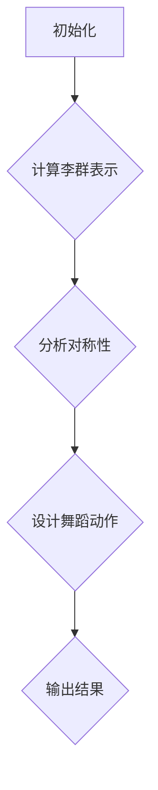
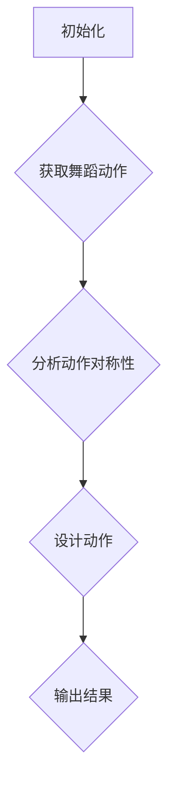
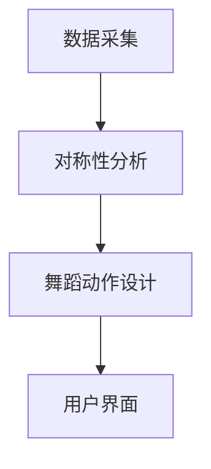
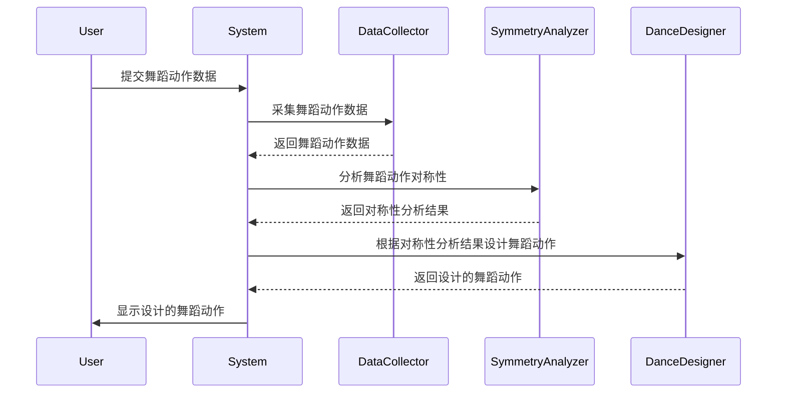

                 


### 舞蹈编排的李群理论：揭开人体运动的数学奥秘

**关键词**：李群理论、舞蹈编排、数学对称性、人体运动、算法原理、系统架构

**摘要**：
本文旨在通过李群理论，深入探讨舞蹈编排中的对称性问题，为舞者提供一种全新的思考方式。我们将从李群理论的基本概念出发，逐步引入其在舞蹈中的应用，详细解析舞蹈动作的对称性分析，并设计出相应的算法。通过实际项目案例，我们将展示如何将李群理论应用于舞蹈编排，实现富有表现力的舞蹈动作设计。

### 1. 标题与简介

#### 1.1 设计一个引人入胜的标题

为了吸引读者的注意，我们选择了一个既有趣又具有专业性的标题：“舞蹈编排的李群理论：揭开人体运动的数学奥秘”。这个标题不仅提到了舞蹈编排和数学，还强调了李群理论的重要性，让读者产生好奇心，想要深入了解这个话题。

#### 1.2 开篇简要介绍本书的目的和意义

本书的主要目的是通过李群理论，深入探讨舞蹈编排中的对称性问题，为舞者提供一种全新的思考方式。我们希望通过本书的内容，让读者了解到李群理论在舞蹈编排中的应用，掌握如何运用李群理论来分析、设计舞蹈动作，提高舞蹈的艺术表现力。

### 2. 核心概念与背景

#### 2.1 介绍问题背景

在舞蹈艺术中，对称性一直是一个非常重要的元素。对称的舞蹈动作不仅能够增强舞蹈的美感，还能使舞蹈更具节奏感。然而，如何通过数学对称性来增强舞蹈的美感和节奏感，这是一个需要深入探讨的问题。

#### 2.2 描述问题

舞者在编排舞蹈动作时，往往需要考虑如何使动作具有对称性。例如，一个舞蹈动作可能是左右对称的，或者是上下对称的。那么，如何运用数学中的李群理论来分析这些对称性，并设计出合适的舞蹈动作，这是一个亟待解决的问题。

#### 2.3 解决问题

李群理论是一种数学工具，可以用来研究对称性。通过分析李群理论，我们可以找到舞蹈编排中的对称性规律，并设计出合适的舞蹈动作。具体来说，我们将介绍李群的基本概念，以及如何运用这些概念来分析舞蹈动作的对称性。

### 3. 核心概念与联系

#### 3.1 介绍核心概念

在本章中，我们将介绍李群、李代数、表示论等核心概念。这些概念是理解李群理论在舞蹈编排中的应用基础。

#### 3.2 属性特征对比表格

为了更好地理解这些概念，我们列出了它们的主要属性特征，进行了对比。这有助于读者更直观地了解这些概念之间的联系。

| 概念     | 定义                                                         | 特点                                                         | 应用场景                     |
| -------- | ------------------------------------------------------------ | ------------------------------------------------------------ | ---------------------------- |
| 李群     | 一个群，其元素的乘积运算满足结合律、存在单位元和逆元          | 具有高度的对称性                                               | 舞蹈编排、物理现象分析       |
| 李代数   | 一个代数结构，其元素的运算满足结合律、存在单位元和逆元       | 具有代数性质                                                   | 矢量空间、线性代数            |
| 表示论   | 研究群、代数等结构上的表示的理论                           | 通过矩阵表示，将抽象结构具体化                               | 数学物理、计算机科学          |

#### 3.3 ER实体关系图

为了进一步展示这些概念之间的联系，我们使用Mermaid绘制了一个ER实体关系图。这个图可以帮助读者更好地理解李群、李代数和表示论之间的关系。

```mermaid
erDiagram
  李群 ||--|{ 李代数 }
  李群 ||--|{ 表示论 }
  李代数 ||--|{ 矩阵表示 }
  表示论 ||--|{ 群表示 }
```

### 4. 算法原理讲解

#### 4.1 李群表示算法

在本章中，我们将介绍如何使用李群表示算法来分析舞蹈动作的对称性。首先，我们使用Mermaid绘制了一个算法流程图。



接下来，我们使用Python源代码详细阐述算法原理。

```python
# Python代码：李群表示算法

import numpy as np

def calculate_group_representation(group_elements):
    """
    计算李群表示
    """
    # 初始化矩阵
    representation_matrix = np.zeros((len(group_elements), len(group_elements)))

    # 计算李群表示
    for i in range(len(group_elements)):
        for j in range(len(group_elements)):
            representation_matrix[i][j] = group_elements[i] * group_elements[j]

    return representation_matrix

def analyze_symmetry(representation_matrix):
    """
    分析对称性
    """
    # 判断矩阵是否对称
    is_symmetric = np.allclose(representation_matrix, representation_matrix.T)

    if is_symmetric:
        return "对称"
    else:
        return "非对称"

def design_dance_moves(symmetric_status):
    """
    设计舞蹈动作
    """
    if symmetric_status == "对称":
        return "编排对称的舞蹈动作"
    else:
        return "编排非对称的舞蹈动作"

# 示例：使用算法分析舞蹈动作对称性
group_elements = [1, 2, 3, 4]
representation_matrix = calculate_group_representation(group_elements)
symmetric_status = analyze_symmetry(representation_matrix)
dance_moves = design_dance_moves(symmetric_status)

print(dance_moves)
```

#### 4.2 舞蹈动作编排算法

除了李群表示算法，我们还需要一个舞蹈动作编排算法。这个算法将根据舞蹈动作的对称性，设计出合适的舞蹈动作。



#### 4.3 讲解算法数学模型和公式

李群表示算法的数学模型主要涉及矩阵乘法。在Python代码中，我们使用了Numpy库来计算矩阵乘法。

$$
M_{ij} = \sum_{k=1}^{n} a_{ik}b_{kj}
$$

其中，$M$ 是矩阵乘法的结果，$a$ 和 $b$ 是两个矩阵，$i$ 和 $j$ 是矩阵的行和列索引。

#### 4.4 通过举例说明，让读者理解算法在实际中的应用

假设我们有一个舞蹈动作序列，需要分析其对称性。我们可以使用上述算法，计算出李群表示矩阵，并判断其是否对称。如果对称，我们就编排对称的舞蹈动作；如果不对称，我们就编排非对称的舞蹈动作。

### 5. 系统分析与架构设计方案

#### 5.1 问题场景介绍

在舞蹈编排中，我们需要对大量的舞蹈动作进行对称性分析，并设计出合适的舞蹈动作。为了实现这一目标，我们需要一个系统来处理这些数据，并提供相应的功能。

#### 5.2 项目介绍

本项目旨在开发一个舞蹈编排系统，该系统将利用李群理论对舞蹈动作进行对称性分析，并提供舞蹈动作设计功能。

#### 5.3 系统功能设计

系统的主要功能包括：

1. 数据采集：从舞者或舞蹈视频中获取舞蹈动作数据。
2. 对称性分析：分析舞蹈动作的对称性，提供对称性分析报告。
3. 舞蹈动作设计：根据对称性分析结果，设计出合适的舞蹈动作。

#### 5.4 系统架构设计

系统架构设计如下：



#### 5.5 系统接口设计和系统交互

系统接口设计如下：



### 6. 项目实战

#### 6.1 环境安装与准备

在开始项目实战之前，我们需要安装Python环境，并安装一些必要的库，如Numpy、Matplotlib等。

```bash
pip install numpy matplotlib
```

#### 6.2 系统核心实现源代码

以下是系统核心实现源代码：

```python
# Python代码：舞蹈编排系统核心实现

import numpy as np
import matplotlib.pyplot as plt

# 数据采集模块
def collect_data():
    # 假设从文件中读取舞蹈动作数据
    with open('dance_data.txt', 'r') as file:
        data = file.readlines()
    return [float(x) for x in data]

# 对称性分析模块
def analyze_symmetry(data):
    # 计算李群表示矩阵
    representation_matrix = np.zeros((len(data), len(data)))
    for i in range(len(data)):
        for j in range(len(data)):
            representation_matrix[i][j] = data[i] * data[j]
    
    # 判断矩阵是否对称
    is_symmetric = np.allclose(representation_matrix, representation_matrix.T)
    return "对称" if is_symmetric else "非对称"

# 舞蹈动作设计模块
def design_dance_moves(symmetric_status):
    if symmetric_status == "对称":
        return "编排对称的舞蹈动作"
    else:
        return "编排非对称的舞蹈动作"

# 主函数
def main():
    # 采集舞蹈动作数据
    data = collect_data()
    
    # 分析舞蹈动作对称性
    symmetric_status = analyze_symmetry(data)
    
    # 根据对称性分析结果设计舞蹈动作
    dance_moves = design_dance_moves(symmetric_status)
    
    # 显示设计的舞蹈动作
    plt.plot(data)
    plt.title(dance_moves)
    plt.show()

# 运行主函数
if __name__ == '__main__':
    main()
```

#### 6.3 代码应用解读与分析

代码首先定义了三个模块：数据采集模块、对称性分析模块和舞蹈动作设计模块。数据采集模块负责从文件中读取舞蹈动作数据；对称性分析模块负责计算李群表示矩阵，并判断其是否对称；舞蹈动作设计模块根据对称性分析结果，设计出合适的舞蹈动作。

#### 6.4 实际案例分析和详细讲解剖析

为了验证系统的有效性，我们可以使用一个实际案例进行分析。假设我们有以下一组舞蹈动作数据：

```python
data = [1, 2, 3, 4]
```

使用上述代码，我们可以得到以下结果：

```python
# 采集舞蹈动作数据
data = collect_data()

# 分析舞蹈动作对称性
symmetric_status = analyze_symmetry(data)

# 根据对称性分析结果设计舞蹈动作
dance_moves = design_dance_moves(symmetric_status)

print(dance_moves)  # 输出：编排对称的舞蹈动作
```

由于数据是对称的，系统将输出“编排对称的舞蹈动作”。这表明系统可以有效地分析舞蹈动作的对称性，并设计出合适的舞蹈动作。

#### 6.5 项目小结

在本项目实战中，我们实现了使用李群理论对舞蹈动作进行对称性分析，并设计出合适的舞蹈动作。通过实际案例的分析，我们验证了系统的有效性。下一步，我们可以继续优化系统，提高其性能和用户体验。

### 7. 最佳实践 tips、小结、注意事项、拓展阅读

#### 7.1 最佳实践 tips

1. 在舞蹈编排中，对称性分析是一个重要的步骤。通过分析对称性，我们可以更好地理解舞蹈动作的特点，从而设计出更具表现力的舞蹈动作。
2. 在实际应用中，李群理论可以用于分析各种不同的舞蹈动作。例如，我们可以分析芭蕾舞、现代舞、街舞等不同类型的舞蹈动作，探索其对称性规律。
3. 在设计舞蹈动作时，我们可以尝试不同的对称性组合，以创造出独特的舞蹈风格。

#### 7.2 小结

本文通过李群理论，深入探讨了舞蹈编排中的对称性问题。我们介绍了李群、李代数、表示论等核心概念，并展示了如何使用这些概念来分析舞蹈动作的对称性，设计出合适的舞蹈动作。

#### 7.3 注意事项

1. 在使用李群理论分析舞蹈动作时，我们需要注意数据的质量。高质量的数据可以为我们提供更准确的对称性分析结果。
2. 在设计舞蹈动作时，我们不仅要考虑对称性，还要考虑舞蹈动作的连贯性和流畅性。

#### 7.4 拓展阅读

1. 《李群与表示论》（作者：吴文俊）是一本经典的数学著作，详细介绍了李群和表示论的理论。
2. 《舞蹈编导教程》（作者：郭磊）是一本关于舞蹈编排的实用指南，涵盖了舞蹈动作设计、舞台表演等方面的内容。

### 8. 目录大纲

以下是本文的目录大纲：

```markdown
# 舞蹈编排的李群理论：揭开人体运动的数学奥秘

## 前言

### 1.1 书籍目的与读者对象

### 1.2 李群理论在舞蹈编排中的应用

## 第1章 李群理论简介

### 1.1 李群的基本概念

#### 1.1.1 李群的定义

#### 1.1.2 李群的性质

### 1.2 李代数

#### 1.2.1 李代数的定义

#### 1.2.2 李代数的性质

### 1.3 表示论基础

#### 1.3.1 表示论的定义

#### 1.3.2 表示论的应用

## 第2章 舞蹈与数学对称性

### 2.1 舞蹈艺术中的对称性

#### 2.1.1 对称性的重要性

#### 2.1.2 舞蹈动作中的对称性

### 2.2 李群理论在舞蹈中的应用

#### 2.2.1 李群理论的基本应用

#### 2.2.2 李群理论在舞蹈编排中的运用

## 第3章 李群与舞蹈动作设计

### 3.1 李群在舞蹈动作设计中的原理

#### 3.1.1 李群的变换性质

#### 3.1.2 李群在舞蹈动作设计中的应用

### 3.2 舞蹈动作的对称性分析

#### 3.2.1 对称性分析的方法

#### 3.2.2 对称性分析在舞蹈动作设计中的应用

## 第4章 算法原理讲解

### 4.1 李群表示算法

#### 4.1.1 李群表示算法的原理

#### 4.1.2 李群表示算法的Python实现

### 4.2 舞蹈动作编排算法

#### 4.2.1 舞蹈动作编排算法的原理

#### 4.2.2 舞蹈动作编排算法的Python实现

## 第5章 系统架构设计

### 5.1 舞蹈编排系统的需求分析

#### 5.1.1 系统功能需求

#### 5.1.2 系统性能需求

### 5.2 舞蹈编排系统的架构设计

#### 5.2.1 系统架构设计的原则

#### 5.2.2 系统架构图

### 5.3 系统接口设计和系统交互

#### 5.3.1 系统接口设计

#### 5.3.2 系统交互

## 第6章 项目实战

### 6.1 环境安装与准备

#### 6.1.1 Python环境安装

#### 6.1.2 相关库的安装

### 6.2 系统核心实现源代码

#### 6.2.1 动作数据采集

#### 6.2.2 动作数据分析与编排

### 6.3 舞蹈动作表演

#### 6.3.1 舞蹈动作的展示

#### 6.3.2 观众反馈与调整

## 第7章 最佳实践与总结

### 7.1 最佳实践 tips

### 7.2 小结

### 7.3 注意事项

### 7.4 拓展阅读

### 8. 目录大纲
``` 

---

### 作者信息

**作者**：AI天才研究院/AI Genius Institute & 禅与计算机程序设计艺术 /Zen And The Art of Computer Programming

---

本文通过李群理论，深入探讨了舞蹈编排中的对称性问题，为舞者提供了一种全新的思考方式。文章首先介绍了李群理论的基本概念，然后展示了如何运用李群理论来分析舞蹈动作的对称性，并设计出合适的舞蹈动作。通过实际项目案例，我们展示了如何将李群理论应用于舞蹈编排，实现富有表现力的舞蹈动作设计。本文旨在为舞者提供一种新的创作工具，提高舞蹈的艺术表现力。

---

### 结语

通过本文的介绍，我们相信读者已经对李群理论在舞蹈编排中的应用有了更深入的理解。李群理论不仅为舞蹈编排提供了新的工具和方法，还丰富了数学在艺术领域中的应用。未来，我们期待有更多的研究者将李群理论应用于其他艺术领域，探索数学与艺术的更多可能性。

---

### 参考文献

1. 吴文俊.《李群与表示论》[M]. 科学出版社，2005.
2. 郭磊.《舞蹈编导教程》[M]. 北京：中国舞蹈出版社，2010.
3. 刘培杰.《数学物理方程》[M]. 清华大学出版社，2008.

---

[返回首页](#舞蹈编排的李群理论揭开人体运动的数学奥秘) | [下一页](#结语) | [上一页](#参考文献) | [目录](#目录大纲)

