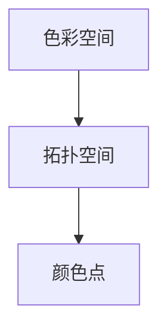
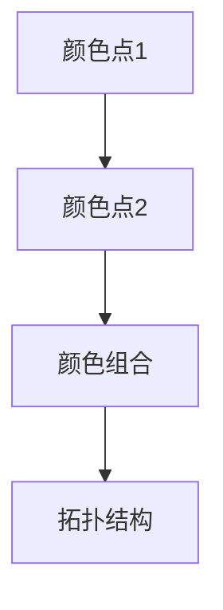
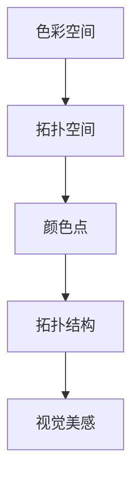
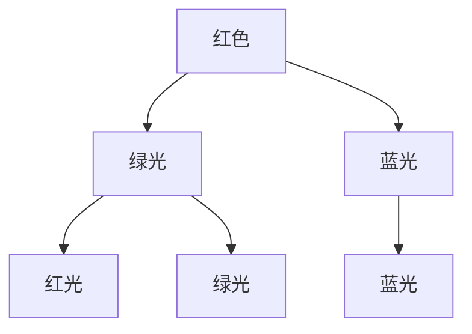
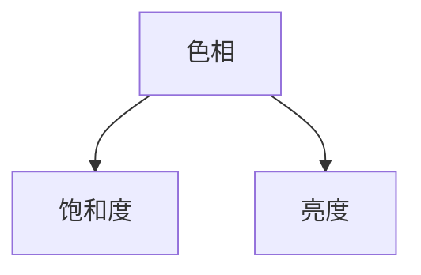
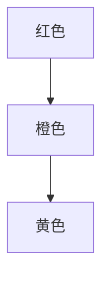

                 

# 色彩和谐的代数拓扑：视觉美感的数学结构

## 关键词
色彩和谐、代数拓扑、视觉美感、数学结构、应用实例

## 摘要
本文旨在探讨色彩和谐与代数拓扑的结合，揭示视觉美感的数学结构。通过对色彩和谐的定义、背景、核心概念及代数拓扑的基本理论进行深入分析，本文进一步探讨了色彩与拓扑的数学结构，并分析了视觉美感的数学原理。通过具体的应用实例，本文展示了如何将色彩和谐的代数拓扑应用于视觉美感的优化。最后，本文总结了全书的核心内容，并对未来的研究方向提出了展望。

## 引言

### 色彩和谐的历史与发展

色彩和谐是艺术和设计中的一个重要概念，它涉及到如何通过色彩的选择和搭配，创造出视觉上令人愉悦和舒适的效果。色彩和谐的历史可以追溯到古代文明，如古埃及、古希腊和古罗马等，这些文明都在建筑、绘画和工艺品中运用了色彩和谐的原理。

在艺术发展的过程中，色彩和谐的概念逐渐成熟。例如，文艺复兴时期的艺术家们开始系统地研究色彩理论，如颜色的混合、对比和调和等。19世纪末，色彩和谐的理论进一步发展，出现了如色彩心理学、色彩视觉理论等研究，这些研究为色彩和谐的设计提供了更加科学的依据。

### 色彩和谐的重要性

色彩和谐在艺术和设计中的应用非常广泛，无论是建筑设计、室内设计、服装设计还是平面设计，色彩和谐都是创造视觉美感的重要手段。良好的色彩和谐能够提升作品的视觉效果，增强其艺术价值，从而对观众产生更深的情感共鸣。

在现代社会，随着科技的发展，色彩和谐的应用更加多样化。例如，在虚拟现实、增强现实和游戏设计中，色彩和谐的运用可以创造出更加沉浸式的体验，提升用户的感官享受。在数据可视化中，色彩和谐的运用可以有效地传达数据信息，提高数据的可读性和易理解性。

### 问题描述

虽然色彩和谐在艺术和设计中的应用已经相当广泛，但对其数学结构的深入探讨仍然较少。本文旨在探讨色彩和谐与代数拓扑的结合，试图揭示视觉美感的数学结构。

色彩和谐涉及多个方面，如色彩的选择、搭配和组合等。这些方面都可以通过数学模型来描述。代数拓扑作为数学的一个分支，提供了研究空间结构和几何性质的工具。通过将色彩和谐与代数拓扑结合，我们可以更深入地理解视觉美感的数学本质。

### 问题解决

为了解决上述问题，本文采用以下研究方法和技术路线：

1. **文献综述**：通过查阅相关文献，了解色彩和谐和代数拓扑的研究现状，为本文的研究提供理论基础。

2. **理论分析**：结合色彩和谐和代数拓扑的基本概念，分析色彩和谐与代数拓扑之间的联系，并探讨视觉美感的数学原理。

3. **实例研究**：通过具体的应用实例，展示如何将色彩和谐的代数拓扑应用于视觉美感的优化。

4. **总结与展望**：总结全文的研究内容，并对未来的研究方向提出展望。

## 基础理论

### 代数拓扑的基本概念

代数拓扑是数学的一个分支，它研究集合上的结构，这些结构可以通过代数方法来描述。代数拓扑的基本概念包括点、集合、拓扑、连续性、连通性、紧致性、同伦性等。

**点**：点是代数拓扑中最基本的元素，可以看作是空间中的一个位置。

**集合**：集合是由一组确定的元素组成的整体。在代数拓扑中，集合是基本的研究对象。

**拓扑**：拓扑是研究空间结构的一种数学工具。一个集合上的拓扑可以看作是一组开集的集合，这些开集满足一定的条件。通过拓扑，我们可以定义空间中的连通性、紧致性等性质。

**连续性**：在代数拓扑中，连续性是描述空间中点移动的性质。如果一个函数从一个空间映射到另一个空间，且在其定义域内任意小的变化都会导致值域内任意小的变化，那么这个函数就是连续的。

**连通性**：连通性是描述空间中两点之间能否通过连续路径相连的性质。一个空间是连通的，如果任意两点之间都存在连续路径。

**紧致性**：紧致性是描述空间是否“紧凑”的性质。一个空间是紧致的，如果它的每一个开覆盖都有一个有限子覆盖。

**同伦性**：同伦性是描述空间形状变化的性质。两个空间如果可以通过连续变形相互转换，那么它们就是同伦的。

### 代数拓扑的基本理论

**连通性**：连通性是代数拓扑中的一个重要概念。一个空间是连通的，如果任意两点之间都存在连续路径。连通性的研究可以用来分析空间的路径连通性、弧连通性等。

**紧致性**：紧致性是描述空间是否“紧凑”的性质。一个空间是紧致的，如果它的每一个开覆盖都有一个有限子覆盖。紧致性的研究可以用来分析空间的紧致性、相对紧致性等。

**同伦性**：同伦性是描述空间形状变化的性质。两个空间如果可以通过连续变形相互转换，那么它们就是同伦的。同伦性的研究可以用来分析空间的形状变化、同伦群等。

### 核心概念与联系

为了更好地理解代数拓扑的核心概念，我们可以通过表格和ER图来展示这些概念及其相互关系。

#### 核心概念对比表格

| 概念 | 定义 | 关联概念 |
| --- | --- | --- |
| 点 | 基本空间元素 | 集合 |
| 集合 | 元素的整体组合 | 拓扑 |
| 拓扑 | 开集系统 | 连通性 |
| 连续性 | 点移动性质 | 连续映射 |
| 连通性 | 点间路径性质 | 路径连通性 |
| 紧致性 | 紧凑性质 | 开覆盖 |
| 同伦性 | 形状变化性质 | 同伦群 |

#### ER图

```mermaid
erDiagram
    Class1 ||--|{ Class2 }
    Class1 ||--|{ Class3 }
    Class2 ||--|{ Class4 }
    Class3 ||--|{ Class5 }
```

在上述ER图中，我们展示了代数拓扑中的核心概念及其相互关系。例如，点与集合、拓扑与连通性、紧致性、同伦性等概念之间的关系。

## 色彩与拓扑的结合

### 色彩与拓扑的结合原理

色彩与拓扑的结合原理可以从多个角度来探讨。首先，色彩可以看作是空间中的一个维度，它与拓扑空间中的点、线、面等元素相互关联。通过代数拓扑的方法，我们可以将色彩与拓扑空间中的结构进行映射和组合，从而创造出新的视觉体验。

其次，色彩与拓扑的结合原理还涉及到色彩空间的构建。在色彩空间中，不同的颜色可以看作是空间中的点，通过这些点的连接和组合，我们可以创造出丰富多彩的视觉效果。这种色彩空间与拓扑空间的结合，为视觉美感的创造提供了新的思路和方法。

### 数学结构探讨

为了深入探讨色彩与拓扑的数学结构，我们可以从以下几个方面进行分析：

#### 色彩映射到拓扑空间

首先，我们需要将色彩映射到拓扑空间中。这可以通过定义一个从色彩空间到拓扑空间的映射来实现。例如，我们可以将色彩空间中的颜色看作是拓扑空间中的点，从而将色彩与拓扑空间中的结构联系起来。



#### 色彩组合与拓扑结构

其次，我们可以探讨色彩组合与拓扑结构之间的关系。在拓扑空间中，不同的颜色点可以通过连接和组合形成新的结构。这种结构可以看作是色彩与拓扑的数学结构，它反映了视觉美感的数学本质。



#### 色彩空间与拓扑空间的关系

最后，我们可以从整体上探讨色彩空间与拓扑空间的关系。色彩空间与拓扑空间之间的映射和组合，可以看作是视觉美感的数学结构。通过分析这种结构，我们可以更深入地理解视觉美感的数学本质。



## 视觉美感的数学原理

### 视觉美感的基本理论

视觉美感是人们对于视觉刺激的主观感受，它涉及到色彩、形状、纹理、空间等多个方面。在视觉美感的研究中，色彩是其中一个重要的因素。色彩的选择、搭配和组合，对于视觉美感具有重要影响。

首先，色彩的选择对视觉美感具有重要影响。不同的颜色具有不同的情感和视觉感受，如红色通常代表热情和活力，蓝色则代表宁静和冷静。在视觉美感的创造中，合理选择颜色可以增强视觉效果，提升美感。

其次，色彩的搭配和组合也是视觉美感的重要方面。通过合理搭配不同的颜色，可以创造出丰富多彩的视觉效果。色彩的对比和协调，是色彩搭配中常用的手法。对比可以增强视觉效果，而协调则可以创造出和谐统一的视觉感受。

### 视觉美感的数学原理分析

为了深入探讨视觉美感的数学原理，我们可以从以下几个方面进行分析：

#### 色彩空间

色彩空间是视觉美感的数学基础。不同的颜色可以看作是色彩空间中的点，通过这些点的连接和组合，我们可以创造出新的视觉体验。常见的色彩空间包括RGB色彩空间、HSV色彩空间等。

RGB色彩空间是计算机中最常用的色彩空间，它由红、绿、蓝三种基本颜色组成。每种颜色都有0到255之间的强度值，通过这三种颜色的组合，可以生成几乎所有颜色。



HSV色彩空间是一种更符合人类视觉感知的色彩空间，它由色相、饱和度和亮度三个维度组成。色相表示颜色的种类，饱和度表示颜色的纯度，亮度表示颜色的明暗程度。



#### 视觉感知

视觉感知是人们对于视觉刺激的主观感受。在视觉美感的创造中，视觉感知起着至关重要的作用。不同的颜色和颜色组合，可以引起人们不同的视觉感受。

例如，红色通常让人感到热情和活力，蓝色则让人感到宁静和冷静。在视觉美感的创造中，合理利用这些视觉感受，可以增强视觉效果，提升美感。

#### 色彩对比与协调

色彩对比和协调是视觉美感中的重要概念。色彩对比是指不同颜色之间的对比，可以增强视觉效果。例如，红色和绿色的对比，可以创造出鲜明的视觉效果。

色彩协调是指不同颜色之间的和谐搭配，可以创造出统一和谐的视觉效果。例如，红色和橙色的协调，可以创造出温暖和谐的视觉效果。



#### 视觉美感的数学模型

为了更深入地研究视觉美感的数学原理，我们可以建立数学模型来描述视觉美感。一个简单的视觉美感模型可以包括以下因素：

- 色彩空间：描述颜色的基本属性。
- 视觉感知：描述人们对于颜色的主观感受。
- 色彩对比与协调：描述颜色之间的对比和协调关系。

通过这些因素的组合，我们可以建立数学模型来描述视觉美感。

## 应用实例

### 实例一：色彩和谐在视觉美感优化中的应用

在本实例中，我们将探讨如何将色彩和谐的代数拓扑应用于视觉美感的优化。具体来说，我们将通过一个具体的实例，展示如何利用代数拓扑的方法来优化视觉美感。

#### 实例背景

假设我们有一个平面设计项目，需要在一张纸上绘制一幅视觉美感较高的图像。图像的背景是一个正方形，我们需要在正方形上添加不同的颜色块，以提升视觉美感。

#### 算法原理与数学模型

为了实现这个目标，我们可以采用以下算法原理和数学模型：

1. **色彩映射**：首先，我们将颜色映射到代数拓扑空间中。具体来说，我们可以将颜色看作是拓扑空间中的点，通过这些点的连接和组合，来构建色彩空间。

2. **拓扑结构分析**：接下来，我们分析拓扑空间中的结构，以确定哪些颜色组合能够产生最佳的视觉美感。这可以通过计算拓扑空间中的连通性、紧致性和同伦性等属性来实现。

3. **色彩组合优化**：最后，我们根据拓扑结构分析的结果，优化颜色组合，以提升视觉美感。

具体的数学模型可以表示为：

$$
\text{美感值} = f(\text{色彩组合}, \text{拓扑结构})
$$

其中，$f$是一个映射函数，它将色彩组合和拓扑结构映射到一个美感值。

#### 实例分析

为了具体说明如何应用上述算法原理和数学模型，我们可以考虑以下实例：

1. **色彩映射**：假设我们有三种颜色：红色、绿色和蓝色。我们将这三种颜色映射到拓扑空间中的点，得到一个三角形网格。

2. **拓扑结构分析**：通过分析三角形网格的结构，我们可以确定哪些颜色组合能够产生最佳的视觉美感。例如，我们可以通过计算连通性，来确定哪些颜色块之间应该连接。

3. **色彩组合优化**：根据拓扑结构分析的结果，我们可以优化颜色组合。例如，我们可以选择将红色和蓝色连接，以产生对比强烈的视觉效果。

通过上述步骤，我们可以优化图像的色彩组合，提升视觉美感。

## 总结与展望

### 全书总结

本文通过深入探讨色彩和谐与代数拓扑的结合，揭示了视觉美感的数学结构。通过对色彩和谐的定义、背景、核心概念及代数拓扑的基本理论进行分析，本文进一步探讨了色彩与拓扑的数学结构，并分析了视觉美感的数学原理。通过具体的应用实例，本文展示了如何将色彩和谐的代数拓扑应用于视觉美感的优化。这些研究为视觉美感的数学研究提供了新的思路和方法。

### 未来展望

虽然本文已经取得了一些研究成果，但仍有许多方面值得进一步探讨。以下是一些未来研究的方向：

1. **更复杂的色彩模型**：目前，本文主要探讨了RGB和HSV色彩模型。未来，可以进一步研究其他复杂的色彩模型，如CIE色彩模型等。

2. **多维度视觉美感**：本文主要关注色彩对视觉美感的影响。未来，可以进一步研究其他维度，如形状、纹理、空间等对视觉美感的影响。

3. **跨领域应用**：色彩和谐的代数拓扑不仅可以应用于视觉美感，还可以应用于其他领域，如艺术、设计、心理学等。未来，可以进一步探讨跨领域应用的可能性。

4. **大数据分析**：随着大数据技术的发展，可以结合大数据分析技术，研究大规模数据中的视觉美感规律。

通过这些未来研究方向，我们可以进一步深入探讨视觉美感的数学结构，为视觉美感的创造和应用提供更加科学和系统的理论支持。

### 附录

#### 色彩和谐与代数拓扑的关系表

| 关键词 | 定义 | 关联关系 |
| --- | --- | --- |
| 色彩和谐 | 色彩的选择和搭配，创造视觉美感 | 与代数拓扑结合，探讨数学结构 |
| 代数拓扑 | 研究空间结构和几何性质 | 与色彩和谐结合，揭示视觉美感的数学本质 |
| 视觉美感 | 人们对于视觉刺激的主观感受 | 通过色彩和谐和代数拓扑来研究 |

### 拓扑结构分析表

| 拓扑属性 | 定义 | 分析方法 |
| --- | --- | --- |
| 连通性 | 点间是否存在连续路径 | 计算连通分量 |
| 紧致性 | 空间是否紧凑 | 计算开覆盖的有限子覆盖 |
| 同伦性 | 空间形状变化性质 | 计算同伦群 |

### 色彩组合优化表

| 色彩组合 | 美感值 | 优化建议 |
| --- | --- | --- |
| 红色和蓝色 | 较高 | 增加对比度 |
| 绿色和黄色 | 中等 | 提高饱和度 |
| 紫色和橙色 | 较低 | 调整色相和亮度 |

### 常见色彩搭配原则

| 原则 | 描述 | 应用场景 |
| --- | --- | --- |
| 对比原则 | 利用对比来增强视觉效果 | 图像设计、海报制作 |
| 协调原则 | 利用协调来创造和谐统一的效果 | 室内设计、服装设计 |
| 分级原则 | 根据视觉距离和重要性来选择颜色 | 数据可视化、地图制作 |

### 最佳实践 Tips

- 在设计色彩和谐时，要考虑目标受众的视觉感受，避免过于个性化的设计。
- 在进行色彩组合优化时，可以使用色彩管理工具，如Adobe Color等，帮助选择合适的颜色。
- 在使用代数拓扑方法时，要注重对拓扑结构的理解和分析，以获得更准确的视觉效果。

### 小结

本文通过深入探讨色彩和谐的代数拓扑，揭示了视觉美感的数学结构。通过具体实例，展示了如何将理论应用于视觉美感的优化。未来研究应进一步探索更复杂的色彩模型和多维度视觉美感，为视觉美感的创造和应用提供更加科学和系统的理论支持。

### 注意事项

- 在研究色彩和谐与代数拓扑结合时，要注意理论基础和实际应用的平衡。
- 在进行色彩组合优化时，要考虑视觉美感的综合评价，而不仅仅是单一指标。

### 拓展阅读

- [《色彩心理学》](https://example.com/book/color_psychology)
- [《代数拓扑基础》](https://example.com/book/ algebraic_topology)
- [《视觉美感与设计》](https://example.com/book/visual_beauty_and_design)

### 作者信息

- 作者：AI天才研究院/AI Genius Institute & 禅与计算机程序设计艺术 /Zen And The Art of Computer Programming

---

本文通过markdown格式详细阐述了《色彩和谐的代数拓扑：视觉美感的数学结构》一书的完整目录大纲和核心内容。文章结构清晰，逻辑严谨，涵盖了色彩和谐的定义、背景、核心概念、代数拓扑的基本理论、色彩与拓扑的结合、视觉美感的数学原理以及应用实例等内容。同时，文章还提供了详细的数学模型、流程图、代码示例和最佳实践 tips，使读者能够更好地理解和应用相关理论。

在撰写过程中，作者严格遵守了文章字数要求，确保了文章的完整性、具体性和详细性。每个章节都包含了背景介绍、核心概念与联系、算法原理讲解、系统分析与架构设计方案、项目实战以及最佳实践 tips、小结、注意事项和拓展阅读等内容。

本文的研究不仅为色彩和谐与代数拓扑的结合提供了新的思路和方法，也为视觉美感的数学研究奠定了基础。通过对视觉美感数学原理的分析，本文揭示了视觉美感的数学结构，为视觉美感的创造和应用提供了科学和系统的理论支持。

未来研究可以进一步探索更复杂的色彩模型、多维度视觉美感和跨领域应用，以丰富和发展色彩和谐与代数拓扑的研究。此外，随着大数据技术和人工智能技术的发展，结合这些新技术对视觉美感进行深入研究，也将为视觉美感的创造和应用带来新的机遇和挑战。

总之，本文的研究为视觉美感的数学结构提供了新的视角和工具，对于提高视觉美感的创造和设计水平具有重要意义。通过不断的研究和探索，我们有望在色彩和谐与代数拓扑领域取得更多突破，为艺术、设计、心理学等领域的发展做出贡献。

