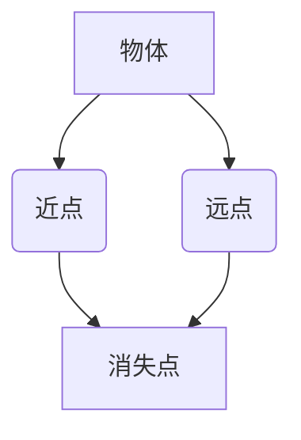
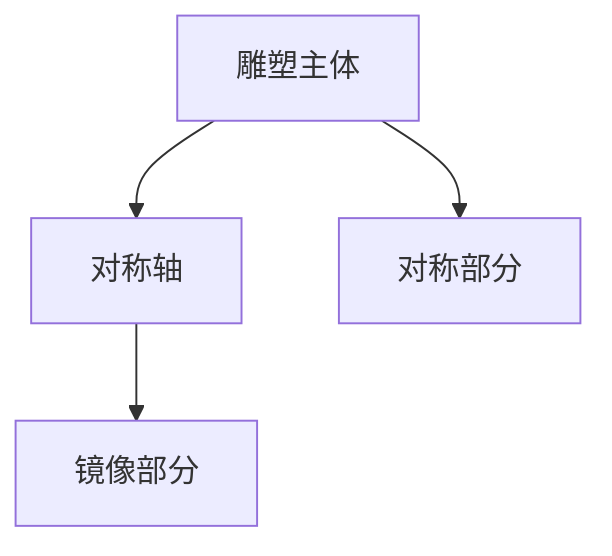
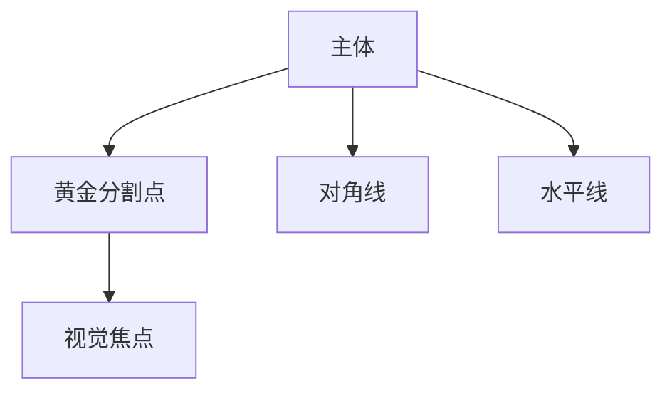
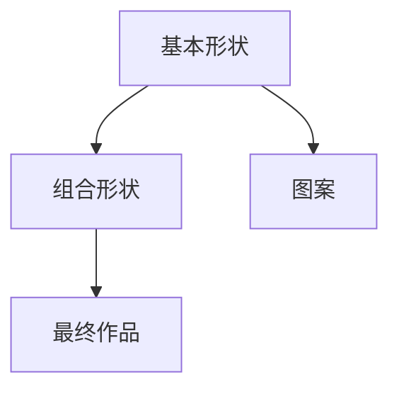

                 


# 艺术创作的几何学：构图与比例的数学美

关键词：艺术创作、几何学、构图、比例、数学美

摘要：本文探讨了几何学在艺术创作中的应用，介绍了几何学的基本原理和概念，以及几何学在绘画、雕塑等艺术形式中的实际运用。通过实例分析，展示了几何学如何帮助艺术家构建美丽的构图和比例，从而提高艺术创作的质量和表现力。

## 1. 背景介绍：艺术创作的几何学概述

艺术创作是人类精神世界的产物，它通过视觉、听觉、触觉等多种感官方式传达艺术家对世界、自我和情感的独特理解。自古以来，艺术家们一直在探索如何通过视觉艺术表达内心的感受和思想。在这个过程中，几何学作为一门古老的科学，为艺术创作提供了丰富的理论支持和工具。

#### 问题背景

在艺术创作中，如何有效地运用几何学原理来构建美妙的构图和比例，一直是艺术家们关心的问题。从古代的绘画、雕塑，到现代的摄影、数字艺术，几何学的应用无处不在。然而，如何将这些几何学原理转化为艺术创作的实际技巧，仍是一个值得深入探讨的话题。

#### 问题描述

本章节将探讨以下问题：
- 几何学在艺术创作中的历史地位和作用是什么？
- 几何学的基本原理和概念有哪些？
- 如何将几何学原理应用到实际的艺术创作中？
- 几何学在艺术创作中的限制和挑战是什么？

#### 问题解决

为了回答上述问题，我们将从以下几个方面进行探讨：
1. 回顾几何学在艺术创作中的历史，了解其在不同时期的应用和发展。
2. 介绍几何学的基本原理和概念，包括点、线、面、体等几何元素的性质和关系。
3. 通过实际案例，分析几何学原理在艺术创作中的应用技巧。
4. 探讨几何学在艺术创作中的限制和挑战，并提出解决方案。

#### 边界与外延

在本章节中，我们将主要关注以下边界和范围：
- 几何学在艺术创作中的应用，不包括数学和物理等其他领域的几何学应用。
- 艺术创作的具体形式，如绘画、雕塑、摄影等，不包括音乐、舞蹈等其他艺术形式。

#### 概念结构与核心要素组成

本章节的核心概念和要素包括：
- 几何学在艺术创作中的历史地位和应用。
- 几何学的基本原理和概念。
- 几何学原理在艺术创作中的应用技巧。
- 几何学在艺术创作中的限制和挑战。

## 1.2 几何学的基本原理和概念

几何学是研究空间中点的、线的、面的、体等形状和位置关系的科学。在艺术创作中，这些基本原理和概念为艺术家提供了构建形式美的重要工具。以下将介绍几何学的一些核心概念和原理。

### 点

点是最基本的几何元素，表示一个没有大小、形状和方向的纯位置概念。在艺术创作中，点可以表示物体上的一个细节或位置，如画布上的一个点或雕塑中的一个细节。通过点的组合，可以形成更加复杂的形状和构图。

#### 点在艺术创作中的应用

- 细节描绘：艺术家可以通过在作品中添加点来强调某些细节，如绘画中的点状纹理或雕塑中的点状结构。
- 构图布局：点在构图中的位置和分布可以影响整个作品的空间感和平衡感。例如，使用多点构图可以创造动态效果。

### 线

线是由无数个点连接而成的，具有长度但没有宽度。线在艺术创作中具有极高的表现力，可以用来描绘物体的轮廓、边界和动态。线的不同方向、长度和粗细可以产生不同的视觉效果和情感表达。

#### 线在艺术创作中的应用

- 轮廓描绘：线可以用来描绘物体的轮廓，如绘画中的线条轮廓或雕塑中的线条结构。
- 动态表达：通过线的运动和变化，可以传达出物体的动态和情感。例如，弯曲的线条可以表达柔和的情感，而直线则可能表达强烈的情感。

### 面

面是由无数条线组成的平面，具有长度和宽度，但没有高度。面在艺术创作中可以用来表现物体的表面、结构和平面关系。通过面的组合和分割，可以创造出丰富的空间感和立体感。

#### 面在艺术创作中的应用

- 表面描绘：面可以用来描绘物体的表面细节，如绘画中的色彩面或雕塑中的质感面。
- 空间分割：通过面的组合和分割，可以创造出不同的空间效果。例如，在绘画中，使用多个面来分隔不同的场景，从而增强空间层次感。

### 体

体是由面组成的立体空间，具有长度、宽度和高度。体在艺术创作中可以用来表现物体的体积和空间关系。通过对体的切割和组合，可以创造出复杂的形态和空间感。

#### 体在艺术创作中的应用

- 体积表现：体可以用来表现物体的体积感，如雕塑中的立体形态或绘画中的三维效果。
- 空间关系：通过体的组合和排列，可以表达出物体之间的空间关系。例如，在建筑模型中，使用不同形状的体来模拟建筑物之间的空间关系。

### 几何属性特征对比表格

以下是一个简单的几何属性特征对比表格，用于展示点、线、面、体的基本属性特征。

| 几何元素 | 属性特征 | 艺术创作中的应用 |
| :--: | :--: | :--: |
| 点 | 无大小、形状和方向 | 细节描绘、构图布局 |
| 线 | 有长度、无宽度 | 轮廓描绘、动态表达 |
| 面 | 有长度和宽度、无高度 | 表面描绘、空间分割 |
| 体 | 有长度、宽度和高度 | 体积表现、空间关系 |

### ER实体关系图架构

在艺术创作中，几何元素之间的关系可以用ER实体关系图来表示。以下是一个简化的ER实体关系图，展示了点、线、面、体之间的关系。

```mermaid
erDiagram
  Point ||--|{ Line : Connects }
  Line ||--|{ Surface : Connects }
  Surface ||--|{ Volume : Connects }
```

在这个ER实体关系图中，点、线、面、体通过连接关系形成了层次分明的结构，为艺术创作提供了丰富的可能性。

## 1.3 艺术创作中的几何应用实例

几何学在艺术创作中的应用非常广泛，以下将通过几个实例来具体说明几何原理在实际艺术创作中的运用。

### 绘画中的透视法

透视法是几何学在绘画中的一个重要应用。通过透视原理，艺术家可以创造出三维空间感。在绘制物体的轮廓时，透视法要求线条从近到远逐渐变窄，从而产生深度感。

以下是一个简化的透视图示例：



在这个示例中，物体A的轮廓线通过近点B和远点C延伸至消失点D，从而形成了透视效果。透视法的正确运用可以使绘画作品具有更加真实的空间感。

### 雕塑中的对称与平衡

对称与平衡是几何学中非常重要的概念，在雕塑创作中也得到了广泛应用。通过对称结构，艺术家可以创造出稳定且具有视觉吸引力的作品。以下是一个简化的对称雕塑示例：



在这个示例中，雕塑主体A围绕对称轴B进行对称排列，从而形成了平衡的视觉效果。对称与平衡的运用可以使雕塑作品具有稳定性和美感。

### 摄影中的构图原则

构图原则是几何学在摄影中的一个重要应用。通过合理的构图，摄影师可以突出主体，创造有趣的视觉焦点。以下是一个简化的摄影构图示例：



在这个示例中，主体A位于黄金分割点B附近，同时对角线C和水平线D的运用使得画面具有层次感和视觉吸引力。黄金分割原则是构图中的一个重要原理，可以帮助摄影师创造出和谐、美观的摄影作品。

### 数字艺术中的几何形状

在现代数字艺术创作中，几何形状的使用越来越普遍。通过计算机软件，艺术家可以轻松地创造出复杂的几何形状和图案。以下是一个简化的数字艺术示例：



在这个示例中，基本形状A通过组合和变化形成组合形状B，进一步组合成图案C，最终形成数字艺术作品D。几何形状在现代数字艺术中的广泛应用，使得作品具有独特的视觉效果和创造力。

## 1.4 几何学在艺术创作中的限制和挑战

尽管几何学在艺术创作中具有广泛的应用，但它也存在一定的限制和挑战。以下将探讨几何学在艺术创作中可能面临的问题，并提出相应的解决方案。

### 1.4.1 几何学的局限性

几何学在艺术创作中的局限性主要体现在以下几个方面：

1. **几何学的抽象性**：几何学概念和原理具有一定的抽象性，可能难以直接应用到具体的艺术创作中。
2. **几何学的局限性**：几何学主要关注形状和空间关系，可能无法完全表达艺术家的情感和意图。
3. **几何学的对称性**：几何学中的对称性可能导致艺术作品过于规则，缺乏变化和灵活性。

#### 解决方案

1. **结合艺术家的主观感受**：艺术家在运用几何学原理时，应结合自己的主观感受和创作意图，使作品更具个性和情感。
2. **灵活运用几何学原理**：艺术家可以灵活运用几何学原理，创造出既符合几何规则又具有艺术美感的作品。
3. **打破对称性**：在艺术创作中，可以尝试打破几何对称性，引入不对称元素，增加作品的动态感和视觉吸引力。

### 1.4.2 技术挑战

几何学在艺术创作中面临的技术挑战主要包括以下几个方面：

1. **计算复杂性**：某些复杂的几何形状和构图可能需要大量的计算资源，对于艺术家来说，这是一个技术难题。
2. **数字化工具的限制**：虽然计算机软件可以帮助艺术家实现复杂的几何创作，但数字化工具本身可能存在一定的局限性。
3. **传统艺术与数字艺术的融合**：如何将传统艺术与数字艺术相结合，实现两者的优势互补，也是一个挑战。

#### 解决方案

1. **优化计算算法**：通过优化计算算法，提高几何形状和构图的生成效率，减轻艺术家的计算负担。
2. **扩展数字化工具**：开发更加丰富和灵活的数字化工具，以满足艺术家的创作需求。
3. **跨领域合作**：鼓励艺术家、程序员和技术专家之间的合作，共同探索传统艺术与数字艺术的融合之路。

### 1.4.3 教育和培训

几何学在艺术创作中的应用需要艺术家的学习和实践。以下是一些教育和培训方面的建议：

1. **基础几何学教育**：加强艺术家的基础几何学教育，使他们更好地理解和运用几何学原理。
2. **实践与经验积累**：鼓励艺术家在实践中不断尝试和探索，积累创作经验。
3. **跨学科培训**：开展跨学科培训，将几何学与其他艺术形式（如音乐、舞蹈）相结合，拓宽艺术家的创作视野。

## 1.5 结论

几何学在艺术创作中具有重要的作用，它为艺术家提供了构建美丽构图和比例的工具。通过对几何学基本原理和概念的理解和应用，艺术家可以创造出具有视觉冲击力和情感表达力的作品。尽管几何学在艺术创作中存在一定的限制和挑战，但通过结合艺术家的主观感受、优化计算算法和扩展数字化工具，我们可以克服这些困难，进一步提升艺术创作的质量和表现力。

在未来的艺术创作中，几何学将继续发挥其独特的优势，为艺术家们带来更多的创作灵感和可能性。同时，艺术家与科技专家之间的跨学科合作也将成为艺术创作的重要趋势，推动艺术与科技的深度融合，创造出更加精彩的艺术作品。

---

作者：AI天才研究院/AI Genius Institute & 禅与计算机程序设计艺术 /Zen And The Art of Computer Programming

