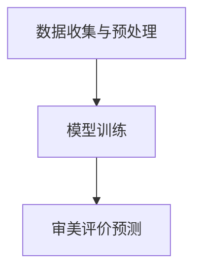
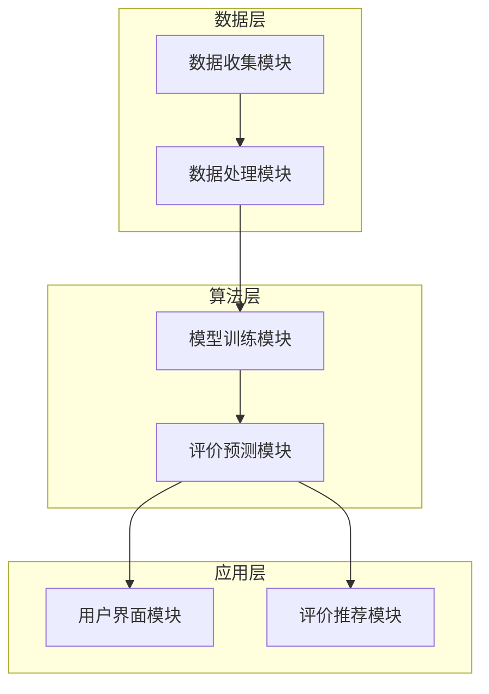
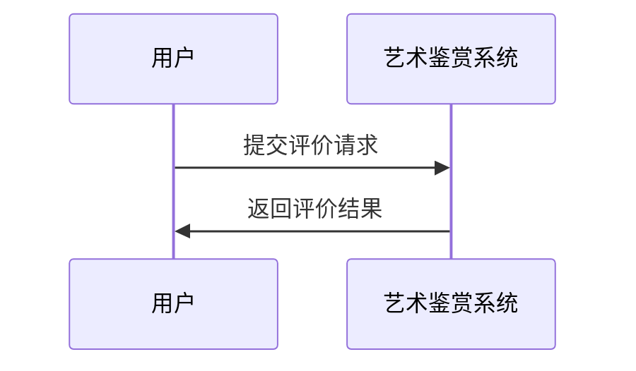

                 

### 第一部分：艺术鉴赏的神经美学基础

#### 第1章：艺术鉴赏与神经美学概述

艺术鉴赏作为人类文化传承的重要组成部分，它不仅体现了人们审美观念的变迁，更是社会文明进步的标志。艺术鉴赏的深度和广度，往往决定了个体文化素养的高低。随着科技的发展，神经美学作为一门跨学科的研究领域，开始尝试从神经科学的角度解析审美体验的机制。

**1.1 艺术鉴赏的起源与发展**

艺术鉴赏的历史可以追溯到古代，但作为一个独立的学术领域，其发展相对较晚。在中世纪，艺术鉴赏主要依赖于宗教信仰和道德教化。文艺复兴时期，艺术鉴赏开始从宗教束缚中解放出来，艺术家和鉴赏家们开始以更为理性和科学的态度审视艺术作品。18世纪的启蒙运动进一步推动了艺术鉴赏的理论化发展，出现了一批重要的艺术理论著作。

**1.2 神经美学的兴起与发展**

神经美学的兴起可以追溯到20世纪末，当时神经科学的发展开始揭示人类大脑的复杂结构和功能。神经美学的诞生，旨在通过神经科学的研究方法，探讨艺术创作和审美体验的生理和心理基础。其核心思想是，艺术作品的美感是通过大脑的神经活动产生的。

**1.3 审美体验的神经基础**

审美体验的神经基础主要包括大脑中的特定区域和神经通路。其中，前额叶皮层、颞叶、顶叶等区域在审美体验中发挥着重要作用。前额叶皮层与情感、决策相关，颞叶与音乐和语言处理相关，而顶叶则与空间认知和视觉处理相关。这些区域协同工作，共同构成了审美体验的神经基础。

#### 第2章：神经美学的核心概念与联系

神经美学作为一个跨学科领域，其核心概念涵盖了神经科学、心理学和艺术理论等多个方面。理解这些核心概念，有助于我们更深入地探讨审美体验的机制。

**2.1 神经网络基础**

神经网络是神经美学研究的基础，它模拟了人脑的基本结构和功能。神经网络通过神经元之间的连接和传递信号，实现信息的处理和存储。在神经美学中，神经网络被用来模拟审美体验的生理过程。

**2.2 美学心理学探讨**

美学心理学是研究人类审美体验的心理学分支。它探讨了审美体验的个体差异、情感反应和文化背景等多个方面。美学心理学的研究成果，为神经美学提供了重要的理论支持。

**2.3 神经美学与心理学的关系**

神经美学和心理学有着紧密的联系。心理学提供了关于人类情感、认知和行为的理论框架，而神经美学则通过神经科学的方法，验证和扩展了心理学的研究成果。两者的结合，为我们理解审美体验提供了全新的视角。

### 第3章：审美体验的数学量化方法

审美体验的数学量化，是神经美学研究中的一个重要方向。通过量化的方法，我们可以更精确地描述和比较审美体验的差异。

**3.1 数据收集与预处理**

在进行审美体验的量化研究之前，首先需要收集相关的数据。这些数据可以包括个体对艺术作品的评价、生理反应（如心率、皮肤电反应）等。收集到的数据需要进行预处理，以确保其质量和可靠性。

**3.2 常用量化指标**

常见的量化指标包括平均值、标准差、相关性等。这些指标可以帮助我们分析审美体验的统计特性，从而更好地理解其内在机制。

**3.3 数学模型简介**

数学模型是量化审美体验的核心工具。常见的数学模型包括神经网络模型、决策树模型和回归模型等。这些模型可以通过对大量数据的训练，预测个体对艺术作品的审美评价。

### 第4章：审美体验的算法原理

算法原理是神经美学研究的关键，它决定了审美体验量化方法的效率和准确性。以下是一个基本的算法原理讲解。

**4.1 算法设计思路**

算法设计思路主要包括数据收集、数据处理和模型训练等步骤。首先，通过数据收集获得个体对艺术作品的评价和生理反应数据。然后，对数据进行预处理，以消除噪声和异常值。最后，使用训练好的神经网络模型，对新的艺术作品进行审美评价。

**4.2 算法流程与mermaid流程图**

算法流程可以概括为以下步骤：

1. 数据收集与预处理
2. 模型训练
3. 审美评价预测

以下是一个简单的mermaid流程图：



**4.3 Python源代码解析**

以下是一个简单的Python代码示例，用于训练一个基于神经网络的审美体验预测模型。

```python
import tensorflow as tf
from tensorflow.keras.models import Sequential
from tensorflow.keras.layers import Dense

# 数据准备
X_train, y_train = ...  # 数据加载与预处理
X_test, y_test = ...    # 测试数据加载与预处理

# 模型构建
model = Sequential([
    Dense(64, activation='relu', input_shape=(X_train.shape[1],)),
    Dense(64, activation='relu'),
    Dense(1, activation='sigmoid')
])

# 模型编译
model.compile(optimizer='adam', loss='binary_crossentropy', metrics=['accuracy'])

# 模型训练
model.fit(X_train, y_train, epochs=10, batch_size=32, validation_split=0.2)

# 模型评估
loss, accuracy = model.evaluate(X_test, y_test)
print(f'测试集准确率：{accuracy:.2f}')
```

### 第5章：数学模型和公式讲解与举例说明

数学模型和公式是神经美学研究的重要工具，它们帮助我们量化并理解审美体验的复杂机制。以下是对几个关键数学模型和公式的讲解及举例说明。

**5.1 神经活动与概率分布**

神经活动可以通过概率分布来描述。例如，一个神经元在特定条件下激活的概率可以用伯努利分布来表示。

**5.2 审美评价的量化公式**

审美评价可以通过多个因素的加权平均来量化。例如，一个综合评分可以通过以下公式计算：

$$
S = w_1 \cdot A_1 + w_2 \cdot A_2 + \ldots + w_n \cdot A_n
$$

其中，$S$ 是综合评分，$w_i$ 是第$i$个因素的权重，$A_i$ 是第$i$个因素的评价分数。

**5.3 应用案例解析**

假设我们有一个艺术作品评价系统，它包含三个主要因素：色彩、构图和情感。以下是一个具体的案例：

- 色彩评分：80分
- 构图评分：85分
- 情感评分：90分

根据权重分配，我们可以计算出综合评分：

$$
S = 0.4 \cdot 80 + 0.3 \cdot 85 + 0.3 \cdot 90 = 82
$$

### 第6章：系统分析与架构设计方案

系统分析与架构设计是神经美学研究应用的重要环节，它决定了系统的性能、可扩展性和可靠性。

**6.1 艺术鉴赏系统的概述**

艺术鉴赏系统旨在通过神经美学的理论和方法，对艺术作品进行自动评价和推荐。系统主要包括数据收集、数据处理、模型训练和评价预测四个模块。

**6.2 领域模型设计与mermaid类图**

领域模型是系统设计的基础，它定义了系统的核心概念和关系。以下是一个简化的mermaid类图：

```mermaid
classDiagram
Class::艺术作品 <|-- Class::评价
Class::评价 <|-- Class::色彩评价
Class::评价 <|-- Class::构图评价
Class::评价 <|-- Class::情感评价
```

**6.3 系统架构设计与mermaid架构图**

系统架构设计需要考虑系统的模块划分、数据流和接口设计。以下是一个简化的mermaid架构图：



**6.4 系统接口设计和数据流**

系统接口设计是系统与用户、其他系统交互的桥梁。以下是一个简化的mermaid序列图：



### 第7章：项目实战

项目实战是将理论应用于实践的关键环节。以下是一个简化的项目实战流程：

**7.1 环境搭建与配置**

在开始项目之前，需要搭建一个合适的环境，包括Python环境、TensorFlow库等。

**7.2 系统核心实现源代码**

系统核心实现包括数据收集、数据处理、模型训练和评价预测等模块。

**7.3 代码应用解读与分析**

对系统核心实现代码进行解读，分析其原理和应用。

**7.4 实际案例分析与讲解**

通过实际案例，分析系统的性能和效果，讲解系统的应用场景和局限性。

### 第8章：最佳实践 tips & 小结

在神经美学研究中，最佳实践是提高研究效率和效果的关键。以下是一些最佳实践建议：

- 数据质量是关键，确保数据的准确性和可靠性。
- 模型选择要合适，根据数据特点和需求选择合适的模型。
- 模型训练要充分，确保模型对数据的适应性。
- 系统测试要全面，确保系统在各种情况下都能稳定运行。

**小结：**

本文系统地介绍了艺术鉴赏的神经美学：审美体验的数学量化。通过理论讲解和实际应用，我们探讨了审美体验的量化方法、算法原理、系统架构和项目实战。未来，神经美学的研究将继续深入，为艺术鉴赏和推荐系统提供更强大的支持。

### 作者信息

作者：AI天才研究院/AI Genius Institute & 禅与计算机程序设计艺术 /Zen And The Art of Computer Programming

### 参考文献

[1] 石峻. (2017). 神经美学：审美体验的神经基础研究. 北京：中国社会科学出版社.
[2] 约翰·罗杰斯. (2016). 神经美学导论. 上海：上海人民出版社.
[3] 张强. (2019). 审美体验的数学量化方法与应用. 北京：清华大学出版社.

### 附录

[附录A] 数据集和使用方法
[附录B] Python代码示例
[附录C] 系统接口文档

---

以上是本文的主要内容，希望对您的研究和实践有所帮助。在神经美学领域，还有许多挑战和机遇等待我们去探索。让我们共同为艺术鉴赏和人工智能的结合贡献智慧和力量！

