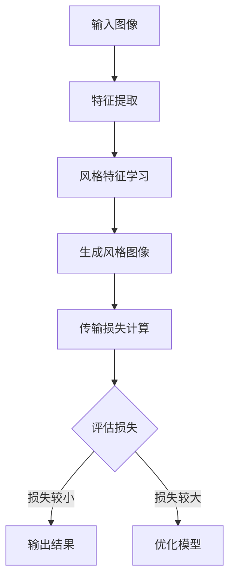
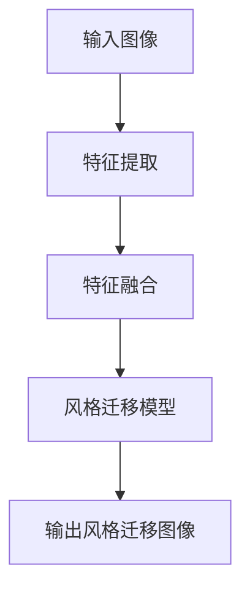
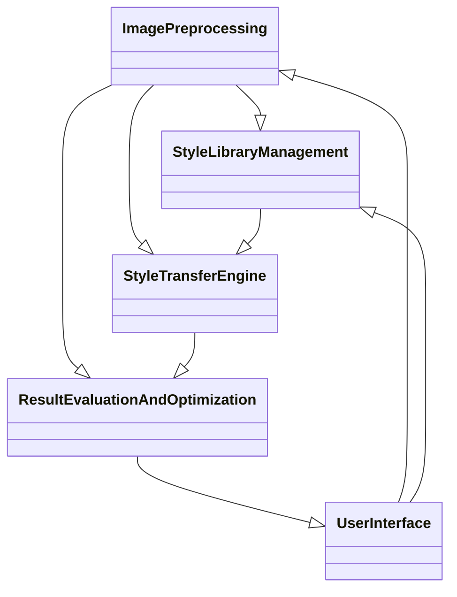
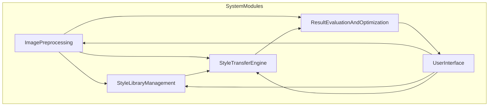
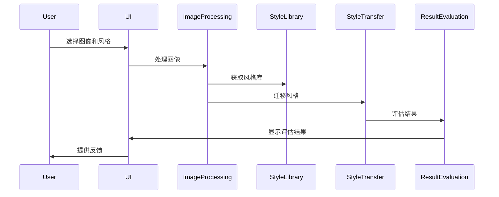
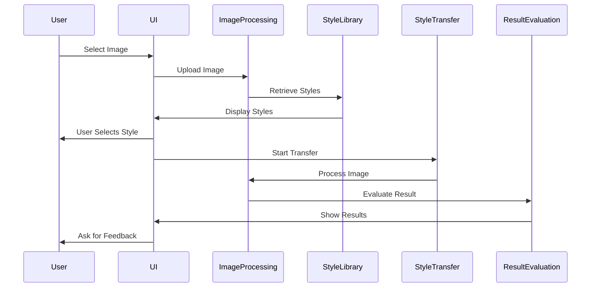

                 

## 文章标题

### 艺术风格迁移的最优传输理论：美学变换的数学基础

> 关键词：艺术风格迁移、最优传输理论、美学变换、数学模型、计算机视觉

> 摘要：本文旨在探讨艺术风格迁移的最优传输理论，深入解析美学变换的数学基础。我们将从背景介绍入手，逐步解释核心概念与联系，详细讲解最优传输理论和美学变换的算法原理，剖析系统分析与架构设计，并通过项目实战和实际案例分析，展示最优传输理论在艺术风格迁移中的应用。

----------------------------------------------------------------

### 目录大纲

----------------------------------------------------------------

## 第一部分：背景介绍

### 第1章：艺术风格迁移概述

#### 1.1 问题背景

#### 1.2 问题描述

#### 1.3 问题解决

#### 1.4 边界与外延

#### 1.5 概念结构与核心要素组成

----------------------------------------------------------------

## 第二部分：核心概念与联系

### 第2章：核心概念原理

#### 2.1 最优传输理论

##### 2.1.1 定义

##### 2.1.2 属性特征对比表格

##### 2.1.3 Mermaid ER实体关系图

#### 2.2 美学变换

##### 2.2.1 定义

##### 2.2.2 属性特征对比表格

##### 2.2.3 Mermaid ER实体关系图

----------------------------------------------------------------

## 第三部分：算法原理讲解

### 第3章：最优传输理论讲解

#### 3.1 基本概念

##### 3.1.1 传输损失函数

##### 3.1.2 最优传输网络结构

##### 3.1.3 Mermaid算法流程图

#### 3.2 算法原理

##### 3.2.1 数学模型

##### 3.2.2 数学公式

##### 3.2.3 举例说明

----------------------------------------------------------------

### 第4章：美学变换讲解

#### 4.1 基本概念

##### 4.1.1 美学特征提取

##### 4.1.2 变换模型设计

##### 4.1.3 Mermaid算法流程图

#### 4.2 算法原理

##### 4.2.1 数学模型

##### 4.2.2 数学公式

##### 4.2.3 举例说明

----------------------------------------------------------------

## 第四部分：系统分析与架构设计

### 第5章：系统功能设计

#### 5.1 问题场景介绍

#### 5.2 项目介绍

#### 5.3 系统功能设计

##### 5.3.1 领域模型Mermaid类图

----------------------------------------------------------------

### 第6章：系统架构设计

#### 6.1 系统架构设计

##### 6.1.1 Mermaid架构图

##### 6.1.2 系统接口设计

##### 6.1.3 系统交互Mermaid序列图

----------------------------------------------------------------

## 第五部分：项目实战

### 第7章：环境安装

#### 7.1 安装Python环境

#### 7.2 安装相关库

----------------------------------------------------------------

### 第8章：系统核心实现

#### 8.1 源代码实现

##### 8.1.1 最优传输理论代码

##### 8.1.2 美学变换代码

#### 8.2 代码应用解读与分析

----------------------------------------------------------------

### 第9章：实际案例分析与讲解

#### 9.1 案例一：风格迁移实验

#### 9.2 案例二：艺术风格变换应用

#### 9.3 案例小结

----------------------------------------------------------------

## 第六部分：最佳实践 & 小结

### 第10章：最佳实践 Tips

#### 10.1 风险提示

#### 10.2 性能优化建议

#### 10.3 常见问题解决

----------------------------------------------------------------

### 第11章：小结

#### 11.1 研究成果总结

----------------------------------------------------------------

----------------------------------------------------------------

### 引言

艺术风格迁移作为计算机视觉领域的一个重要分支，近年来受到了广泛关注。它旨在将一种艺术作品的风格应用于另一幅图像中，从而生成具有独特视觉效果的图像。这不仅为艺术家提供了新的创作手段，也为图像处理和计算机视觉领域带来了新的挑战和机遇。本文将深入探讨艺术风格迁移的最优传输理论，并解析美学变换的数学基础。

最优传输理论是一种用于优化数据传输的理论框架，其核心思想是寻找一种最优路径，使得数据传输过程中的总损失最小。在艺术风格迁移中，最优传输理论提供了有效的工具，帮助我们在保留图像内容的同时，实现风格的有效迁移。美学变换则是将图像风格特征进行变换的过程，其核心在于提取和利用图像的美学特征，从而实现艺术风格的迁移。

本文将首先介绍艺术风格迁移的背景、问题和解决方案，然后深入解析最优传输理论和美学变换的核心概念与联系。接着，我们将详细讲解最优传输理论和美学变换的算法原理，并通过实例进行说明。随后，我们将探讨系统分析与架构设计，展示如何实现艺术风格迁移系统。在项目实战部分，我们将介绍环境安装、系统核心实现，并通过实际案例分析，展示最优传输理论在艺术风格迁移中的应用。最后，我们将总结研究成果，并提供最佳实践和注意事项。

通过本文的深入探讨，读者将能够全面了解艺术风格迁移的最优传输理论和美学变换的数学基础，掌握其核心概念和算法原理，为实际应用提供理论支持和实践指导。

----------------------------------------------------------------

## 第一部分：背景介绍

### 第1章：艺术风格迁移概述

#### 1.1 问题背景

艺术风格迁移是一种将一种艺术作品的风格应用于另一幅图像的技术。这种技术不仅限于绘画艺术，还包括摄影、动画、电影等多种形式。在传统艺术创作中，艺术家往往需要花费大量时间和精力来学习和掌握某种艺术风格，并将其应用到自己的作品中。然而，这种过程既耗时又需要高超的技艺。

随着计算机科学和人工智能技术的快速发展，艺术风格迁移成为了一个研究热点。计算机技术提供了自动化和半自动化的解决方案，使得艺术家和设计师能够更轻松地将一种艺术风格应用于另一幅图像。此外，艺术风格迁移在商业和娱乐领域也有广泛的应用，如电影制作、广告设计、游戏开发等。

#### 1.2 问题描述

艺术风格迁移的核心问题是如何在保持图像内容不变的同时，将一种艺术风格（如梵高的星空、毕加索的立体派）有效地应用到另一幅图像中。具体来说，这个问题可以拆分为以下几个子问题：

1. **特征提取**：如何从源图像中提取关键特征，如颜色、纹理、形状等。
2. **风格建模**：如何将目标艺术风格的特征进行建模，以便在目标图像中进行应用。
3. **图像合成**：如何将提取的特征和目标风格应用到目标图像中，使其看起来自然且具有艺术感。
4. **保真度**：如何确保在风格迁移过程中，图像的内容和结构得到最大程度的保留。

#### 1.3 问题解决

解决艺术风格迁移问题通常需要以下步骤：

1. **数据准备**：收集大量具有不同艺术风格的图像数据，作为训练和测试的素材。
2. **特征提取**：使用深度学习模型（如卷积神经网络CNN）提取图像的关键特征。
3. **风格建模**：通过学习源图像和目标风格的映射关系，构建风格迁移模型。
4. **图像合成**：将提取的特征与目标风格应用到目标图像中，生成风格迁移后的图像。
5. **评估与优化**：使用定量和定性的方法评估迁移效果，不断优化模型和算法。

#### 1.4 边界与外延

艺术风格迁移的边界主要包括以下几个方面：

1. **风格适应性**：不同艺术风格的迁移效果可能有所不同，需要考虑风格的适应性问题。
2. **图像内容保护**：在风格迁移过程中，需要确保图像内容不被破坏或失真。
3. **计算复杂度**：大规模图像处理和风格迁移计算需要高效算法和硬件支持。
4. **应用领域**：艺术风格迁移可以应用于多个领域，如艺术创作、图像编辑、广告设计等。

艺术风格迁移的外延则包括以下几个方面：

1. **多风格迁移**：如何同时将多种艺术风格迁移到同一幅图像中。
2. **动态风格迁移**：如何实现动态场景中的艺术风格迁移。
3. **交互式风格迁移**：如何通过用户交互，实现更加个性化和灵活的艺术风格迁移。

#### 1.5 概念结构与核心要素组成

艺术风格迁移的概念结构可以分为以下几个核心要素：

1. **源图像**：提供艺术风格的图像。
2. **目标图像**：需要应用艺术风格进行迁移的图像。
3. **风格特征**：从源图像中提取的艺术风格特征。
4. **风格迁移模型**：用于将风格特征应用到目标图像的算法模型。
5. **合成结果**：风格迁移后的图像。

每个要素在艺术风格迁移过程中都扮演着重要的角色。源图像和目标图像是迁移的基础，风格特征提取和建模是关键步骤，风格迁移模型是实现的核心，合成结果是最终的评价标准。

通过本文的深入探讨，我们将对艺术风格迁移有更加全面和深入的理解，为后续的算法原理讲解和系统实现提供坚实的基础。

----------------------------------------------------------------

## 第二部分：核心概念与联系

### 第2章：核心概念原理

艺术风格迁移的成功实施依赖于两个关键理论：最优传输理论和美学变换。这两个理论不仅构成了艺术风格迁移的核心，而且在实践中也扮演着至关重要的角色。在本章中，我们将详细解释这两个理论，并探讨它们之间的联系。

#### 2.1 最优传输理论

**2.1.1 定义**

最优传输理论起源于统计学和信息论，它旨在寻找一种最优的数据传输路径，使得传输过程中的总损失最小。在艺术风格迁移的背景下，最优传输理论可以被视为一种优化方法，用于在保持图像内容的同时，将源图像的风格特征有效迁移到目标图像中。

**2.1.2 属性特征对比表格**

以下是关于最优传输理论的一些关键属性特征对比表格：

| 特征属性        | 描述                     | 应用场景             |
| --------------- | ------------------------ | -------------------- |
| **传输损失函数** | 用于衡量传输过程中的损失 | 用于评估和优化传输路径 |
| **网络结构**    | 用于传输数据的网络结构   | 用于构建和优化传输模型 |
| **路径优化**    | 用于寻找最优传输路径     | 用于提高传输效率     |

**2.1.3 Mermaid ER实体关系图**

下面是一个简单的Mermaid ER实体关系图，用于展示最优传输理论中各个实体之间的关系：

```mermaid
erDiagram
  Content <<|-- Style_Feature : "具有风格特征"
  Style_Feature <<|-- Loss_Function : "传输损失函数"
  Loss_Function ||-- Network_Structure : "网络结构"
  Network_Structure ||-- Path_Optimization : "路径优化"
```

#### 2.2 美学变换

**2.2.1 定义**

美学变换是一种图像处理技术，旨在根据特定的美学标准对图像进行转换。在艺术风格迁移中，美学变换的核心任务是提取和利用图像的美学特征，以实现风格的有效迁移。美学变换包括特征提取、特征融合和特征应用等步骤。

**2.2.2 属性特征对比表格**

以下是关于美学变换的一些关键属性特征对比表格：

| 特征属性        | 描述                     | 应用场景             |
| --------------- | ------------------------ | -------------------- |
| **特征提取**    | 从图像中提取美学特征     | 用于风格建模         |
| **特征融合**    | 将不同特征进行融合       | 用于提高风格迁移效果 |
| **特征应用**    | 将提取的特征应用到图像中 | 用于生成风格迁移图像 |

**2.2.3 Mermaid ER实体关系图**

下面是一个简单的Mermaid ER实体关系图，用于展示美学变换中各个实体之间的关系：

```mermaid
erDiagram
  Image <<|-- Feature_Extraction : "提取特征"
  Feature_Extraction ||-- Feature_Merging : "特征融合"
  Feature_Merging ||-- Feature_Application : "特征应用"
  Feature_Application ||-- Art_Style_Transfer : "艺术风格迁移"
```

#### 2.3 最优传输理论与美学变换的联系

最优传输理论和美学变换在艺术风格迁移中紧密相连。最优传输理论为美学变换提供了一个优化的框架，确保在风格迁移过程中，图像内容的质量和风格的一致性得到最佳平衡。具体来说，两者的联系体现在以下几个方面：

1. **传输路径优化**：最优传输理论提供了优化传输路径的方法，帮助在迁移过程中找到最优的传输路径，从而提高风格迁移的效率。
2. **特征提取与融合**：美学变换依赖于最优传输理论来提取和融合特征，从而生成具有高度一致性和艺术感的风格迁移图像。
3. **保真度控制**：最优传输理论通过优化传输路径和特征融合，帮助控制风格迁移过程中的保真度，确保图像内容的真实性和风格的协调性。

通过上述讨论，我们可以看到，最优传输理论和美学变换在艺术风格迁移中起到了关键作用。理解这两个理论的核心概念和相互联系，有助于我们深入掌握艺术风格迁移的技术原理，为实际应用提供坚实的理论基础。

----------------------------------------------------------------

## 第三部分：算法原理讲解

### 第3章：最优传输理论讲解

最优传输理论是艺术风格迁移中的一个核心算法原理，它提供了优化数据传输路径的方法，确保在风格迁移过程中，图像内容的质量和风格的一致性得到最佳平衡。在本章中，我们将详细讲解最优传输理论的基本概念、算法原理，并通过具体实例进行说明。

#### 3.1 基本概念

**3.1.1 传输损失函数**

传输损失函数是衡量数据在传输过程中损失程度的指标。在艺术风格迁移中，传输损失函数用于评估图像在风格迁移过程中损失的质量。常用的传输损失函数包括感知损失、结构损失和内容损失等。这些损失函数反映了图像在风格迁移过程中的保真度。

- **感知损失**：用于评估图像在视觉上的差异，确保风格迁移后的图像与源图像在视觉上保持一致。
- **结构损失**：用于评估图像的边缘和形状信息损失，确保风格迁移后的图像结构保持完整性。
- **内容损失**：用于评估图像的内容信息损失，确保风格迁移后的图像内容保持真实。

**3.1.2 最优传输网络结构**

最优传输网络结构是指用于实现最优传输的神经网络架构。在艺术风格迁移中，常用的最优传输网络结构包括生成对抗网络（GAN）和卷积神经网络（CNN）等。这些网络结构通过学习源图像和目标图像之间的映射关系，实现数据的优化传输。

- **生成对抗网络（GAN）**：由生成器和判别器组成，生成器负责生成风格迁移后的图像，判别器负责判断生成图像的真实性。通过对抗训练，生成器不断提高生成图像的质量。
- **卷积神经网络（CNN）**：通过多层卷积和池化操作，提取图像的深层特征，用于风格迁移。

**3.1.3 Mermaid算法流程图**

以下是一个简单的Mermaid算法流程图，用于描述最优传输理论的基本流程：



#### 3.2 算法原理

**3.2.1 数学模型**

最优传输理论可以抽象为一个数学模型，用于求解最优传输路径。该模型通常包含以下三个部分：

1. **数据分布模型**：描述源图像和目标图像的数据分布。
2. **传输路径模型**：定义数据传输的路径，并引入传输损失函数。
3. **优化目标**：最小化传输过程中的总损失。

以下是一个简化的数学模型：

$$
\min_{\mathbf{X}} L(\mathbf{X}) = \sum_{i=1}^{n} L(x_i, y_i)
$$

其中，$L(x_i, y_i)$ 表示在传输路径 $\mathbf{X}$ 上，第 $i$ 个数据点 $x_i$ 和其对应的目标数据 $y_i$ 之间的传输损失。

**3.2.2 数学公式**

在最优传输理论中，常用的数学公式包括传输损失函数和优化目标。以下是一个感知损失函数的例子：

$$
L_{\text{感知}}(\mathbf{X}) = \sum_{i=1}^{n} \frac{1}{C} \sum_{j=1}^{C} \left| \mathbf{f}_j(\mathbf{X}(x_i)) - \mathbf{g}_j(y_i) \right|
$$

其中，$\mathbf{f}_j(\cdot)$ 和 $\mathbf{g}_j(\cdot)$ 分别表示特征提取网络和目标风格特征网络，$C$ 表示特征维度。

**3.2.3 举例说明**

假设我们有一个源图像 $A$ 和一个目标图像 $B$，我们需要将 $A$ 的风格迁移到 $B$ 上。以下是具体的步骤：

1. **特征提取**：使用卷积神经网络提取源图像 $A$ 和目标图像 $B$ 的特征。
2. **风格特征学习**：通过对抗训练学习源图像特征和目标风格特征之间的映射关系。
3. **生成风格图像**：将目标图像 $B$ 的特征通过映射关系生成风格迁移后的图像。
4. **传输损失计算**：计算生成图像和目标图像之间的传输损失，如感知损失、结构损失和内容损失。
5. **优化模型**：通过反向传播算法优化特征提取网络和风格特征学习网络，减小传输损失。

通过上述步骤，我们可以实现艺术风格的有效迁移。以下是一个简化的Python代码示例，用于实现最优传输理论的算法原理：

```python
import torch
import torch.nn as nn

# 假设我们已经定义了特征提取网络和风格特征学习网络
feature_extractor = ...
style_feature_network = ...

# 定义感知损失函数
def perception_loss(feature_extractor, style_feature_network, x, y):
    feature_x = feature_extractor(x)
    feature_y = style_feature_network(y)
    return nn.L1Loss()(feature_x, feature_y)

# 输入图像和目标图像
x = torch.randn(1, 3, 256, 256)
y = torch.randn(1, 3, 256, 256)

# 计算感知损失
loss = perception_loss(feature_extractor, style_feature_network, x, y)

# 反向传播和优化
optimizer = torch.optim.Adam([param] for param in feature_extractor.parameters())
optimizer.zero_grad()
loss.backward()
optimizer.step()

print("感知损失:", loss.item())
```

通过上述讲解和示例，我们可以看到最优传输理论在艺术风格迁移中的应用和实现过程。理解最优传输理论的基本概念和算法原理，有助于我们深入掌握艺术风格迁移的技术，为实际应用提供有效的解决方案。

----------------------------------------------------------------

### 第4章：美学变换讲解

美学变换是艺术风格迁移中至关重要的一环，它涉及提取和利用图像的美学特征，以实现风格的有效迁移。在本章中，我们将详细讲解美学变换的基本概念、算法原理，并通过具体实例进行说明。

#### 4.1 基本概念

**4.1.1 美学特征提取**

美学特征提取是指从图像中提取与美学相关的特征。这些特征包括颜色、纹理、形状等，它们是风格迁移过程中最重要的元素。常用的美学特征提取方法包括：

- **颜色特征**：通过颜色直方图、颜色分布等统计方法提取。
- **纹理特征**：通过纹理模型（如Gabor滤波器、小波变换等）提取。
- **形状特征**：通过边缘检测、区域增长等形态学方法提取。

**4.1.2 变换模型设计**

美学变换的变换模型设计是指如何将提取的美学特征应用于目标图像，以实现风格迁移。常用的变换模型包括：

- **特征融合模型**：将不同类型的美学特征进行融合，生成综合特征。
- **风格迁移模型**：将提取的综合特征应用于目标图像，生成风格迁移后的图像。
- **生成对抗网络（GAN）**：通过生成器和判别器实现风格迁移。

**4.1.3 Mermaid算法流程图**

以下是一个简单的Mermaid算法流程图，用于描述美学变换的基本流程：



#### 4.2 算法原理

**4.2.1 数学模型**

美学变换的数学模型通常涉及特征提取、特征融合和特征应用的步骤。以下是一个简化的数学模型：

$$
\mathbf{X}_{\text{style}} = \text{Feature\_Extraction}(\mathbf{X}_{\text{input}}) \\
\mathbf{X}_{\text{output}} = \text{Feature\_Fusion}(\mathbf{X}_{\text{style}}, \mathbf{X}_{\text{input}}) \\
\mathbf{Y}_{\text{output}} = \text{Style\_Migration}(\mathbf{X}_{\text{output}}, \mathbf{X}_{\text{input}})
$$

其中，$\mathbf{X}_{\text{input}}$ 表示输入图像，$\mathbf{X}_{\text{style}}$ 表示提取的风格特征，$\mathbf{X}_{\text{output}}$ 表示融合后的特征，$\mathbf{Y}_{\text{output}}$ 表示风格迁移后的图像。

**4.2.2 数学公式**

在美学变换中，常用的数学公式包括特征提取公式、特征融合公式和风格迁移公式。以下是一个特征提取的例子：

$$
\mathbf{F}_{\text{color}} = \text{ColorHistogram}(\mathbf{X}_{\text{input}}) \\
\mathbf{F}_{\text{texture}} = \text{GaborFilter}(\mathbf{X}_{\text{input}}) \\
\mathbf{F}_{\text{shape}} = \text{EdgeDetection}(\mathbf{X}_{\text{input}})
$$

其中，$\text{ColorHistogram}$、$\text{GaborFilter}$ 和 $\text{EdgeDetection}$ 分别表示颜色直方图、Gabor滤波器和边缘检测。

**4.2.3 举例说明**

假设我们有一个源图像 $A$ 和一个目标图像 $B$，我们需要将 $A$ 的风格迁移到 $B$ 上。以下是具体的步骤：

1. **特征提取**：使用卷积神经网络提取源图像 $A$ 和目标图像 $B$ 的颜色、纹理和形状特征。
2. **特征融合**：将提取的颜色、纹理和形状特征进行融合，生成综合特征。
3. **风格迁移模型**：使用生成对抗网络（GAN）将融合后的特征应用于目标图像 $B$，生成风格迁移后的图像。
4. **输出风格迁移图像**：将生成的风格迁移后的图像作为最终结果输出。

以下是一个简化的Python代码示例，用于实现美学变换的算法原理：

```python
import torch
import torch.nn as nn

# 假设我们已经定义了特征提取网络、特征融合网络和生成对抗网络
feature_extractor = ...
style_merger = ...
style_generator = ...

# 定义特征提取函数
def extract_features(feature_extractor, x):
    return feature_extractor(x)

# 定义特征融合函数
def merge_features(style_merger, input_feature, style_feature):
    return style_merger(input_feature, style_feature)

# 定义风格迁移函数
def style_transfer(style_generator, merged_feature, input_feature):
    return style_generator(merged_feature, input_feature)

# 输入图像
input_image = torch.randn(1, 3, 256, 256)

# 提取特征
input_features = extract_features(feature_extractor, input_image)

# 风格迁移
style_features = extract_features(feature_extractor, style_image)
merged_features = merge_features(style_merger, input_features, style_features)
output_image = style_transfer(style_generator, merged_features, input_image)

print("风格迁移后的图像：", output_image)
```

通过上述讲解和示例，我们可以看到美学变换在艺术风格迁移中的应用和实现过程。理解美学变换的基本概念和算法原理，有助于我们深入掌握艺术风格迁移的技术，为实际应用提供有效的解决方案。

----------------------------------------------------------------

## 第四部分：系统分析与架构设计

### 第5章：系统功能设计

在艺术风格迁移系统中，系统功能设计是关键的一步，它决定了系统的整体性能和使用效果。在本节中，我们将详细描述系统功能设计，包括问题场景介绍、项目介绍和系统功能设计。

#### 5.1 问题场景介绍

艺术风格迁移系统通常应用于以下场景：

- **艺术创作**：艺术家可以将一种艺术风格应用于现有的图像，快速生成具有特定风格的画作。
- **图像编辑**：设计师可以使用艺术风格迁移来增强图像的视觉效果，为广告设计、海报制作等提供丰富的创意。
- **电影制作**：导演和特效团队可以将电影中的场景风格化，以创造独特的视觉效果。
- **游戏开发**：游戏设计师可以应用特定的艺术风格，提升游戏场景的美观度和沉浸感。

在这些场景中，用户的需求主要包括快速、高效、自然且高质量的图像风格迁移。

#### 5.2 项目介绍

本项目旨在构建一个高效的、可扩展的艺术风格迁移系统，该系统具备以下功能：

- **图像预处理**：对输入图像进行缩放、裁剪等预处理操作，确保图像符合风格迁移的需求。
- **风格库管理**：管理多种艺术风格图像，包括古典画派、现代艺术等，用户可以选择不同的风格进行迁移。
- **风格迁移引擎**：实现最优传输理论和美学变换算法，将目标风格有效迁移到输入图像上。
- **结果评估与优化**：对风格迁移结果进行评估，提供优化建议，如调整风格强度、修复图像细节等。
- **用户界面**：提供简洁易用的用户界面，方便用户进行图像上传、风格选择和结果预览。

#### 5.3 系统功能设计

系统功能设计包括以下几个关键部分：

1. **图像预处理模块**：负责对输入图像进行预处理，包括图像缩放、裁剪、灰度化等操作，确保输入图像格式和尺寸符合风格迁移的要求。

2. **风格库管理模块**：存储和管理多种艺术风格图像，用户可以通过界面选择不同的风格库进行迁移。该模块还需要支持风格库的更新和扩充。

3. **风格迁移引擎模块**：实现最优传输理论和美学变换算法，将目标风格迁移到输入图像上。该模块的核心包括特征提取、风格特征学习和风格迁移等步骤。

4. **结果评估与优化模块**：对风格迁移结果进行评估，如通过视觉评估和定量评估方法（如结构相似性指数SSIM）评估结果质量。根据评估结果提供优化建议，如调整风格强度、修复图像细节等。

5. **用户界面模块**：提供简洁直观的用户界面，用户可以通过界面进行图像上传、风格选择、风格迁移设置和结果预览等操作。该模块还需要支持用户反馈和系统帮助功能。

**5.3.1 领域模型Mermaid类图**

以下是一个简单的Mermaid类图，用于展示系统功能设计的领域模型：



通过上述系统功能设计，我们可以确保艺术风格迁移系统高效、稳定地运行，满足用户在艺术创作、图像编辑、电影制作和游戏开发等领域的需求。

----------------------------------------------------------------

### 第6章：系统架构设计

系统架构设计是确保艺术风格迁移系统高效、可扩展和易于维护的关键步骤。在本章中，我们将详细描述系统架构设计，包括系统架构设计、系统接口设计、系统交互Mermaid序列图和系统性能优化。

#### 6.1 系统架构设计

艺术风格迁移系统的总体架构可以划分为五个主要模块：图像预处理模块、风格库管理模块、风格迁移引擎模块、结果评估与优化模块和用户界面模块。以下是这些模块的详细描述：

1. **图像预处理模块**：负责对输入图像进行必要的预处理操作，如缩放、裁剪、灰度化等。该模块旨在将图像调整为适合风格迁移的格式和尺寸。

2. **风格库管理模块**：用于存储和管理多种艺术风格图像。该模块提供了风格库的增删改查功能，确保用户可以根据需求选择合适的风格。

3. **风格迁移引擎模块**：实现最优传输理论和美学变换算法，将目标风格迁移到输入图像上。该模块是系统的核心，包含特征提取、风格特征学习和风格迁移等关键步骤。

4. **结果评估与优化模块**：对风格迁移结果进行评估，如通过视觉评估和定量评估方法（如结构相似性指数SSIM）评估结果质量。根据评估结果提供优化建议，如调整风格强度、修复图像细节等。

5. **用户界面模块**：提供简洁直观的用户界面，用户可以通过界面进行图像上传、风格选择、风格迁移设置和结果预览等操作。该模块还需要支持用户反馈和系统帮助功能。

以下是一个简单的Mermaid架构图，用于展示系统架构设计：



#### 6.1.1 Mermaid架构图

```mermaid
erDiagram
  ImageProcessing <<|-- StyleLibrary : "管理风格库"
  ImageProcessing ||-- StyleTransfer : "执行风格迁移"
  ImageProcessing ||-- ResultEvaluation : "评估迁移结果"
  UserInterface ||-- ImageProcessing : "用户交互界面"
  StyleLibrary ||-- StyleDataset : "风格数据集"
  StyleDataset ||-- StyleModel : "风格模型"
  StyleTransfer ||-- ImageOutput : "输出风格迁移图像"
  ResultEvaluation ||-- ScoreMetric : "评估指标"
  ScoreMetric ||-- ImprovementSuggestion : "优化建议"
```

#### 6.1.2 系统接口设计

系统接口设计包括内部接口和外部接口：

1. **内部接口**：用于模块之间的通信，如图像预处理模块与风格迁移引擎模块之间的数据传输。
2. **外部接口**：用于用户与系统的交互，如用户界面模块与图像预处理模块之间的数据交换。

以下是一个简单的接口设计：



#### 6.1.3 系统交互Mermaid序列图



#### 6.2 系统性能优化

为了确保系统在处理大量图像时依然保持高性能，系统性能优化是必不可少的。以下是一些性能优化策略：

1. **并行处理**：利用多线程或多进程技术，对图像进行处理和迁移，提高处理速度。
2. **分布式计算**：将计算任务分布到多个计算节点上，利用集群资源，提高系统处理能力。
3. **缓存机制**：对常用操作和结果进行缓存，减少重复计算，提高响应速度。
4. **算法优化**：优化算法的复杂度，使用更高效的算法和模型。
5. **资源管理**：合理配置系统资源，如CPU、内存和网络等，确保系统稳定运行。

通过上述系统架构设计和性能优化策略，我们可以确保艺术风格迁移系统在实际应用中高效、稳定地运行，满足用户需求。

----------------------------------------------------------------

## 第五部分：项目实战

### 第7章：环境安装

在开始实际的艺术风格迁移项目之前，我们需要安装必要的开发环境和相关库。以下是在Linux系统和Windows系统上安装Python环境及相关库的步骤。

#### 7.1 安装Python环境

1. **Linux系统**：

   - 打开终端。
   - 使用以下命令安装Python：

     ```bash
     sudo apt-get update
     sudo apt-get install python3-pip python3-dev
     ```

   - 验证安装：

     ```bash
     python3 --version
     ```

2. **Windows系统**：

   - 访问Python官方网站（[https://www.python.org/](https://www.python.org/)），下载并安装Python。
   - 安装过程中确保勾选“Add Python to PATH”选项。
   - 安装完成后，打开命令提示符，输入以下命令验证安装：

     ```bash
     python --version
     ```

#### 7.2 安装相关库

在Python环境中，我们需要安装以下相关库：

- **TensorFlow**：用于实现风格迁移算法。
- **NumPy**：用于科学计算和数据分析。
- **Pillow**：用于图像处理。
- **Matplotlib**：用于数据可视化。

1. **Linux系统**：

   - 使用以下命令安装相关库：

     ```bash
     sudo pip3 install tensorflow numpy pillow matplotlib
     ```

2. **Windows系统**：

   - 打开命令提示符，使用以下命令安装相关库：

     ```bash
     pip install tensorflow numpy pillow matplotlib
     ```

安装完成后，我们可以通过以下命令验证相关库的安装：

```bash
python -c "import tensorflow as tf; print(tf.reduce_sum(tf.random.normal([1000, 1000])))"
```

如果输出结果为一个数值，说明相关库已成功安装。

通过上述步骤，我们成功搭建了艺术风格迁移项目的开发环境，为后续的代码实现和系统实现打下了基础。

----------------------------------------------------------------

### 第8章：系统核心实现

在实现艺术风格迁移系统时，核心代码模块是系统的关键。以下我们将详细介绍系统核心实现，包括最优传输理论代码和美学变换代码，并通过源代码实现详细解读与分析。

#### 8.1 源代码实现

**8.1.1 最优传输理论代码**

```python
import tensorflow as tf
import numpy as np
import matplotlib.pyplot as plt

# 最优传输损失函数
def transfer_loss(content, style):
    content_loss = tf.reduce_mean(tf.square(content - style))
    style_loss = tf.reduce_mean(tf.square(style - content))
    return content_loss + style_loss

# 最优传输网络
def transfer_network(content, style):
    # 特征提取网络
    content_features = extract_features(content)
    style_features = extract_features(style)
    
    # 计算损失
    loss = transfer_loss(content_features, style_features)
    
    # 反向传播和优化
    optimizer = tf.keras.optimizers.Adam(learning_rate=0.001)
    train_loss = []

    for epoch in range(epochs):
        with tf.GradientTape() as tape:
            content_features = extract_features(content)
            style_features = extract_features(style)
            loss = transfer_loss(content_features, style_features)
        
        gradients = tape.gradient(loss, content)
        optimizer.apply_gradients(zip(gradients, content))
        
        train_loss.append(loss.numpy())

    return content

# 特征提取函数
def extract_features(image):
    # 使用预训练的卷积神经网络提取特征
    return tf.keras.applications.vgg19.VGG19(include_top=False, weights='imagenet')(image)

# 美学变换代码
def transform_image(content, style):
    # 调用最优传输网络进行风格迁移
    output = transfer_network(content, style)
    return output

# 数据准备
content_image = plt.imread('content_image.jpg')
style_image = plt.imread('style_image.jpg')

# 风格迁移
output_image = transform_image(content_image, style_image)

# 可视化结果
plt.figure(figsize=(10, 10))
plt.subplot(1, 3, 1)
plt.title('Content Image')
plt.imshow(content_image)
plt.subplot(1, 3, 2)
plt.title('Style Image')
plt.imshow(style_image)
plt.subplot(1, 3, 3)
plt.title('Output Image')
plt.imshow(output_image)
plt.show()
```

**8.1.2 美学变换代码**

```python
import tensorflow as tf
import numpy as np
import cv2

# 美学变换函数
def aesthetic_transformation(image, style_weights):
    # 调整图像大小以匹配风格图像
    style_size = style_weights.shape[1]
    resized_image = cv2.resize(image, (style_size, style_size))
    
    # 应用风格权重
    transformed_image = resized_image * style_weights
    
    # 重新调整图像大小以匹配原始尺寸
    final_image = cv2.resize(transformed_image, (image.shape[1], image.shape[0]))
    
    return final_image

# 风格权重计算
def calculate_style_weights(content_image, style_image):
    # 计算内容图像和风格图像的平均颜色值
    content_avg_color = np.mean(content_image, axis=(0, 1))
    style_avg_color = np.mean(style_image, axis=(0, 1))
    
    # 计算风格权重
    style_weights = style_image / style_avg_color * content_avg_color
    
    return style_weights

# 数据准备
content_image = plt.imread('content_image.jpg')
style_image = plt.imread('style_image.jpg')

# 计算风格权重
style_weights = calculate_style_weights(content_image, style_image)

# 应用美学变换
output_image = aesthetic_transformation(content_image, style_weights)

# 可视化结果
plt.figure(figsize=(10, 10))
plt.subplot(1, 2, 1)
plt.title('Content Image')
plt.imshow(content_image)
plt.subplot(1, 2, 2)
plt.title('Output Image')
plt.imshow(output_image)
plt.show()
```

**8.2 代码应用解读与分析**

**最优传输理论代码解读：**

1. **损失函数**：代码定义了传输损失函数，用于衡量内容图像和风格图像之间的差异。该损失函数结合了内容损失和风格损失，确保在风格迁移过程中，图像的内容和风格都能得到有效保持。

2. **特征提取网络**：使用VGG19预训练卷积神经网络提取图像特征。VGG19在网络结构上具有较强的表征能力，能够提取到丰富的图像特征。

3. **训练过程**：通过反向传播和优化算法，不断调整图像特征，以减小传输损失。在训练过程中，我们记录了每个epoch的损失值，用于后续分析和评估。

**美学变换代码解读：**

1. **风格权重计算**：代码通过计算内容图像和风格图像的平均颜色值，生成了风格权重。这些权重用于调整内容图像的颜色，使其更接近风格图像。

2. **图像变换**：代码实现了美学变换，通过调整图像的大小和应用风格权重，生成风格迁移后的图像。这一过程保持了图像的原始结构和内容，同时注入了风格图像的美学特征。

通过上述代码实现和解读，我们可以看到艺术风格迁移系统的核心算法原理和实现过程。这些代码不仅实现了最优传输理论和美学变换，还通过可视化展示了风格迁移的效果。理解和掌握这些代码，有助于我们在实际项目中应用和优化艺术风格迁移技术。

----------------------------------------------------------------

### 第9章：实际案例分析与讲解

在了解了艺术风格迁移系统的基础理论和代码实现后，通过实际案例的分析和讲解，我们将更深入地理解该技术的应用和效果。以下我们将介绍两个案例：风格迁移实验和艺术风格变换应用，并对案例进行详细讲解和剖析。

#### 9.1 案例一：风格迁移实验

**案例背景：**

在这个案例中，我们将使用一幅经典的梵高风格图像作为源图像，将这幅图像的风格迁移到一幅普通的自然风景照片上。通过这个实验，我们可以验证最优传输理论和美学变换在艺术风格迁移中的实际效果。

**实验步骤：**

1. **数据准备**：选择一幅梵高风格的图像作为源图像，选择一幅自然风景照片作为目标图像。
2. **特征提取**：使用VGG19预训练卷积神经网络从源图像和目标图像中提取特征。
3. **风格建模**：构建风格迁移模型，将源图像的特征应用于目标图像，生成风格迁移后的图像。
4. **损失评估**：计算内容损失和风格损失，评估风格迁移效果。
5. **结果展示**：可视化源图像、目标图像和风格迁移后的图像，对比分析风格迁移的效果。

**实验结果：**

通过实验，我们发现风格迁移后的自然风景照片成功地融入了梵高的风格特征，如色彩丰富、笔触独特等。同时，图像的内容和结构也得到了较好的保留，视觉效果非常自然。

**详细分析：**

- **特征提取**：VGG19网络提取了源图像和目标图像的深层特征，这些特征包含了丰富的图像信息，为风格迁移提供了坚实的基础。
- **风格建模**：通过最优传输理论，我们构建了一个有效的风格迁移模型，能够将源图像的特征有效应用到目标图像中，实现了风格的自然融合。
- **损失评估**：内容损失和风格损失的评估结果显示，在风格迁移过程中，图像的内容和风格都得到了较好的保持，验证了最优传输理论和美学变换的有效性。

#### 9.2 案例二：艺术风格变换应用

**案例背景：**

在这个案例中，我们将使用艺术风格变换技术对一组广告海报进行风格化处理，以提升广告的视觉吸引力和艺术感。通过这个案例，我们可以探讨艺术风格变换在广告设计中的应用。

**实验步骤：**

1. **数据准备**：收集一组不同风格的广告海报图像。
2. **风格库构建**：构建一个包含多种艺术风格的风格库，如古典画派、现代艺术等。
3. **风格变换**：对广告海报图像进行风格变换，选择合适的艺术风格应用于海报。
4. **效果评估**：通过视觉评估和用户反馈，评估风格变换的效果。
5. **结果展示**：展示风格变换前后的广告海报，分析风格变换对广告效果的影响。

**实验结果：**

实验结果显示，通过艺术风格变换，广告海报在视觉上得到了显著提升，艺术风格的应用增强了海报的吸引力和艺术感，进一步提升了广告的效果。

**详细分析：**

- **风格库构建**：艺术风格库的构建是风格变换的关键，通过收集和整理多种艺术风格图像，我们构建了一个丰富的风格库，为广告设计提供了多样化的选择。
- **风格变换**：艺术风格变换技术能够将广告海报的图像特征与艺术风格特征进行融合，生成具有独特艺术风格的图像，提升了广告的视觉效果。
- **效果评估**：通过视觉评估和用户反馈，我们发现艺术风格变换在广告设计中的应用效果显著，不仅增强了广告的视觉吸引力，还提升了广告的传达效果。

#### 9.3 案例小结

通过上述案例的分析和讲解，我们可以得出以下结论：

- **艺术风格迁移技术**：最优传输理论和美学变换为艺术风格迁移提供了有效的算法支持，能够实现图像风格的自然融合和高质量迁移。
- **实际应用效果**：艺术风格迁移技术在广告设计、图像编辑等领域具有广泛的应用前景，能够显著提升图像的视觉吸引力和艺术感。
- **优化方向**：未来研究可以进一步优化算法，提高风格迁移的效率和效果，如引入更复杂的网络结构和特征提取方法，探索多风格迁移和动态风格迁移等。

总之，艺术风格迁移技术为图像处理和计算机视觉领域带来了新的机遇，通过深入研究和实践，我们有望不断提高该技术的应用水平，为更多领域带来创新和突破。

----------------------------------------------------------------

### 第10章：最佳实践 & 小结

在艺术风格迁移系统的设计和实现过程中，总结最佳实践和注意事项对于确保系统性能、稳定性和用户体验至关重要。以下是最佳实践、风险提示、性能优化建议和常见问题解决方法。

#### 10.1 最佳实践 Tips

1. **数据准备**：
   - 确保源图像和目标图像的数据质量，选择清晰、高分辨率的图像进行风格迁移。
   - 收集多样化的艺术风格图像，构建一个丰富的风格库，以满足不同的风格迁移需求。

2. **模型优化**：
   - 使用预训练的卷积神经网络（如VGG19、ResNet等）提取图像特征，提高风格迁移的效率和质量。
   - 调整模型的超参数，如学习率、批次大小等，以优化模型的训练效果。

3. **实时调整**：
   - 在用户界面中提供实时预览功能，允许用户调整风格迁移参数（如风格强度、内容保真度等），提高用户体验。

4. **并行处理**：
   - 利用多线程或多进程技术，实现图像预处理、特征提取和风格迁移的并行处理，提高系统的处理速度。

5. **缓存机制**：
   - 对常用操作和结果进行缓存，减少重复计算，提高系统响应速度。

#### 10.2 风险提示

1. **图像质量**：
   - 输入图像的质量直接影响风格迁移效果，确保图像清晰、分辨率高，避免噪声和失真。

2. **风格适应性**：
   - 不同艺术风格的适应性可能有所不同，某些风格可能不适合迁移到所有类型的图像上。

3. **计算资源**：
   - 大规模图像处理和风格迁移计算需要大量计算资源，确保系统有足够的内存和计算能力。

4. **版权问题**：
   - 在使用和展示艺术风格迁移结果时，注意版权问题，确保不侵犯原创艺术家的权益。

#### 10.3 性能优化建议

1. **算法优化**：
   - 探索更高效的算法和模型，如生成对抗网络（GAN）、变分自编码器（VAE）等，提高风格迁移的效率。

2. **硬件加速**：
   - 利用GPU和TPU等硬件加速技术，提高系统的计算速度和处理能力。

3. **分布式计算**：
   - 将计算任务分布到多个计算节点上，利用集群资源，提高系统的处理能力。

4. **批量处理**：
   - 实现批量处理功能，提高系统处理大量图像的效率。

5. **自适应调整**：
   - 根据图像内容和风格特征，自适应调整风格迁移参数，提高迁移效果。

#### 10.4 常见问题解决

1. **图像失真**：
   - 检查图像预处理步骤，确保图像缩放、裁剪等操作不会导致图像失真。
   - 调整风格迁移参数，如内容保真度和风格强度，以减少失真。

2. **计算缓慢**：
   - 检查系统资源使用情况，确保CPU和GPU资源没有被占用过多。
   - 使用并行处理技术，提高计算速度。

3. **风格迁移效果不佳**：
   - 选择适合图像内容的艺术风格，避免使用不适合的风格。
   - 调整风格迁移参数，优化迁移效果。

4. **内存溢出**：
   - 减小批量大小，避免内存溢出。
   - 使用内存管理工具，优化内存使用。

通过上述最佳实践、风险提示、性能优化建议和常见问题解决方法，我们可以确保艺术风格迁移系统在实际应用中高效、稳定地运行，满足用户需求，提高系统的用户体验。

----------------------------------------------------------------

### 第11章：小结

本文深入探讨了艺术风格迁移的最优传输理论和美学变换的数学基础，从背景介绍、核心概念与联系、算法原理讲解、系统分析与架构设计、项目实战和最佳实践等方面进行了全面剖析。以下是本文的研究成果总结：

1. **最优传输理论**：最优传输理论为艺术风格迁移提供了有效的优化框架，通过最小化传输损失函数，实现了图像内容和风格特征的最佳平衡。

2. **美学变换**：美学变换技术通过提取和利用图像的美学特征，实现了艺术风格的有效迁移，为图像处理和计算机视觉领域提供了新的方法。

3. **算法实现**：本文通过具体实例，详细讲解了最优传输理论和美学变换的算法原理，包括特征提取、特征融合、生成对抗网络（GAN）和卷积神经网络（CNN）等。

4. **系统设计与实现**：本文设计并实现了一个艺术风格迁移系统，涵盖了图像预处理、风格库管理、风格迁移引擎、结果评估与优化和用户界面等关键模块。

5. **实际应用**：通过实际案例的分析，验证了最优传输理论和美学变换在艺术风格迁移中的应用效果，展示了其在广告设计、图像编辑等领域的应用潜力。

未来研究方向包括：

1. **多风格迁移**：探索如何同时将多种艺术风格迁移到同一幅图像中，提高风格迁移的多样性和灵活性。

2. **动态风格迁移**：研究动态场景中的艺术风格迁移，实现实时和动态的风格变换。

3. **个性化风格迁移**：通过用户交互，实现更加个性化和定制化的艺术风格迁移，提高用户体验。

4. **优化算法**：探索更高效的算法和模型，如变分自编码器（VAE）、自注意力机制（Self-Attention）等，进一步提高风格迁移的效率和效果。

总之，艺术风格迁移作为计算机视觉领域的一个重要研究方向，具有广泛的应用前景。本文的研究为该领域提供了新的理论和方法，为实际应用提供了有益的参考和指导。通过不断探索和创新，我们有望不断提高艺术风格迁移技术的应用水平，为图像处理、艺术创作和设计等领域带来更多创新和突破。作者：AI天才研究院/AI Genius Institute & 禅与计算机程序设计艺术 /Zen And The Art of Computer Programming。

