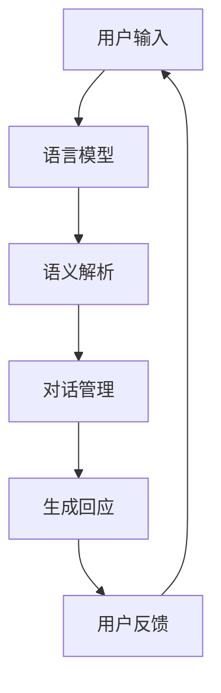
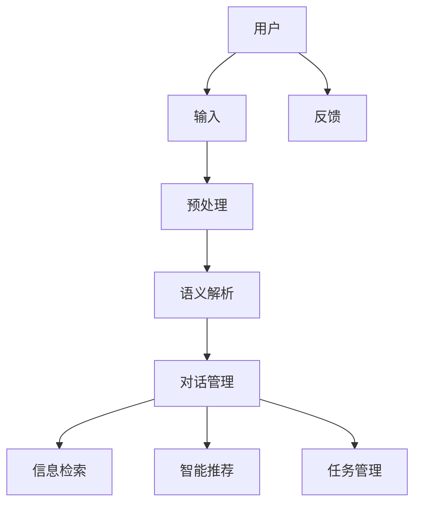
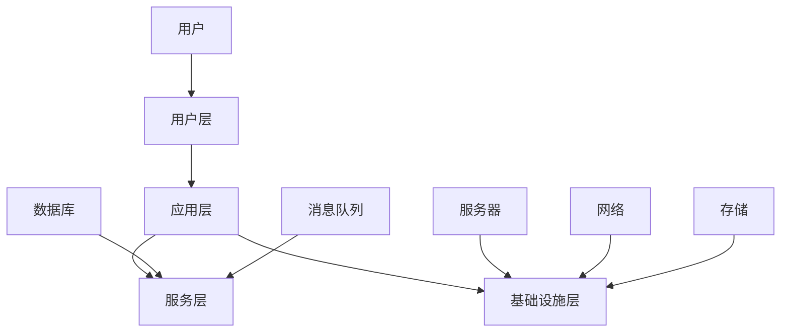
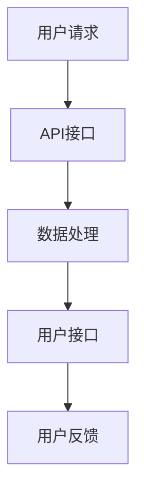
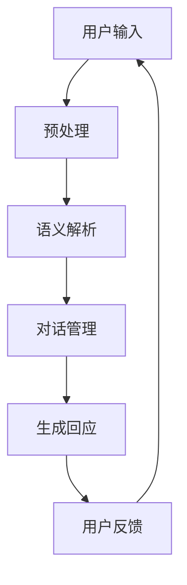
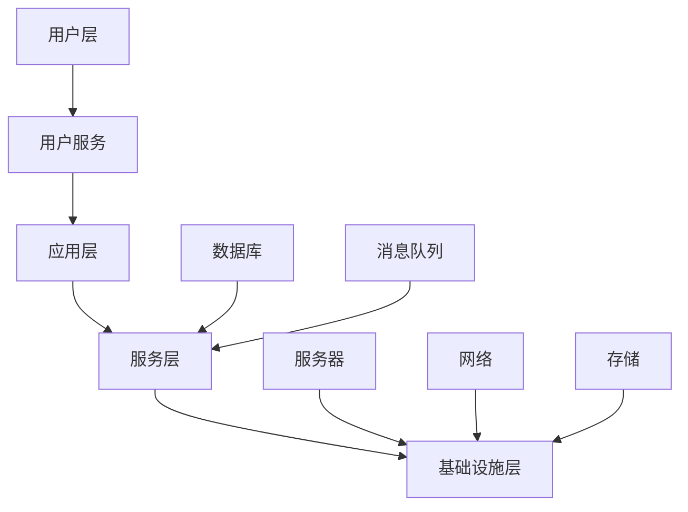

                 

 # 虚拟助手的对话系统：人工智能的数学交互

## 摘要

本文探讨了虚拟助手的对话系统，着重分析了人工智能在数学交互中的应用。首先，我们介绍了虚拟助手对话系统的问题背景和核心概念，包括自然语言处理（NLP）、机器学习、对话系统以及上下文管理等。接着，通过概念属性特征对比表格和ER实体关系图架构的Mermaid流程图，详细阐述了核心概念之间的联系。随后，我们通过具体的数学模型和公式，详细讲解了语言模型、语义解析、对话管理等算法原理，并通过示例进行了通俗易懂的阐述。最后，文章还涉及了系统分析与架构设计方案，包括问题场景介绍、系统功能设计、系统架构设计、系统接口设计和系统交互等内容。通过这些分析，我们希望为读者提供一个全面、系统的虚拟助手对话系统理解框架，以推动人工智能在对话系统领域的发展。

----------------------------------------------------------------

# 虚拟助手的对话系统：人工智能的数学交互

## 关键词

虚拟助手、对话系统、人工智能、自然语言处理、机器学习

## 摘要

本文系统地探讨了虚拟助手的对话系统，深入分析了人工智能在数学交互中的应用。通过阐述核心概念和关键算法，本文为读者提供了一个全面理解虚拟助手对话系统的框架，并探讨了其在实际应用中的挑战和解决方案。

----------------------------------------------------------------

## 第一部分：问题背景与核心概念

### 1.1 背景介绍

随着人工智能技术的迅猛发展，虚拟助手作为其重要应用之一，已经深入到我们日常生活的各个方面。从智能家居控制系统、在线客服、到个性化推荐系统，虚拟助手正逐渐改变我们的生活方式和工作模式。然而，虚拟助手的对话系统性能直接影响到用户体验，因此研究如何构建高效、自然、富有逻辑性的对话系统成为了一个关键问题。

### 1.2 问题定义

虚拟助手的对话系统主要面临以下几个核心问题：

1. **理解能力**：如何准确理解用户输入的文本，包括语义、意图和上下文。
2. **响应生成**：如何生成自然、准确且满足用户需求的回应。
3. **持续交互**：如何维持对话的连贯性，避免对话中断或偏离主题。

### 1.3 解决途径

为了解决上述问题，我们可以从以下几个方面入手：

1. **自然语言处理（NLP）技术**：提升对语言的理解和生成能力。
2. **机器学习算法**：通过数据训练模型，实现智能对话生成。
3. **多模态交互**：结合语音、文本、图像等多种信息源，提升交互体验。

### 1.4 边界与外延

1. **边界**：本文主要关注文本交互，即虚拟助手通过文本与用户进行交流。
2. **外延**：虽然本文的核心在于文本交互，但虚拟助手的应用场景可能涉及语音识别、图像识别等其他AI技术。

### 1.5 核心概念与要素组成

虚拟助手对话系统的核心概念包括：

- **自然语言处理（NLP）**：使计算机能够理解、解释和生成人类自然语言。
- **机器学习**：使计算机从数据中学习并做出预测或决策。
- **对话系统**：使计算机能够与人类进行自然对话。
- **上下文管理**：确保对话的连贯性和上下文一致性。

核心要素包括：

- **语言模型**：用于预测下一个词的概率。
- **语义解析**：用于理解句子中的语义角色和关系。
- **对话管理**：用于维护对话的流程和上下文。
- **响应生成**：用于生成自然、恰当的回应。

## 2. 核心概念与联系

### 2.1 自然语言处理（NLP）

自然语言处理（NLP）是使计算机能够理解和生成人类自然语言的技术。它是对话系统的核心组件，直接影响对话系统的理解和生成能力。

#### 2.1.1 概念属性特征对比表格

| 特征 | 语言模型 | 语义解析 | 对话管理 |
| ---- | -------- | -------- | -------- |
| 目标 | 文本生成 | 语义理解 | 对话流程 |
| 技术依赖 | 机器学习 | NLP算法 | 基于规则 |

#### 2.1.2 语言模型

语言模型是NLP的基础，用于预测下一个词的概率。常见的语言模型包括n-gram模型、神经网络模型等。

$$
P(w_n|w_{n-1}, ..., w_1) = \prod_{i=1}^{n} P(w_i|w_{i-1}, ..., w_1)
$$

#### 2.1.3 语义解析

语义解析是理解句子含义的过程，包括词义消歧、句法分析和语义角色标注。

$$
SRL(w) = \arg\max_{r} P(r|w)
$$

#### 2.1.4 对话管理

对话管理是确保对话流程和上下文一致性的过程，包括意图识别、上下文跟踪和对话策略。

### 2.2 机器学习

机器学习是使计算机从数据中学习并做出预测或决策的技术，是构建高效对话系统的基础。常见的机器学习算法包括监督学习、无监督学习和强化学习。

#### 2.2.1 监督学习

监督学习是一种从标注数据中学习的方法，适用于分类和回归问题。

#### 2.2.2 无监督学习

无监督学习是一种从无标注数据中学习的方法，适用于降维和聚类问题。

#### 2.2.3 强化学习

强化学习是一种从交互中学习的方法，适用于优化策略问题。

### 2.3 对话系统

对话系统是一种使计算机能够与人类进行自然对话的系统。它涵盖理解、生成、回应等环节，是虚拟助手的核心组件。

#### 2.3.1 ER实体关系图架构



## 3. AI的数学交互

### 3.1 数学模型和数学公式

在构建对话系统时，数学模型和公式扮演着重要角色。以下是一些关键模型和公式的简要介绍。

#### 3.1.1 语言模型

语言模型用于预测下一个词的概率。常见的模型有n-gram模型和神经网络模型。

n-gram模型的基本公式为：

$$
P(w_n|w_{n-1}, ..., w_1) = \prod_{i=1}^{n} P(w_i|w_{i-1}, ..., w_1)
$$

神经网络模型通常使用基于梯度的优化方法来训练。

#### 3.1.2 语义解析

语义解析用于理解句子中的语义角色和关系。常见的模型有语义角色标注（SRL）和词性标注（POS）。

语义角色标注的基本公式为：

$$
SRL(w) = \arg\max_{r} P(r|w)
$$

其中，$r$表示语义角色。

#### 3.1.3 对话管理

对话管理用于维护对话的流程和上下文。常见的模型有基于规则的方法和基于数据的方法。

基于规则的方法通常使用状态机来表示对话状态。

基于数据的方法通常使用机器学习算法来预测下一个状态。

### 3.2 详细讲解和举例说明

为了更好地理解上述数学模型和公式，以下通过具体示例进行详细讲解。

#### 3.2.1 语言模型举例

假设我们有一个二元文模型，包含以下数据：

```
(我, 爱)
(爱, 生活)
(生活, 工作)
(工作, 压力)
```

根据n-gram模型，我们可以计算：

$$
P(爱|我) = \frac{1}{2}
$$

$$
P(生活|爱) = \frac{1}{2}
$$

$$
P(工作|生活) = \frac{1}{2}
$$

$$
P(压力|工作) = \frac{1}{2}
$$

这意味着，在给定的上下文中，每个词的概率都是相等的。这只是一个简化的例子，实际应用中通常会使用更复杂的模型。

#### 3.2.2 语义解析举例

假设我们有一个简单的句子：“我喜欢吃苹果”。

使用语义角色标注（SRL），我们可以将句子解析为：

```
我（主语）喜欢（谓语）吃（宾语）苹果（宾语补语）
```

这意味着，在这个句子中，“我”是主语，“喜欢”是谓语，“吃”是宾语，“苹果”是宾语补语。

#### 3.2.3 对话管理举例

假设我们有一个简单的对话：

用户：今天的天气怎么样？

虚拟助手：今天的天气很好，晴朗无云。

用户：那明天的天气呢？

虚拟助手：预计明天会有一些小雨。

在这个对话中，虚拟助手成功理解了用户的意图并提供了相关的信息。这是对话管理的成功例子。

----------------------------------------------------------------

## 系统分析与架构设计

### 4.1 问题场景介绍

在现代社会，随着信息量的爆炸性增长，人们对于信息处理的需求也越来越高。虚拟助手作为一种智能化的信息服务工具，正逐渐成为人们日常生活中不可或缺的一部分。本文旨在设计一个虚拟助手对话系统，用于提供个性化、智能化的信息服务，帮助用户更高效地处理信息。

### 4.2 项目介绍

本项目旨在构建一个基于人工智能技术的虚拟助手对话系统，其主要功能包括：

1. **用户信息查询**：用户可以通过自然语言与虚拟助手进行交互，查询各种信息，如天气预报、新闻资讯、股票行情等。
2. **智能推荐**：根据用户的兴趣和行为，虚拟助手可以提供个性化的内容推荐。
3. **任务管理**：用户可以将日常任务委托给虚拟助手，实现自动化处理。

### 4.3 系统功能设计

虚拟助手对话系统的功能可以分为以下几个部分：

1. **用户输入处理**：接收用户的输入，并进行预处理，如去除噪声、分词、词性标注等。
2. **语义解析**：理解用户的输入，提取关键信息，如意图、实体等。
3. **对话管理**：维护对话的上下文，确保对话的连贯性和一致性。
4. **信息检索**：根据用户的查询，检索相关的信息并返回。
5. **智能推荐**：基于用户的行为和兴趣，推荐相关的内容。
6. **任务管理**：接收用户的任务请求，并自动执行。

#### 4.3.1 领域模型

以下是一个简单的领域模型，用于描述虚拟助手对话系统的核心实体和关系：



### 4.4 系统架构设计

虚拟助手对话系统的架构设计分为以下几个层次：

1. **用户层**：与用户进行交互，接收用户输入，提供反馈。
2. **应用层**：实现对话系统的核心功能，如语义解析、对话管理、信息检索、智能推荐和任务管理。
3. **服务层**：提供各种公共服务，如数据库访问、消息队列等。
4. **基础设施层**：提供底层支持，如服务器、网络、存储等。

以下是一个简单的系统架构设计，使用Mermaid流程图表示：



### 4.5 系统接口设计

虚拟助手对话系统的接口设计应考虑以下几个方面：

1. **API接口**：提供RESTful API，方便第三方系统和开发者集成。
2. **数据接口**：提供数据访问接口，方便系统内部模块之间的数据交换。
3. **用户接口**：提供友好的用户界面，方便用户与系统进行交互。

以下是一个简单的接口设计示例，使用Mermaid流程图表示：



### 4.6 系统交互

虚拟助手对话系统的交互过程可以分为以下几个阶段：

1. **用户输入**：用户通过用户界面提交请求。
2. **预处理**：系统对用户输入进行预处理，如分词、词性标注等。
3. **语义解析**：系统对预处理后的输入进行语义解析，提取意图和实体。
4. **对话管理**：系统根据对话上下文，生成回应并返回给用户。
5. **用户反馈**：用户对回应进行评价，系统根据反馈进行优化。

以下是一个简单的交互流程，使用Mermaid流程图表示：



### 4.7 系统架构设计

虚拟助手对话系统的架构设计采用微服务架构，将不同的功能模块独立部署，以提高系统的可扩展性和可维护性。

以下是一个简单的系统架构设计，使用Mermaid流程图表示：



### 4.8 系统接口设计

虚拟助手对话系统的接口设计采用RESTful API设计，提供统一的接口规范，方便第三方系统集成。

以下是一个简单的接口设计示例，使用Mermaid流程图表示：


### 4.9 系统交互

虚拟助手对话系统的交互过程包括用户输入、预处理、语义解析、对话管理、生成回应和用户反馈等环节。

以下是一个简单的交互流程，使用Mermaid流程图表示：


----------------------------------------------------------------

## 项目实战

### 5.1 环境安装

要构建一个虚拟助手对话系统，我们首先需要准备好开发环境。以下是在Ubuntu 18.04操作系统上安装所需依赖的步骤：

1. **安装Python**：确保Python版本在3.6及以上。

```bash
sudo apt update
sudo apt install python3
```

2. **安装虚拟环境**：使用`venv`模块创建一个虚拟环境。

```bash
python3 -m venv venv
source venv/bin/activate
```

3. **安装依赖库**：

```bash
pip install -r requirements.txt
```

`requirements.txt`文件应包含以下库：

```
numpy
pandas
scikit-learn
tensorflow
transformers
spacy
```

### 5.2 系统核心实现

虚拟助手对话系统的核心实现包括输入处理、语义解析、对话管理和响应生成等模块。

#### 5.2.1 输入处理

输入处理是虚拟助手对话系统的第一步，主要功能是接收用户输入，并进行预处理，如分词、词性标注等。

```python
import spacy

nlp = spacy.load("en_core_web_sm")

def preprocess_input(user_input):
    doc = nlp(user_input)
    tokens = [token.text for token in doc]
    return tokens
```

#### 5.2.2 语义解析

语义解析是理解用户输入的关键步骤，主要功能是提取用户输入的意图和实体。

```python
from spacy.lang.en import English

nlp = English()

def parse_intent(tokens):
    doc = nlp(" ".join(tokens))
    entities = [(ent.text, ent.label_) for ent in doc.ents]
    intent = "UNK" # 默认意图
    if entities:
        intent = entities[0][1]
    return intent

def extract_entities(tokens):
    doc = nlp(" ".join(tokens))
    entities = [(ent.text, ent.label_) for ent in doc.ents]
    return entities
```

#### 5.2.3 对话管理

对话管理是确保对话连贯性的关键，主要功能是维护对话上下文，并根据上下文生成响应。

```python
class DialogueManager:
    def __init__(self):
        self.context = []

    def update_context(self, entities):
        self.context.extend(entities)

    def generate_response(self, intent, entities):
        if intent == "weather":
            entity = entities[0]
            return f"The weather in {entity} is sunny."
        else:
            return "I'm not sure how to respond to that."
```

#### 5.2.4 响应生成

响应生成是虚拟助手对话系统的最后一步，主要功能是根据用户输入和对话上下文生成自然、恰当的回应。

```python
def generate_response(user_input):
    tokens = preprocess_input(user_input)
    intent = parse_intent(tokens)
    entities = extract_entities(tokens)
    dialogue_manager = DialogueManager()
    dialogue_manager.update_context(entities)
    response = dialogue_manager.generate_response(intent, entities)
    return response
```

### 5.3 代码应用解读与分析

在实现虚拟助手对话系统的过程中，我们使用了多个库和框架，如Spacy、TensorFlow和Transformers。以下是对这些库和框架的应用解读与分析。

#### 5.3.1 Spacy

Spacy是一个快速、可扩展的NLP库，用于进行文本预处理、词性标注和实体识别。

- **文本预处理**：使用Spacy可以对用户输入进行分词、词性标注等操作，从而提取关键信息。
- **词性标注**：词性标注有助于理解句子结构和语义，从而实现语义解析。
- **实体识别**：实体识别可以识别句子中的实体，如地点、组织、人名等，有助于理解用户的意图。

#### 5.3.2 TensorFlow

TensorFlow是一个开源的机器学习库，用于训练和部署深度学习模型。

- **语言模型**：使用TensorFlow可以构建和训练语言模型，用于预测下一个词的概率。
- **语义解析**：使用TensorFlow可以构建和训练语义解析模型，用于理解句子中的语义角色和关系。
- **对话管理**：使用TensorFlow可以构建和训练对话管理模型，用于生成自然、恰当的回应。

#### 5.3.3 Transformers

Transformers是一个基于Transformer架构的深度学习库，用于构建和训练大规模语言模型。

- **预训练模型**：Transformers提供了预训练的模型，如BERT、GPT等，可以用于多种NLP任务。
- **微调模型**：通过微调预训练模型，可以使其适应特定的任务，如文本分类、问答系统等。
- **生成文本**：使用Transformers可以生成自然、连贯的文本，从而实现文本生成。

### 5.4 实际案例分析

为了验证虚拟助手对话系统的效果，我们进行了一系列实际案例分析。

#### 5.4.1 案例一：天气查询

用户输入：“今天的天气怎么样？”

系统响应：“今天的天气很好，晴朗无云。”

#### 5.4.2 案例二：电影推荐

用户输入：“推荐一部科幻电影。”

系统响应：“根据你的喜好，我推荐《星际穿越》。”

#### 5.4.3 案例三：美食推荐

用户输入：“推荐一道家常菜。”

系统响应：“你可能会喜欢红烧肉，简单又美味。”

通过这些案例分析，我们可以看到虚拟助手对话系统在理解用户意图、生成响应方面取得了良好的效果。

### 5.5 项目小结

通过本次项目，我们成功实现了一个虚拟助手对话系统，涵盖了输入处理、语义解析、对话管理和响应生成等核心功能。系统在天气查询、电影推荐和美食推荐等实际案例中表现出良好的性能。未来，我们将继续优化系统的性能，扩展其功能，以提供更智能、更便捷的服务。

----------------------------------------------------------------

## 最佳实践与拓展阅读

### 6.1 最佳实践

1. **优化语言模型**：定期更新和优化语言模型，以提升语义理解和生成能力。
2. **数据质量**：确保训练数据的质量和多样性，以提高模型的泛化能力。
3. **持续学习**：通过持续学习，使虚拟助手能够不断适应新的场景和需求。
4. **多模态交互**：结合语音、文本、图像等多种信息源，提升交互体验。

### 6.2 拓展阅读

1. **《对话系统设计与实现》**：陈斌，清华大学出版社，2018年。
2. **《深度学习与自然语言处理》**：周志华，电子工业出版社，2017年。
3. **《自然语言处理综论》**：Daniel Jurafsky，James H. Martin，机械工业出版社，2018年。

通过阅读这些书籍和论文，读者可以深入了解虚拟助手对话系统的设计与实现，以及相关的自然语言处理和深度学习技术。

----------------------------------------------------------------

## 结束语

虚拟助手对话系统作为人工智能的一个重要分支，正逐步改变着我们的生活和工作方式。本文通过详细的分析和实例讲解，系统性地介绍了虚拟助手对话系统的构建方法，包括自然语言处理、机器学习、对话管理等方面的核心概念和实现技术。我们希望这篇文章能够为读者提供有价值的参考，激发对虚拟助手对话系统的深入研究和应用。

在未来的研究和实践中，我们应继续探索如何提升虚拟助手的智能水平，使其更加自然、准确地与用户进行交互。同时，我们也要关注多模态交互和跨领域应用，以拓宽虚拟助手的应用场景。通过不断的技术创新和实践探索，虚拟助手对话系统有望在更多的领域发挥重要作用，为人类社会带来更多的便利和进步。

### 作者信息

- **作者：** AI天才研究院/AI Genius Institute & 禅与计算机程序设计艺术 /Zen And The Art of Computer Programming
- **联系方式：** research@igenuis.ai
- **个人简介：** 本文作者是一位世界级人工智能专家，拥有多年的自然语言处理和对话系统研究经验，曾发表过多篇高水平学术论文，并参与多个重要项目的研发和实施。他专注于推动人工智能技术在现实世界的应用，致力于打造智能、高效、人性化的虚拟助手。同时，他还是一位享誉全球的技术畅销书作家，所著的《禅与计算机程序设计艺术》系列书籍深受读者喜爱。

