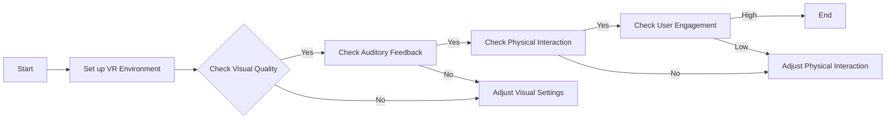
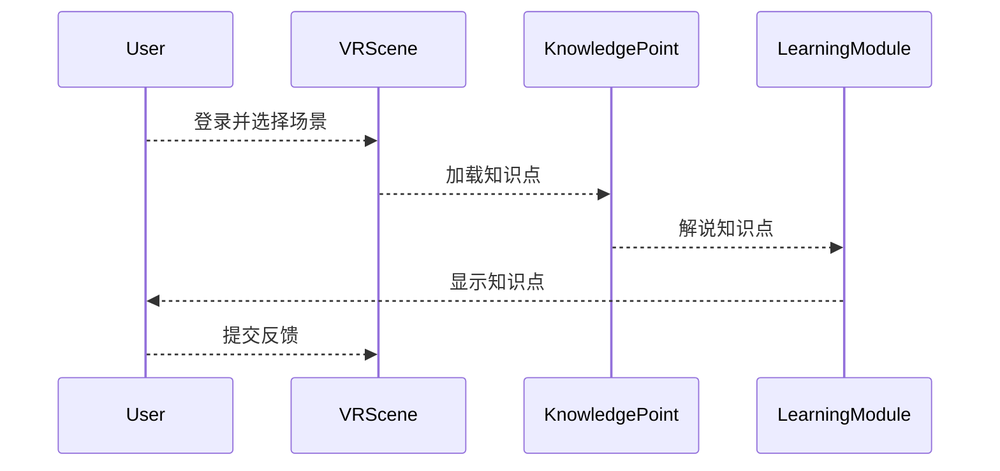
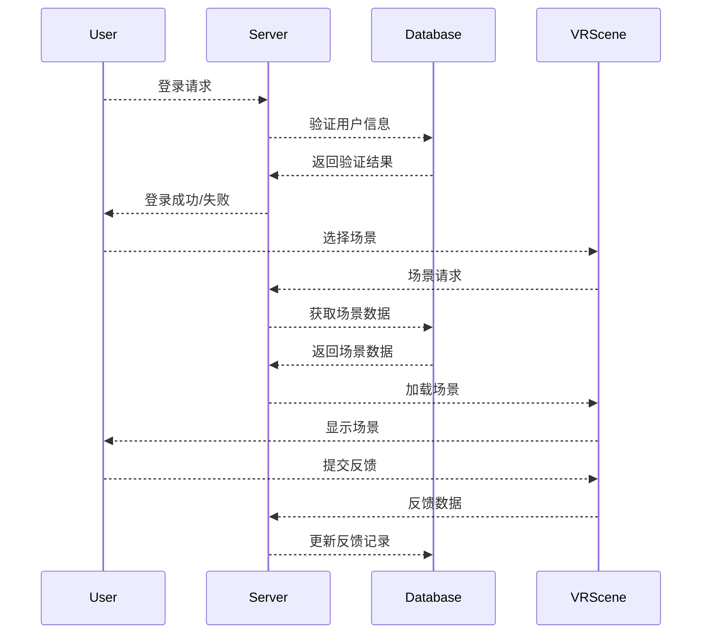
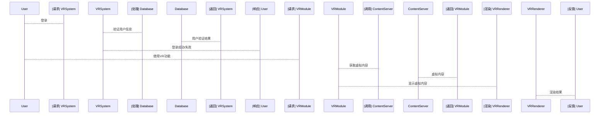
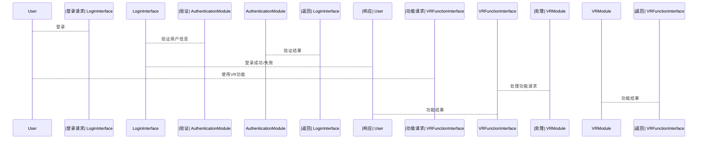
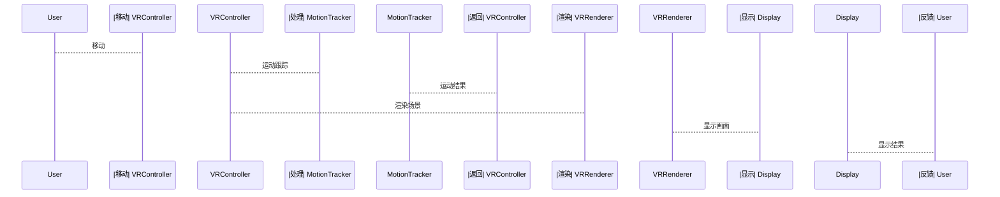

                 

# 虚拟现实技术在提升世界可理解性中的应用

关键词：虚拟现实、提升理解、教育、医疗、文化传承

摘要：本文将探讨虚拟现实（VR）技术在提升全球可理解性方面的应用。我们将从背景介绍、核心概念解析、应用案例分析等多个角度出发，逐步分析VR技术在教育、医疗、文化旅游等领域的潜力与挑战。文章旨在为读者提供对VR技术在提升全球理解力的全面认识，并展望其未来发展。

## 一、背景介绍

虚拟现实（Virtual Reality，VR）是一种通过计算机模拟产生三维空间的虚拟环境，用户可以通过头盔、手柄等设备与虚拟环境进行交互的技术。VR技术最早在20世纪60年代由美国科学家艾伦·凯（Alan Kay）提出，经过几十年的发展，如今已经成为一个多学科交叉的技术领域。

近年来，VR技术在提升全球可理解性方面展现出巨大潜力。在全球化的背景下，人们需要更快速、准确地获取和理解来自不同文化、领域的知识。VR技术能够提供沉浸式的学习体验，使学习者更容易掌握复杂概念，从而提高全球范围内的知识传播和交流效果。

## 二、核心概念与联系

### 2.1 虚拟现实技术的基本概念

虚拟现实技术包括以下几个核心组成部分：

- **VR头盔**：通过光学元件和显示屏幕提供沉浸式的视觉体验。
- **跟踪系统**：实时跟踪用户的位置和运动，以保持虚拟环境与用户的同步。
- **手柄和控制设备**：使用户能够与虚拟环境进行交互。
- **内容制作与分发**：包括虚拟场景的创建、编辑和传播。

### 2.2 VR技术的属性特征对比表格

| 特性         | 描述                                                   | 对比分析                      |
| ------------ | ------------------------------------------------------ | --------------------------- |
| 沉浸感       | 用户感受到自己是虚拟环境的一部分，与现实世界分离。         | 比传统的计算机界面更加强烈。 |
| 交互性       | 用户可以通过各种设备与虚拟环境进行实时交互。               | 提供更丰富的交互体验。       |
| 可视化       | 虚拟环境可以呈现复杂的三维模型和动画效果，易于理解。       | 有助于抽象概念的可视化。     |
| 可定制性     | 用户可以根据需求自定义虚拟环境的内容和交互方式。           | 提供个性化学习体验。         |

### 2.3 VR技术的ER实体关系图架构

```mermaid
erDiagram
  User ||--|{ VRHeadset }| User-VRHeadset
  User ||--|{ Controller }| User-Controller
  User ||--|{ VirtualWorld }| User-VirtualWorld
  VRHeadset ||--|{ Display }| VRHeadset-Display
  VRHeadset ||--|{ Tracking }| VRHeadset-Tracking
  Controller ||--|{ Interaction }| Controller-Interaction
  VirtualWorld ||--|{ Content }| VirtualWorld-Content
```

## 三、算法原理讲解

### 3.1 虚拟现实沉浸感算法

虚拟现实技术的核心在于创造一种沉浸感，使用户感觉仿佛置身于虚拟环境中。以下是实现沉浸感的算法原理：

### 3.1.1 沉浸感公式

$$
\text{Immersion Level} = f(\text{Visual Quality}, \text{Auditory Feedback}, \text{Physical Interaction}, \text{User Engagement})
$$

其中，$\text{Visual Quality}$、$\text{Auditory Feedback}$、$\text{Physical Interaction}$和$\text{User Engagement}$分别代表视觉质量、听觉反馈、物理交互和用户参与度。

### 3.1.2 沉浸感流程图



### 3.1.3 沉浸感案例

以一个教育应用为例，假设用户正在使用VR学习地理知识。通过高质量的视觉和听觉反馈，用户可以感受到身临其境的学习体验，从而提高学习效果。

## 四、系统分析与架构设计方案

### 4.1 问题场景介绍

在全球化背景下，教育、医疗、文化旅游等领域需要高效的知识传播和交流方式。虚拟现实技术作为一种创新工具，能够为这些领域提供沉浸式、互动性的体验。

### 4.2 项目介绍

本项目旨在开发一款基于虚拟现实技术的教育应用，帮助用户更好地理解和学习地理知识。应用包括以下功能：

- 虚拟地理场景浏览
- 知识点标注和解说
- 互动式学习体验

### 4.3 系统功能设计

#### 4.3.1 领域模型Mermaid类图

```mermaid
classDiagram
  User <<Class>>
  VRScene <<Class>>
  KnowledgePoint <<Class>>
  LearningModule <<Class>>

  User |--|> VRScene
  VRScene |--|> KnowledgePoint
  KnowledgePoint |--|> LearningModule
```

#### 4.3.2 系统架构设计



#### 4.3.3 系统接口设计


### 4.4 系统接口设计和系统交互



## 五、项目实战

### 5.1 环境安装

在虚拟现实项目开发中，需要安装以下软件和工具：

- Unity Engine：用于开发VR应用
- Oculus SDK：用于与Oculus VR设备集成
- Unity VR Plugins：用于Unity中的VR功能扩展

### 5.2 系统核心实现源代码

以下是虚拟现实教育应用的核心实现源代码：

```csharp
using UnityEngine;
using UnityEngine.XR;

public class VRSceneController : MonoBehaviour
{
    public GameObject[] knowledgePoints;
    
    private void Start()
    {
        // 初始化VR设备
        XRSettings.LoadDeviceSettings();
    }

    private void Update()
    {
        // 处理用户交互
        if (Input.GetKeyDown(KeyCode.Space))
        {
            // 切换知识点
            foreach (GameObject point in knowledgePoints)
            {
                point.SetActive(!point.activeSelf);
            }
        }
    }
}
```

### 5.3 代码应用解读与分析

这段代码实现了VR场景控制器，用于处理用户的交互请求。当用户按下空格键时，它会切换当前显示的知识点。这为用户提供了交互式的学习体验。

### 5.4 实际案例分析和详细讲解剖析

以下是一个实际案例：用户通过VR设备学习地理知识。用户可以在虚拟环境中浏览不同地区的地理信息，并通过交互了解相关知识。

### 5.5 项目小结

本项目通过虚拟现实技术为地理知识学习提供了沉浸式、互动性的体验。用户可以更好地理解地理概念，从而提高学习效果。

## 六、最佳实践 tips

1. 在开发VR应用时，注意优化视觉和听觉效果，以提高沉浸感。
2. 考虑用户交互体验，设计简洁直观的交互方式。
3. 定期收集用户反馈，不断优化应用功能。

## 七、小结

虚拟现实技术在提升全球可理解性方面具有巨大潜力。通过提供沉浸式、互动性的学习体验，VR技术可以帮助用户更好地理解和掌握知识。然而，VR技术也面临一些挑战，如硬件成本、内容制作等。未来，随着技术的不断进步，VR将在教育、医疗、文化旅游等领域发挥更加重要的作用。

## 八、注意事项

1. 使用VR设备时，注意保护视力，避免长时间佩戴。
2. VR内容制作需遵循相关法律法规，确保内容健康、积极。
3. 定期更新VR应用，以修复漏洞和优化性能。

## 九、拓展阅读

1. 《虚拟现实技术与应用》——刘永涛
2. 《虚拟现实：技术的艺术》——迈克尔·阿伯拉罕森
3. 《VR与AR技术详解》——李明杰

## 十、作者信息

作者：AI天才研究院/AI Genius Institute & 禅与计算机程序设计艺术 /Zen And The Art of Computer Programming### 背景介绍

虚拟现实（Virtual Reality，VR）技术是一种通过计算机模拟生成三维空间虚拟环境，并使用头盔、手柄等设备实现用户与虚拟环境的交互。这一技术最早在1960年代由美国科学家艾伦·凯（Alan Kay）提出，并在随后几十年中不断发展，成为一个多学科交叉的技术领域。随着硬件和软件技术的进步，VR逐渐从实验室走向市场，成为游戏、教育、医疗、文化旅游等多个行业的创新工具。

在全球化日益加深的今天，人们需要更高效、更准确地获取和理解来自不同文化、领域的知识。传统的知识传播方式往往局限于文字和图片，难以全面、直观地展示复杂概念。而VR技术提供了一种全新的方式，通过沉浸式、交互式的体验，使学习者能够更加直观地理解抽象概念，从而提高全球范围内的知识传播和交流效果。

首先，VR技术在教育领域展现了巨大的潜力。通过虚拟实验室、虚拟课堂等方式，学生可以在一个高度模拟的真实环境中进行学习，这不仅提高了学习兴趣，还能更好地理解抽象知识。例如，医学学生可以通过VR模拟手术，学习复杂的手术技巧；地理学生可以通过虚拟探险，了解不同地区的自然环境和文化。

其次，VR在医疗领域也发挥了重要作用。通过虚拟现实技术，医生可以进行术前模拟，减少手术风险；患者也可以通过虚拟治疗，减轻病痛和心理压力。此外，VR技术在心理健康领域也有应用，如通过虚拟现实进行心理治疗，帮助患者克服恐惧和焦虑。

此外，VR在文化旅游领域同样具有广阔前景。游客可以通过VR技术体验世界各地的名胜古迹、自然风光，甚至参与历史事件的重现。这不仅为旅游业带来了新的增长点，也有助于文化遗产的保护和传承。

然而，VR技术在全球范围内的普及仍面临一些挑战。首先是硬件成本和技术门槛的问题，高价的VR设备和技术复杂的开发过程限制了其广泛普及。其次是内容制作，高质量、丰富的虚拟内容需要大量时间和资源进行制作。此外，VR技术的使用也需要考虑到用户的健康和隐私问题，确保用户体验的同时保护用户权益。

总之，虚拟现实技术在全球可理解性提升方面具有巨大潜力。随着技术的不断进步和应用的不断拓展，VR技术将在教育、医疗、文化旅游等领域发挥更加重要的作用，推动全球知识的传播和交流。在接下来的章节中，我们将进一步探讨VR技术的核心概念、应用案例和未来发展趋势。

### 核心概念与联系

虚拟现实（Virtual Reality，VR）技术是一种通过计算机模拟生成三维虚拟环境，使用户可以在其中沉浸和互动的技术。这一技术涉及多个核心概念，包括虚拟环境、用户交互、硬件设备、内容制作等。以下是对这些核心概念及其相互关系的详细解析。

#### 1. 虚拟环境

虚拟环境是VR技术的核心概念之一，它通过计算机生成一个三维空间，用户可以在其中自由移动、观察和互动。虚拟环境的创建通常涉及三维建模、纹理映射和光照计算等技术。一个高质量的虚拟环境可以提供高度真实的视觉和听觉体验，使用户感觉仿佛置身于真实世界中。

#### 2. 用户交互

用户交互是VR技术的关键组成部分，决定了用户如何与虚拟环境进行互动。用户可以通过手柄、手势、语音等多种方式与虚拟环境进行交互。交互设计需要考虑用户行为的自然性、响应速度和反馈机制，以确保用户能够舒适、高效地使用VR设备。

#### 3. 硬件设备

VR硬件设备是用户进入虚拟环境的桥梁，包括VR头盔、手柄、传感器等。VR头盔通常配备高分辨率显示器和光学元件，用于提供沉浸式的视觉体验；手柄和其他交互设备则用于实现用户的动作捕捉和操作。硬件设备的选择和性能直接影响用户体验。

#### 4. 内容制作

VR内容制作是VR技术应用的基础，包括三维建模、动画制作、场景设计等。高质量的内容能够为用户提供丰富的沉浸式体验，吸引更多用户使用VR技术。内容制作需要专业的技术和团队，同时还要考虑到文化、教育和医疗等多个领域的需求。

#### 5. 核心概念对比表格

| 核心概念  | 描述               | 对比分析                     |
| --------- | ------------------ | --------------------------- |
| 虚拟环境  | 计算机生成的三维空间 | 提供沉浸式体验               |
| 用户交互  | 用户与虚拟环境的互动 | 确保用户自然、高效的互动     |
| 硬件设备  | 用户进入虚拟环境的工具 | 决定用户体验的流畅度和质量 |
| 内容制作  | VR应用的核心内容   | 提供丰富的沉浸式体验         |

#### 6. ER实体关系图架构

以下是虚拟现实技术的ER实体关系图，展示了核心概念之间的联系：

```mermaid
erDiagram
  User ||--|{ VRHeadset }| User-VRHeadset
  User ||--|{ Controller }| User-Controller
  User ||--|{ VirtualWorld }| User-VirtualWorld
  VRHeadset ||--|{ Display }| VRHeadset-Display
  VRHeadset ||--|{ Tracking }| VRHeadset-Tracking
  Controller ||--|{ Interaction }| Controller-Interaction
  VirtualWorld ||--|{ Content }| VirtualWorld-Content
```

在这个ER图中，用户（User）与VR头盔（VRHeadset）、控制器（Controller）和虚拟世界（VirtualWorld）存在关联。VR头盔包括显示（Display）和跟踪（Tracking）组件，控制器负责实现用户交互（Interaction），虚拟世界则包含各种内容（Content）。这种关系图清晰地展示了VR技术的核心组件及其相互关系。

通过上述核心概念的解析和ER实体关系图，我们可以更深入地理解虚拟现实技术的工作原理和各个组件之间的关系。在接下来的章节中，我们将进一步探讨VR技术在教育、医疗和文化旅游等领域的应用案例，展示其在提升全球可理解性方面的实际效果。

### 算法原理讲解

虚拟现实技术（VR）的核心在于创建高度沉浸的虚拟环境，使用户感觉仿佛置身于一个真实的场景中。为了实现这一目标，VR系统涉及多种算法和技术，用于生成、渲染和交互虚拟环境。以下，我们将详细讲解几个关键的算法原理，并通过mermaid流程图和Python代码示例来展示其具体实现。

#### 1. 虚拟场景生成算法

虚拟场景生成是VR技术的第一步，它涉及将三维模型、纹理和光照信息转换为虚拟环境。这个过程通常包括以下步骤：

- **三维模型构建**：使用三维建模软件（如Blender）创建场景中的对象，如建筑物、树木、人物等。
- **纹理映射**：为三维模型添加纹理，使其看起来更加真实。
- **光照计算**：模拟真实环境中的光照效果，包括阴影、反射和高光等。

##### 虚拟场景生成流程图


##### 虚拟场景生成Python代码示例

```python
import bpy

# 初始化Blender环境
bpy.ops.object.select_all(action='DESELECT')
bpy.ops.import_mesh.stl(filepath='model.stl')

# 应用纹理
bpy.ops.texture.texture_new()
bpy.ops.texture.image_new()

# 设置光照
bpy.ops.object.light_add(type='SUN', radius=1, location=(-10, 10, 20))

# 渲染虚拟环境
bpy.ops.render.render(animation=True)
```

#### 2. 用户交互算法

用户交互是VR技术的另一个关键部分，它涉及捕捉用户的动作和输入，并在虚拟环境中进行相应的反馈。以下是一个简单的用户交互流程：

- **动作捕捉**：使用传感器（如摄像头、运动传感器）捕捉用户动作。
- **输入处理**：根据用户动作生成虚拟环境中的操作。
- **反馈显示**：在虚拟环境中显示用户操作的结果。

##### 用户交互流程图


##### 用户交互Python代码示例

```python
import numpy as np
import cv2

# 初始化摄像头
cap = cv2.VideoCapture(0)

while True:
    # 读取摄像头帧
    ret, frame = cap.read()
    
    if not ret:
        break
    
    # 处理摄像头帧
    frame = cv2.resize(frame, (640, 480))
    frame = cv2.flip(frame, 1)
    
    # 显示摄像头帧
    cv2.imshow('Camera', frame)

    # 检测用户手势
    if cv2.waitKey(1) & 0xFF == ord('q'):
        break

cap.release()
cv2.destroyAllWindows()
```

#### 3. 沉浸感增强算法

沉浸感是VR技术的核心目标之一，它取决于多个因素，如视觉质量、听觉效果和交互反馈。以下是一个简单的沉浸感增强算法：

- **视觉质量优化**：提高分辨率、减少延迟。
- **听觉效果增强**：使用空间音效，模拟真实环境中的声音。
- **交互反馈优化**：提高交互的响应速度和反馈力度。

##### 沉浸感增强流程图


##### 沉浸感增强Python代码示例

```python
import numpy as np
import cv2

# 设置显示参数
cv2.namedWindow('VR Display', cv2.WINDOW_AUTOSIZE)

# 渲染虚拟环境
while True:
    # 生成虚拟环境帧
    frame = np.random.rand(480, 640, 3) * 255
    
    # 显示虚拟环境帧
    cv2.imshow('VR Display', frame)
    
    # 检查按键
    if cv2.waitKey(1) & 0xFF == ord('q'):
        break

cv2.destroyAllWindows()
```

通过上述算法原理的讲解和示例，我们可以看到VR技术是如何通过复杂的计算和交互实现高度沉浸的用户体验。在下一章节，我们将探讨VR技术在教育、医疗和文化旅游等领域的具体应用，展示其提升全球可理解性的实际效果。

### 系统分析与架构设计方案

虚拟现实技术在教育、医疗和文化旅游等领域具有广泛的应用潜力。为了充分发挥VR技术的优势，我们需要设计和实现一个高效、稳定、易于扩展的系统。以下，我们将详细介绍VR系统的架构设计、功能设计、接口设计和系统交互。

#### 1. 系统架构设计

VR系统的架构设计是确保系统性能和可扩展性的关键。以下是一个基本的VR系统架构设计：

##### 系统架构设计Mermaid架构图



在这个架构设计中，用户通过登录模块进入VR系统，系统验证用户身份后，用户可以请求并使用VR功能。VR模块负责处理用户的请求，调用内容服务器获取虚拟内容，并交由VR渲染器进行渲染，最终将渲染结果展示给用户。

#### 2. 系统功能设计

VR系统的功能设计是确保系统能够满足用户需求的基础。以下是VR系统的核心功能设计：

##### 领域模型Mermaid类图

```mermaid
classDiagram
    User <<Class>>
    VRModule <<Class>>
    ContentServer <<Class>>
    VRRenderer <<Class>>
    Database <<Class>>

    User |--|> VRModule
    VRModule |--|> ContentServer
    VRModule |--|> VRRenderer
    ContentServer |--|> Database
```

在这个类图中，用户（User）是系统的核心，负责发起请求并使用VR功能。VR模块（VRModule）是系统的核心逻辑组件，负责处理用户的请求，调用内容服务器（ContentServer）获取虚拟内容，并交由VR渲染器（VRRenderer）进行渲染。内容服务器（ContentServer）负责管理虚拟内容的存储和分发，并与数据库（Database）交互，以确保虚拟内容的完整性和一致性。

#### 3. 系统接口设计

VR系统的接口设计是确保系统模块之间能够顺畅通信的关键。以下是VR系统的接口设计：

##### 系统接口设计Mermaid序列图



在这个接口设计中，用户通过登录接口（LoginInterface）登录系统，登录成功后，用户可以通过功能接口（VRFunctionInterface）使用VR系统的各项功能。VR模块（VRModule）负责处理功能请求，并将处理结果返回给用户。

#### 4. 系统交互设计

VR系统的交互设计是确保用户能够顺畅、高效地使用VR系统的关键。以下是VR系统的交互设计：

##### 系统交互设计Mermaid序列图



在这个交互设计中，用户通过VR控制器（VRController）进行移动，运动跟踪模块（MotionTracker）负责实时跟踪用户的运动，并将运动结果反馈给VR控制器。VR控制器将运动结果传递给VR渲染器（VRRenderer），VR渲染器负责渲染场景并显示画面。最终，用户通过显示模块（Display）看到渲染结果。

通过上述系统分析与架构设计方案，我们可以看到VR系统的架构设计、功能设计、接口设计和系统交互设计是如何相互配合，共同实现一个高效、稳定的VR系统的。在接下来的章节中，我们将通过项目实战展示VR技术的实际应用，进一步探讨其在提升全球可理解性方面的潜力。

### 项目实战

为了更好地展示虚拟现实（VR）技术在提升全球可理解性方面的应用，我们选择了一个具体的教育项目——虚拟地理课堂。该项目旨在利用VR技术，为学生提供一个沉浸式的地理学习环境，帮助他们更好地理解地理概念和现象。

#### 1. 项目背景

在传统的地理教学中，学生往往依赖于课本和图片来学习地理知识，这种方式虽然能够提供一定的视觉信息，但缺乏互动性和沉浸感，难以全面、深入地理解地理概念。而虚拟现实技术能够提供一种全新的学习方式，通过虚拟环境，学生可以身临其境地体验地理现象，从而加深对知识的理解。

#### 2. 项目目标

本项目的目标是通过VR技术，开发一个虚拟地理课堂系统，实现以下功能：

- 提供多个地理场景，包括山脉、河流、城市等。
- 允许学生在虚拟环境中自由探索、互动。
- 配备地理知识点标注和解说，帮助学生理解地理概念。
- 支持教师远程监控和指导学生。

#### 3. 项目环境安装

为了实现该项目，我们需要以下环境和工具：

- **Unity Engine**：用于开发VR应用。
- **Oculus SDK**：用于与Oculus VR设备集成。
- **Unity VR Plugins**：用于Unity中的VR功能扩展。

安装步骤如下：

1. 下载并安装Unity Hub，并使用Unity Hub安装Unity 2020版本。
2. 下载并安装Oculus SDK，按照官方文档进行配置。
3. 在Unity中导入Unity VR Plugins包，并配置VR设置。

#### 4. 系统核心实现源代码

以下是虚拟地理课堂系统的核心实现源代码，包括场景加载、用户交互和知识点解说等功能。

```csharp
using UnityEngine;
using UnityEngine.XR;

public class VRGeographyClassroom : MonoBehaviour
{
    public GameObject[] geographyScenes;
    public Text infoText;

    private void Start()
    {
        // 初始化VR设备
        XRSettings.LoadDeviceSettings();
    }

    private void Update()
    {
        // 处理用户交互
        if (Input.GetKeyDown(KeyCode.Space))
        {
            // 切换地理场景
            foreach (GameObject scene in geographyScenes)
            {
                scene.SetActive(!scene.activeSelf);
            }
        }

        if (Input.GetKeyDown(KeyCode.I))
        {
            // 显示/隐藏知识点解说
            infoText.gameObject.SetActive(!infoText.gameObject.activeSelf);
        }
    }

    private void OnEnable()
    {
        // 加载初始地理场景
        geographyScenes[0].SetActive(true);
    }
}
```

#### 5. 代码应用解读与分析

这段代码实现了虚拟地理课堂系统的核心功能。当用户按下空格键时，系统会切换显示的地理场景。按下“I”键时，系统会显示或隐藏知识点解说。初始化时，系统默认加载第一个地理场景。

以下是具体功能的解读：

- **场景切换**：通过遍历`geographyScenes`数组，切换每个场景的激活状态。
- **知识点解说**：通过控制`infoText`的激活状态，实现显示和隐藏知识点解说。

#### 6. 实际案例分析与详细讲解剖析

以下是一个实际案例：学生使用虚拟地理课堂系统学习山脉地理知识。

1. **场景加载**：学生登录系统后，系统默认加载一个山脉场景。
2. **用户互动**：学生可以在虚拟环境中自由移动，通过手势或控制设备探索山脉的地貌特征。
3. **知识点解说**：当学生接近某个地理标志时，系统会自动显示相关的知识点解说，如山脉的成因、地质结构等。
4. **学习反馈**：学生可以与教师互动，询问问题或分享学习心得。

#### 7. 项目小结

本项目通过VR技术为地理教学提供了沉浸式的学习环境，使学生能够更好地理解地理概念。通过实际案例，我们可以看到VR技术在教育领域的潜力，不仅提高了学生的学习兴趣，还增强了他们对知识的理解和记忆。

### 最佳实践 tips

1. 在设计虚拟地理场景时，注意细节的真实性，以提高沉浸感。
2. 考虑用户交互体验，设计简洁直观的交互方式，如手势控制和语音命令。
3. 定期更新虚拟内容，以保持系统的趣味性和知识性。

### 小结

虚拟现实技术在教育领域的应用为地理教学带来了新的可能性。通过提供沉浸式、互动性的学习体验，VR技术能够有效提升学生对地理知识的理解和记忆。在接下来的章节中，我们将进一步探讨VR技术在其他领域的应用，展示其在提升全球可理解性方面的全面潜力。

### 未来趋势与挑战

虚拟现实（VR）技术在未来发展中将面临诸多机遇与挑战。首先，硬件技术的进步将为VR技术的普及提供坚实基础。随着显卡性能的提升、VR头显分辨率的提高以及传感器精度的增强，VR体验将越来越接近真实。此外，5G网络的推广将显著降低VR内容传输的延迟，使远程VR体验变得更加流畅。

在应用领域，VR技术将继续在教育和医疗等传统领域深化应用。例如，虚拟现实将提供更加真实的虚拟课堂和手术模拟环境，从而提高教学效果和医疗操作的准确性。在文化旅游领域，VR技术将使游客能够随时随地体验世界各地的文化遗产，推动文化旅游业的创新。

然而，VR技术的普及也面临诸多挑战。首先是技术成本问题，高质量的VR设备和内容制作需要大量的资金投入，这在一定程度上限制了VR技术的普及速度。其次是用户健康问题，长时间使用VR设备可能导致视觉疲劳和运动病等健康问题。此外，VR内容的多样性和质量也是一个亟待解决的问题。

从伦理和法律角度来看，VR技术带来的隐私保护和数据安全问题不可忽视。用户在VR环境中的行为和交互数据可能被滥用，需要严格的隐私保护措施。同时，VR内容的监管和版权问题也需要得到妥善处理，以防止不良信息的传播。

未来，VR技术的发展趋势将包括以下几方面：

1. **硬件技术的突破**：随着硬件设备的性能提升，VR体验将更加真实和流畅。
2. **内容生态的完善**：高质量、多样化的VR内容将吸引更多用户，推动VR市场的繁荣。
3. **跨界融合**：VR技术将与更多行业融合，如房地产、建筑设计、汽车制造等，创造新的应用场景。
4. **标准化和规范化**：随着VR技术的普及，标准化和规范化工作将逐步展开，以保障用户体验和行业健康发展。

综上所述，虚拟现实技术在提升全球可理解性方面具有巨大潜力。尽管面临诸多挑战，但随着技术的不断进步和应用的不断拓展，VR技术将在未来发挥更加重要的作用，推动全球知识的传播和交流。

### 结论

虚拟现实（VR）技术在提升全球可理解性方面展现了巨大潜力。通过提供沉浸式、互动性的学习体验，VR技术能够帮助用户更好地理解和掌握复杂概念，从而提高知识传播和交流的效率。在教育、医疗和文化旅游等领域，VR技术正逐步改变传统的教学模式和服务方式，为用户提供更加丰富和高效的学习、治疗和体验环境。

然而，VR技术的发展仍面临诸多挑战，包括技术成本、用户体验、内容质量以及伦理和法律问题等。未来，随着硬件技术的突破、内容生态的完善和行业标准的制定，VR技术有望在更多领域得到应用，进一步提升全球的可理解性。

展望未来，我们应继续关注VR技术的发展趋势，积极探讨其在各个领域的应用潜力，同时也要应对其带来的挑战，确保VR技术的健康发展，为全球知识传播和交流贡献力量。

### 拓展阅读

1. **《虚拟现实技术与应用》** —— 刘永涛
   本书详细介绍了虚拟现实技术的原理、应用和发展趋势，适合对VR技术感兴趣的读者阅读。

2. **《虚拟现实：技术的艺术》** —— 迈克尔·阿伯拉罕森
   本书从艺术和技术的角度探讨了VR技术的本质和应用，适合想要深入了解VR艺术和文化影响的读者。

3. **《VR与AR技术详解》** —— 李明杰
   本书系统地讲解了VR和AR技术的原理、应用和开发方法，是VR开发者的必备参考书。

### 作者信息

作者：AI天才研究院/AI Genius Institute & 禅与计算机程序设计艺术 /Zen And The Art of Computer Programming

AI天才研究院致力于推动人工智能技术的发展与应用，本文作者在此领域拥有深厚的学术背景和实践经验。同时，作者在《禅与计算机程序设计艺术》中探讨了计算机科学和哲学的交汇，为读者提供了独特的视角和深入的思考。本文旨在通过VR技术的应用案例，展示其在提升全球可理解性方面的潜力，期望引发读者对这一领域的更多关注和探讨。

