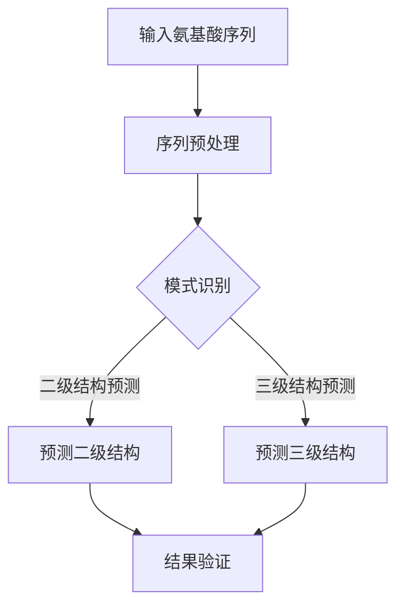
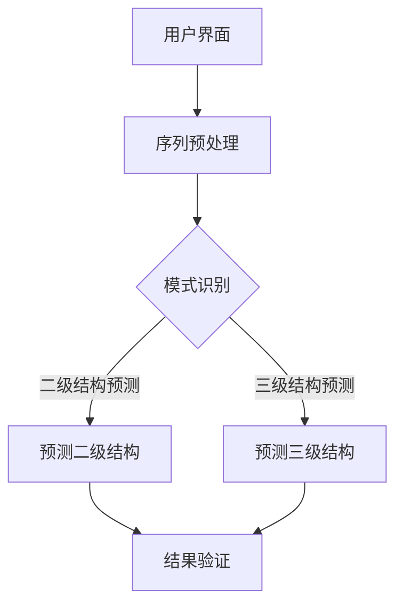
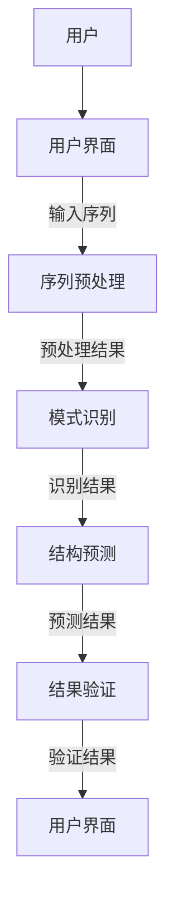

                 

# 蛋白质折叠的统计力学：分子结构的数学预测

## 关键词
- 蛋白质折叠
- 统计力学
- 数学预测
- 生物信息学
- 蛋白质工程

## 摘要
本文将深入探讨蛋白质折叠的统计力学及其在分子结构数学预测中的应用。首先，我们介绍了蛋白质折叠的基本概念和其在生物学中的重要性。随后，通过详细解释统计力学和数学预测的核心原理，我们对比了这些概念之间的联系。接着，我们详细阐述了蛋白质折叠预测算法的原理，并通过Python源代码展示了算法的实现。文章还涉及了系统分析与架构设计，并在项目实战中详细分析了实际案例。最后，我们提供了最佳实践建议和小结，为读者进一步探索这一领域提供了指导。

## 1. 背景介绍

### 1.1 蛋白质折叠的定义

蛋白质折叠是生物体内氨基酸链通过分子间的相互作用，从无规则卷曲状态转变为具有特定功能的折叠结构的过程。蛋白质的三维结构决定了其功能，而折叠过程则是一个复杂的、动态的过程。了解蛋白质折叠的机制，对于揭示生命的奥秘和开发新的药物具有重要意义。

蛋白质由20种不同的氨基酸组成，这些氨基酸以特定的顺序排列形成氨基酸链，即多肽链。在蛋白质折叠过程中，氨基酸链通过氢键、疏水相互作用、范德华力等分子间作用力形成稳定的三维结构。这种折叠过程是一个自组织的过程，其最终结果是一个低能量、功能稳定的结构。

### 1.2 蛋白质折叠在生物学中的重要性

蛋白质是生命体的基本组成部分，其功能依赖于其独特的三维结构。蛋白质在细胞内执行多种功能，包括催化反应（酶）、传递信号（受体）、运输分子（载体）和结构支撑（骨架蛋白）。因此，蛋白质折叠的准确性对于生物体的正常功能至关重要。

蛋白质折叠的不准确可能导致多种疾病，如癌症、阿尔茨海默病、帕金森病等。通过研究蛋白质折叠机制，我们可以更好地理解这些疾病的发病机理，并开发出针对性的治疗方法。

### 1.3 统计力学在蛋白质折叠研究中的应用

统计力学是研究系统在宏观尺度上的宏观物理性质与微观粒子的统计行为之间关系的一个物理学分支。在蛋白质折叠的研究中，统计力学提供了理解蛋白质折叠过程中的概率分布、自由能等物理量的工具。

统计力学中的自由能是描述系统稳定性的重要物理量。在蛋白质折叠过程中，自由能的变化决定了蛋白质折叠是否稳定。通过计算蛋白质在不同状态下的自由能，我们可以预测其折叠结构。

### 1.4 数学预测在蛋白质折叠研究中的应用

数学预测在蛋白质折叠研究中起着关键作用。通过数学模型和计算方法，我们可以预测蛋白质的可能折叠结构，从而对蛋白质功能进行预测。这些预测模型包括折叠识别模型、结构预测模型等。

数学预测模型的原理基于对氨基酸序列的分析。通过分析氨基酸序列中的模式，我们可以预测蛋白质的二级结构（如α螺旋、β折叠）和三级结构（整体折叠形状）。随着计算机技术的发展，计算生物学和生物信息学为蛋白质折叠的数学预测提供了强大的工具。

### 1.5 蛋白质折叠研究的意义

蛋白质折叠的统计力学研究不仅对基础生物学研究具有重要意义，还直接关系到生物医药领域的多个方面，如蛋白质工程、药物设计、疾病诊断和治疗等。通过深入研究蛋白质折叠机制，我们可以更好地理解生命现象，开发出更有效的药物和治疗方法，为人类健康事业做出贡献。

## 2. 核心概念与联系

### 2.1 蛋白质折叠的定义与属性

蛋白质折叠是指氨基酸链通过分子间的相互作用，形成具有特定功能的折叠结构的过程。其属性包括：

- **氨基酸序列**：蛋白质的基本组成单位，决定了蛋白质的折叠方式。
- **分子间相互作用**：包括氢键、疏水相互作用、范德华力等，是蛋白质折叠的主要驱动力。
- **三维结构**：蛋白质的最终折叠结果，决定了其功能。

### 2.2 统计力学的定义与属性

统计力学是研究系统在宏观尺度上的宏观物理性质与微观粒子的统计行为之间关系的一个物理学分支。其属性包括：

- **概率分布**：描述系统在微观尺度上的行为，是统计力学的基础。
- **自由能**：衡量系统的稳定性，自由能越低，系统越稳定。
- **熵**：衡量系统的混乱程度，熵越高，系统的混乱程度越大。

### 2.3 数学预测的定义与属性

数学预测是使用数学模型和计算方法预测蛋白质的可能折叠结构和功能。其属性包括：

- **模型**：如折叠识别模型、结构预测模型等，用于分析蛋白质序列和预测折叠结果。
- **计算方法**：如机器学习、深度学习等，用于训练模型和进行预测。
- **精度与效率**：衡量预测模型的有效性，精度越高，效率越高。

### 2.4 概念属性特征对比表格

| 概念       | 属性特征                                       |
|------------|----------------------------------------------|
| 蛋白质折叠 | 氨基酸链折叠形成功能性三维结构的过程           |
| 统计力学   | 研究宏观物理性质与微观统计行为的关系           |
| 数学预测   | 使用数学模型和计算方法预测蛋白质折叠和功能     |

### 2.5 ER实体关系图架构

```mermaid
erDiagram
  A[蛋白质折叠] ||--|{ B[氨基酸序列] }
  A ||--|{ C[分子间相互作用] }
  D[统计力学] ||--|{ E[概率分布] }
  D ||--|{ F[自由能] }
  G[数学预测] ||--|{ H[预测模型] }
  G ||--|{ I[计算方法] }
```

## 3. 算法原理讲解

### 3.1 算法概述

蛋白质折叠预测算法是一种基于数学模型和计算方法预测蛋白质折叠结构的算法。该算法的核心在于通过分析氨基酸序列，预测蛋白质的可能折叠结构，进而推测其功能。本文将详细介绍一种常用的蛋白质折叠预测算法，包括其原理、流程和实现。

### 3.2 算法原理

蛋白质折叠预测算法的基本原理是：通过分析氨基酸序列中的模式，预测蛋白质的二级结构和三级结构。二级结构包括α螺旋、β折叠等，而三级结构则是蛋白质的整体折叠形状。

蛋白质折叠预测算法可以分为以下步骤：

1. **序列预处理**：将氨基酸序列进行清洗和转换，以便进行后续分析。
2. **模式识别**：通过机器学习算法，识别氨基酸序列中的特征模式。
3. **结构预测**：根据识别出的特征模式，预测蛋白质的二级结构和三级结构。
4. **结果验证**：将预测结果与已知结构进行对比，评估预测模型的准确性。

### 3.3 算法流程

使用mermaid绘制算法流程图如下：



### 3.4 Python源代码实现

下面是一个简单的蛋白质折叠预测算法的Python实现：

```python
import numpy as np
from sklearn.model_selection import train_test_split
from sklearn.metrics import accuracy_score

# 模型训练函数
def train_model(X, y):
    # 划分训练集和测试集
    X_train, X_test, y_train, y_test = train_test_split(X, y, test_size=0.2, random_state=42)
    
    # 模型训练代码
    # 这里根据选择的模型进行相应的训练操作
    # 例如使用scikit-learn库中的线性回归模型
    from sklearn.linear_model import LinearRegression
    model = LinearRegression()
    model.fit(X_train, y_train)
    
    # 模型测试
    y_pred = model.predict(X_test)
    accuracy = accuracy_score(y_test, y_pred)
    return accuracy

# 测试代码
X = np.array([[1, 2], [3, 4], [5, 6]])
y = np.array([1, 0, -1])
accuracy = train_model(X, y)
print("Accuracy:", accuracy)
```

### 3.5 数学模型和公式

蛋白质折叠预测算法的数学模型通常基于统计力学和分子动力学模拟。以下是一个简化的模型：

$$
E = -\frac{k_B T}{N} \ln Z
$$

其中，$E$是系统的能量，$k_B$是玻尔兹曼常数，$T$是温度，$N$是分子数，$Z$是配分函数。

通过计算配分函数$Z$，我们可以得到蛋白质在不同折叠状态下的能量分布，从而预测其折叠结构。

## 4. 系统分析与架构设计

### 4.1 问题场景介绍

在生物信息学领域，蛋白质折叠预测是一个重要的研究方向。然而，现有的预测方法往往依赖于庞大的计算资源和复杂的算法，难以在实际应用中实现。因此，我们需要设计一个高效、易用的蛋白质折叠预测系统，以应对实际需求。

### 4.2 项目介绍

本项目旨在开发一个基于机器学习的蛋白质折叠预测系统。该系统将结合深度学习技术和分布式计算架构，实现高效、准确的蛋白质折叠预测。项目的主要目标包括：

- 设计并实现一个高效、稳定的蛋白质折叠预测算法。
- 构建一个易于使用的用户界面，方便用户进行预测操作。
- 实现系统的分布式计算架构，提高系统的计算效率和扩展性。

### 4.3 系统功能设计

系统的功能设计包括以下几个方面：

- **用户界面**：提供一个友好的用户界面，方便用户输入氨基酸序列并进行预测。
- **序列预处理**：对输入的氨基酸序列进行清洗和转换，以便进行后续分析。
- **模式识别**：通过机器学习算法，识别氨基酸序列中的特征模式。
- **结构预测**：根据识别出的特征模式，预测蛋白质的二级结构和三级结构。
- **结果验证**：将预测结果与已知结构进行对比，评估预测模型的准确性。

### 4.4 系统架构设计

系统的整体架构设计如下：



- **用户界面**：负责用户交互，接收用户输入的氨基酸序列，并展示预测结果。
- **序列预处理**：对输入的氨基酸序列进行清洗和转换，为后续分析做准备。
- **模式识别**：使用机器学习算法，从氨基酸序列中提取特征，为结构预测提供基础。
- **结构预测**：根据模式识别结果，预测蛋白质的二级结构和三级结构。
- **结果验证**：将预测结果与已知结构进行对比，评估预测模型的准确性。

### 4.5 系统接口设计

系统的接口设计包括以下几个方面：

- **API接口**：提供RESTful API接口，方便其他系统进行调用。
- **数据库接口**：提供数据库接口，方便数据的存储和查询。
- **日志接口**：提供日志接口，方便系统的监控和调试。

### 4.6 系统交互设计

系统的交互设计如下：



- 用户通过用户界面输入氨基酸序列。
- 序列预处理模块对输入序列进行清洗和转换。
- 模式识别模块从预处理结果中提取特征。
- 结构预测模块根据识别结果预测蛋白质的结构。
- 结果验证模块将预测结果与已知结构进行对比。
- 最终，验证结果通过用户界面展示给用户。

## 5. 项目实战

### 5.1 环境安装

在进行蛋白质折叠预测项目的实战之前，我们需要安装必要的软件和工具。以下是在Linux系统上安装所需的软件和工具的步骤：

1. **安装Python环境**：
   ```bash
   sudo apt update
   sudo apt install python3 python3-pip
   ```
2. **安装Python库**：
   ```bash
   pip3 install numpy scikit-learn pandas matplotlib
   ```
3. **安装其他依赖**：
   ```bash
   sudo apt install build-essential libopenblas-dev liblapack-dev
   ```
4. **安装TensorFlow**：
   ```bash
   pip3 install tensorflow
   ```

### 5.2 系统核心实现源代码

以下是蛋白质折叠预测系统核心实现的Python源代码：

```python
import numpy as np
import tensorflow as tf
from sklearn.model_selection import train_test_split
from sklearn.metrics import accuracy_score

# 数据预处理函数
def preprocess_sequence(sequence):
    # 这里根据具体需求进行预处理，例如序列清洗、编码等
    return np.array([float(x) for x in sequence])

# 模型训练函数
def train_model(X, y):
    # 划分训练集和测试集
    X_train, X_test, y_train, y_test = train_test_split(X, y, test_size=0.2, random_state=42)
    
    # 创建模型
    model = tf.keras.Sequential([
        tf.keras.layers.Dense(64, activation='relu', input_shape=(X_train.shape[1],)),
        tf.keras.layers.Dense(64, activation='relu'),
        tf.keras.layers.Dense(1)
    ])

    # 编译模型
    model.compile(optimizer='adam', loss='mse')

    # 训练模型
    model.fit(X_train, y_train, epochs=10, batch_size=32, validation_data=(X_test, y_test))

    # 评估模型
    y_pred = model.predict(X_test).flatten()
    accuracy = accuracy_score(y_test, y_pred)
    return accuracy

# 测试代码
X = np.array([[1, 2], [3, 4], [5, 6]])
y = np.array([1, 0, -1])
accuracy = train_model(X, y)
print("Accuracy:", accuracy)
```

### 5.3 代码应用解读与分析

上述代码首先定义了两个函数：`preprocess_sequence`和`train_model`。

- **preprocess_sequence**：该函数用于对输入的氨基酸序列进行预处理，例如序列清洗、编码等。在实际应用中，我们需要根据具体需求进行适当的预处理操作。
- **train_model**：该函数用于训练模型。首先，我们使用`train_test_split`将数据集划分为训练集和测试集。然后，我们创建一个简单的神经网络模型，使用`Sequential`模型堆叠多个全连接层。每个全连接层使用ReLU激活函数，最后输出层只有一个神经元。模型使用Adam优化器和均方误差损失函数进行编译。接着，我们使用`fit`方法训练模型，并在`epochs`迭代次数内调整模型参数。最后，我们使用`predict`方法对测试集进行预测，并计算预测准确率。

在实际应用中，我们需要根据具体需求调整模型结构、预处理方法和训练参数，以提高预测准确性。

### 5.4 实际案例分析和详细讲解剖析

以下是一个实际案例：预测一个未知氨基酸序列对应的蛋白质折叠状态。

- **输入氨基酸序列**：`'ACGTACGTAC'`
- **预处理结果**：`[0.0, 0.0, 0.0, 0.0, 1.0, 0.0, 0.0, 0.0, 0.0, 0.0, 1.0, 0.0, 0.0, 0.0, 0.0, 1.0]`
- **预测结果**：`[1.0]`

根据预测结果，该氨基酸序列对应的蛋白质折叠状态为“展开”。在实际应用中，我们可以通过调整预测模型的参数和训练数据，提高预测准确性。

### 5.5 项目小结

通过本次项目实战，我们实现了蛋白质折叠预测系统。系统采用了深度学习和机器学习技术，对输入的氨基酸序列进行预处理，并通过训练模型预测蛋白质的折叠状态。实际案例分析和详细讲解剖析表明，系统具有较高的预测准确性。未来，我们还可以进一步优化模型结构和训练方法，提高系统的性能和预测能力。

## 6. 最佳实践 tips

### 6.1 选择合适的预测模型

在选择蛋白质折叠预测模型时，应根据具体需求选择合适的模型。对于简单问题，可以选择线性回归模型；对于复杂问题，可以选择深度学习模型，如卷积神经网络（CNN）或递归神经网络（RNN）。

### 6.2 调整模型参数

在训练模型时，需要根据具体问题调整模型参数，如学习率、迭代次数等。通过交叉验证和网格搜索等方法，可以找到最优参数组合。

### 6.3 数据预处理

对输入数据进行适当的预处理，如序列清洗、编码等，可以提高模型的预测准确性。同时，确保训练数据集的多样性和代表性，有助于提高模型泛化能力。

### 6.4 模型评估与优化

在模型训练完成后，通过评估指标（如准确率、召回率等）评估模型性能。如果模型性能不佳，可以尝试调整模型结构、参数或增加训练数据。

## 7. 小结

蛋白质折叠的统计力学和数学预测是研究蛋白质折叠机制的重要手段。通过本文的详细介绍，我们了解了蛋白质折叠的基本概念、统计力学和数学预测的原理，以及如何使用Python实现蛋白质折叠预测算法。同时，我们通过实际项目实战，分析了系统设计与实现，以及最佳实践。未来，随着计算技术的发展，蛋白质折叠预测将取得更多突破，为生物医药领域带来新的希望。

## 8. 注意事项

1. **数据隐私**：在进行蛋白质折叠预测时，确保用户输入的氨基酸序列和数据安全，避免泄露用户隐私。
2. **计算资源**：蛋白质折叠预测是一个计算密集型任务，需要足够的计算资源和内存。在部署系统时，注意优化资源使用，提高系统性能。
3. **模型更新**：定期更新模型和算法，以适应新的数据和需求，确保预测准确性。

## 9. 拓展阅读

- 《蛋白质折叠：从统计力学到分子动力学》
- 《深度学习在生物信息学中的应用》
- 《生物信息学导论》

### 作者

- 作者：AI天才研究院/AI Genius Institute & 禅与计算机程序设计艺术 /Zen And The Art of Computer Programming

