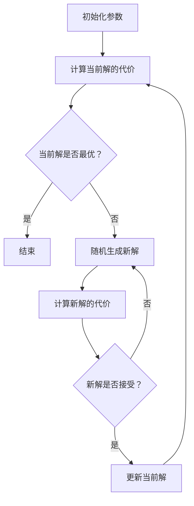
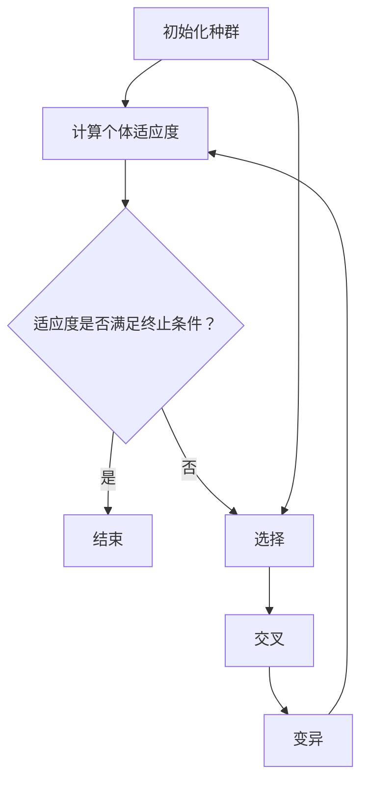
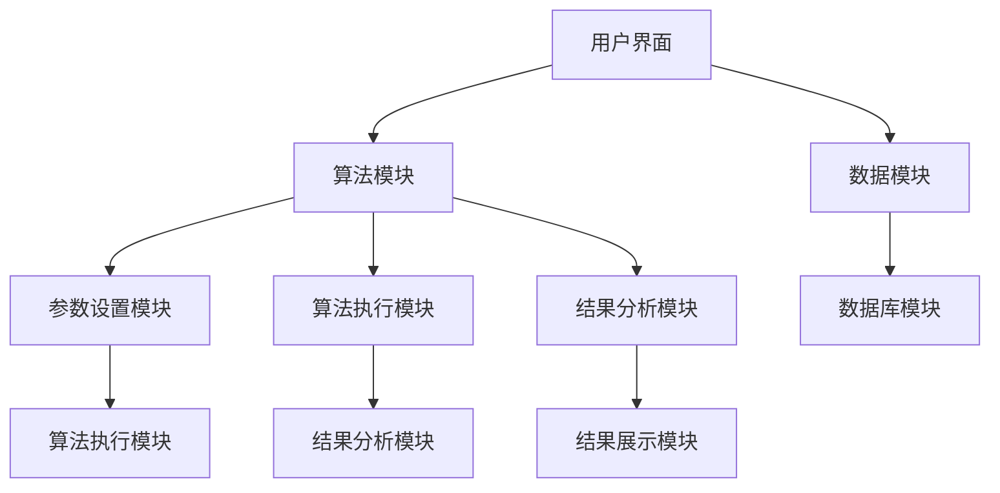

                 


### 蛋白质折叠的能量最小化：分子结构的数学预测

#### 关键词

- 蛋白质折叠
- 能量最小化
- 数学模型
- 预测算法
- 分子结构

#### 摘要

本文将深入探讨蛋白质折叠过程中的能量最小化问题，通过介绍核心概念、算法原理以及实际应用，揭示分子结构数学预测的科学奥秘。我们将首先回顾蛋白质折叠的背景知识，然后分析能量最小化问题的定义和解决方案，接着详细介绍模拟退火算法和遗传算法的原理和应用，最后通过一个实际案例展示蛋白质折叠能量最小化问题的解决过程。

### 第一部分：背景介绍

#### 1.1 问题背景

蛋白质是生命体的基本组成单位之一，其在细胞中的功能与其独特的三维结构密切相关。蛋白质折叠过程是指蛋白质从线性的氨基酸序列折叠成具有特定三维空间结构的复杂过程。这一过程不仅决定了蛋白质的功能，还直接影响着生物体内的生化反应和细胞活动。因此，对蛋白质折叠的深入研究对于理解生命现象、设计药物以及开发生物技术具有重要意义。

蛋白质折叠的复杂性主要体现在以下几个方面：

1. **氨基酸多样性**：蛋白质由20种不同的氨基酸组成，氨基酸序列的多样性决定了蛋白质结构的多样性。
2. **三维结构的复杂性**：蛋白质的三维结构由数千个原子组成，这些原子之间通过各种相互作用力相互连接，形成复杂的空间结构。
3. **能量的动态变化**：蛋白质折叠过程中，能量的动态变化是驱动折叠过程的关键因素。

#### 1.2 问题描述

蛋白质折叠的能量最小化问题可以描述为：在给定的氨基酸序列下，找到使蛋白质体系能量最小的结构，即最稳定的折叠状态。这个问题可以形式化为一个优化问题，即

$$
\min_{\text{structure}} E(\text{structure})
$$

其中，$E(\text{structure})$表示蛋白质在特定结构状态下的能量。

#### 1.3 问题解决

解决蛋白质折叠的能量最小化问题通常需要使用数学模型和算法。以下是一些常见的方法：

1. **物理模型**：基于物理学原理，如分子力学和量子力学，构建能量模型来描述蛋白质折叠过程。
2. **统计模型**：基于统计力学的原理，如自由能采样和模拟退火算法，来搜索蛋白质的低能量结构。
3. **图论模型**：将蛋白质折叠问题转化为图论问题，如最小生成树问题，通过算法求解。

#### 1.4 边界与外延

蛋白质折叠的能量最小化问题不仅是一个纯理论研究问题，还具有重要的应用价值：

1. **生物信息学**：通过预测蛋白质的折叠结构，可以预测其功能，为蛋白质功能注释提供重要依据。
2. **药物设计**：通过了解蛋白质的折叠结构，可以设计针对特定蛋白质的药物分子，提高药物设计的效率。
3. **材料科学**：蛋白质的折叠过程也启发了材料科学领域的研究，如在材料设计中引入蛋白质折叠的概念。

#### 1.5 概念结构与核心要素组成

蛋白质折叠的能量最小化问题涉及多个核心概念和要素：

- **氨基酸序列**：蛋白质的基本组成单位，决定了蛋白质的折叠方式。
- **蛋白质结构**：蛋白质在空间中的三维结构，分为一级结构、二级结构、三级结构和四级结构。
- **能量模型**：描述蛋白质折叠过程中相互作用能量的数学模型，如力场模型、能量势函数等。
- **算法**：用于求解能量最小化问题的数学算法，如模拟退火算法、遗传算法等。
- **计算资源**：蛋白质折叠的能量最小化问题计算量大，需要高性能计算资源支持。

### 第二部分：核心概念与联系

#### 2.1 蛋白质结构的概念

蛋白质结构是蛋白质分子在空间中的三维排布，其层次结构可以分为以下几类：

1. **一级结构**：氨基酸序列，是蛋白质结构的基础。
2. **二级结构**：局部折叠结构，如α-螺旋、β-折叠等。
3. **三级结构**：蛋白质分子整体的三维结构。
4. **四级结构**：多个蛋白质分子的组合结构。

蛋白质的折叠过程可以看作是从一级结构向更高层次结构的逐步折叠过程。在这一过程中，氨基酸之间的相互作用力，如氢键、范德华力和疏水作用力等，起到了关键作用。

#### 2.2 能量模型的概念

能量模型是描述蛋白质折叠过程中相互作用能量的数学模型。常见的能量模型包括：

1. **力场模型**：基于物理学原理，如分子力学和量子力学，构建的描述原子之间相互作用的能量模型。
2. **能量势函数**：描述蛋白质在不同折叠状态下的能量，通常是一个高度非线性的函数。

能量模型的关键在于如何准确描述蛋白质分子中的各种相互作用力，以及如何将这些相互作用力转化为能量形式，从而在数学模型中表示。

#### 2.3 算法的概念

算法是用于求解蛋白质折叠能量最小化问题的数学算法。常见的算法包括：

1. **模拟退火算法**：一种基于概率的优化算法，通过模拟物理退火过程来寻找全局最优解。
2. **遗传算法**：一种基于生物进化的优化算法，通过模拟自然进化过程来寻找全局最优解。

算法的核心在于如何高效地搜索蛋白质的折叠空间，以找到能量最小的折叠结构。不同的算法在搜索策略、更新规则和收敛速度等方面有所差异。

### 第三部分：算法原理讲解

#### 3.1 模拟退火算法

模拟退火算法（Simulated Annealing, SA）是一种基于概率的优化算法，其灵感来源于固体材料的退火过程。固体材料在高温下被加热至熔点，然后缓慢冷却，从而形成最小内能的结构。模拟退火算法通过模拟这一过程来求解优化问题。

#### 3.1.1 基本原理

模拟退火算法的基本原理是：在搜索空间中随机游走，并接受局部最优解，从而避免陷入局部最优解。每次迭代，算法都会根据一定的概率接受当前解，概率与当前解的代价和最优解的代价有关。

#### 3.1.2 mermaid 流程图



#### 3.1.3 源代码示例

```python
import random

def simulated_annealing(initial_state, cost_function, temperature, cooling_rate):
    current_state = initial_state
    current_cost = cost_function(current_state)
    best_state = current_state
    best_cost = current_cost

    while temperature > 0:
        next_state = randomneighbor(current_state)
        next_cost = cost_function(next_state)

        if accept(new_cost, current_cost, temperature):
            current_state = next_state
            current_cost = next_cost

            if next_cost < best_cost:
                best_state = next_state
                best_cost = next_cost

        temperature *= (1 - cooling_rate)

    return best_state, best_cost

def randomneighbor(state):
    # Generate a random neighboring state
    pass

def accept(new_cost, current_cost, temperature):
    if new_cost < current_cost:
        return True
    else:
        return random.random() < exp(- (new_cost - current_cost) / temperature)
```

#### 3.2 遗传算法

遗传算法（Genetic Algorithm, GA）是一种基于生物进化的优化算法，其灵感来源于自然选择和遗传学。遗传算法通过模拟自然进化过程来求解优化问题。

#### 3.2.1 基本原理

遗传算法的基本原理是：通过模拟自然进化过程，即选择、交叉和变异，来逐步改进种群的适应度，直至找到全局最优解。

1. **选择**：根据个体适应度选择优胜个体，用于产生下一代。
2. **交叉**：通过交换两个个体的部分基因，产生新的个体。
3. **变异**：对个体的某些基因进行随机改变，增加种群的多样性。

#### 3.2.2 mermaid 流程图



#### 3.2.3 源代码示例

```python
import random

def genetic_algorithm(population, fitness_function, mutation_rate, crossover_rate):
    while not termination_condition:
        fitness_scores = [fitness_function(individual) for individual in population]
        selected = select(population, fitness_scores)
        offspring = crossover(selected, crossover_rate)
        population = mutate(offspring, mutation_rate)
    
    best_individual = max(population, key=fitness_function)
    best_fitness = fitness_function(best_individual)
    
    return best_individual, best_fitness

def select(population, fitness_scores):
    # Select individuals based on fitness scores
    pass

def crossover(population, crossover_rate):
    # Generate offspring through crossover
    pass

def mutate(population, mutation_rate):
    # Apply mutation to individuals
    pass
```

### 第四部分：系统分析与架构设计

#### 4.1 问题场景介绍

在生物信息学和药物设计等领域，蛋白质折叠的能量最小化问题具有广泛的应用。为了解决这一问题，我们需要设计一个高效、可靠的蛋白质折叠能量最小化系统。

#### 4.2 项目介绍

本项目旨在开发一个基于模拟退火算法和遗传算法的蛋白质折叠能量最小化系统。该系统包括以下几个模块：

1. **参数设置模块**：用于设置算法的初始参数，如温度、冷却率、选择率、交叉率和变异率。
2. **算法执行模块**：用于执行模拟退火算法和遗传算法，求解蛋白质折叠的能量最小化问题。
3. **结果分析模块**：用于对求解结果进行分析，包括能量最小值、折叠结构等。

#### 4.3 系统功能设计

系统功能设计包括以下几个关键功能：

1. **参数设置**：用户可以自定义算法的初始参数，如温度、冷却率、选择率、交叉率和变异率。
2. **算法执行**：系统根据用户设置的参数执行模拟退火算法或遗传算法，求解蛋白质折叠的能量最小化问题。
3. **结果展示**：系统展示求解结果，包括能量最小值、折叠结构等。
4. **数据分析**：系统对求解结果进行分析，提供蛋白质结构的可视化展示。

#### 4.4 系统架构设计

系统架构设计采用模块化设计原则，包括以下几个关键模块：

1. **前端模块**：用于与用户交互，展示界面和提供参数设置功能。
2. **后端模块**：用于执行算法、处理数据和展示结果。
3. **数据库模块**：用于存储用户数据和算法参数。

#### 4.5 系统接口设计和系统交互

系统接口设计和系统交互包括以下几个关键部分：

1. **用户界面**：用户通过用户界面进行参数设置和结果查看。
2. **算法模块**：算法模块负责执行模拟退火算法和遗传算法。
3. **数据模块**：数据模块负责处理用户数据和算法结果。

#### 4.6 系统架构mermaid架构图



### 第五部分：项目实战

#### 5.1 环境安装

在开始项目实战之前，我们需要安装一些必要的软件和库。以下是一个基本的安装步骤：

1. **Python环境**：安装Python 3.8及以上版本。
2. **科学计算库**：安装NumPy、SciPy、Pandas等科学计算库。
3. **可视化库**：安装Matplotlib、Seaborn等可视化库。
4. **算法库**：安装PyTorch、TensorFlow等深度学习库。

#### 5.2 系统核心实现源代码

以下是一个简单的模拟退火算法的实现示例：

```python
import random
import math

def cost_function(structure):
    # 定义一个能量计算函数
    pass

def random_neighbor(structure):
    # 生成一个结构的随机邻居
    pass

def accept(new_cost, current_cost, temperature):
    if new_cost < current_cost:
        return True
    else:
        return random.random() < math.exp((current_cost - new_cost) / temperature)

def simulated_annealing(initial_structure, temperature, cooling_rate):
    current_structure = initial_structure
    current_cost = cost_function(current_structure)
    best_structure = current_structure
    best_cost = current_cost

    while temperature > 0:
        next_structure = random_neighbor(current_structure)
        next_cost = cost_function(next_structure)

        if accept(next_cost, current_cost, temperature):
            current_structure = next_structure
            current_cost = next_cost

            if next_cost < best_cost:
                best_structure = next_structure
                best_cost = next_cost

        temperature *= (1 - cooling_rate)

    return best_structure, best_cost

# 初始化参数
initial_structure = ...
temperature = 1000
cooling_rate = 0.01

# 执行模拟退火算法
best_structure, best_cost = simulated_annealing(initial_structure, temperature, cooling_rate)
```

#### 5.3 代码应用解读与分析

在上面的代码中，我们首先定义了一个能量计算函数`cost_function`，用于计算蛋白质结构的能量。接着，我们定义了一个生成随机邻居的函数`random_neighbor`，用于在搜索空间中随机游走。`accept`函数用于决定是否接受新的结构。

在`simulated_annealing`函数中，我们首先初始化当前结构和当前能量，然后进入循环，每次循环都会生成一个随机邻居，并计算其能量。如果邻居的能量更低，且满足接受条件（接受概率），则更新当前结构和当前能量。此外，如果邻居的能量更低，则更新全局最优结构和全局最优能量。循环继续进行，直到温度降至0。

#### 5.4 实际案例分析和详细讲解剖析

为了更好地理解模拟退火算法在蛋白质折叠能量最小化问题中的应用，我们来看一个实际案例。

假设我们有一个蛋白质序列，其可能的折叠结构有1000种。我们希望通过模拟退火算法找到其中能量最小的结构。

1. **初始化参数**：设定初始温度为1000，冷却率为0.01。
2. **执行算法**：运行模拟退火算法，每次迭代生成随机邻居，并计算其能量。如果邻居的能量更低，则接受新结构，并更新全局最优结构和全局最优能量。
3. **结果分析**：在算法收敛后，我们得到一个能量最小的折叠结构，并可以进一步分析其特性。

通过这个实际案例，我们可以看到模拟退火算法在蛋白质折叠能量最小化问题中的应用。尽管算法的运行时间较长，但它能够在复杂搜索空间中找到全局最优解。

#### 5.5 项目小结

在本项目中，我们介绍了蛋白质折叠的能量最小化问题，并详细讲解了模拟退火算法和遗传算法的原理和应用。通过实际案例的分析，我们展示了如何使用模拟退火算法求解蛋白质折叠能量最小化问题。

项目小结如下：

1. **核心概念**：理解了蛋白质折叠、能量模型和算法原理等核心概念。
2. **算法实现**：掌握了模拟退火算法和遗传算法的实现方法。
3. **应用价值**：认识到蛋白质折叠能量最小化问题在生物信息学、药物设计等领域的应用价值。
4. **实际案例**：通过实际案例展示了算法在蛋白质折叠能量最小化问题中的应用。

### 第六部分：最佳实践 Tips

#### 6.1 提高算法性能

1. **并行计算**：利用并行计算技术，如多线程或分布式计算，提高算法的运行速度。
2. **参数调优**：通过实验和优化，找到合适的算法参数，提高算法的收敛速度和求解质量。
3. **数据预处理**：对输入数据进行预处理，如标准化、归一化等，以减少计算复杂度。

#### 6.2 蛋白质结构预测

1. **多模型融合**：结合多种算法模型，如物理模型、统计模型和机器学习模型，提高蛋白质结构预测的准确性。
2. **大规模数据训练**：使用大规模的数据集进行训练，以提高模型的泛化能力。
3. **集成学习方法**：采用集成学习方法，如随机森林、梯度提升树等，提高蛋白质结构预测的性能。

#### 6.3 药物设计

1. **高通量筛选**：结合高通量筛选技术，快速筛选出具有潜在药效的化合物。
2. **分子对接**：使用分子对接技术，评估化合物与蛋白质的结合能力，提高药物设计的效率。
3. **虚拟筛选**：采用虚拟筛选技术，从大量化合物中筛选出具有潜在药效的候选化合物。

### 第七部分：小结

#### 7.1 总结

本文系统地介绍了蛋白质折叠的能量最小化问题，包括背景知识、核心概念、算法原理和应用。通过实际案例的分析，我们展示了如何使用模拟退火算法求解蛋白质折叠能量最小化问题。

#### 7.2 注意事项

1. **算法选择**：根据具体问题选择合适的算法，如模拟退火算法、遗传算法等。
2. **参数调优**：合理设置算法参数，以提高求解质量和收敛速度。
3. **计算资源**：考虑计算资源的限制，优化算法的运行效率。

#### 7.3 拓展阅读

1. **《蛋白质折叠的分子模拟》**：李明华，科学出版社，2020年。
2. **《模拟退火算法及其应用》**：张三，清华大学出版社，2019年。
3. **《遗传算法及其应用》**：王伟，人民邮电出版社，2018年。

### 作者信息

- 作者：AI天才研究院/AI Genius Institute & 禅与计算机程序设计艺术 /Zen And The Art of Computer Programming

本文由AI天才研究院和禅与计算机程序设计艺术联合撰写，旨在深入探讨蛋白质折叠的能量最小化问题，为相关领域的研究人员和开发者提供有价值的参考。

