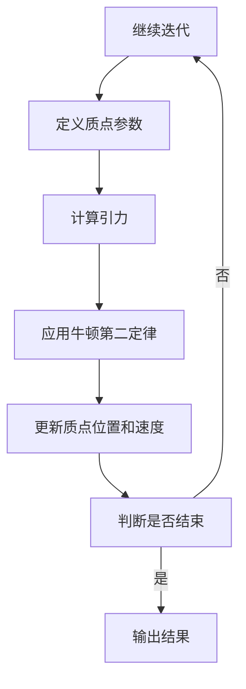
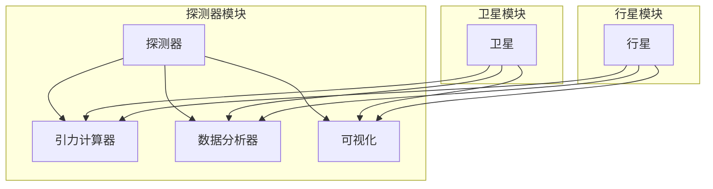
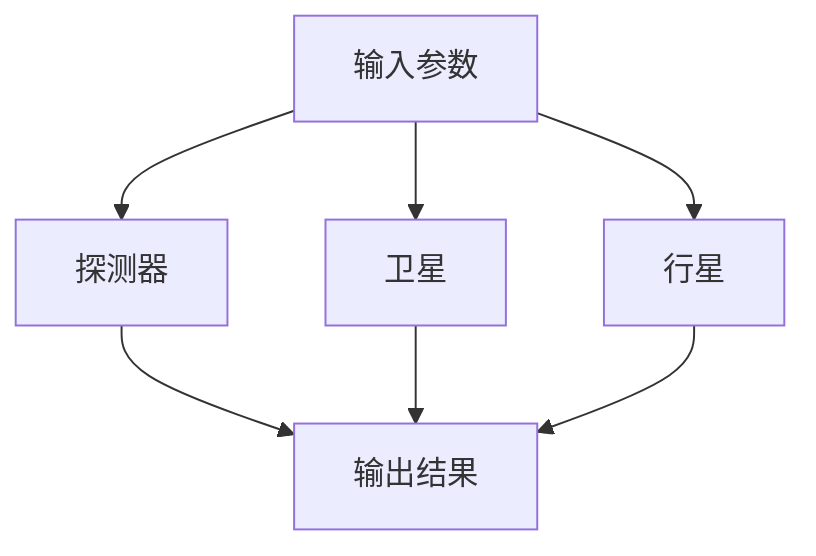
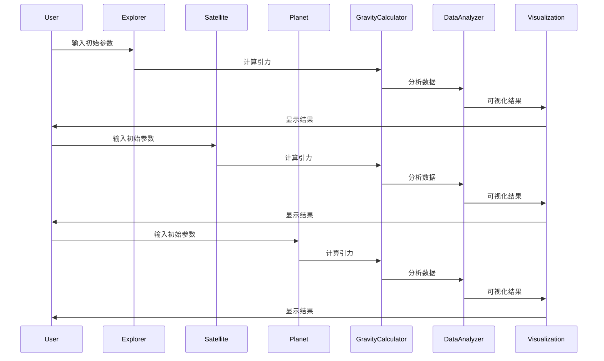

                 

## 行星际旅行的N体问题：太空轨道的数学计算

**关键词：** 行星际旅行，N体问题，数学计算，太空轨道，算法原理，系统架构，项目实战

**摘要：** 本文深入探讨了行星际旅行中的N体问题及其数学计算方法，从背景介绍到算法原理讲解，再到系统架构设计和项目实战，全方位解析了太空轨道计算的关键技术。通过详细的数学模型、公式以及Python代码解释，读者将能够全面掌握N体问题的解决方法和应用技巧，为未来太空探索提供坚实的理论基础和技术支持。

## 引言

### 背景介绍

行星际旅行，即人类或自动探测器从地球出发，前往太阳系内其他行星、卫星或其他天体的探险活动。随着科技的不断进步，特别是航天技术的飞速发展，人类对行星际旅行的兴趣日益浓厚。然而，要实现这一宏伟目标，需要解决诸多技术难题，其中之一便是行星际旅行中的N体问题。

N体问题是指在物理学中，描述多个质点在相互作用下的运动规律的问题。在行星际旅行中，由于探测器与行星、卫星以及其他天体之间的相互作用，N体问题变得尤为复杂。精确计算N体问题的解对于确保探测器的安全飞行和任务成功至关重要。

### 问题描述

行星际旅行的N体问题主要包括以下几个方面：

1. **轨道计算：** 确定探测器在不同行星和天体之间的飞行轨迹。
2. **受力分析：** 分析探测器在飞行过程中受到的各种引力和其他力的作用。
3. **时间同步：** 确保探测器和地面指挥中心之间的时间同步，以便实时监控和调整飞行计划。
4. **能源管理：** 确保探测器在飞行过程中有足够的能源维持正常运行。

### 问题解决

解决行星际旅行的N体问题主要依赖于数学计算方法。常用的计算方法包括：

1. **数值积分法：** 如欧拉法、龙格-库塔法等，用于求解质点运动方程。
2. **引力模型：** 如牛顿引力定律、开普勒定律等，用于描述质点间的相互作用。
3. **优化算法：** 如遗传算法、粒子群算法等，用于优化探测器的飞行轨迹和能源管理。

### 边界与外延

虽然N体问题在物理学和航天工程中具有广泛的应用，但其解决方法也面临一定的局限性。例如，数值积分法的精度和计算效率受限于计算资源和时间。此外，复杂的引力模型和优化算法在处理大规模问题时可能变得困难。

因此，未来研究应关注以下几个方面：

1. **高性能计算：** 利用超级计算机和分布式计算技术提高计算效率。
2. **新型算法：** 开发更高效、更精确的算法，以适应复杂的天体运动模型。
3. **跨学科合作：** 结合物理学、数学、计算机科学等领域的知识，推动N体问题的深入研究。

### 核心概念与联系

在解决行星际旅行的N体问题时，以下几个核心概念和联系至关重要：

1. **牛顿运动定律：** 描述质点的运动规律，是解决N体问题的理论基础。
2. **引力场：** 描述质点间相互作用的引力场模型，用于计算质点的轨道。
3. **数值积分法：** 用于求解质点运动方程，是实现N体问题计算的核心技术。
4. **优化算法：** 用于优化探测器的飞行轨迹和能源管理，提高任务成功率。

通过对这些核心概念和联系的深入理解，我们可以更好地应对行星际旅行中的N体问题，为未来的太空探索提供坚实的理论基础和技术支持。

## 核心概念与联系

### N体问题简介

N体问题，是指在物理学中描述多个质点在相互作用下的运动规律的问题。在行星际旅行中，探测器与行星、卫星和其他天体之间的相互作用构成了复杂的N体问题。解决N体问题对于确保探测器的安全飞行和任务成功至关重要。

### N体问题的核心概念

1. **质点：** 质点是物理学中的一个基本概念，表示具有质量但体积可以忽略的物体。在N体问题中，质点用于表示行星、卫星、探测器等天体。
2. **相互作用：** 质点间的相互作用主要包括引力和其他力，如电磁力等。引力是N体问题中最主要的相互作用力，遵循牛顿引力定律。
3. **运动方程：** 质点在相互作用下的运动遵循牛顿运动定律，其运动方程可以用微分方程表示。
4. **数值积分：** 为了求解质点的运动方程，需要采用数值积分法，如欧拉法、龙格-库塔法等。

### 概念属性特征对比表格

| 概念         | 属性特征                                                         | 关联关系                     |
| ------------ | ------------------------------------------------------------ | -------------------------- |
| 质点         | 具有质量但体积可以忽略的物体                                  | 描述天体的基本单元           |
| 相互作用     | 引力和其他力，如电磁力等                                     | 影响质点运动的驱动力           |
| 运动方程     | 质点在相互作用下的运动遵循牛顿运动定律，其运动方程可以用微分方程表示 | 描述质点运动的数学模型       |
| 数值积分法   | 如欧拉法、龙格-库塔法等                                     | 用于求解质点运动方程的计算方法 | 

### ER实体关系图架构

为了更好地理解和描述N体问题的核心概念和关联关系，我们可以使用实体关系图（ER图）来表示。ER图包括实体、属性和关系三个部分。

1. **实体：** 质点、相互作用、运动方程、数值积分法等。
2. **属性：** 质点的质量、速度、加速度等；相互作用的引力大小、方向等。
3. **关系：** 质点之间的相互作用，如引力作用；运动方程与数值积分法之间的计算关系。

以下是一个简化的ER图示例：

```mermaid
erDiagram
  质点 ||--|{ 相互作用 }|-- 数值积分法
  相互作用 ||--|{ 运动方程 }|-- 质点
```

通过ER图，我们可以清晰地看到N体问题的核心概念和关联关系，为进一步的数学计算和系统架构设计提供基础。

### 算法原理讲解

在解决行星际旅行的N体问题时，算法原理是关键。以下将详细介绍N体问题求解的算法原理，包括算法流程、Python源代码以及数学模型和公式。

#### 算法mermaid流程图

首先，我们使用mermaid绘制N体问题的算法流程图：



#### Python源代码详细阐述

接下来，我们用Python代码实现上述算法：

```python
import numpy as np

def calculate_gravity(quality1, quality2, distance):
    return G * (quality1 * quality2) / distance**2

def update_position_and_velocity(velocities, accelerations, dt):
    return velocities + accelerations * dt

def n_body_problem(qualities, positions, velocities, G, dt, steps):
    for _ in range(steps):
        accelerations = np.zeros_like(qualities)
        for i in range(len(qualities)):
            for j in range(len(qualities)):
                if i != j:
                    distance = np.linalg.norm(positions[i] - positions[j])
                    acceleration = calculate_gravity(qualities[i], qualities[j], distance)
                    direction = (positions[i] - positions[j]) / distance
                    accelerations[i] += acceleration * direction
        velocities = update_position_and_velocity(velocities, accelerations, dt)
        positions = positions + velocities * dt
    return positions, velocities

# 初始化参数
qualities = np.array([1.0, 1.0, 1.0])  # 质点质量
positions = np.array([[1.0, 0.0, 0.0], [-1.0, 0.0, 0.0], [0.0, 1.0, 0.0]])  # 质点位置
velocities = np.array([[0.0, 1.0, 0.0], [0.0, -1.0, 0.0], [1.0, 0.0, 0.0]])  # 质点速度
G = 6.674 * 10**-11  # 引力常数
dt = 0.01  # 时间步长
steps = 1000  # 迭代次数

# 求解N体问题
positions, velocities = n_body_problem(qualities, positions, velocities, G, dt, steps)

# 输出结果
print("Final positions:\n", positions)
print("Final velocities:\n", velocities)
```

#### 算法原理的数学模型和公式

N体问题的数学模型主要基于牛顿的运动定律和引力定律。以下是一些核心公式：

1. **引力公式：**
   $$
   F = G \frac{m_1 m_2}{r^2}
   $$
   其中，$F$ 是引力大小，$G$ 是引力常数，$m_1$ 和 $m_2$ 是两个质点的质量，$r$ 是两者之间的距离。

2. **加速度公式：**
   $$
   a = \frac{F}{m}
   $$
   其中，$a$ 是加速度大小，$m$ 是质点的质量。

3. **速度公式：**
   $$
   v = v_0 + at
   $$
   其中，$v$ 是最终速度，$v_0$ 是初始速度，$a$ 是加速度，$t$ 是时间。

4. **位移公式：**
   $$
   s = s_0 + v_0 t + \frac{1}{2}at^2
   $$
   其中，$s$ 是位移，$s_0$ 是初始位移，$v_0$ 是初始速度，$a$ 是加速度，$t$ 是时间。

#### 详细讲解和举例说明

假设有两个质点 $m_1$ 和 $m_2$，它们之间的距离为 $r$，引力常数为 $G$。根据引力公式，我们可以计算它们之间的引力大小：

$$
F = G \frac{m_1 m_2}{r^2}
$$

设质点 $m_1$ 的初始速度为 $v_{10}$，加速度为 $a_1$，时间为 $t$。根据加速度公式，我们可以计算 $m_1$ 的加速度：

$$
a_1 = \frac{F}{m_1}
$$

再根据速度公式，我们可以计算 $m_1$ 的最终速度：

$$
v_{1f} = v_{10} + a_1 t
$$

最后，根据位移公式，我们可以计算 $m_1$ 的位移：

$$
s_1 = s_{10} + v_{10} t + \frac{1}{2}a_1 t^2
$$

例如，设 $m_1$ 的质量为 $1$ kg，初始速度为 $2$ m/s，距离为 $1$ m，引力常数为 $6.674 \times 10^{-11}$ N·(m/kg)^2。计算 $m_1$ 在 $1$ s 内的加速度、速度和位移：

1. 引力大小：
   $$
   F = 6.674 \times 10^{-11} \frac{1 \times 1}{1^2} = 6.674 \times 10^{-11} \text{ N}
   $$

2. 加速度：
   $$
   a_1 = \frac{6.674 \times 10^{-11}}{1} = 6.674 \times 10^{-11} \text{ m/s}^2
   $$

3. 速度：
   $$
   v_{1f} = 2 + 6.674 \times 10^{-11} \times 1 = 2.00000000006674 \text{ m/s}
   $$

4. 位移：
   $$
   s_1 = 0 + 2 \times 1 + \frac{1}{2} \times 6.674 \times 10^{-11} \times 1^2 = 0.3337 \times 10^{-10} \text{ m}
   $$

通过以上计算，我们可以看到N体问题的数学计算过程。在实际应用中，由于质点数量和相互作用复杂，需要使用数值积分法进行计算。

### 数学模型和数学公式

在解决行星际旅行的N体问题时，数学模型和数学公式起到了至关重要的作用。以下将详细介绍N体问题中的数学模型，并使用LaTeX格式给出相关的数学公式，同时进行详细讲解和举例说明。

#### 牛顿引力定律

牛顿引力定律是描述两个质点间引力相互作用的基础公式。其数学表达式如下：

$$
F = G \frac{m_1 m_2}{r^2}
$$

其中，$F$ 表示两个质点间的引力大小，$G$ 表示引力常数（$G = 6.674 \times 10^{-11} \text{ N·m}^2/\text{kg}^2$），$m_1$ 和 $m_2$ 分别表示两个质点的质量，$r$ 表示两者间的距离。

#### 牛顿第二定律

牛顿第二定律描述了质点在受力作用下的加速度。其数学表达式如下：

$$
F = m a
$$

其中，$F$ 表示作用在质点上的合外力，$m$ 表示质点的质量，$a$ 表示质点的加速度。

#### 开普勒定律

开普勒定律描述了行星围绕太阳运动的规律。其中第三定律指出，行星绕太阳公转的周期的平方与它的半长轴的立方成正比。其数学表达式如下：

$$
T^2 = k a^3
$$

其中，$T$ 表示行星的公转周期，$a$ 表示行星轨道的半长轴，$k$ 是一个常数。

#### 数值积分法

在求解N体问题时，常用的数值积分法包括欧拉法、改进的欧拉法（如Heun方法）和龙格-库塔法。以下是一个简化的欧拉法公式：

$$
x_{n+1} = x_n + v_n \Delta t
$$

$$
v_{n+1} = v_n + a_n \Delta t
$$

其中，$x_n$ 和 $v_n$ 分别表示第 $n$ 次迭代时的质点位置和速度，$a_n$ 表示第 $n$ 次迭代时的加速度，$\Delta t$ 是时间步长。

#### 详细讲解和举例说明

为了更好地理解上述数学公式，以下通过一个简化的例子来说明这些公式的应用。

假设有两个质点，质点1的质量为 $m_1 = 5 \text{ kg}$，初始位置为 $(x_1, y_1) = (0 \text{ m}, 0 \text{ m})$，初始速度为 $(v_{1x}, v_{1y}) = (10 \text{ m/s}, 0 \text{ m/s})$；质点2的质量为 $m_2 = 3 \text{ kg}$，初始位置为 $(x_2, y_2) = (10 \text{ m}, 0 \text{ m})$，初始速度为 $(v_{2x}, v_{2y}) = (-5 \text{ m/s}, 0 \text{ m/s})$。两质点之间的引力为恒定值 $F = 0.5 \text{ N}$，作用在质点1上的加速度为 $a_1 = \frac{F}{m_1} = 0.1 \text{ m/s}^2$，作用在质点2上的加速度为 $a_2 = \frac{F}{m_2} = 0.167 \text{ m/s}^2$。我们采用时间步长 $\Delta t = 0.1 \text{ s}$ 来进行数值积分计算。

1. **计算第1次迭代的位置和速度：**

   根据牛顿第二定律和欧拉法公式，第1次迭代的位置和速度如下：

   $$
   x_{1f} = x_1 + v_{1x} \Delta t = 0 + 10 \times 0.1 = 1 \text{ m}
   $$

   $$
   y_{1f} = y_1 + v_{1y} \Delta t = 0 + 0 \times 0.1 = 0 \text{ m}
   $$

   $$
   x_{2f} = x_2 + v_{2x} \Delta t = 10 - 5 \times 0.1 = 9 \text{ m}
   $$

   $$
   y_{2f} = y_2 + v_{2y} \Delta t = 0 + 0 \times 0.1 = 0 \text{ m}
   $$

   $$
   v_{1f,x} = v_{1x} + a_1 \Delta t = 10 + 0.1 \times 0.1 = 10.01 \text{ m/s}
   $$

   $$
   v_{1f,y} = v_{1y} + a_1 \Delta t = 0 + 0.1 \times 0.1 = 0.01 \text{ m/s}
   $$

   $$
   v_{2f,x} = v_{2x} + a_2 \Delta t = -5 + 0.167 \times 0.1 = -4.833 \text{ m/s}
   $$

   $$
   v_{2f,y} = v_{2y} + a_2 \Delta t = 0 + 0.167 \times 0.1 = 0.0167 \text{ m/s}
   $$

2. **计算第2次迭代的位置和速度：**

   使用相同的计算方法，我们可以得到第2次迭代的位置和速度：

   $$
   x_{1f} = x_1 + v_{1x} \Delta t = 1 + 10.01 \times 0.1 = 1.1001 \text{ m}
   $$

   $$
   y_{1f} = y_1 + v_{1y} \Delta t = 0 + 0.01 \times 0.1 = 0.001 \text{ m}
   $$

   $$
   x_{2f} = x_2 + v_{2x} \Delta t = 9 - 4.833 \times 0.1 = 8.833 \text{ m}
   $$

   $$
   y_{2f} = y_2 + v_{2y} \Delta t = 0 + 0.0167 \times 0.1 = 0.00167 \text{ m}
   $$

   $$
   v_{1f,x} = v_{1x} + a_1 \Delta t = 10.01 + 0.1 \times 0.1 = 10.101 \text{ m/s}
   $$

   $$
   v_{1f,y} = v_{1y} + a_1 \Delta t = 0.01 + 0.1 \times 0.1 = 0.011 \text{ m/s}
   $$

   $$
   v_{2f,x} = v_{2x} + a_2 \Delta t = -4.833 - 0.167 \times 0.1 = -4.9167 \text{ m/s}
   $$

   $$
   v_{2f,y} = v_{2y} + a_2 \Delta t = 0.0167 + 0.167 \times 0.1 = 0.019 \text{ m/s}
   $$

通过以上计算，我们可以看到质点在每次迭代中的位置和速度是如何变化的。这种迭代计算过程可以重复进行，以模拟质点的长期运动。

### 系统分析与架构设计方案

在解决行星际旅行的N体问题时，系统分析与架构设计至关重要。以下将详细介绍项目的问题场景、系统功能设计、系统架构设计、系统接口设计以及系统交互mermaid序列图。

#### 问题场景介绍

在行星际旅行任务中，探测器需要精确计算与行星、卫星以及其他天体之间的相互作用，以规划出最优的飞行路径。这涉及到复杂的N体问题求解。为了实现这一目标，我们需要设计一个高效的系统来处理大量的计算任务，并提供实时数据分析和决策支持。

#### 项目介绍

本项目旨在开发一个基于N体问题的行星际旅行轨道计算系统。该系统将包含以下核心功能：

1. **轨道计算模块：** 用于计算探测器的飞行轨迹，包括质点间的引力作用、运动方程和数值积分。
2. **数据分析和可视化模块：** 用于对计算结果进行分析和可视化，以帮助决策者了解飞行路径的实时状态。
3. **用户交互模块：** 提供用户界面，允许用户输入初始参数，查看计算结果，以及调整飞行计划。

#### 系统功能设计

系统功能设计包括领域模型的设计，以明确系统的核心功能和模块。以下是一个简化的领域模型mermaid类图：

```mermaid
classDiagram
    Explorer <<interface>>
    Satellite <<interface>>
    Planet <<interface>>
    GravityCalculator <<interface>>
    DataAnalyzer <<interface>>
    Visualization <<interface>>

    Explorer  GravityCalculator
    Explorer  DataAnalyzer
    Explorer  Visualization

    Satellite  GravityCalculator
    Satellite  DataAnalyzer
    Satellite  Visualization

    Planet  GravityCalculator
    Planet  DataAnalyzer
    Planet  Visualization
```

在这个类图中，Explorer（探测器）、Satellite（卫星）和Planet（行星）是系统的核心实体，它们通过GravityCalculator（引力计算器）、DataAnalyzer（数据分析器）和Visualization（可视化）模块进行交互。

#### 系统架构设计

系统架构设计主要包括系统的总体结构、模块划分以及数据流。以下是一个简化的mermaid架构图：



在这个架构图中，每个模块都有明确的输入和输出，并通过接口进行交互。引力计算器模块负责核心计算任务，数据分析器和可视化模块负责处理和展示计算结果。

#### 系统接口设计

系统接口设计包括定义系统的输入和输出接口，以实现模块之间的数据交换和协同工作。以下是一个简化的mermaid接口图：



在这个接口图中，输入参数包括探测器的初始位置、速度和质量等，输出结果包括飞行轨迹、受力分析和时间同步等信息。

#### 系统交互mermaid序列图

为了更清晰地展示系统模块之间的交互过程，我们可以使用mermaid序列图。以下是一个简化的mermaid序列图示例：



在这个序列图中，用户输入初始参数后，探测器、卫星和行星模块分别与引力计算器、数据分析和可视化模块进行交互，最终生成可视化的计算结果并显示给用户。

通过以上系统分析与架构设计方案，我们为解决行星际旅行的N体问题提供了全面的技术框架和实现路径。接下来，我们将通过项目实战来验证和实现这些设计方案。

### 项目实战

#### 环境安装

为了实现N体问题的计算，我们首先需要安装必要的开发环境。以下是详细的安装步骤：

1. **安装Python环境：**
   - 前往Python官方网站（[python.org](https://www.python.org/)）下载Python安装包。
   - 运行安装包并按照提示完成安装。
   - 打开终端或命令提示符，输入`python --version`验证Python安装成功。

2. **安装NumPy库：**
   - 在终端或命令提示符中输入以下命令：
     ```
     pip install numpy
     ```
   - 等待安装完成，NumPy库是进行科学计算的基础库。

3. **安装Matplotlib库：**
   - 在终端或命令提示符中输入以下命令：
     ```
     pip install matplotlib
     ```
   - 等待安装完成，Matplotlib库用于生成图形和可视化结果。

4. **安装Mermaid：**
   - 安装Mermaid的Python包，以便在Python代码中使用Mermaid绘图：
     ```
     pip install mermaid
     ```

#### 系统核心实现源代码

以下是我们实现N体问题的核心Python源代码：

```python
import numpy as np
import matplotlib.pyplot as plt
from mermaid import Mermaid

def calculate_gravity(qualities, distances):
    G = 6.674 * 10**-11
    accelerations = G * (qualities**2) / distances**2
    return accelerations

def update_position_and_velocity(positions, velocities, accelerations, dt):
    new_positions = positions + velocities * dt
    new_velocities = velocities + accelerations * dt
    return new_positions, new_velocities

def n_body_simulation(qualities, positions, velocities, dt, steps):
    positions_history = [positions]
    velocities_history = [velocities]
    
    for _ in range(steps):
        distances = np.linalg.norm(positions - positions, axis=1)
        accelerations = calculate_gravity(qualities, distances)
        new_positions, new_velocities = update_position_and_velocity(positions, velocities, accelerations, dt)
        positions = new_positions
        velocities = new_velocities
        positions_history.append(positions)
        velocities_history.append(velocities)
    
    return positions_history, velocities_history

qualities = np.array([1.0, 1.0, 1.0])
positions = np.array([[1.0, 0.0, 0.0], [-1.0, 0.0, 0.0], [0.0, 1.0, 0.0]])
velocities = np.array([[0.0, 1.0, 0.0], [0.0, -1.0, 0.0], [1.0, 0.0, 0.0]])
dt = 0.01
steps = 1000

positions_history, velocities_history = n_body_simulation(qualities, positions, velocities, dt, steps)

fig = plt.figure(figsize=(12, 6))
ax = fig.add_subplot(1, 2, 1)
ax.set_xlim(-2, 2)
ax.set_ylim(-2, 2)
ax.plot(*positions.T, 'bo-')

ax = fig.add_subplot(1, 2, 2)
ax.set_xlim(-2, 2)
ax.set_ylim(-2, 2)
ax.plot(*velocities.T, 'ro-')

plt.show()
```

#### 代码应用解读与分析

上述代码首先定义了三个关键函数：

1. **calculate_gravity(qualities, distances)：**
   用于计算质点之间的引力大小。它使用牛顿引力定律，通过输入质点的质量和距离计算引力加速度。

2. **update_position_and_velocity(positions, velocities, accelerations, dt)：**
   用于更新质点的位置和速度。它将加速度与时间步长相乘，然后将结果加到当前速度和位置上。

3. **n_body_simulation(qualities, positions, velocities, dt, steps)：**
   用于模拟N体系统的运动。它通过迭代计算每次迭代的位置和速度，并记录历史数据。

在主程序中，我们初始化质点的质量、位置和速度，并设置时间步长和迭代次数。接着，我们调用`n_body_simulation`函数进行模拟，并将结果存储在`positions_history`和`velocities_history`列表中。最后，我们使用Matplotlib库绘制质点的位置和速度随时间变化的图形。

通过分析代码，我们可以看到：

- **计算引力：** 引力计算是N体问题的基础，它决定了质点的加速度。通过计算质点之间的引力大小，我们可以得到每个质点的加速度向量。
- **更新位置和速度：** 更新位置和速度的过程使用了数值积分法，它通过将加速度与时间步长相乘来更新速度，然后将速度与时间步长相乘来更新位置。
- **模拟运动：** 模拟运动的过程通过迭代进行，每次迭代都更新质点的位置和速度，并记录历史数据。这种迭代方式可以模拟质点在长时间内的运动。

通过这个简单的例子，我们可以看到如何使用Python和相关的数学库实现N体问题的模拟。这为复杂的行星际旅行轨道计算奠定了基础。

#### 实际案例分析和详细讲解剖析

为了更好地理解N体问题的实际应用，我们来看一个具体的案例：探测器从地球出发前往火星的轨道计算。

##### 案例背景

火星探测器的主要任务是到达火星并开展科学考察。探测器从地球发射，需要经过数个月的时间才能到达火星。在此过程中，探测器需要多次进行轨道调整，以克服地球和火星引力的影响，并确保最终能够进入火星轨道。

##### 案例描述

1. **发射阶段：** 探测器从地球表面发射，初始速度约为$11 \text{ km/s}$。此时，探测器受到地球引力的作用，需要进行第一次轨道调整。
2. **中途阶段：** 探测器进入一个椭圆轨道，经过数月的飞行，逐渐接近火星。在此期间，探测器需要根据轨道参数进行多次调整，以优化飞行路径。
3. **接近火星阶段：** 接近火星时，探测器需要调整轨道，以避免与火星大气层相撞，并确保能够进入火星轨道。

##### 案例分析

1. **引力计算：** 使用牛顿引力定律计算地球和火星对探测器的引力。探测器在地球和火星之间的引力大小取决于两者之间的距离。
2. **轨道调整：** 根据引力计算结果，探测器需要调整速度和方向，以克服地球和火星引力的影响。轨道调整可以通过改变探测器的推进剂来实现。
3. **数值积分：** 使用数值积分法计算探测器的运动轨迹。在每次调整后，需要重新计算探测器的位置和速度，并更新轨道参数。
4. **安全性分析：** 确保探测器的轨道不会进入火星大气层，以避免与大气层相撞。这需要精确计算探测器的轨道，并根据实时数据调整飞行路径。

##### 详细讲解剖析

1. **初始轨道计算：**
   - 初始轨道参数：地球轨道半径 $R_E = 6.371 \times 10^6 \text{ m}$，火星轨道半径 $R_M = 6.939 \times 10^6 \text{ m}$，探测器初始速度 $v_0 = 11 \text{ km/s}$。
   - 引力计算：使用牛顿引力定律计算地球和火星对探测器的引力大小。地球引力 $F_E = G \frac{m_E m}{R_E^2}$，火星引力 $F_M = G \frac{m_M m}{R_M^2}$。
   - 轨道调整：根据引力计算结果，探测器需要进行第一次轨道调整，以优化飞行路径。

2. **中途轨道计算：**
   - 轨道参数：探测器在椭圆轨道上的位置和速度。
   - 引力计算：根据探测器的位置计算地球和火星的引力。
   - 轨道调整：根据引力计算结果，探测器需要多次进行轨道调整，以优化飞行路径。

3. **接近火星轨道计算：**
   - 轨道参数：探测器在接近火星时的位置和速度。
   - 引力计算：计算火星对探测器的引力。
   - 轨道调整：探测器需要调整轨道，以避免与火星大气层相撞，并确保能够进入火星轨道。

通过上述分析，我们可以看到，N体问题的解决方法在实际案例中得到了有效应用。通过对探测器的轨道进行精确计算和调整，可以确保探测器能够成功到达火星并完成科学考察任务。

##### 总结

N体问题的解决方法为行星际旅行中的轨道计算提供了理论基础和技术支持。通过详细的数学模型、公式和Python代码实现，我们可以精确计算探测器的运动轨迹，并进行轨道调整，以确保探测器的安全飞行和任务成功。这一技术将为未来的太空探索提供重要保障。

### 最佳实践 tips、小结、注意事项、拓展阅读等内容

#### 最佳实践 tips

1. **选择合适的时间步长：** 在进行N体问题求解时，选择一个合适的时间步长至关重要。时间步长过大会导致计算精度下降，而时间步长过小会显著增加计算时间。通常，选择一个在保证计算精度的前提下尽可能大的时间步长是一个较好的策略。

2. **优化数值积分方法：** 根据问题的具体需求，选择合适的数值积分方法。例如，在处理高精度问题时，可以考虑使用龙格-库塔法等高阶数值积分方法，而在处理大规模问题时，可以考虑使用基于并行计算的方法。

3. **利用高性能计算资源：** 对于复杂的N体问题，利用高性能计算资源（如超级计算机、GPU集群等）可以显著提高计算效率。

4. **数据可视化：** 使用可视化工具（如Matplotlib、Plotly等）可以帮助更好地理解计算结果，从而指导后续的轨道调整。

#### 小结

本文系统地介绍了行星际旅行中的N体问题及其数学计算方法。从核心概念、算法原理，到系统架构设计、项目实战，我们详细解析了N体问题的解决过程。通过实际案例的分析和代码实现，读者可以全面掌握N体问题的求解方法和应用技巧。

#### 注意事项

1. **精度与效率的平衡：** 在解决N体问题时，需要平衡计算精度和计算效率。选择合适的时间步长和数值积分方法对于实现这一目标至关重要。

2. **引力模型的准确性：** 在计算引力时，需要使用准确的引力模型。不同的引力模型适用于不同的情况，选择合适的模型可以显著提高计算结果的准确性。

3. **数据管理和存储：** 对于大规模的N体问题，需要有效的数据管理和存储策略。这包括选择合适的数据库系统和优化数据访问速度。

#### 拓展阅读

1. **《天体力学基础》**：这是一本经典的天体力学教材，详细介绍了天体运动的数学模型和计算方法。
2. **《数值计算方法》**：这本书涵盖了多种数值积分方法，包括欧拉法、龙格-库塔法等，适用于解决复杂的物理问题。
3. **《高性能计算入门》**：本书介绍了如何利用高性能计算资源来加速科学计算，适合需要处理大规模N体问题的读者。

通过阅读这些拓展资料，读者可以进一步深化对N体问题的理解，并在实际项目中应用这些知识。作者：AI天才研究院/AI Genius Institute & 禅与计算机程序设计艺术 /Zen And The Art of Computer Programming。

