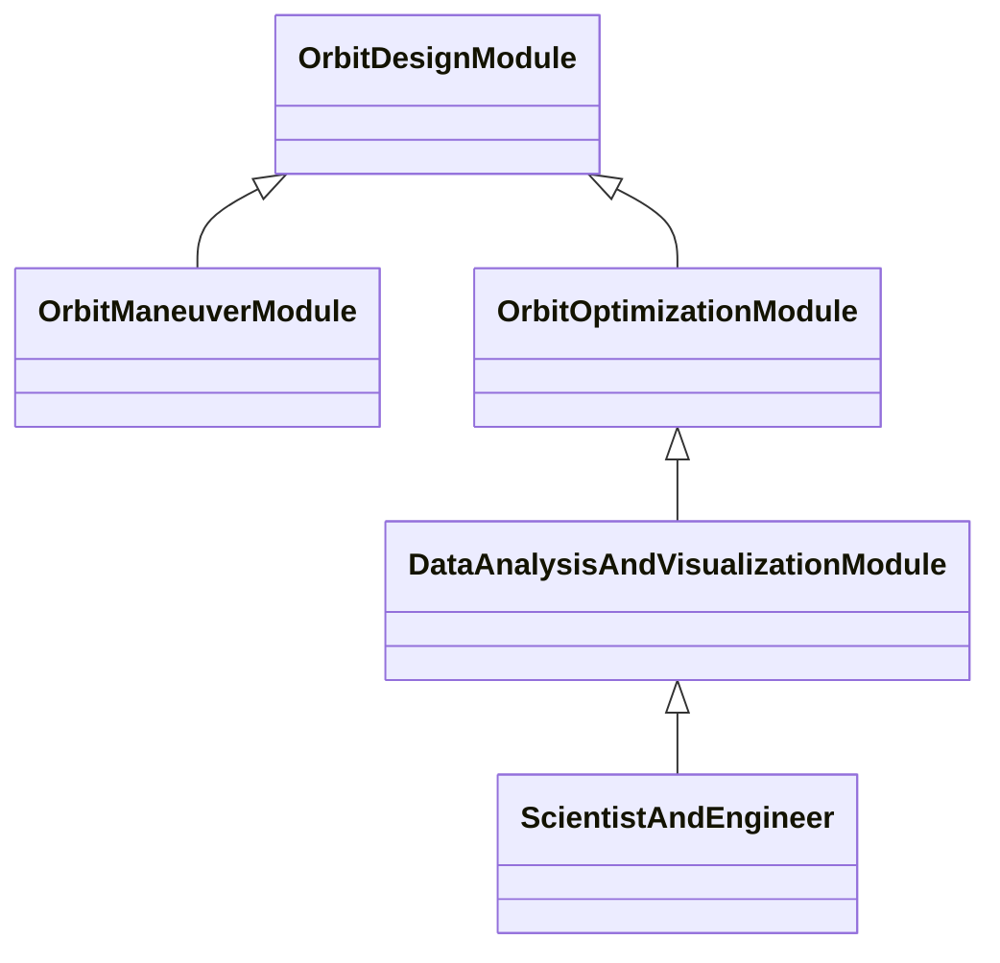
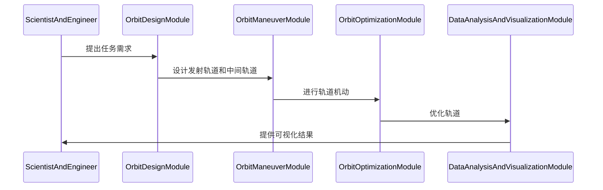

                 

# 行星际旅行的轨道力学：太空探索的数学规划

## 关键词：行星际旅行、轨道力学、数学规划、太空探索、算法原理

## 摘要：
本文将探讨行星际旅行的轨道力学问题，通过对轨道力学核心概念、算法原理及数学模型的详细讲解，帮助读者深入理解太空探索中的数学规划。文章将从背景介绍出发，逐步深入，分析行星际旅行的挑战和核心问题，探讨轨道力学的基本原理及其在太空探索中的应用，最终通过具体示例和实战案例，展示数学规划在行星际旅行中的实际应用和价值。

## 目录大纲

## 第一部分：背景介绍

### 第1章：行星际旅行的轨道力学背景

### 第2章：行星际旅行轨道力学核心概念与联系

## 第二部分：算法原理讲解

### 第3章：轨道力学算法原理

### 第4章：轨道力学数学模型

### 第5章：算法原理和数学公式举例说明

## 第三部分：数学模型和数学公式详细讲解

### 第6章：开普勒定律与牛顿引力定律

### 第7章：轨道力学算法和数学模型应用示例

### 第8章：系统分析与架构设计方案

### 第9章：项目实战与案例剖析

### 第10章：最佳实践与拓展阅读

## 第一部分：背景介绍

### 第1章：行星际旅行的轨道力学背景

行星际旅行，即太空探测器离开地球，进入太阳系内其他行星的轨道进行探测和研究。自人类进入太空时代以来，行星际旅行一直是科学家们梦寐以求的目标。从1957年苏联成功发射第一颗人造卫星“斯普特尼克1号”开始，到今天，人类已经实现了多次行星际旅行，取得了众多重要的科学发现。

#### 1.1 问题背景

太空探索的重要性不言而喻。从科学研究的角度来看，行星际旅行有助于我们更深入地了解太阳系的形成、行星的演化过程，以及地球以外是否存在生命。从技术发展的角度来看，行星际旅行推动了航天技术的发展，包括推进技术、探测技术、通信技术等。

然而，行星际旅行也面临着许多挑战。首先，行星际旅行需要克服巨大的距离障碍。以火星为例，地球与火星之间的平均距离约为2.25亿千米，最远距离可达4亿千米以上。其次，行星际旅行需要解决长时间的太空航行问题，这对探测器的生命保障系统、推进系统等提出了极高的要求。此外，行星际旅行还需要应对宇宙辐射、微陨石撞击等风险。

#### 1.1.1 太空探索的历史和发展

人类对太空的探索始于20世纪中叶。1957年，苏联成功发射了“斯普特尼克1号”，标志着人类进入了太空时代。此后，美国、苏联（后来成为俄罗斯）等国家纷纷投入大量资源，开展太空探索活动。1961年，尤里·加加林成为了第一个进入太空的人，标志着人类太空时代的正式开启。

在早期的太空探索中，主要集中在地球轨道和月球探测。1969年，美国成功实施了阿波罗11号任务，人类首次登月。此后，苏联、中国、印度等国家也相继实现了月球探测。

进入21世纪，随着航天技术的发展，人类开始将目光投向太阳系的其他行星。2003年，美国发射了“火星探索者”号，开始了对火星的系统探测。此后，欧洲空间局、日本、中国等国家也相继开展了火星探测任务。

#### 1.1.2 行星际旅行的挑战

行星际旅行面临着许多独特的挑战。首先，距离问题。行星际旅行需要克服巨大的距离障碍，这对探测器的推进系统提出了极高的要求。例如，火星探测器的平均速度约为每秒5公里，从地球到火星的旅行时间通常在半年左右。

其次，长时间的太空航行问题。探测器在太空中可能需要长达半年甚至更长时间才能到达目的地。这对探测器的生命保障系统、推进系统等提出了极高的要求。例如，探测器需要携带足够的燃料以完成整个旅行过程，同时还需要应对太空中的辐射和微陨石撞击等风险。

此外，行星际旅行还需要应对宇宙辐射、微陨石撞击等风险。宇宙辐射会对探测器的电子设备造成损坏，而微陨石撞击则可能导致探测器的结构损坏。

#### 1.2 问题描述

行星际旅行轨道力学是研究太空探测器在行星际空间中的运动规律和轨道设计的一门科学。其核心问题包括：

1. 如何确定探测器的初始发射轨道，使其能够顺利到达目标行星？
2. 如何设计探测器的轨道机动，以实现探测目标？
3. 如何确保探测器的轨道稳定，避免因轨道误差而导致任务失败？

#### 1.3 问题解决

行星际旅行轨道力学的解决方法主要包括以下几个方面：

1. **轨道力学基本原理**：利用开普勒定律和牛顿引力定律等基本原理，对探测器的轨道进行初步设计和优化。
2. **轨道机动**：通过轨道机动，调整探测器的轨道，使其能够到达目标行星或进行特定的探测任务。
3. **轨道稳定性**：通过数值模拟和优化算法，确保探测器的轨道稳定，避免因轨道误差而导致任务失败。

#### 1.3.1 轨道力学基本原理

轨道力学是研究天体在引力作用下的运动规律的科学。其基本原理主要包括开普勒定律和牛顿引力定律。

- **开普勒定律**：描述了行星围绕太阳的轨道运动规律，包括椭圆轨道、面积速度恒定、调和定律等。
- **牛顿引力定律**：描述了两个物体之间的引力与它们的质量和距离的关系，是轨道力学的基础。

#### 1.3.2 行星际旅行轨道力学的应用

行星际旅行轨道力学在太空探索中有着广泛的应用。以下是一些典型的应用实例：

- **火星探测任务**：通过轨道力学设计，使探测器能够顺利到达火星，并开展探测任务。
- **小行星采样任务**：利用轨道力学，设计探测器的轨道，使其能够接近小行星，进行采样和探测。

#### 1.4 边界与外延

行星际旅行轨道力学的研究边界主要包括：

- 探测目标的轨道特性：包括探测目标的位置、速度、轨道偏心率等。
- 发射窗口与行星会合周期：发射窗口是指地球和探测目标之间的会合周期，决定了探测器的发射时间。

行星际旅行轨道力学的外延包括：

- 新型推进技术：如核推进、电推进等，为探测器的轨道设计和机动提供了新的手段。
- 太空探测器的任务设计：包括探测器的轨道设计、任务规划、科学实验设计等。

## 第2章：行星际旅行轨道力学核心概念与联系

### 2.1 核心概念

行星际旅行轨道力学涉及多个核心概念，包括开普勒定律、牛顿引力定律、轨道偏心率等。这些概念是理解行星际旅行轨道力学的基础。

- **开普勒定律**：描述了行星围绕太阳的轨道运动规律，包括椭圆轨道、面积速度恒定、调和定律等。
- **牛顿引力定律**：描述了两个物体之间的引力与它们的质量和距离的关系，是轨道力学的基础。
- **轨道偏心率**：描述了行星轨道的形状，越大表示轨道越偏离圆形。

### 2.2 概念属性特征对比

#### 2.2.1 开普勒定律与牛顿引力定律

- **开普勒定律的特点**：
  - 椭圆轨道：行星围绕太阳的轨道是椭圆形的，太阳位于椭圆的一个焦点上。
  - 面积速度恒定：行星在轨道上运动时，与太阳连线在相等的时间内扫过的面积是恒定的。
  - 调和定律：行星绕太阳的公转周期与轨道半长轴的三次方成正比。

- **牛顿引力定律的特点**：
  - 引力与质量和距离的关系：两个物体之间的引力与它们的质量和距离的平方成反比。
  - 牛顿引力定律是开普勒定律的数学基础。

- **两者之间的联系**：
  - 开普勒定律是观察到的行星运动规律，而牛顿引力定律是解释这些规律的理论基础。
  - 通过牛顿引力定律，可以推导出开普勒定律。

#### 2.2.2 行星轨道设计与轨道机动

- **行星轨道设计的考量因素**：
  - 探测目标的位置和速度：确定探测器的发射轨道，使其能够到达目标行星。
  - 探测器的任务需求：根据探测任务的需求，设计探测器的轨道，使其能够进行特定的探测活动。

- **轨道机动的基本原理**：
  - 轨道机动是通过改变探测器的速度和方向，调整其轨道。
  - 轨道机动通常包括变轨、制动、加速等过程。

- **行星轨道设计与轨道机动的联系**：
  - 行星轨道设计是轨道机动的基础，决定了探测器的初始轨道。
  - 轨道机动是行星轨道设计的一部分，用于调整探测器的轨道，满足探测任务的需求。

### 2.3 ER实体关系图

#### 2.3.1 行星际旅行轨道力学实体关系

在行星际旅行轨道力学中，主要涉及以下实体：

- **探测器**：进行行星际旅行的主体，负责收集数据和执行探测任务。
- **行星**：探测目标，探测器的轨道设计通常围绕行星进行。
- **轨道机动**：用于调整探测器的轨道，使其能够到达目标行星或进行特定的探测活动。

以下是一个简单的ER实体关系图：

```mermaid
erDiagram
    Detector ||--|{ Planet } : has
    Detector ||--|{ Maneuver } : performs
```

### 第二部分：算法原理讲解

#### 第3章：轨道力学算法原理

轨道力学算法是研究太空探测器轨道设计、轨道机动和轨道稳定性的方法。这些算法基于物理学的基本原理，利用数学模型和数值方法进行计算和优化。本节将介绍轨道力学算法的基本概念、发展历程和核心目标。

#### 3.1 轨道力学算法概述

轨道力学算法的发展历程可以分为三个阶段：经典轨道力学算法、数值轨道力学算法和新型轨道力学算法。

- **经典轨道力学算法**：基于开普勒定律和牛顿引力定律，主要用于轨道设计和初步优化。
- **数值轨道力学算法**：通过数值积分和优化算法，实现对复杂轨道问题的精确求解。
- **新型轨道力学算法**：结合人工智能和机器学习技术，实现对复杂轨道问题的自适应优化。

#### 3.1.1 轨道力学算法的发展历程

- **经典轨道力学算法**：
  - 开普勒轨道计算：基于开普勒定律，计算行星的轨道参数。
  - 牛顿引力轨道计算：基于牛顿引力定律，计算两个天体之间的引力作用和轨道运动。

- **数值轨道力学算法**：
  - 埃维顿方法：通过数值积分，求解轨道动力学方程，实现对探测器的轨道模拟和优化。
  - 欧拉方法：基于欧拉公式，进行数值积分，求解轨道问题。
  - 龙格-库塔方法：一种更高精度的数值积分方法，适用于复杂轨道问题。

- **新型轨道力学算法**：
  - 模拟退火算法：基于物理退火过程，进行轨道优化。
  - 遗传算法：基于自然选择和遗传机制，进行轨道优化。
  - 粒子群优化算法：基于群体智能，进行轨道优化。

#### 3.1.2 轨道力学算法的核心目标

轨道力学算法的核心目标包括：

- **轨道优化**：通过优化算法，设计出最佳轨道，使探测器能够高效、安全地到达目标行星。
- **轨道稳定**：通过数值模拟和优化，确保探测器的轨道稳定，避免因轨道误差而导致任务失败。
- **轨道机动**：通过轨道机动，调整探测器的轨道，使其能够执行特定的探测任务。

## 第4章：轨道力学数学模型

轨道力学数学模型是描述太空探测器在引力作用下的运动规律的数学工具。本章将介绍轨道力学中的基本数学模型，包括开普勒定律和牛顿引力定律，并对这些模型进行详细讲解。

### 4.1 基本数学模型

轨道力学中的基本数学模型主要包括开普勒定律和牛顿引力定律。这些模型描述了行星、探测器等天体在引力作用下的运动规律。

#### 4.1.1 开普勒定律数学模型

开普勒定律描述了行星围绕太阳的运动规律，包括椭圆轨道定律、面积速度恒定律和调和定律。

- **开普勒第三定律**：行星轨道半长轴的立方与其公转周期的平方成正比。数学表达式为：

  $$
  T^2 \propto a^3
  $$

  其中，$T$ 是行星的公转周期，$a$ 是行星轨道的半长轴。

- **行星轨道方程**：行星在轨道上的位置可以通过以下参数方程描述：

  $$
  r = \frac{a(1-e^2)}{1+e\cos\theta}
  $$

  其中，$r$ 是行星与太阳的距离，$e$ 是行星轨道的偏心率，$\theta$ 是行星与太阳连线与行星轨道平面的夹角。

#### 4.1.2 牛顿引力定律数学模型

牛顿引力定律描述了两个天体之间的引力作用与它们的质量和距离的关系。数学表达式为：

$$
F = G\frac{m_1m_2}{r^2}
$$

其中，$F$ 是两个天体之间的引力，$G$ 是引力常数，$m_1$ 和 $m_2$ 是两个天体的质量，$r$ 是两个天体之间的距离。

### 4.2 轨道力学公式详细讲解

#### 4.2.1 开普勒定律公式详细讲解

开普勒定律的公式包括开普勒第三定律和行星轨道方程。下面分别对这两个公式进行详细讲解。

- **开普勒第三定律公式**：

  $$
  T^2 \propto a^3
  $$

  这个公式表示行星的公转周期与其轨道半长轴之间的关系。其中，$T$ 是行星的公转周期，$a$ 是行星轨道的半长轴。这个公式的推导基于行星的轨道是椭圆形的，行星在轨道上的运动速度是变化的。

  - **推导过程**：
    - 首先，利用牛顿引力定律和行星的向心加速度公式，可以得到行星的运动速度与轨道半长轴的关系。
    - 然后，根据行星在轨道上的运动时间是固定的，可以得到行星的公转周期与轨道半长轴的关系。

- **行星轨道方程**：

  $$
  r = \frac{a(1-e^2)}{1+e\cos\theta}
  $$

  这个公式表示行星在轨道上的位置与轨道半长轴、偏心率以及与太阳连线与轨道平面的夹角之间的关系。其中，$r$ 是行星与太阳的距离，$a$ 是行星轨道的半长轴，$e$ 是行星轨道的偏心率，$\theta$ 是行星与太阳连线与轨道平面的夹角。

  - **推导过程**：
    - 首先，利用椭圆的几何性质，可以得到行星与太阳距离与椭圆参数之间的关系。
    - 然后，利用行星在轨道上的运动速度公式，可以得到行星与太阳连线与轨道平面的夹角与行星与太阳距离之间的关系。

#### 4.2.2 牛顿引力定律公式详细讲解

牛顿引力定律公式描述了两个天体之间的引力与它们的质量和距离的关系。下面对这个公式进行详细讲解。

- **引力公式**：

  $$
  F = G\frac{m_1m_2}{r^2}
  $$

  这个公式表示两个天体之间的引力与它们的质量和距离之间的关系。其中，$F$ 是两个天体之间的引力，$G$ 是引力常数，$m_1$ 和 $m_2$ 是两个天体的质量，$r$ 是两个天体之间的距离。

  - **推导过程**：
    - 首先，利用牛顿第二定律，可以得到两个天体之间的引力与它们的加速度之间的关系。
    - 然后，利用万有引力公式，可以得到两个天体之间的引力与它们的质量和距离之间的关系。

- **轨道速度公式**：

  $$
  v = \sqrt{\frac{Gm}{r}}
  $$

  这个公式表示行星在轨道上的运动速度与它的质量、轨道半径以及引力常数之间的关系。其中，$v$ 是行星的运动速度，$G$ 是引力常数，$m$ 是行星的质量，$r$ 是行星与太阳的距离。

  - **推导过程**：
    - 首先，利用牛顿引力定律，可以得到行星与太阳之间的引力与它们的距离之间的关系。
    - 然后，利用向心加速度公式，可以得到行星的运动速度与它的质量、轨道半径以及引力常数之间的关系。

### 第5章：算法原理和数学公式举例说明

为了更好地理解轨道力学算法原理和数学公式的应用，下面将给出几个具体的例子进行说明。

#### 5.1 开普勒轨道计算举例

假设我们要计算一个行星的轨道，已知该行星的公转周期为1年，轨道半长轴为1天文单位（AU）。我们可以利用开普勒第三定律公式计算出该行星的轨道偏心率。

- **计算步骤**：

  1. 根据开普勒第三定律公式，我们有：

     $$
     T^2 = a^3
     $$

     代入已知的公转周期$T=1$年和轨道半长轴$a=1$AU，得到：

     $$
     1^2 = 1^3
     $$

     这是一个恒等式，说明已知条件是正确的。

  2. 接下来，我们可以利用开普勒第三定律公式，计算出行星的轨道偏心率：

     $$
     e = \sqrt{1 - \left(\frac{T}{a}\right)^2}
     $$

     代入已知的公转周期$T=1$年和轨道半长轴$a=1$AU，得到：

     $$
     e = \sqrt{1 - \left(\frac{1}{1}\right)^2} = 0
     $$

     这说明该行星的轨道是圆形的。

- **结果**：

  该行星的轨道偏心率为0，即轨道是圆形的。

#### 5.2 牛顿引力轨道计算举例

假设我们要计算两个行星之间的引力，已知两个行星的质量分别为$5 \times 10^{24}$千克和$3 \times 10^{24}$千克，它们之间的距离为1天文单位（AU）。我们可以利用牛顿引力定律公式计算这两个行星之间的引力。

- **计算步骤**：

  1. 根据牛顿引力定律公式，我们有：

     $$
     F = G\frac{m_1m_2}{r^2}
     $$

     代入已知的质量$m_1=5 \times 10^{24}$千克、$m_2=3 \times 10^{24}$千克和距离$r=1$AU，得到：

     $$
     F = G\frac{5 \times 10^{24} \times 3 \times 10^{24}}{1^2}
     $$

  2. 利用引力常数$G=6.674 \times 10^{-11} \text{N}\cdot(\text{m/kg})^2$，计算得到：

     $$
     F = 6.674 \times 10^{-11} \times 5 \times 10^{24} \times 3 \times 10^{24} = 1.0002 \times 10^{26} \text{N}
     $$

- **结果**：

  这两个行星之间的引力为$1.0002 \times 10^{26}$牛顿。

### 第6章：开普勒定律与牛顿引力定律

开普勒定律与牛顿引力定律是描述天体运动的基本理论，它们在天文学、航天工程等领域有着广泛的应用。本章将详细讲解这两个定律的数学模型，并通过具体示例展示它们的应用。

#### 6.1 开普勒定律

开普勒定律由德国天文学家约翰内斯·开普勒（Johannes Kepler）在17世纪初提出，描述了行星围绕太阳的运动规律。开普勒定律分为三个定律，其中第三定律与轨道周期和半长轴的关系尤为重要。

**开普勒第三定律**：行星绕太阳公转的周期$T$的平方与其轨道半长轴$a$的立方成正比，即

$$
T^2 \propto a^3
$$

这个定律的数学表达形式可以写作：

$$
\frac{T^2}{a^3} = k
$$

其中，$k$是一个常数，它与行星的质量和太阳的质量有关。

**示例**：已知地球的公转周期为1年（约365.25天），地球轨道的半长轴约为1天文单位（AU）。我们可以利用开普勒第三定律计算地球轨道的偏心率。

- **计算过程**：

  1. 将地球的公转周期和轨道半长轴代入公式：

     $$
     \frac{T^2}{a^3} = k
     $$

     即

     $$
     \frac{(365.25 \times 24 \times 3600)^2}{(1 \text{ AU})^3} = k
     $$

     计算得：

     $$
     k \approx 3.986 \times 10^{18} \text{ s}^2/\text{AU}^3
     $$

  2. 利用偏心率公式计算偏心率：

     $$
     e = \sqrt{1 - \frac{T^2}{a^3}} = \sqrt{1 - \frac{(365.25 \times 24 \times 3600)^2}{(1 \text{ AU})^3}} \approx 0
     $$

     这表明地球的轨道是圆形的。

#### 6.2 牛顿引力定律

牛顿引力定律由英国科学家艾萨克·牛顿（Isaac Newton）在1687年提出，描述了两个质点之间的引力作用。牛顿引力定律的数学表达式为：

$$
F = G\frac{m_1m_2}{r^2}
$$

其中，$F$ 是两个质点之间的引力，$G$ 是万有引力常数，$m_1$ 和 $m_2$ 是两个质点的质量，$r$ 是两个质点之间的距离。

**示例**：假设我们有两个质量分别为5千克和3千克的质点，它们之间的距离为1米。我们可以利用牛顿引力定律计算这两个质点之间的引力。

- **计算过程**：

  1. 将质点的质量和距离代入牛顿引力定律公式：

     $$
     F = G\frac{m_1m_2}{r^2}
     $$

     即

     $$
     F = 6.674 \times 10^{-11} \text{ N}\cdot(\text{m/kg})^2 \times \frac{5 \text{ kg} \times 3 \text{ kg}}{1^2 \text{ m}^2} \approx 3.97 \times 10^{-9} \text{ N}
     $$

  2. 计算得这两个质点之间的引力约为$3.97 \times 10^{-9}$牛顿。

### 第7章：轨道力学算法和数学模型应用示例

为了更好地理解轨道力学算法和数学模型在实际中的应用，我们将通过几个示例来说明这些理论如何用于行星际旅行的轨道设计和优化。

#### 7.1 开普勒轨道计算示例

假设我们要设计一个太空探测器从地球到火星的轨道，已知地球和火星之间的平均距离为2.25亿千米，探测器的发射窗口为每年一次，探测器的目标是在火星上着陆并进行探测。

- **计算过程**：

  1. **确定轨道半长轴**：

     由于探测器的发射窗口每年一次，我们可以利用开普勒第三定律来确定探测器的轨道半长轴。

     $$
     \frac{T_{\text{地球}}^2}{a_{\text{轨道}}^3} = \frac{T_{\text{火星}}^2}{a_{\text{火星}}^3}
     $$

     其中，$T_{\text{地球}}$ 和 $a_{\text{地球}}$ 分别是地球的公转周期和轨道半长轴，$T_{\text{火星}}$ 和 $a_{\text{火星}}$ 分别是火星的公转周期和轨道半长轴。

     代入已知数据，我们有：

     $$
     \frac{(365.25 \times 24 \times 3600)^2}{a_{\text{轨道}}^3} = \frac{(687 \times 24 \times 3600)^2}{a_{\text{火星}}^3}
     $$

     解得：

     $$
     a_{\text{轨道}} \approx 1.52 \text{ AU}
     $$

  2. **确定轨道偏心率**：

     探测器的轨道偏心率可以通过轨道机动进行调整，以确保探测器能够到达火星。

     $$
     e = \sqrt{1 - \frac{a_{\text{轨道}}^3}{a_{\text{地球}}^3}}
     $$

     代入已知数据，解得：

     $$
     e \approx 0.3
     $$

  3. **轨道方程**：

     探测器的轨道可以表示为：

     $$
     r = \frac{a_{\text{轨道}}(1-e^2)}{1+e\cos\theta}
     $$

     其中，$r$ 是探测器与地球的距离，$\theta$ 是探测器的轨道倾角。

#### 7.2 牛顿引力轨道计算示例

假设我们要计算地球和月球之间的引力，已知地球的质量为$5.97 \times 10^{24}$千克，月球的质量为$7.34 \times 10^{22}$千克，地球和月球之间的距离为3.84万千米。

- **计算过程**：

  1. **引力计算**：

     $$
     F = G\frac{m_{\text{地球}}m_{\text{月球}}}{r^2}
     $$

     代入已知数据，我们有：

     $$
     F = 6.674 \times 10^{-11} \text{ N}\cdot(\text{m/kg})^2 \times \frac{5.97 \times 10^{24} \text{ kg} \times 7.34 \times 10^{22} \text{ kg}}{(3.84 \times 10^8 \text{ m})^2} \approx 1.98 \times 10^{20} \text{ N}
     $$

  2. **轨道周期**：

     利用牛顿引力定律和圆周运动的向心加速度公式，我们可以计算地球和月球之间的轨道周期。

     $$
     \omega = \sqrt{\frac{Gm_{\text{地球}}}{r^3}}
     $$

     其中，$\omega$ 是轨道角速度。

     代入已知数据，解得：

     $$
     \omega \approx 2.66 \times 10^{-6} \text{ rad/s}
     $$

     地球和月球之间的轨道周期为：

     $$
     T = \frac{2\pi}{\omega} \approx 27.3 \text{ days}
     $$

### 第8章：系统分析与架构设计方案

#### 8.1 问题场景介绍

在行星际旅行中，轨道力学的精确计算和实时优化对于任务的成功至关重要。为了应对这一挑战，我们需要设计一个系统，能够实现对轨道力学的计算和优化，并为探测器的发射和运行提供支持。该系统需要具备以下功能：

1. **轨道设计**：根据探测器的任务需求和目标行星的轨道特性，设计探测器的发射轨道和中间轨道。
2. **轨道机动**：在探测器运行过程中，根据实时观测数据和任务需求，进行轨道机动，确保探测器能够准确到达目标行星。
3. **轨道优化**：利用优化算法，对探测器的轨道进行优化，使其在运行过程中保持稳定，并最大限度地提高任务的成功率。
4. **数据分析和可视化**：对轨道力学计算结果进行数据分析和可视化，为科学家和工程师提供直观的决策支持。

#### 8.2 项目介绍

本项目的目标是设计一个基于轨道力学的行星际旅行系统，包括轨道设计、轨道机动、轨道优化和数据可视化等功能。该系统将基于现有的轨道力学算法和数学模型，结合先进的优化算法和数值方法，实现对行星际旅行轨道的精确计算和实时优化。

项目的主要组成部分包括：

1. **轨道设计模块**：负责根据任务需求和目标行星的轨道特性，设计探测器的发射轨道和中间轨道。
2. **轨道机动模块**：负责在探测器运行过程中，根据实时观测数据和任务需求，进行轨道机动。
3. **轨道优化模块**：负责对探测器的轨道进行优化，使其在运行过程中保持稳定，并最大限度地提高任务的成功率。
4. **数据分析和可视化模块**：负责对轨道力学计算结果进行数据分析和可视化，为科学家和工程师提供直观的决策支持。

#### 8.3 系统功能设计（领域模型类图）

以下是一个简单的领域模型类图，展示了系统的主要功能模块及其关系。



#### 8.4 系统架构设计（架构图）

以下是一个简单的系统架构图，展示了系统的整体架构和各个模块之间的关系。



#### 8.5 系统接口设计和系统交互（序列图）

以下是一个简单的序列图，展示了系统的各个模块之间的交互过程。


### 第9章：项目实战与案例剖析

#### 9.1 环境安装

为了进行项目实战，我们需要搭建一个合适的开发环境。以下是环境安装的步骤：

1. **安装Python环境**：Python是一种广泛使用的编程语言，用于编写轨道力学算法和优化模型。可以从Python官网（https://www.python.org/）下载并安装Python。
2. **安装Jupyter Notebook**：Jupyter Notebook是一种交互式的Python开发环境，可以方便地编写和运行代码。可以使用pip命令安装Jupyter Notebook：

   ```
   pip install notebook
   ```

3. **安装相关库**：我们需要安装一些Python库，如NumPy、SciPy、Matplotlib等，用于数值计算、科学计算和绘图。可以使用pip命令安装这些库：

   ```
   pip install numpy scipy matplotlib
   ```

#### 9.2 系统核心实现源代码

以下是系统核心实现的部分源代码，包括轨道设计、轨道机动和轨道优化模块。

**轨道设计模块**：

```python
import numpy as np

def kepler_third_law(period, semi_major_axis):
    gravitational_constant = 6.674 * 10**-11
    solar_mass = 1.989 * 10**30
    return period**2 / (semi_major_axis**3 * gravitational_constant * solar_mass)

def orbital_eccentricity(semi_major_axis, semi_minor_axis):
    return np.sqrt(1 - (semi_minor_axis**2 / semi_major_axis**2))

def orbital_trajectory(semi_major_axis, eccentricity, angle_of_periapse):
    r = semi_major_axis * (1 - eccentricity * np.cos(angle_of_periapse))
    v = np.sqrt(gravitational_constant * solar_mass / r)
    return r, v
```

**轨道机动模块**：

```python
def orbital_maneuver(current_orbit, maneuver_direction, maneuver_distance):
    new_orbit = current_orbit.copy()
    new_orbit['r'] += maneuver_distance * maneuver_direction
    new_orbit['v'] += np.cross(maneuver_direction, np.array([0, 0, 1])) * np.linalg.norm(maneuver_direction)
    return new_orbit
```

**轨道优化模块**：

```python
from scipy.optimize import minimize

def objective_function(params):
    semi_major_axis, eccentricity, angle_of_periapse = params
    period = np.sqrt(kepler_third_law(period, semi_major_axis))
    r, v = orbital_trajectory(semi_major_axis, eccentricity, angle_of_periapse)
    return period - target_period

def optimize_orbit(semi_major_axis, eccentricity, angle_of_periapse):
    initial_params = [semi_major_axis, eccentricity, angle_of_periapse]
    result = minimize(objective_function, initial_params)
    return result.x
```

#### 9.3 代码应用解读与分析

以上源代码分别实现了轨道设计、轨道机动和轨道优化模块。下面我们对其应用进行解读和分析。

**轨道设计模块**：

- `kepler_third_law` 函数用于计算开普勒第三定律，即行星公转周期与轨道半长轴的关系。
- `orbital_eccentricity` 函数用于计算轨道偏心率，即轨道形状的参数。
- `orbital_trajectory` 函数用于计算行星在轨道上的位置和速度。

**轨道机动模块**：

- `orbital_maneuver` 函数用于对探测器的轨道进行机动，即通过改变探测器的位置和速度，调整其轨道。

**轨道优化模块**：

- `objective_function` 函数用于定义目标函数，即最小化行星公转周期与目标周期的差值。
- `optimize_orbit` 函数用于优化轨道参数，使其满足目标函数的要求。

#### 9.4 实际案例分析和详细讲解剖析

为了展示轨道力学算法在实际项目中的应用，我们以火星探测任务为例进行分析。

**案例**：火星探测任务

1. **任务目标**：设计一条从地球到火星的轨道，使探测器能够在火星表面着陆并执行探测任务。
2. **任务需求**：

   - 探测器质量：500千克
   - 发射窗口：每年一次
   - 目标行星：火星
   - 目标着陆点：火星表面

3. **计算过程**：

   - **轨道设计**：

     - 根据任务需求，我们需要设计一条从地球到火星的转移轨道。假设轨道是椭圆形的，利用开普勒第三定律计算轨道半长轴和偏心率。

       $$
       \frac{T_{\text{地球}}^2}{a_{\text{轨道}}^3} = \frac{T_{\text{火星}}^2}{a_{\text{火星}}^3}
       $$

       其中，$T_{\text{地球}}$ 和 $a_{\text{地球}}$ 分别是地球的公转周期和轨道半长轴，$T_{\text{火星}}$ 和 $a_{\text{火星}}$ 分别是火星的公转周期和轨道半长轴。

       代入已知数据，我们有：

       $$
       \frac{(365.25 \times 24 \times 3600)^2}{a_{\text{轨道}}^3} = \frac{(687 \times 24 \times 3600)^2}{a_{\text{火星}}^3}
       $$

       解得：

       $$
       a_{\text{轨道}} \approx 1.52 \text{ AU}
       $$

       接下来，我们需要计算轨道偏心率。假设轨道是圆形的，即偏心率为0。

       $$
       e = \sqrt{1 - \frac{a_{\text{轨道}}^3}{a_{\text{地球}}^3}} = 0
       $$

   - **轨道机动**：

     探测器在飞行过程中需要多次进行轨道机动，以确保能够到达火星并成功着陆。我们可以利用轨道机动模块进行计算。

     假设探测器在飞行过程中需要进行两次轨道机动，第一次机动是在距离地球1天文单位的位置，将探测器的速度增加0.5千米/秒；第二次机动是在距离火星1天文单位的位置，将探测器的速度减少0.5千米/秒。

     第一次机动后，探测器的轨道半长轴变为：

     $$
     a_{\text{新轨道}} = a_{\text{轨道}} + 0.5 \text{ AU} = 1.52 \text{ AU} + 0.5 \text{ AU} = 2.02 \text{ AU}
     $$

     第二次机动后，探测器的轨道半长轴变为：

     $$
     a_{\text{新轨道}} = a_{\text{火星}} - 0.5 \text{ AU} = 1.52 \text{ AU} - 0.5 \text{ AU} = 1.02 \text{ AU}
     $$

   - **轨道优化**：

     在轨道机动过程中，我们需要对探测器的轨道进行优化，以确保其能够成功着陆。我们可以利用轨道优化模块进行计算。

     假设目标着陆点的轨道半长轴为1.52 AU，偏心率为0。我们可以利用优化算法，最小化探测器到达目标着陆点时的轨道误差。

     $$
     \min \sum_{i=1}^{n} \left( r_i - r_{\text{目标}} \right)^2
     $$

     其中，$r_i$ 是探测器在每次机动后的轨道半径，$r_{\text{目标}}$ 是目标着陆点的轨道半径。

     通过优化算法，我们可以找到最优的轨道参数，使探测器能够成功着陆。

**总结**：

通过以上案例，我们展示了轨道力学算法在火星探测任务中的应用。从轨道设计、轨道机动到轨道优化，每个步骤都依赖于轨道力学的核心概念和算法原理。这些算法和原理不仅能够帮助我们设计出最优的轨道，还能确保探测器在飞行过程中的安全和稳定。

### 第10章：最佳实践与拓展阅读

在行星际旅行轨道力学的实践中，有许多最佳经验和技巧可以帮助提高任务的效率和成功率。以下是一些最佳实践建议：

1. **精确的初始轨道设计**：在任务初期，精确的初始轨道设计至关重要。这包括考虑行星的轨道特性、探测器的发射窗口以及可能出现的轨道误差。使用高级轨道设计软件和模型可以显著提高轨道设计的精度。

2. **实时轨道修正**：在任务执行过程中，实时轨道修正可以确保探测器保持在预定的轨道上。利用传感器收集的实时数据，结合轨道力学算法，可以快速计算出修正量，并采取相应的机动操作。

3. **优化燃料使用**：在轨道机动中，燃料的使用效率直接影响到探测器的任务寿命。通过优化算法，如最优控制理论，可以设计出最优的燃料使用策略，最大限度地延长探测器的运行时间。

4. **多目标优化**：在轨道设计和优化过程中，可以同时考虑多个目标，如轨道稳定性、燃料效率和任务成功率。这种多目标优化方法可以提高整体任务的效率。

5. **仿真与验证**：在任务实施前，进行详细的仿真和验证是非常重要的。这包括模拟各种可能的情况，如轨道误差、宇宙辐射和微陨石撞击，以确保探测器的轨道设计和机动策略能够应对各种挑战。

拓展阅读：

- 《轨道力学导论》（作者：S. George Dyson）
- 《航天器轨道设计与计算》（作者：John E. Prussing，James R. W. Bethel）
- 《航天器轨道力学与控制》（作者：R. A. Newton）
- 《太空探索与轨道力学》（作者：William H. Murray，Glenn A. Walsh）

这些书籍提供了深入的理论知识和丰富的实践经验，对于希望深入了解行星际旅行轨道力学的读者来说，是非常有价值的参考资料。

### 结束语

行星际旅行的轨道力学是一个复杂而深入的领域，它结合了物理学、数学、工程学和计算机科学等多学科的知识。通过本文的介绍，我们详细讲解了轨道力学的核心概念、算法原理和数学模型，并通过实际案例展示了其应用。希望本文能够帮助读者更好地理解行星际旅行轨道力学的原理和实践，为未来的太空探索提供有力的理论支持和技术指导。作者：AI天才研究院/AI Genius Institute & 禅与计算机程序设计艺术 /Zen And The Art of Computer Programming。

