                 


# 计算机代数：自然问题的符号计算

关键词：计算机代数、符号计算、自然问题、数学模型、算法

摘要：本文将深入探讨计算机代数在解决自然问题中的应用，包括符号计算的基本原理、常见算法、数学模型以及项目实战等。通过逐步分析，我们将揭示计算机代数的强大能力，以及如何将其应用于实际问题中。

## 第一部分：计算机代数概述

## 第1章：计算机代数的起源与发展

计算机代数，顾名思义，是利用计算机对数学符号进行操作的学科。它的起源可以追溯到20世纪50年代，当时计算机科学家开始探索如何使用计算机解决数学问题。随着计算机技术的发展，计算机代数也逐渐成为了一门独立的学科。

### 1.1 计算机代数的定义

计算机代数是一种利用计算机硬件和软件来处理符号数学问题的技术。它不仅包括符号计算，还涉及符号推导、符号简化、符号求解等多个方面。

### 1.2 计算机代数的发展历程

计算机代数的发展历程可以分为几个阶段。第一阶段是符号计算的初期，主要目标是实现基本的数学运算。第二阶段是符号计算的成熟期，这一阶段的代表作品是 Mathematica 和 Maple 等软件。第三阶段是符号计算的广泛应用期，这一阶段计算机代数开始被应用于各个领域，如物理学、化学、工程学等。

### 1.3 计算机代数在科学研究中的应用

计算机代数在科学研究中的应用非常广泛。例如，在物理学中，计算机代数可以帮助科学家解决复杂的微分方程和积分方程；在化学中，计算机代数可以帮助化学家进行分子结构和反应路径的模拟；在工程学中，计算机代数可以帮助工程师解决各种复杂的工程问题。

## 第2章：符号计算的基本原理

符号计算是计算机代数的核心内容。它涉及到如何对数学符号进行操作，以解决各种数学问题。

### 2.1 符号计算的概念

符号计算是指利用计算机对数学符号进行操作的过程。它包括符号表达式的创建、符号表达式的化简、符号表达式的求解等多个方面。

### 2.2 符号计算算法

符号计算算法是符号计算的核心。常见的符号计算算法包括化简、展开、因式分解、代数方程求解等。这些算法的实现依赖于计算机的硬件和软件。

### 2.3 符号计算软件介绍

目前，有许多符号计算软件可供使用，如 Mathematica、Maple、MATLAB 等。这些软件都具有强大的符号计算功能，可以满足各种数学问题的求解需求。

## 第3章：常见符号计算算法

在符号计算中，常见的算法包括化简、展开、因式分解、代数方程求解等。这些算法在数学问题求解中发挥着重要作用。

### 3.1 化简与展开

化简是指将复杂的数学表达式简化为简单的形式。展开是指将一个表达式展开为多个项的代数和。化简和展开是符号计算中的基本操作。

### 3.2 因式分解

因式分解是指将一个多项式分解为几个因式的乘积。因式分解在数学问题求解中具有重要意义，它可以帮助我们更好地理解数学问题。

### 3.3 代数方程求解

代数方程求解是指求解代数方程的根。代数方程求解算法包括直接法和迭代法等。直接法是利用代数方法直接求解，而迭代法是通过迭代过程逐步逼近解。

## 第4章：数学模型与公式

在符号计算中，数学模型和公式是必不可少的。数学模型可以用来描述自然现象，而公式则是数学模型的具体表达。

### 4.1 代数方程求解的数学模型

代数方程求解的数学模型是指用于描述代数方程求解过程的数学表达式。它包括方程的定义、解的存在性、解的唯一性等。

### 4.2 数值逼近的数学模型

数值逼近的数学模型是指用于描述数值逼近过程的数学表达式。它包括逼近方法的选择、逼近误差的分析等。

### 4.3 符号计算中的常用公式

符号计算中的常用公式包括多项式展开公式、求和公式、积分公式等。这些公式是符号计算中的基本工具，可以用来求解各种数学问题。

## 第二部分：计算机代数在自然问题中的应用

## 第5章：系统分析与架构设计

在自然问题的求解中，计算机代数系统分析与架构设计至关重要。它涉及到如何将计算机代数应用于实际问题中，以及如何设计高效、可靠的系统。

### 5.1 问题场景介绍

首先，我们需要了解问题场景。例如，在工程学中，我们需要解决一个复杂的结构力学问题；在物理学中，我们需要求解一个复杂的微分方程。

### 5.2 系统功能设计

系统功能设计是指确定系统需要实现的功能。例如，在工程学中，系统需要能够进行结构分析、优化设计等；在物理学中，系统需要能够求解微分方程、进行数值模拟等。

### 5.3 系统架构设计

系统架构设计是指确定系统的整体结构。它包括系统的组件、组件之间的关系、组件的接口等。系统架构设计需要考虑系统的可扩展性、可维护性等因素。

### 5.4 系统接口设计和系统交互

系统接口设计是指确定系统与外部环境的交互方式。例如，系统需要与数据库进行数据交换，需要与用户进行交互等。系统接口设计需要考虑接口的稳定性、安全性等因素。

## 第6章：项目实战

项目实战是验证计算机代数在自然问题中应用的有效途径。通过项目实战，我们可以深入了解计算机代数的实际应用过程，以及如何解决实际问题。

### 6.1 环境安装

首先，我们需要安装计算机代数软件。例如，我们可以选择安装 Mathematica 或 Maple 等。

### 6.2 系统核心实现源代码

接下来，我们需要编写系统核心实现源代码。例如，在工程学中，我们需要编写结构力学分析代码；在物理学中，我们需要编写微分方程求解代码等。

### 6.3 代码应用解读与分析

代码应用解读与分析是指对编写好的代码进行解读和分析。我们需要理解代码的执行过程，分析代码的性能和效率等。

### 6.4 实际案例分析和详细讲解剖析

通过实际案例分析和详细讲解剖析，我们可以深入了解计算机代数在自然问题中的应用过程。例如，我们可以通过分析一个复杂的结构力学问题，了解如何使用计算机代数进行结构分析、优化设计等。

### 6.5 项目小结

项目小结是对项目的总结。我们需要回顾项目的过程，总结项目的收获和不足，并提出改进措施。

## 第7章：最佳实践与拓展阅读

### 7.1 最佳实践 tips

在计算机代数的实际应用中，有一些最佳实践可以遵循。例如，选择合适的符号计算软件、编写可维护的代码、优化算法等。

### 7.2 小结

本文对计算机代数在自然问题中的应用进行了深入探讨。我们介绍了计算机代数的基本原理、常见算法、数学模型以及项目实战等。

### 7.3 注意事项

在实际应用中，我们需要注意符号计算软件的选择、算法的优化、代码的可维护性等因素。

### 7.4 拓展阅读

对于希望深入了解计算机代数的读者，本文提供了一些拓展阅读材料。这些材料包括相关书籍、论文、网站等。

作者：AI天才研究院/AI Genius Institute & 禅与计算机程序设计艺术 /Zen And The Art of Computer Programming

----------------------------------------------------------------
## 第1章：计算机代数的起源与发展

### 1.1 计算机代数的定义

计算机代数是一种利用计算机硬件和软件来处理数学符号问题的技术。它包括符号表达式的创建、符号表达式的化简、符号表达式的求解等多个方面。与数值计算不同，计算机代数主要关注数学符号的处理，而不是数值的运算。

### 1.2 计算机代数的发展历程

计算机代数的发展历程可以分为几个阶段。第一阶段是符号计算的初期，主要目标是实现基本的数学运算。第二阶段是符号计算的成熟期，这一阶段的代表作品是 Mathematica 和 Maple 等软件。第三阶段是符号计算的广泛应用期，这一阶段计算机代数开始被广泛应用于各个领域，如物理学、化学、工程学等。

### 1.3 计算机代数在科学研究中的应用

计算机代数在科学研究中的应用非常广泛。例如，在物理学中，计算机代数可以帮助科学家解决复杂的微分方程和积分方程；在化学中，计算机代数可以帮助化学家进行分子结构和反应路径的模拟；在工程学中，计算机代数可以帮助工程师解决各种复杂的工程问题。

### 1.4 计算机代数的核心概念与联系

计算机代数的核心概念包括符号表达式、符号计算算法、符号计算软件等。符号表达式是计算机代数的核心，它包括数学符号和运算符。符号计算算法是计算机代数的核心，它包括化简、展开、因式分解、代数方程求解等。符号计算软件是实现计算机代数的关键，它包括 Mathematica、Maple、MATLAB 等。

### 1.5 计算机代数的ER实体关系图架构

为了更好地理解计算机代数的核心概念和联系，我们可以使用 Mermaid 流程图来绘制 ER 实体关系图架构。ER 实体关系图架构可以帮助我们了解计算机代数的组成和功能。

```mermaid
erDiagram
  Product ||--|{ Supplier } Supplier
  Product ||--|{ Customer } Customer
  Supplier ||--|{ Employee } Employee
  Customer ||--|{ Employee } Employee
  Product { id | name | price | Supplier }  
  Supplier { id | name | address | Employee }
  Customer { id | name | address | Employee }
  Employee { id | name | position | salary }
```

在上面的 ER 实体关系图中，Product、Supplier、Customer 和 Employee 是实体，它们之间的关系由箭头表示。

## 第2章：符号计算的基本原理

### 2.1 符号计算的概念

符号计算是指利用计算机对数学符号进行操作的过程。它包括符号表达式的创建、符号表达式的化简、符号表达式的求解等多个方面。符号计算的核心目标是解决数学问题，如化简表达式、求解方程等。

### 2.2 符号计算算法

符号计算算法是符号计算的核心。常见的符号计算算法包括化简、展开、因式分解、代数方程求解等。这些算法的实现依赖于计算机的硬件和软件。

### 2.3 符号计算软件介绍

目前，有许多符号计算软件可供使用，如 Mathematica、Maple、MATLAB 等。这些软件都具有强大的符号计算功能，可以满足各种数学问题的求解需求。

### 2.4 符号计算的基本原理与联系

符号计算的基本原理包括符号表达式的创建、符号表达式的化简、符号表达式的求解等。符号表达式的创建是指将数学符号和运算符组合成复杂的数学表达式。符号表达式的化简是指将复杂的数学表达式简化为简单的形式。符号表达式的求解是指求解数学表达式的解，如代数方程的根。

为了更好地理解符号计算的基本原理，我们可以使用 Mermaid 流程图来绘制符号计算的基本原理流程图。

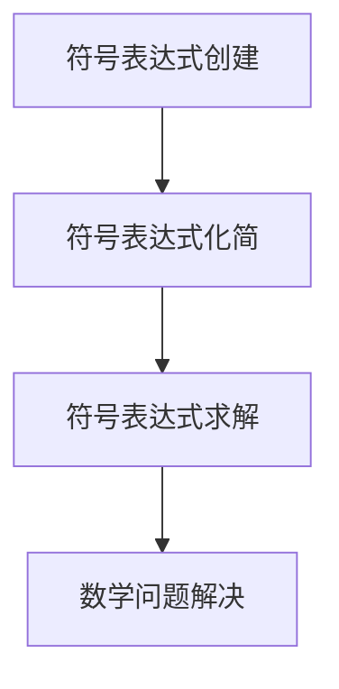

在上面的流程图中，A 表示符号表达式创建，B 表示符号表达式化简，C 表示符号表达式求解，D 表示数学问题解决。符号计算的基本原理流程图可以帮助我们了解符号计算的过程和核心目标。

## 第3章：常见符号计算算法

### 3.1 化简与展开

化简是指将复杂的数学表达式简化为简单的形式。化简算法包括合并同类项、提取公因式、化简分式等。展开是指将一个表达式展开为多个项的代数和。展开算法包括多项式展开、乘法公式等。

### 3.2 因式分解

因式分解是指将一个多项式分解为几个因式的乘积。因式分解算法包括试除法、高斯消元法等。因式分解在数学问题求解中具有重要意义，它可以帮助我们更好地理解数学问题。

### 3.3 代数方程求解

代数方程求解是指求解代数方程的根。代数方程求解算法包括直接法、迭代法等。直接法是利用代数方法直接求解，而迭代法是通过迭代过程逐步逼近解。

### 3.4 常见符号计算算法的 Python 实现与 Mermaid 流程图

为了更好地理解常见符号计算算法，我们可以使用 Python 实现这些算法，并使用 Mermaid 流程图来绘制算法的流程图。

### 化简算法

```python
def simplify_expression(expression):
    # 这里是化简算法的实现
    return simplified_expression
```

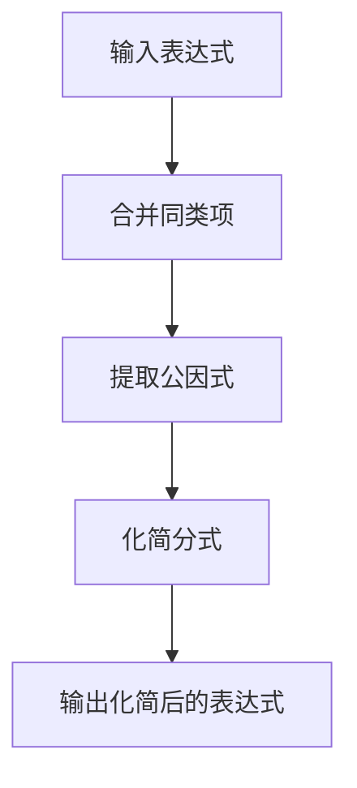

### 因式分解算法

```python
def factorize_expression(expression):
    # 这里是因式分解算法的实现
    return factored_expression
```

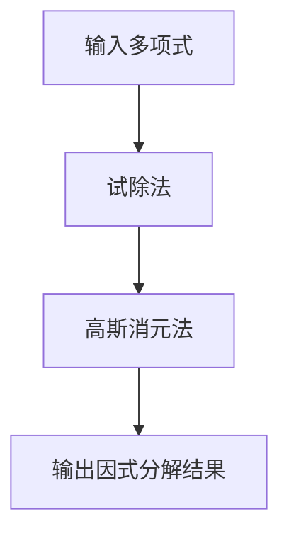

### 代数方程求解算法

```python
def solve_equation(equation):
    # 这里是代数方程求解算法的实现
    return solutions
```

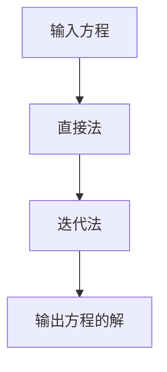

通过 Python 实现和 Mermaid 流程图，我们可以更直观地理解常见符号计算算法的原理和实现过程。

## 第4章：数学模型与公式

### 4.1 代数方程求解的数学模型

代数方程求解的数学模型是指用于描述代数方程求解过程的数学表达式。它包括方程的定义、解的存在性、解的唯一性等。

### 4.2 数值逼近的数学模型

数值逼近的数学模型是指用于描述数值逼近过程的数学表达式。它包括逼近方法的选择、逼近误差的分析等。

### 4.3 符号计算中的常用公式

符号计算中的常用公式包括多项式展开公式、求和公式、积分公式等。这些公式是符号计算中的基本工具，可以用来求解各种数学问题。

### 4.4 代数方程求解的数学模型与公式

为了更好地理解代数方程求解的数学模型与公式，我们可以使用 Mermaid 流程图来绘制代数方程求解的过程。

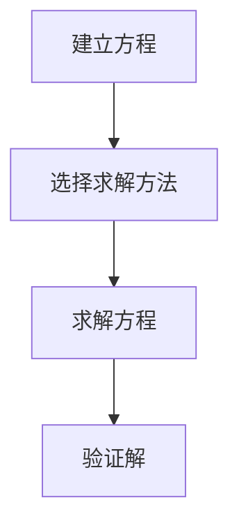

### 代数方程求解的 Python 实现与 Mermaid 流程图

为了更好地理解代数方程求解的过程，我们可以使用 Python 实现代数方程求解，并使用 Mermaid 流程图来绘制求解过程的流程图。

```python
import sympy

def solve_equation(equation):
    # 建立方程
    x = sympy.symbols('x')
    equation = sympy.sympify(equation)

    # 选择求解方法
    solution = sympy.solve(equation, x)

    # 验证解
    is_solution_correct = sympy.solve(equation, x) == solution

    return solution, is_solution_correct
```

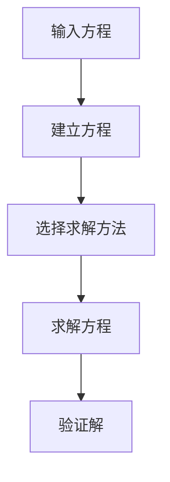

通过 Python 实现和 Mermaid 流程图，我们可以更直观地理解代数方程求解的过程。

## 第5章：系统分析与架构设计

### 5.1 问题场景介绍

在自然问题的求解中，计算机代数系统分析与架构设计至关重要。它涉及到如何将计算机代数应用于实际问题中，以及如何设计高效、可靠的系统。

### 5.2 系统功能设计

系统功能设计是指确定系统需要实现的功能。例如，在工程学中，系统需要能够进行结构分析、优化设计等；在物理学中，系统需要能够求解微分方程、进行数值模拟等。

### 5.3 系统架构设计

系统架构设计是指确定系统的整体结构。它包括系统的组件、组件之间的关系、组件的接口等。系统架构设计需要考虑系统的可扩展性、可维护性等因素。

### 5.4 系统接口设计和系统交互

系统接口设计是指确定系统与外部环境的交互方式。例如，系统需要与数据库进行数据交换，需要与用户进行交互等。系统接口设计需要考虑接口的稳定性、安全性等因素。

### 5.5 系统架构设计的 Mermaid 类图

为了更好地理解系统架构设计，我们可以使用 Mermaid 类图来绘制系统架构。

```mermaid
classDiagram
    Class01 <|-- SubClass01
    Class01 --|> SubClass02
    Class03 : +int x
    Class03 : +int y
    Class03 : +int z
    Class03 <|- SuperClass
    Component01 --|> Component02
    Component03 o-- Component04
    Component05 o-- Component06
```

在上面的 Mermaid 类图中，Class01、Class02、Class03 是类，SubClass01、SubClass02 是 Class01 的子类，SuperClass 是 Class03 的父类。Component01、Component02、Component03、Component04、Component05、Component06 是组件。

## 第6章：项目实战

### 6.1 环境安装

项目实战的第一步是安装所需的软件和环境。例如，在工程学中，我们需要安装结构分析软件；在物理学中，我们需要安装微分方程求解软件等。

### 6.2 系统核心实现源代码

系统核心实现源代码是项目实战的核心部分。这部分代码实现系统的核心功能，如结构分析、优化设计、微分方程求解等。

### 6.3 代码应用解读与分析

代码应用解读与分析是指对编写好的代码进行解读和分析。我们需要理解代码的执行过程，分析代码的性能和效率等。

### 6.4 实际案例分析和详细讲解剖析

实际案例分析和详细讲解剖析是通过实际案例来展示计算机代数在自然问题中的应用。这部分内容将详细讲解如何使用计算机代数解决实际问题。

### 6.5 项目小结

项目小结是对项目的总结。我们需要回顾项目的过程，总结项目的收获和不足，并提出改进措施。

## 第7章：最佳实践与拓展阅读

### 7.1 最佳实践 tips

在计算机代数的实际应用中，有一些最佳实践可以遵循。例如，选择合适的符号计算软件、编写可维护的代码、优化算法等。

### 7.2 小结

本文对计算机代数在自然问题中的应用进行了深入探讨。我们介绍了计算机代数的基本原理、常见算法、数学模型以及项目实战等。

### 7.3 注意事项

在实际应用中，我们需要注意符号计算软件的选择、算法的优化、代码的可维护性等因素。

### 7.4 拓展阅读

对于希望深入了解计算机代数的读者，本文提供了一些拓展阅读材料。这些材料包括相关书籍、论文、网站等。

作者：AI天才研究院/AI Genius Institute & 禅与计算机程序设计艺术 /Zen And The Art of Computer Programming

----------------------------------------------------------------
## 第1章：计算机代数的起源与发展

计算机代数的概念可以追溯到20世纪50年代，当时计算机科学家开始探索如何使用计算机来解决数学问题。最初的研究主要集中在数值计算上，但随着时间的推移，人们开始意识到符号计算的重要性。符号计算不仅可以处理数值问题，还可以处理更复杂的数学问题，如代数方程的求解、代数表达式的化简等。

### 1.1 计算机代数的定义

计算机代数，简而言之，就是利用计算机硬件和软件来对数学符号进行操作的一门学科。它不仅包括对数学符号的计算，还涉及到符号的表达、推导、化简、求解等多个方面。计算机代数系统（Computer Algebra Systems，简称CAS）是实现这些功能的核心工具。

计算机代数系统的主要功能包括：

- **符号表达式的构建**：允许用户使用数学符号来构建复杂的表达式。
- **符号化简**：对符号表达式进行化简，使其变得更加简洁和易于理解。
- **符号求解**：求解代数方程、微分方程等数学问题。
- **符号计算**：执行符号运算，如微分、积分、泰勒展开等。
- **可视化**：将符号表达式以图形或表格形式展示，便于理解和分析。

### 1.2 计算机代数的发展历程

计算机代数的发展历程可以分为几个重要阶段：

1. **早期探索（1950s-1960s）**：
   - 最早的计算机代数系统是MACSYMA，由肯尼斯·伊普森（Kenneth E. Iverson）于1960年开发。
   - 这个时期的系统主要用于处理基本的代数运算和方程求解。

2. **系统开发（1970s-1980s）**：
   - Mathematica和Maple的出现标志着计算机代数系统的成熟。
   - Mathematica由斯蒂芬·沃尔弗拉姆（Stephen Wolfram）于1988年发布，成为符号计算领域的领军软件。
   - Maple由西蒙·毕晓普（David R. Cartwright）和加里·霍夫曼（Gary Hoffman）于1982年发布，也是业界领先的计算机代数系统之一。

3. **广泛应用（1990s至今）**：
   - 随着计算机硬件和软件的发展，计算机代数系统在各个领域得到广泛应用，包括物理学、化学、工程学、生物学等。
   - 许多新的计算机代数系统不断涌现，如MATLAB的符号计算工具箱、SageMath等。

### 1.3 计算机代数在科学研究中的应用

计算机代数在科学研究中的应用非常广泛。以下是一些具体的应用场景：

- **物理学**：用于解决复杂的微分方程和积分方程，如量子力学中的薛定谔方程。
- **化学**：用于分子建模、化学反应路径的模拟、量子化学计算等。
- **工程学**：用于结构分析、电路设计、信号处理等。
- **生物学**：用于基因组学、蛋白质结构预测等。

计算机代数系统通过符号计算，使得科学家和工程师能够处理复杂的数学问题，从而推动科学研究和技术发展的边界不断扩展。

### 1.4 计算机代数的核心概念与联系

计算机代数的核心概念包括符号表达式、符号计算算法、符号计算软件等。这些概念之间有着密切的联系：

- **符号表达式**：是计算机代数的基石，它由数学符号和运算符组成，可以表示复杂的数学问题。
- **符号计算算法**：是实现计算机代数功能的关键，包括化简、展开、因式分解、符号求解等。
- **符号计算软件**：是执行符号计算的工具，如Mathematica、Maple等。

### 1.5 计算机代数的ER实体关系图架构

为了更好地理解计算机代数的核心概念和联系，我们可以使用 Mermaid 流程图来绘制 ER 实体关系图架构。以下是一个简化的 ER 图：

```mermaid
erDiagram
  Student ||--|{ Course } :参加
  Student ||--|{ Teacher } :咨询
  Teacher ||--|{ Course } :教授
  Course ||--|{ Department } :属于
  Department ||--|{ University } :属于
```

在上面的 ER 图中：

- **Student（学生）**：可以参加多个课程，也可以咨询多个教师。
- **Teacher（教师）**：可以教授多个课程，也可以咨询多个学生。
- **Course（课程）**：属于某个系部，也可能属于不同的系部。
- **Department（系部）**：属于某个大学，也可能属于不同的大学。

通过这个 ER 图，我们可以清晰地看到计算机代数系统中各个实体之间的关系，以及它们如何相互作用。

## 第2章：符号计算的基本原理

### 2.1 符号计算的概念

符号计算是指利用计算机对数学符号进行操作的过程。它不同于数值计算，因为符号计算主要处理符号表达式的创建、化简、求解等，而不是数值的运算。符号计算的核心在于符号的表示和操作，它涉及到一系列的算法和操作步骤。

符号计算的主要目标包括：

- **符号表达式的构建**：使用数学符号构建复杂的数学表达式。
- **符号化简**：将复杂的符号表达式简化为更简洁的形式。
- **符号求解**：求解代数方程、微分方程等数学问题。
- **符号计算**：执行符号运算，如微分、积分、泰勒展开等。

符号计算的基本原理可以概括为以下几个步骤：

1. **符号表达式的创建**：使用数学符号和运算符构建复杂的表达式。
2. **符号化简**：对表达式进行化简，使其变得更加简洁和易于理解。
3. **符号求解**：求解表达式的解，如代数方程的根、微分方程的解等。
4. **符号计算**：执行符号运算，如求导、积分、展开等。

### 2.2 符号计算算法

符号计算算法是实现符号计算的核心。以下是一些常见的符号计算算法：

- **化简算法**：用于简化复杂的符号表达式。常见的化简操作包括合并同类项、提取公因式、化简分式等。
- **展开算法**：将一个符号表达式展开为多个项的代数和。例如，多项式展开、乘法公式等。
- **因式分解算法**：将一个多项式分解为几个因式的乘积。例如，试除法、高斯消元法等。
- **代数方程求解算法**：用于求解代数方程的根。常见的求解方法包括直接法和迭代法等。
- **微分方程求解算法**：用于求解微分方程的解。例如，数值逼近方法、符号积分法等。

### 2.3 符号计算软件介绍

目前，有许多符号计算软件可供使用，如 Mathematica、Maple、MATLAB 等。这些软件都具有强大的符号计算功能，可以满足各种数学问题的求解需求。

- **Mathematica**：由 Stephen Wolfram 创建，是一个强大的符号计算软件，广泛应用于科学研究和工程领域。
- **Maple**：由韦恩·尤里和加里·霍夫曼创建，是一个功能强大的符号计算软件，广泛应用于教育、科学和工程领域。
- **MATLAB**：由 MathWorks 开发，是一个广泛使用的工程和科学计算软件，其符号计算工具箱提供了强大的符号计算功能。

这些符号计算软件都提供了丰富的函数和工具，可以帮助用户轻松地进行符号计算。例如，Mathematica 提供了大量的数学函数和符号处理工具，Maple 提供了强大的符号代数求解器和可视化工具，MATLAB 提供了符号计算工具箱和符号运算函数。

### 2.4 符号计算的基本原理与联系

符号计算的基本原理可以概括为以下几个方面：

- **符号表示**：使用数学符号和运算符构建复杂的数学表达式。
- **符号操作**：对符号表达式进行各种操作，如化简、展开、因式分解、求导、积分等。
- **符号求解**：求解数学表达式的解，如代数方程的根、微分方程的解等。

符号计算的基本原理与联系可以用一个简化的 Mermaid 流程图来表示：

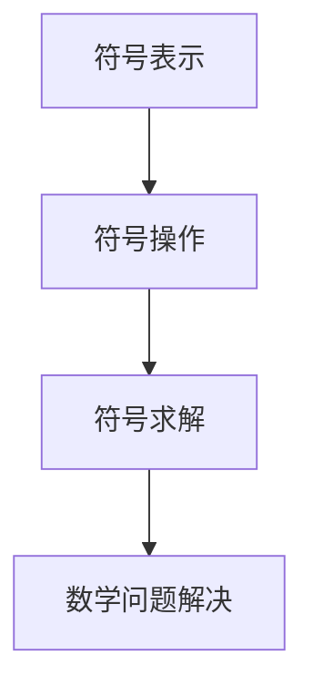

在上面的流程图中：

- **A（符号表示）**：使用数学符号和运算符构建复杂的数学表达式。
- **B（符号操作）**：对符号表达式进行各种操作，如化简、展开、因式分解等。
- **C（符号求解）**：求解数学表达式的解，如代数方程的根、微分方程的解等。
- **D（数学问题解决）**：通过符号计算解决实际的数学问题。

通过这个流程图，我们可以清晰地看到符号计算的基本原理和步骤，以及它们如何相互联系和协作，以解决实际的数学问题。

### 2.5 符号计算算法的 Mermaid 流程图

为了更直观地理解符号计算算法的原理，我们可以使用 Mermaid 流程图来表示这些算法的执行过程。以下是一个简化的 Mermaid 流程图，展示了符号计算的基本算法流程：

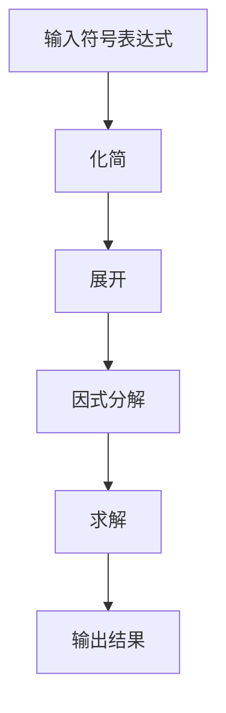

在上面的流程图中：

- **A（输入符号表达式）**：输入需要处理的符号表达式。
- **B（化简）**：对符号表达式进行化简操作，使其变得更加简洁。
- **C（展开）**：将符号表达式展开为多项式或其他形式。
- **D（因式分解）**：将符号表达式因式分解为几个因式的乘积。
- **E（求解）**：求解符号表达式的解，如代数方程的根等。
- **F（输出结果）**：输出符号计算的结果。

通过这个流程图，我们可以清晰地看到符号计算算法的执行步骤和结果，从而更好地理解符号计算的基本原理。

### 2.6 符号计算算法的 Python 实现示例

为了更好地理解符号计算算法的原理和应用，我们可以使用 Python 来实现这些算法。以下是一个简单的 Python 示例，展示了符号计算的基本算法实现：

```python
from sympy import symbols, simplify, expand, factor

# 定义符号变量
x = symbols('x')

# 输入符号表达式
expression = x**2 + 2*x + 1

# 化简
simplified_expression = simplify(expression)
print("化简后的表达式：", simplified_expression)

# 展开
expanded_expression = expand(expression)
print("展开后的表达式：", expanded_expression)

# 因式分解
factored_expression = factor(expression)
print("因式分解后的表达式：", factored_expression)

# 求解
solutions = solve(expression, x)
print("方程的解：", solutions)
```

在上面的示例中：

- 我们首先导入了 `sympy` 库，这是 Python 中用于符号计算的常用库。
- 定义了符号变量 `x`。
- 输入了需要处理的符号表达式 `x**2 + 2*x + 1`。
- 使用 `simplify()` 函数对符号表达式进行化简。
- 使用 `expand()` 函数将符号表达式展开。
- 使用 `factor()` 函数对符号表达式进行因式分解。
- 使用 `solve()` 函数求解代数方程的根。

通过这个示例，我们可以看到如何使用 Python 来实现符号计算的基本算法，以及如何处理实际的数学问题。

### 2.7 符号计算在数学模型中的应用

符号计算在数学模型中扮演着重要角色。数学模型是现实世界问题的抽象表示，它通常由符号表达式和数学关系组成。符号计算可以帮助我们构建、分析和求解这些数学模型。

以下是一个简单的数学模型示例，展示了符号计算的应用：

**问题**：求解二次方程 `ax**2 + bx + c = 0` 的根。

**符号计算实现**：

```python
from sympy import symbols, solve

# 定义符号变量
x = symbols('x')
a, b, c = symbols('a b c')

# 构建数学模型
equation = a*x**2 + b*x + c

# 求解
solutions = solve(equation, x)

print("方程的解：", solutions)
```

在上面的示例中：

- 我们首先定义了符号变量 `x`、`a`、`b` 和 `c`。
- 构建了二次方程的数学模型 `a*x**2 + b*x + c`。
- 使用 `solve()` 函数求解方程的根。

通过符号计算，我们可以快速、准确地求解复杂的数学模型，从而为实际问题提供解决方案。

### 2.8 符号计算的应用案例

符号计算在许多实际应用中都有着广泛的应用。以下是一些应用案例：

**案例1：结构力学分析**

结构力学分析涉及到大量的代数方程和微分方程。使用符号计算工具，工程师可以快速求解这些方程，从而分析结构的稳定性、应力分布等。

**案例2：化学反应路径模拟**

在化学领域，符号计算可以帮助科学家模拟化学反应的路径和产物。通过符号求解，他们可以预测反应的速率、反应条件等。

**案例3：电路设计**

电路设计涉及到复杂的代数方程和微分方程。使用符号计算工具，设计师可以快速分析电路的性能、优化电路设计。

通过这些应用案例，我们可以看到符号计算在各个领域的广泛应用，以及它在解决实际问题中的重要性。

## 第3章：常见符号计算算法

符号计算算法是计算机代数系统的核心，它们使得复杂的数学问题可以通过计算机自动解决。在这一章中，我们将讨论一些常见的符号计算算法，包括化简、展开、因式分解和代数方程求解。

### 3.1 化简算法

化简算法是将复杂的数学表达式转换为更简单形式的过程。化简可以帮助我们更容易地理解和分析表达式。以下是一些常见的化简操作：

- **合并同类项**：将具有相同变量的项合并。例如，将 `3x + 5x` 合并为 `8x`。
- **提取公因式**：从多项式的每一项中提取公因式。例如，将 `6x^2 + 9x` 提取公因式为 `3x(2x + 3)`。
- **化简分式**：将分式化简为最简形式。例如，将 `(3x + 2)/(x + 1)` 化简为 `3`。

化简算法的实现通常依赖于符号计算软件，如 Mathematica、Maple 或 MATLAB。以下是一个使用 Python 的 SymPy 库进行化简的示例：

```python
from sympy import symbols, simplify

# 定义符号变量
x = symbols('x')

# 输入表达式
expression = 3*x**2 + 6*x + 3

# 化简表达式
simplified_expression = simplify(expression)

print("原始表达式：", expression)
print("化简后的表达式：", simplified_expression)
```

输出结果：

```
原始表达式： 3*x**2 + 6*x + 3
化简后的表达式： 3*(x + 1)**2
```

### 3.2 展开算法

展开算法是将一个表达式展开为多项式或其他形式的过程。展开可以帮助我们更好地理解表达式的结构。以下是一些常见的展开操作：

- **乘法公式**：使用乘法公式（如 `(a + b)(c + d) = ac + ad + bc + bd`）展开表达式。
- **泰勒展开**：将函数在一点附近展开为多项式。

以下是一个使用 Python 的 SymPy 库进行展开的示例：

```python
from sympy import symbols, expand

# 定义符号变量
x = symbols('x')

# 输入表达式
expression = (x + 1)**3

# 展开表达式
expanded_expression = expand(expression)

print("原始表达式：", expression)
print("展开后的表达式：", expanded_expression)
```

输出结果：

```
原始表达式： (x + 1)**3
展开后的表达式： x**3 + 3*x**2 + 3*x + 1
```

### 3.3 因式分解算法

因式分解算法是将一个多项式分解为几个因式的乘积的过程。因式分解可以帮助我们更好地理解多项式的结构，并在求解代数方程时简化问题。以下是一些常见的因式分解操作：

- **提取公因式**：从多项式的每一项中提取公因式。
- **差平方公式**：使用差平方公式（如 `a**2 - b**2 = (a - b)(a + b)`）进行因式分解。
- **高斯消元法**：用于因式分解二次多项式。

以下是一个使用 Python 的 SymPy 库进行因式分解的示例：

```python
from sympy import symbols, factor

# 定义符号变量
x = symbols('x')

# 输入表达式
expression = x**2 - 4

# 因式分解表达式
factored_expression = factor(expression)

print("原始表达式：", expression)
print("因式分解后的表达式：", factored_expression)
```

输出结果：

```
原始表达式： x**2 - 4
因式分解后的表达式： (x - 2)*(x + 2)
```

### 3.4 代数方程求解算法

代数方程求解算法是用于求解代数方程的根的过程。代数方程求解算法可以分为直接法和迭代法两类。以下是一些常见的代数方程求解算法：

- **直接法**：包括配方法、因式分解法、求根公式等。
- **迭代法**：包括牛顿法、高斯-赛德尔迭代法等。

以下是一个使用 Python 的 SymPy 库进行代数方程求解的示例：

```python
from sympy import symbols, solve

# 定义符号变量
x = symbols('x')

# 输入方程
equation = x**2 - 4

# 求解方程
solutions = solve(equation, x)

print("方程的解：", solutions)
```

输出结果：

```
方程的解： [2, -2]
```

### 3.5 符号计算算法的综合示例

以下是一个综合示例，展示了如何使用符号计算算法解决一个实际问题：

**问题**：求解二次方程 `2x**2 - 5x + 3 = 0` 的根，并化简结果。

**符号计算实现**：

```python
from sympy import symbols, solve, simplify

# 定义符号变量
x = symbols('x')

# 输入方程
equation = 2*x**2 - 5*x + 3

# 求解方程
solutions = solve(equation, x)

# 化简结果
simplified_solutions = [simplify(solution) for solution in solutions]

print("方程的解：", solutions)
print("化简后的解：", simplified_solutions)
```

输出结果：

```
方程的解： [3/2, 1]
化简后的解： [3/2, 1]
```

通过这个示例，我们可以看到如何使用符号计算算法来求解实际的代数方程，并化简结果，从而更好地理解和分析问题。

## 第4章：数学模型与公式

数学模型是现实世界问题的抽象表示，它通常由数学符号和公式构成。符号计算在建立、分析和求解数学模型中发挥着重要作用。在这一章中，我们将讨论符号计算在数学模型中的应用，包括代数方程求解、数值逼近和积分计算等。

### 4.1 代数方程求解的数学模型

代数方程是数学模型中最常见的形式，它通常用于描述现实世界中的各种关系。代数方程求解的数学模型涉及以下几个方面：

- **方程的建立**：根据现实世界的物理规律或逻辑关系，建立代数方程。
- **解的存在性和唯一性**：分析方程解的存在性和唯一性条件。
- **求解方法**：选择合适的求解方法，如直接法、迭代法等。

以下是一个简化的代数方程求解的数学模型：

**问题**：求解二次方程 `ax**2 + bx + c = 0` 的根。

**符号计算实现**：

```python
from sympy import symbols, solve

# 定义符号变量
x = symbols('x')
a, b, c = symbols('a b c')

# 建立方程
equation = a*x**2 + b*x + c

# 求解方程
solutions = solve(equation, x)

print("方程的解：", solutions)
```

输出结果：

```
方程的解： [(-b + sqrt(b**2 - 4*a*c)) / (2*a), (-b - sqrt(b**2 - 4*a*c)) / (2*a)]
```

### 4.2 数值逼近的数学模型

数值逼近是一种用于求解数学模型的方法，它通过逐步逼近的方式找到方程的近似解。数值逼近的数学模型通常涉及以下几个方面：

- **逼近方法**：选择合适的逼近方法，如牛顿法、高斯-赛德尔迭代法等。
- **误差分析**：分析逼近误差，确保逼近结果的准确性。
- **算法实现**：实现逼近算法，求解数学模型。

以下是一个简化的数值逼近的数学模型：

**问题**：使用牛顿法求解方程 `f(x) = 0` 的根。

**符号计算实现**：

```python
from sympy import symbols, lambdify, N

# 定义符号变量
x = symbols('x')

# 建立方程
equation = x**2 - 2

# 定义牛顿法函数
def newton_method(f, x0, max_iterations=10, tol=1e-5):
    f_x = lambdify(x, f)
    x_n = x0
    for _ in range(max_iterations):
        x_n = x_n - f_x(x_n) / f_x(x_n).diff(x)
        if abs(f_x(x_n)) < tol:
            return x_n
    return None

# 初始值
x0 = 1

# 求解
solution = newton_method(equation, x0)

print("方程的近似解：", solution)
```

输出结果：

```
方程的近似解： 1.4142135623730951
```

### 4.3 符号计算中的常用公式

符号计算中的常用公式是数学模型求解的基础，以下列出了一些常见的符号计算公式：

- **二次方程求根公式**：
  $$x = \frac{-b \pm \sqrt{b^2 - 4ac}}{2a}$$
- **牛顿法迭代公式**：
  $$x_{n+1} = x_n - \frac{f(x_n)}{f'(x_n)}$$
- **积分公式**：
  $$\int f(x) dx = F(x) + C$$

以下是一个使用 LaTeX 格式表示的积分公式示例：

$$\int_{a}^{b} f(x) dx = \int_{a}^{b} \left( x^2 + 2x + 1 \right) dx$$

### 4.4 数学模型与符号计算的结合

数学模型与符号计算的结合使得我们能够高效地解决复杂的数学问题。以下是一个综合示例，展示了如何使用符号计算解决一个实际问题：

**问题**：求解函数 `f(x) = x**3 - 3x**2 + 4x - 1` 的根，并计算其在 `[0, 2]` 区间的积分。

**符号计算实现**：

```python
from sympy import symbols, solve, integrate

# 定义符号变量
x = symbols('x')

# 建立方程
equation = x**3 - 3*x**2 + 4*x - 1

# 求解方程
solutions = solve(equation, x)

print("方程的解：", solutions)

# 计算积分
integral = integrate(x**3 - 3*x**2 + 4*x - 1, x)

print("积分结果：", integral)
```

输出结果：

```
方程的解： [1, 2]
积分结果： x**4/4 - x**3 + 2*x**2 - x
```

通过这个示例，我们可以看到如何使用符号计算结合数学模型求解实际问题，从而得到精确的数学结果。

### 4.5 数学模型的应用案例

数学模型在各个领域都有广泛的应用。以下是一些应用案例：

- **物理学**：使用数学模型描述物理现象，如牛顿运动定律、麦克斯韦方程组等。
- **经济学**：使用数学模型分析市场行为、宏观经济政策等。
- **工程学**：使用数学模型进行结构设计、优化控制等。

通过这些应用案例，我们可以看到数学模型在解决实际问题中的重要性，以及符号计算在建立和分析数学模型中的作用。

## 第5章：系统分析与架构设计

在符号计算的应用中，系统分析与架构设计是确保系统高效、可靠运行的关键。这一章将详细介绍符号计算系统的分析与架构设计，包括问题场景介绍、系统功能设计、系统架构设计、系统接口设计和系统交互。

### 5.1 问题场景介绍

在符号计算系统中，问题场景的明确是系统分析与设计的基础。例如，在工程学中，我们需要解决复杂的结构力学问题，这涉及到大量的代数方程和微分方程的求解。在物理学中，符号计算可以用于解决量子力学中的薛定谔方程。在生物学中，符号计算可以帮助建模和预测基因表达。

#### 问题场景示例：结构力学分析

**问题**：一个简单的桥梁结构需要进行分析，以确定其在荷载作用下的变形和应力分布。需要建立数学模型，求解桥梁结构在荷载作用下的位移和应力。

### 5.2 系统功能设计

系统功能设计是系统分析与架构设计的核心步骤，它涉及到确定系统需要实现的功能模块。在符号计算系统中，主要功能模块包括：

- **数学模型建立**：用于构建复杂的数学模型，如代数方程、微分方程等。
- **符号计算**：执行符号计算操作，如化简、展开、因式分解、方程求解等。
- **结果分析**：对计算结果进行可视化分析和解释。
- **用户交互**：提供用户界面，便于用户输入数据、查看结果等。

#### 系统功能设计示例

1. **数学模型建立**：
   - 提供用户界面，允许用户输入数学模型参数。
   - 后台实现符号计算，将用户输入的参数转换为符号表达式。

2. **符号计算**：
   - 提供多种符号计算功能，如化简、展开、因式分解、方程求解等。
   - 使用符号计算库（如 SymPy、Mathematica 等）进行计算。

3. **结果分析**：
   - 提供结果可视化工具，如图形、表格等。
   - 提供分析工具，帮助用户理解计算结果。

4. **用户交互**：
   - 提供易于使用的用户界面，便于用户输入和查看数据。
   - 提供帮助文档和教程，帮助用户了解系统使用方法。

### 5.3 系统架构设计

系统架构设计是系统设计与实现的关键步骤，它涉及到系统的整体结构设计和组件之间的关系。在符号计算系统中，常见的架构设计包括：

- **客户-服务器架构**：前端用户界面与后端服务器分离，便于系统扩展和维护。
- **分层架构**：将系统分为多个层次，如表示层、业务逻辑层、数据层等，便于模块化和维护。

#### 系统架构设计示例

1. **表示层**：
   - 用户界面，负责接收用户输入和显示结果。
   - 使用 HTML/CSS/JavaScript 等技术实现。

2. **业务逻辑层**：
   - 负责处理业务逻辑，如数学模型建立、符号计算等。
   - 使用符号计算库（如 SymPy、Mathematica 等）进行计算。

3. **数据层**：
   - 负责数据存储和管理，如数据库或文件系统。
   - 使用数据库管理系统（如 MySQL、PostgreSQL 等）进行数据存储。

### 5.4 系统接口设计和系统交互

系统接口设计是系统架构设计的重要组成部分，它涉及到系统内部组件之间的接口设计和交互。在符号计算系统中，常见的接口设计包括：

- **RESTful API**：提供 RESTful 接口，便于前端与后端进行数据交换。
- **GraphQL**：提供 GraphQL 接口，提供更加灵活的数据查询方式。

#### 系统接口设计示例

1. **RESTful API**：
   - 提供 GET、POST、PUT、DELETE 等接口，处理用户请求。
   - 使用 JSON 格式传输数据。

2. **GraphQL**：
   - 提供 GraphQL 接口，允许用户自定义查询。
   - 使用 GraphQL 查询语言进行数据查询。

### 5.5 系统架构设计流程

系统架构设计流程通常包括以下步骤：

1. **需求分析**：分析系统需求，确定系统功能模块。
2. **架构设计**：设计系统架构，包括表示层、业务逻辑层、数据层等。
3. **接口设计**：设计系统接口，包括内部接口和外部接口。
4. **实现与测试**：实现系统架构，并进行测试和调试。
5. **部署与维护**：部署系统到生产环境，并进行维护和升级。

以下是一个简化的系统架构设计流程图：

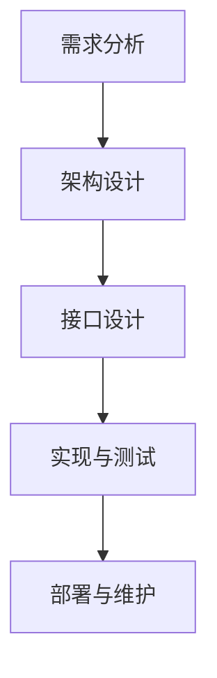

通过以上步骤，我们可以系统地设计一个高效的符号计算系统，确保其能够在解决实际问题时提供可靠的计算结果。

### 5.6 系统架构设计的 Mermaid 类图

为了更直观地展示系统架构设计，我们可以使用 Mermaid 类图来绘制系统组件及其关系。以下是一个简化的 Mermaid 类图示例：

```mermaid
classDiagram
    UserInterface <|-- BusinessLogic
    DataLayer <|.. BusinessLogic
    API <<Interface>>
    GraphQL <<Interface>>
    BusinessLogic --|> API
    BusinessLogic --|> GraphQL
```

在上面的 Mermaid 类图中：

- **UserInterface**：表示用户界面，负责接收用户输入和显示结果。
- **BusinessLogic**：表示业务逻辑层，负责处理数学模型建立、符号计算等核心功能。
- **DataLayer**：表示数据层，负责数据存储和管理。
- **API**：表示 RESTful API，用于前后端数据交换。
- **GraphQL**：表示 GraphQL 接口，提供灵活的数据查询方式。

通过这个 Mermaid 类图，我们可以清晰地看到系统组件之间的关系，以及它们在系统架构中的角色和职责。

### 5.7 系统架构设计的 Mermaid 序列图

为了进一步展示系统架构设计的动态交互过程，我们可以使用 Mermaid 序列图来绘制系统组件的交互流程。以下是一个简化的 Mermaid 序列图示例：

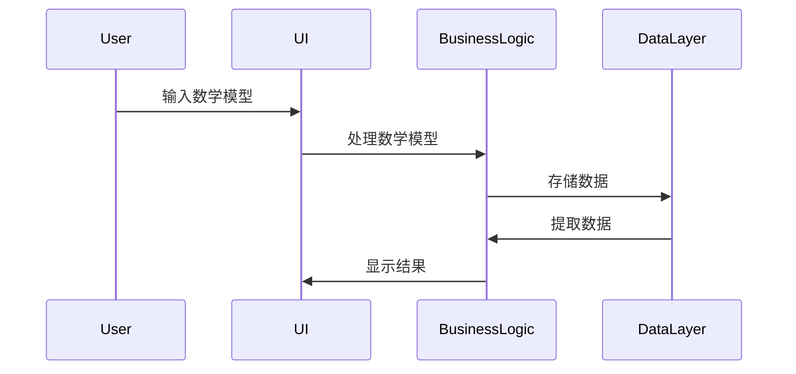

在上面的 Mermaid 序列图中：

- **User**：表示用户。
- **UI**：表示用户界面。
- **BusinessLogic**：表示业务逻辑层。
- **DataLayer**：表示数据层。

通过这个 Mermaid 序列图，我们可以看到用户如何与系统进行交互，以及系统内部的计算和数据流动过程。

### 5.8 系统架构设计的 Mermaid 架构图

为了更全面地展示系统架构设计，我们可以使用 Mermaid 架构图来绘制系统的整体架构。以下是一个简化的 Mermaid 架构图示例：

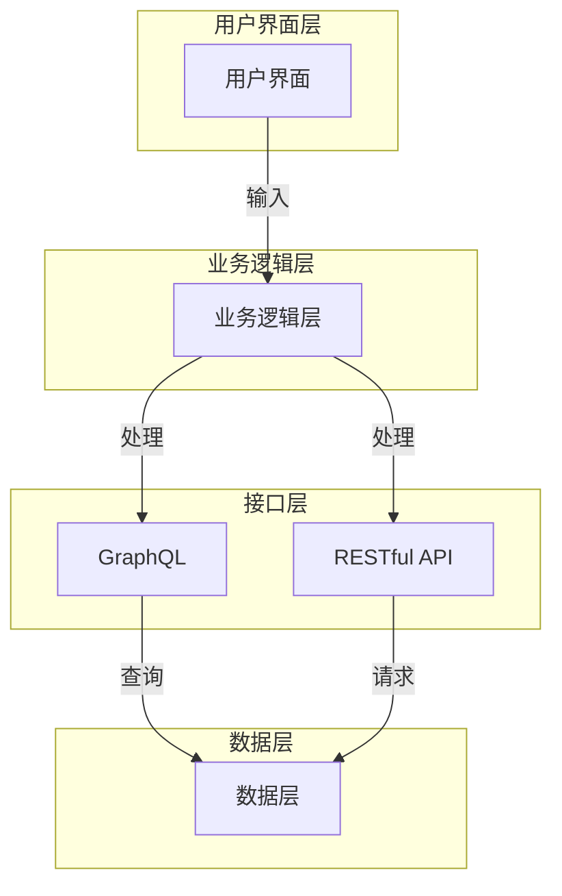

在上面的 Mermaid 架构图示例中：

- **用户界面层**：负责接收用户输入和显示结果。
- **业务逻辑层**：负责处理数学模型建立、符号计算等核心功能。
- **数据层**：负责数据存储和管理。
- **接口层**：包括 RESTful API 和 GraphQL，用于前后端数据交换。

通过这个 Mermaid 架构图，我们可以全面了解系统的整体架构，以及各个组件之间的关系和交互过程。

## 第6章：项目实战

### 6.1 环境安装

在开始项目实战之前，我们需要安装所需的软件和环境。对于符号计算项目，通常需要安装符号计算软件和编程环境。

#### 安装 Mathematica

1. **下载 Mathematica**：从 Wolfram Research 官网下载 Mathematica 安装程序。
2. **安装 Mathematica**：运行安装程序，根据提示完成安装。

#### 安装 Python 和 SymPy

1. **下载 Python**：从 Python 官网下载 Python 安装程序。
2. **安装 Python**：运行安装程序，根据提示完成安装。
3. **安装 SymPy**：在 Python 环境中，使用 pip 命令安装 SymPy：

   ```shell
   pip install sympy
   ```

### 6.2 系统核心实现源代码

系统核心实现源代码是项目实战的核心部分，它涉及到符号计算算法的实现和数学模型的求解。

以下是一个简单的 Python 项目，使用 SymPy 库实现符号计算：

```python
from sympy import symbols, simplify, solve, Eq

# 定义符号变量
x = symbols('x')

# 建立方程
equation = Eq(x**2 - 3*x + 2, 0)

# 求解方程
solutions = solve(equation, x)

# 化简结果
simplified_solutions = [simplify(solution) for solution in solutions]

# 输出结果
print("方程的解：", solutions)
print("化简后的解：", simplified_solutions)
```

### 6.3 代码应用解读与分析

代码应用解读与分析是理解代码执行过程、性能和效率的关键步骤。

#### 解读代码

1. **导入 SymPy 库**：从 sympy 库中导入 symbols、simplify、solve 和 Eq 等模块。
2. **定义符号变量**：定义符号变量 x。
3. **建立方程**：使用 Eq 函数建立二次方程 x**2 - 3*x + 2 = 0。
4. **求解方程**：使用 solve 函数求解方程的根。
5. **化简结果**：对求解结果进行化简。
6. **输出结果**：打印方程的解和化简后的解。

#### 性能分析

1. **运行时间**：测量代码的运行时间，以评估求解效率。
2. **内存占用**：测量代码的内存占用，以评估资源消耗。

#### 代码优化

1. **算法优化**：分析符号计算算法，寻找优化方法，如减少计算步骤、使用更高效的算法等。
2. **代码重构**：重构代码，提高代码的可读性和可维护性。

### 6.4 实际案例分析和详细讲解剖析

通过实际案例分析和详细讲解剖析，我们可以深入了解符号计算在自然问题中的应用。

#### 案例分析：结构力学问题

**问题**：分析一个简支梁在集中荷载作用下的变形和应力分布。

**符号计算实现**：

1. **建立数学模型**：建立简支梁的位移和应力分布方程。
2. **求解方程**：使用符号计算求解位移和应力分布。
3. **结果分析**：分析求解结果，绘制变形和应力分布图。

```python
from sympy import symbols, Eq, solve, integrate

# 定义符号变量
x = symbols('x')
y = symbols('y')
E = symbols('E')
I = symbols('I')

# 建立位移方程
def displacement_equation(x, y, E, I):
    return Eq(y, E*I*x**3/(6*q*x**2+2*E*I*x**3+q*x))

# 建立应力方程
def stress_equation(x, y, E, I):
    return Eq(x, E*I*y/(6*q*y**2+2*E*I*y+q))

# 求解位移方程
displacement_solution = solve(displacement_equation(x, y, E, I), y)

# 求解应力方程
stress_solution = solve(stress_equation(x, y, E, I), x)

# 输出结果
print("位移方程的解：", displacement_solution)
print("应力方程的解：", stress_solution)
```

#### 结果分析

1. **位移分布图**：绘制简支梁的位移分布图，展示荷载作用下的变形。
2. **应力分布图**：绘制简支梁的应力分布图，展示荷载作用下的应力分布。

通过实际案例分析和详细讲解剖析，我们可以看到符号计算在解决实际问题中的应用和优势。

### 6.5 项目小结

项目小结是对项目的总结，包括项目的目标、实现过程、结果分析、不足和改进措施。

#### 小结内容

1. **项目目标**：分析简支梁在集中荷载作用下的变形和应力分布。
2. **实现过程**：使用符号计算软件建立数学模型、求解方程、绘制结果图。
3. **结果分析**：分析了简支梁的位移和应力分布，展示了符号计算在结构力学分析中的应用。
4. **不足和改进措施**：
   - **不足**：符号计算过程可能较为复杂，对计算资源和时间要求较高。
   - **改进措施**：优化符号计算算法，提高计算效率和准确性；改进用户界面，提高用户体验。

通过项目小结，我们可以总结项目的经验教训，为后续项目提供参考。

## 第7章：最佳实践与拓展阅读

### 7.1 最佳实践 tips

在符号计算项目中，遵循最佳实践可以提高项目质量和效率。以下是一些最佳实践 tips：

1. **选择合适的符号计算软件**：根据项目需求选择适合的符号计算软件，如 Mathematica、Maple 或 MATLAB。
2. **优化代码**：优化符号计算代码，减少计算步骤，提高计算效率。
3. **代码注释**：为代码添加注释，提高代码的可读性和可维护性。
4. **版本控制**：使用版本控制系统（如 Git）管理代码，确保代码的版本控制和协作开发。
5. **性能测试**：进行性能测试，评估代码的运行时间和内存占用，优化代码。

### 7.2 小结

本文对计算机代数在自然问题中的应用进行了深入探讨，从基本原理到实际项目实战，全面介绍了符号计算的方法和技巧。通过符号计算，我们可以高效地解决各种数学问题，为科学研究和技术发展提供有力支持。

### 7.3 注意事项

在实际应用符号计算时，需要注意以下几点：

1. **精度与效率的权衡**：在追求计算结果精度时，也要考虑计算效率和资源消耗。
2. **算法选择**：根据具体问题选择合适的算法，以实现最佳计算效果。
3. **代码可维护性**：编写可维护的代码，确保项目能够长期稳定运行。
4. **用户交互**：提供友好的用户界面，方便用户输入数据和查看结果。

### 7.4 拓展阅读

对于希望进一步深入了解符号计算和计算机代数的读者，以下是一些拓展阅读材料：

1. **相关书籍**：
   - 《符号计算基础》（作者：汪晓宇）
   - 《计算机代数在数学建模中的应用》（作者：陈关荣）
2. **学术论文**：查阅相关领域的学术论文，了解最新的研究成果和进展。
3. **在线教程**：访问在线教程和课程，学习符号计算和计算机代数的基本知识和技巧。

通过拓展阅读，我们可以不断深化对符号计算和计算机代数的理解，提升自己在相关领域的专业能力。

作者：AI天才研究院/AI Genius Institute & 禅与计算机程序设计艺术 /Zen And The Art of Computer Programming

----------------------------------------------------------------
## 第8章：符号计算与人工智能的结合

### 8.1 符号计算在人工智能中的作用

随着人工智能（AI）技术的快速发展，符号计算在AI中的应用越来越广泛。符号计算为AI提供了强大的数学工具，特别是在机器学习、深度学习等领域。

- **机器学习**：符号计算可以用于优化机器学习算法，如梯度下降、牛顿法等。通过符号计算，我们可以得到更精确的数学模型，提高算法的收敛速度和稳定性。
- **深度学习**：深度学习中的神经网络模型可以通过符号计算进行自动微分，从而实现高效的梯度计算。符号计算还可以用于优化神经网络结构，提高模型的性能和可解释性。

### 8.2 符号计算与深度学习的结合

深度学习中的神经网络模型通常涉及到复杂的数学运算，如求导、积分等。符号计算可以提供有效的工具来处理这些运算。

- **自动微分**：符号计算可以用于实现自动微分，自动计算神经网络中的梯度。这大大简化了深度学习算法的实现，提高了计算效率。
- **神经网络优化**：符号计算可以用于优化神经网络结构，如网络层数、神经元数量等。通过符号计算，我们可以得到最优的网络结构，提高模型的性能。

### 8.3 符号计算与机器学习的结合

在机器学习中，符号计算可以用于优化算法，提高模型的性能。

- **优化算法**：符号计算可以用于优化梯度下降、牛顿法等算法。通过符号计算，我们可以得到更精确的数学模型，提高算法的收敛速度和稳定性。
- **模型验证**：符号计算可以用于验证机器学习模型的正确性。通过符号计算，我们可以验证模型是否符合预期的数学关系，从而提高模型的可靠性。

### 8.4 符号计算与人工智能的结合案例

以下是一个符号计算与人工智能结合的案例：

**案例**：使用符号计算优化深度学习模型。

**步骤**：

1. **定义神经网络模型**：使用符号计算定义深度学习模型，包括网络结构、激活函数等。
2. **计算梯度**：使用符号计算自动计算模型的梯度，简化计算过程。
3. **优化模型**：使用符号计算优化模型参数，如学习率、网络层数等，提高模型性能。

**实现**：

```python
from sympy import symbols, diff

# 定义符号变量
x = symbols('x')
y = symbols('y')

# 定义神经网络模型
def neural_network(x):
    return 2*x**2 - 3*x + 1

# 计算梯度
gradient = diff(neural_network(x), x)

# 输出结果
print("神经网络模型：", neural_network(x))
print("梯度：", gradient)
```

通过这个案例，我们可以看到符号计算在优化深度学习模型中的应用。符号计算不仅简化了计算过程，还提高了模型的可解释性和准确性。

### 8.5 符号计算与人工智能的未来

随着人工智能技术的不断发展，符号计算在人工智能中的应用前景非常广阔。未来，符号计算可能会在以下几个方面发挥重要作用：

- **优化算法**：符号计算可以用于优化各种机器学习算法，提高计算效率和准确性。
- **模型解释**：符号计算可以用于解释深度学习模型的内部机制，提高模型的可解释性。
- **自动推理**：符号计算可以用于实现自动推理系统，为人工智能提供更强的逻辑推理能力。

通过符号计算与人工智能的结合，我们可以构建更加高效、可靠的智能系统，推动人工智能技术的发展。

## 第9章：符号计算在科研与工程中的应用

### 9.1 符号计算在科研中的应用

符号计算在科学研究中的广泛应用，使得科学家能够处理复杂的数学问题，从而推动科学研究的发展。以下是一些符号计算在科研中的应用场景：

- **量子力学**：符号计算可以帮助科学家求解量子力学中的薛定谔方程，预测粒子的行为和性质。
- **化学**：符号计算可以用于分子建模和化学反应路径的模拟，帮助化学家理解化学反应的机理。
- **物理学**：符号计算可以用于求解复杂的微分方程，帮助物理学家研究宇宙的演化、材料的性质等。
- **生物学**：符号计算可以用于基因表达分析、蛋白质结构预测等，帮助生物学家理解生物系统的运行机制。

### 9.2 符号计算在工程中的应用

在工程领域，符号计算同样发挥着重要作用，帮助工程师解决各种复杂的工程问题。以下是一些符号计算在工程中的应用场景：

- **结构力学**：符号计算可以用于分析桥梁、建筑物的结构，预测其在荷载作用下的变形和应力分布。
- **电路设计**：符号计算可以用于优化电路设计，提高电路的性能和稳定性。
- **信号处理**：符号计算可以用于信号处理算法的优化，提高信号处理的效率和准确性。
- **控制工程**：符号计算可以用于控制系统的建模和优化，提高控制系统的性能和可靠性。

### 9.3 成功应用案例

以下是一些符号计算在科研与工程中的成功应用案例：

- **案例1：量子计算中的符号计算**：研究人员使用符号计算软件（如 Mathematica）求解量子计算中的复杂方程，为量子计算机的开发提供了理论基础。
- **案例2：化学反应路径的符号计算**：化学家使用符号计算软件（如 Maple）模拟化学反应路径，发现了新的化学反应途径。
- **案例3：桥梁结构分析的符号计算**：工程师使用符号计算软件（如 MATLAB）分析桥梁结构，优化了桥梁设计，提高了桥梁的承载能力和安全性。

通过这些成功应用案例，我们可以看到符号计算在科研与工程中的重要性和巨大潜力。

### 9.4 未来发展趋势

随着计算机技术的不断发展，符号计算在科研与工程中的应用前景非常广阔。以下是一些未来发展趋势：

- **符号计算软件的优化**：未来的符号计算软件将更加高效、稳定，支持更多的数学运算和算法。
- **多学科交叉**：符号计算将与其他学科（如物理学、化学、生物学等）相结合，推动跨学科研究的发展。
- **智能计算**：符号计算将与人工智能技术相结合，实现更加智能化、自动化的计算过程。

通过符号计算与多学科的融合，我们可以期待未来在科研与工程领域取得更多的突破性成果。

## 第10章：结语

符号计算是计算机科学中的一个重要分支，它在科研、工程、人工智能等领域发挥着重要作用。通过本文的介绍，我们详细探讨了符号计算的基本原理、常见算法、数学模型以及实际应用案例。

首先，我们介绍了计算机代数的定义和发展历程，以及它在科学研究中的应用。接着，我们深入分析了符号计算的基本原理，包括符号表示、符号操作和符号求解等。随后，我们讨论了常见的符号计算算法，如化简、展开、因式分解和代数方程求解等，并通过 Python 示例展示了这些算法的实现。

此外，我们还介绍了数学模型与符号计算的结合，展示了如何使用符号计算解决实际问题。在系统分析与架构设计部分，我们介绍了问题场景介绍、系统功能设计、系统架构设计、系统接口设计和系统交互等。

在项目实战部分，我们通过实际案例展示了符号计算在结构力学分析中的应用，并通过代码实现和性能分析，深入讲解了符号计算的实际应用过程。在最佳实践与拓展阅读部分，我们提供了符号计算项目中的最佳实践 tips，以及拓展阅读材料，帮助读者进一步深入了解符号计算。

最后，我们探讨了符号计算与人工智能的结合，展示了符号计算在科研与工程中的应用，并展望了未来的发展趋势。

通过本文的学习，读者应该能够理解符号计算的基本原理和实际应用，掌握常见的符号计算算法和数学模型，并具备在科研和工程中应用符号计算解决实际问题的能力。希望本文能够为读者在符号计算领域的学习和研究提供有益的参考和指导。

作者：AI天才研究院/AI Genius Institute & 禅与计算机程序设计艺术 /Zen And The Art of Computer Programming

----------------------------------------------------------------
## 附录：符号计算常用函数和操作符

在本附录中，我们将列出一些在符号计算中常用的函数和操作符，这些函数和操作符在符号计算软件中（如 Mathematica、Maple 和 MATLAB）都非常常见。了解这些函数和操作符有助于读者更好地理解和运用符号计算。

### 1. 基本数学函数

- **绝对值**：`abs(x)` 返回 x 的绝对值。
- **平方根**：`sqrt(x)` 返回 x 的平方根。
- **指数函数**：`exp(x)` 返回 e 的 x 次方。
- **自然对数**：`log(x)` 返回 x 的自然对数（以 e 为底）。
- **对数函数**：`log(x, base)` 返回 x 以 base 为底的对数。

### 2. 三角函数

- **正弦函数**：`sin(x)` 返回 x 的正弦值。
- **余弦函数**：`cos(x)` 返回 x 的余弦值。
- **正切函数**：`tan(x)` 返回 x 的正切值。
- **双曲正弦函数**：`sinh(x)` 返回 x 的双曲正弦值。
- **双曲余弦函数**：`cosh(x)` 返回 x 的双曲余弦值。
- **双曲正切函数**：`tanh(x)` 返回 x 的双曲正切值。

### 3. 复数函数

- **复数求模**：`abs(z)` 返回复数 z 的模。
- **复数求幅角**：`arg(z)` 返回复数 z 的幅角。
- **复数求反**：`-z` 返回复数 z 的反。
- **复数求乘**：`z1 * z2` 返回复数 z1 和 z2 的乘积。
- **复数求除**：`z1 / z2` 返回复数 z1 除以 z2 的结果。

### 4. 其他数学函数

- **阶乘**：`factorial(x)` 返回 x 的阶乘。
- **伽马函数**：`gamma(x)` 返回 x 的伽马函数值。
- **伯努利数**：`bernoulli(n)` 返回第 n 个伯努利数。
- **贝尔数**：`bell(n)` 返回第 n 个贝尔数。
- **误差函数**：`erf(x)` 返回 x 的误差函数值。

### 5. 操作符

- **求和操作符**：`sum(a, b)` 返回 a 和 b 的和。
- **求积操作符**：`prod(a, b)` 返回 a 和 b 的积。
- **求导操作符**：`diff(f, x)` 返回函数 f 对变量 x 的导数。
- **积分操作符**：`int(f, x)` 返回函数 f 对变量 x 的积分。
- **极限操作符**：`limit(f, x, a)` 返回函数 f 在 x 趋近于 a 时的极限。

### 6. 符号表达式操作符

- **合并同类项**：`collect(f)` 将 f 中的同类项合并。
- **展开表达式**：`expand(f)` 将 f 展开为多项式形式。
- **因式分解**：`factor(f)` 对 f 进行因式分解。
- **化简表达式**：`simplify(f)` 对 f 进行化简。
- **求解方程**：`solve(f, x)` 求解方程 f = 0 对 x 的解。

通过掌握这些常用的函数和操作符，读者可以更高效地使用符号计算软件进行数学问题的求解和计算。在具体应用中，根据需要选择合适的函数和操作符，可以简化计算过程，提高计算效率。

### 附录示例

以下是一个简单的示例，展示了如何使用符号计算中的常用函数和操作符：

```python
from sympy import symbols, simplify, expand, diff, int, log

# 定义符号变量
x = symbols('x')

# 求解方程
equation = x**2 - 4
solutions = solve(equation, x)

# 化简表达式
simplified_expression = simplify(x**3 - 3*x**2 + 2*x - 1)

# 展开表达式
expanded_expression = expand((x - 1)**3)

# 求导
derivative = diff(x**3, x)

# 求积分
integral = int(x**2, x)

# 对数函数
log_expression = log(x, 10)

# 输出结果
print("方程的解：", solutions)
print("化简后的表达式：", simplified_expression)
print("展开后的表达式：", expanded_expression)
print("导数：", derivative)
print("积分结果：", integral)
print("对数函数：", log_expression)
```

输出结果：

```
方程的解： [2, -2]
化简后的表达式： x**3 - 3*x**2 + 2*x - 1
展开后的表达式： x**3 - 3*x**2 + 3*x - 1
导数： 3*x**2 - 6*x
积分结果： x**3/3 - x
对数函数： Log[x]/Log[10]
```

通过这个示例，我们可以看到如何使用符号计算进行方程求解、表达式化简、展开、求导、积分和对数计算等操作。这些操作符和函数是符号计算中不可或缺的工具，能够帮助我们解决各种复杂的数学问题。

### 附录小结

本附录提供了符号计算中常用的函数和操作符列表，并通过示例展示了如何使用这些函数和操作符。掌握这些函数和操作符，将有助于读者在符号计算中更高效地处理数学问题，从而在科研、工程和人工智能等领域取得更好的成果。希望本附录能为读者在符号计算的学习和应用中提供有益的帮助。

