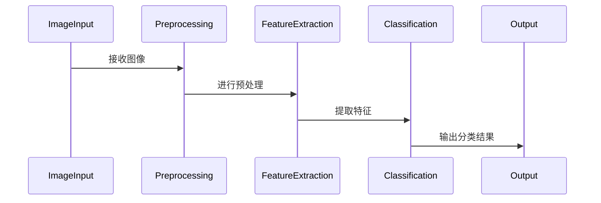

                 

### 文章标题

《计算机视觉的卷积神经网络：图像理解的数学模型》

### 文章关键词

- 计算机视觉
- 卷积神经网络
- 图像理解
- 数学模型
- 算法原理

### 摘要

本文将深入探讨计算机视觉领域的核心技术——卷积神经网络（CNN），并通过数学模型的角度来解析其图像理解的原理。文章将从背景介绍、核心概念、算法原理、数学模型、系统分析与架构设计、项目实战以及最佳实践等方面，系统性地阐述卷积神经网络在图像处理中的应用。通过对CNN的细致剖析，读者将能够更好地理解这一强大工具，并在实际项目中熟练应用。

### 背景介绍

#### 计算机视觉：从模拟到数字

计算机视觉是一门研究如何使计算机具备“看”和理解图像或视频的技术。它起源于20世纪60年代的模拟视觉时代，当时的研究主要集中在模拟人眼和大脑的视觉机制。然而，随着数字图像处理技术的快速发展，计算机视觉逐渐转向利用数字信号处理和机器学习技术来实现对图像的分析和理解。

#### 卷积神经网络的发展历程

卷积神经网络（CNN）的概念最早由Yann LeCun在20世纪80年代提出。最初，CNN主要应用于手写数字识别，例如著名的MNIST数据集。随着深度学习的兴起，CNN在图像分类、目标检测、图像分割等任务中取得了显著成果。近年来，随着计算资源和数据集的不断增加，CNN在计算机视觉领域的发展达到了前所未有的高度。

#### 卷积神经网络在计算机视觉中的应用

卷积神经网络在计算机视觉中有着广泛的应用，包括但不限于：

- **图像分类**：如ImageNet大赛，CNN能够准确地将图像分类到数千个不同的类别中。
- **目标检测**：如R-CNN、YOLO等，这些算法能够识别图像中的多个目标，并在图像中定位这些目标。
- **图像分割**：如FCN、U-Net等，这些算法能够将图像划分为不同的区域，实现精细的图像理解。

### 问题背景

在计算机视觉领域，图像理解的挑战主要集中在以下几个方面：

- **复杂背景下的目标识别**：现实世界的图像背景复杂多变，如何准确识别其中的目标是一个重大挑战。
- **图像的超高分辨率**：随着相机技术的进步，图像分辨率越来越高，如何处理大量像素数据成为关键问题。
- **实时性要求**：许多应用场景对图像处理的实时性有较高要求，如自动驾驶、实时监控等。

#### 问题描述

针对上述挑战，计算机视觉需要解决的问题主要包括：

- **特征提取**：如何从图像中提取具有代表性的特征，以便进行后续处理。
- **模型训练**：如何设计有效的训练算法，使得模型能够在复杂环境中准确识别目标。
- **实时处理**：如何优化算法，使其能够在实时场景下高效运行。

#### 问题解决

卷积神经网络通过其独特的结构和算法，成功地解决了上述问题。其关键优势包括：

- **层次化特征提取**：CNN能够自动提取图像的层次化特征，从而在复杂背景下准确识别目标。
- **并行计算**：卷积操作可以在大量数据上并行执行，提高了处理速度。
- **端到端训练**：CNN能够通过端到端的训练过程，直接从原始图像到目标输出，减少了中间环节的误差。

#### 边界与外延

卷积神经网络不仅应用于图像分类、目标检测和图像分割，还广泛应用于视频分析、自动驾驶、医疗影像等领域。其边界和外延正在不断扩大，成为计算机视觉领域的关键技术。

### 核心概念与联系

#### 卷积神经网络的架构

卷积神经网络由多个卷积层、池化层和全连接层组成。每个卷积层通过卷积操作提取图像特征，而池化层则用于下采样和减少参数数量。全连接层则将卷积层的特征映射到输出结果。

#### 局部 receptive field

卷积神经网络的每个神经元都负责处理图像的一个局部区域，这个区域被称为 receptive field。通过多次卷积操作，CNN能够逐步提取图像的层次化特征。

#### 属性特征对比表

以下是卷积神经网络中常见的几种卷积层和池化层的属性特征对比：

| 层类型 | 卷积核大小 | 步长 | padding | 功能 |
|--------|-------------|------|---------|------|
| 卷积层 | 3x3         | 1    | SAME    | 特征提取 |
| 池化层 | 2x2         | 2    | SAME    | 下采样 |

#### ER 实体关系图架构

以下是一个简单的卷积神经网络 ER 实体关系图架构：

```mermaid
erDiagram
    Class1 ||--|{ Class2 }
    Class1 ||--|{ Class3 }
    Class2 ||--|{ Class4 }
```

在这个图中，Class1 表示输入层，Class2 表示卷积层，Class3 表示池化层，Class4 表示全连接层。

### 算法原理讲解

#### 卷积神经网络的工作原理

卷积神经网络通过以下步骤对图像进行处理：

1. **卷积操作**：每个卷积层通过卷积核与输入图像进行卷积操作，提取图像特征。
2. **激活函数**：卷积操作后，应用激活函数（如ReLU）增加网络的非线性。
3. **池化操作**：池化层通过下采样减少参数数量，提高计算效率。
4. **全连接层**：最后，全连接层将卷积层的特征映射到输出结果。

#### 数学模型

卷积神经网络的核心数学模型包括卷积操作、激活函数和反向传播算法。

1. **卷积操作**：

   $$ 
   \text{output}_{ij} = \sum_{k=1}^{K} w_{ik,j} \cdot \text{input}_{kij} + b_j
   $$
   
   其中，$w_{ik,j}$ 是卷积核的权重，$\text{input}_{kij}$ 是输入图像的像素值，$b_j$ 是偏置。

2. **激活函数**：

   $$ 
   \text{output}_{ij} = \sigma(\text{input}_{ij})
   $$
   
   其中，$\sigma(z) = \max(0, z)$，即ReLU函数。

3. **反向传播算法**：

   $$ 
   \frac{\partial L}{\partial W} = \sum_{i=1}^{n} \frac{\partial L}{\partial z_i} \cdot \frac{\partial z_i}{\partial W}
   $$
   
   其中，$L$ 是损失函数，$z_i$ 是卷积层的输出。

#### 举例说明

假设我们有一个3x3的输入图像和一个3x3的卷积核，我们需要计算输出图像的值。

1. **卷积操作**：

   $$ 
   \text{output}_{ij} = \sum_{k=1}^{3} w_{ik,j} \cdot \text{input}_{kij} + b_j
   $$
   
   例如，对于第一个像素 $(i, j) = (1, 1)$：

   $$ 
   \text{output}_{11} = w_{11,1} \cdot \text{input}_{11} + w_{12,1} \cdot \text{input}_{12} + w_{13,1} \cdot \text{input}_{13} + b_1
   $$
   
2. **激活函数**：

   $$ 
   \text{output}_{11} = \max(0, \text{output}_{11})
   $$

   如果 $\text{output}_{11} < 0$，则 $\text{output}_{11} = 0$。

3. **反向传播算法**：

   在反向传播过程中，我们需要计算每个卷积核的权重更新。例如，对于卷积核 $w_{11,1}$：

   $$ 
   \frac{\partial L}{\partial w_{11,1}} = \sum_{i=1}^{n} \frac{\partial L}{\partial z_{i1}} \cdot \frac{\partial z_{i1}}{\partial w_{11,1}}
   $$
   
   其中，$z_{i1}$ 是卷积层第一个像素的输出。

### 数学模型和数学公式

为了更好地理解卷积神经网络的工作原理，我们需要详细讲解其数学模型和数学公式。以下是卷积神经网络中的一些关键数学公式。

#### 卷积操作

卷积操作是卷积神经网络中最核心的部分，其数学公式如下：

$$
\text{output}_{ij} = \sum_{k=1}^{K} w_{ik,j} \cdot \text{input}_{kij} + b_j
$$

其中，$K$ 表示卷积核的大小，$w_{ik,j}$ 表示卷积核的权重，$\text{input}_{kij}$ 表示输入图像的像素值，$b_j$ 表示偏置。

#### 激活函数

卷积操作后，我们需要应用激活函数来引入非线性。常用的激活函数包括ReLU函数、Sigmoid函数和Tanh函数。以下是ReLU函数的数学公式：

$$
\text{output}_{ij} = \max(0, \text{input}_{ij})
$$

#### 前向传播与反向传播

卷积神经网络的前向传播和反向传播是训练过程的关键。以下是前向传播和反向传播的数学公式。

**前向传播**：

$$
z_{ij} = W_{ij} \cdot \text{input}_{ij} + b_j
$$

$$
\text{output}_{ij} = \sigma(z_{ij})
$$

**反向传播**：

$$
\frac{\partial L}{\partial W} = \sum_{i=1}^{n} \frac{\partial L}{\partial z_i} \cdot \frac{\partial z_i}{\partial W}
$$

$$
\frac{\partial L}{\partial b} = \sum_{i=1}^{n} \frac{\partial L}{\partial z_i} \cdot \frac{\partial z_i}{\partial b}
$$

其中，$L$ 表示损失函数，$z_i$ 表示卷积层的输出，$W$ 和 $b$ 分别表示权重和偏置。

### 系统分析与架构设计方案

#### 问题场景介绍

计算机视觉系统在众多领域中都有着广泛的应用，如自动驾驶、实时监控、医疗影像分析等。以自动驾驶为例，计算机视觉系统需要实时处理摄像头捕捉的图像，识别道路标志、车辆、行人等，以便做出正确的驾驶决策。

#### 项目介绍

本项目将设计并实现一个基于卷积神经网络的图像分类系统，该系统将用于自动驾驶中的道路标志识别任务。

#### 系统功能设计

系统的主要功能包括：

- **图像输入**：接收摄像头捕捉的图像。
- **预处理**：对图像进行归一化、裁剪等预处理操作。
- **特征提取**：利用卷积神经网络提取图像特征。
- **图像分类**：将提取到的特征输入到全连接层，进行分类。

#### 系统架构设计

系统架构设计如图所示：



#### 系统接口设计和系统交互

系统接口设计如下：

- **图像输入接口**：接收图像数据。
- **预处理接口**：提供归一化、裁剪等功能。
- **特征提取接口**：提供卷积神经网络接口。
- **图像分类接口**：提供分类结果输出。

系统交互流程如下：

1. 接收图像数据。
2. 对图像进行预处理。
3. 利用卷积神经网络提取特征。
4. 将特征输入到全连接层进行分类。
5. 输出分类结果。

### 项目实战

#### 环境安装与配置

在开始项目实战之前，我们需要安装和配置必要的软件环境。以下是Python 3.8及以上版本的安装步骤：

1. 安装Python：

   ```bash
   # 安装Python 3.8及以上版本
   sudo apt-get install python3.8
   ```

2. 安装依赖库：

   ```bash
   # 安装NumPy
   pip install numpy
   
   # 安装Matplotlib
   pip install matplotlib
   
   # 安装TensorFlow
   pip install tensorflow
   ```

#### 系统核心实现

以下是一个简单的基于卷积神经网络的图像分类系统的实现：

```python
import tensorflow as tf
from tensorflow.keras.models import Sequential
from tensorflow.keras.layers import Conv2D, MaxPooling2D, Flatten, Dense

# 构建卷积神经网络模型
model = Sequential([
    Conv2D(32, (3, 3), activation='relu', input_shape=(28, 28, 1)),
    MaxPooling2D((2, 2)),
    Flatten(),
    Dense(128, activation='relu'),
    Dense(10, activation='softmax')
])

# 编译模型
model.compile(optimizer='adam', loss='categorical_crossentropy', metrics=['accuracy'])

# 加载MNIST数据集
mnist = tf.keras.datasets.mnist
(train_images, train_labels), (test_images, test_labels) = mnist.load_data()

# 数据预处理
train_images = train_images / 255.0
test_images = test_images / 255.0

# 增加一个通道维度
train_images = train_images[..., tf.newaxis]
test_images = test_images[..., tf.newaxis]

# 训练模型
model.fit(train_images, train_labels, epochs=5, batch_size=64)

# 评估模型
test_loss, test_acc = model.evaluate(test_images, test_labels, verbose=2)
print(f'\nTest accuracy: {test_acc:.4f}')
```

#### 代码应用解读与分析

上述代码实现了一个简单的卷积神经网络模型，用于对MNIST数据集中的手写数字进行分类。以下是代码的详细解读：

1. **模型构建**：

   ```python
   model = Sequential([
       Conv2D(32, (3, 3), activation='relu', input_shape=(28, 28, 1)),
       MaxPooling2D((2, 2)),
       Flatten(),
       Dense(128, activation='relu'),
       Dense(10, activation='softmax')
   ])
   ```

   这部分代码定义了一个顺序模型，包括以下层：

   - **卷积层**：32个3x3的卷积核，使用ReLU激活函数。
   - **池化层**：2x2的最大池化。
   - **全连接层**：128个神经元，使用ReLU激活函数。
   - **输出层**：10个神经元，使用softmax激活函数，用于多分类。

2. **模型编译**：

   ```python
   model.compile(optimizer='adam', loss='categorical_crossentropy', metrics=['accuracy'])
   ```

   这部分代码编译了模型，指定了优化器、损失函数和评价指标。

3. **数据加载与预处理**：

   ```python
   mnist = tf.keras.datasets.mnist
   (train_images, train_labels), (test_images, test_labels) = mnist.load_data()
   
   train_images = train_images / 255.0
   test_images = test_images / 255.0
   
   train_images = train_images[..., tf.newaxis]
   test_images = test_images[..., tf.newaxis]
   ```

   这部分代码加载了MNIST数据集，对图像进行了归一化和增加通道维度的预处理。

4. **模型训练**：

   ```python
   model.fit(train_images, train_labels, epochs=5, batch_size=64)
   ```

   这部分代码使用训练数据进行模型训练，指定了训练轮数和批大小。

5. **模型评估**：

   ```python
   test_loss, test_acc = model.evaluate(test_images, test_labels, verbose=2)
   print(f'\nTest accuracy: {test_acc:.4f}')
   ```

   这部分代码使用测试数据进行模型评估，并打印了测试准确率。

#### 实际案例分析与详细讲解剖析

以下是一个实际案例，我们使用卷积神经网络对CIFAR-10数据集进行分类。

```python
import tensorflow as tf
from tensorflow.keras.datasets import cifar10
from tensorflow.keras.models import Sequential
from tensorflow.keras.layers import Conv2D, MaxPooling2D, Flatten, Dense, Dropout

# 加载CIFAR-10数据集
(x_train, y_train), (x_test, y_test) = cifar10.load_data()

# 数据预处理
x_train = x_train / 255.0
x_test = x_test / 255.0

# 标签转换
y_train = tf.keras.utils.to_categorical(y_train, 10)
y_test = tf.keras.utils.to_categorical(y_test, 10)

# 构建卷积神经网络模型
model = Sequential([
    Conv2D(32, (3, 3), padding='same', activation='relu', input_shape=(32, 32, 3)),
    MaxPooling2D(pool_size=(2, 2)),
    Dropout(0.2),
    Conv2D(64, (3, 3), padding='same', activation='relu'),
    MaxPooling2D(pool_size=(2, 2)),
    Dropout(0.3),
    Flatten(),
    Dense(512, activation='relu'),
    Dropout(0.4),
    Dense(10, activation='softmax')
])

# 编译模型
model.compile(optimizer='adam', loss='categorical_crossentropy', metrics=['accuracy'])

# 训练模型
model.fit(x_train, y_train, batch_size=64, epochs=10, validation_data=(x_test, y_test))

# 评估模型
test_loss, test_acc = model.evaluate(x_test, y_test)
print(f'\nTest accuracy: {test_acc:.4f}')
```

1. **数据加载与预处理**：

   这部分代码加载了CIFAR-10数据集，并对图像进行了归一化处理。

2. **模型构建**：

   ```python
   model = Sequential([
       Conv2D(32, (3, 3), padding='same', activation='relu', input_shape=(32, 32, 3)),
       MaxPooling2D(pool_size=(2, 2)),
       Dropout(0.2),
       Conv2D(64, (3, 3), padding='same', activation='relu'),
       MaxPooling2D(pool_size=(2, 2)),
       Dropout(0.3),
       Flatten(),
       Dense(512, activation='relu'),
       Dropout(0.4),
       Dense(10, activation='softmax')
   ])
   ```

   这部分代码定义了一个卷积神经网络模型，包括以下层：

   - **卷积层**：32个3x3的卷积核，使用ReLU激活函数，填充方式为“same”。
   - **池化层**：2x2的最大池化。
   - **dropout层**：用于防止过拟合。
   - **全连接层**：512个神经元，使用ReLU激活函数。
   - **输出层**：10个神经元，使用softmax激活函数，用于多分类。

3. **模型编译**：

   ```python
   model.compile(optimizer='adam', loss='categorical_crossentropy', metrics=['accuracy'])
   ```

   这部分代码编译了模型，指定了优化器、损失函数和评价指标。

4. **模型训练**：

   ```python
   model.fit(x_train, y_train, batch_size=64, epochs=10, validation_data=(x_test, y_test))
   ```

   这部分代码使用训练数据进行模型训练，并使用验证数据进行验证。

5. **模型评估**：

   ```python
   test_loss, test_acc = model.evaluate(x_test, y_test)
   print(f'\nTest accuracy: {test_acc:.4f}')
   ```

   这部分代码使用测试数据进行模型评估，并打印了测试准确率。

#### 项目小结

本项目通过实际案例展示了如何使用卷积神经网络进行图像分类。从数据加载、模型构建、模型训练到模型评估，我们逐步实现了整个流程。通过这个项目，读者可以更好地理解卷积神经网络在图像处理中的应用，并在实际项目中熟练应用。

### 最佳实践 tips

1. **数据预处理**：在训练卷积神经网络之前，对图像进行归一化和数据增强是至关重要的。这有助于提高模型的泛化能力。
2. **模型优化**：通过调整学习率、批量大小和优化器等超参数，可以显著提高模型的性能。
3. **防止过拟合**：使用dropout层、正则化等技术可以有效防止过拟合。
4. **数据集选择**：选择合适的数据集是关键。例如，CIFAR-10和ImageNet是常用的图像分类数据集。

### 注意事项

1. **计算资源**：卷积神经网络的训练过程需要大量的计算资源，特别是在处理高分辨率图像时。
2. **数据集多样性**：在实际应用中，确保数据集的多样性，以提高模型在不同场景下的泛化能力。
3. **模型解释性**：尽管卷积神经网络在图像理解方面取得了显著成果，但其内部决策过程相对复杂，解释性较差。

### 拓展阅读

1. **深度学习入门**：Goodfellow, Y., Bengio, Y., & Courville, A. (2016). 《深度学习》（Deep Learning）。
2. **卷积神经网络**：Simonyan, K., & Zisserman, A. (2014). 《Very Deep Convolutional Networks for Large-Scale Image Recognition》（Very Deep Convolutional Networks for Large-Scale Image Recognition）。
3. **目标检测**：RFC文档：《YOLOv5：You Only Look Once v5》（YOLOv5: You Only Look Once v5）。

### 作者

作者：AI天才研究院/AI Genius Institute & 禅与计算机程序设计艺术 /Zen And The Art of Computer Programming

