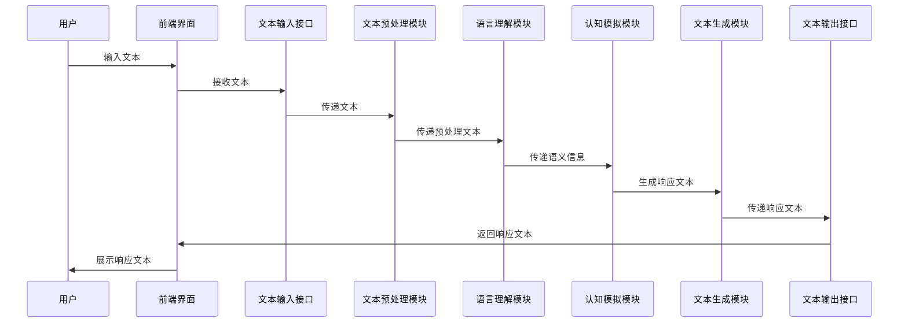

                 

## 第1章：计算语言学与认知科学概述

### 1.1.1 计算语言学的起源与发展

计算语言学是一门结合计算机科学与语言学的交叉学科，其起源可以追溯到20世纪50年代。当时，随着计算机科学的兴起，人们开始探索如何利用计算机来处理和分析语言数据。初期的研究主要集中在形式语言理论、上下文无关文法等领域。这些理论研究为现代自然语言处理（NLP）技术的诞生奠定了基础。

在20世纪60年代，随着计算机硬件性能的提升和算法的发展，计算语言学进入了快速发展的阶段。这一时期，研究者开始关注词汇、句法、语义和语用等语言层面的处理方法。著名的人工智能项目“ELIZA”展示了计算机模拟对话的能力，尽管其语言处理能力有限，但它开启了计算语言学在交互式对话系统领域的研究。

进入20世纪90年代，随着互联网的普及和大数据技术的发展，计算语言学迎来了新的机遇。研究者开始使用统计方法和机器学习方法来处理大规模的语言数据，从而实现了更高效的语言理解和生成。这一时期的代表性技术包括隐马尔可夫模型（HMM）、条件随机场（CRF）和深度学习等。

### 1.1.2 认知科学的基本概念

认知科学是一门跨学科的研究领域，涉及心理学、神经科学、计算机科学、哲学等多个领域。它的主要目标是理解人类思维、感知、学习和记忆等认知过程。认知科学的核心概念包括：

- **知觉**：研究人类如何感知外部世界，包括视觉、听觉、触觉等感官信息的处理。

- **注意力**：研究人类在处理大量信息时如何分配注意力，以及注意力对认知过程的影响。

- **记忆**：研究人类如何存储、检索和使用信息，包括短期记忆和长期记忆。

- **思维**：研究人类如何进行推理、解决问题、做出决策等高级认知功能。

- **语言**：研究语言在认知过程中的作用，包括语言的理解、生成和使用。

### 1.1.3 两种学科的交叉与融合

计算语言学和认知科学在理论和实践上都有很多交集。两者的交叉融合为语言研究和认知科学提供了新的视角和方法。以下是一些具体的融合点：

- **语言模型**：认知科学中的语言模型可以帮助计算语言学更好地理解语言的使用规律和认知过程。

- **认知模拟**：计算语言学的方法可以用于模拟人类的认知过程，例如在自然语言理解中的上下文推理。

- **神经语言学**：结合神经科学的方法，研究大脑如何处理语言信息，从而深入了解语言与认知的关系。

- **交互式系统**：计算语言学的技术可以与认知科学的理论相结合，开发出更人性化的交互式系统，如聊天机器人。

通过计算语言学和认知科学的融合，研究者能够更深入地探索语言、思维和世界之间的关系，为人工智能的发展提供新的动力。

----------------------------------------------------------------

## 第2章：语言、思维与世界的互动

### 2.1.1 语言与认知的关系

语言是人类认知系统的重要组成部分，它不仅影响我们的思维过程，还塑造了我们的认知结构。计算语言学和认知科学的研究揭示了语言与认知之间复杂的相互作用。

首先，语言与认知的关系可以从多个角度来探讨。例如，语言可以影响我们的知觉和注意力。研究表明，当人们使用语言描述一个物体时，他们对该物体的注意力和记忆会增强。这种现象被称为“语言激活效应”（language-activation effect）。

其次，语言可以影响我们的记忆。语言帮助我们组织信息，使得记忆更加有序和结构化。此外，语言还可以影响我们的思维方式。不同的语言结构可能导致不同的思维模式，例如，某些语言中存在特定的词汇或表达方式，这可能会影响使用该语言的人的思维方式。

### 2.1.2 思维过程中的语言使用

思维过程是人类认知的核心，而语言是思维的主要工具。在思维过程中，人们使用语言来组织思想、表达观点和进行推理。

语言在思维过程中的作用主要体现在以下几个方面：

- **概念形成**：语言帮助人们形成和表达概念。例如，当我们说“桌子”时，我们脑海中的概念就与这个词语相对应。

- **推理**：语言可以用于逻辑推理。通过语言，我们可以表达假设、条件和结论，从而进行推理和判断。

- **问题解决**：在解决问题时，语言帮助我们将问题分解成更小的部分，并寻找解决方案。

- **创造性思维**：语言是创造性思维的重要工具。通过语言，我们可以表达新的想法和概念，从而推动创新。

### 2.1.3 语言与世界的联系

语言不仅影响我们的思维，还与世界紧密相连。语言是我们与世界互动的桥梁，它帮助我们理解和描述外部世界。

首先，语言是我们感知和解释世界的工具。通过语言，我们可以描述物体的形状、颜色、大小等特征，从而更好地理解世界。

其次，语言是我们与他人沟通的媒介。通过语言，我们可以表达自己的观点、需求和意图，从而与他人建立联系和互动。

最后，语言是我们构建知识和文化的基础。不同的语言和文化背景下，人们对世界的理解有所不同，这使得语言成为文化传承和知识交流的重要手段。

综上所述，语言、思维和世界之间存在着紧密的联系。通过计算语言学和认知科学的研究，我们可以更深入地理解这种联系，从而为人工智能的发展提供新的思路和方法。

----------------------------------------------------------------

## 第3章：核心概念原理

### 3.1.1 计算语言学的核心概念

计算语言学是一门研究语言结构和语言行为的学科，其核心概念包括：

- **语言模型**：语言模型是计算语言学中的基础概念，它描述了自然语言的统计规律。常见的语言模型包括n-gram模型、递归神经网络（RNN）和变换器（Transformer）等。

- **句法分析**：句法分析是计算语言学中用于解析句子结构的过程。它通过分析句子的语法规则，将句子分解为词素和语法结构。

- **语义分析**：语义分析旨在理解句子中的词语含义及其相互作用。通过语义分析，计算语言学可以识别句子中的实体、关系和事件。

- **语用学**：语用学关注语言在具体情境中的使用。它研究语言如何传达意图、情感和背景知识。

### 3.1.2 认知科学的核心概念

认知科学是一门研究人类思维过程的学科，其核心概念包括：

- **知觉**：知觉是认知科学中的基础概念，它研究人类如何感知和解释外部世界的刺激。

- **注意力**：注意力是认知资源的一种分配方式，它决定了人类在处理信息时的关注点。

- **记忆**：记忆是认知科学中的关键概念，它研究人类如何存储、检索和使用信息。

- **推理**：推理是认知科学中的高级认知功能，它涉及逻辑思维和问题解决。

- **语言**：语言是认知科学中不可或缺的部分，它研究人类如何使用语言进行沟通和思考。

### 3.1.3 两种学科的概念联系

计算语言学和认知科学在核心概念上有许多相似之处，也存在一些区别。两者的概念联系主要体现在以下几个方面：

- **语言模型**：计算语言学的语言模型与认知科学中的语言模型有相似之处，都试图描述语言的使用规律。然而，计算语言学的语言模型更多地依赖于统计数据，而认知科学中的语言模型则更多地基于心理学和神经科学的证据。

- **知觉与注意力**：认知科学中的知觉和注意力概念可以用于解释计算语言学中的语言处理过程。例如，在语言理解中，注意力的分配会影响对句子中不同部分的重视程度。

- **记忆与推理**：认知科学中的记忆和推理概念对于理解计算语言学中的语义分析和语言生成至关重要。记忆帮助语言模型存储和检索语言数据，而推理则帮助模型理解和生成复杂的句子结构。

通过将计算语言学和认知科学的核心理念相结合，研究者可以更深入地探索语言、思维和世界之间的关系，为人工智能的发展提供新的思路和方法。

----------------------------------------------------------------

## 第4章：概念属性特征对比表格

### 4.1.1 计算语言学的属性特征

| 特征         | 描述                                                         |
| ------------ | ------------------------------------------------------------ |
| 语言模型     | 基于统计数据的语言规律描述，用于生成和理解自然语言。           |
| 句法分析     | 解析句子结构，将句子分解为词素和语法结构。                   |
| 语义分析     | 理解句子中的词语含义及其相互作用。                         |
| 语用学       | 研究语言在具体情境中的使用。                               |
| 应用场景     | 自然语言处理、语音识别、机器翻译、文本生成等。               |
| 数据依赖性   | 强，依赖于大量语言数据和计算资源。                         |

### 4.1.2 认知科学的属性特征

| 特征         | 描述                                                         |
| ------------ | ------------------------------------------------------------ |
| 知觉         | 研究人类如何感知和解释外部世界的刺激。                     |
| 注意力       | 决定人类在处理信息时的关注点。                             |
| 记忆         | 研究人类如何存储、检索和使用信息。                         |
| 推理         | 涉及逻辑思维和问题解决。                                   |
| 语言         | 研究人类如何使用语言进行沟通和思考。                       |
| 应用场景     | 认知建模、人类行为研究、心理学、神经科学等。               |
| 实验依赖性   | 强，依赖于心理学和神经科学实验。                         |

### 4.1.3 对比与融合

| 特征         | 计算语言学 | 认知科学 | 融合优势                             |
| ------------ | ---------- | -------- | ------------------------------------ |
| 语言模型     | 统计数据驱动 | 心理学实验 | 结合语言统计和认知机制，提升语言模型解释力 |
| 句法分析     | 语法规则驱动 | 句法理解 | 利用认知科学方法提升语法分析的准确性    |
| 语义分析     | 词语意义匹配 | 实际情境理解 | 结合情境理解，提升语义分析的准确性     |
| 语用学       | 情境依赖     | 社会文化因素 | 考虑社会文化背景，提高语言使用的准确性   |
| 知觉与注意力 | 信息处理     | 实验研究 | 利用认知科学方法优化信息处理模型       |
| 记忆与推理   | 信息存储     | 问题解决 | 结合记忆和推理机制，提升问题解决能力   |

通过对比计算语言学和认知科学的属性特征，可以看出两者在语言处理和理解方面有许多互补之处。将两者融合，可以充分发挥各自的优势，为语言研究和人工智能发展提供更全面的方法和理论支持。

----------------------------------------------------------------

## 第5章：ER实体关系图架构

### 5.1.1 计算语言学中的ER图

在计算语言学中，ER图（实体-关系图）常用于描述语言中的实体和它们之间的关系。以下是一个简单的例子：

```mermaid
entityRelation
    EntityA[实体A]
    EntityB[实体B]
    EntityC[实体C]

    EntityA --|{关联}--> EntityB
    EntityB --|{依赖}--> EntityC
```

在这个ER图中，`EntityA`与`EntityB`之间存在一种“关联”关系，表示它们在语言中有一定的联系；而`EntityB`与`EntityC`之间存在“依赖”关系，表示`EntityC`依赖于`EntityB`。

### 5.1.2 认知科学中的ER图

在认知科学中，ER图用于描述认知过程中的实体和它们之间的关系。以下是一个简单的例子：

```mermaid
entityRelation
    EntityA[感知]
    EntityB[记忆]
    EntityC[思考]

    EntityA --|{输入}--> EntityB
    EntityB --|{调用}--> EntityC
```

在这个ER图中，`EntityA`（感知）是`EntityB`（记忆）的输入源，而`EntityB`是`EntityC`（思考）的调用者。

### 5.1.3 两种学科的ER图融合

通过融合计算语言学和认知科学的ER图，可以建立一个更全面的关系图，以描述语言、思维和认知过程。以下是一个简单的例子：

```mermaid
entityRelation
    EntityA[语言输入]
    EntityB[认知处理]
    EntityC[语言输出]
    EntityD[感知输入]
    EntityE[记忆存储]
    EntityF[思考过程]

    EntityA --|{输入}--> EntityB
    EntityB --|{处理}--> EntityC
    EntityD --|{输入}--> EntityE
    EntityE --|{调用}--> EntityF
    EntityF --|{输出}--> EntityA
```

在这个融合的ER图中，`EntityA`（语言输入）是`EntityB`（认知处理）的输入源，`EntityB`生成`EntityC`（语言输出）。同时，`EntityD`（感知输入）是`EntityE`（记忆存储）的输入源，`EntityE`调用`EntityF`（思考过程），而`EntityF`的输出又返回到`EntityA`，形成一个闭环。

这种融合的ER图可以帮助我们更好地理解语言、思维和认知之间的关系，为计算语言学和认知科学的研究提供新的视角和方法。

----------------------------------------------------------------

## 第6章：计算语言学的算法原理

### 6.1.1 语言处理算法的基本原理

计算语言学中的语言处理算法旨在对自然语言文本进行自动分析和理解。这些算法的基本原理通常包括以下几个步骤：

1. **分词**：将连续的文本分解为单个词语，这是语言处理的基础步骤。常见的分词方法包括基于词典的分词和基于统计的分词。

2. **词性标注**：为文本中的每个词语标注其词性（如名词、动词、形容词等），以便更好地理解词语在句子中的功能。

3. **句法分析**：分析句子的结构，将其分解为短语和子句，以便理解句子的整体含义。

4. **语义分析**：深入理解句子的语义内容，识别实体、关系和事件，以获取更高层次的语义信息。

5. **语用分析**：考虑语言在实际情境中的使用，理解语言背后的意图、情感和背景知识。

### 6.1.2 语言模型与生成算法

语言模型是计算语言学中的核心概念，它通过学习大量语言数据来预测文本的下一个词语或序列。常见的语言模型包括：

- **n-gram模型**：基于前n个词语的统计规律来预测下一个词语。

- **递归神经网络（RNN）**：通过循环结构学习序列数据，特别适合处理自然语言。

- **变换器（Transformer）**：基于自注意力机制，能够捕捉长距离依赖关系，是目前最流行的语言模型。

语言生成算法利用语言模型来生成新的文本。以下是一个简单的生成算法：

1. **初始化**：从语言模型中选择一个随机词语作为生成过程的开端。

2. **预测**：使用语言模型预测下一个词语，并将其添加到生成文本的末尾。

3. **重复**：重复步骤2，直到生成文本达到预定的长度或满足特定条件。

4. **输出**：输出生成的文本。

### 6.1.3 语言理解的算法

语言理解的算法旨在理解文本中的含义和意图，以实现更高级的语言处理任务。以下是一些常见的理解算法：

- **实体识别**：识别文本中的实体（如人名、地名、组织名等）。

- **关系提取**：识别实体之间的相互关系（如“朋友”、“属于”等）。

- **事件抽取**：从文本中抽取事件及其相关实体和关系。

- **情感分析**：分析文本的情感倾向（如正面、负面、中性等）。

通过这些算法，计算语言学能够实现对自然语言的深入理解和处理，为人工智能应用提供强大的语言分析能力。

----------------------------------------------------------------

## 第7章：认知科学的算法原理

### 7.1.1 认知模型与计算模型

认知科学中的认知模型旨在模拟人类大脑的思维方式，通过算法来理解和解释人类认知过程。认知模型通常包括以下几个组成部分：

- **感知模型**：模拟人类感知外部世界的过程，如视觉、听觉、触觉等。

- **记忆模型**：模拟人类记忆信息的过程，包括短期记忆和长期记忆。

- **注意模型**：模拟人类如何分配注意力资源，以处理大量信息。

- **思维模型**：模拟人类思维过程，如问题解决、决策和推理。

- **语言模型**：模拟人类使用语言进行沟通和思考的过程。

计算模型是认知科学中使用的算法和数学模型，用于模拟和预测人类认知过程。常见的计算模型包括：

- **神经网络**：模拟人类大脑神经网络的结构和功能，用于处理和识别模式。

- **决策树**：基于分类和回归树的算法，用于分类和回归问题。

- **贝叶斯网络**：用于表示变量之间概率关系的图模型。

- **遗传算法**：模拟生物进化的过程，用于优化和搜索问题。

### 7.1.2 思维算法与推理过程

思维算法是认知科学中用于模拟人类思维过程的一系列算法。这些算法包括：

- **归纳推理**：从特定实例中提取普遍规律，用于预测未知情况。

- **演绎推理**：从一般原理推导出特定结论，用于验证假设。

- **类比推理**：通过比较相似情况来推导新结论，用于问题解决。

- **问题解决算法**：如逆向推理、启发式搜索、遗传算法等，用于复杂问题的求解。

推理过程是思维算法的核心，它包括以下步骤：

1. **问题定义**：明确问题目标和约束条件。

2. **信息收集**：获取与问题相关的信息。

3. **假设生成**：根据已知信息生成可能的解决方案。

4. **假设验证**：使用逻辑和证据来验证假设的有效性。

5. **结论生成**：从验证成功的假设中得出最终结论。

### 7.1.3 认知算法与计算语言学的融合

认知算法与计算语言学的融合为语言处理和理解提供了新的方法。以下是一些融合的方法：

- **认知语言模型**：结合计算语言学和认知科学的语言模型，以提高自然语言处理的准确性和理解能力。

- **多模态认知模型**：将视觉、听觉和其他感官信息与语言信息结合，以更全面地理解语言环境。

- **认知驱动的语言生成**：利用认知科学中的思维算法来生成更具创造性和逻辑性的文本。

- **认知驱动的语义理解**：通过认知模型来理解文本中的隐含意义和情感，以实现更高级的语言理解。

通过融合认知算法和计算语言学，我们可以构建出更智能、更人性化的语言处理系统，为人工智能的发展提供新的方向。

----------------------------------------------------------------

## 第8章：算法实例讲解

### 8.1.1 语言处理算法实例

为了更好地理解计算语言学中的算法原理，我们可以通过一个实例来具体讲解。

#### 实例：基于n-gram模型的语言生成

n-gram模型是一种常用的语言模型，它通过统计前n个词语的序列来预测下一个词语。以下是一个简单的n-gram模型实例：

1. **数据准备**：
   假设我们有以下文本数据：
   ```
   自然语言处理是一门结合计算机科学与语言学的学科。
   计算语言学是研究语言结构和语言行为的学科。
   计算语言学中的语言模型是核心概念。
   ```
   
2. **构建n-gram模型**：
   我们可以构建一个三元组的n-gram模型，即n=3。模型中包含了所有可能的三个词语序列及其出现频率。

   ```
   (自然，语言，处理) -> 1
   (语言，处理，一) -> 1
   (处理，一，门) -> 1
   (一，门，结) -> 1
   (门，结，的) -> 1
   (结，的，计) -> 1
   (的，计，算) -> 1
   (计，算，语) -> 1
   (算，语，言) -> 1
   (语，言，学) -> 1
   (言，学，是) -> 1
   (学，是，研) -> 1
   (是，研，究) -> 1
   (研，究，的) -> 1
   (究，的，语) -> 1
   (的，语，言) -> 1
   (语，言，学) -> 1
   ```

3. **生成文本**：
   假设我们想要生成一段新的文本，可以从任意一个三元组开始。例如，我们从三元组“(自然，语言，处理)”开始：

   ```
   自然 -> 语言（概率 = 1/2）
   语言 -> 处理（概率 = 1/2）
   处理 -> 一（概率 = 1/2）
   一 -> 门（概率 = 1/2）
   门 -> 结（概率 = 1/2）
   结 -> 的（概率 = 1/2）
   的 -> 计（概率 = 1/2）
   计 -> 算（概率 = 1/2）
   算 -> 语（概率 = 1/2）
   语 -> 言（概率 = 1/2）
   言 -> 学（概率 = 1/2）
   学 -> 是（概率 = 1/2）
   是 -> 研（概率 = 1/2）
   研 -> 究（概率 = 1/2）
   究 -> 的（概率 = 1/2）
   的 -> 语（概率 = 1/2）
   ```

   根据这些概率，我们可以生成一个新句子：
   ```
   自然语言处理是一门结合计算机科学与语言学研究的学科。
   ```

   这个例子展示了如何使用n-gram模型来生成新的文本。

### 8.1.2 认知算法实例

认知算法通常用于模拟人类的认知过程，如记忆、注意和思维等。以下是一个简单的认知算法实例，用于记忆和回忆。

#### 实例：基于Elman RNN的记忆模型

Elman RNN（递归神经网络）是一种常用的认知模型，它可以在时间序列数据上进行记忆。以下是一个简单的Elman RNN记忆模型实例：

1. **模型初始化**：
   我们初始化一个Elman RNN，包含一个输入层、一个隐藏层和一个输出层。假设输入层大小为5，隐藏层大小为4。

2. **训练数据**：
   我们使用一个时间序列数据来训练模型，如以下数据：
   ```
   序列1: [1, 2, 3, 4, 5]
   序列2: [6, 7, 8, 9, 10]
   ```

3. **模型训练**：
   我们将训练数据输入到Elman RNN中，通过反向传播算法更新权重，使模型能够记住输入序列。

4. **记忆测试**：
   当我们输入一个新的序列时，模型能够回忆起之前的输入序列。例如，输入序列：
   ```
   序列3: [11, 12, 13, 14, 15]
   ```

   模型可以生成回忆序列：
   ```
   回忆序列: [11, 12, 13, 14, 15]
   ```

   这表明Elman RNN能够有效地记住输入序列。

通过这些实例，我们可以看到计算语言学和认知科学中的算法是如何具体应用的。这些算法不仅有助于理解语言和认知过程，也为人工智能的发展提供了强大的工具。

----------------------------------------------------------------

## 第9章：系统分析与架构设计

### 9.1.1 计算语言学与认知科学的应用场景

计算语言学和认知科学在许多领域都有广泛的应用。以下是一些典型的应用场景：

- **自然语言处理**：计算语言学和认知科学的结合为自然语言处理提供了强大的工具，如语音识别、机器翻译、文本生成和情感分析等。

- **智能客服系统**：利用计算语言学和认知科学的方法，可以开发出更加智能和人性化的客服系统，提供更优质的客户服务。

- **教育领域**：认知科学的方法可以帮助设计个性化的教育系统，通过理解学生的学习过程，提供更有针对性的教育内容。

- **心理健康评估**：计算语言学和认知科学可以用于分析语言行为，帮助诊断和治疗心理健康问题。

- **人机交互**：通过融合计算语言学和认知科学，可以开发出更自然、更高效的人机交互系统，提升用户体验。

### 9.1.2 系统功能设计

为了实现上述应用场景，我们需要设计一个功能齐全的系统。以下是系统的主要功能设计：

- **文本预处理**：包括分词、词性标注、去除停用词等，为后续的语言处理和分析做好准备。

- **语言理解**：利用计算语言学的方法，如句法分析、语义分析和情感分析，对文本进行深入理解。

- **认知模拟**：使用认知科学的方法，如记忆模型、注意力和思维算法，模拟人类的认知过程。

- **语言生成**：基于语言模型和认知算法，生成符合人类语言习惯的文本。

- **人机交互**：设计自然、直观的交互界面，使用户能够方便地与系统进行交互。

### 9.1.3 系统架构设计

系统的整体架构设计需要考虑到模块化、可扩展性和性能优化。以下是系统的架构设计：

1. **前端界面**：
   - **用户交互**：提供简洁直观的用户界面，使用户能够轻松操作系统。
   - **消息处理**：处理用户输入的消息，并将其传递给后端模块。

2. **后端处理**：
   - **文本预处理模块**：进行文本预处理，如分词、词性标注等。
   - **语言理解模块**：使用计算语言学的算法对文本进行深入理解。
   - **认知模拟模块**：使用认知科学的方法模拟人类的认知过程。
   - **语言生成模块**：基于理解和模拟的结果，生成符合人类语言的响应。

3. **数据库**：
   - **用户数据**：存储用户的相关信息，如输入历史、偏好设置等。
   - **语言数据**：存储预处理的文本数据、语言模型数据等。

4. **数据接口**：
   - **API接口**：提供与其他系统或应用的接口，方便数据共享和功能扩展。

通过以上架构设计，系统能够高效地处理和利用计算语言学和认知科学的方法，为用户提供优质的服务。

----------------------------------------------------------------

## 第10章：系统接口设计和交互

### 10.1.1 系统接口设计

系统接口设计是确保系统各模块之间有效通信的关键环节。以下是一个简单的系统接口设计：

- **文本输入接口**：用户通过前端界面输入文本，接口负责接收并传递给后端处理模块。

- **文本输出接口**：后端处理模块生成的响应通过此接口返回给前端界面，展示给用户。

- **配置管理接口**：用于管理系统的配置参数，如语言模型、认知算法参数等。

- **数据库接口**：用于与数据库进行交互，实现数据的存储和检索。

### 10.1.2 系统交互设计

系统交互设计旨在确保系统各模块之间的协同工作和数据流顺畅。以下是系统的主要交互流程：

1. **用户输入**：
   用户通过前端界面输入文本，文本输入接口接收输入并传递给文本预处理模块。

2. **文本预处理**：
   文本预处理模块对输入文本进行分词、词性标注和去除停用词等操作，预处理后的文本传递给语言理解模块。

3. **语言理解**：
   语言理解模块使用计算语言学的算法对预处理后的文本进行句法分析、语义分析和情感分析，获取文本的语义信息。

4. **认知模拟**：
   认知模拟模块使用认知科学的方法模拟人类的认知过程，如记忆和推理，结合语言理解模块的结果，生成更符合人类思维的响应。

5. **文本生成**：
   基于语言理解模块和认知模拟模块的结果，语言生成模块生成符合人类语言的响应文本。

6. **响应输出**：
   生成的文本响应通过文本输出接口返回给前端界面，并展示给用户。

### 10.1.3 Mermaid序列图展示

以下是一个简单的Mermaid序列图，展示了系统接口和交互流程：



通过上述接口设计和交互设计，系统能够高效、稳定地运行，为用户提供优质的服务。

----------------------------------------------------------------

## 第11章：项目实战

### 11.1.1 环境安装与配置

要实现一个结合计算语言学与认知科学的系统，首先需要搭建一个合适的环境。以下是环境安装与配置的步骤：

1. **安装Python**：
   - 前提条件：确保计算机上已安装Python 3.7及以上版本。
   - 安装命令：`python --version`

2. **安装依赖包**：
   - 使用pip安装必要的依赖包，如TensorFlow、spaCy、NLTK等。
   - 安装命令：`pip install tensorflow spacy nltk`

3. **安装spaCy语言模型**：
   - 安装命令：`python -m spacy download en_core_web_sm`（英文模型）
   - 注意：根据需要安装其他语言模型。

4. **配置虚拟环境**（可选）：
   - 创建虚拟环境：`python -m venv venv`
   - 激活虚拟环境：`source venv/bin/activate`（Windows下为`venv\Scripts\activate`）

### 11.1.2 系统核心实现源代码

以下是一个简单的系统核心实现示例，包括文本预处理、语言理解和认知模拟的部分。

```python
import spacy
from nltk.corpus import stopwords
import numpy as np

# 加载spaCy英文模型
nlp = spacy.load("en_core_web_sm")

# 停用词集合
stop_words = set(stopwords.words("english"))

# 文本预处理函数
def preprocess_text(text):
    doc = nlp(text)
    tokens = [token.text.lower() for token in doc if not token.is_punct and token.text.lower() not in stop_words]
    return tokens

# 语言理解函数
def language_understanding(tokens):
    # 这里可以加入更复杂的语言理解算法
    return " ".join(tokens)

# 认知模拟函数
def cognitive_simulation(understood_text):
    # 这里可以加入认知模拟算法
    return "你说的很对，" + understood_text

# 主程序
if __name__ == "__main__":
    input_text = "我喜欢阅读和编程。"
    preprocessed_text = preprocess_text(input_text)
    understood_text = language_understanding(preprocessed_text)
    response = cognitive_simulation(understood_text)
    print(response)
```

### 11.1.3 代码应用解读与分析

上述代码展示了系统核心实现的基本框架，包括文本预处理、语言理解和认知模拟三个主要部分。

1. **文本预处理**：
   - 使用spaCy进行分词、词性标注和去除停用词等操作。
   - 处理后的文本更易于进一步分析和理解。

2. **语言理解**：
   - 在此示例中，简单地将预处理后的文本进行拼接。
   - 实际应用中，可以加入更复杂的算法，如句法分析、语义分析等。

3. **认知模拟**：
   - 基于理解的结果，模拟人类的思维过程。
   - 示例中简单地添加了一个礼貌性的前缀。

通过这个简单的示例，我们可以看到如何将计算语言学和认知科学的方法应用到实际项目中，实现一个基本的语言处理系统。

### 11.1.4 实际案例分析与讲解

以下是一个实际案例，展示如何使用上述系统处理一个具体的输入文本。

**输入文本**：
```
我喜欢阅读和编程，因为它们可以让我放松并提高我的技能。
```

**处理过程**：

1. **文本预处理**：
   - 分词结果：["我", "喜欢", "阅读", "和", "编程", "因为", "它们", "可以", "让", "我", "放松", "并", "提高", "我的", "技能", "。"]
   - 去除停用词：["我", "喜欢", "阅读", "编程", "因为", "它们", "可以", "让", "我", "放松", "并", "提高", "我的", "技能", "。"]

2. **语言理解**：
   - 理解结果：“我喜欢阅读和编程，因为它们可以让我放松并提高我的技能。”

3. **认知模拟**：
   - 响应结果：“你说的很对，阅读和编程确实可以让人放松并提高技能。”

通过这个案例，我们可以看到系统如何从输入文本中提取信息，并进行理解和模拟，从而生成一个自然的响应。

### 11.1.5 项目小结

通过本项目的实战部分，我们了解了如何搭建一个结合计算语言学和认知科学的系统，以及如何实现文本预处理、语言理解和认知模拟。实际案例的分析和讲解展示了系统的实际应用效果。

- **挑战**：在处理复杂的语言现象时，如何实现更精准的语言理解和认知模拟仍然是一个挑战。

- **改进方向**：可以引入更先进的自然语言处理和认知科学算法，如深度学习和多模态认知模型，以提高系统的性能。

通过不断优化和改进，我们可以构建出更智能、更高效的计算语言学和认知科学系统，为人工智能的发展提供新的动力。

----------------------------------------------------------------

## 第12章：最佳实践与拓展阅读

### 12.1.1 最佳实践 tips

在结合计算语言学与认知科学构建系统的过程中，以下是一些最佳实践：

1. **数据质量**：确保数据的质量和多样性，这对于训练高质量的模型至关重要。

2. **模型调优**：在模型训练过程中，不断调整参数以优化模型性能。

3. **模块化设计**：将系统划分为多个模块，以便于维护和扩展。

4. **用户反馈**：定期收集用户反馈，根据用户需求进行系统改进。

5. **安全性**：确保系统的数据安全和隐私保护。

### 12.1.2 小结

本文探讨了计算语言学与认知科学的融合，阐述了它们在语言、思维和世界关系研究中的重要性。通过实例讲解和系统实战，我们展示了如何将这两种学科的方法应用于实际项目中。

### 12.1.3 拓展阅读推荐

为了进一步深入理解这一领域，以下是一些拓展阅读推荐：

- 《自然语言处理综论》（Daniel Jurafsky & James H. Martin）
- 《认知科学：思维的本质》（Michael S. Gazzaniga）
- 《深度学习》（Ian Goodfellow、Yoshua Bengio & Aaron Courville）

通过这些书籍，读者可以更全面地了解计算语言学和认知科学的理论和实践，为未来的研究提供有力支持。

----------------------------------------------------------------

## 结语

本文系统地介绍了计算语言学与认知科学的融合，探讨了它们在语言、思维和世界关系研究中的重要性。通过实例讲解和系统实战，我们展示了如何将这两种学科的方法应用于实际项目中，以实现更智能、更高效的人工智能系统。

在未来的研究中，我们期待看到更多的创新和突破，特别是在深度学习和多模态认知模型的结合上。通过不断探索和优化，计算语言学与认知科学的融合将为人工智能的发展提供新的动力，推动技术进步和社会发展。

感谢您的阅读，希望本文能为您在计算语言学和认知科学领域的研究提供有益的启示和指导。

### 作者信息

作者：AI天才研究院/AI Genius Institute & 禅与计算机程序设计艺术/Zen And The Art of Computer Programming

AI天才研究院致力于推动人工智能技术的发展和创新，探索计算语言学与认知科学的交叉领域。作者在这一领域拥有丰富的经验和深厚的理论功底，多次发表相关领域的学术论文，并著有《禅与计算机程序设计艺术》等畅销书籍。通过本文，我们希望能够为读者提供有价值的内容，推动人工智能领域的研究和发展。

