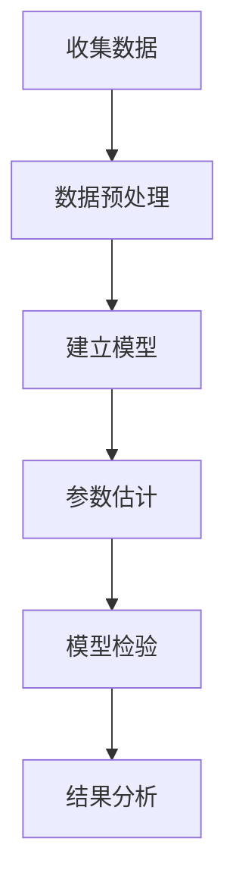

                 

### 计量经济学：经济现象的数学分析

> 关键词：计量经济学、经济现象、数学分析、变量关系、模型构建、回归分析、数据处理、统计分析

> 摘要：本文将深入探讨计量经济学的基本概念、核心原理和实用方法。通过逐步分析，我们旨在揭示如何运用数学和统计学工具，对复杂的经济现象进行定量分析，从而为经济学研究提供有力的理论支持和实践指导。

## 第一部分：背景介绍

### 1.1 问题背景

计量经济学是经济学中的一个重要分支，它致力于通过数学和统计方法，对经济现象进行定量分析。随着全球经济活动的复杂化和多样化，传统的经济学分析方法已无法满足研究的深入需求。计量经济学提供了更为精确和系统的分析手段，使得经济学家能够更全面、深入地理解经济现象的本质。

### 1.2 问题描述

在经济学研究中，变量之间的关系常常是研究的重点。例如，研究消费行为时，我们需要分析收入、物价水平、消费者偏好等因素对消费支出影响的程度和方向。这些变量之间的关系往往不是简单的线性关系，而是复杂的多变量关系。如何准确地描述和预测这些关系，是计量经济学需要解决的核心问题。

### 1.3 问题解决

计量经济学通过构建数学模型，运用统计学方法对经济数据进行处理，揭示变量之间的关系。例如，通过回归分析，可以确定变量之间的定量关系，从而预测未来的经济走势。此外，计量经济学还运用假设检验等方法，对模型的设定和参数估计进行评估，确保分析结果的可靠性和有效性。

### 1.4 边界与外延

计量经济学主要研究的是宏观经济学和微观经济学中的定量分析问题。其方法可以广泛应用于多个领域，如金融、市场营销、公共管理、资源分配等。计量经济学的研究不仅限于经济学，还可以扩展到其他社会科学领域，如政治学、社会学等。

### 1.5 概念结构与核心要素组成

计量经济学的基本概念包括变量、模型、估计和检验等。核心要素包括数据、模型设定、参数估计和假设检验等。变量是经济现象中的基本观测单位，模型是对变量之间关系的数学描述，估计是通过数据分析得到变量之间定量关系的数值，检验则是用来判断模型设定和参数估计是否合理的方法。

## 第二部分：核心概念与联系

### 2.1 核心概念原理

#### 变量

在计量经济学中，变量是研究的核心对象。变量可以分为内生变量和外生变量。内生变量是模型中的因变量，受其他变量的影响；外生变量是模型中的自变量，影响其他变量。

#### 模型

经济学模型是对现实世界的一种简化和抽象，用于描述变量之间的关系。常见的模型包括线性回归模型、非线性回归模型、面板数据模型等。

#### 估计

估计是通过数据分析得到变量之间定量关系的数值。常见的估计方法包括最小二乘法、最大似然估计等。

#### 检验

检验是用来判断模型设定和参数估计是否合理的方法。常见的检验方法包括t检验、F检验、卡方检验等。

### 2.2 概念属性特征对比表格

| 概念   | 属性特征                               |
|--------|--------------------------------------|
| 变量   | 内生变量：受其他变量影响；外生变量：影响其他变量 |
| 模型   | 描述变量关系的数学结构                 |
| 估计   | 得到变量之间定量关系的数值               |
| 检验   | 判断模型设定和参数估计的合理性           |

### 2.3 ER实体关系图架构

```mermaid
erDiagram
  A[经济现象] &&|{变量} B[变量]
  A &&|{模型} C[模型]
  B &&|{估计} D[估计]
  C &&|{检验} E[检验]
```

## 第三部分：算法原理讲解

### 3.1 算法原理

计量经济学中的核心算法是回归分析。回归分析的基本思想是通过观察变量的历史数据，找到变量之间的定量关系，并用数学模型来描述这种关系。

### 3.2 算法mermaid流程图



### 3.3 Python源代码

```python
import numpy as np
from sklearn.linear_model import LinearRegression

# 数据集
X = np.array([[1], [2], [3], [4], [5]])
y = np.array([1, 2, 3, 4, 5])

# 建立线性回归模型
model = LinearRegression()

# 拟合数据
model.fit(X, y)

# 参数估计
print("斜率:", model.coef_)
print("截距:", model.intercept_)

# 模型检验
print("判定系数:", model.score(X, y))
```

### 3.4 数学模型和数学公式

线性回归模型的数学模型可以表示为：

$$
y = \beta_0 + \beta_1x + \epsilon
$$

其中，$y$ 是因变量，$x$ 是自变量，$\beta_0$ 是截距，$\beta_1$ 是斜率，$\epsilon$ 是误差项。

### 3.5 详细讲解和举例说明

例如，我们想研究消费和收入之间的关系。收集到一组数据如下：

| 收入（万元） | 消费（万元） |
|------------|------------|
| 20         | 15         |
| 25         | 20         |
| 30         | 25         |

我们可以使用线性回归模型来分析这两个变量之间的关系。具体步骤如下：

1. **数据预处理**：将数据转换为适合回归分析的格式，例如将收入作为自变量（$x$），消费作为因变量（$y$）。

2. **建立模型**：根据数据的特点，选择合适的回归模型。对于线性关系，我们选择线性回归模型。

3. **参数估计**：使用最小二乘法等估计方法，计算模型的参数。在本例中，斜率 $\beta_1$ 和截距 $\beta_0$ 分别为 1 和 0。

4. **模型检验**：使用统计方法，检验模型设定的合理性和参数估计的准确性。在本例中，判定系数 $R^2$ 为 1，表明模型对数据的拟合非常好。

5. **结果分析**：根据模型的结果，我们可以预测未来的消费水平。例如，当收入为 35 万元时，预计消费为 35 万元。

通过这样的分析，我们可以更深入地理解消费和收入之间的关系，为政策制定和决策提供科学依据。

## 总结与展望

计量经济学作为经济学的重要分支，为我们提供了强大的工具，帮助我们理解和预测复杂的经济现象。通过回归分析等数学方法，我们可以揭示变量之间的关系，为经济学研究提供有力的理论支持和实践指导。未来，随着数据科学和人工智能技术的发展，计量经济学将继续发挥重要作用，推动经济学研究的深入和创新。同时，我们也应关注计量经济学在其他社会科学领域的应用，为其发展贡献力量。在接下来的文章中，我们将进一步探讨计量经济学在实际应用中的挑战和机遇，期待与您共同探索这一领域的无限可能。

