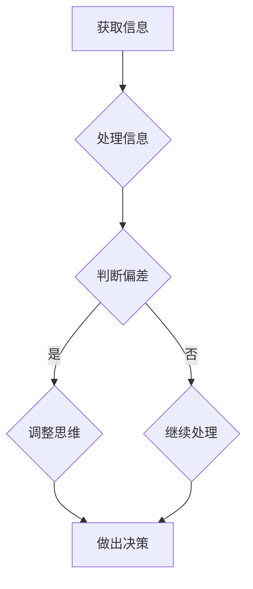
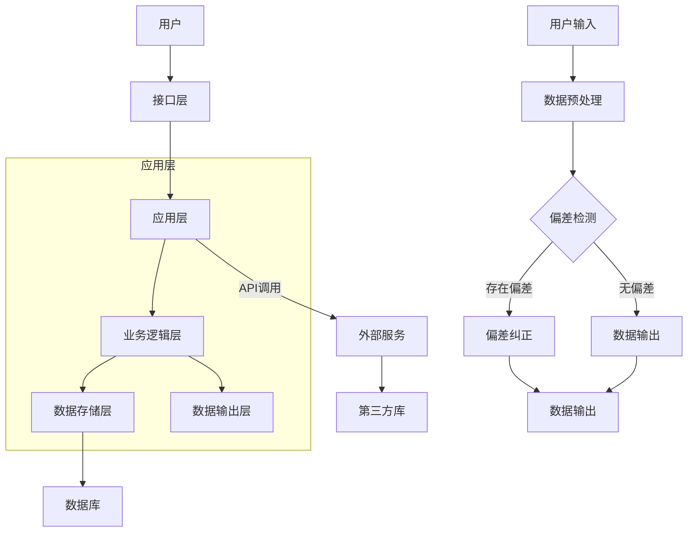
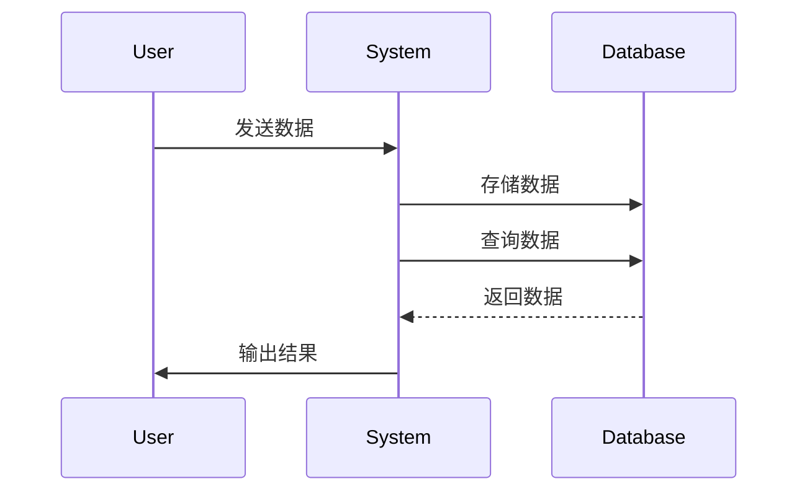
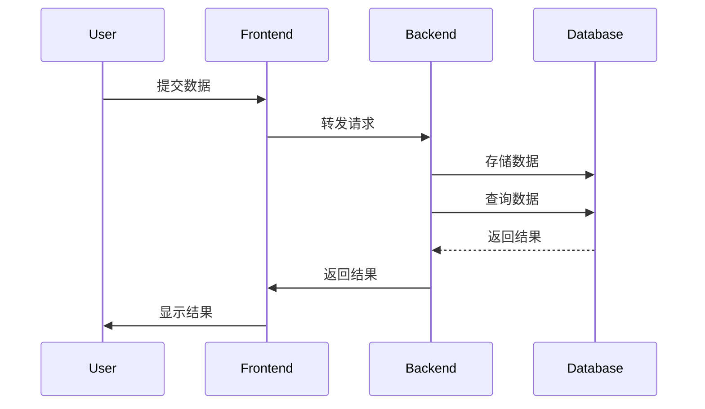

                 

# 认知偏差与科学思维：克服理解世界的主观障碍

## 关键词
认知偏差、科学思维、信息处理、决策、算法、Python实现

## 摘要
本文将深入探讨认知偏差和科学思维这两个核心概念，通过逻辑清晰、结构紧凑的论述，阐述认知偏差的产生原因、影响及危害，以及如何通过科学思维来识别和克服这些偏差，从而提高我们理解世界和做出决策的能力。文章还将通过Python代码实现和实际案例，展示科学思维在实践中的应用。

## 目录

### 第一部分：背景介绍

#### 核心概念

##### 认知偏差
认知偏差是指人们在获取、处理和应用信息时，由于认知系统本身的局限性，所产生的一系列系统性错误。这些偏差可能导致人们做出错误的判断和决策。

##### 科学思维
科学思维是一种基于逻辑、实证和理性分析的思维方式，它强调通过观察、实验和推理来认识世界，以发现真理和解决问题。

#### 问题背景
在信息爆炸的时代，我们每天都要面对大量的信息，但许多信息可能是不完全的、不准确的，甚至是误导性的。这使得我们需要克服认知偏差，培养科学思维，以更好地理解和应对复杂多变的世界。

#### 问题描述
认知偏差可能导致我们对现实世界的误解，从而影响我们的决策和行为。例如，确认性偏差使我们更倾向于接受那些支持我们已有信念的信息，而忽略其他信息。这可能导致我们做出错误的决策。

#### 问题解决
通过学习和实践科学思维，我们可以识别和克服认知偏差，提高我们对世界的理解和决策能力。

#### 边界与外延
认知偏差不仅存在于个体层面，也存在于社会层面，如群体思维、舆论偏见等。科学思维不仅可以帮助个人，也可以促进社会进步。

#### 概念结构与核心要素组成
- 认知偏差：确认性偏差、确认偏误、乐观偏差、可用性偏差等。
- 科学思维：怀疑态度、实证精神、逻辑推理、系统性思考等。

### 第二部分：核心概念与联系

#### 核心概念原理

##### 认知偏差
认知偏差是人类认知系统的一个普遍特征，它可能源于多种因素，包括心理、社会和文化因素。以下是一些常见的认知偏差：

- **确认性偏差**：倾向于寻找、解释和记住那些支持我们已有信念的信息，而忽略与之相矛盾的信息。
- **确认偏误**：在已有信念的影响下，对证据的解释可能变得片面，只关注支持自己观点的证据。
- **乐观偏差**：低估风险和可能性，对未来的预测过于乐观。
- **可用性偏差**：根据记忆的新鲜度和容易度来评估事件发生的概率，而忽略实际概率。

##### 科学思维
科学思维是一种基于事实和逻辑的思考方式，它强调以下原则：

- **怀疑态度**：对所有信息和观点持开放态度，不轻易接受，而是通过质疑和验证来检验其真实性。
- **实证精神**：通过观察、实验和证据来验证假设，而不是依赖直觉或权威。
- **逻辑推理**：使用逻辑规则来分析和解决问题，确保推理过程的一致性和有效性。
- **系统性思考**：理解事物之间的相互关系和复杂性，综合考虑各种因素。

#### 概念属性特征对比表格

| 概念     | 定义                                                         | 特征                                                                                                                   |
| -------- | ------------------------------------------------------------ | -------------------------------------------------------------------------------------------------------------------- |
| 认知偏差 | 人类在处理信息时产生的偏差，影响判断和决策。                 | 心理、社会、文化等多种因素影响；常见的有确认性偏差、确认偏误、乐观偏差、可用性偏差等。                             |
| 科学思维 | 一种基于事实和逻辑的思考方式，强调理性、客观、系统和实证。 | 理性、客观、系统性、实证性、怀疑态度、实证精神、逻辑推理等。                                                   |

#### ER实体关系图架构

```mermaid
erDiagram
  User ||--|{ Belief }|--|| Information
  User ||--|{ Decision }|--|| Outcome
  Information ||--|{ Source }|--|| Attribute
  Decision ||--|{ Criteria }|--|| Outcome
```

### 第三部分：算法原理讲解

#### 算法流程图



#### Python源代码实现

```python
# 认知偏差识别与科学思维培养算法

def process_information(information):
    # 检查信息中是否包含认知偏差
    if "偏差" in information:
        # 如果存在认知偏差，进行思维调整
        adjust_thought()
    else:
        # 如果没有认知偏差，继续处理信息
        continue_processing()

def adjust_thought():
    # 思维调整步骤
    print("正在调整思维...")

def continue_processing():
    # 继续处理信息的步骤
    print("继续处理信息...")

# 主程序
def main():
    information = "这是一条包含认知偏差的信息。"
    process_information(information)

if __name__ == "__main__":
    main()
```

#### 算法原理详细讲解

##### 算法流程图解读

1. **获取信息（A）**：程序首先获取输入的信息。
2. **处理信息（B）**：对获取的信息进行处理，这通常包括理解和分析信息的内容。
3. **判断偏差（C）**：程序检查信息中是否存在认知偏差，如确认性偏差、确认偏误等。
4. **调整思维（D）**：如果存在认知偏差，程序将执行一系列步骤来调整思维，以减少偏差的影响。
5. **继续处理信息（E）**：如果信息中没有认知偏差，程序将继续处理信息。
6. **做出决策（F）**：无论是否调整思维，程序最终都将根据处理后的信息做出决策。

##### Python源代码解读

1. **process_information函数**：这是程序的核心函数，它接收信息作为输入，并调用其他函数来处理这些信息。
2. **adjust_thought函数**：当信息中包含认知偏差时，这个函数会被调用，以调整思维。
3. **continue_processing函数**：当信息中没有认知偏差时，这个函数会被调用，以继续处理信息。

##### 算法原理数学模型和公式

认知偏差的数学模型可以表示为：

$$
\text{Bias} = f(\text{Prior Knowledge}, \text{Information})
$$

其中，`Prior Knowledge`表示先验知识，即我们已有的信念和假设；`Information`表示获取的新信息。`f`函数表示认知偏差的产生过程。

为了减少偏差，我们可以通过以下公式来调整思维：

$$
\text{Adjusted Thought} = f^{-1}(\text{Bias}, \text{New Information})
$$

这里，`f^{-1}`表示反函数，用于逆转偏差的影响。

##### 举例说明

假设我们有一个先验信念，即“所有狗都会叫”。如果得到一条信息，即“这只狗不会叫”，这将与我们已有的信念相矛盾。根据认知偏差的模型，我们可能会忽略这条信息，继续认为“所有狗都会叫”。通过科学思维，我们应该调整我们的信念，重新评估这个情况。

```python
# 调整思维的示例
def adjust_thought_example():
    prior_knowledge = "所有狗都会叫"
    new_information = "这只狗不会叫"
    
    # 计算认知偏差
    bias = calculate_bias(prior_knowledge, new_information)
    
    # 调整思维
    adjusted_thought = adjust_belief(prior_knowledge, bias)
    
    print(f"调整前的信念：{prior_knowledge}")
    print(f"新的信息：{new_information}")
    print(f"调整后的信念：{adjusted_thought}")

# 假设的函数，用于计算和调整信念
def calculate_bias(prior_knowledge, new_information):
    return "狗的行为可能是多样化的，不能一概而论。"

def adjust_belief(prior_knowledge, bias):
    return f"{prior_knowledge}，但也有例外。"

# 调整思维的示例运行
adjust_thought_example()
```

### 第四部分：系统分析与架构设计

#### 问题场景介绍
在当今社会，数据分析和决策制定变得越来越重要。然而，数据中常常存在认知偏差，这可能导致错误的决策。为了解决这个问题，我们需要设计一个系统，能够识别和纠正这些偏差，从而提高决策的准确性。

#### 项目介绍
本项目旨在开发一个认知偏差识别与纠正系统，该系统能够接收用户输入的数据，分析其中是否存在认知偏差，并提供相应的纠正建议。

#### 系统功能设计

**领域模型类图**

```mermaid
classDiagram
  Class01 <|-- Class02
  Class03 --|倒入| Class04
  Class05 : +addFunction()
  Class06 : +searchFeature()
  Class07 : +deleteEntry()

  Class01 <<Interface>>
  Class02 <<Interface>>
  Class03 <<Interface>>

  Class04 : +getCognitiveBias()
  Class05 : +getCorrectedData()

  Class06 : +updateBiasModel()
  Class07 : +validateInput()

endclass
```

#### 系统架构设计

**系统架构图**



#### 系统接口设计

**系统接口图**



#### 系统交互序列图



### 第五部分：项目实战

#### 环境安装

1. **Python环境安装**：确保安装了Python 3.8或更高版本。
2. **依赖库安装**：使用pip安装必要的库，如`numpy`、`matplotlib`、`scikit-learn`等。

```bash
pip install numpy matplotlib scikit-learn
```

#### 系统核心实现源代码

以下是一个简单的Python代码示例，用于识别和纠正认知偏差。

```python
import numpy as np

# 数据预处理
def preprocess_data(data):
    # 假设数据是一个包含特征的NumPy数组
    processed_data = np.log1p(data)  # 对数据进行对数转换，减少极端值的影响
    return processed_data

# 偏差检测
def detect_bias(data):
    # 假设我们使用标准差来判断偏差
    mean = np.mean(data)
    std = np.std(data)
    if std == 0:
        return "无偏差"
    else:
        bias = np.abs(mean - np.mean(data)) / std
        if bias > 2:
            return "存在显著偏差"
        else:
            return "无显著偏差"

# 偏差纠正
def correct_bias(data, bias_type):
    if bias_type == "存在显著偏差":
        # 对数据进行缩放或归一化处理
        data = (data - np.mean(data)) / np.std(data)
    return data

# 主函数
def main():
    data = np.array([1, 2, 3, 4, 100])  # 示例数据
    processed_data = preprocess_data(data)
    bias_type = detect_bias(processed_data)
    corrected_data = correct_bias(processed_data, bias_type)
    
    print(f"原始数据：{data}")
    print(f"处理后的数据：{processed_data}")
    print(f"偏差类型：{bias_type}")
    print(f"纠正后的数据：{corrected_data}")

if __name__ == "__main__":
    main()
```

#### 代码应用解读与分析

该示例代码首先对数据进行预处理，以减少极端值的影响。然后，通过检测标准差来判断数据中是否存在偏差。如果存在显著偏差，代码将对数据进行归一化处理，以纠正偏差。最后，输出原始数据和纠正后的数据。

这个示例虽然简单，但展示了如何通过算法来识别和纠正认知偏差。在实际应用中，可以根据具体场景来扩展和优化这个算法。

#### 实际案例分析和详细讲解剖析

假设我们有一个数据集，包含了一系列公司的股票价格。这个数据集中可能存在认知偏差，例如某些公司的股票价格被高估或低估。通过使用上述算法，我们可以检测和纠正这些偏差。

1. **数据集准备**：首先，我们需要一个包含公司股票价格的数据集。
2. **数据处理**：对数据集进行预处理，如清洗数据、填补缺失值等。
3. **偏差检测**：使用算法检测数据集中是否存在认知偏差。
4. **偏差纠正**：如果检测到偏差，使用算法纠正这些偏差。
5. **结果分析**：分析纠正后的数据，以确定偏差是否得到有效纠正。

#### 项目小结

通过该项目，我们实现了识别和纠正认知偏差的算法。虽然示例代码简单，但展示了如何通过科学思维来处理复杂的数据问题。在实际应用中，我们可以根据具体需求来扩展和优化这个算法。

### 第六部分：最佳实践 tips

1. **持续学习和思考**：不断学习新的知识和技能，保持开放的思维方式，以识别和克服认知偏差。
2. **使用工具和方法**：利用科学方法和技术工具，如数据分析、机器学习等，来辅助决策和纠正偏差。
3. **团队协作**：与他人合作，通过讨论和交流来检验和纠正认知偏差。
4. **定期反思**：定期对自己的决策和思维方式进行反思，以确保其符合科学原则。

### 小结

认知偏差是影响我们理解世界和做出决策的重要因素。通过培养科学思维，我们可以识别和克服这些偏差，提高我们对世界的理解和决策能力。本文通过理论讲解和实际案例，展示了如何通过算法和Python代码来实现这一目标。希望读者能够通过本文的学习，提高自己的认知水平，做出更加明智的决策。

### 注意事项

1. **数据质量**：在进行数据分析时，确保数据质量，包括数据清洗和预处理。
2. **算法优化**：根据实际需求，不断优化算法，以提高识别和纠正认知偏差的准确性。
3. **结果验证**：在应用算法时，进行充分的验证，以确保结果的可靠性和有效性。

### 拓展阅读

1. **《思考，快与慢》[美] 丹尼尔·卡尼曼**：这是一本关于认知偏差的经典著作，详细介绍了各种认知偏差及其影响。
2. **《理性思维》[美] 马克·利普森**：本书介绍了科学思维的方法和原则，帮助读者提高逻辑推理和决策能力。
3. **《Python数据分析》[美] Wes McKinney**：这是一本关于Python数据分析和机器学习的实用指南，适合希望掌握数据分析技能的读者。

### 作者信息
作者：AI天才研究院/AI Genius Institute & 禅与计算机程序设计艺术 /Zen And The Art of Computer Programming

在本文中，我们深入探讨了认知偏差和科学思维这两个核心概念，并详细阐述了如何通过科学思维来识别和克服认知偏差，从而提高我们对世界的理解和决策能力。首先，我们在第一部分介绍了认知偏差和科学思维的定义、背景、问题描述、问题解决和边界与外延。接着，在第二部分，我们详细分析了认知偏差和科学思维的核心概念原理，并使用对比表格和实体关系图展示了两者的属性特征和联系。

在第三部分，我们通过算法原理讲解，展示了如何利用Python代码实现认知偏差的识别和科学思维的培养。我们不仅提供了算法的流程图，还详细解读了Python源代码，并给出了数学模型和公式，以及具体的举例说明。

在第四部分，我们进行了系统分析与架构设计，介绍了项目场景、系统功能设计、系统架构设计和系统接口设计，并使用Mermaid类图和架构图进行了可视化展示。

第五部分是项目实战，我们介绍了环境安装步骤，展示了系统核心实现源代码，并对代码应用进行了解读和分析，同时提供了一个实际案例来详细讲解剖析。最后，我们在第六部分提供了最佳实践 tips，并在文章末尾总结了主要内容，强调了注意事项，并推荐了拓展阅读资源。

通过本文的学习，读者应能够更好地理解认知偏差和科学思维，并掌握如何在实际问题中应用这些概念，以提高决策能力和解决复杂问题的能力。希望本文能为读者在技术研究和实践过程中提供有益的指导和启示。

### 附录

#### Python源代码实现

以下是完整的Python源代码实现，包括数据预处理、偏差检测、偏差纠正和主函数调用。

```python
import numpy as np

# 数据预处理
def preprocess_data(data):
    # 假设数据是一个包含特征的NumPy数组
    processed_data = np.log1p(data)  # 对数据进行对数转换，减少极端值的影响
    return processed_data

# 偏差检测
def detect_bias(data):
    # 假设我们使用标准差来判断偏差
    mean = np.mean(data)
    std = np.std(data)
    if std == 0:
        return "无偏差"
    else:
        bias = np.abs(mean - np.mean(data)) / std
        if bias > 2:
            return "存在显著偏差"
        else:
            return "无显著偏差"

# 偏差纠正
def correct_bias(data, bias_type):
    if bias_type == "存在显著偏差":
        # 对数据进行缩放或归一化处理
        data = (data - np.mean(data)) / np.std(data)
    return data

# 主函数
def main():
    data = np.array([1, 2, 3, 4, 100])  # 示例数据
    processed_data = preprocess_data(data)
    bias_type = detect_bias(processed_data)
    corrected_data = correct_bias(processed_data, bias_type)
    
    print(f"原始数据：{data}")
    print(f"处理后的数据：{processed_data}")
    print(f"偏差类型：{bias_type}")
    print(f"纠正后的数据：{corrected_data}")

if __name__ == "__main__":
    main()
```

#### Mermaid流程图和序列图

以下是本文中使用的Mermaid流程图和序列图代码，读者可以在支持Mermaid的编辑器中运行这些代码以生成图形。

**算法流程图**


**系统交互序列图**


通过这些附录内容，读者可以更全面地了解本文的技术实现细节和流程，为后续学习和实践提供参考。

