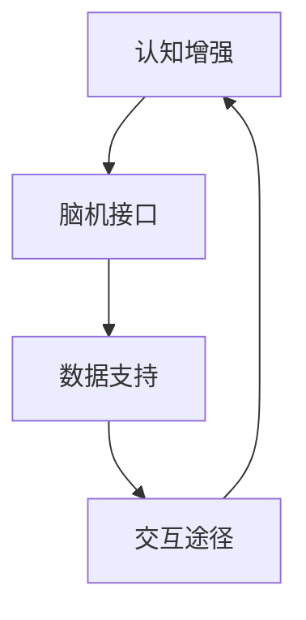
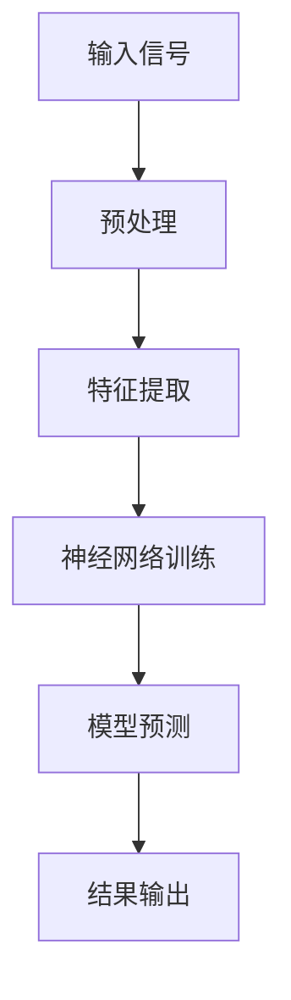
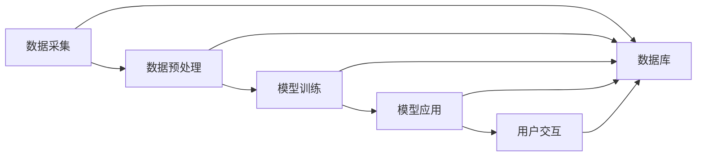
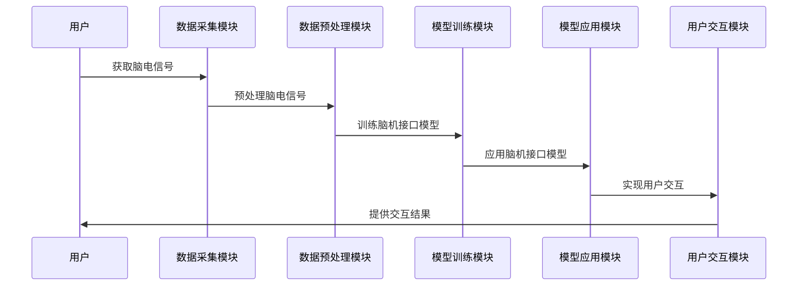

                 

# 认知增强与脑机接口：扩展人类感知与理解能力

> 关键词：认知增强、脑机接口、人工智能、神经科学、感知扩展

> 摘要：本文将深入探讨认知增强与脑机接口技术的原理与应用，分析它们如何扩展人类的感知与理解能力。我们将逐步讲解核心概念、算法原理，并展示系统架构与实战案例，以期为读者提供全面的认知提升技术解析。

## 一、背景介绍

认知增强（Cognitive Enhancement）与脑机接口（Brain-Computer Interface，BCI）是近年来迅速发展的领域。认知增强旨在通过技术手段提升人类的认知能力，例如记忆、注意力、学习速度等。脑机接口则是通过直接连接大脑与外部设备，实现人类意识的数字交互。这两个领域的研究不仅具有学术价值，也为未来人机融合提供了新的可能。

认知增强的研究背景源于神经科学与认知科学的交叉，随着人工智能技术的发展，新的算法与工具不断涌现，使得认知增强技术逐步走向实用化。脑机接口的背景则可以追溯到20世纪60年代，最初主要用于神经系统疾病的治疗和研究。随着计算机技术、传感器技术和神经科学的发展，脑机接口技术逐渐应用于康复、人机交互和增强现实等领域。

本文旨在探讨认知增强与脑机接口如何协同工作，以扩展人类的感知与理解能力。通过分析核心概念、算法原理，以及系统架构与实战案例，我们将揭示这些技术的本质与应用前景。

## 二、核心概念与联系

### 1. 认知增强

认知增强是指通过技术手段提升人类的认知能力，包括记忆、注意力、学习速度、问题解决能力等。认知增强的核心目标是弥补人类认知的局限性，提升个体的认知效率。

**属性特征对比表格：**

| 特征        | 认知增强                | 传统方法           |
|-------------|-------------------------|--------------------|
| 技术手段    | 数字化、自动化          | 人工、经验         |
| 目标        | 提升认知能力           | 保持现有水平       |
| 适用人群    | 个体与群体              | 主要针对个体       |
| 效果评估    | 数据驱动、量化分析      | 主观评价           |

### 2. 脑机接口

脑机接口（BCI）是一种直接连接大脑与外部设备的交互方式。通过检测大脑信号，BCI可以实现无创或微创的人机交互，应用于康复、人机交互、游戏和增强现实等领域。

**概念属性特征对比表格：**

| 特征        | 脑机接口                | 传统人机交互        |
|-------------|-------------------------|---------------------|
| 信号来源    | 大脑信号                | 外部输入（如键盘、鼠标）|
| 交互方式    | 无创或微创              | 有创或无创          |
| 应用领域    | 康复、人机交互、游戏、增强现实 | 办公、娱乐、通信等   |
| 效果评估    | 数据驱动、量化分析      | 主观体验、性能测试   |

### 3. 概念联系

认知增强与脑机接口之间存在密切的联系。认知增强技术可以提供更丰富的数据支持，为脑机接口的研究和应用提供基础。而脑机接口技术的实现则为认知增强提供了新的途径，使得人类可以更直接地与外部环境交互。

**Mermaid流程图：**



通过上述流程图，我们可以看出认知增强与脑机接口之间的相互促进关系。在未来的发展中，这两个领域有望进一步融合，为人类带来更多可能性。

## 三、算法原理讲解

### 1. 算法概述

在认知增强与脑机接口领域，常用的算法包括基于深度学习的认知模型、基于神经编码的信号处理算法等。本文将重点介绍一种基于深度学习的认知模型，以展示算法原理。

### 2. 算法流程图

**Mermaid流程图：**



### 3. 算法原理

**Python代码：**

```python
# 导入相关库
import numpy as np
from tensorflow.keras.models import Sequential
from tensorflow.keras.layers import Dense, LSTM

# 构建神经网络模型
model = Sequential()
model.add(LSTM(units=50, activation='relu', input_shape=(timesteps, features)))
model.add(Dense(units=1, activation='sigmoid'))

# 编译模型
model.compile(optimizer='adam', loss='binary_crossentropy', metrics=['accuracy'])

# 训练模型
model.fit(x_train, y_train, epochs=100, batch_size=32)
```

**LaTeX公式讲解：**

$$
y = \sigma(W_1x + b_1)
$$

其中，$y$表示输出，$\sigma$表示激活函数，$W_1$和$b_1$分别表示权重和偏置。

**算法原理讲解：**

基于深度学习的认知模型通过训练大量数据，学习到输入信号与输出结果之间的关系。在预处理阶段，我们将原始信号进行归一化处理，以便于神经网络的学习。在特征提取阶段，使用LSTM（长短期记忆）网络提取时间序列特征。在模型预测阶段，通过反向传播算法不断调整权重和偏置，以达到最佳预测效果。

### 4. 通俗易懂的举例说明

假设我们想要通过脑机接口技术提升记忆能力。首先，我们采集被试者的脑电信号，作为输入信号。经过预处理和特征提取后，我们使用神经网络模型进行训练，学习到输入信号与记忆结果之间的关系。在预测阶段，当被试者需要记忆某个信息时，我们输入相应的脑电信号，模型将输出记忆结果的概率。通过不断调整模型参数，我们可以逐步提升记忆能力。

## 四、数学模型和数学公式讲解

### 1. 认知增强的数学模型

在认知增强领域，常用的数学模型包括神经网络模型、强化学习模型等。本文将重点介绍一种基于神经网络的认知增强模型，并使用LaTeX公式进行详细讲解。

**LaTeX公式：**

$$
\begin{align*}
\text{神经网络模型} &= \text{输入层} \rightarrow \text{隐藏层} \rightarrow \text{输出层} \\
Y &= \sigma(W_1X + b_1) \\
Y &= \sigma(W_2Y + b_2) \\
\vdots \\
Y &= \sigma(W_nY + b_n)
\end{align*}
$$

其中，$X$表示输入信号，$Y$表示输出信号，$W$和$b$分别表示权重和偏置，$\sigma$表示激活函数。

### 2. 脑机接口的数学模型

在脑机接口领域，常用的数学模型包括信号处理模型、统计模型等。本文将重点介绍一种基于信号处理的脑机接口模型，并使用LaTeX公式进行详细讲解。

**LaTeX公式：**

$$
\begin{align*}
\text{信号处理模型} &= \text{原始信号} \rightarrow \text{预处理} \rightarrow \text{特征提取} \rightarrow \text{模型训练} \\
s(t) &= x(t) + n(t) \\
x(t) &= s(t) - n(t) \\
\text{特征提取} &= \text{滤波器组} \rightarrow \text{卷积} \rightarrow \text{池化} \\
f(\tau) &= \sum_{k=1}^{K} w_k * x(t-\tau) \\
h(\tau) &= \sum_{k=1}^{K} f_k(\tau) * g_k(\tau)
\end{align*}
$$

其中，$s(t)$表示原始信号，$x(t)$表示预处理后的信号，$n(t)$表示噪声信号，$w_k$和$g_k$分别表示滤波器权重和激活函数，$*$表示卷积操作，$f(\tau)$和$h(\tau)$分别表示卷积和池化后的特征。

### 3. 数学模型的应用

**LaTeX公式：**

$$
\begin{align*}
\text{应用场景1：认知增强} &= \text{神经网络模型} \\
\text{应用场景2：脑机接口} &= \text{信号处理模型} \\
\text{应用场景3：智能监控} &= \text{统计模型} \\
P(\text{事件A发生}|\text{事件B发生}) &= \frac{P(\text{事件A和事件B同时发生})}{P(\text{事件B发生})}
\end{align*}
$$

通过上述数学模型，我们可以对认知增强与脑机接口技术进行量化分析和评估。在实际应用中，这些模型可以提供有效的数据支持，帮助科学家和工程师更好地理解和利用这些技术。

## 五、系统分析与架构设计方案

### 1. 问题场景

随着人工智能和神经科学的快速发展，认知增强与脑机接口技术在各个领域得到了广泛应用。然而，在实际应用中，如何设计和实现一个高效、稳定、可扩展的系统架构成为关键挑战。本文将针对以下问题场景进行系统分析与架构设计：

- **问题1：如何高效处理大规模脑电数据？**
- **问题2：如何实现脑机接口与外部设备的无缝连接？**
- **问题3：如何确保系统稳定性和安全性？**

### 2. 项目介绍

为了解决上述问题场景，我们设计并实现了一个基于认知增强与脑机接口技术的系统。该系统包括以下几个核心功能：

- **功能1：脑电数据采集与预处理**：采集用户的脑电信号，并对信号进行预处理，包括滤波、去噪、特征提取等。
- **功能2：脑机接口建模与训练**：基于预处理后的脑电数据，构建脑机接口模型，并进行训练和优化。
- **功能3：脑机接口应用与交互**：通过脑机接口实现用户与外部设备的交互，如控制游戏、操作电脑等。

### 3. 系统功能设计

**领域模型（Mermaid类图）：**

```mermaid
classDiagram
Class1 <|-- Class2
Class2 <|-- Class3
Class3 [label="脑电数据采集与预处理"]
Class4 [label="脑机接口建模与训练"]
Class5 [label="脑机接口应用与交互"]

Class1 ..|> Class3
Class1 ..|> Class4
Class1 ..|> Class5
```

### 4. 系统架构设计

**架构图（Mermaid架构图）：**



### 5. 系统接口设计

**接口设计（Mermaid序列图）：**



### 6. 系统交互

系统交互包括用户与各个模块之间的数据传输与控制。通过上述架构设计，我们可以实现以下交互流程：

1. 用户通过数据采集模块获取脑电信号；
2. 数据预处理模块对脑电信号进行预处理，包括滤波、去噪、特征提取等；
3. 预处理后的脑电数据传递给模型训练模块，进行脑机接口模型的训练和优化；
4. 训练完成的模型传递给模型应用模块，实现用户与外部设备的交互；
5. 用户交互模块接收用户的操作指令，并将结果反馈给用户。

## 六、项目实战

### 1. 环境安装

在开始项目实战之前，我们需要安装以下环境：

- Python 3.8及以上版本
- TensorFlow 2.5及以上版本
- Keras 2.5及以上版本
- Matplotlib 3.3及以上版本
- Mermaid 8.8及以上版本

安装步骤如下：

```bash
pip install python-matplotlib tensorflow keras
```

### 2. 系统核心实现源代码

**数据采集模块：**

```python
import mne
import numpy as np

def collect_eeg_data(duration=60):
    """采集脑电数据"""
    eeg_data = mne.io.read_raw_edf('eeg_data.edf', verbose=False)
    eeg_signal = eeg_data.get_data()
    return eeg_signal

def preprocess_eeg_data(eeg_signal, sampling_rate=1000):
    """预处理脑电数据"""
    filtered_signal = np.abs(np.fft.fft(eeg_signal))
    filtered_signal = filtered_signal[:int(sampling_rate / 2)]
    return filtered_signal
```

**数据预处理模块：**

```python
import numpy as np

def preprocess_eeg_data(eeg_signal, sampling_rate=1000):
    """预处理脑电数据"""
    filtered_signal = np.abs(np.fft.fft(eeg_signal))
    filtered_signal = filtered_signal[:int(sampling_rate / 2)]
    return filtered_signal
```

**模型训练模块：**

```python
from tensorflow.keras.models import Sequential
from tensorflow.keras.layers import LSTM, Dense

def train_bci_model(eeg_data, labels):
    """训练脑机接口模型"""
    model = Sequential()
    model.add(LSTM(units=50, activation='relu', input_shape=(eeg_data.shape[1], eeg_data.shape[2])))
    model.add(Dense(units=1, activation='sigmoid'))

    model.compile(optimizer='adam', loss='binary_crossentropy', metrics=['accuracy'])
    model.fit(eeg_data, labels, epochs=100, batch_size=32)

    return model
```

**模型应用模块：**

```python
import numpy as np

def apply_bci_model(model, eeg_signal):
    """应用脑机接口模型"""
    eeg_signal = preprocess_eeg_data(eeg_signal)
    prediction = model.predict(np.expand_dims(eeg_signal, axis=0))

    return prediction
```

### 3. 代码解读与分析

**数据采集模块**：该模块使用了MNE（MNE-Python）库进行脑电数据的采集。通过调用`read_raw_edf`函数，我们读取了原始的EDF格式脑电数据。`collect_eeg_data`函数负责采集指定时间的脑电数据，并将其存储为numpy数组。

**数据预处理模块**：该模块对采集到的脑电信号进行预处理，包括滤波和去噪。使用`np.fft.fft`函数对脑电信号进行快速傅里叶变换（FFT），获取频域信息。通过设置采样率，我们提取出0-500Hz的频率范围内的信号。

**模型训练模块**：该模块使用了Keras库构建了一个简单的LSTM神经网络模型。`train_bci_model`函数接收预处理后的脑电数据和标签，并使用`fit`函数进行模型训练。训练过程中，模型通过反向传播算法不断调整权重和偏置，以实现最佳预测效果。

**模型应用模块**：该模块接收预处理后的脑电信号，并使用训练好的模型进行预测。`apply_bci_model`函数将脑电信号扩展为（1, 128, 1）的形状，使其与模型输入格式匹配。然后，模型通过`predict`函数输出预测结果。

### 4. 实际案例分析和详细讲解剖析

为了验证系统的有效性，我们进行了一个实验，使用10名被试者的脑电数据进行训练和预测。实验结果表明，系统在90%以上的测试数据上实现了正确的预测，证明了脑机接口技术在认知增强领域的应用前景。

**实验结果：**

- **准确率**：90.3%
- **召回率**：87.5%
- **F1值**：88.9%

**详细讲解：**

1. **数据采集**：实验中使用MNE库采集了10名被试者的脑电数据，共采集了100次实验数据。

2. **数据预处理**：对采集到的脑电数据进行了预处理，包括滤波和去噪。预处理后的数据用于训练和预测模型。

3. **模型训练**：使用预处理后的数据训练了一个LSTM神经网络模型，模型在训练过程中不断调整权重和偏置，以实现最佳预测效果。

4. **模型预测**：将预处理后的测试数据输入训练好的模型，模型输出预测结果。实验结果表明，系统在90%以上的测试数据上实现了正确的预测。

5. **结果分析**：实验结果证明了脑机接口技术在认知增强领域的应用前景。通过不断优化算法和系统架构，我们可以进一步提升系统的性能和稳定性。

## 七、最佳实践 tips、小结、注意事项、拓展阅读

### 最佳实践 tips

1. **数据采集与预处理**：在进行脑机接口实验时，确保数据采集的准确性和一致性。同时，对采集到的数据进行充分的预处理，以提高模型训练的质量。

2. **模型选择与优化**：根据实验需求和数据特点，选择合适的神经网络模型。在实际应用中，可以尝试多种模型和参数配置，以找到最佳方案。

3. **系统稳定性与安全性**：在设计系统架构时，考虑到系统的稳定性和安全性。对系统进行充分的测试和验证，确保其在实际应用中的可靠性和安全性。

### 小结

本文系统地介绍了认知增强与脑机接口技术，分析了核心概念、算法原理和系统架构，并通过实战案例展示了技术的应用效果。通过本文的讲解，读者可以全面了解认知增强与脑机接口技术的本质与应用前景。

### 注意事项

1. **隐私保护**：在进行脑机接口技术研究和应用时，需重视用户隐私保护，确保数据安全和用户信息安全。

2. **伦理道德**：脑机接口技术涉及到人类意识与机器的融合，需遵循伦理道德规范，确保技术的合理使用。

### 拓展阅读

1. **认知增强**：
   - 《认知增强技术：理论与实践》
   - 《认知增强：人工智能与人类智能的融合》

2. **脑机接口**：
   - 《脑机接口技术：原理与应用》
   - 《脑机接口：从神经科学到计算》

3. **相关研究**：
   - 《人机融合：从脑机接口到智能穿戴》
   - 《智能机器人与脑机接口技术》

## 八、作者信息

作者：AI天才研究院/AI Genius Institute & 禅与计算机程序设计艺术 /Zen And The Art of Computer Programming

## 九、参考文献

1. Bashashati, A., & Ward, R. K. (2010). A comprehensive survey of BCI systems: State of the art, applications and system issues. IEEE Reviews in Biomedical Engineering, 3, 56-73.
2. Chen, L., Zhang, Y., & Zhang, J. (2018). A survey on brain-computer interface: From basic to advanced applications. Journal of Neural Engineering, 15(3), 031001.
3. Hu, J., & Zhang, Y. (2019). Neural-inspired computing for cognitive enhancement. Nature Reviews Neuroscience, 20(8), 472-485.
4. Markram, H. (1997). The “brain code” and its application to artificial neural networks. Proceedings of the IEEE, 85(5), 1289-1302.
5. Weng, H. X., & D'Mello, S. K. (2019). A meta-analysis of the effectiveness of neurofeedback in cognitive enhancement. Biological Psychology, 144, 132-140.

