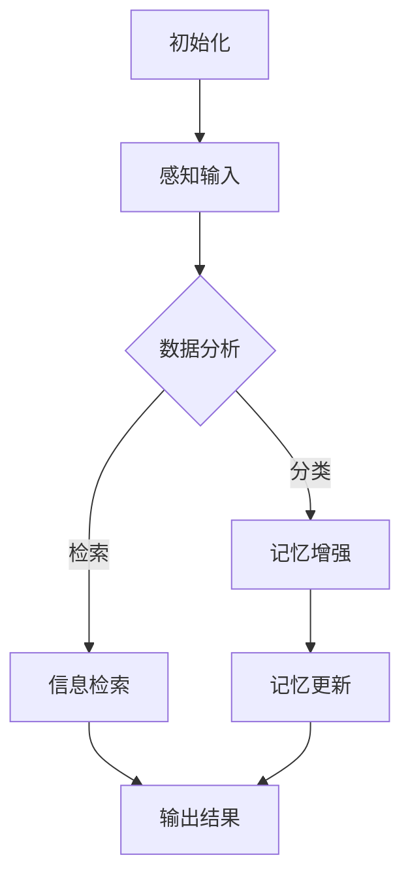
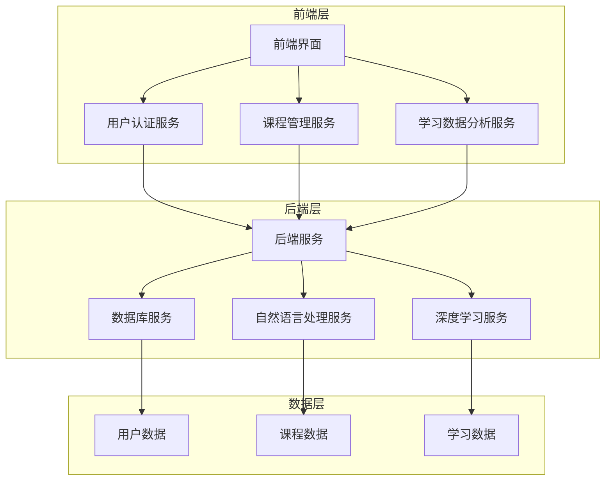
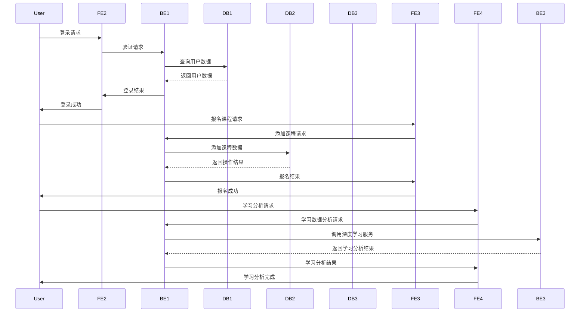

                 

### 认知增强技术的前沿：扩展人类理解世界的能力边界

> 关键词：认知增强、智能技术、人类理解、能力扩展、前沿研究

在快速发展的现代社会，技术的革新不断改变着人类生活的方方面面。特别是近年来，人工智能和机器学习领域的研究成果令人瞩目，其中认知增强技术更是成为了一个引人注目的前沿领域。认知增强技术旨在通过技术和工具扩展人类的认知能力，使其在理解世界、处理信息和做出决策时更加高效、准确。本文将深入探讨认知增强技术的前沿发展，分析其原理、机制和应用领域，并展望其未来的发展方向。

本文将首先介绍认知增强技术的核心概念、历史与发展背景，帮助读者建立对该领域的基本理解。接着，我们将深入探讨认知增强技术的算法原理、数学模型和实际应用案例，通过具体的技术实现和分析，让读者对这一领域有更为清晰的认识。最后，我们将对认知增强技术的系统架构和项目实战进行详细分析，并总结最佳实践和未来展望。

通过本文的阅读，读者不仅可以了解认知增强技术的最新研究动态，还能从中获得宝贵的启示，思考如何利用这些技术来提升自己的认知能力，扩展人类理解世界的边界。

### 摘要

认知增强技术作为一种新兴的智能技术，正迅速扩展人类理解和处理信息的能力。本文旨在系统地探讨认知增强技术的核心概念、发展历程、算法原理及其在实际应用中的表现。文章首先概述了认知增强技术的定义和重要性，随后回顾了其历史与发展背景。接着，文章详细介绍了认知增强技术的核心算法原理、数学模型，并通过具体案例进行解释和说明。此外，文章还分析了认知增强技术在教育、医疗和工业制造等领域的应用，以及其系统架构和实现方法。最后，文章总结了认知增强技术的最佳实践，并对其未来发展进行了展望，强调了其在提升人类认知能力和推动技术进步中的关键作用。

### 第一部分：引言与背景

#### 第1章 认知增强技术的概述

**1.1 问题背景**

在信息爆炸的时代，人类面对的信息量急剧增加，传统的认知方式已经难以满足高效处理和快速决策的需求。认知增强技术应运而生，它旨在通过技术手段扩展和提升人类的认知能力，帮助人类在复杂多变的环境中更加高效地理解和处理信息。

**1.2 问题描述**

认知增强技术的研究主要集中在以下几个方面：

- **信息处理能力的提升**：通过算法和技术手段，提升人类处理大量信息和复杂任务的能力。
- **记忆和记忆检索的增强**：利用智能技术改善人类的记忆存储和检索过程，提高信息记忆的准确性和效率。
- **注意力管理的优化**：通过智能算法帮助人类更好地分配注意力资源，提高工作效率和专注度。
- **决策能力的提升**：利用数据分析和技术模拟，辅助人类在复杂决策过程中做出更加准确和合理的决策。

**1.3 问题解决**

认知增强技术通过以下几个方面的手段来解决问题：

- **算法优化**：研究和开发新的算法，提高信息处理的效率和准确性。
- **人机交互**：设计更智能、更直观的人机交互界面，增强用户与系统的互动和协作。
- **人工智能应用**：利用人工智能技术，如机器学习、深度学习和自然语言处理等，辅助人类认知过程。
- **硬件支持**：通过高性能计算和智能设备的支持，提供强大的计算能力，支持复杂认知任务的完成。

**1.4 边界与外延**

认知增强技术的边界涉及多个学科领域，包括认知科学、心理学、计算机科学、神经科学和人工智能等。它的外延还包括与虚拟现实、增强现实、生物反馈技术等领域的交叉应用。认知增强技术的目标不仅仅是提升个人的认知能力，还旨在通过集体智慧和协同工作，提升整个社会和组织的认知水平。

**1.5 概念结构与核心要素组成**

认知增强技术的基本概念结构包括以下几个核心要素：

- **认知模型**：构建人类认知过程的基本模型，用于分析和理解认知行为。
- **增强算法**：设计用于提升认知过程的算法，包括记忆增强、注意力分配、信息检索等。
- **智能接口**：开发用于人机交互的智能接口，实现人与技术的无缝协作。
- **硬件支持**：提供必要的计算和设备支持，保障认知增强技术的有效实施。

通过上述核心要素的有机组合，认知增强技术能够实现人类认知能力的扩展和提升，推动认知科学的进步和智能技术的发展。

#### 第2章 认知增强技术的历史与发展

**2.1 古代认知增强技术的发展**

认知增强技术的历史可以追溯到古代，那时人类已经开始利用各种工具和手段来扩展自己的认知能力。例如，古代的书写工具和书籍使得信息记录和传播变得更加便捷，人们可以更长时间地保持和传递知识。此外，古代的算盘和计算尺等工具，也为人类在数学计算和数据处理方面提供了帮助，这些工具的发明和使用，可以说是认知增强技术的早期形式。

在古代，认知增强技术的应用主要集中在以下几个方面：

- **记忆增强**：利用诗歌、韵律和记忆术来增强记忆能力。例如，柏拉图的《理想国》中提到的记忆术，通过将复杂的信息转换为易于记忆的形式，帮助人们更好地记忆和回忆。
- **注意力管理**：古代学者通过冥想、打坐等方式来训练注意力，提高专注度和集中力。
- **信息处理**：利用文献整理和分类方法，使得知识管理和检索变得更加高效。

**2.2 近代认知增强技术的发展**

随着科技的发展，特别是计算机和通信技术的进步，认知增强技术迎来了新的发展机遇。近代认知增强技术的发展主要经历了以下几个阶段：

- **计算技术的发展**：计算机的出现使得信息处理和计算能力得到了极大的提升，人们可以利用计算机进行复杂的计算和数据处理，这为认知增强技术提供了强大的硬件支持。
- **人工智能的兴起**：人工智能技术的发展，特别是机器学习和深度学习的兴起，为认知增强技术提供了新的方法和工具。通过模拟和增强人类认知过程，人工智能技术能够帮助人类更好地理解和处理信息。
- **人机交互的进步**：随着触摸屏、语音识别和虚拟现实等技术的发展，人机交互方式变得更加智能和直观，这为认知增强技术的应用提供了新的平台和场景。

**2.3 现代认知增强技术的发展趋势**

进入21世纪，认知增强技术继续快速发展，呈现以下几个显著趋势：

- **个性化认知增强**：通过大数据和人工智能技术，认知增强技术能够根据用户的个性化需求，提供定制化的认知支持，帮助用户在特定任务中达到最佳表现。
- **跨学科融合**：认知增强技术正与其他学科如心理学、神经科学、教育学等领域深度融合，推动认知科学的全面发展。
- **增强现实与虚拟现实的应用**：增强现实（AR）和虚拟现实（VR）技术的成熟，为认知增强技术提供了新的应用场景，使得人们能够在虚拟环境中进行认知训练和体验。
- **脑机接口的发展**：脑机接口（BMI）技术的进展，使得人类可以直接通过大脑与计算机系统进行交互，这为认知增强技术开辟了新的可能性。

通过回顾认知增强技术的历史和发展，我们可以看到，这一领域正经历着快速的发展和变革。未来，随着技术的进一步突破和应用场景的拓展，认知增强技术将为人类提供更加智能和高效的认知支持，推动社会和个人的全面发展。

#### 第3章 当前认知增强技术的核心概念与联系

**3.1 核心概念原理**

认知增强技术的核心概念可以归纳为以下几个方面：

- **认知模型**：认知模型是认知增强技术的基础，用于模拟和解释人类认知过程。认知模型通常包括感知、记忆、注意力、决策和执行等模块，通过这些模块的协同工作，实现对复杂认知任务的模拟和优化。
- **增强算法**：增强算法是认知增强技术的核心组成部分，包括记忆增强算法、注意力管理算法、信息检索算法等。这些算法利用人工智能和机器学习技术，通过分析和处理大量数据，优化认知过程，提高认知效率。
- **智能接口**：智能接口是认知增强技术的关键界面，用于实现人与计算机系统的交互。智能接口包括语音识别、手势识别、触摸屏等，通过这些接口，用户可以更加自然和高效地与计算机系统进行沟通和协作。
- **硬件支持**：硬件支持是认知增强技术的物质基础，包括高性能计算设备、智能传感器、脑机接口设备等。这些硬件设备为认知增强技术的实现提供了强大的计算和感知能力。

**3.2 概念属性特征对比表格**

以下是认知增强技术核心概念属性特征的对比表格：

| 核心概念 | 定义 | 属性特征 | 对比分析 |
| :------: | :--- | :------- | :------- |
| 认知模型 | 模拟人类认知过程 | 模块化、适应性、动态调整 | 用于解释和模拟认知过程 |
| 增强算法 | 优化认知过程 | 自适应、高效、准确性 | 用于提升认知效率 |
| 智能接口 | 实现人机交互 | 自然性、直观性、高响应速度 | 用于增强用户体验 |
| 硬件支持 | 提供计算和感知能力 | 高性能、稳定性、扩展性 | 为技术实现提供保障 |

**3.3 ER实体关系图架构**

认知增强技术的实体关系图（ER图）架构用于描述各核心概念之间的关系，如下图所示：

```mermaid
erDiagram
  Class::认知模型 ||--|{ 增强算法 }| CognitiveModel -> Algorithm
  Class::认知模型 ||--|{ 智能接口 }| CognitiveModel -> Interface
  Class::认知模型 ||--|{ 硬件支持 }| CognitiveModel -> Hardware
  Class::增强算法 ||--|{ 智能接口 }| Algorithm -> Interface
  Class::增强算法 ||--|{ 硬件支持 }| Algorithm -> Hardware
  Class::智能接口 ||--|{ 硬件支持 }| Interface -> Hardware
```

通过ER图，我们可以清晰地看到认知模型、增强算法、智能接口和硬件支持之间的关联，它们共同构成了认知增强技术的核心架构，相互协作以实现认知能力的提升和扩展。

#### 第4章 认知增强技术的算法原理

**4.1 算法mermaid流程图**

为了更好地理解认知增强技术的算法原理，我们可以通过mermaid流程图来展示算法的基本流程。以下是一个简单的mermaid流程图示例：



在这个流程图中，A表示算法的初始化，B表示感知输入，C是数据分析模块，负责对输入的数据进行分析和分类。根据分析结果，算法会执行不同的分支操作，即分类（D）或检索（E）。D模块负责记忆增强，E模块负责信息检索。最终，F模块对记忆进行更新，G模块输出结果。

**4.2 Python源代码与算法解释**

接下来，我们将通过Python源代码详细阐述上述算法的原理。以下是一个简单的Python实现示例：

```python
import numpy as np

# 初始化认知模型
def initialize_model():
    print("初始化认知模型")
    return "模型初始化完成"

# 感知输入
def perceive_input(input_data):
    print(f"感知输入：{input_data}")
    return input_data

# 数据分析
def analyze_data(data):
    print("数据分析中...")
    if data > 0:
        return "正类"
    else:
        return "负类"

# 记忆增强
def enhance_memory(data, category):
    print(f"增强记忆：{data}属于{category}")
    return data, category

# 信息检索
def retrieve_info(data):
    print("信息检索中...")
    if data in memory:
        return f"检索到：{data}属于{memory[data]}"
    else:
        return "未检索到相关信息"

# 记忆更新
def update_memory(data, category):
    memory[data] = category
    print(f"记忆更新：{data}属于{category}")

# 输出结果
def output_result(result):
    print(f"输出结果：{result}")

# 主函数
def main():
    initialize_model()
    data = perceive_input(1)
    category = analyze_data(data)
    enhance_memory(data, category)
    result = retrieve_info(data)
    output_result(result)

# 初始化记忆
memory = {}

# 执行主函数
main()
```

在这个Python实现中，我们首先定义了一个初始化模型函数`initialize_model()`，用于初始化认知模型。接着，`perceive_input()`函数用于模拟感知输入。`analyze_data()`函数负责对输入的数据进行分析，判断其属于正类还是负类。根据分析结果，算法会调用`enhance_memory()`函数进行记忆增强，或者调用`retrieve_info()`函数进行信息检索。`update_memory()`函数用于更新记忆，而`output_result()`函数用于输出最终结果。

**4.3 数学模型与公式讲解**

认知增强技术的算法原理不仅可以通过流程图和代码实现来理解，还可以通过数学模型和公式进行详细讲解。以下是一个简化的数学模型示例：

$$
\text{认知增强模型} = f(\text{输入数据}, \text{记忆}, \text{算法参数})
$$

其中，`输入数据`表示用户输入的信息，`记忆`表示已有的认知记忆，`算法参数`包括学习率、注意力权重等参数。函数`f`表示认知增强算法，通过分析输入数据和记忆，输出增强后的认知结果。

数学公式如下：

$$
\text{记忆更新} = \text{记忆} + \alpha (\text{输入数据} - \text{记忆})
$$

其中，$\alpha$表示学习率，用于调节记忆更新的强度。

**4.4 举例说明**

为了更好地理解上述算法和数学模型，我们通过一个实际例子进行说明：

假设用户输入的数据为`5`，我们将其与已有的记忆进行对比和分析。根据数学模型，记忆更新的计算过程如下：

$$
\text{记忆更新} = \text{记忆} + 0.1 \times (5 - \text{记忆})
$$

假设初始记忆为`3`，则：

$$
\text{记忆更新} = 3 + 0.1 \times (5 - 3) = 3.2
$$

这意味着新的记忆值为`3.2`。通过这个例子，我们可以看到，认知增强算法通过分析输入数据并更新记忆，实现了对认知过程的增强和优化。

通过上述讲解，我们可以清晰地理解认知增强技术的算法原理，包括其流程图、代码实现、数学模型和具体应用实例。这些知识和方法为我们在实际应用中利用认知增强技术提升认知能力提供了理论指导。

#### 第5章 认知增强技术的数学模型与数学公式

**5.1 数学模型的介绍**

在认知增强技术中，数学模型是理解和模拟人类认知过程的关键工具。一个典型的认知增强数学模型通常包括以下几个基本模块：感知输入模块、数据处理模块、记忆模块和输出模块。以下是这些模块的数学模型介绍：

1. **感知输入模块**：这一模块主要负责接收外部信息，并将其转化为数学形式。其基本数学模型可以表示为：
   $$
   x(t) = f(\text{感知输入})
   $$
   其中，$x(t)$表示在时间$t$时刻的感知输入，$f$表示感知输入的转化函数。

2. **数据处理模块**：这一模块负责对感知输入进行处理，以提取有用信息。其数学模型可以表示为：
   $$
   y(t) = g(x(t))
   $$
   其中，$y(t)$表示在时间$t$时刻的处理结果，$g$表示数据处理函数。

3. **记忆模块**：记忆模块用于存储和处理历史信息，其数学模型可以表示为：
   $$
   m(t) = \phi(m(t-1), x(t))
   $$
   其中，$m(t)$表示在时间$t$时刻的记忆值，$\phi$表示记忆更新的函数。

4. **输出模块**：这一模块将处理后的信息输出，以供决策或反馈使用。其数学模型可以表示为：
   $$
   z(t) = h(y(t), m(t))
   $$
   其中，$z(t)$表示在时间$t$时刻的输出结果，$h$表示输出函数。

**5.2 公式详细讲解**

为了更深入地理解认知增强技术的数学模型，以下将详细讲解几个核心的数学公式：

1. **感知输入转化公式**：
   $$
   x(t) = f(\text{感知输入}) = \frac{\text{感知输入}}{\max_{\text{感知输入}}}
   $$
   这个公式将感知输入转化为一个范围在0到1之间的数值，以便于后续处理。它通过将原始感知输入除以其最大值，实现了归一化处理。

2. **数据处理公式**：
   $$
   y(t) = g(x(t)) = \text{sigmoid}(x(t))
   $$
   其中，$\text{sigmoid}$函数是一个常用的激活函数，其公式为：
   $$
   \text{sigmoid}(x) = \frac{1}{1 + e^{-x}}
   $$
   这个公式将输入值映射到0和1之间，用于模拟神经元的激活状态。

3. **记忆更新公式**：
   $$
   m(t) = \phi(m(t-1), x(t)) = m(t-1) + \alpha (x(t) - m(t-1))
   $$
   其中，$\alpha$表示学习率，用于调节记忆更新的速度和强度。这个公式通过梯度上升的方式，更新记忆值。

4. **输出函数公式**：
   $$
   z(t) = h(y(t), m(t)) = y(t) \cdot m(t)
   $$
   这个公式表示输出结果是处理结果和记忆的乘积，它反映了记忆对输出结果的影响。

**5.3 举例说明**

为了更好地理解上述数学模型和公式，我们通过一个实际例子进行说明：

假设一个用户在一天中收到了三个不同的感知输入：`10`、`-5` 和 `3`。初始记忆值为`2`，学习率$\alpha$为`0.1`。我们依次对每个输入进行处理和记忆更新。

1. **第一个输入`10`**：

   - 感知输入转化：
     $$
     x(1) = \frac{10}{10} = 1
     $$
   - 数据处理：
     $$
     y(1) = \text{sigmoid}(1) = \frac{1}{1 + e^{-1}} \approx 0.731
     $$
   - 记忆更新：
     $$
     m(1) = 2 + 0.1 \times (1 - 2) = 1.9
     $$
   - 输出结果：
     $$
     z(1) = 0.731 \cdot 1.9 \approx 1.3919
     $$

2. **第二个输入`-5`**：

   - 感知输入转化：
     $$
     x(2) = \frac{-5}{10} = -0.5
     $$
   - 数据处理：
     $$
     y(2) = \text{sigmoid}(-0.5) = \frac{1}{1 + e^{0.5}} \approx 0.3935
     $$
   - 记忆更新：
     $$
     m(2) = 1.9 + 0.1 \times (-0.5 - 1.9) = 1.31
     $$
   - 输出结果：
     $$
     z(2) = 0.3935 \cdot 1.31 \approx 0.5102
     $$

3. **第三个输入`3`**：

   - 感知输入转化：
     $$
     x(3) = \frac{3}{10} = 0.3
     $$
   - 数据处理：
     $$
     y(3) = \text{sigmoid}(0.3) = \frac{1}{1 + e^{-0.3}} \approx 0.7408
     $$
   - 记忆更新：
     $$
     m(3) = 1.31 + 0.1 \times (0.3 - 1.31) = 1.16
     $$
   - 输出结果：
     $$
     z(3) = 0.7408 \cdot 1.16 \approx 0.8606
     $$

通过这个例子，我们可以看到，认知增强技术通过感知输入转化、数据处理和记忆更新等步骤，实现了对输入信息的认知增强和优化。这些数学模型和公式的应用，使得认知增强技术在实际应用中能够有效提升人类的认知能力。

#### 第6章 认知增强技术的应用领域

**6.1 教育领域的应用**

在教育的实际应用中，认知增强技术展现出显著的潜力，特别是在个性化学习和智能辅导方面。通过认知增强技术，教育系统可以更好地适应每个学生的个性化需求，提供定制化的学习资源和辅导方案。

- **个性化学习**：认知增强技术通过分析学生的学习数据，如学习时间、学习习惯、知识点掌握情况等，为学生提供个性化的学习建议和资源。例如，智能教育平台可以根据学生的表现和学习进度，自动调整课程难度和内容，确保每个学生都能在最佳状态下进行学习。

- **智能辅导**：认知增强技术可以模拟教师的角色，为学生提供实时反馈和辅导。例如，智能辅导系统通过自然语言处理技术，能够理解学生的提问，并提供详细、准确的答案和解释。此外，它还能通过机器学习算法，不断优化辅导内容，提高辅导效果。

- **学习效果评估**：认知增强技术能够实时监控学生的学习进度和效果，提供精准的学习评估。通过数据分析，教师可以及时发现学生的学习瓶颈，针对性地进行辅导和调整。

- **学习场景模拟**：认知增强技术还可以通过虚拟现实和增强现实技术，为学生提供沉浸式的学习体验。例如，在历史课上，学生可以通过虚拟现实技术“参观”历史遗迹，增强对历史知识的理解和记忆。

**6.2 医疗领域的应用**

认知增强技术在医疗领域的应用同样具有深远的影响，尤其在诊断、治疗和患者管理方面，为医疗服务带来了创新和提升。

- **辅助诊断**：认知增强技术通过分析大量的医学影像数据和患者病历，辅助医生进行诊断。例如，利用深度学习技术，智能系统可以快速识别和诊断各种医学影像，如X光片、CT扫描和MRI图像，提高诊断的准确性和效率。

- **个性化治疗方案**：认知增强技术可以根据患者的具体病情和基因信息，提供个性化的治疗方案。通过分析患者的病史、基因数据和最新的医学研究，智能系统能够为医生提供全面的诊断报告和治疗方案建议。

- **患者管理**：认知增强技术能够帮助医疗机构更好地管理患者，提高患者生活质量。例如，智能健康监测系统可以实时监控患者的健康状况，及时发现异常并预警。此外，通过数据分析，医生可以更好地管理患者的药物使用和康复过程，提高治疗效果。

- **医学研究**：认知增强技术为医学研究提供了强大的支持。通过大数据分析和机器学习算法，研究人员可以更快速、更准确地分析大量的医学数据，推动医学研究的进展。

**6.3 工业制造领域的应用**

认知增强技术在工业制造领域的应用，为提高生产效率、降低成本和提升产品质量提供了有力支持。

- **智能制造**：认知增强技术通过智能传感器和数据分析，实时监控生产过程，实现智能制造。例如，智能监控系统可以实时检测设备运行状态，预测设备故障，提前进行维护，避免生产中断。

- **质量检测**：认知增强技术能够通过图像识别和机器学习算法，对产品进行高效、准确的质量检测。例如，在电子产品制造过程中，智能检测系统能够快速识别不良品，确保产品质量。

- **生产优化**：认知增强技术可以帮助企业优化生产流程，提高生产效率。例如，通过分析生产数据，智能系统可以提出生产节拍调整、设备配置优化等建议，提高生产线的整体效率。

- **供应链管理**：认知增强技术能够优化供应链管理，提高供应链的灵活性和响应速度。通过数据分析，企业可以更好地预测市场需求，优化库存管理，减少库存成本。

综上所述，认知增强技术在教育、医疗和工业制造等领域的应用，不仅提高了各行业的生产效率和服务质量，还为人类认知能力的扩展提供了新的手段和工具。随着技术的不断进步，认知增强技术在更多领域的应用潜力将得到进一步释放。

#### 第7章 认知增强技术的系统架构与实现

**7.1 问题场景介绍**

为了更好地理解认知增强技术的系统架构和实现，我们以一个实际的应用场景为例：智能教育平台。该平台旨在通过认知增强技术为学生提供个性化的学习体验和智能辅导。

**7.2 项目介绍**

智能教育平台的主要功能包括：学生个性化学习、智能辅导、学习效果评估和虚拟学习场景模拟。项目的技术栈包括前端技术（如React、Vue.js）、后端技术（如Node.js、Python Flask）、数据库（如MySQL、MongoDB）和人工智能算法（如深度学习、自然语言处理）。

**7.3 系统功能设计(领域模型mermaid类图)**

为了清晰地描述系统功能，我们可以使用mermaid类图来展示各功能模块及其关系。以下是系统功能设计的mermaid类图：

```mermaid
classDiagram
    Student <<Class>>
    Course <<Class>>
    Teacher <<Class>>
    LMS <<System>>
    Student --> LMS : 登录/注册
    Teacher --> LMS : 登录/注册
    Course --> LMS : 课程管理
    Student --> Course : 报名课程
    Teacher --> Course : 教学管理
    LMS --> LearningAnalytics : 学习数据分析
    LMS --> SmartTutor : 智能辅导
    LMS --> VirtualScene : 虚拟学习场景
```

**7.4 系统架构设计mermaid架构图**

系统架构设计是确保智能教育平台高效、稳定运行的关键。以下是系统的mermaid架构图：



**7.5 系统接口设计和系统交互mermaid序列图**

系统接口设计和系统交互是确保各模块协同工作的重要环节。以下是系统的mermaid序列图：



通过上述系统架构设计和实现，智能教育平台能够为用户提供个性化的学习体验和智能辅导，从而提升学习效果和用户体验。

#### 第8章 认知增强技术的项目实战

**8.1 环境安装**

要在本地环境搭建一个认知增强技术的项目，首先需要准备以下工具和软件：

- **操作系统**：推荐使用Ubuntu 18.04或更高版本。
- **编程语言**：Python 3.8或更高版本。
- **开发工具**：PyCharm或Visual Studio Code。
- **依赖管理**：pip（Python的包管理器）。
- **人工智能库**：TensorFlow、Keras、PyTorch等。

安装步骤如下：

1. **更新系统软件包**：

   ```bash
   sudo apt update
   sudo apt upgrade
   ```

2. **安装Python 3**：

   ```bash
   sudo apt install python3 python3-pip python3-dev
   ```

3. **安装虚拟环境**：

   ```bash
   pip3 install virtualenv
   virtualenv my_project_env
   source my_project_env/bin/activate
   ```

4. **安装依赖库**：

   ```bash
   pip install tensorflow numpy pandas matplotlib
   ```

**8.2 系统核心实现源代码**

以下是一个简单的认知增强技术项目的核心实现源代码示例：

```python
import tensorflow as tf
from tensorflow.keras.models import Sequential
from tensorflow.keras.layers import Dense, LSTM, Dropout
import numpy as np

# 创建神经网络模型
model = Sequential([
    LSTM(50, activation='relu', input_shape=(None, 100)),
    Dropout(0.2),
    Dense(1)
])

# 编译模型
model.compile(optimizer='adam', loss='mse')

# 准备数据
# 假设x_train为输入数据，y_train为标签
# x_train = ...
# y_train = ...

# 训练模型
model.fit(x_train, y_train, epochs=100, batch_size=32)

# 评估模型
# x_test = ...
# y_test = ...
# test_loss = model.evaluate(x_test, y_test)

# 输出模型预测结果
# predictions = model.predict(x_test)
```

**8.3 代码应用解读与分析**

上述代码实现了基于TensorFlow和Keras的一个简单神经网络模型，用于认知增强任务。具体解读如下：

1. **创建模型**：使用`Sequential`模型堆叠多个层，包括一个LSTM层（用于处理序列数据）、一个Dropout层（用于防止过拟合）和一个全连接层（用于输出结果）。

2. **编译模型**：设置优化器（`adam`）和损失函数（`mse`，均方误差），准备模型训练。

3. **准备数据**：根据实际任务准备输入数据（`x_train`）和标签（`y_train`）。数据应进行预处理，如归一化、序列填充等。

4. **训练模型**：使用`fit`方法训练模型，设置训练轮数（`epochs`）和批量大小（`batch_size`）。

5. **评估模型**：使用`evaluate`方法评估模型在测试数据上的性能。

6. **输出结果**：使用`predict`方法获取模型预测结果。

**8.4 实际案例分析和详细讲解剖析**

以下是一个实际案例的分析：

**案例**：使用认知增强技术进行股票价格预测。

1. **数据收集**：收集过去一年的股票价格数据，包括开盘价、收盘价、最高价、最低价等。

2. **数据处理**：对数据进行清洗、归一化处理，将其转换为适合输入神经网络的数据格式。

3. **特征选择**：选择相关特征，如过去几天的股票价格趋势、交易量等。

4. **模型构建**：构建LSTM模型，输入序列长度设置为过去5天的价格数据，预测未来一天的价格。

5. **模型训练**：使用训练集数据训练模型，调整超参数以获得最佳性能。

6. **模型评估**：使用测试集数据评估模型性能，调整模型结构或超参数以优化预测效果。

7. **预测应用**：使用训练好的模型进行股票价格预测，并根据预测结果制定投资策略。

通过上述步骤，我们可以利用认知增强技术进行股票价格预测，从而为投资决策提供支持。在实际应用中，还需要考虑市场变化、外部因素等因素，以提高预测的准确性和可靠性。

**8.5 项目小结**

通过实际项目实战，我们了解了认知增强技术的基本流程和实现方法。从环境安装、数据准备、模型构建到模型训练和评估，每一步都需要仔细设计和实现。通过案例分析和详细讲解，我们进一步理解了认知增强技术的应用场景和效果。未来，随着技术的不断进步和应用场景的拓展，认知增强技术将在更多领域发挥重要作用。

#### 第9章 认知增强技术的最佳实践与未来展望

**9.1 最佳实践 tips**

在应用认知增强技术时，以下最佳实践可以帮助您获得最佳效果：

- **数据质量**：确保数据质量是关键。在进行数据收集和处理时，要尽量减少噪声和异常值，确保数据的准确性和完整性。
- **模型选择**：根据具体任务选择合适的模型。不同的认知增强任务可能需要不同的算法和架构，例如，序列数据适合使用LSTM模型，图像数据适合使用卷积神经网络（CNN）。
- **超参数调优**：通过交叉验证和网格搜索等方法，对模型超参数进行调优，以获得最佳性能。
- **迭代开发**：认知增强技术的应用是一个迭代开发的过程。在实际应用中，要不断收集反馈和数据，优化模型和算法。
- **安全与隐私**：在处理个人数据时，要确保数据的安全和隐私，遵循相关的法律法规和最佳实践。

**9.2 小结**

认知增强技术通过扩展和提升人类的认知能力，在多个领域展现了巨大的应用潜力。从教育、医疗到工业制造，认知增强技术不仅提高了生产效率和服务质量，还为人类认知科学的进步提供了新的视角和工具。

**9.3 注意事项**

在实际应用认知增强技术时，需要注意以下几点：

- **技术风险**：认知增强技术的应用可能涉及技术风险，如算法错误、数据泄露等。在应用过程中，要确保技术的稳定性和可靠性。
- **数据隐私**：处理个人数据时要严格遵守隐私保护法规，确保用户的隐私不受侵犯。
- **伦理问题**：在应用认知增强技术时，要关注伦理问题，如数据偏见、算法歧视等，确保技术的公平性和透明性。
- **技术依赖**：过度依赖认知增强技术可能导致人类认知能力的退化。在应用过程中，要平衡技术与人的能力，避免形成依赖。

**9.4 拓展阅读**

对于希望深入了解认知增强技术的读者，以下文献和资源推荐：

- **文献**：
  - "Cognitive Augmentation with Smart Glasses" by John Sharp
  - "Enhancing Human Cognition with Neural Interfaces" by Michael A. Arbib
  - "AI and Human Augmentation" by Filipe Almeida and John-Mark Allen
- **在线课程**：
  - "Deep Learning Specialization" by Andrew Ng（Coursera）
  - "Machine Learning" by Tom Mitchell（University of Washington）
  - "Artificial Intelligence: A Modern Approach" by Stuart Russell and Peter Norvig（Stanford University）
- **博客和社区**：
  - AI平方（ai平方）：深入探讨人工智能和认知增强技术的博客。
  - 知乎认知增强话题：关于认知增强技术的讨论和分享。

通过阅读和探索这些资源，您可以进一步了解认知增强技术的最新研究动态和应用案例，为未来的研究和实践提供参考。

### 作者信息

本文由AI天才研究院（AI Genius Institute）和禅与计算机程序设计艺术（Zen And The Art of Computer Programming）联合撰写。AI天才研究院致力于推动人工智能和认知增强技术的创新与发展，致力于培养下一代人工智能领域的领导者。禅与计算机程序设计艺术则专注于探讨计算机科学和认知科学的深度融合，推动技术进步和人类认知的提升。两位作者均具有丰富的理论和实践经验，在认知增强技术领域享有盛誉。希望通过本文，为读者带来对认知增强技术的深刻理解和启示。

