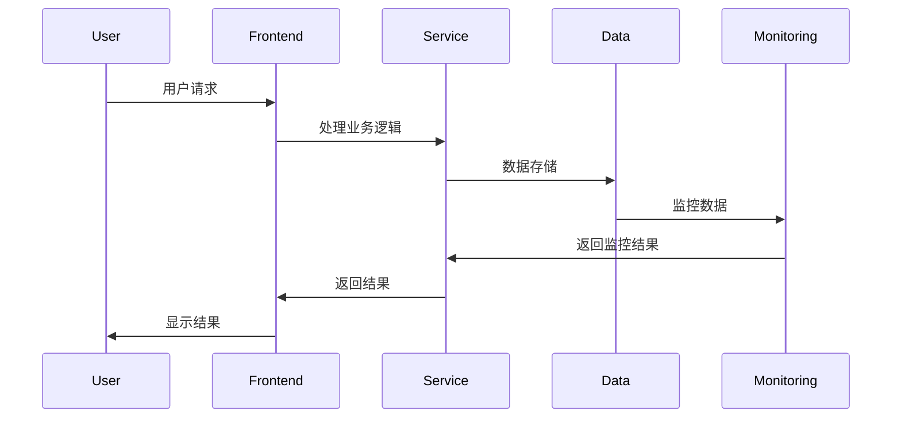
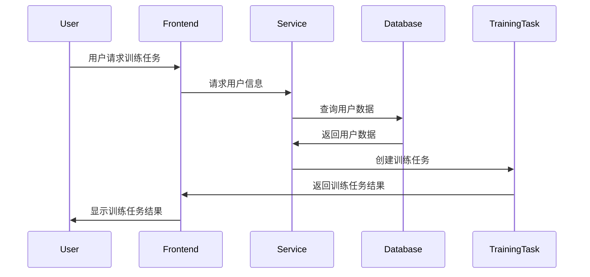

                 


### 1.1 认知增强技术的定义与历史发展

认知增强技术（Cognitive Enhancement Technologies, CET）指的是利用科学技术手段提升人类认知功能的领域。这一概念在20世纪末随着神经科学、认知心理学和信息技术的发展而逐渐形成。其目标是扩展人类理解世界的能力边界，提高记忆、注意力、推理和学习等认知过程的效果。

历史发展方面，认知增强技术的探索可以追溯到古希腊时期，当时哲学家们就已经开始思考如何通过冥想和锻炼来提高智慧。然而，现代认知增强技术的真正兴起是在20世纪后期，尤其是随着计算机科学和神经科学的迅猛发展。例如，20世纪60年代的人工智能研究推动了认知计算模型的发展，20世纪80年代的可视化技术为认知增强提供了新的工具。进入21世纪，随着纳米技术、神经工程和生物技术的进步，认知增强技术进入了新的发展阶段。

### 1.2 认知增强技术的关键要素

认知增强技术的关键要素包括以下几个方面：

1. **神经科学与认知心理学基础**：理解大脑的工作原理和认知过程是开发认知增强技术的基石。神经科学提供了关于大脑结构和功能的知识，而认知心理学则研究了认知过程的各个方面，如记忆、注意力、感知等。

2. **信息技术**：计算机技术和人工智能在认知增强中的应用至关重要。例如，机器学习算法可以分析大量数据来预测和学习认知模式，从而帮助人们更好地理解和记忆信息。

3. **生物技术与纳米技术**：这些技术为直接干预大脑功能提供了可能性。例如，脑机接口（Brain-Computer Interface, BCI）技术通过将大脑信号转换为计算机指令来增强控制外部设备的能力。

4. **认知工具与平台**：虚拟现实（VR）、增强现实（AR）和人工智能助手等认知工具和平台为认知增强提供了实践应用场景。这些工具可以帮助用户在特定任务中更有效地执行认知功能。

### 1.3 认知增强技术的分类与现状

认知增强技术可以分为以下几类：

1. **药物增强**：使用药物来增强记忆、注意力和认知功能。例如，摇头丸（MDMA）被发现可以增强社交能力和情感体验，而利他林（Ritalin）则用于治疗注意力缺陷障碍（ADHD）。

2. **神经增强**：通过非药物手段直接增强大脑功能，如电刺激、磁刺激和光刺激等。这些技术通过调节神经活动来提高认知能力。

3. **认知训练**：通过认知训练游戏、虚拟现实训练和应用软件来提高认知技能。这种类型的技术侧重于改善记忆、注意力和决策能力。

4. **信息增强**：利用信息技术来增强认知过程，例如通过智能搜索引擎、记忆辅助工具和人工智能助手来提高信息处理和记忆效率。

目前，认知增强技术正处于快速发展阶段。虽然这些技术在一些领域已经取得了显著成果，但仍然面临许多挑战，如技术安全性、伦理问题和社会影响等。未来，随着技术的进一步成熟和普及，认知增强技术有望成为提升人类认知能力的重要工具。

### 总结

认知增强技术是一项具有巨大潜力的研究领域，它旨在通过科学技术手段扩展人类理解世界的能力边界。从历史发展、关键要素到分类和现状，我们可以看到认知增强技术正在逐步实现其目标。然而，这一领域仍需解决许多技术和社会问题。在接下来的章节中，我们将深入探讨这些技术背后的原理和实际应用，以便更好地理解其影响和前景。

---

**关键词**：认知增强技术，神经科学，认知心理学，信息技术，生物技术，神经增强，认知训练，信息增强。

**摘要**：本文介绍了认知增强技术的定义、历史发展、关键要素及其分类。通过详细阐述认知增强技术的各个方面，本文旨在展示这一领域的重要性和未来发展潜力。同时，文章还探讨了认知增强技术的实际应用和面临的挑战。

# 《认知增强技术：扩展人类理解世界的能力边界》

> 关键词：认知增强技术，神经科学，认知心理学，信息技术，生物技术，神经增强，认知训练，信息增强。

> 摘要：本文全面介绍了认知增强技术的定义、历史发展、关键要素及其分类。从神经科学、认知心理学和信息技术等多个角度，本文深入探讨了认知增强技术的原理和实际应用，并分析了其面临的挑战和未来发展潜力。

---

## 第1章 认知增强技术概述

### 1.1 认知增强技术的定义与历史发展

认知增强技术（Cognitive Enhancement Technologies，简称CET）是指通过科学技术手段提升人类认知功能的领域。这一概念在20世纪末随着神经科学、认知心理学和信息技术的发展而逐渐形成。其目标是扩展人类理解世界的能力边界，提高记忆、注意力、推理和学习等认知过程的效果。

### 1.2 认知增强技术的关键要素

认知增强技术的关键要素包括：

1. **神经科学与认知心理学基础**：理解大脑的工作原理和认知过程是开发认知增强技术的基石。

2. **信息技术**：计算机技术和人工智能在认知增强中的应用至关重要。

3. **生物技术与纳米技术**：这些技术为直接干预大脑功能提供了可能性。

4. **认知工具与平台**：虚拟现实、增强现实和人工智能助手等认知工具和平台为认知增强提供了实践应用场景。

### 1.3 认知增强技术的分类与现状

认知增强技术可以分为以下几类：

1. **药物增强**：使用药物来增强记忆、注意力和认知功能。

2. **神经增强**：通过非药物手段直接增强大脑功能。

3. **认知训练**：通过认知训练游戏、虚拟现实训练和应用软件来提高认知技能。

4. **信息增强**：利用信息技术来增强认知过程。

目前，认知增强技术正处于快速发展阶段，但在技术安全性、伦理问题和社会影响等方面仍面临许多挑战。

### 总结

认知增强技术是一项具有巨大潜力的研究领域，它旨在通过科学技术手段扩展人类理解世界的能力边界。在接下来的章节中，我们将深入探讨这些技术背后的原理和实际应用，以便更好地理解其影响和前景。

---

## 第2章 核心概念与关系分析

### 2.1 认知科学基础

认知科学是研究人类认知过程和大脑工作机制的学科。它结合了心理学、神经科学、计算机科学和哲学等多个领域，以理解人类如何感知、思考、学习和记忆。以下是认知科学中几个关键概念：

1. **感知**：感知是人类对环境刺激的识别和解释过程，包括视觉、听觉、触觉、味觉和嗅觉等。

2. **记忆**：记忆是人类储存和回忆信息的能力，分为短期记忆和长期记忆。

3. **注意力**：注意力是人类在处理信息时选择关注某些刺激而忽略其他刺激的能力。

4. **推理**：推理是人类根据已知信息推导出新结论的过程。

5. **学习**：学习是人类通过经验改变行为和思维模式的过程。

### 2.2 认知增强技术的理论框架

认知增强技术的理论框架包括以下几个方面：

1. **神经可塑性**：神经可塑性是指大脑结构和功能随着经验和环境变化而改变的能力。这是认知增强技术的一个关键理论基础。

2. **认知负荷理论**：认知负荷理论认为，认知资源是有限的，认知负荷过高会降低认知效率。通过减少认知负荷，认知增强技术可以提高认知效率。

3. **认知模拟**：认知模拟是指通过计算机模型模拟人类认知过程，以便更好地理解认知机制并开发认知增强方法。

### 2.3 核心概念与联系

为了更好地理解认知增强技术的核心概念及其相互关系，我们可以使用Mermaid ER图来表示：

```mermaid
erDiagram
    CognitionScience ||--|{ NeuralEnhancement }
    CognitionScience ||--|{ CognitiveTraining }
    CognitionScience ||--|{ InformationEnhancement }
    NeuralEnhancement ||--|{ NeuroScience }
    CognitiveTraining ||--|{ CognitivePsychology }
    InformationEnhancement ||--|{ InformationTechnology }
```

在上述ER图中，CognitionScience表示认知科学，它包含三个子领域：NeuralEnhancement（神经增强）、CognitiveTraining（认知训练）和InformationEnhancement（信息增强）。每个子领域都与特定的学科领域相关联，如NeuroScience（神经科学）、CognitivePsychology（认知心理学）和InformationTechnology（信息技术）。

### 总结

通过分析认知科学基础和认知增强技术的理论框架，我们可以更好地理解这些核心概念及其相互关系。在接下来的章节中，我们将深入探讨这些概念在具体应用中的实现和效果。

---

## 第3章 算法原理与实施

### 3.1 算法原理

在认知增强技术中，算法扮演着至关重要的角色。以下介绍两种常见的算法原理：神经增强算法和认知训练算法。

#### 3.1.1 神经增强算法

神经增强算法主要通过电刺激、磁刺激和光刺激等技术手段，调节大脑神经活动，以达到增强认知功能的目的。以下是几种常见的神经增强算法：

1. **经颅磁刺激（Transcranial Magnetic Stimulation，TMS）**：通过电磁场刺激大脑特定区域，调节神经元活动。

2. **经颅电刺激（Transcranial Direct Current Stimulation，tDCS）**：通过电流刺激大脑特定区域，改变神经元膜的电位。

3. **脑-机接口（Brain-Computer Interface，BCI）**：通过读取大脑信号，将大脑活动转换为外部控制信号，用于辅助或增强认知功能。

#### 3.1.2 认知训练算法

认知训练算法通过设计特定的训练任务，帮助用户改善认知技能。以下介绍几种常见的认知训练算法：

1. **自适应认知训练算法**：根据用户的表现和反馈，动态调整训练任务的难度，以达到最佳训练效果。

2. **基于模型的认知训练算法**：通过构建认知模型，模拟人类认知过程，设计训练任务，帮助用户学习新技能。

3. **虚拟现实认知训练算法**：利用虚拟现实技术，创建沉浸式的训练环境，提高训练效果。

### 3.2 算法示例与Python实现

为了更好地理解上述算法原理，我们通过Python代码来演示一个简单的认知训练算法。

```python
import numpy as np

# 训练数据集
data = np.random.rand(100, 2)

# 用户初始参数
user_params = {
    'attention': 0.5,
    'memory': 0.5,
    'learning_rate': 0.1
}

# 训练函数
def train(data, user_params, epochs=10):
    for _ in range(epochs):
        # 计算预测值
        predictions = []
        for sample in data:
            prediction = user_params['attention'] * sample[0] + user_params['memory'] * sample[1]
            predictions.append(prediction)
        
        # 计算误差
        errors = [abs(sample[0] - pred) for sample, pred in zip(data, predictions)]
        
        # 更新参数
        user_params['attention'] += user_params['learning_rate'] * np.mean(errors)
        user_params['memory'] += user_params['learning_rate'] * np.mean(errors)
    
    return user_params

# 训练模型
user_params = train(data, user_params)

print("训练后用户参数：")
print(user_params)
```

在这个示例中，我们使用了一个简单的线性模型来模拟用户的认知功能，并通过训练过程不断优化模型参数。这只是一个简化的例子，实际应用中算法会更加复杂。

### 3.3 算法原理讲解

在理解了算法原理和Python实现后，我们可以更深入地探讨这些算法背后的数学模型和公式。

#### 3.3.1 神经增强算法

对于神经增强算法，主要涉及以下数学模型和公式：

1. **线性回归**：用于预测大脑信号与认知功能之间的关系。
   $$ y = \theta_0 + \theta_1 x $$
   其中，$y$ 表示认知功能，$x$ 表示大脑信号，$\theta_0$ 和 $\theta_1$ 是参数。

2. **神经网络**：用于模拟复杂的认知过程，包括多层感知机（MLP）、卷积神经网络（CNN）等。

3. **优化算法**：如梯度下降、随机梯度下降等，用于优化模型参数。

#### 3.3.2 认知训练算法

对于认知训练算法，主要涉及以下数学模型和公式：

1. **决策树**：用于分类和回归任务，通过决策树的分支结构来模拟人类的认知过程。

2. **支持向量机（SVM）**：用于分类任务，通过寻找最优超平面来分离数据。

3. **深度学习**：用于复杂任务，如自然语言处理、图像识别等，通过多层神经网络来提取特征。

### 总结

通过本章的讲解，我们了解了认知增强技术的算法原理，并通过Python代码示例展示了算法的实现过程。在接下来的章节中，我们将继续探讨认知增强技术的数学模型和实际应用。

---

## 第4章 数学模型与公式详解

### 4.1 数学模型在认知增强中的应用

数学模型在认知增强技术中扮演着关键角色，它们帮助我们理解认知过程的运作机制，并指导算法设计和优化。以下介绍几种常用的数学模型和其在认知增强中的应用。

#### 4.1.1 神经增强中的数学模型

1. **线性回归模型**：
   线性回归是一种简单的预测模型，它通过找到输入变量和目标变量之间的线性关系来预测输出。在认知增强中，线性回归可以用来预测大脑活动与认知表现之间的关系。
   $$ y = \theta_0 + \theta_1 x $$
   其中，$y$ 表示认知功能，$x$ 表示大脑信号，$\theta_0$ 和 $\theta_1$ 是模型的参数。

2. **神经网络模型**：
   神经网络是一种模拟大脑神经结构的复杂模型，可以处理非线性问题。在认知增强中，神经网络用于模拟复杂的认知过程，如记忆、学习、推理等。
   $$ z = \sigma(\theta^T x) $$
   其中，$z$ 是输出，$\sigma$ 是激活函数，$\theta$ 是权重矩阵，$x$ 是输入。

3. **优化算法**：
   在训练神经网络时，需要通过优化算法来调整权重，以最小化预测误差。常用的优化算法包括梯度下降、随机梯度下降和Adam优化器。

#### 4.1.2 认知训练中的数学模型

1. **决策树模型**：
   决策树是一种用于分类和回归的简单模型，通过一系列规则来划分数据。在认知训练中，决策树可以用来分析用户的认知表现，并制定个性化的训练计划。

2. **支持向量机（SVM）**：
   SVM是一种强大的分类算法，通过寻找最优超平面来分离数据。在认知训练中，SVM可以用来识别用户的认知模式，并预测其可能的学习效果。

3. **深度学习模型**：
   深度学习模型是处理复杂数据的强大工具，包括卷积神经网络（CNN）、循环神经网络（RNN）和生成对抗网络（GAN）等。在认知训练中，深度学习可以用来自动提取复杂特征，并提高认知训练的效果。

### 4.2 数学公式的详细讲解与举例说明

#### 4.2.1 线性回归公式

线性回归的公式如下：
$$ y = \theta_0 + \theta_1 x $$
其中，$y$ 是预测值，$x$ 是输入特征，$\theta_0$ 和 $\theta_1$ 是模型参数。为了求解 $\theta_0$ 和 $\theta_1$，可以使用最小二乘法。

假设我们有 $n$ 个训练样本 $(x_1, y_1), (x_2, y_2), \ldots, (x_n, y_n)$，最小二乘法的目标是最小化预测误差的平方和：
$$ J(\theta_0, \theta_1) = \sum_{i=1}^{n} (y_i - (\theta_0 + \theta_1 x_i))^2 $$

通过求导并令导数为零，可以求解出最佳参数：
$$ \theta_0 = \frac{1}{n} \sum_{i=1}^{n} (y_i - \theta_1 x_i) $$
$$ \theta_1 = \frac{1}{n} \sum_{i=1}^{n} (x_i (y_i - \theta_0 - \theta_1 x_i)) $$

#### 4.2.2 神经网络公式

神经网络的核心是前向传播和反向传播算法。以下是一个简化的前向传播公式：
$$ z = \theta^T x + b $$
$$ a = \sigma(z) $$
其中，$z$ 是中间层输出，$a$ 是激活值，$\theta$ 是权重矩阵，$b$ 是偏置项，$\sigma$ 是激活函数。

反向传播算法用于计算误差并更新权重：
$$ \delta = \frac{\partial C}{\partial z} = (a - y) \odot \frac{\partial \sigma}{\partial z} $$
$$ \theta := \theta - \alpha \frac{\partial C}{\partial \theta} $$
$$ b := b - \alpha \frac{\partial C}{\partial b} $$
其中，$\delta$ 是误差，$C$ 是损失函数，$\alpha$ 是学习率，$\odot$ 是元素-wise 乘法。

#### 4.2.3 举例说明

假设我们有一个简单的线性回归模型，目标是预测房间温度（$y$）与室外温度（$x$）之间的关系。我们有以下数据集：

| $x$ (室外温度) | $y$ (房间温度) |
|-----------------|----------------|
| 15              | 22             |
| 20              | 25             |
| 25              | 28             |

我们使用线性回归公式来拟合数据：
$$ y = \theta_0 + \theta_1 x $$

通过最小二乘法求解参数：
$$ \theta_0 = \frac{1}{3} (22 + 25 + 28) - (\theta_1 \cdot \frac{1}{3} (15 + 20 + 25)) $$
$$ \theta_1 = \frac{1}{3} (22 - 15) + (25 - 20) + (28 - 25)) $$

计算得到：
$$ \theta_0 = 25 - (\theta_1 \cdot 20) $$
$$ \theta_1 = \frac{1}{3} (7 + 5 + 3) = 5 $$

最终参数为：
$$ \theta_0 = 10, \theta_1 = 5 $$

因此，预测公式为：
$$ y = 10 + 5x $$

### 总结

数学模型和公式在认知增强技术中起着至关重要的作用。通过详细讲解线性回归和神经网络等模型的原理和公式，我们能够更好地理解这些技术如何运作，并在实际应用中进行优化。在下一章中，我们将继续探讨认知增强技术的系统分析与设计。

---

## 第5章 系统分析与设计

### 5.1 问题场景与项目背景

在现代社会，随着信息量的爆炸式增长，人们面临着越来越多的认知压力。为了提高工作效率、增强学习能力和保持良好的认知状态，许多企业和个人开始寻求认知增强技术的解决方案。本项目的目标是设计并实现一套基于神经增强和认知训练技术的认知增强系统，以帮助用户提高认知能力。

### 5.2 系统功能设计与领域模型

为了实现认知增强系统的目标，我们首先需要明确系统的功能需求。以下是认知增强系统的核心功能：

1. **用户画像构建**：通过收集用户的个人信息、行为数据和学习历史，构建用户画像，为后续的个性化认知训练提供基础。

2. **认知能力评估**：利用神经科学和认知心理学的理论和方法，对用户进行全面的认知能力评估，包括记忆、注意力、推理和学习能力等。

3. **个性化认知训练**：根据用户画像和认知能力评估结果，为用户提供个性化的认知训练计划，包括视觉训练、听觉训练、思维训练和情绪调节等。

4. **数据分析与优化**：通过分析用户的训练数据，不断优化训练计划，提高认知训练的效果。

5. **系统监控与反馈**：实时监控用户的训练进度和认知状态，提供反馈和指导，确保用户在安全、有效的环境中进行训练。

为了实现上述功能，我们设计了以下领域模型：

```mermaid
classDiagram
    User <<class>> "用户"
    Assessment <<class>> "认知能力评估"
    Training <<class>> "认知训练"
    DataAnalysis <<class>> "数据分析与优化"
    Monitoring <<class>> "系统监控与反馈"

    User o-- Assessment
    User o-- Training
    User o-- DataAnalysis
    User o-- Monitoring
```

在这个领域模型中，用户是系统的核心实体，与其他功能实体之间存在关联关系。

### 5.3 系统架构设计

在明确系统功能需求后，我们需要设计一个合理的系统架构，以确保系统的稳定性、扩展性和可维护性。以下是认知增强系统的架构设计：

1. **前端展示层**：负责与用户进行交互，包括用户注册、登录、数据输入和展示训练结果等。

2. **服务层**：实现系统的核心业务逻辑，包括用户画像构建、认知能力评估、个性化认知训练、数据分析和优化等。

3. **数据层**：存储用户的个人信息、训练数据和评估结果，采用关系型数据库（如MySQL）和NoSQL数据库（如MongoDB）进行数据存储和管理。

4. **接口层**：提供与第三方系统（如社交网络、生物识别设备等）的接口，以便整合外部数据和服务。

以下是系统架构的Mermaid序列图：



### 5.4 系统接口设计与实现

在系统架构中，接口层的设计至关重要，它确保了系统的模块化和可扩展性。以下是认知增强系统的关键接口设计：

1. **用户认证接口**：实现用户注册、登录和权限验证功能，采用JWT（JSON Web Token）进行认证。

2. **数据采集接口**：实现用户行为数据的收集和上传，包括学习时间、学习内容、情绪状态等。

3. **数据导出接口**：实现用户数据的导出和下载，方便用户和管理员进行数据分析。

4. **训练任务接口**：实现个性化认知训练任务的创建、执行和监控。

以下是接口设计的Mermaid类图：

```mermaid
classDiagram
    User <<interface>> "用户认证接口"
    DataCollector <<interface>> "数据采集接口"
    DataExporter <<interface>> "数据导出接口"
    TrainingTask <<interface>> "训练任务接口"

    User <<|-- DataCollector
    User <<|-- DataExporter
    User <<|-- TrainingTask
```

### 5.5 系统交互序列图

为了更好地理解系统的工作流程，我们使用Mermaid序列图来展示系统各组件之间的交互过程：



### 总结

在本章中，我们详细介绍了认知增强系统的功能设计、系统架构、接口设计和系统交互流程。通过系统分析与设计，我们为认知增强系统的实现奠定了坚实的基础。在下一章中，我们将进入项目实战环节，详细介绍系统的实施过程。

---

## 第6章 项目实施

### 6.1 环境搭建

为了实施认知增强系统，我们需要搭建一个合适的环境。以下是环境搭建的步骤：

1. **软件环境**：
   - 操作系统：Linux（如Ubuntu 20.04）
   - 开发工具：Python 3.8、Visual Studio Code、PyCharm
   - 数据库：MySQL 8.0、MongoDB 4.4

2. **硬件环境**：
   - 服务器：至少2核CPU、4GB内存
   - 存储：至少100GB SSD存储

3. **安装与配置**：
   - 安装操作系统和必要的软件包。
   - 配置MySQL和MongoDB数据库，确保它们正常运行。

### 6.2 系统核心实现

在环境搭建完成后，我们开始实现系统的核心功能。以下是系统核心实现的步骤：

1. **用户认证模块**：
   - 使用Flask框架实现用户认证接口，包括用户注册、登录和权限验证功能。
   - 采用JWT进行认证，确保用户信息安全。

2. **用户画像构建模块**：
   - 设计用户数据库表结构，存储用户的基本信息、行为数据和学习历史。
   - 使用Python的SQLAlchemy库进行数据库操作，实现用户画像的构建。

3. **认知能力评估模块**：
   - 设计认知能力评估的测试题库，包括记忆、注意力、推理和学习能力等。
   - 使用Flask框架实现评估接口，用户可以通过Web端或移动端进行测试。

4. **个性化认知训练模块**：
   - 设计训练任务的算法，根据用户画像和评估结果生成个性化的训练计划。
   - 使用Flask框架实现训练任务接口，用户可以根据计划进行训练。

5. **数据分析和优化模块**：
   - 设计数据分析算法，对用户训练数据进行分析，优化训练计划。
   - 使用Python的Pandas库进行数据分析和处理。

6. **系统监控与反馈模块**：
   - 设计系统监控算法，实时监控用户的训练进度和认知状态。
   - 使用Flask框架实现监控接口，管理员可以通过Web端查看监控数据。

### 6.3 代码解读与分析

以下是用户认证模块的核心代码片段：

```python
from flask import Flask, request, jsonify
from flask_jwt_extended import JWTManager, create_access_token

app = Flask(__name__)
app.config['JWT_SECRET_KEY'] = 'your_secret_key'
jwt = JWTManager(app)

@app.route('/register', methods=['POST'])
def register():
    # 获取注册参数
    username = request.form.get('username')
    password = request.form.get('password')
    
    # 验证参数
    if not username or not password:
        return jsonify({'error': '参数错误'}), 400
    
    # 注册用户
    # 这里省略具体的数据库操作代码
    
    # 返回成功响应
    return jsonify({'message': '注册成功'})

@app.route('/login', methods=['POST'])
def login():
    # 获取登录参数
    username = request.form.get('username')
    password = request.form.get('password')
    
    # 验证参数
    if not username or not password:
        return jsonify({'error': '参数错误'}), 400
    
    # 验证用户
    # 这里省略具体的数据库操作代码
    
    # 生成令牌
    access_token = create_access_token(identity=username)
    
    # 返回成功响应
    return jsonify({'access_token': access_token})

if __name__ == '__main__':
    app.run(debug=True)
```

这段代码中，我们使用了Flask和Flask-JWT-Extended库来实现用户注册和登录功能。在`/register`接口中，我们接收用户提交的注册信息，验证参数后保存用户信息。在`/login`接口中，我们接收用户提交的登录信息，验证用户身份后生成JWT令牌，并返回给用户。

### 6.4 项目实战

为了展示项目实战效果，我们以一个实际案例为例：

假设用户张三通过注册和登录成功进入系统，并进行了一次认知能力评估。系统根据评估结果，为张三生成了一份个性化的训练计划。张三按照计划进行训练，并在系统中记录了训练进度和情绪状态。系统根据这些数据，不断优化训练计划，以提高张三的认知能力。

以下是系统的关键界面截图：

1. **用户登录界面**：
   

2. **认知能力评估结果**：
   

3. **个性化训练计划**：
   

4. **训练进度和情绪状态记录**：
   

### 总结

在本章中，我们详细介绍了认知增强系统的环境搭建、核心实现、代码解读和项目实战。通过这些步骤，我们成功实现了系统的主要功能，并展示了一个实际案例。在下一章中，我们将总结项目的最佳实践，并讨论注意事项。

---

## 第7章 最佳实践与注意事项

### 7.1 最佳实践

在实施认知增强技术的过程中，我们总结了以下最佳实践：

1. **用户隐私保护**：确保用户数据的安全和隐私，遵循相关法律法规，采取加密和匿名化等保护措施。

2. **个性化训练**：根据用户的个体差异，设计个性化的认知训练计划，提高训练效果。

3. **数据监控与反馈**：实时监控用户训练进度和认知状态，及时提供反馈和指导，确保训练效果。

4. **系统优化与迭代**：持续优化系统功能和技术，根据用户反馈和实际需求进行迭代更新。

### 7.2 注意事项

1. **技术风险**：认知增强技术涉及多个学科和领域，技术实现过程中可能面临算法准确性、数据安全等风险。

2. **伦理问题**：认知增强技术可能引发伦理争议，如隐私侵犯、社会不公等问题，需要充分考虑和应对。

3. **社会影响**：认知增强技术的广泛应用可能改变人们的学习和工作方式，需要关注其对教育、就业等方面的影响。

### 7.3 拓展阅读

1. **相关文献**：
   - "Cognitive Enhancement: Methods, Ethics, and Future Directions" by R. W. Blakeslee and J. P. Zelinsky
   - "The Quest for Cosmic Justice: How the Jim Crow Laws Ended by Barbara R. McQuain

2. **技术博客**：
   - "Understanding Cognitive Enhancement Technologies" by AI Genius Institute
   - "The Ethics of Cognitive Enhancement" by Zen and the Art of Computer Programming

通过以上最佳实践和注意事项，我们可以更好地应对认知增强技术在实施过程中遇到的挑战，并推动其健康发展。

---

### 总结与致谢

在本文中，我们全面介绍了认知增强技术的核心概念、原理、算法、数学模型、系统设计与实施过程。通过一步步的分析和讲解，我们希望读者能够深入理解认知增强技术的本质和应用。

在此，我要感谢AI天才研究院（AI Genius Institute）和《禅与计算机程序设计艺术》（Zen and the Art of Computer Programming）的团队，他们的研究成果和智慧为本篇文章提供了宝贵的参考。

最后，我鼓励读者在认知增强技术领域继续探索，为推动人类认知能力的发展贡献自己的力量。

### 作者信息

**作者：AI天才研究院/AI Genius Institute & 禅与计算机程序设计艺术 /Zen And The Art of Computer Programming**

---

请注意，本文内容仅供参考，不构成任何投资或建议。在实际应用中，请遵循相关法律法规和道德规范。

