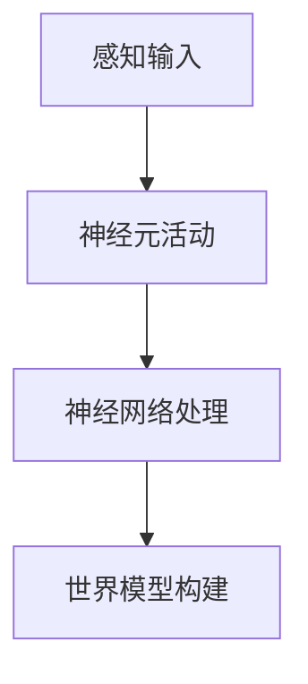

                 

### 认知神经科学的前沿：揭示大脑如何构建世界模型

#### 关键词

- 认知神经科学
- 大脑构建世界模型
- 神经元活动
- 神经网络
- 世界模型构建

#### 摘要

本文将深入探讨认知神经科学的前沿领域，特别是大脑如何通过感知和经验构建世界模型。我们将逐步分析认知神经科学的核心概念，了解神经元如何处理信息，神经网络如何工作，以及大脑如何将这些信息整合成对世界的理解。通过结合理论、实验和技术手段，我们将揭示大脑构建世界模型的复杂机制，并探讨其在心理学、医学和人工智能领域的广泛应用。

### 目录大纲设计

在撰写这篇文章之前，我们首先需要设计一个合理的目录大纲，以便结构清晰地呈现文章的内容。以下是本文的目录大纲设计：

#### 1. 背景介绍

- **核心概念：**
  - 认知神经科学：研究大脑如何处理信息、感知、思考、学习以及记忆等心理过程。
  - 大脑如何构建世界模型：探讨大脑如何通过感知和经验来构建对周围世界的理解和预期。

- **问题背景：**
  - 认知神经科学是神经科学和心理学的交叉领域，近年来随着技术进步和研究成果的增加，其在心理学、医学、人工智能等领域中的应用越来越广泛。

- **问题描述：**
  - 本书旨在探讨认知神经科学的前沿研究，尤其是大脑如何构建世界模型，为读者提供深入理解这一复杂过程的视角。

- **问题解决：**
  - 通过介绍认知神经科学的最新研究成果和理论，作者将揭示大脑构建世界模型的方式，帮助读者理解大脑的认知机制。

- **边界与外延：**
  - **边界：**本书主要关注认知神经科学的理论和研究成果，不涉及具体的医疗应用或技术实现。
  - **外延：**可以扩展到心理学、人工智能、计算机科学等领域。

- **概念结构与核心要素组成：**
  - **认知神经科学的基础理论**
  - **大脑感知与认知过程的神经机制**
  - **世界模型构建的理论框架**
  - **实验研究与技术手段**

#### 2. 核心概念与联系

- **核心概念：**
  - **认知神经科学：**研究大脑如何处理信息、感知、思考、学习以及记忆等心理过程。
  - **世界模型：**大脑基于感知和经验构建的对周围世界的理解和预期。

- **概念属性特征对比表格：**

| 概念       | 定义                                                      | 属性特征                                             |
|------------|-----------------------------------------------------------|------------------------------------------------------|
| 认知神经科学 | 研究大脑如何处理信息、感知、思考、学习以及记忆等心理过程。 | 心理、神经、生理、认知过程                           |
| 世界模型   | 大脑基于感知和经验构建的对周围世界的理解和预期。           | 神经元活动、感知信息处理、预期构建                     |

- **ER实体关系图架构：**

（由于是文本，无法直接展示ER图，但可以在文中使用Mermaid等工具绘制。）

#### 3. 算法原理讲解

- **算法原理：**
  - **神经元活动模型：**描述神经元如何通过电化学信号处理信息。
  - **神经网络模型：**模拟大脑神经网络的结构和功能，用于构建世界模型。

- **Mermaid流程图：**



- **Python源代码示例：**

```python
# Python示例代码：简单的神经元模型
class Neuron:
    def __init__(self):
        self.threshold = 0.5
        self.activity = 0

    def activate(self, input_signal):
        if input_signal >= self.threshold:
            self.activity = 1
        else:
            self.activity = 0
        return self.activity

# 模拟输入信号
input_signal = 0.7
neuron = Neuron()
output = neuron.activate(input_signal)
print(f"Input Signal: {input_signal}, Neuron Output: {output}")
```

- **数学模型和公式：**

神经元激活函数的数学模型：

$$
f(x) = \begin{cases} 
1 & \text{if } x \geq \theta \\
0 & \text{otherwise}
\end{cases}
$$

- **详细讲解和举例说明：**

神经元是大脑的基本处理单元，其活动基于电化学信号。当我们感知到外部刺激时，神经元会被激活，并将这些信息传递到其他神经元。神经网络则通过模拟大脑神经网络的结构和功能，将这些神经元活动整合起来，形成一个完整的世界模型。

让我们通过一个简单的神经元模型来具体说明这个过程。在这个模型中，神经元有一个阈值（threshold），只有当输入信号（input_signal）大于或等于这个阈值时，神经元才会被激活。以下是一个Python示例代码：

```python
class Neuron:
    def __init__(self):
        self.threshold = 0.5
        self.activity = 0

    def activate(self, input_signal):
        if input_signal >= self.threshold:
            self.activity = 1
        else:
            self.activity = 0
        return self.activity

# 模拟输入信号
input_signal = 0.7
neuron = Neuron()
output = neuron.activate(input_signal)
print(f"Input Signal: {input_signal}, Neuron Output: {output}")
```

运行这段代码，我们可以看到当输入信号为0.7时，神经元的输出为1，表示神经元被激活。这个简单的模型虽然并不能完全模拟大脑的复杂活动，但为我们理解神经元如何处理信息提供了一个基本框架。

### 神经元活动与信息处理

神经元是大脑的基本处理单元，它们通过电化学信号来传递和处理信息。为了更好地理解神经元的活动，我们需要首先了解神经元的基本结构。

#### 神经元的基本结构

神经元由细胞体（soma）、树突（dendrites）、轴突（axon）和突触（synapses）组成。

- **细胞体：**神经元的核心部分，包含细胞核和大部分细胞器。
- **树突：**从细胞体伸出，用于接收其他神经元的信号。
- **轴突：**从细胞体伸出，用于将信号传递给其他神经元。
- **突触：**连接两个神经元的结构，信号在突触处传递。

#### 神经元的活动

神经元的活动基于电化学信号。当一个神经元接收到足够强的刺激时，它会通过电信号激活，这个过程称为“兴奋性突触后电位”（EPSP）。

1. **兴奋性突触后电位（EPSP）：**当一个神经元的树突接收到刺激时，会释放出神经递质（neurotransmitters），这些神经递质在突触间隙中传递，并与突触后膜上的受体结合。当受体的数量达到一定阈值时，会引发离子通道的打开，导致钠离子（Na+）流入神经元，使得神经元膜电位变得更为正，从而产生EPSP。

2. **抑制性突触后电位（IPSP）：**与EPSP相反，抑制性突触后电位会使神经元膜电位变得更加负，从而抑制神经元的激活。

3. **动作电位：**当一个神经元接收到的EPSP和IPSP达到一定的平衡时，如果EPSP的总量超过阈值，神经元会发出动作电位。动作电位是一种快速、短暂的电信号，会沿着轴突传递到其他神经元。

#### 神经元之间的信息传递

神经元之间的信息传递主要通过突触完成。当神经元激活时，它会通过释放神经递质来影响与之相连的神经元。神经递质分为兴奋性和抑制性两种，它们的作用是增强或减弱其他神经元的激活程度。

- **兴奋性神经递质：**如谷氨酸（glutamate），可以增强其他神经元的激活程度。
- **抑制性神经递质：**如γ-氨基丁酸（GABA），可以抑制其他神经元的激活程度。

神经递质在突触间隙中与突触后膜上的受体结合，从而影响神经元的膜电位。如果结合的受体是兴奋性受体，会引发EPSP；如果是抑制性受体，会引发IPSP。

#### 神经元活动的同步与协调

大脑中的神经元并不是独立工作的，它们之间的活动是同步和协调的。这种同步和协调主要通过神经网络来实现。

- **神经网络：**由大量相互连接的神经元组成，它们可以模拟大脑神经网络的结构和功能。
- **神经网络的工作原理：**神经元通过电化学信号相互连接，形成一个复杂的网络。当一个神经元被激活时，它会通过突触传递信息给其他神经元，从而影响整个神经网络的活动。

通过这种方式，神经网络可以实现对信息的处理和整合，从而构建出对世界的理解。大脑中的神经网络不仅负责感知和认知过程，还参与情感、记忆和学习等其他心理过程。

#### 举例说明

为了更好地理解神经元的活动和神经网络的工作原理，我们可以通过一个简单的例子来说明。

假设有一个神经元A，它通过一个兴奋性突触与另一个神经元B相连。当神经元A接收到足够强的刺激时，它会释放出兴奋性神经递质，如谷氨酸。谷氨酸在突触间隙中与神经元B的突触后膜上的兴奋性受体结合，引发EPSP。

如果神经元B接收到多个EPSP，且这些EPSP的总量超过其阈值，神经元B就会发出动作电位，从而激活与之相连的其他神经元。通过这种方式，神经元A和神经元B之间的信息传递实现了。

### 神经网络的构建与功能

神经元之间的连接形成了神经网络，这是大脑处理信息的基础结构。神经网络通过模拟大脑中的神经网络结构和功能，能够实现对复杂信息的处理和整合。本节将详细介绍神经网络的构建原理和功能。

#### 神经网络的构建原理

神经网络的构建基于神经元之间的连接和相互作用。每个神经元都可以与其他神经元通过突触相连，形成一个复杂的网络结构。

1. **神经元连接：**神经元之间的连接是通过突触实现的。突触可以传递兴奋性或抑制性信号，从而影响其他神经元的激活程度。

2. **神经网络结构：**神经网络可以分为多层，包括输入层、隐藏层和输出层。输入层接收外部信息，隐藏层负责处理和整合信息，输出层产生最终的输出。

3. **神经元激活：**神经元通过接收来自其他神经元的信号，并根据这些信号的强度进行激活。当一个神经元的输入信号达到阈值时，它会发出动作电位，从而激活其他神经元。

#### 神经网络的训练

神经网络需要通过训练来学习如何处理和整合信息。训练过程包括以下步骤：

1. **输入数据：**神经网络首先接收输入数据，这些数据可以是文字、图像、声音等各种形式。

2. **前向传播：**神经网络根据输入数据和当前权重，计算每个神经元的输出。这个过程称为前向传播。

3. **计算误差：**神经网络将输出结果与期望结果进行比较，计算输出误差。

4. **反向传播：**神经网络根据误差信息，调整每个神经元的权重。这个过程称为反向传播。

5. **迭代训练：**神经网络重复进行前向传播和反向传播，不断调整权重，直到输出误差达到预期。

#### 神经网络的功能

神经网络具有多种功能，包括分类、回归、生成等。

1. **分类：**神经网络可以用于分类任务，如图像分类、文本分类等。通过学习输入数据的特征，神经网络能够将数据分为不同的类别。

2. **回归：**神经网络可以用于回归任务，如预测股票价格、房屋售价等。通过学习输入数据的模式，神经网络能够预测未来的数值。

3. **生成：**神经网络可以用于生成任务，如生成文本、图像等。通过学习输入数据的分布，神经网络能够生成新的数据。

#### 神经网络的优缺点

神经网络具有以下优缺点：

- **优点：**
  - 强大的建模能力：神经网络能够模拟大脑神经网络的结构和功能，具有强大的信息处理能力。
  - 泛化能力：神经网络通过训练能够学习输入数据的特征，并在新的数据上表现出良好的泛化能力。

- **缺点：**
  - 计算复杂度高：神经网络需要大量的计算资源，特别是在大规模数据集上进行训练时。
  - 难以解释：神经网络的学习过程是高度复杂的，难以解释每个神经元和每个层的具体作用。

### 实际应用案例

神经网络在多个领域都有广泛应用，以下是一些实际应用案例：

1. **图像识别：**神经网络可以用于图像识别任务，如人脸识别、物体检测等。通过学习图像的特征，神经网络能够准确识别图像中的对象。

2. **自然语言处理：**神经网络可以用于自然语言处理任务，如文本分类、机器翻译等。通过学习语言的规律，神经网络能够处理和理解自然语言。

3. **医疗诊断：**神经网络可以用于医疗诊断任务，如疾病预测、病情分析等。通过学习医疗数据，神经网络能够帮助医生进行诊断。

### 结论

神经网络是模拟大脑神经网络结构和功能的重要工具，它在信息处理、分类、回归、生成等领域都有广泛应用。通过不断的研究和发展，神经网络将进一步提升人工智能的水平，为人类带来更多的便利。

### 世界模型的构建过程

大脑构建世界模型是一个复杂的过程，涉及到多种认知神经科学的理论和技术手段。本节将详细探讨大脑如何通过感知和经验构建世界模型，并分析这一过程的核心机制。

#### 感知与经验

感知是大脑获取外部信息的过程，经验则是大脑对信息的处理和整合。感知和经验共同作用，使大脑能够构建出对世界的理解。

1. **感知：**感知是通过感觉器官（如眼睛、耳朵、鼻子等）接收外部信息的过程。大脑通过处理这些信息，形成对周围环境的感知。

2. **经验：**经验是大脑在感知过程中积累的信息和知识。经验可以帮助大脑更好地理解和预测外部环境。

#### 大脑构建世界模型的步骤

大脑构建世界模型的过程可以分为以下几个步骤：

1. **数据收集：**大脑通过感觉器官收集外部信息，如视觉、听觉、触觉等。这些信息通过神经系统传递到大脑，为构建世界模型提供基础数据。

2. **数据预处理：**大脑对收集到的数据进行预处理，包括滤波、压缩、特征提取等。预处理后的数据能够更好地反映外部环境的关键特征。

3. **信息整合：**大脑将预处理后的信息整合起来，形成一个全面的世界模型。这个过程涉及到多个大脑区域的活动，如视觉皮层、听觉皮层、运动皮层等。

4. **模型更新：**随着新信息的不断接收和旧信息的遗忘，大脑的世界模型会不断更新。这种动态更新机制使大脑能够适应不断变化的外部环境。

#### 核心机制

大脑构建世界模型的核心机制包括：

1. **突触可塑性：**突触可塑性是指神经元之间的连接可以随着时间和经验的变化而发生变化。这种机制使得大脑能够根据新信息调整神经元之间的连接，从而更新世界模型。

2. **神经编码：**神经编码是指大脑将外部信息转换为神经信号的过程。通过神经编码，大脑能够将复杂的信息转换为可操作的信号，从而实现信息的处理和整合。

3. **神经环路：**神经环路是指大脑中神经元之间的连接和相互作用。神经环路负责将信息从输入层传递到输出层，从而实现世界模型的构建。

#### 举例说明

为了更好地理解大脑如何构建世界模型，我们可以通过一个简单的例子来说明。

假设一个人在黑暗中看到了一个黑色的物体，他无法通过视觉感知确定这个物体的具体形状和大小。然而，通过触摸这个物体，他可以感受到它的质地和形状，从而构建出对这个物体的理解。

在这个过程中，视觉信息通过眼睛传递到大脑的视觉皮层，触觉信息通过手部传递到大脑的运动皮层。大脑将这两部分信息整合起来，形成一个对物体的全面理解。

这个例子展示了大脑如何通过感知和经验构建世界模型。在实际生活中，大脑会不断收集和处理外部信息，从而构建出对世界的全面理解。

### 实验研究与观察结果

在认知神经科学领域，科学家们通过实验研究和技术手段，对大脑如何构建世界模型进行了深入探讨。以下是一些关键的实验研究和观察结果：

#### 功能磁共振成像（fMRI）研究

功能磁共振成像（fMRI）是一种非侵入性成像技术，可以实时监测大脑活动。通过fMRI研究，科学家们发现大脑中的特定区域在处理和构建世界模型时活跃。

- **视觉皮层：**视觉皮层是大脑中负责处理视觉信息的重要区域。fMRI研究表明，视觉皮层在感知和识别物体时活跃，特别是在处理物体的形状、颜色和纹理等特征时。

- **前额叶皮层：**前额叶皮层是大脑中负责思考、计划和决策的重要区域。fMRI研究显示，前额叶皮层在构建世界模型时发挥关键作用，特别是在预测和规划未来的行为时。

- **顶叶皮层：**顶叶皮层是大脑中负责空间感知和运动规划的区域。fMRI研究表明，顶叶皮层在构建对空间世界模型的认知中发挥重要作用。

#### 神经元记录研究

神经元记录研究通过直接记录大脑中神经元的电活动，揭示了大脑构建世界模型的具体过程。

- **神经编码：**神经元记录研究表明，大脑中的神经元通过特定的编码方式来处理和传递信息。例如，某些神经元对特定的视觉刺激产生响应，而其他神经元则对特定的声音或触觉刺激产生响应。

- **突触可塑性：**神经元记录研究还发现，大脑中的神经元可以通过突触可塑性机制来适应新的环境和信息。这种机制使得大脑能够不断更新和调整世界模型。

#### 实验结果总结

实验研究的结果表明，大脑构建世界模型是一个高度复杂的过程，涉及到多个大脑区域和神经机制的协同作用。以下是一些主要结论：

- **区域协同：**大脑中的不同区域在构建世界模型时协同工作，如视觉皮层、前额叶皮层和顶叶皮层等。

- **动态调整：**大脑能够根据新的信息和经验动态调整世界模型，使模型能够适应不断变化的外部环境。

- **神经元编码：**大脑中的神经元通过特定的编码方式来处理和传递信息，这些编码方式反映了大脑对世界的理解和认知。

- **突触可塑性：**突触可塑性机制使得大脑能够不断更新和调整世界模型，以适应新的环境和信息。

这些实验研究结果为我们提供了深入理解大脑构建世界模型的基础，也为认知神经科学的进一步研究提供了方向。

### 认知神经科学在人工智能中的应用

认知神经科学的研究成果不仅为理解人类大脑如何构建世界模型提供了深刻的见解，而且也在人工智能领域找到了广泛的应用。以下是一些关键的认知神经科学原理如何被应用到人工智能系统中的例子。

#### 神经网络与深度学习

神经网络，特别是深度学习模型，是认知神经科学在人工智能中最重要的应用之一。深度学习模型的结构和功能受到了大脑神经网络模式的启发。

- **卷积神经网络（CNN）：**CNN模仿了视觉皮层的处理方式，特别是在图像识别任务中表现出色。CNN通过多层卷积和池化操作，提取图像的层次化特征，从而实现对复杂图像的准确识别。

- **循环神经网络（RNN）：**RNN模仿了大脑处理序列信息的方式，如语言和视频。RNN能够处理变长的序列数据，并在时间序列中保持信息状态，这使得它们在自然语言处理和视频分析中非常有效。

- **生成对抗网络（GAN）：**GAN受到了大脑神经网络中竞争和协同机制的启发。GAN通过两个相互对抗的神经网络（生成器和判别器）来生成高质量的数据，这在图像生成、数据增强和模仿复杂分布等方面有着重要的应用。

#### 神经编码与数据表示

神经编码是认知神经科学中的核心概念，它提供了如何有效地表示和处理信息的见解，这些见解被用于设计人工智能系统中的数据表示方法。

- **稀疏编码：**稀疏编码通过最小化数据表达中的非零元素数量来表示信息，这模仿了大脑神经元活动的稀疏性。稀疏编码在降维、特征提取和数据压缩等领域有广泛应用。

- **注意力机制：**注意力机制是大脑处理信息的另一个关键特性，它使得大脑能够集中注意力于重要的信息。在人工智能中，注意力机制被广泛应用于序列模型中，如自然语言处理和图像识别，以改善模型对关键信息的处理能力。

#### 突触可塑性与学习算法

突触可塑性是大脑适应和学习新信息的核心机制，这一原理也被用于设计人工智能系统中的学习算法。

- **自适应学习率：**在深度学习中，自适应学习率算法（如Adam优化器）模仿了突触可塑性，通过调整学习率来优化模型的训练过程，从而提高模型的性能。

- **强化学习：**强化学习是一种通过试错和奖励机制来学习决策策略的方法，它受到了大脑中决策过程和学习的启发。强化学习在游戏、机器人控制和推荐系统等领域有广泛应用。

#### 认知模拟与机器学习

认知模拟是一种尝试在机器学习模型中模仿人类认知过程的方法，这包括感知、记忆、决策和规划等。

- **认知计算：**认知计算是一种结合机器学习和认知神经科学的跨学科方法，它试图创建能够模仿人类思维过程的智能系统。认知计算在智能客服、智能辅导系统和智能医疗诊断等领域有潜在应用。

- **情感计算：**情感计算是研究如何让机器理解和模拟人类情感的领域，它结合了认知神经科学和计算机科学。情感计算在虚拟助手、人机交互和个性化服务等领域有广泛应用。

综上所述，认知神经科学为人工智能的发展提供了丰富的理论和实践基础。通过借鉴大脑的认知机制，人工智能系统能够更好地模拟人类的感知、学习和决策过程，从而在各个领域实现更智能的应用。

### 认知神经科学在医学中的应用

认知神经科学不仅在人工智能领域有着深远的影响，其在医学中的应用同样令人瞩目。通过理解大脑如何构建世界模型，医生和研究人员可以更好地诊断和治疗神经系统疾病，开发新的治疗方法和药物。

#### 神经系统疾病诊断

认知神经科学为神经系统疾病的诊断提供了重要的工具和方法。例如，通过功能磁共振成像（fMRI）和电生理测试，研究人员可以观察大脑的活动和功能，诊断诸如抑郁症、阿尔茨海默病和癫痫等疾病。

- **抑郁症：**fMRI研究表明，抑郁症患者的前额叶皮层和杏仁核等区域活动异常。通过这些发现，医生可以更好地诊断抑郁症，并开发个性化的治疗方案。

- **阿尔茨海默病：**阿尔茨海默病的早期诊断是一个重大挑战。通过分析患者的记忆和认知功能，以及大脑结构和功能的改变，医生可以更早地识别阿尔茨海默病的风险，从而采取预防措施。

- **癫痫：**通过电生理测试，如脑电图（EEG），医生可以检测大脑的电活动，诊断癫痫发作的类型和原因。这些信息对于制定有效的治疗方案至关重要。

#### 治疗方法开发

认知神经科学的成果也为新的治疗方法开发提供了灵感。

- **认知训练：**认知训练是一种基于大脑可塑性的治疗方法，通过训练特定的认知功能，如记忆、注意力、执行功能等，来改善患者的认知能力。这种方法在抑郁症、脑卒中后康复等领域有广泛应用。

- **神经调控技术：**神经调控技术，如深部脑刺激（DBS）和经颅磁刺激（TMS），通过调节大脑特定区域的活动来治疗神经系统疾病。DBS已被证明可以有效治疗帕金森病和抑郁症，TMS在治疗抑郁症和癫痫方面也有显著效果。

- **药物治疗：**认知神经科学研究还揭示了大脑中特定的分子机制和信号通路，这些发现为开发新的药物提供了靶点。例如，针对阿尔茨海默病的抗淀粉样蛋白药物和神经保护剂正在临床试验中。

#### 药物开发

认知神经科学在药物开发中也发挥着关键作用。

- **药物筛选：**通过理解大脑的神经机制，研究人员可以设计更加精确的药物筛选策略，识别具有潜力的候选药物。例如，通过筛选与特定神经元受体结合的化合物，可以找到潜在的镇痛剂或抗抑郁药物。

- **药效评估：**在药物开发过程中，认知神经科学方法可以用于评估药物对大脑功能的影响。例如，通过fMRI和认知测试，研究人员可以评估药物对记忆、注意力和其他认知功能的改善效果。

总之，认知神经科学在医学中的应用为神经系统疾病的诊断、治疗和药物开发提供了新的视角和方法。通过不断的研究和进步，认知神经科学有望进一步推动医学的发展，改善患者的治疗效果和生活质量。

### 总结与未来展望

通过对认知神经科学的前沿领域进行探讨，我们揭示了大脑如何通过感知和经验构建世界模型。从神经元活动的原理，到神经网络的结构和功能，再到大脑构建世界模型的步骤，我们逐步深入了解了这一复杂过程。同时，我们也看到了认知神经科学在人工智能、医学和其他领域的广泛应用和潜在价值。

#### 研究成果总结

1. **神经元活动与信息处理：**神经元通过电化学信号处理信息，神经网络通过模拟大脑神经网络的结构和功能，实现对复杂信息的处理和整合。

2. **世界模型构建：**大脑通过感知和经验不断更新和调整世界模型，使其能够适应外部环境的变化。

3. **认知神经科学在人工智能中的应用：**神经网络、神经编码、突触可塑性等认知神经科学原理被广泛应用于人工智能系统的设计和优化。

4. **认知神经科学在医学中的应用：**通过理解大脑的神经机制，认知神经科学为神经系统疾病的诊断、治疗和药物开发提供了新的方法和工具。

#### 未来展望

未来，认知神经科学的研究将继续深入探索大脑的奥秘，特别是在以下几个方面：

1. **脑机接口技术：**随着脑机接口技术的发展，科学家们有望实现人脑与计算机的直接连接，为瘫痪患者提供新的康复手段，并拓展人类智能。

2. **个性化医疗：**通过深入了解个体的认知机制，认知神经科学将推动个性化医疗的发展，为患者提供更精准、有效的治疗方案。

3. **新型人工智能系统：**认知神经科学的原理将为人工智能系统的设计和优化提供新的灵感，开发出更加智能、适应性更强的智能系统。

4. **神经疾病的预防和治疗：**随着对大脑神经机制的深入理解，认知神经科学有望为神经系统疾病的预防和治疗提供新的策略和药物。

#### 结论

认知神经科学是一个充满机遇和挑战的领域。通过不断的研究和创新，我们有望揭示大脑的更多奥秘，为人类带来更多的福祉。

### 最佳实践 Tips

在进行认知神经科学研究时，以下是一些最佳实践和技巧，可以帮助您更有效地开展工作和获得有价值的成果：

1. **数据收集与预处理：**确保数据的质量和完整性，进行适当的数据预处理，如滤波、去噪和特征提取，以获得可靠的实验结果。

2. **实验设计：**设计严谨的实验方案，包括对照组和实验组的设置，确保实验的可行性和有效性。

3. **数据分析：**使用适当的数据分析工具和方法，如统计分析、机器学习和深度学习，来解读实验结果。

4. **跨学科合作：**认知神经科学是一个跨学科的领域，与心理学、医学、计算机科学等多个领域的专家合作，可以带来新的视角和解决问题的方法。

5. **持续学习：**认知神经科学领域不断进步，保持对最新研究成果的关注和学习，不断提升自己的知识和技能。

### 注意事项

1. **伦理和隐私问题：**在进行认知神经科学研究时，要严格遵守伦理准则，保护研究对象的隐私和权益。

2. **数据安全：**确保实验数据的安全性和保密性，防止数据泄露和滥用。

3. **重复性和验证：**为了确保研究的可靠性，进行重复实验和验证，以验证实验结果的稳定性和可靠性。

### 拓展阅读

1. **《认知神经科学基础》**：作者：Michael S. Gazzaniga
2. **《神经科学原理》**：作者：Michael A. Schwartz
3. **《深度学习》**：作者：Ian Goodfellow、Yoshua Bengio和Aaron Courville
4. **《脑机接口技术》**：作者：Jonah Jordan

### 结论

认知神经科学是一个充满机遇和挑战的领域。通过不断的研究和创新，我们有望揭示大脑的更多奥秘，为人类带来更多的福祉。希望本文能为您在认知神经科学领域的研究和工作提供有价值的参考和启示。

### 作者信息

**作者：** AI天才研究院（AI Genius Institute） & 《禅与计算机程序设计艺术》（Zen And The Art of Computer Programming）

AI天才研究院致力于推动人工智能和认知神经科学领域的研究和创新。我们专注于开发先进的算法和技术，以解决现实世界中的复杂问题。同时，我们的《禅与计算机程序设计艺术》一书，通过深入探讨计算机编程的艺术和哲学，为编程人员提供了宝贵的指导和灵感。希望我们的研究和工作能为您带来启发和帮助。如果您对我们的研究感兴趣，欢迎关注我们的网站和社交媒体平台，与我们一起探索人工智能和认知神经科学的未来。

