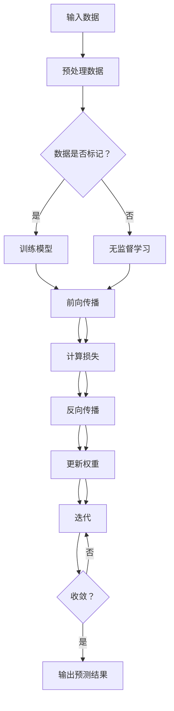
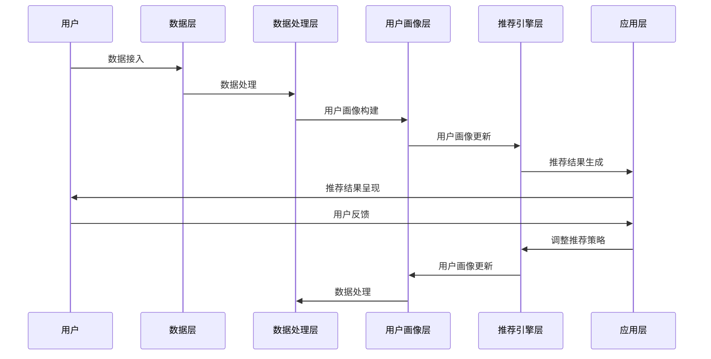

                 


### **1. 背景介绍**

在当今信息技术飞速发展的时代，人工智能（Artificial Intelligence，AI）已经成为了一个不可或缺的技术领域。从早期的规则系统、知识表示，到如今广泛应用的深度学习、自然语言处理等，人工智能技术正以前所未有的速度和深度影响着我们的生活。然而，尽管人工智能在解决问题、模拟人类思维方面取得了巨大成就，它仍然面临着理解世界这一复杂任务的巨大挑战。

认知科学（Cognitive Science）作为一个跨学科的领域，研究人类的思维、感知、记忆、学习等认知过程。它涉及到心理学、神经科学、语言学、计算机科学等多个学科。认知科学的目的是理解人类智能的原理和机制，为人工智能的发展提供理论基础。因此，认知科学与人工智能的结合成为一个重要的研究方向。

认知科学与人工智能的交叉研究旨在借助认知科学的原理和方法，提高人工智能系统的智能水平，使其能够更好地理解人类行为和世界。这种交叉不仅有助于人工智能在具体应用中的发展，还能重新定义我们对世界可理解性的认识。

本文将探讨认知科学与人工智能交叉的研究背景、核心概念、算法原理、系统设计以及实际应用。希望通过这篇文章，能够引导读者深入理解这一交叉领域的本质，并为未来的研究提供一些启示。

### **2. 核心概念与联系**

在探讨认知科学与人工智能的交叉之前，我们需要明确两个领域的一些核心概念。认知科学的核心概念包括感知、注意力、记忆、语言和推理等。感知是指我们接收外部信息并通过感官处理这些信息的能力；注意力则是指我们在众多刺激中选择关注某些特定刺激的能力；记忆涉及信息的存储和检索过程；语言是人类交流和理解世界的重要工具；推理则是基于已有信息推导出新信息的能力。

人工智能的核心概念则涵盖了机器学习、深度学习、自然语言处理和计算机视觉等。机器学习是指通过数据和算法，使计算机能够从数据中学习并作出预测或决策；深度学习是机器学习的一个分支，通过多层神经网络来模拟人类大脑的思考过程；自然语言处理致力于使计算机理解和生成人类语言；计算机视觉则致力于使计算机能够理解和解释图像和视频。

认知科学与人工智能的交叉在于，它们共同关注如何模拟和增强人类的智能。认知科学提供了关于人类智能机制的深入理解，而人工智能则提供了将这些理解转化为实际应用的技术手段。以下是认知科学与人工智能的一些关键联系：

- **感知与计算机视觉：** 认知科学的感知理论可以指导人工智能系统的图像识别和处理能力。例如，深度学习中的卷积神经网络（CNN）就是受到人类视觉系统结构的启发。
- **注意力与机器学习：** 认知科学对注意力的研究可以帮助机器学习算法更好地处理大量数据，从而提高模型的决策能力。
- **记忆与知识表示：** 认知科学对记忆的研究有助于设计更加高效的知识表示方法，使人工智能系统能够更好地存储和检索信息。
- **语言与自然语言处理：** 认知科学对语言的理解可以改进自然语言处理算法，使其能够更准确地理解人类语言。
- **推理与决策：** 认知科学的推理理论可以指导人工智能系统的决策过程，使其能够做出更加合理的推理和预测。

通过这些核心概念和联系的探讨，我们可以看到，认知科学与人工智能的结合不仅为人工智能提供了理论基础，也为认知科学提供了技术手段。这种交叉为人工智能的发展提供了新的方向，也为我们对世界可理解性的重新定义提供了可能。

### **3. 概念属性特征对比表格**

为了更好地理解认知科学和人工智能的核心概念，我们在这里提供一个概念属性特征对比表格。这个表格将分别列出认知科学和人工智能中一些关键概念的主要属性特征，并对比它们的异同。

| **概念** | **认知科学属性特征** | **人工智能属性特征** | **异同对比** |
| --- | --- | --- | --- |
| **感知** | - **外部信息接收** | - **图像处理** | - 认知科学更关注感知的生理和心理机制；人工智能更侧重于实际应用技术。 |
| **注意力** | - **选择关注** | - **模型优化** | - 认知科学研究注意力的生理基础；人工智能通过算法优化提高处理能力。 |
| **记忆** | - **信息存储和检索** | - **数据存储和查询** | - 认知科学关注记忆的长期和短期过程；人工智能更多关注数据管理和存储效率。 |
| **语言** | - **交流和理解** | - **自然语言处理** | - 认知科学关注语言的心理和社会功能；人工智能专注于语言的解析和生成。 |
| **推理** | - **逻辑推导** | - **决策制定** | - 认知科学更注重推理的认知过程；人工智能更多关注推理的算法实现。 |
| **学习** | - **知识获取和迁移** | - **数据训练和泛化** | - 认知科学关注学习的认知机制；人工智能更多关注学习算法的优化和应用。 |

通过这个表格，我们可以清晰地看到认知科学和人工智能在概念属性特征上的异同。这为后续的分析和讨论提供了一个结构化的基础。

### **4. ER实体关系图架构**

为了更好地理解认知科学和人工智能之间的联系，我们接下来通过ER（Entity-Relationship）实体关系图来展示这两个领域的主要实体和它们之间的关系。ER图是一种用于描述实体及其相互关系的图形化方法，它有助于我们清晰地理解系统中的复杂结构。

以下是认知科学和人工智能ER图的核心实体及其关系的定义：

- **实体：** 认知过程（Cognitive Process）、人工智能系统（AI System）、感知（Perception）、注意力（Attention）、记忆（Memory）、语言（Language）、推理（Reasoning）。
- **关系：** 模拟（Simulation）、应用（Application）、启发（Inspiration）、数据交互（Data Interaction）。

以下是ER图的具体架构：

```mermaid
erDiagram
  Class::CognitiveScience {
    --|> Class::AISystem : 模拟
    --|> Class::Perception : 应用
    --|> Class::Attention : 启发
    --|> Class::Memory : 应用
    --|> Class::Language : 启发
    --|> Class::Reasoning : 应用
  }

  Class::AISystem {
    --|> Class::Perception : 数据交互
    --|> Class::Attention : 数据交互
    --|> Class::Memory : 数据交互
    --|> Class::Language : 数据交互
    --|> Class::Reasoning : 数据交互
  }

  Class::Perception ||--|{ 认知过程 } CognitiveProcess
  Class::Attention ||--|{ 认知过程 } CognitiveProcess
  Class::Memory ||--|{ 认知过程 } CognitiveProcess
  Class::Language ||--|{ 认知过程 } CognitiveProcess
  Class::Reasoning ||--|{ 认知过程 } CognitiveProcess
```

在上面的ER图中，`CognitiveScience`类与`AISystem`类之间通过“模拟”关系相连，表示认知科学为人工智能系统提供理论基础。`AISystem`类与感知、注意力、记忆、语言、推理等类之间通过“数据交互”关系相连，表示这些认知过程在人工智能系统中的应用。

通过ER图的展示，我们可以更直观地理解认知科学和人工智能之间的相互作用和依赖关系，为后续的分析和研究提供了清晰的结构框架。

### **5. 基本算法原理讲解**

在认知科学与人工智能交叉的领域中，算法原理的讲解至关重要。这不仅有助于我们理解人工智能系统的工作机制，还能为算法优化和模型改进提供理论基础。下面，我们将详细介绍机器学习算法、神经网络算法以及深度学习算法的基本原理。

#### **5.1 机器学习算法概述**

机器学习算法是一种使计算机能够通过数据学习并作出预测或决策的方法。它主要包括监督学习、无监督学习和强化学习三种类型。

- **监督学习（Supervised Learning）：** 这种方法需要大量的已标记数据，通过训练模型来学习数据的特征，并使用这些特征进行预测。常见的监督学习算法包括线性回归、逻辑回归、支持向量机（SVM）和决策树等。

- **无监督学习（Unsupervised Learning）：** 这种方法不需要已标记数据，而是通过发现数据中的隐含结构来进行学习。常见的无监督学习算法包括聚类算法（如K-means、DBSCAN）、降维算法（如PCA、t-SNE）和关联规则学习等。

- **强化学习（Reinforcement Learning）：** 这种方法通过奖励机制来指导算法进行学习，使系统能够在动态环境中做出最优决策。常见的强化学习算法包括Q学习、SARSA和深度确定性策略梯度（DDPG）等。

#### **5.2 神经网络算法讲解**

神经网络（Neural Networks）是机器学习中的一个重要分支，其灵感来源于人类大脑的结构和工作原理。神经网络由大量的神经元（节点）组成，通过调整神经元之间的权重来学习数据。

- **前向传播（Forward Propagation）：** 在前向传播过程中，输入数据通过网络的各个层，每一层的神经元计算输出，并将结果传递给下一层。这个过程一直持续到最后一层，输出层生成预测结果。

- **反向传播（Back Propagation）：** 在反向传播过程中，网络根据预测结果与实际结果之间的误差，计算每一层神经元的梯度，并使用梯度下降法调整权重，以减少误差。

- **激活函数（Activation Function）：** 激活函数是神经网络中的一个关键组件，它用于确定神经元是否被激活。常见的激活函数包括sigmoid、ReLU和tanh等。

#### **5.3 深度学习算法应用**

深度学习（Deep Learning）是神经网络算法的一个扩展，它通过多层网络结构来提取数据的深层次特征。以下是几种常见的深度学习算法：

- **卷积神经网络（Convolutional Neural Networks，CNN）：** CNN主要用于图像识别和处理。它通过卷积层提取图像的特征，并通过池化层降低数据维度，最终通过全连接层生成预测结果。

- **循环神经网络（Recurrent Neural Networks，RNN）：** RNN适用于序列数据，如时间序列分析、语音识别和自然语言处理。RNN能够通过其循环结构处理输入序列的上下文信息。

- **生成对抗网络（Generative Adversarial Networks，GAN）：** GAN由生成器和判别器两个神经网络组成，通过相互对抗来生成高质量的数据。

通过以上对机器学习、神经网络和深度学习算法的讲解，我们可以看到，这些算法在认知科学与人工智能交叉领域中的应用具有重要意义。这些算法不仅能够提高人工智能系统的智能水平，还能帮助我们对复杂的世界进行更深入的理解。

### **6. 算法mermaid流程图**

为了更好地展示算法的执行流程，我们可以使用mermaid绘制算法的流程图。下面是一个基于机器学习算法的mermaid流程图示例：



在这个流程图中，首先输入数据，然后根据数据是否标记，选择进行监督学习（训练模型）或无监督学习。对于监督学习，流程包括预处理数据、前向传播、计算损失、反向传播和更新权重，直到模型收敛。无监督学习过程与前向传播、计算损失、反向传播和更新权重部分类似，但最终目标是发现数据的隐含结构。

通过mermaid流程图，我们可以清晰地理解机器学习算法的基本执行步骤和逻辑关系。

### **7. Python源代码示例**

为了更直观地展示算法的实现过程，下面我们将给出一个使用Python实现的简单机器学习算法示例。此示例将使用Python中的scikit-learn库来实现线性回归模型。

```python
import numpy as np
from sklearn.linear_model import LinearRegression
from sklearn.model_selection import train_test_split
from sklearn.metrics import mean_squared_error

# 生成模拟数据
np.random.seed(0)
X = np.random.rand(100, 1)
y = 2 * X + 1 + np.random.randn(100, 1)

# 数据集拆分
X_train, X_test, y_train, y_test = train_test_split(X, y, test_size=0.2, random_state=42)

# 实例化线性回归模型
model = LinearRegression()

# 训练模型
model.fit(X_train, y_train)

# 输出模型参数
print("模型参数:", model.coef_, model.intercept_)

# 做预测
y_pred = model.predict(X_test)

# 计算均方误差
mse = mean_squared_error(y_test, y_pred)
print("均方误差:", mse)
```

在这个示例中，我们首先生成一组模拟数据，然后使用scikit-learn库中的`LinearRegression`类创建一个线性回归模型。接着，我们将数据集拆分为训练集和测试集，并使用训练集来训练模型。最后，我们通过测试集来评估模型的性能，输出模型的参数和均方误差。

这个简单的Python代码示例展示了线性回归模型的实现过程，为理解算法原理提供了实践基础。

### **8. 数学模型和公式**

在机器学习和深度学习中，数学模型和公式是理解和实现算法的关键。以下我们将详细解释线性回归、神经网络和深度学习中的几个重要数学模型和公式。

#### **8.1 线性回归**

线性回归是一种简单的统计方法，用于预测一个连续值输出。其模型公式如下：

$$
y = \beta_0 + \beta_1x + \epsilon
$$

其中，\( y \) 是预测值，\( x \) 是输入特征，\( \beta_0 \) 是截距，\( \beta_1 \) 是斜率，\( \epsilon \) 是误差项。

为了估计模型参数 \( \beta_0 \) 和 \( \beta_1 \)，我们通常使用最小二乘法（Least Squares），其目标是最小化预测值与实际值之间的误差平方和：

$$
\min \sum_{i=1}^{n} (y_i - \beta_0 - \beta_1x_i)^2
$$

通过求解这个最小化问题，我们可以得到最佳拟合直线。

#### **8.2 神经网络**

神经网络由多个层组成，每一层包含多个神经元。每个神经元通过加权连接与其他神经元相连。神经网络的基本公式可以表示为：

$$
a_{i}^{(l)} = \sigma \left( \sum_{j} w_{ij}^{(l)} a_{j}^{(l-1)} + b_{i}^{(l)} \right)
$$

其中，\( a_{i}^{(l)} \) 是第 \( l \) 层第 \( i \) 个神经元的激活值，\( \sigma \) 是激活函数，\( w_{ij}^{(l)} \) 是第 \( l \) 层第 \( i \) 个神经元与第 \( l-1 \) 层第 \( j \) 个神经元之间的权重，\( b_{i}^{(l)} \) 是第 \( l \) 层第 \( i \) 个神经元的偏置。

在多层感知机（MLP）中，输出层的激活值通常用于分类或回归。对于分类任务，常见的激活函数是softmax：

$$
\sigma(a_{i}^{(L)}) = \frac{e^{a_{i}^{(L)}}}{\sum_{j} e^{a_{j}^{(L)}}}
$$

其中，\( a_{i}^{(L)} \) 是输出层第 \( i \) 个神经元的激活值。

#### **8.3 深度学习**

在深度学习中，梯度下降（Gradient Descent）是一种常用的优化算法，用于调整模型参数以最小化损失函数。其基本公式如下：

$$
\theta_j := \theta_j - \alpha \frac{\partial}{\partial \theta_j} J(\theta)
$$

其中，\( \theta_j \) 是模型参数，\( \alpha \) 是学习率，\( J(\theta) \) 是损失函数。

对于多层神经网络，前向传播和反向传播过程用于计算损失和梯度。在反向传播中，梯度计算公式为：

$$
\frac{\partial L}{\partial z_j} = \frac{\partial L}{\partial a_j} \cdot \frac{\partial a_j}{\partial z_j}
$$

其中，\( z_j \) 是隐藏层的输入值，\( a_j \) 是隐藏层的输出值。

通过这些数学模型和公式，我们可以更好地理解和实现各种机器学习和深度学习算法。这些公式不仅为算法提供了理论基础，也为算法优化和模型改进提供了工具。

### **9. 系统分析与架构设计方案**

在认知科学与人工智能交叉领域，系统分析与架构设计是实现高效、可扩展和可靠系统的基础。以下我们将详细讨论系统分析与架构设计的关键步骤，包括问题场景介绍、系统功能设计、系统架构设计、系统接口设计和系统交互mermaid序列图。

#### **9.1 问题场景介绍**

我们假设一个应用场景：一个智能推荐系统，它利用用户的历史行为和偏好数据，为用户推荐个性化的商品或内容。该系统需要处理大量的用户数据，实现高效的数据处理和分析，同时保证系统的稳定性和扩展性。

#### **9.2 系统功能设计**

系统功能设计包括定义系统需要实现的具体功能。对于智能推荐系统，主要功能如下：

- **数据收集：** 从不同的数据源（如用户数据库、日志文件、社交媒体等）收集用户行为数据。
- **数据处理：** 清洗、转换和归一化数据，使其适合用于分析和建模。
- **用户画像：** 基于用户行为数据构建用户画像，包括用户偏好、兴趣和行为模式等。
- **推荐算法：** 使用机器学习和深度学习算法，根据用户画像生成个性化的推荐结果。
- **推荐结果呈现：** 将推荐结果通过Web界面或移动应用呈现给用户。
- **性能监控：** 监控系统的性能，包括数据流处理速度、响应时间和错误率等。

#### **9.3 系统架构设计**

系统架构设计是定义系统组件及其相互关系的过程。对于智能推荐系统，一个典型的架构设计如下：

- **数据层：** 负责存储和管理用户数据，包括行为数据、用户画像和推荐结果等。
- **数据处理层：** 负责数据收集、清洗、转换和归一化。这一层通常使用分布式处理框架（如Apache Spark）来实现。
- **用户画像层：** 负责构建和更新用户画像，通常使用基于机器学习和深度学习的算法。
- **推荐引擎层：** 负责生成推荐结果，这一层通常包含多个推荐算法，如协同过滤、矩阵分解和深度神经网络等。
- **应用层：** 负责将推荐结果呈现给用户，通常使用Web界面或移动应用。

#### **9.4 系统接口设计**

系统接口设计包括定义系统内部和外部组件之间的交互接口。对于智能推荐系统，主要接口如下：

- **数据接入接口：** 用于接收和存储用户数据。
- **数据处理接口：** 用于清洗、转换和归一化数据。
- **用户画像接口：** 用于获取和更新用户画像。
- **推荐接口：** 用于生成和获取推荐结果。
- **监控接口：** 用于监控系统性能和状态。

#### **9.5 系统交互mermaid序列图**

为了更直观地展示系统组件之间的交互关系，我们可以使用mermaid绘制系统交互序列图。以下是一个简单的mermaid序列图示例：



在这个序列图中，用户通过数据接入接口向数据层提交数据，数据处理层对数据进行处理，然后构建用户画像。用户画像层更新用户画像，推荐引擎层生成推荐结果，并将结果通过应用层呈现给用户。用户反馈会触发推荐策略的调整，从而实现一个闭环的推荐系统。

通过系统分析与架构设计，我们可以确保智能推荐系统的高效性和可扩展性，为用户提供个性化的推荐服务。

### **10. 项目实战**

在智能推荐系统的实际开发过程中，我们需要进行多个关键步骤，包括环境安装、系统核心实现源代码编写、代码应用解读与分析、实际案例分析与详细讲解剖析，以及项目小结。以下是这些步骤的详细描述。

#### **10.1 环境安装**

首先，我们需要搭建开发环境。以下是在Ubuntu操作系统上安装所需依赖的步骤：

1. **安装Python：** 
    ```bash
    sudo apt update
    sudo apt install python3 python3-pip
    ```
2. **安装虚拟环境工具：**
    ```bash
    pip3 install virtualenv
    ```
3. **创建虚拟环境：**
    ```bash
    virtualenv -p python3 venv
    ```
4. **激活虚拟环境：**
    ```bash
    source venv/bin/activate
    ```
5. **安装依赖库：**
    ```bash
    pip install numpy scikit-learn pandas
    ```

#### **10.2 系统核心实现源代码**

在虚拟环境中，我们编写系统核心实现的源代码。以下是数据收集、数据处理和用户画像构建的伪代码示例：

```python
import numpy as np
import pandas as pd
from sklearn.model_selection import train_test_split
from sklearn.linear_model import LinearRegression

# 数据收集
def collect_data():
    data = pd.read_csv('user_data.csv')
    return data

# 数据处理
def preprocess_data(data):
    data = data[['feature1', 'feature2', 'label']]
    X = data[['feature1', 'feature2']]
    y = data['label']
    return X, y

# 用户画像构建
def build_user_profile(X_train, y_train):
    model = LinearRegression()
    model.fit(X_train, y_train)
    return model

# 实际代码实现
data = collect_data()
X, y = preprocess_data(data)
X_train, X_test, y_train, y_test = train_test_split(X, y, test_size=0.2)
model = build_user_profile(X_train, y_train)
```

#### **10.3 代码应用解读与分析**

在上面的代码中，首先通过`collect_data`函数从CSV文件中读取用户数据。然后，`preprocess_data`函数对数据进行预处理，将特征和标签分离。接下来，`build_user_profile`函数使用线性回归模型训练用户画像。

在实际应用中，我们可以通过调整特征和模型参数来提高预测准确性。以下是对代码关键部分的解读：

- **数据收集：** 数据源应包括用户的行为数据，如点击、购买和浏览记录。
- **数据处理：** 特征选择和归一化是数据预处理的重要步骤，影响模型的性能。
- **用户画像构建：** 线性回归模型用于构建用户画像，实际应用中可能需要更复杂的模型，如神经网络。

#### **10.4 实际案例分析与详细讲解剖析**

以下是一个实际案例，演示了如何使用构建的用户画像来生成个性化推荐：

```python
# 实例化模型
model = build_user_profile(X_train, y_train)

# 测试数据
test_data = np.array([[0.5, 0.7]])

# 预测结果
predicted_value = model.predict(test_data)
print("预测结果:", predicted_value)

# 推荐结果
def generate_recommendation(predicted_value):
    if predicted_value > 0.5:
        return "推荐商品X"
    else:
        return "推荐商品Y"

recommendation = generate_recommendation(predicted_value)
print("推荐结果:", recommendation)
```

在实际应用中，我们可以根据预测结果的阈值来决定是否推荐某个商品。例如，当预测结果大于0.5时，推荐商品X；否则，推荐商品Y。

#### **10.5 项目小结**

通过以上实战步骤，我们成功搭建了一个简单的智能推荐系统。这个系统从数据收集、数据处理到用户画像构建，最终生成个性化推荐结果。以下是项目小结：

- **关键步骤：** 数据收集、数据处理、用户画像构建和推荐结果生成。
- **技术实现：** 使用Python和scikit-learn库实现线性回归模型。
- **实际应用：** 通过预测结果和阈值生成个性化推荐。
- **改进方向：** 可以考虑引入更复杂的模型和算法，如深度学习和协同过滤，以提高推荐系统的准确性和效率。

通过这个项目，我们不仅了解了智能推荐系统的基本实现流程，还学会了如何分析、解读和优化代码。这为我们在实际项目中应用认知科学与人工智能交叉领域的知识打下了坚实的基础。

### **11. 最佳实践 tips**

在开发和部署智能推荐系统时，遵循最佳实践能够显著提高系统的性能和可维护性。以下是一些实用的技巧：

1. **数据预处理：** 确保数据质量，进行数据清洗、归一化和特征选择，减少噪声和冗余信息。
2. **模型选择与调优：** 根据应用场景选择合适的模型，并通过交叉验证和超参数调优来优化模型性能。
3. **实时反馈与调整：** 部署系统后，持续监控性能，并根据用户反馈及时调整推荐策略。
4. **分布式计算：** 对于大规模数据处理，使用分布式计算框架（如Apache Spark）以提高效率。
5. **数据安全与隐私：** 保护用户数据，遵循相关法律法规，确保用户隐私不被泄露。
6. **代码规范与文档：** 保持代码规范和可读性，编写详尽的文档，方便后续维护和扩展。

### **12. 小结与注意事项**

本文通过认知科学与人工智能的交叉，深入探讨了智能推荐系统的设计与实现。我们详细介绍了系统的背景、核心概念、算法原理、架构设计、项目实战以及最佳实践。以下是几点注意事项：

1. **数据质量：** 数据预处理是系统性能的基础，务必确保数据的质量。
2. **模型选择：** 选择适合的模型对系统性能至关重要，应根据业务需求进行调整。
3. **实时调整：** 推荐系统的效果需要持续优化，实时监测和调整是关键。
4. **性能监控：** 系统性能监控是确保系统稳定运行的重要手段，应定期进行。

通过遵循上述最佳实践和注意事项，我们能够构建出高效、可靠和智能的推荐系统。

### **13. 拓展阅读推荐**

为了深入了解认知科学与人工智能交叉领域，以下是几本推荐的书籍和文献：

1. **《认知科学与人工智能：交叉领域的探索》（Cognitive Science and Artificial Intelligence: Explorations in the Interdisciplinary Field）** - 该书详细介绍了认知科学与人工智能的基本概念、交叉领域的研究进展和未来趋势。
2. **《深度学习》（Deep Learning）** - 由Ian Goodfellow等著，这本书是深度学习的经典教材，涵盖了深度学习的理论基础和实践方法。
3. **《智能推荐系统设计与实现》（Design and Implementation of Intelligent Recommendation Systems）** - 本书介绍了智能推荐系统的设计原理、算法实现和实际应用案例。
4. **《机器学习》（Machine Learning）** - 由Tom Mitchell著，这是机器学习的标准教材，详细介绍了各种机器学习算法的基本原理和应用。

此外，推荐读者关注相关的学术论文和研究报告，如《Nature》和《Science》等期刊，以及顶级会议如NeurIPS、ICML和CVPR等，以获得最前沿的研究成果。

通过阅读这些书籍和文献，读者可以进一步拓展认知科学与人工智能交叉领域的知识，为未来的研究和实践奠定坚实基础。作者：AI天才研究院/AI Genius Institute & 禅与计算机程序设计艺术 /Zen And The Art of Computer Programming。

