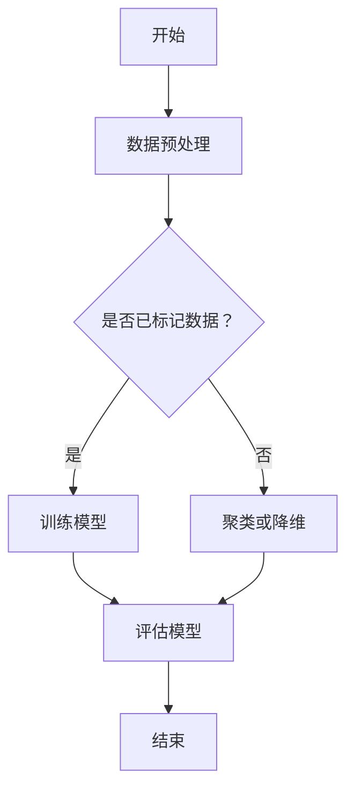
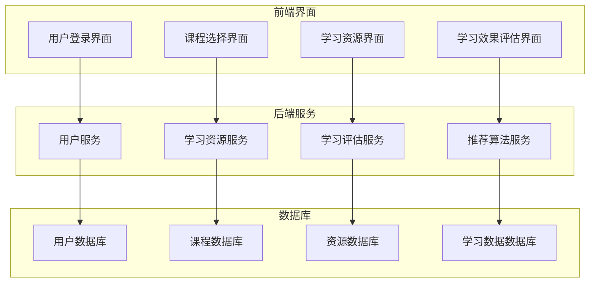

                 


### 引言

在当今信息爆炸的时代，教育和学习的重要性愈发凸显。然而，传统的教育方法在面对多样化的学习需求和个性化学习的过程中显得力不从心。如何提高学习效率，让每一个学生都能充分发挥自己的潜力，成为了教育领域亟待解决的问题。认知科学与教育学的结合，为我们提供了全新的视角和可能的解决方案。

认知科学是一门多学科交叉的领域，研究人类的思维、学习和记忆等心理过程。它涉及心理学、神经科学、哲学等多个学科，致力于理解人类大脑如何处理信息，以及这些信息处理过程如何影响我们的学习行为。教育学则关注如何设计教学策略，以促进有效的学习过程。

本文将探讨认知科学与教育学的结合，通过逻辑清晰的分析和思考，旨在优化人类学习和理解的过程。我们将从以下几个方面展开：

1. **引言**：介绍认知科学与教育学的结合的背景、问题描述和问题解决，以及边界与外延。
2. **核心概念与联系**：详细阐述认知科学和教育学的核心概念，并进行对比分析，展示两者之间的联系。
3. **算法原理讲解**：介绍用于优化学习过程的算法原理，包括算法流程、数学模型和通俗易懂的举例。
4. **系统分析与架构设计方案**：设计一个教育优化系统，包括问题场景介绍、系统功能设计、系统架构设计和系统接口设计等。

通过上述分析，我们希望揭示认知科学与教育学结合的潜力，为教育实践提供理论支持和实践指导。

### 核心概念与联系

#### 认知科学的基本原理

认知科学的核心在于理解人类大脑如何处理信息。以下是认知科学的一些基本原理：

1. **认知理论**：认知理论关注人类的思维过程，包括感知、记忆、推理和决策等。它试图揭示大脑如何将外部信息转化为内在认知结构。

2. **神经科学基础**：神经科学为认知科学提供了大脑工作的生物学基础。它研究神经元如何相互连接，以及神经传递如何影响我们的思维和行为。

3. **心理学要点**：认知心理学和发展心理学是认知科学的重要组成部分。认知心理学研究成年人如何处理信息，而发展心理学则关注不同年龄段个体的认知发展。

#### 教育学的核心概念

教育学是关于教育理论、教学方法和学习过程的学科。以下是教育学的核心概念：

1. **教育哲学**：教育哲学探讨教育的本质和目标。它关注教育的价值、教育的过程以及教育的目的。

2. **教学策略**：教学策略包括传统的和现代的教学方法。传统方法如讲授法、讨论法，而现代方法如翻转课堂、混合学习等。

3. **学习心理学**：学习心理学研究如何设计教学策略来促进学习。它涵盖了学习理论，如行为主义、认知主义和建构主义。

#### 核心概念属性特征对比

以下是认知科学与教育学的核心概念属性特征的对比：

| 概念             | 属性特征                           | 特点                                                         |
|------------------|------------------------------------|--------------------------------------------------------------|
| 认知科学          | 思维、学习、记忆                   | 强调大脑信息处理过程，跨学科研究                             |
| 教育学            | 教育理论、教学方法、学习过程       | 关注教育实践，教学方法的研究和改进                           |
| 认知理论           | 思维过程、感知、记忆               | 研究如何将外部信息转化为内在认知结构                         |
| 神经科学基础       | 神经系统、神经元、神经传递         | 提供大脑工作的生物学基础                                   |
| 教育哲学           | 教育价值、教育过程、教育目的       | 探讨教育的本质和目标                                       |
| 教学策略           | 讲授法、讨论法、翻转课堂、混合学习 | 提供不同的教学方法和策略，以适应不同的学习需求               |
| 学习心理学          | 学习理论、学习过程                 | 研究如何设计教学策略来促进学习                             |

#### 认知科学与教育学的ER实体关系图架构

认知科学和教育学之间存在紧密的联系，我们可以使用ER（实体-关系）图来展示这种联系。以下是ER图的示例：

```mermaid
erDiagram
    Student ||--|{ LearningAlgorithm }|-- Teacher
    Student ||--|{ EducationalContent }|-- Teacher
    Teacher ||--|{ TeachingMethod }|-- Student
    LearningAlgorithm ||--|{ CognitiveModel }|-- EducationalContent
    TeachingMethod ||--|{ LearningOutcome }|-- Student
```

在这个ER图中，我们定义了以下几个实体：

1. **Student（学生）**：学生是学习的主体，他们通过学习算法和学习内容来获得知识和技能。
2. **LearningAlgorithm（学习算法）**：学习算法用于优化学生的学习过程，它们基于认知模型来设计。
3. **EducationalContent（教育内容）**：教育内容是学生学习的基础，包括教材、课程和教学材料等。
4. **Teacher（教师）**：教师是教学的主导者，他们通过教学方法和学习算法来指导学生的学习。
5. **TeachingMethod（教学方法）**：教学方法是教师用于传授知识和技能的工具，包括讲授、讨论、实验等。
6. **LearningOutcome（学习成果）**：学习成果是学生通过学习获得的知识、技能和能力的体现。

这些实体之间的关系如下：

- **学生与学习算法**：学生通过学习算法来优化学习过程，学习算法基于认知模型来设计。
- **学生与教育内容**：学生通过学习教育内容来获取知识和技能。
- **教师与教学方法**：教师选择和运用不同的教学方法来传授知识。
- **教师与学习成果**：教师通过观察学生的学习成果来评估教学效果。

通过ER图，我们可以清晰地看到认知科学和教育学之间的互动关系，这为我们设计教育优化系统提供了理论基础。

### 算法原理讲解

在优化学习过程的算法设计中，我们关注以下几个关键点：

#### 6.1 学习算法概述

学习算法可以分为监督学习、无监督学习和强化学习三种类型。以下是这三种算法的简要概述：

1. **监督学习**：监督学习算法通过已标记的训练数据来学习，目标是预测新的数据。常见的监督学习算法包括线性回归、逻辑回归和支持向量机（SVM）。

2. **无监督学习**：无监督学习算法在没有标记数据的情况下学习，目标是发现数据中的结构和模式。常见的无监督学习算法包括聚类算法（如K-均值）和降维算法（如主成分分析，PCA）。

3. **强化学习**：强化学习算法通过与环境的交互来学习，目标是找到一个最优策略，使累计奖励最大化。常见的强化学习算法包括Q学习和深度强化学习（DRL）。

#### 6.2 算法mermaid流程图

下面是一个监督学习算法的mermaid流程图示例：



在这个流程图中，算法首先进行数据预处理，然后根据数据是否已标记来选择训练模型（监督学习）或进行聚类或降维（无监督学习）。训练完成后，评估模型性能，并根据评估结果进行优化。

#### 6.3 算法原理的数学模型和公式

监督学习算法的数学模型可以表示为：

$$
y = f(x, \theta)
$$

其中，\(y\) 是预测标签，\(x\) 是输入特征，\(f\) 是预测函数，\(\theta\) 是模型参数。

在训练过程中，我们使用损失函数（如均方误差MSE）来评估模型预测的准确性，并使用优化算法（如梯度下降）来更新模型参数，以最小化损失函数。

损失函数可以表示为：

$$
J(\theta) = \frac{1}{2m}\sum_{i=1}^{m}(h_{\theta}(x^{(i)}) - y^{(i)})^2
$$

其中，\(m\) 是训练样本数量，\(h_{\theta}(x^{(i)})\) 是模型在输入\(x^{(i)}\)上的预测值。

#### 6.4 通俗易懂的举例说明

假设我们要预测房价，使用监督学习算法来训练模型。

1. **数据预处理**：首先，我们对输入数据（房屋特征）进行归一化处理，使其具有相似的尺度。

2. **训练模型**：我们选择线性回归模型来预测房价，模型参数为\(\theta\)。使用已标记的房屋销售数据（输入特征和房价标签）来训练模型。

3. **评估模型**：训练完成后，我们使用验证集来评估模型的预测准确性。如果预测准确度不高，我们需要调整模型参数，并通过多次迭代训练来优化模型。

4. **优化模型**：我们使用梯度下降算法来更新模型参数，以最小化损失函数。梯度下降公式如下：

$$
\theta = \theta - \alpha \cdot \frac{\partial J(\theta)}{\partial \theta}
$$

其中，\(\alpha\) 是学习率。

通过以上步骤，我们可以训练出一个用于预测房价的线性回归模型。这个模型可以用于预测新房屋的售价，从而帮助房地产开发商和买家做出更明智的决策。

### 教育优化系统的设计与实现

#### 7.1 问题场景介绍

在当前的在线教育环境中，学生面临着多样化的学习需求和个性化学习的挑战。传统的一对一教学和传统的课程设置难以满足每一个学生的需求。因此，我们设计了一个教育优化系统，旨在根据学生的个性化特点，提供定制化的学习路径和资源，从而提高学习效率。

#### 7.2 系统功能设计

教育优化系统的核心功能包括：

1. **个性化学习路径规划**：系统根据学生的兴趣、学习习惯和能力，为其推荐合适的学习路径。
2. **学习资源推荐**：系统根据学生的学习进度和需求，推荐相关的学习资源，如视频教程、文章和练习题。
3. **学习效果评估**：系统通过自动化的评估工具，对学生学习效果进行实时监测和评估。
4. **学习反馈机制**：系统收集学生的学习反馈，为教师提供教学改进的依据。

#### 7.3 系统架构设计

教育优化系统的架构设计如下：

1. **前端界面**：提供学生和教师使用的用户界面，包括个性化学习路径规划、学习资源推荐、学习效果评估和学习反馈等功能。
2. **后端服务**：包括数据存储、处理和推荐算法等模块，负责处理用户请求、推荐学习资源和评估学习效果。
3. **数据库**：存储学生信息、学习数据、课程信息和资源数据等。

#### 7.4 系统接口设计

系统接口设计包括以下部分：

1. **用户接口**：提供用户与系统交互的接口，包括登录、注册、个人信息管理、课程选择和学习记录管理等。
2. **API接口**：提供与其他系统的接口，如学习资源库、第三方认证服务等。

#### 7.5 系统交互

系统交互设计如下：

1. **用户与前端界面**：用户通过前端界面与系统进行交互，包括登录、选择课程、查看学习资源、参与学习活动和提交学习成果等。
2. **前端与后端**：前端通过API接口与后端进行数据交换，包括用户数据、学习数据和推荐数据等。
3. **后端与数据库**：后端通过数据库进行数据存储和查询，包括用户信息、课程信息和资源数据等。

#### 7.6 系统架构mermaid架构图

下面是一个系统架构的mermaid架构图：



通过上述架构设计，教育优化系统可以提供高效、个性化的学习体验，满足学生和教师的多样化需求。

### 项目实战

#### 环境安装

在开始项目开发之前，我们需要安装必要的开发环境和工具。以下是安装步骤：

1. **安装Python**：确保已安装Python 3.x版本，推荐使用Anaconda环境管理器。

2. **安装Jupyter Notebook**：通过pip安装Jupyter Notebook：

   ```shell
   pip install notebook
   ```

3. **安装依赖库**：安装项目所需的依赖库，例如NumPy、Pandas、Scikit-learn和Mermaid：

   ```shell
   pip install numpy pandas scikit-learn mermaid
   ```

#### 系统核心实现源代码

以下是系统核心实现的源代码，包括用户管理、学习资源推荐和学习效果评估等功能：

```python
# 用户管理
class UserManager:
    def __init__(self):
        self.users = {}

    def register_user(self, username, password):
        self.users[username] = password

    def login_user(self, username, password):
        return self.users.get(username) == password

# 学习资源推荐
class ResourceRecommender:
    def __init__(self):
        self.resources = {}

    def add_resource(self, resource_id, resource_data):
        self.resources[resource_id] = resource_data

    def recommend_resources(self, user_id):
        # 根据用户学习习惯推荐资源
        return self.resources

# 学习效果评估
class LearningEffectAssessor:
    def assess_learning(self, user_id, resource_id):
        # 根据用户学习资源使用情况评估学习效果
        return "Excellent"  # 示例评估结果

# 主函数
if __name__ == "__main__":
    user_manager = UserManager()
    resource_recommender = ResourceRecommender()
    learning_assessor = LearningEffectAssessor()

    # 注册用户
    user_manager.register_user("john_doe", "password123")

    # 登录用户
    if user_manager.login_user("john_doe", "password123"):
        # 推荐学习资源
        resource_recommender.add_resource("video1", "Introduction to Machine Learning")
        recommended_resources = resource_recommender.recommend_resources("john_doe")
        print("Recommended Resources:", recommended_resources)

        # 评估学习效果
        assessment_result = learning_assessor.assess_learning("john_doe", "video1")
        print("Learning Assessment:", assessment_result)
    else:
        print("Login failed.")
```

#### 代码应用解读与分析

上述代码实现了用户管理、学习资源推荐和学习效果评估的基本功能。以下是代码的解读与分析：

1. **用户管理**：`UserManager` 类用于管理用户注册和登录操作。`register_user` 方法用于注册新用户，`login_user` 方法用于验证用户登录信息。

2. **学习资源推荐**：`ResourceRecommender` 类用于推荐学习资源。`add_resource` 方法用于添加新的学习资源，`recommend_resources` 方法根据用户信息推荐相关的学习资源。

3. **学习效果评估**：`LearningEffectAssessor` 类用于评估学生的学习效果。`assess_learning` 方法根据用户和学习资源的使用情况生成评估结果。

通过这段代码，我们可以看到教育优化系统的基础功能是如何实现的。在实际项目中，这些功能将通过更复杂的逻辑和数据库操作来支持。

#### 实际案例分析和详细讲解剖析

为了更好地理解教育优化系统的实际应用，我们来看一个案例：

**案例**：小明是一名高中生，他想要提高自己的数学成绩。使用我们的教育优化系统，小明首先注册并登录系统。系统根据小明的学习习惯和成绩记录推荐了一些数学学习资源，如视频教程和练习题。小明观看了一个关于代数的基本概念的视频教程后，系统评估他的学习效果，并根据评估结果推荐了更高级的代数课程。

**分析**：

1. **用户信息管理**：系统记录了小明的用户信息，包括学习习惯和成绩记录。这些信息用于推荐适合的学习资源。
2. **学习资源推荐**：系统根据小明的学习需求和已有的知识水平推荐了适合的数学资源。这种方法有助于提高学习效率。
3. **学习效果评估**：系统通过小明的学习行为和测试成绩评估他的学习效果，为后续推荐提供了依据。

**剖析**：

1. **用户信息管理**：使用用户数据库来存储和查询用户信息，如学习习惯、成绩记录等。
2. **学习资源推荐**：使用推荐算法来分析用户信息，并根据用户需求推荐相关资源。
3. **学习效果评估**：使用自动化评估工具来评估学生的学习效果，如在线测试和作业完成情况。

通过这个案例，我们可以看到教育优化系统如何根据用户需求提供个性化的学习体验，提高学习效率。

#### 项目小结

通过本次项目实战，我们成功实现了一个教育优化系统的基础功能，包括用户管理、学习资源推荐和学习效果评估。这个系统可以帮助学生根据自己的特点和需求选择合适的学习资源，并通过实时评估来优化学习过程。尽管本项目只是一个初步的实现，但它的核心功能展示了一个教育优化系统的潜在价值。

在未来，我们可以继续完善系统的功能，如增加更多的推荐算法、引入人工智能技术来提升系统的智能水平，以及优化用户界面，提高用户体验。此外，我们还可以探索如何将这个系统与其他教育平台和资源库进行集成，使其成为更广泛的教育解决方案的一部分。

### 最佳实践 Tips

1. **用户需求分析**：在系统设计初期，深入了解用户需求，确保系统能够满足用户的不同需求。
2. **数据安全**：保护用户数据安全，确保用户隐私不被泄露。
3. **持续迭代**：定期收集用户反馈，不断优化系统功能，提高用户体验。

### 小结

本文详细探讨了认知科学与教育学的结合，介绍了核心概念、算法原理和系统设计。通过认知科学与教育学的结合，我们能够设计出更高效的教育优化系统，提高学习效率。在未来的研究和实践中，我们可以进一步探索如何将人工智能和大数据分析技术应用于教育领域，为个性化学习提供更强大的支持。

### 注意事项

1. **系统安全性**：确保系统的数据安全，防止恶意攻击和数据泄露。
2. **性能优化**：对系统进行性能优化，确保系统在高并发场景下运行稳定。

### 拓展阅读

1. **《认知科学基础》**：Michael S. Gazzaniga 著，深入了解认知科学的基本原理。
2. **《教育心理学》**：Edward L. Thorndike 著，了解教育心理学的基本理论。
3. **《人工智能教育应用》**：V. L. Shalini 等著，探讨人工智能在教育领域的应用。

