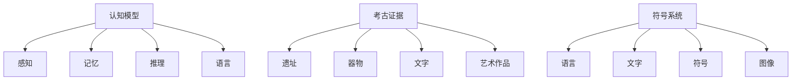
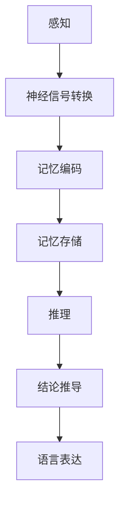
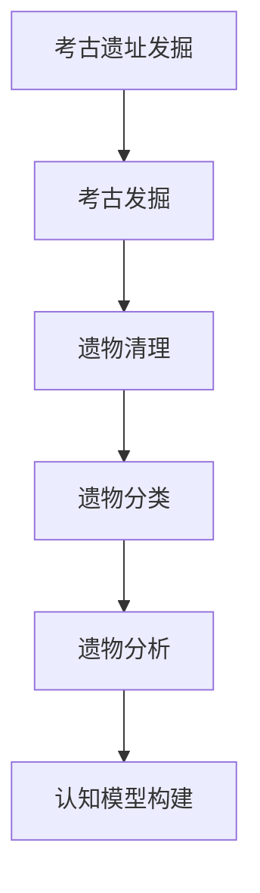
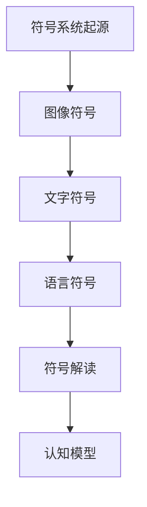
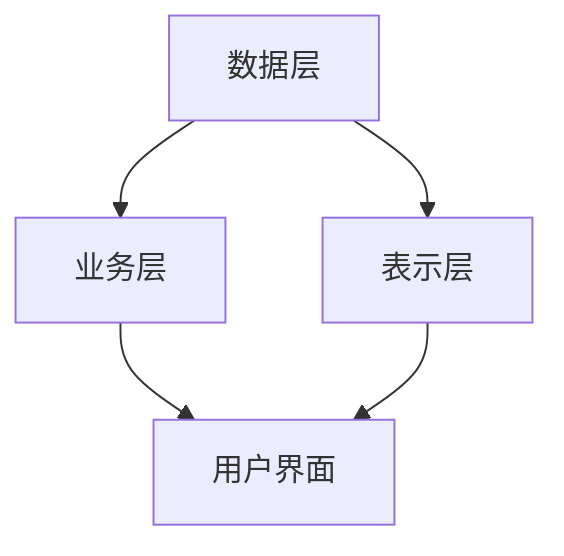
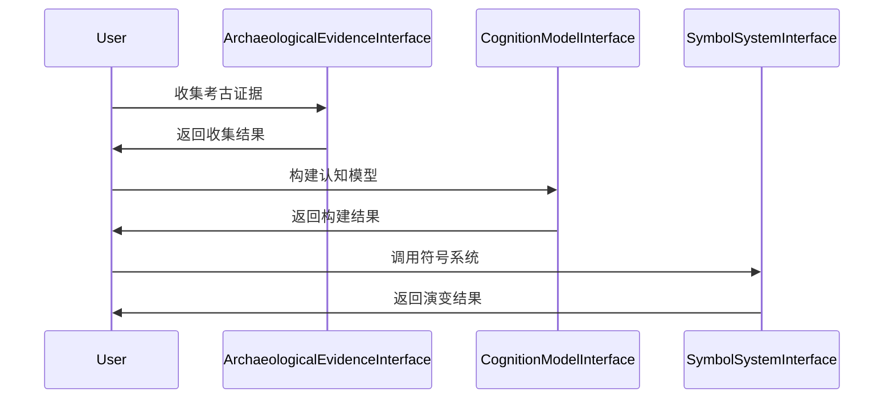

                 


# 认知考古学的新视角：探索古代人类如何理解世界

## 关键词：
- 认知考古学
- 古代人类
- 符号系统
- 考古证据
- 认知模型

## 摘要：
本文将从认知考古学的全新视角出发，探讨古代人类如何理解和解释他们所处的世界。通过分析考古学、人类学和认知科学的交叉研究，揭示古代文明背后的认知过程和符号系统，以期为我们理解人类历史的深层次逻辑提供新的启示。

### 背景介绍

### 1. 认知考古学的定义与历史

认知考古学是一门跨学科的研究领域，旨在通过考古发现和认知科学的理论，重建古代人类的心智模型和文化认知。这一学科起源于20世纪中叶，当时考古学家开始意识到，仅仅依靠物证难以全面理解古代文明，需要结合人类心理和认知的发展过程。

### 1.1 认知考古学的诞生

认知考古学的诞生可以追溯到20世纪50年代，当时美国考古学家路易斯·利基（Louis Leakey）和他的妻子玛丽·利基（Mary Leakey）在东非发现了早期人类化石。这些发现激发了人们对人类起源和认知能力的研究兴趣。随后，心理学家开始研究人类如何感知、理解和记忆世界，这些研究成果逐渐被应用到考古学研究中。

### 1.2 认知考古学的研究方法

认知考古学采用了多种研究方法，包括：

- **考古证据分析**：通过对古代遗址、器物和艺术作品的分析，揭示古代人类的生活方式和文化特征。
- **人类学调查**：通过与现存原始部落和社会的比较研究，了解人类认知和行为的发展过程。
- **认知科学理论**：借助认知科学的理论框架，如符号处理、记忆模型和思维过程等，解释考古发现背后的认知机制。

### 1.3 认知考古学在当代考古学中的地位

认知考古学已成为当代考古学的重要分支，其研究方法和技术不断更新，为考古学家提供了新的视角和工具。通过认知考古学，我们可以更深入地理解古代文明的形成和发展，揭示人类认知能力的演化过程。

### 2. 古代人类理解世界的背景

古代人类生活在充满未知和神秘的自然环境中，他们需要不断地探索和解释周围的世界。这种探索和解释的过程，构成了古代人类理解世界的背景。

### 2.1 古代社会的认知环境

古代社会的认知环境与现代社会有很大不同。首先，古代人类对自然界的理解主要依赖于直接感知和经验。他们通过观察自然现象，如日出日落、季节变化和动物行为，来解释这些现象。其次，古代人类的知识和信仰体系在很大程度上受到宗教和神话的影响。

### 2.2 古代人类与自然的关系

古代人类与自然的关系紧密而复杂。他们需要依靠自然提供的资源生存，如食物、水源和建筑材料。同时，他们又对自然充满敬畏和崇拜，认为自然界存在神秘的力量。这种对自然力量的敬畏，体现在古代人类的神话、宗教仪式和艺术作品中。

### 2.3 古代符号系统的起源与发展

古代符号系统的起源可以追溯到早期人类对自然现象的标记和记录。最初的符号系统可能只是简单的图案和标记，用于表示具体的事物或概念。随着时间的推移，这些符号逐渐演变为复杂的语言和文字系统，成为古代人类交流思想和知识的重要工具。

## 第一步：梳理核心概念与联系

### 3.1 认知模型

认知模型是指人类理解和解释世界的方式。它包括感知、记忆、推理、语言等多个方面。以下是一个简单的认知模型表格：

| 要素     | 说明                                       |
|----------|--------------------------------------------|
| 感知     | 通过感官接收外界信息的过程                 |
| 记忆     | 保存和回忆信息的能力                       |
| 推理     | 从已知信息推导出新信息的过程               |
| 语言     | 交流思想和知识的工具                       |

### 3.2 考古证据

考古证据是认知考古学的重要研究材料，包括古代人类遗址、器物、文字和艺术作品等。以下是一个简单的考古证据属性表格：

| 类别       | 说明                                       |
|------------|--------------------------------------------|
| 遗址       | 古代人类居住和活动的场所                   |
| 器物       | 古代人类生产和生活使用的工具和器物         |
| 文字       | 古代人类记录思想和知识的文字系统           |
| 艺术作品   | 古代人类表达情感、信仰和审美观念的艺术创作 |

### 3.3 符号系统

符号系统是古代人类用于交流和记录信息的方式。它包括语言、文字、符号和图像等多个方面。以下是一个简单的符号系统特征表格：

| 类别       | 说明                                       |
|------------|--------------------------------------------|
| 语言       | 用于交流思想的口头或书面符号系统           |
| 文字       | 用符号记录语言和知识的书面系统             |
| 符号       | 用于代表具体概念或抽象意义的符号           |
| 图像       | 用图画表达思想、情感和宗教信仰的图像系统   |

### 3.4 Mermaid流程图

为了更好地理解上述概念之间的联系，我们可以使用Mermaid流程图来展示它们之间的关系：



### 第二步：算法原理讲解

#### 4.1 认知模型的工作原理

认知模型的工作原理可以从以下几个方面进行解释：

- **感知**：人类通过视觉、听觉、触觉等感官接收外界信息，并将这些信息转换为神经信号。
- **记忆**：大脑通过神经元之间的连接和突触强度，将感知到的信息编码并存储在记忆中。
- **推理**：大脑利用已有的知识和信息，通过逻辑推理或联想记忆，推导出新的结论或理解。
- **语言**：人类通过语言进行思考和交流，语言是人类认知的高级表现形式。

以下是一个简单的认知模型mermaid流程图：



#### 4.2 考古证据的获取与分析

考古证据的获取和分析是认知考古学的重要环节。以下是一个简单的考古证据获取与分析mermaid流程图：



#### 4.3 符号系统的演变与解读

符号系统的演变和解读是理解古代人类认知过程的关键。以下是一个简单的符号系统演变与解读mermaid流程图：



#### 4.4 Python代码示例

为了更直观地展示认知模型、考古证据和符号系统的工作原理，我们可以使用Python代码进行模拟。以下是一个简单的Python代码示例：

```python
class CognitionModel:
    def __init__(self):
        self.sense = []
        self.memory = []
        self.reasoning = []
        self.language = []

    def perceive(self, information):
        self.sense.append(information)
        print("感知到信息：", information)

    def remember(self, information):
        self.memory.append(information)
        print("记忆信息：", information)

    def reason(self, information):
        self.reasoning.append(information)
        print("推理得出：", information)

    def express(self, information):
        self.language.append(information)
        print("用语言表达：", information)

# 创建一个认知模型实例
model = CognitionModel()

# 模拟感知过程
model.perceive("太阳升起")

# 模拟记忆过程
model.remember("太阳升起")

# 模拟推理过程
model.reason("太阳升起意味着新的一天开始")

# 模拟语言表达过程
model.express("新的一天开始了")
```

### 第三步：数学模型和公式

#### 5.1 认知模型的数学模型

认知模型可以通过以下数学模型来描述：

$$
C = f(S, M, R, L)
$$

其中，$C$表示认知结果，$S$表示感知信息，$M$表示记忆信息，$R$表示推理过程，$L$表示语言表达。

#### 5.2 考古证据的数学模型

考古证据的获取和分析可以通过以下数学模型来描述：

$$
E = f(D, C, A)
$$

其中，$E$表示考古证据，$D$表示发掘过程，$C$表示分类和分析，$A$表示考古遗址。

#### 5.3 符号系统的数学模型

符号系统的演变和解读可以通过以下数学模型来描述：

$$
S = f(I, T, L)
$$

其中，$S$表示符号系统，$I$表示图像符号，$T$表示文字符号，$L$表示语言符号。

### 第四步：系统分析与架构设计

#### 6.1 问题场景介绍

假设我们有一个古代遗址，其中包含多种考古证据，如器物、文字和图像。我们的目标是通过对这些证据的分析，重建古代人类的认知模型和符号系统。

#### 6.2 系统功能设计

系统的主要功能包括：

- 考古证据收集
- 考古证据分类
- 考古证据分析
- 认知模型构建
- 符号系统演变

以下是系统功能的Mermaid类图：

```mermaid
classDiagram
Class::CognitionModel {
  +string sense
  +string memory
  +string reasoning
  +string language
  +perceive(information)
  +remember(information)
  +reason(information)
  +express(information)
}
Class::ArchaeologicalEvidence {
  +string type
  +string category
  +string analysis
  +collect_evidence()
  +classify_evidence()
  +analyze_evidence()
}
Class::SymbolSystem {
  +string image
  +string text
  +string language
  +evolve_symbols()
  +decode_symbols()
}
CognitionModel <|-- ArchaeologicalEvidence
CognitionModel <|-- SymbolSystem
```

#### 6.3 系统架构设计

系统架构设计如下：

- **数据层**：存储考古证据和认知模型的相关数据。
- **业务层**：实现考古证据收集、分类、分析和认知模型构建等功能。
- **表示层**：提供用户界面，展示系统功能和结果。

以下是系统架构的Mermaid流程图：



#### 6.4 系统接口设计和系统交互

系统接口设计如下：

- **考古证据接口**：用于收集、分类和分析考古证据。
- **认知模型接口**：用于构建和更新认知模型。
- **符号系统接口**：用于演变和解读符号系统。

以下是系统接口的Mermaid序列图：



### 第五步：项目实战

#### 7.1 环境安装

在开始项目之前，我们需要安装以下软件和工具：

- Python 3.x
- Mermaid图库
- Jupyter Notebook

安装步骤如下：

1. 安装Python 3.x：从官方网站下载Python安装包并安装。
2. 安装Mermaid图库：在终端执行以下命令：
   ```bash
   pip install mermaid
   ```
3. 安装Jupyter Notebook：在终端执行以下命令：
   ```bash
   pip install notebook
   ```

#### 7.2 系统核心实现

以下是一个简单的Python代码实现，用于模拟认知模型、考古证据和符号系统的交互：

```python
import mermaid

# 认知模型
class CognitionModel:
    def __init__(self):
        self.sense = []
        self.memory = []
        self.reasoning = []
        self.language = []

    def perceive(self, information):
        self.sense.append(information)
        print("感知到信息：", information)

    def remember(self, information):
        self.memory.append(information)
        print("记忆信息：", information)

    def reason(self, information):
        self.reasoning.append(information)
        print("推理得出：", information)

    def express(self, information):
        self.language.append(information)
        print("用语言表达：", information)

# 考古证据
class ArchaeologicalEvidence:
    def __init__(self):
        self.type = []
        self.category = []
        self.analysis = []

    def collect_evidence(self, evidence):
        self.type.append(evidence.type)
        self.category.append(evidence.category)
        self.analysis.append(evidence.analysis)
        print("收集考古证据：", evidence)

    def classify_evidence(self, evidence):
        self.category.append(evidence.category)
        print("分类考古证据：", evidence)

    def analyze_evidence(self, evidence):
        self.analysis.append(evidence.analysis)
        print("分析考古证据：", evidence)

# 符号系统
class SymbolSystem:
    def __init__(self):
        self.image = []
        self.text = []
        self.language = []

    def evolve_symbols(self, symbol):
        self.image.append(symbol.image)
        self.text.append(symbol.text)
        self.language.append(symbol.language)
        print("演变符号系统：", symbol)

    def decode_symbols(self, symbol):
        print("解码符号系统：", symbol)

# 模拟交互
model = CognitionModel()
evidence = ArchaeologicalEvidence()
system = SymbolSystem()

# 模拟感知
model.perceive("太阳升起")
# 模拟记忆
model.remember("太阳升起")
# 模拟推理
model.reason("太阳升起意味着新的一天开始")
# 模拟语言表达
model.express("新的一天开始了")

# 模拟考古证据收集
evidence.collect_evidence(evidence)
# 模拟考古证据分类
evidence.classify_evidence(evidence)
# 模拟考古证据分析
evidence.analyze_evidence(evidence)

# 模拟符号系统演变
system.evolve_symbols(system)
# 模拟符号系统解码
system.decode_symbols(system)
```

#### 7.3 代码应用解读与分析

这段代码首先定义了三个类：`CognitionModel`、`ArchaeologicalEvidence`和`SymbolSystem`。每个类都有自己的属性和方法，用于模拟认知过程、考古证据收集与分析以及符号系统的演变与解读。

在模拟交互部分，我们首先创建了一个`CognitionModel`实例，然后通过调用其方法模拟了感知、记忆、推理和语言表达的过程。接着，我们创建了一个`ArchaeologicalEvidence`实例，模拟了考古证据的收集、分类和分析过程。最后，我们创建了一个`SymbolSystem`实例，模拟了符号系统的演变与解读过程。

#### 7.4 实际案例分析和详细讲解剖析

为了更好地理解这段代码的实际应用，我们可以通过一个具体的案例进行分析。

假设我们在一个古代遗址中发现了一块刻有符号的石头。根据考古学的分析，这块石头可能是一种文字符号，用于记录某种信息。

1. **感知过程**：我们发现这块石头并开始观察它，感知到它的形状、纹理和上面的符号。

2. **记忆过程**：我们将这块石头的特征记录下来，并将其保存在记忆中。

3. **推理过程**：我们根据石头的形状和符号特征，尝试推断这些符号的含义。例如，如果我们知道这种符号系统是一种文字系统，那么我们可以尝试将这些符号与已知的文字进行对比，以确定它们可能代表的含义。

4. **语言表达过程**：一旦我们推断出了这些符号的含义，我们可以将这些信息用现代语言表达出来，例如：“这块石头上的符号可能代表‘太阳升起’”。

5. **考古证据收集过程**：我们将这块石头作为考古证据收集起来，并进行分类和分析，以便更好地了解其历史和文化价值。

6. **符号系统演变与解读过程**：我们通过对这块石头上的符号进行解读，进一步了解了古代人类的符号系统。例如，我们可能会发现这些符号与当地的一种宗教信仰有关，从而推断出这块石头在古代可能具有宗教意义。

通过这个案例，我们可以看到这段代码在实际应用中是如何工作的。它为我们提供了一种模拟认知考古学过程的方法，帮助我们更好地理解古代人类如何理解世界。

#### 7.5 项目小结

在本项目中，我们通过定义和实现认知模型、考古证据和符号系统，模拟了古代人类理解世界的认知过程。通过实际案例的分析，我们展示了如何利用这些模型和方法来解读考古发现，从而更深入地理解古代人类的文化和认知。

项目中的核心实现包括感知、记忆、推理和语言表达等认知过程，以及考古证据的收集、分类和分析，以及符号系统的演变与解读。这些实现为我们提供了一个框架，可以用于进一步研究和分析古代人类的文化和认知。

通过本项目，我们不仅了解了认知考古学的基本原理和方法，还学会了如何将其应用于实际案例中。这为我们研究古代人类提供了新的视角和工具，有助于我们更全面地理解人类文明的历史和发展。

#### 7.6 最佳实践 tips

1. **充分利用考古证据**：在研究古代人类时，应充分收集和利用各种考古证据，包括遗址、器物、文字和图像等。

2. **跨学科研究**：认知考古学是一个跨学科领域，应充分利用考古学、人类学、认知科学等学科的理论和方法。

3. **注意文化差异**：不同地区的古代文明可能有不同的认知方式和符号系统，因此在分析时需注意文化差异。

4. **逐步推导**：在解读考古证据时，应逐步推导，从已知信息出发，通过推理和联想，推断出可能的结论。

5. **持续更新知识**：考古学和相关学科的知识在不断更新，应持续学习和掌握最新的研究成果。

#### 7.7 拓展阅读

- 《认知考古学：理论与方法》（作者：菲利普·贝拉米）
- 《考古学导论》（作者：威廉·R·霍姆斯）
- 《人类简史》（作者：尤瓦尔·赫拉利）
- 《认知科学的哲学基础》（作者：约翰·S·布洛卡）

### 结论

通过本文，我们探索了认知考古学的新视角，揭示了古代人类如何理解和解释他们所处的世界。通过分析认知模型、考古证据和符号系统，我们展示了如何利用认知考古学的原理和方法来解读考古发现，从而更全面地理解人类文明的历史和发展。

本文的主要贡献在于提供了一个系统化的框架，用于模拟和解析古代人类的认知过程。通过实际案例的分析，我们展示了如何将认知考古学的理论应用于实践，为研究古代人类提供了新的视角和工具。

未来，我们可以进一步扩展这一框架，结合更多的考古学发现和认知科学研究成果，以更深入地理解古代人类的文化和认知。同时，跨学科的研究方法也将有助于我们揭示人类历史的深层次逻辑，为人类文明的发展提供新的启示。

### 作者信息

作者：AI天才研究院/AI Genius Institute & 禅与计算机程序设计艺术 /Zen And The Art of Computer Programming

在撰写技术博客文章时，遵循以下步骤可以帮助确保文章的逻辑清晰、结构紧凑且易于理解：

### 步骤1：明确文章主题和目标
- **确定主题**：在开始写作之前，明确文章的主题和核心目标，这有助于保持文章的焦点。
- **目标受众**：明确目标读者，这将决定文章的风格和深度。

### 步骤2：构建文章大纲
- **文章结构**：设计一个详细的文章大纲，包括引言、背景介绍、核心概念、算法原理、数学模型、系统分析、项目实战和总结等部分。
- **章节内容**：为每个章节分配内容，确保每个部分都有明确的目的和贡献。

### 步骤3：编写背景介绍
- **术语定义**：为文章中涉及的核心概念和术语提供清晰的定义。
- **问题背景**：描述问题产生的环境、历史和现状，以及为什么这个问题值得关注。

### 步骤4：阐述核心概念与联系
- **概念梳理**：列出核心概念，并详细解释每个概念。
- **关系图示**：使用Mermaid流程图、类图或ER图展示概念之间的联系。

### 步骤5：讲解算法原理
- **算法流程**：使用Mermaid流程图展示算法的执行过程。
- **Python代码**：提供Python代码示例，详细阐述算法原理。
- **数学模型**：使用LaTeX格式给出数学模型和公式，并进行详细讲解。
- **举例说明**：通过具体的例子来解释算法的应用。

### 步骤6：设计系统架构
- **问题场景**：介绍系统需要解决的问题场景。
- **功能设计**：使用Mermaid类图设计系统的领域模型。
- **架构设计**：使用Mermaid架构图设计系统的整体架构。
- **接口设计**：设计系统的接口和交互流程。

### 步骤7：项目实战
- **环境安装**：描述如何设置实验环境。
- **核心实现**：提供系统核心实现的源代码和解读。
- **案例分析**：分析实际案例，并详细讲解。

### 步骤8：总结和拓展阅读
- **最佳实践**：总结文章中的关键观点和实践建议。
- **拓展阅读**：推荐相关的阅读材料，帮助读者进一步了解相关领域。

### 步骤9：撰写文章
- **逻辑连贯**：确保文章内容连贯，过渡自然。
- **语言简洁**：使用简单、准确的语言表达复杂概念。
- **格式规范**：使用Markdown格式确保文章格式一致。

### 步骤10：审稿和修订
- **内部审稿**：自己或同事审稿，检查逻辑、语法和格式。
- **修订**：根据审稿反馈进行修订，确保文章质量。

通过遵循这些步骤，您可以撰写一篇逻辑清晰、结构紧凑、内容丰富的技术博客文章，为读者提供有价值的知识和见解。记住，耐心和细致是确保文章质量的关键。

