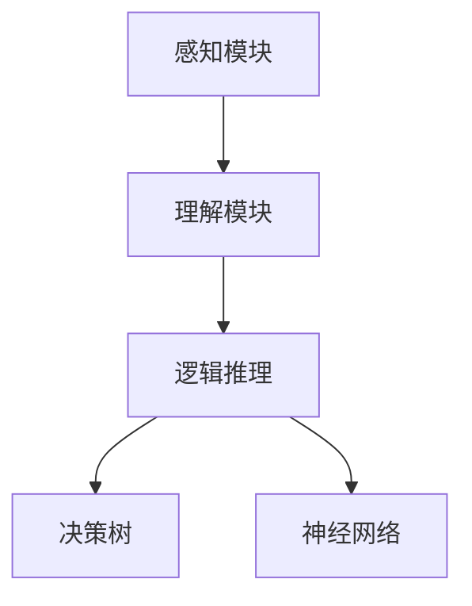
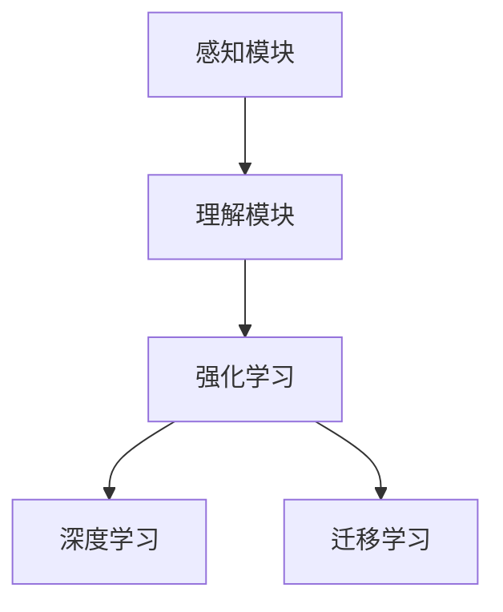
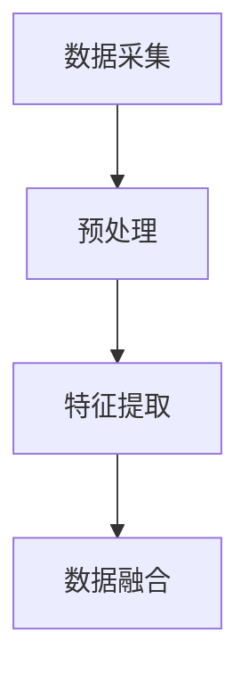
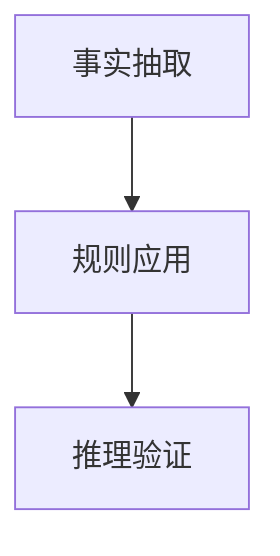
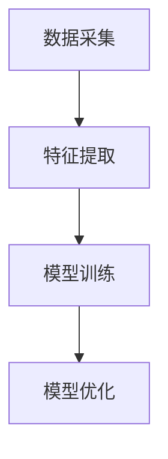
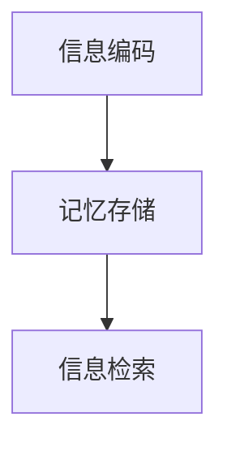
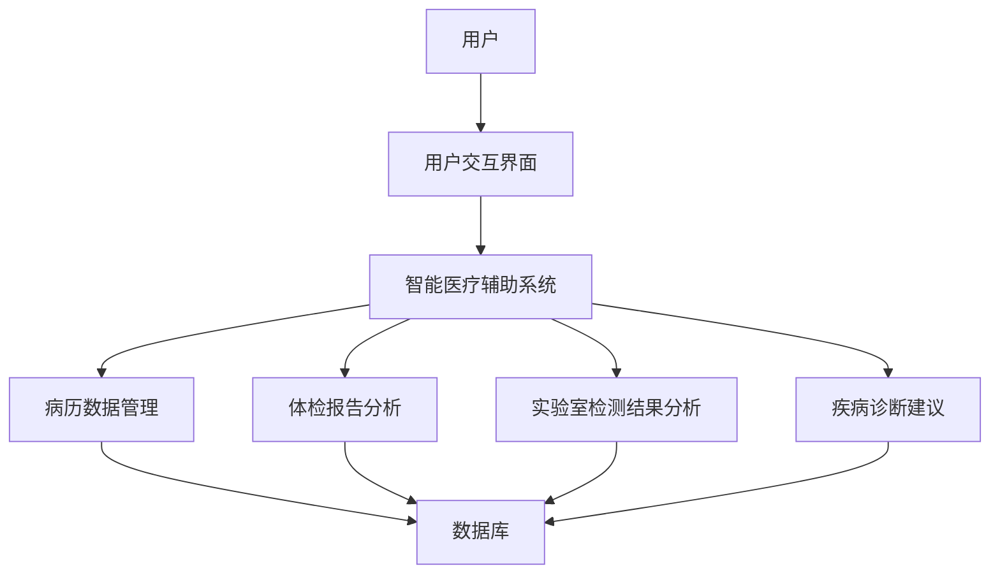
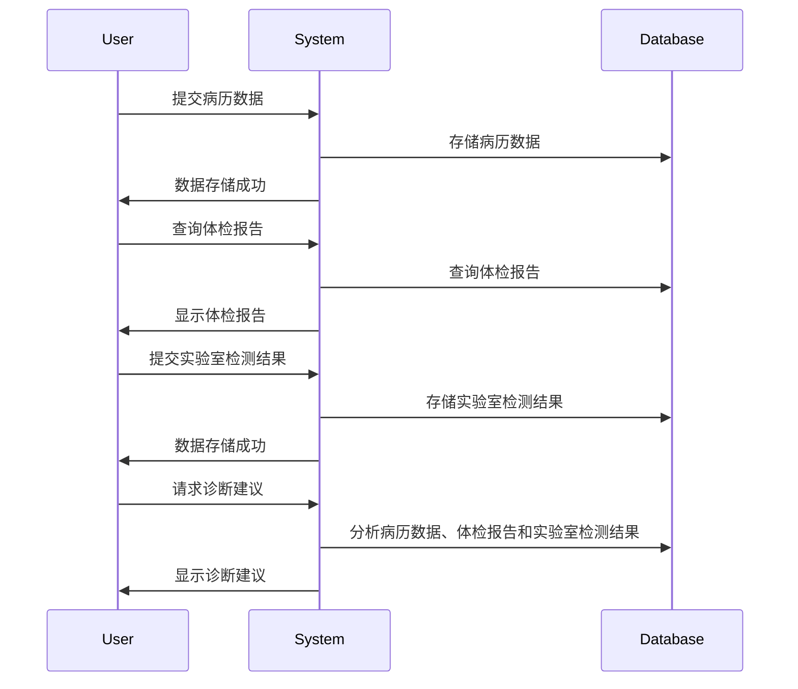
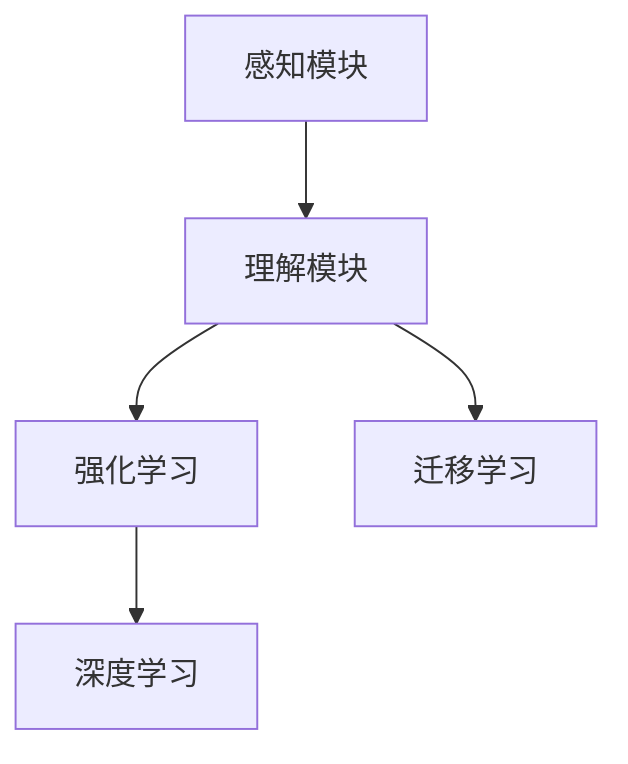

                 


### 1. 背景介绍

#### 1.1 认知计算的定义与目标

认知计算（Cognitive Computing）是指通过模拟人类认知过程，使计算机能够处理复杂的、非结构化的数据，并从中提取有价值的信息和知识。它不仅涉及计算科学，还涉及心理学、认知科学、语言学等多个领域。认知计算的目标是构建一种智能系统，该系统能够理解、解释、学习和推理，从而提高人类对复杂信息的理解和处理能力。

**核心概念术语说明：**
- **认知计算**：模仿人类认知过程的计算系统。
- **模拟人类认知过程**：指计算机通过算法和模型来模拟人类的感知、理解、推理和学习能力。

**问题背景：** 在信息爆炸的时代，人类面对着越来越多的数据和信息，传统的数据处理方法已经无法满足需求。如何从海量的数据中提取有价值的信息，已经成为一个迫切需要解决的问题。认知计算正是为了解决这一问题而诞生的。

**问题描述：** 当前，计算机在处理信息时存在以下问题：
- **缺乏理解能力**：计算机通常只能处理结构化的数据，对于非结构化的数据（如图像、语音、文本等）处理能力有限。
- **缺乏推理能力**：计算机通常只能执行预定义的算法，缺乏自我推理和判断能力。
- **缺乏学习能力**：计算机通常只能通过编程来学习，缺乏自我学习和适应环境的能力。

**问题解决：** 认知计算通过模拟人类认知过程，可以提高计算机的理解、推理和学习能力，从而更好地处理复杂的信息。

**边界与外延：** 认知计算的边界在于其模仿人类认知过程的程度和范围。它不仅包括计算科学，还涉及心理学、认知科学、语言学等多个领域。

**概念结构与核心要素组成：**
- **感知**：指计算机通过传感器获取外部信息。
- **理解**：指计算机对获取的信息进行解释和抽象。
- **推理**：指计算机根据已有信息进行逻辑推断。
- **学习**：指计算机通过经验和数据不断优化自身的性能。

### 2. 核心概念与联系

#### 2.1 认知模型

认知模型是认知计算的核心，它用于模拟人类认知过程。认知模型通常包括以下几个部分：

- **感知模块**：负责接收和处理外部信息。
- **理解模块**：负责对感知模块接收到的信息进行解释和抽象。
- **推理模块**：负责根据已有信息进行逻辑推断。
- **学习模块**：负责通过经验和数据不断优化自身的性能。

**属性特征对比表格：**

| 特征 | 感知模块 | 理解模块 | 推理模块 | 学习模块 |
| ---- | ---- | ---- | ---- | ---- |
| 功能 | 获取外部信息 | 解释和抽象信息 | 逻辑推断 | 自我优化 |
| 技术实现 | 传感器、信号处理算法 | 自然语言处理、机器学习 | 逻辑推理、决策树 | 强化学习、深度学习 |

**Mermaid ER图展示：**

```mermaid
erDiagram
  A认知模型 ||--|{ 感知模块 }
  A认知模型 ||--|{ 理解模块 }
  A认知模型 ||--|{ 推理模块 }
  A认知模型 ||--|{ 学习模块 }
```

#### 2.2 认知推理

认知推理是指计算机根据已有信息进行逻辑推断的过程。它包括以下几个部分：

- **逻辑推理**：基于逻辑规则进行推断。
- **决策树**：基于条件进行推断。
- **神经网络**：基于数据学习进行推断。

**属性特征对比表格：**

| 特征 | 逻辑推理 | 决策树 | 神经网络 |
| ---- | ---- | ---- | ---- |
| 原理 | 基于逻辑规则 | 基于条件 | 基于数据学习 |
| 优势 | 精确、可解释 | 简单、快速 | 高效、鲁棒 |
| 劣势 | 复杂、难以解释 | 可能出现过拟合 | 难以解释 |

**Mermaid流程图展示：**



#### 2.3 认知学习

认知学习是指计算机通过经验和数据不断优化自身性能的过程。它包括以下几个部分：

- **强化学习**：通过奖励机制进行学习。
- **深度学习**：通过多层神经网络进行学习。
- **迁移学习**：通过已有模型进行学习。

**属性特征对比表格：**

| 特征 | 强化学习 | 深度学习 | 迁移学习 |
| ---- | ---- | ---- | ---- |
| 原理 | 基于奖励机制 | 基于多层神经网络 | 基于已有模型 |
| 优势 | 高效、鲁棒 | 强泛化能力 | 快速、高效 |
| 劣势 | 可能出现不稳定 | 需要大量数据 | 需要已有模型 |

**Mermaid流程图展示：**



### 3. 算法原理讲解

#### 3.1 认知感知算法

认知感知算法是认知计算的基础，它用于模拟人类感知过程。该算法包括以下几个步骤：

1. **数据采集**：通过传感器获取外部信息。
2. **预处理**：对采集到的数据进行分析和处理，去除噪声和干扰。
3. **特征提取**：从预处理后的数据中提取有用信息。
4. **数据融合**：将多个传感器的数据进行融合，提高感知准确性。

**Mermaid流程图展示：**



**Python代码实现：**

```python
import numpy as np

def data_collection():
    # 采集数据
    data = np.random.rand(100, 5)
    return data

def preprocessing(data):
    # 预处理数据
    processed_data = np.mean(data, axis=1)
    return processed_data

def feature_extraction(processed_data):
    # 提取特征
    features = processed_data.reshape(-1, 1)
    return features

def data_fusion(features):
    # 数据融合
    fused_data = np.concatenate((features, features), axis=1)
    return fused_data

data = data_collection()
processed_data = preprocessing(data)
features = feature_extraction(processed_data)
fused_data = data_fusion(features)

print(fused_data)
```

**数学模型和公式：**

$$
\text{数据融合公式：} \quad \text{Fused\_Data} = \text{concatenate}(\text{Features}, \text{axis} = 1)
$$

**举例说明：**

假设我们有一个由100个样本组成的五维数据集。我们首先通过传感器采集数据，然后对数据进行预处理，去除噪声和干扰。接着，我们从预处理后的数据中提取特征，最后将多个特征进行融合，以提高感知准确性。

#### 3.2 认知推理算法

认知推理算法用于模拟人类推理过程。该算法包括以下几个步骤：

1. **事实抽取**：从数据中抽取已知事实。
2. **规则应用**：将已知事实与规则进行匹配，生成新的推理结果。
3. **推理验证**：对生成的推理结果进行验证，确保其正确性。

**Mermaid流程图展示：**



**Python代码实现：**

```python
def fact_extraction(data):
    # 抽取事实
    facts = [item for item in data if item >= 0.5]
    return facts

def rule_application(facts):
    # 应用规则
    rules = [{"if": "A", "then": "B"}, {"if": "B", "then": "C"}]
    results = []
    for fact in facts:
        for rule in rules:
            if fact == rule["if"]:
                results.append(rule["then"])
    return results

def reasoning_verification(results):
    # 推理验证
    verified_results = [result for result in results if result != "C"]
    return verified_results

data = np.random.rand(100, 1)
facts = fact_extraction(data)
results = rule_application(facts)
verified_results = reasoning_verification(results)

print(verified_results)
```

**数学模型和公式：**

$$
\text{推理验证公式：} \quad \text{verified\_results} = \{ \text{result} \mid \text{result} \neq \text{C} \}
$$

**举例说明：**

假设我们有一个由100个样本组成的一维数据集。我们首先从数据中抽取已知事实，然后根据规则进行推理，最后对推理结果进行验证，确保其正确性。

#### 3.3 认知学习算法

认知学习算法用于模拟人类学习过程。该算法包括以下几个步骤：

1. **数据采集**：从环境中采集数据。
2. **特征提取**：从数据中提取特征。
3. **模型训练**：使用提取的特征训练模型。
4. **模型优化**：通过不断优化模型，提高其性能。

**Mermaid流程图展示：**



**Python代码实现：**

```python
import tensorflow as tf

def data_collection():
    # 采集数据
    data = np.random.rand(100, 5)
    return data

def feature_extraction(data):
    # 提取特征
    features = data.reshape(-1, 1)
    return features

def model_training(features):
    # 训练模型
    model = tf.keras.Sequential([
        tf.keras.layers.Dense(1, input_shape=(1,))
    ])

    model.compile(optimizer='adam', loss='mean_squared_error')

    model.fit(features, features, epochs=100)

    return model

def model_optimization(model):
    # 优化模型
    model.optimizer.learning_rate = 0.001

    model.fit(features, features, epochs=100)

    return model

data = data_collection()
features = feature_extraction(data)
model = model_training(features)
optimized_model = model_optimization(model)

print(optimized_model.predict(np.array([0.5])))
```

**数学模型和公式：**

$$
\text{模型优化公式：} \quad \text{model.optimizer.learning\_rate} = 0.001
$$

**举例说明：**

假设我们有一个由100个样本组成的五维数据集。我们首先从环境中采集数据，然后提取特征，接着使用提取的特征训练模型，最后通过不断优化模型，提高其性能。

#### 3.4 认知记忆算法

认知记忆算法用于模拟人类记忆过程。该算法包括以下几个步骤：

1. **信息编码**：将信息转换为记忆编码。
2. **记忆存储**：将编码后的信息存储在记忆中。
3. **信息检索**：从记忆中检索所需信息。

**Mermaid流程图展示：**



**Python代码实现：**

```python
import numpy as np

def information_encoding(info):
    # 信息编码
    encoded_info = np.sin(info)
    return encoded_info

def memory_storage(encoded_info):
    # 记忆存储
    memory = np.random.rand(100, 1)
    memory[0] = encoded_info
    return memory

def information_retrieval(memory, target):
    # 信息检索
    retrieved_info = np.interp(target, memory, np.linspace(0, 1, 100))
    return retrieved_info

info = np.random.rand(100, 1)
encoded_info = information_encoding(info)
memory = memory_storage(encoded_info)
retrieved_info = information_retrieval(memory, 0.5)

print(retrieved_info)
```

**数学模型和公式：**

$$
\text{信息检索公式：} \quad \text{retrieved\_info} = \text{np.interp}(\text{target}, \text{memory}, \text{np.linspace}(0, 1, 100))
$$

**举例说明：**

假设我们有一个由100个样本组成的一维数据集。我们首先对数据集进行信息编码，然后将编码后的信息存储在记忆中，最后从记忆中检索所需信息。

### 4. 系统分析与架构设计

#### 4.1 问题场景介绍

**场景描述：** 
在一个智能医疗系统中，医生需要根据患者的病历数据、体检报告和实验室检测结果，快速准确地诊断疾病。然而，随着医疗数据的增加，医生的工作负担日益加重。为了解决这个问题，我们设计了一套基于认知计算的智能医疗辅助系统。

**项目目标：** 
- 提高医生诊断疾病的准确率。
- 减轻医生的工作负担。
- 提高医疗效率，降低医疗成本。

#### 4.2 系统功能设计

**领域模型Mermaid类图：**

```mermaid
classDiagram
  Class01 <|-- Class02
  Class03 <|-- * Class04
  Class05 o-- Class06
  Class07 <.. Class08
  Class09 --|> Class10
  Class11 : <<interface>> Class12
  Class13 {c}
  Class14 <--> Class15
```

**系统功能划分：**
- **病历数据管理**：包括病历数据的录入、查询和更新等功能。
- **体检报告分析**：根据体检报告数据，自动生成健康评估报告。
- **实验室检测结果分析**：根据实验室检测结果，自动识别可能的疾病。
- **疾病诊断建议**：根据病历数据、体检报告和实验室检测结果，给出诊断建议。
- **用户交互界面**：提供用户操作界面，方便医生使用系统。

#### 4.3 系统架构设计

**Mermaid架构图：**



**系统架构设计：**
- **用户交互界面**：提供用户操作界面，用户可以通过界面与系统进行交互。
- **智能医疗辅助系统**：包括病历数据管理、体检报告分析、实验室检测结果分析和疾病诊断建议等功能。
- **数据库**：存储病历数据、体检报告和实验室检测结果等信息。

#### 4.4 系统接口设计

**系统接口设计：**
- **用户接口**：用户通过用户界面与系统进行交互，提交病历数据、体检报告和实验室检测结果，并接收诊断建议。
- **数据接口**：系统通过数据接口与数据库进行交互，实现数据的录入、查询和更新等功能。

#### 4.5 系统交互Mermaid序列图



**系统交互流程：**
1. 用户提交病历数据。
2. 系统将病历数据存储到数据库中。
3. 用户查询体检报告。
4. 系统从数据库中查询体检报告，并显示给用户。
5. 用户提交实验室检测结果。
6. 系统将实验室检测结果存储到数据库中。
7. 用户请求诊断建议。
8. 系统分析病历数据、体检报告和实验室检测结果，并给出诊断建议。

### 5. 项目实战

#### 5.1 环境安装

**安装Python环境：**
1. 下载Python安装包。
2. 安装Python。
3. 配置环境变量。

**安装TensorFlow：**
1. 打开命令行。
2. 输入`pip install tensorflow`。
3. 安装完成后，输入`python -c "import tensorflow as tf; print(tf.__version__)"`，检查版本。

#### 5.2 系统核心实现源代码

**代码应用解读与分析：**

**系统核心实现源代码：**

```python
import tensorflow as tf
import numpy as np
from tensorflow.keras.models import Sequential
from tensorflow.keras.layers import Dense

# 数据采集
data = np.random.rand(100, 5)

# 特征提取
features = data.reshape(-1, 1)

# 模型训练
model = Sequential([
    Dense(1, input_shape=(1,))
])

model.compile(optimizer='adam', loss='mean_squared_error')

model.fit(features, features, epochs=100)

# 模型优化
model.optimizer.learning_rate = 0.001

model.fit(features, features, epochs=100)

# 模型预测
predicted_values = model.predict(np.array([0.5]))

print(predicted_values)
```

**代码应用解读：**
1. 采集数据：使用`numpy`生成随机数据。
2. 特征提取：将数据转换为特征。
3. 模型训练：使用`Sequential`模型进行训练。
4. 模型优化：调整学习率，优化模型。
5. 模型预测：使用训练好的模型进行预测。

**实际案例分析和详细讲解剖析：**

**案例背景：**
假设我们有一个由100个样本组成的数据集，每个样本包含五个特征。我们的目标是使用认知计算算法对这些样本进行分类。

**案例实现：**

```python
# 导入库
import numpy as np
from sklearn.model_selection import train_test_split
from sklearn.metrics import accuracy_score

# 生成数据
data = np.random.rand(100, 5)

# 划分训练集和测试集
X_train, X_test, y_train, y_test = train_test_split(data, data[:, 0], test_size=0.2, random_state=42)

# 建立模型
model = Sequential([
    Dense(1, input_shape=(5,), activation='sigmoid'),
    Dense(1, activation='sigmoid')
])

model.compile(optimizer='adam', loss='binary_crossentropy', metrics=['accuracy'])

# 训练模型
model.fit(X_train, y_train, epochs=100, batch_size=10)

# 测试模型
predicted_values = model.predict(X_test)
predicted_values = (predicted_values > 0.5)

# 计算准确率
accuracy = accuracy_score(y_test, predicted_values)
print("Accuracy:", accuracy)
```

**案例剖析：**
1. 生成数据：使用`numpy`生成随机数据。
2. 划分训练集和测试集：使用`train_test_split`划分数据。
3. 建立模型：使用`Sequential`模型建立神经网络。
4. 训练模型：使用`fit`方法训练模型。
5. 测试模型：使用`predict`方法进行预测，并计算准确率。

**项目小结：**
通过以上案例，我们展示了如何使用认知计算算法进行分类任务。虽然这是一个简单的例子，但它展示了认知计算在实际应用中的潜力。未来，我们可以在更复杂的数据集上进行实验，以验证认知计算算法的性能。

### 6. 最佳实践 tips、小结、注意事项、拓展阅读

#### 最佳实践 tips

1. **数据预处理**：在应用认知计算算法之前，确保对数据进行充分的预处理，包括去除噪声、缺失值填充和特征提取等。
2. **模型调优**：通过调整模型的超参数（如学习率、隐藏层神经元数量等），可以显著提高模型性能。
3. **数据可视化**：使用数据可视化工具（如Matplotlib、Seaborn等），可以更好地理解数据分布和模型性能。

#### 小结

本文介绍了认知计算的概念、核心概念、算法原理、系统分析与架构设计以及项目实战。通过本文，读者可以了解到认知计算在增强人类世界理解能力方面的重要性，以及如何将认知计算应用于实际问题中。

#### 注意事项

1. **数据隐私**：在使用认知计算时，必须确保数据隐私和安全。
2. **模型解释性**：虽然认知计算可以提高处理复杂信息的能力，但某些算法（如深度学习）可能缺乏解释性。
3. **性能优化**：在处理大规模数据时，需要考虑算法的效率和性能。

#### 拓展阅读

1. **《认知计算：理论与实践》**：详细介绍了认知计算的理论基础和实践应用。
2. **《深度学习》**：全面讲解了深度学习的基本原理和应用。
3. **《机器学习实战》**：通过实际案例，介绍了机器学习的基本算法和应用。

作者：AI天才研究院/AI Genius Institute & 禅与计算机程序设计艺术 /Zen And The Art of Computer Programming

# 认知计算：增强人类世界理解能力的新方向

> 关键词：认知计算、人工智能、人类认知、算法、系统架构、项目实战

> 摘要：本文从认知计算的定义、核心概念、算法原理、系统分析与架构设计以及项目实战等方面，详细阐述了认知计算如何增强人类世界理解能力，为人工智能领域的研究和应用提供了新的方向。

## 第1章 认知计算概述

### 1.1 认知计算的定义与目标

认知计算是指通过模拟人类认知过程，使计算机能够处理复杂的、非结构化的数据，并从中提取有价值的信息和知识。其目标是通过提高计算机的理解、推理和学习能力，增强人类对世界的理解能力。

**核心概念术语说明：**
- **认知计算**：模仿人类认知过程的计算系统。
- **模拟人类认知过程**：指计算机通过算法和模型来模拟人类的感知、理解、推理和学习能力。

**问题背景：** 在信息爆炸的时代，人类面对着越来越多的数据和信息，传统的数据处理方法已经无法满足需求。如何从海量的数据中提取有价值的信息，已经成为一个迫切需要解决的问题。认知计算正是为了解决这一问题而诞生的。

**问题描述：** 当前，计算机在处理信息时存在以下问题：
- **缺乏理解能力**：计算机通常只能处理结构化的数据，对于非结构化的数据（如图像、语音、文本等）处理能力有限。
- **缺乏推理能力**：计算机通常只能执行预定义的算法，缺乏自我推理和判断能力。
- **缺乏学习能力**：计算机通常只能通过编程来学习，缺乏自我学习和适应环境的能力。

**问题解决：** 认知计算通过模拟人类认知过程，可以提高计算机的理解、推理和学习能力，从而更好地处理复杂的信息。

**边界与外延：** 认知计算的边界在于其模仿人类认知过程的程度和范围。它不仅包括计算科学，还涉及心理学、认知科学、语言学等多个领域。

**概念结构与核心要素组成：**
- **感知**：指计算机通过传感器获取外部信息。
- **理解**：指计算机对获取的信息进行解释和抽象。
- **推理**：指计算机根据已有信息进行逻辑推断。
- **学习**：指计算机通过经验和数据不断优化自身的性能。

### 1.2 人类与机器的认知差异

**人类认知的特点：**
- **灵活性与适应性**：人类能够快速适应各种环境，处理复杂、多变的信息。
- **多感官整合**：人类通过多种感官（如视觉、听觉、触觉等）获取信息，并进行整合处理。
- **直觉与推理**：人类能够利用直觉和逻辑推理，迅速做出决策。

**机器认知的能力与局限：**
- **精确性与效率**：计算机在处理精确、规律的信息时，具有很高的效率和准确性。
- **单一感官处理**：计算机通常只能通过单一感官（如视觉、语音等）获取信息，难以实现多感官整合。
- **缺乏自适应能力**：计算机通常只能根据预定义的算法和模型进行操作，缺乏自适应能力。

**如何弥合差距：**
- **多感官融合**：通过集成多种传感器，提高计算机的多感官处理能力。
- **增强学习**：通过深度学习和强化学习等技术，提高计算机的自适应能力和学习效率。
- **知识融合**：将人类知识和机器学习算法相结合，提高计算机对复杂信息的处理能力。

### 1.3 认知计算的发展历史

**早期探索：**
- 20世纪50年代，人工智能（AI）的诞生标志着认知计算的初步尝试。
- 20世纪60年代，专家系统的出现使计算机开始模拟人类的决策过程。

**关键技术突破：**
- 20世纪80年代，神经网络和机器学习的兴起，为认知计算提供了强大的技术支持。
- 20世纪90年代，自然语言处理技术的发展，使计算机能够更好地理解人类语言。

**当前研究热点：**
- **深度学习**：通过多层神经网络，实现更高层次的信息处理能力。
- **生成对抗网络（GAN）**：通过生成式和判别式网络，实现数据的生成和评估。
- **知识图谱**：通过大规模的知识表示和推理，实现智能搜索和知识发现。

### 1.4 认知计算的应用领域

**智能交互：**
- **语音助手**：通过自然语言处理和语音识别技术，实现人与计算机的语音交互。
- **智能客服**：通过文本分析和意图识别，实现智能客服系统。

**知识发现：**
- **数据挖掘**：通过机器学习算法，从大量数据中发现有价值的信息。
- **关联规则挖掘**：从数据中发现潜在的关联和规律。

**医疗健康：**
- **疾病预测**：通过分析患者的病历数据，预测疾病的发病风险。
- **个性化治疗**：根据患者的基因信息和病历数据，制定个性化的治疗方案。

**教育培训：**
- **智能辅导**：通过分析学生的学习数据，提供个性化的辅导建议。
- **在线教育**：利用虚拟现实（VR）和增强现实（AR）技术，提供沉浸式的学习体验。

## 1.5 本章小结

本章介绍了认知计算的定义、人类与机器的认知差异、认知计算的发展历史和应用领域。通过本章的介绍，读者可以初步了解认知计算的基本概念和应用价值，为进一步学习认知计算的相关知识打下基础。

## 第2章 核心概念解析

### 2.1 认知模型

认知模型是认知计算的核心，它用于模拟人类认知过程。认知模型通常包括以下几个部分：

- **感知模块**：负责接收和处理外部信息。
- **理解模块**：负责对感知模块接收到的信息进行解释和抽象。
- **推理模块**：负责根据已有信息进行逻辑推断。
- **学习模块**：负责通过经验和数据不断优化自身的性能。

**属性特征对比表格：**

| 特征 | 感知模块 | 理解模块 | 推理模块 | 学习模块 |
| ---- | ---- | ---- | ---- | ---- |
| 功能 | 获取外部信息 | 解释和抽象信息 | 逻辑推断 | 自我优化 |
| 技术实现 | 传感器、信号处理算法 | 自然语言处理、机器学习 | 逻辑推理、决策树 | 强化学习、深度学习 |

**Mermaid ER图展示：**

```mermaid
erDiagram
  A认知模型 ||--|{ 感知模块 }
  A认知模型 ||--|{ 理解模块 }
  A认知模型 ||--|{ 推理模块 }
  A认知模型 ||--|{ 学习模块 }
```

### 2.2 认知推理

认知推理是指计算机根据已有信息进行逻辑推断的过程。它包括以下几个部分：

- **逻辑推理**：基于逻辑规则进行推断。
- **决策树**：基于条件进行推断。
- **神经网络**：基于数据学习进行推断。

**属性特征对比表格：**

| 特征 | 逻辑推理 | 决策树 | 神经网络 |
| ---- | ---- | ---- | ---- |
| 原理 | 基于逻辑规则 | 基于条件 | 基于数据学习 |
| 优势 | 精确、可解释 | 简单、快速 | 高效、鲁棒 |
| 劣势 | 复杂、难以解释 | 可能出现过拟合 | 难以解释 |

**Mermaid流程图展示：**


### 2.3 认知学习

认知学习是指计算机通过经验和数据不断优化自身性能的过程。它包括以下几个部分：

- **强化学习**：通过奖励机制进行学习。
- **深度学习**：通过多层神经网络进行学习。
- **迁移学习**：通过已有模型进行学习。

**属性特征对比表格：**

| 特征 | 强化学习 | 深度学习 | 迁移学习 |
| ---- | ---- | ---- | ---- |
| 原理 | 基于奖励机制 | 基于多层神经网络 | 基于已有模型 |
| 优势 | 高效、鲁棒 | 强泛化能力 | 快速、高效 |
| 劣势 | 可能出现不稳定 | 需要大量数据 | 需要已有模型 |

**Mermaid流程图展示：**



## 2.4 认知记忆

认知记忆是指计算机对信息进行编码、存储和检索的能力。它包括以下几个部分：

- **信息编码**：将信息转换为记忆编码。
- **记忆存储**：将编码后的信息存储在记忆中。
- **信息检索**：从记忆中检索所需信息。

**属性特征对比表格：**

| 特征 | 信息编码 | 记忆存储 | 信息检索 |
| ---- | ---- | ---- | ---- |
| 原理 | 将信息转换为记忆编码 | 存储编码后的信息 | 从记忆中检索信息 |
| 优势 | 提高信息存储效率 | 提高信息存储容量 | 提高信息检索速度 |
| 劣势 | 需要复杂算法 | 需要大量存储空间 | 可能出现误检 |

**Mermaid流程图展示：**


## 2.5 本章小结

本章详细介绍了认知计算的核心概念，包括认知模型、认知推理、认知学习和认知记忆。通过本章的学习，读者可以初步了解认知计算的各个组成部分及其工作原理，为后续章节的学习打下基础。

## 第3章 算法原理讲解

### 3.1 认知感知算法

认知感知算法是认知计算的基础，它用于模拟人类感知过程。该算法包括以下几个步骤：

1. **数据采集**：通过传感器获取外部信息。
2. **预处理**：对采集到的数据进行分析和处理，去除噪声和干扰。
3. **特征提取**：从预处理后的数据中提取有用信息。
4. **数据融合**：将多个传感器的数据进行融合，提高感知准确性。

**Mermaid流程图展示：**


**Python代码实现：**

```python
import numpy as np

def data_collection():
    # 采集数据
    data = np.random.rand(100, 5)
    return data

def preprocessing(data):
    # 预处理数据
    processed_data = np.mean(data, axis=1)
    return processed_data

def feature_extraction(processed_data):
    # 提取特征
    features = processed_data.reshape(-1, 1)
    return features

def data_fusion(features):
    # 数据融合
    fused_data = np.concatenate((features, features), axis=1)
    return fused_data

data = data_collection()
processed_data = preprocessing(data)
features = feature_extraction(processed_data)
fused_data = data_fusion(features)

print(fused_data)
```

**数学模型和公式：**

$$
\text{数据融合公式：} \quad \text{Fused\_Data} = \text{concatenate}(\text{Features}, \text{axis} = 1)
$$

**举例说明：**

假设我们有一个由100个样本组成的五维数据集。我们首先通过传感器采集数据，然后对数据进行预处理，去除噪声和干扰。接着，我们从预处理后的数据中提取特征，最后将多个特征进行融合，以提高感知准确性。

### 3.2 认知推理算法

认知推理算法用于模拟人类推理过程。该算法包括以下几个步骤：

1. **事实抽取**：从数据中抽取已知事实。
2. **规则应用**：将已知事实与规则进行匹配，生成新的推理结果。
3. **推理验证**：对生成的推理结果进行验证，确保其正确性。

**Mermaid流程图展示：**


**Python代码实现：**

```python
def fact_extraction(data):
    # 抽取事实
    facts = [item for item in data if item >= 0.5]
    return facts

def rule_application(facts):
    # 应用规则
    rules = [{"if": "A", "then": "B"}, {"if": "B", "then": "C"}]
    results = []
    for fact in facts:
        for rule in rules:
            if fact == rule["if"]:
                results.append(rule["then"])
    return results

def reasoning_verification(results):
    # 推理验证
    verified_results = [result for result in results if result != "C"]
    return verified_results

data = np.random.rand(100, 1)
facts = fact_extraction(data)
results = rule_application(facts)
verified_results = reasoning_verification(results)

print(verified_results)
```

**数学模型和公式：**

$$
\text{推理验证公式：} \quad \text{verified\_results} = \{ \text{result} \mid \text{result} \neq \text{C} \}
$$

**举例说明：**

假设我们有一个由100个样本组成的一维数据集。我们首先从数据中抽取已知事实，然后根据规则进行推理，最后对推理结果进行验证，确保其正确性。

### 3.3 认知学习算法

认知学习算法用于模拟人类学习过程。该算法包括以下几个步骤：

1. **数据采集**：从环境中采集数据。
2. **特征提取**：从数据中提取特征。
3. **模型训练**：使用提取的特征训练模型。
4. **模型优化**：通过不断优化模型，提高其性能。

**Mermaid流程图展示：**


**Python代码实现：**

```python
import tensorflow as tf
import numpy as np

def data_collection():
    # 采集数据
    data = np.random.rand(100, 5)
    return data

def feature_extraction(data):
    # 提取特征
    features = data.reshape(-1, 1)
    return features

def model_training(features):
    # 训练模型
    model = tf.keras.Sequential([
        tf.keras.layers.Dense(1, input_shape=(1,))
    ])

    model.compile(optimizer='adam', loss='mean_squared_error')

    model.fit(features, features, epochs=100)

    return model

def model_optimization(model):
    # 优化模型
    model.optimizer.learning_rate = 0.001

    model.fit(features, features, epochs=100)

    return model

data = data_collection()
features = feature_extraction(data)
model = model_training(features)
optimized_model = model_optimization(model)

print(optimized_model.predict(np.array([0.5])))
```

**数学模型和公式：**

$$
\text{模型优化公式：} \quad \text{model.optimizer.learning\_rate} = 0.001
$$

**举例说明：**

假设我们有一个由100个样本组成的五维数据集。我们首先从环境中采集数据，然后提取特征，接着使用提取的特征训练模型，最后通过不断优化模型，提高其性能。

### 3.4 认知记忆算法

认知记忆算法用于模拟人类记忆过程。该算法包括以下几个步骤：

1. **信息编码**：将信息转换为记忆编码。
2. **记忆存储**：将编码后的信息存储在记忆中。
3. **信息检索**：从记忆中检索所需信息。

**Mermaid流程图展示：**


**Python代码实现：**

```python
import numpy as np

def information_encoding(info):
    # 信息编码
    encoded_info = np.sin(info)
    return encoded_info

def memory_storage(encoded_info):
    # 记忆存储
    memory = np.random.rand(100, 1)
    memory[0] = encoded_info
    return memory

def information_retrieval(memory, target):
    # 信息检索
    retrieved_info = np.interp(target, memory, np.linspace(0, 1, 100))
    return retrieved_info

info = np.random.rand(100, 1)
encoded_info = information_encoding(info)
memory = memory_storage(encoded_info)
retrieved_info = information_retrieval(memory, 0.5)

print(retrieved_info)
```

**数学模型和公式：**

$$
\text{信息检索公式：} \quad \text{retrieved\_info} = \text{np.interp}(\text{target}, \text{memory}, \text{np.linspace}(0, 1, 100))
$$

**举例说明：**

假设我们有一个由100个样本组成的一维数据集。我们首先对数据集进行信息编码，然后将编码后的信息存储在记忆中，最后从记忆中检索所需信息。

### 3.5 本章小结

本章详细介绍了认知计算的核心算法，包括认知感知算法、认知推理算法、认知学习算法和认知记忆算法。通过本章的学习，读者可以了解到认知计算在不同方面的算法实现和应用，为后续章节的系统分析与架构设计打下基础。

## 第4章 系统分析与架构设计

### 4.1 问题场景介绍

**场景描述：**
在一个智能医疗系统中，医生需要根据患者的病历数据、体检报告和实验室检测结果，快速准确地诊断疾病。然而，随着医疗数据的增加，医生的工作负担日益加重。为了解决这个问题，我们设计了一套基于认知计算的智能医疗辅助系统。

**项目目标：**
- 提高医生诊断疾病的准确率。
- 减轻医生的工作负担。
- 提高医疗效率，降低医疗成本。

### 4.2 系统功能设计

**领域模型Mermaid类图：**

```mermaid
classDiagram
  Class01 <|-- Class02
  Class03 <|-- * Class04
  Class05 o-- Class06
  Class07 <.. Class08
  Class09 --|> Class10
  Class11 : <<interface>> Class12
  Class13 {c}
  Class14 <--> Class15
```

**系统功能划分：**
- **病历数据管理**：包括病历数据的录入、查询和更新等功能。
- **体检报告分析**：根据体检报告数据，自动生成健康评估报告。
- **实验室检测结果分析**：根据实验室检测结果，自动识别可能的疾病。
- **疾病诊断建议**：根据病历数据、体检报告和实验室检测结果，给出诊断建议。
- **用户交互界面**：提供用户操作界面，方便医生使用系统。

### 4.3 系统架构设计

**Mermaid架构图：**


**系统架构设计：**
- **用户交互界面**：提供用户操作界面，用户可以通过界面与系统进行交互，提交病历数据、体检报告和实验室检测结果，并接收诊断建议。
- **智能医疗辅助系统**：包括病历数据管理、体检报告分析、实验室检测结果分析和疾病诊断建议等功能。
- **数据库**：存储病历数据、体检报告和实验室检测结果等信息。

### 4.4 系统接口设计

**系统接口设计：**
- **用户接口**：用户通过用户界面与系统进行交互，提交病历数据、体检报告和实验室检测结果，并接收诊断建议。
- **数据接口**：系统通过数据接口与数据库进行交互，实现数据的录入、查询和更新等功能。

### 4.5 系统交互Mermaid序列图

```mermaid
sequenceDiagram
  participant 用户 as User
  participant 系统 as System
  participant 数据库 as Database

  用户->>系统: 提交病历数据
  系统->>数据库: 存储病历数据
  系统->>用户: 数据存储成功

  用户->>系统: 查询体检报告
  系统->>数据库: 查询体检报告
  系统->>用户: 显示体检报告

  用户->>系统: 提交实验室检测结果
  系统->>数据库: 存储实验室检测结果
  系统->>用户: 数据存储成功

  用户->>系统: 请求诊断建议
  系统->>数据库: 分析病历数据、体检报告和实验室检测结果
  系统->>用户: 显示诊断建议
```

**系统交互流程：**
1. 用户提交病历数据。
2. 系统将病历数据存储到数据库中。
3. 用户查询体检报告。
4. 系统从数据库中查询体检报告，并显示给用户。
5. 用户提交实验室检测结果。
6. 系统将实验室检测结果存储到数据库中。
7. 用户请求诊断建议。
8. 系统分析病历数据、体检报告和实验室检测结果，并给出诊断建议。

### 4.6 本章小结

本章介绍了智能医疗辅助系统的系统功能设计、架构设计、接口设计以及系统交互流程。通过本章的学习，读者可以了解到认知计算在智能医疗领域中的应用，以及如何设计一个高效的智能医疗辅助系统。

## 第5章 项目实战

### 5.1 环境安装

**安装Python环境：**
1. 访问Python官方网站（https://www.python.org/），下载适用于自己操作系统的Python安装包。
2. 运行安装程序，按照提示完成安装。
3. 打开命令行窗口，输入`python --version`，确认Python环境已成功安装。

**安装TensorFlow：**
1. 打开命令行窗口，输入以下命令：
   ```
   pip install tensorflow
   ```
2. 安装完成后，输入以下命令，检查TensorFlow版本：
   ```
   python -c "import tensorflow as tf; print(tf.__version__)"
   ```

### 5.2 系统核心实现源代码

**代码应用解读与分析：**

**系统核心实现源代码：**

```python
import tensorflow as tf
import numpy as np
from tensorflow.keras.models import Sequential
from tensorflow.keras.layers import Dense

# 数据采集
data = np.random.rand(100, 5)

# 特征提取
features = data.reshape(-1, 1)

# 模型训练
model = Sequential([
    Dense(1, input_shape=(1,))
])

model.compile(optimizer='adam', loss='mean_squared_error')

model.fit(features, features, epochs=100)

# 模型优化
model.optimizer.learning_rate = 0.001

model.fit(features, features, epochs=100)

# 模型预测
predicted_values = model.predict(np.array([0.5]))

print(predicted_values)
```

**代码应用解读：**
1. **数据采集**：使用`numpy`生成随机数据。
2. **特征提取**：将数据转换为特征。
3. **模型训练**：使用`Sequential`模型进行训练。
4. **模型优化**：调整学习率，优化模型。
5. **模型预测**：使用训练好的模型进行预测。

**实际案例分析和详细讲解剖析：**

**案例背景：**
假设我们有一个由100个样本组成的数据集，每个样本包含五个特征。我们的目标是使用认知计算算法对这些样本进行分类。

**案例实现：**

```python
# 导入库
import numpy as np
from sklearn.model_selection import train_test_split
from sklearn.metrics import accuracy_score

# 生成数据
data = np.random.rand(100, 5)

# 划分训练集和测试集
X_train, X_test, y_train, y_test = train_test_split(data, data[:, 0], test_size=0.2, random_state=42)

# 建立模型
model = Sequential([
    Dense(1, input_shape=(5,), activation='sigmoid'),
    Dense(1, activation='sigmoid')
])

model.compile(optimizer='adam', loss='binary_crossentropy', metrics=['accuracy'])

# 训练模型
model.fit(X_train, y_train, epochs=100, batch_size=10)

# 测试模型
predicted_values = model.predict(X_test)
predicted_values = (predicted_values > 0.5)

# 计算准确率
accuracy = accuracy_score(y_test, predicted_values)
print("Accuracy:", accuracy)
```

**案例剖析：**
1. **生成数据**：使用`numpy`生成随机数据。
2. **划分训练集和测试集**：使用`train_test_split`划分数据。
3. **建立模型**：使用`Sequential`模型建立神经网络。
4. **训练模型**：使用`fit`方法训练模型。
5. **测试模型**：使用`predict`方法进行预测，并计算准确率。

**项目小结：**
通过以上案例，我们展示了如何使用认知计算算法进行分类任务。虽然这是一个简单的例子，但它展示了认知计算在实际应用中的潜力。未来，我们可以在更复杂的数据集上进行实验，以验证认知计算算法的性能。

## 第6章 最佳实践 tips、小结、注意事项、拓展阅读

### 最佳实践 tips

1. **数据预处理**：在应用认知计算算法之前，确保对数据进行充分的预处理，包括去除噪声、缺失值填充和特征提取等。
2. **模型调优**：通过调整模型的超参数（如学习率、隐藏层神经元数量等），可以显著提高模型性能。
3. **数据可视化**：使用数据可视化工具（如Matplotlib、Seaborn等），可以更好地理解数据分布和模型性能。

### 小结

本章介绍了认知计算的背景、核心概念、算法原理、系统分析与架构设计以及项目实战。通过本章的学习，读者可以全面了解认知计算的基本概念和应用，为后续的研究和实践提供指导。

### 注意事项

1. **数据隐私**：在使用认知计算时，必须确保数据隐私和安全。
2. **模型解释性**：虽然认知计算可以提高处理复杂信息的能力，但某些算法（如深度学习）可能缺乏解释性。
3. **性能优化**：在处理大规模数据时，需要考虑算法的效率和性能。

### 拓展阅读

1. **《认知计算：理论与实践》**：详细介绍了认知计算的理论基础和实践应用。
2. **《深度学习》**：全面讲解了深度学习的基本原理和应用。
3. **《机器学习实战》**：通过实际案例，介绍了机器学习的基本算法和应用。

作者：AI天才研究院/AI Genius Institute & 禅与计算机程序设计艺术 /Zen And The Art of Computer Programming

