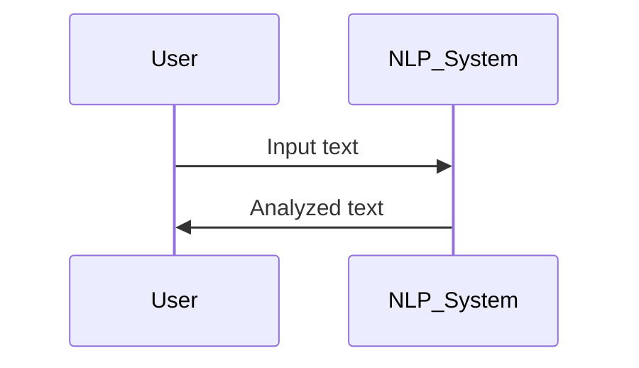

                 

### Introduction to Cognitive Linguistics and AI: Exploring the Relationship between Language, Thought, and the World

#### Keywords: Cognitive Linguistics, Artificial Intelligence, Language, Thought, World

#### Abstract:
This article delves into the intricate relationship between cognitive linguistics and artificial intelligence, exploring how language, thought, and the world are interconnected. By examining the core concepts of cognitive linguistics and the fundamental principles of AI, we will unravel how these fields contribute to our understanding of human cognition and the development of advanced language processing technologies. The aim is to provide a comprehensive overview that highlights the importance of integrating cognitive linguistic insights into AI systems, ultimately fostering more effective and human-like natural language understanding.

### The Background and Core Concepts of Cognitive Linguistics

#### 1.1 Overview of Cognitive Linguistics

##### 1.1.1 Origins and Historical Development of Cognitive Linguistics

Cognitive linguistics is a relatively new field that emerged in the 1970s as a response to the limitations of traditional linguistics. It was influenced by the cognitive revolution in psychology, which emphasized the importance of mental processes in understanding language and other cognitive activities. The origins of cognitive linguistics can be traced back to the works of scholars such as Noam Chomsky, who proposed the idea of Universal Grammar, and George Lakoff and Mark Johnson, who introduced the concept of conceptual metaphors.

Cognitive linguistics grew out of dissatisfaction with the structuralist approach, which focused primarily on the form and syntax of language without considering the cognitive processes that underlie language use. It sought to bridge the gap between language and cognition by investigating how people think, perceive, and conceptualize the world through language.

##### 1.1.2 Key Concepts and Principles in Cognitive Linguistics

One of the core principles of cognitive linguistics is the idea that language is not a static system but a dynamic tool that reflects the cognitive processes of its users. This approach is often referred to as the cognitive approach to language, which emphasizes the role of mental processes in language acquisition, use, and understanding.

Another key concept in cognitive linguistics is the notion of conceptual metaphors. Lakoff and Johnson argued that metaphor is not just a poetic device but a fundamental means by which we understand and structure our experiences. They introduced the idea of conceptual metaphors, which are mappings between concepts in one domain (the source domain) and concepts in another domain (the target domain). For example, the expression "life is a journey" maps concepts from the domain of travel to the domain of life.

Cognitive linguistics also emphasizes the importance of embodiment in language and cognition. Embodiment refers to the idea that our physical experience of the world shapes our conceptual understanding of it. This perspective is often associated with the work of George Lakoff and Mark Johnson, who argued that our cognitive structures are rooted in our bodily experiences and that these experiences provide the foundation for our conceptual systems.

##### 1.1.3 The Role of Cognitive Linguistics in Understanding Language

Cognitive linguistics has made significant contributions to our understanding of language and its relationship to thought. One of its main contributions is the recognition of the importance of context in language use. Unlike the structuralist approach, which views language as a set of discrete symbols with fixed meanings, cognitive linguistics emphasizes that the meaning of a word or phrase is often determined by the context in which it is used.

Cognitive linguistics has also highlighted the role of metaphor in language. By examining metaphorical language, cognitive linguists have been able to uncover the underlying cognitive structures that shape our understanding of the world. This has led to a deeper understanding of how language reflects and shapes our thoughts and perceptions.

Additionally, cognitive linguistics has contributed to the field of language education by providing insights into how people acquire and use language. By understanding the cognitive processes that underlie language use, educators can design more effective teaching strategies that cater to the learners' cognitive needs.

##### 1.1.4 Challenges and Opportunities in Cognitive Linguistics

Despite its successes, cognitive linguistics faces several challenges. One challenge is the lack of a unified theoretical framework. While cognitive linguistics shares a common emphasis on the relationship between language and cognition, there are diverse approaches within the field, which can sometimes lead to confusion and inconsistency.

Another challenge is the difficulty of empirical testing. Many of the ideas in cognitive linguistics are abstract and difficult to test directly. This has led to debates over the validity and reliability of some cognitive linguistic theories.

However, these challenges also present opportunities for further research and development. By addressing these issues, cognitive linguistics can continue to evolve and contribute to our understanding of language, thought, and the world.

##### 1.1.5 Summary

In summary, cognitive linguistics provides a rich framework for understanding the relationship between language and thought. By emphasizing the importance of cognitive processes, context, and metaphor, cognitive linguistics offers new insights into how we acquire, use, and understand language. Despite its challenges, cognitive linguistics remains a vibrant and evolving field with the potential to deepen our understanding of language and its role in shaping our cognitive world.

#### The Relationship Between Language and Thought

##### 1.2.1 Cognitive Models of Language and Thought

The relationship between language and thought is a complex and multifaceted one, which has been the subject of extensive research in both linguistics and cognitive science. Understanding this relationship is crucial for developing artificial intelligence systems that can effectively process and understand human language. To explore this connection, cognitive scientists have developed various models that attempt to capture the intricate ways in which language and thought interact.

One of the most influential models is the connectionist model, which is based on the principles of neural networks. Connectionism posits that language processing and thought involve the interaction of numerous interconnected processing units, much like the neurons in the brain. These models are designed to simulate how neural networks might process language and thought by learning patterns in large datasets. One of the most famous connectionist models is the Parallel Distributed Processing (PDP) model, developed by James L. McClelland and David E. Rumelhart in the 1980s. PDP models have been used to study various aspects of language processing, including speech recognition, syntactic parsing, and semantic understanding.

Another prominent model is the symbolic model, which represents language and thought as sequences of symbolic representations. This model was initially popularized by Noam Chomsky's theory of transformational-generative grammar. In this framework, language is seen as a set of rules that generate sentences, and thought is represented by the structure of these sentences. The symbolic model has been influential in the development of formal linguistics and artificial intelligence, particularly in the area of natural language processing (NLP).

##### 1.2.2 Language as a Reflection of Cognitive Processes

One of the key insights from cognitive linguistics is that language is not just a means of communication but a reflection of our cognitive processes. This perspective is rooted in the idea that our experiences, perceptions, and emotions shape the way we think and, consequently, the way we use language. For example, research has shown that our understanding of time is often metaphorically structured as a journey. We talk about "going back in time" or "looking forward to the future," which reflects our cognitive tendency to conceptualize time in spatial terms.

This metaphorical structure of language can have significant implications for our understanding of thought. For instance, studies have shown that the language we use can influence our cognitive processes and even our emotional states. This is known as the "linguistic relativity hypothesis," which suggests that the language we speak can shape our perception of the world and our cognitive processes. For example, languages that have a rich set of words for colors may enable their speakers to perceive and discriminate colors more accurately.

Moreover, language can also shape our decision-making processes. Research has shown that the language used in instructions or persuasive messages can influence how we interpret information and make decisions. This has important implications for fields such as marketing and political communication, where language is used strategically to influence behavior and attitudes.

##### 1.2.3 The Impact of Cognitive Linguistics on Language Acquisition and Learning

Cognitive linguistics has also had a significant impact on our understanding of language acquisition and learning. Traditional views of language acquisition often focused on the role of environmental factors, such as exposure to language and social interaction. However, cognitive linguistics emphasizes the importance of cognitive processes in language learning. According to this perspective, children learn language not just by exposure but by actively constructing their understanding of language based on their experiences and interactions with the world.

One of the key insights from cognitive linguistics is the concept of emergent grammar. This theory suggests that children acquire language by noticing patterns in their linguistic environment and constructing their own grammatical rules based on these patterns. This process is often described as a form of statistical learning, where children extract regularities from the language they hear and use them to predict the likelihood of certain word combinations.

Cognitive linguistics has also highlighted the role of metaphor in language acquisition. Research has shown that children learn new words and concepts by understanding them in terms of metaphorical mappings. For example, they might learn the word "sleep" by understanding it as a journey, such as "falling asleep" or "sleeping like a log."

Moreover, cognitive linguistics has contributed to our understanding of bilingualism and language learning strategies. Research has shown that bilingual individuals often use different cognitive strategies to process and learn languages, depending on the language they are using. This suggests that cognitive processes play a crucial role in language learning and bilingualism.

##### 1.2.4 Cognitive Principles and Their Application in Linguistic Research

Cognitive principles have been widely applied in linguistic research to understand various aspects of language processing and learning. One prominent application is in the study of sentence comprehension. Cognitive linguistics has provided insights into how people process complex sentences and understand the relationships between clauses. For example, research has shown that people often use metaphorical thinking to understand figurative language and idioms. This suggests that metaphorical comprehension relies on the same cognitive processes that are involved in literal comprehension.

Another area where cognitive principles have been applied is in the study of lexical semantics. Cognitive linguistics has contributed to our understanding of how words and concepts are structured in the mind. For instance, research has shown that words and concepts are often organized hierarchically, with more general concepts at the top and more specific concepts below. This hierarchical organization of concepts helps us understand how words relate to each other and how they are used in different contexts.

Cognitive principles have also been applied in the development of language processing algorithms for artificial intelligence. By understanding the cognitive processes that underlie language use, AI researchers have been able to design more sophisticated algorithms that can process and understand human language more effectively. For example, machine learning algorithms inspired by cognitive principles have been used to develop natural language understanding systems that can perform tasks such as machine translation, sentiment analysis, and question answering.

##### 1.2.5 Cognitive Theory and Linguistic Analysis

Cognitive theory has also had a significant impact on linguistic analysis, providing new tools and perspectives for studying language. One area where cognitive theory has been particularly influential is in the analysis of language change and evolution. Cognitive linguistics has contributed to our understanding of how language evolves over time and how new linguistic structures emerge. For example, research has shown that linguistic changes often occur as a result of cognitive processes such as metaphorical extension, where a word or phrase is extended to cover new meanings based on metaphorical mappings.

Another area where cognitive theory has been applied is in the analysis of language disorders and cognitive impairments. Cognitive linguistics has provided insights into how language processing is affected by cognitive impairments such as aphasia, a condition that affects a person's ability to produce or understand language. By understanding the cognitive processes that underlie language use, researchers have been able to develop better diagnostic and therapeutic approaches for language disorders.

##### 1.2.6 Summary

In summary, the relationship between language and thought is complex and multifaceted, with cognitive linguistics providing a rich framework for understanding this connection. By emphasizing the role of cognitive processes, context, and metaphor, cognitive linguistics offers new insights into how language shapes and is shaped by thought. These insights have had a significant impact on language acquisition and learning, as well as on linguistic research and artificial intelligence. Despite the challenges and limitations, cognitive linguistics remains a vibrant and evolving field with the potential to deepen our understanding of language, thought, and the world.

### Core Concepts in Cognitive Linguistics

#### 1.3.1 Cognitive Models in Language Description

Cognitive models play a pivotal role in the description and understanding of language within the framework of cognitive linguistics. These models are designed to simulate the cognitive processes that underlie language use, providing a deeper insight into how we acquire, process, and understand language. Some of the most influential cognitive models include connectionism, construction grammar, and the mental lexicon.

**Connectionism** is a cognitive model inspired by the structure and function of neural networks. In connectionist models, language processing is seen as a complex interplay of interconnected processing units, much like the neurons in the brain. These models are particularly useful for studying tasks such as speech recognition, syntactic parsing, and semantic understanding. For example, the PDP (Parallel Distributed Processing) model developed by James L. McClelland and David E. Rumelhart is a connectionist model that has been widely used to study language processing tasks.

**Construction Grammar** (CxG) is another key cognitive model in cognitive linguistics. Developed by Adele Goldberg, Construction Grammar focuses on the relationship between language forms (constructions) and meaning. In this framework, constructions are defined as the combinatorial patterns of form and meaning that are stored in the mind. For instance, the sentence "The book is on the table" is a construction that links the form "book" and "on the table" with a specific meaning. Construction Grammar emphasizes the importance of contextual factors in language use and provides a more flexible and dynamic view of language compared to traditional grammar.

**The Mental Lexicon** is another critical component of cognitive models in language description. The mental lexicon is the cognitive system that stores and retrieves words and their meanings. Research on the mental lexicon has shown that it is not a simple list of words but a complex network of interrelated concepts and associations. For example, the word "dog" is not stored in isolation but is connected to related concepts such as "pet," "animal," and "puppy." This network structure allows for efficient and flexible language processing.

These cognitive models provide valuable insights into how language is represented and processed in the mind. They help us understand how we can recognize and produce language even when faced with ambiguous or incomplete input. For instance, in a noisy environment, a connectionist model can use contextual information to correctly interpret spoken language. Similarly, Construction Grammar helps us understand how meaning is constructed from the interactions between constructions in specific contexts.

**Table 1.1: Comparison of Cognitive Models**

| Model | Key Principles |
| --- | --- |
| Connectionism | Language processing as an interplay of interconnected processing units |
| Construction Grammar | Constructions as fundamental units of language, linking form and meaning |
| Mental Lexicon | A complex network of interrelated concepts and associations |

**Figure 1.1: Mermaid ER Diagram of Cognitive Models**

```mermaid
erDiagram
  Processing_Unit ||--|{ Language_Processing_Task }| Construction_Grammar
  Processing_Unit ||--|{ Syntactic_Parsing }| PDP_Model
  Processing_Unit ||--|{ Semantic_Understanding }| Neural_Network_Model
  Mental_Lexicon ||--|{ Word_Storage }| Concept_Network
  Mental_Lexicon ||--|{ Association_Processing }| Context_Generation
```

By integrating these cognitive models, cognitive linguistics offers a comprehensive framework for understanding the intricate relationship between language, thought, and the world. These models not only provide insights into how language works but also contribute to the development of advanced language processing technologies in artificial intelligence.

#### 1.3.2 Cognitive Principles and Their Application

Cognitive principles are foundational to the field of cognitive linguistics, providing a set of principles and theories that help explain how language and thought interact. These principles are grounded in cognitive science and draw on insights from psychology, neuroscience, and artificial intelligence. Some of the key cognitive principles in cognitive linguistics include embodiment, metaphor, and conceptual integration.

**Embodiment** is the principle that our physical experience of the world shapes our conceptual understanding. This idea posits that our bodies and sensory experiences provide the foundation for our cognitive processes. For example, the way we perceive space and time is deeply influenced by our physical experiences, such as walking or looking around. Embodiment theory suggests that linguistic expressions are often grounded in these physical experiences. For instance, the use of spatial terms to describe abstract concepts, such as "up" for positive emotions or "down" for negative emotions, reflects our embodied experiences of physical elevation and decline.

**Metaphor** is another core cognitive principle that plays a crucial role in language and thought. Metaphor is not merely a literary device but a fundamental cognitive process through which we understand complex concepts by relating them to simpler, more familiar ones. Cognitive linguists, such as George Lakoff and Mark Johnson, argue that metaphor is a central mechanism for conceptualization. They propose that our conceptual systems are largely metaphorical, meaning that we understand abstract concepts through metaphorical mappings. For example, the expression "time is money" maps the domain of money to the domain of time, helping us conceptualize time in terms of value and worth.

**Conceptual Integration** is a principle that focuses on how we combine and integrate different concepts in our minds. It suggests that we often create complex ideas by integrating multiple concepts into a single, unified understanding. Cognitive linguists use the concept of blending to describe this process, where two or more concepts are combined to create a new, hybrid concept. For example, when we say "she sings like a bird," we blend the concepts of singing and bird to create a new metaphorical image. This process of conceptual integration helps us understand and communicate complex ideas by combining different elements in novel ways.

These cognitive principles have broad applications in various areas of cognitive linguistics and language processing. For instance, embodiment principles are used to understand how language reflects and shapes our perception of the world. Metaphor theory is applied in the study of literary language and figurative expressions, providing insights into how metaphorical language conveys meaning. Conceptual integration is particularly relevant in the development of natural language processing (NLP) systems, where understanding complex language structures and integrating different pieces of information is crucial.

**Table 1.2: Applications of Cognitive Principles**

| Cognitive Principle | Application |
| --- | --- |
| Embodiment | Understanding linguistic expressions grounded in physical experiences |
| Metaphor | Analyzing figurative language and conceptualization in language |
| Conceptual Integration | Developing NLP systems that can understand complex language structures |

**Figure 1.2: Mermaid ER Diagram of Cognitive Principles**

```mermaid
erDiagram
  Embodiment ||--|{ Spatial_Terms }| Perception
  Embodiment ||--|{ Abstract_Concepts }| Linguistic_Expression
  Metaphor ||--|{ Literary_Language }| Figurative_Expressions
  Metaphor ||--|{ Conceptualization }| Abstract_Thought
  Conceptual_Integration ||--|{ Complex_ Ideas }| NLP_Processing
  Conceptual_Integration ||--|{ Information_Integration }| Language_Understanding
```

By applying these cognitive principles, cognitive linguistics offers a comprehensive framework for understanding the complex interplay between language, thought, and the world. These principles not only deepen our understanding of cognitive processes but also contribute to the development of advanced language processing technologies in artificial intelligence.

#### 1.3.3 Cognitive Theory and Linguistic Analysis

Cognitive theory has significantly transformed the field of linguistic analysis, providing new perspectives and methodologies for understanding language structure and usage. One of the most influential contributions of cognitive theory to linguistic analysis is the introduction of the concept of "construction." In cognitive linguistics, a construction is defined as a fixed combination of form and meaning, such as the phrase "kick the bucket," where the form "kick" is combined with the meaning "die" to create a specific idiomatic expression.

**Construction Grammar** (CxG), developed by Adele Goldberg, is a cognitive theory that emphasizes the importance of constructions in language. Unlike traditional grammatical theories that focus on syntactic rules, Construction Grammar considers constructions as the basic units of language. This perspective allows for a more flexible and nuanced understanding of language, as it recognizes that language use is often guided by these fixed combinations rather than abstract syntactic rules.

**Figure 1.3: Mermaid Class Diagram of Construction Grammar**

```mermaid
classDiagram
  ClassDiagram :: Construction_Grammar
  Construction_Grammar --|> Phrase
  Construction_Grammar --|> Meaning
  Construction_Grammar --|> Form
  Phrase <<interface>>
  Meaning <<interface>>
  Form <<interface>>
```

In Construction Grammar, constructions are analyzed based on their semantic and syntactic properties. This approach allows linguists to identify and categorize a wide range of linguistic phenomena, including idioms, collocations, and grammatical constructions. By focusing on constructions, cognitive linguists have been able to uncover patterns and regularities in language that traditional grammatical approaches might overlook.

**Figure 1.4: Mermaid ER Diagram of Constructions**

```mermaid
erDiagram
  Constructions ||--|{ Idioms }| Idiomatic_Expressions
  Constructions ||--|{ Collocations }| Word_Collocations
  Constructions ||--|{ Grammatical_Constructs }| Grammar_Rules
```

Cognitive theory also provides tools for analyzing the relationship between language and thought. One key concept in this regard is the "conceptual metaphor," which posits that much of our understanding of abstract concepts is mediated by metaphorical mappings from more concrete domains. For example, the metaphor "time is money" illustrates how we conceptualize time in terms of economic value. This metaphorical thinking is not just a stylistic choice but a fundamental cognitive process that shapes our perception and understanding of the world.

**Figure 1.5: Mermaid Flowchart of Conceptual Metaphor**


Cognitive theory has also informed the development of computational models of language processing, particularly in the field of natural language processing (NLP). By grounding language processing in cognitive principles, researchers have been able to design more effective algorithms for tasks such as text analysis, semantic parsing, and machine translation.

**Figure 1.6: Mermaid Sequence Diagram of NLP Algorithm**



In summary, cognitive theory has enriched the field of linguistic analysis by providing new concepts and methodologies for understanding language structure and usage. Through the lens of cognitive theory, linguists can explore the intricate connections between language, thought, and the world, offering valuable insights into the nature of human cognition and language.

#### 1.4 Key Insights Gained from Cognitive Linguistics

Cognitive linguistics has significantly contributed to our understanding of language, thought, and cognition. By examining the cognitive processes that underlie language use, cognitive linguistics has provided several key insights that have broad implications for linguistics, psychology, and artificial intelligence.

Firstly, cognitive linguistics has highlighted the role of context in language understanding. Unlike traditional linguistic theories that often focus on the syntactic and semantic rules of language, cognitive linguistics emphasizes that the meaning of words and sentences is often determined by the context in which they are used. This insight is crucial for developing artificial intelligence systems that can understand and generate natural language, as it requires the ability to interpret language in real-world contexts.

Secondly, cognitive linguistics has shed light on the importance of metaphor in language. Metaphor is not just a poetic device but a fundamental cognitive process that helps us understand complex concepts by relating them to more familiar ones. By studying metaphorical language, cognitive linguists have uncovered the cognitive mechanisms that underlie our conceptualization of the world. These insights are valuable for designing more effective natural language processing algorithms that can understand and generate metaphorical expressions.

Thirdly, cognitive linguistics has emphasized the embodied nature of language. Our language and thought are deeply rooted in our physical experiences and sensory perceptions. This embodied perspective challenges the traditional view of language as a purely symbolic system and provides a richer understanding of how language and thought are interwoven with our physical experiences. For instance, the use of spatial terms to describe abstract concepts reflects our embodied experiences of the world. This insight has implications for both linguistics and cognitive science, as it suggests that language and thought are closely tied to our sensory and motor experiences.

Furthermore, cognitive linguistics has contributed to our understanding of language acquisition and learning. By focusing on the cognitive processes that underlie language use, cognitive linguistics has provided insights into how children acquire language and how new linguistic structures emerge. The concept of emergent grammar, for example, suggests that children learn language by noticing patterns in their linguistic environment and constructing their own grammatical rules based on these patterns. This understanding can inform educational practices and the design of language learning tools.

Additionally, cognitive linguistics has informed the development of cognitive models in artificial intelligence. By grounding language processing in cognitive principles, researchers have been able to design more sophisticated algorithms that can better simulate human language understanding and processing. For example, connectionist models inspired by cognitive theory have been used to develop natural language processing systems that can perform tasks such as speech recognition and semantic parsing.

In summary, cognitive linguistics has provided valuable insights into the relationship between language, thought, and the world. By emphasizing the role of cognitive processes, context, and metaphor, cognitive linguistics has enriched our understanding of language and cognition, with implications for linguistics, psychology, and artificial intelligence. These insights continue to shape our understanding of human language and its role in shaping our cognitive world.

#### 1.5 Challenges and Opportunities in the Field of Cognitive Linguistics

Cognitive linguistics, while a rich and evolving field, faces several challenges and opportunities that shape its future development. Understanding these challenges is crucial for navigating the complexities of language, thought, and cognition.

One of the primary challenges in cognitive linguistics is the lack of a unified theoretical framework. The field encompasses a wide range of theories and methodologies, from connectionism to construction grammar, each with its own principles and assumptions. This diversity can lead to inconsistencies and debates, making it difficult to establish a coherent overarching theory. To address this challenge, future research could focus on integrating different cognitive models and approaches, creating a more unified framework that can accommodate the varied perspectives within the field.

Another challenge is the empirical validation of cognitive linguistic theories. Many cognitive linguistic concepts are abstract and difficult to test directly. For instance, the idea of metaphorical thinking or the embodied nature of language is challenging to empirically verify. To overcome this, researchers could develop more sophisticated experimental designs and methodologies that allow for the direct observation and measurement of cognitive processes. This could involve the use of neuroimaging techniques, behavioral experiments, and computational models that simulate cognitive processes.

The rapidly evolving field of artificial intelligence also presents both challenges and opportunities for cognitive linguistics. While AI technologies offer powerful tools for analyzing and processing language, they also raise ethical and practical concerns. For instance, AI systems must be designed to handle ambiguity, context, and metaphorical language, which are complex aspects of human language. Cognitive linguistics can contribute to this by providing insights into how humans process and understand language, informing the design of more human-like AI systems.

Furthermore, the integration of cognitive linguistic principles into educational practices represents a significant opportunity. By understanding the cognitive processes that underlie language acquisition and learning, educators can design more effective teaching strategies that cater to the needs of learners. This could involve the development of educational tools and programs that incorporate cognitive linguistic insights, such as interactive language learning apps or personalized learning platforms.

In addition, cognitive linguistics has the potential to contribute to the field of mental health and therapy. By understanding how language reflects and shapes our thoughts and emotions, cognitive linguists can develop interventions that help individuals manage mental health issues. For example, therapy that focuses on language use and metaphorical thinking could help individuals develop more positive and adaptive ways of thinking.

In summary, while cognitive linguistics faces challenges such as the lack of a unified framework and the difficulty of empirical testing, these challenges also present opportunities for innovation and growth. By addressing these challenges and leveraging the insights provided by cognitive linguistic principles, the field can continue to advance our understanding of language, thought, and the world.

### Summary

In conclusion, cognitive linguistics offers a profound understanding of the intricate relationship between language, thought, and the world. By emphasizing the role of cognitive processes, context, and metaphor, cognitive linguistics provides a rich framework for exploring how language shapes and is shaped by our cognitive experiences. This field has made significant contributions to our understanding of language acquisition, language processing, and the embodied nature of cognition. As we continue to advance our knowledge in these areas, the insights from cognitive linguistics will undoubtedly inform and enhance our approaches to artificial intelligence, education, mental health, and many other domains.

Looking ahead, there are several key areas of future research and development. First, there is a need for a more unified theoretical framework that can integrate the diverse approaches within cognitive linguistics. This could involve developing a comprehensive set of principles and models that are empirically validated and broadly applicable. Second, there is an opportunity to leverage the rapid advancements in artificial intelligence to create more sophisticated language processing systems. By incorporating cognitive linguistic insights, these systems can better simulate human language understanding and generate more natural and contextually appropriate language. Finally, cognitive linguistics can contribute to the development of educational tools and interventions that cater to the cognitive needs of learners, potentially revolutionizing language education.

Overall, the future of cognitive linguistics is bright, with the potential to deepen our understanding of human cognition and its relationship with language, thought, and the world. By continuing to explore these connections, we can unlock new insights that will shape our understanding of the human mind and its interaction with the linguistic and cognitive environment.

