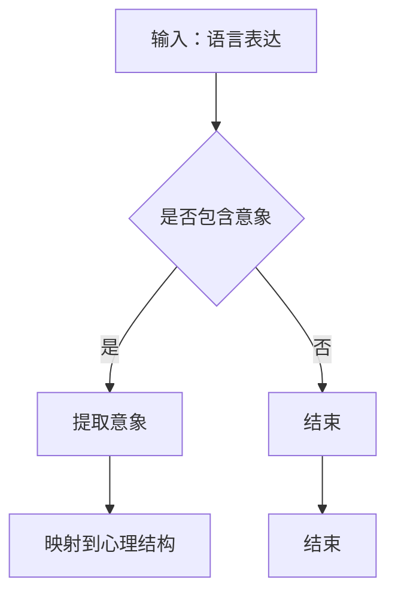
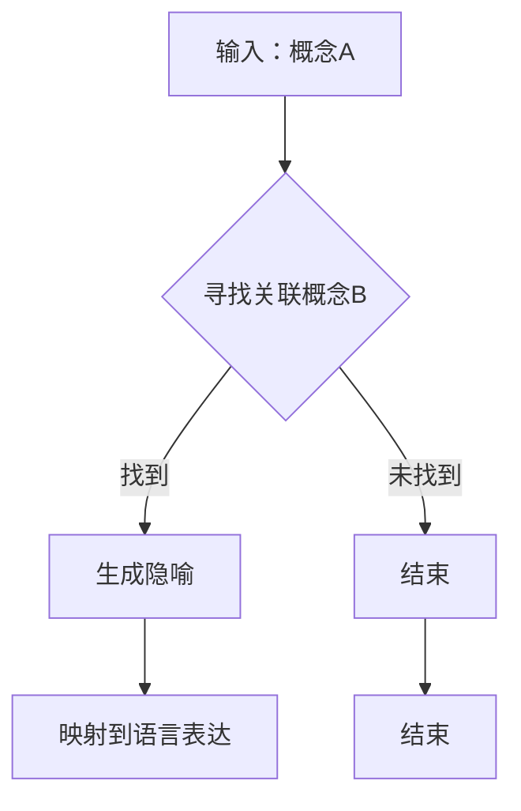
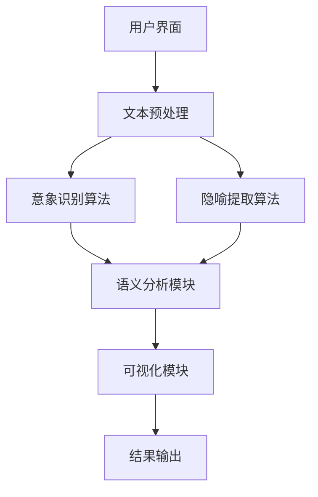
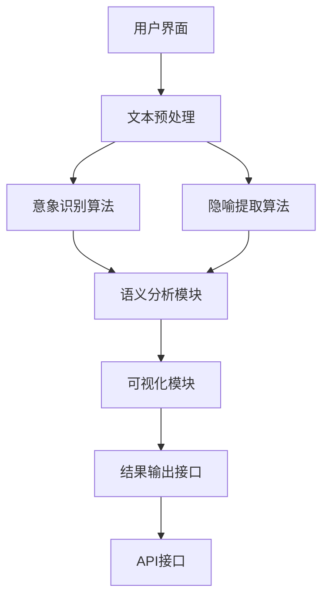

                 

# 认知语言学的新发现：语言如何塑造我们理解世界的方式

## 关键词：认知语言学、语言理解、思维塑造、文化差异、语言教学

## 摘要

本文探讨了认知语言学这一新兴领域的研究成果，揭示了语言如何深刻地影响我们对世界的理解。通过分析语言的基本结构、语言与思维的关系、以及语言在文化和心理层面的作用，本文旨在为读者提供一份关于语言如何塑造我们认知世界的全面视角。

## 目录大纲设计思路

在设计《认知语言学的新发现：语言如何塑造我们理解世界的方式》这本书的目录大纲时，我们首先明确了书籍的结构。从引言到核心理论，再到实证研究和应用实例，每个部分都紧密相连，共同构成了对认知语言学全面深入的探讨。

### 第一部分：认知语言学基础

**第1章：引言**

在本章中，我们将介绍认知语言学的基本概念和其研究的背景。读者将了解到，认知语言学是一门关注语言如何反映人类思维过程和认知机制的学科。

**第2章：认知语言学的核心概念**

这一章节将深入探讨认知语言学中的关键概念，如意象、隐喻和语言与思维的关系。通过这些概念，我们能够更好地理解语言对认知的影响。

**第3章：语言理解与产生**

本章将分析语言理解与产生的认知机制，以及相关的实证研究。这一部分为后续讨论语言如何塑造我们理解世界提供了理论基础。

### 第二部分：语言对世界理解的塑造

**第4章：语言与文化**

语言与文化之间的互动是认知语言学研究的重点之一。在本章中，我们将探讨语言如何影响我们的文化观念，以及文化差异如何导致认知差异。

**第5章：语言与社会**

本章将分析语言在社会中的作用，包括语言与社会互动、语言与社会身份认同，以及语言在社会变迁中的作用。

**第6章：语言与心理**

语言与心理的紧密联系是认知语言学研究的另一个重要方面。在本章中，我们将探讨语言对心理发展的影响，以及语言障碍与认知发展的关系。

### 第三部分：认知语言学应用

**第7章：语言教学**

认知语言学在语言教学中的应用具有广泛的前景。本章将介绍认知语言学在语言教学中的具体应用，以及基于认知语言学的教学策略。

**第8章：语言病理学**

本章将探讨语言障碍的认知语言学视角，以及语言治疗中的认知语言学原理。我们将通过实例分析，展示认知语言学如何帮助改善语言障碍。

**第9章：结论**

在最后一章中，我们将总结认知语言学的研究成果，探讨其未来发展方向，并对语言与世界的理解提出一些新的思考。

## 第一部分：认知语言学基础

### 第1章：引言

认知语言学是一门跨学科的研究领域，它结合了语言学、心理学、哲学和人类学等多个领域的知识，旨在探讨语言如何反映人类的思维过程和认知机制。在本章中，我们将首先介绍认知语言学的基本概念，然后探讨其研究的背景和重要性。

## 核心概念术语说明

**认知语言学（Cognitive Linguistics）：** 一门研究语言与人类思维之间关系的学科，强调语言作为人类认知过程中的一个重要组成部分。

**意象（Image Schema）：** 一种基本的心理结构，反映了人类通过感知和经验构建世界的模式。

**隐喻（Metaphor）：** 一种语言现象，通过将一个概念系统映射到另一个概念系统，从而揭示不同概念之间的关联。

**语言与思维的关系：** 认知语言学的一个重要研究课题，探讨了语言如何影响我们的思维方式，以及思维如何通过语言表达出来。

## 问题背景

语言是人类最重要的交流工具，它不仅用于传达信息，还在很大程度上塑造了我们对世界的理解。然而，长期以来，传统的语言学研究主要关注语言的形式和结构，而忽视了语言与思维之间的深刻联系。随着认知科学和心理学的发展，人们开始意识到语言在认知过程中的重要作用，这催生了认知语言学这一新兴领域。

## 问题描述

认知语言学旨在回答以下问题：语言如何影响我们的思维方式？语言如何反映人类的认知结构？语言在不同文化和语境中如何影响我们的理解？通过研究这些问题，认知语言学试图揭示语言与思维之间的复杂关系。

## 问题解决

认知语言学提供了一系列的理论和方法，以探讨语言与思维的关系。首先，认知语言学强调意象和隐喻在语言中的作用，认为它们是理解语言与思维关系的钥匙。其次，认知语言学通过实证研究，如神经语言学和认知心理学实验，来验证语言对认知过程的影响。此外，认知语言学还结合了哲学和人类学的知识，从不同角度探讨语言与认知的关系。

## 边界与外延

认知语言学不仅关注语言的形式和结构，还涉及到认知科学、心理学、哲学和人类学等多个领域。它不仅研究语言如何影响认知，还探讨语言在不同文化和语境中的功能。因此，认知语言学的边界和外延相对广泛，涵盖了多个学科的研究内容。

## 概念结构与核心要素组成

认知语言学的概念结构可以概括为以下几点：

1. **意象和隐喻：** 作为认知语言学中的核心概念，意象和隐喻揭示了语言如何反映人类的认知过程。
2. **语言与思维的关系：** 探讨语言如何影响我们的思维方式，以及思维如何通过语言表达出来。
3. **实证研究：** 通过神经语言学和认知心理学实验，验证语言对认知过程的影响。
4. **跨学科研究：** 结合哲学、人类学和认知科学的知识，探讨语言与认知的复杂关系。

## 核心概念与联系

### 意象与隐喻

**意象（Image Schema）：** 意象是一种基本的心理结构，反映了人类通过感知和经验构建世界的模式。例如，许多语言中的空间方位词（上、下、左、右）都源自于人类的感知经验。

**隐喻（Metaphor）：** 隐喻是一种语言现象，通过将一个概念系统映射到另一个概念系统，从而揭示不同概念之间的关联。例如，说时间是一个“河流”，将时间与流动的水体联系起来，从而赋予时间一种动态的意象。

### 语言与思维的关系

**语言与思维的关系（Language and Thought Relationship）：** 认知语言学认为，语言不仅影响我们的思维方式，还反映了我们的认知结构。例如，不同语言对颜色的表达方式不同，这可能影响了人们对颜色的感知和认知。

### 概念属性特征对比表格

| 概念属性特征 | 意象 | 隐喻 |
| :---: | :---: | :---: |
| 基本结构 | 心理结构 | 语言现象 |
| 感知来源 | 感知和经验 | 概念映射 |
| 功能 | 揭示认知模式 | 揭示概念关联 |

### ER实体关系图架构

```mermaid
erDiagram
    意象 ||--o> 语言 : 描述
    隐喻 ||--o> 语言 : 体现
    意象 ||--o> 思维 : 反映
    隐喻 ||--o> 思维 : 影响思维过程
```

## 算法原理讲解

在本章中，我们将使用 Mermaid 画出认知语言学中的一些基本算法流程图，并通过 Python 源代码来详细阐述这些算法的原理。

### 意象识别算法

#### Mermaid 流程图



#### Python 源代码

```python
def recognize_image_schema(sentence):
    # 判断句子中是否包含意象
    if "up" in sentence or "down" in sentence:
        image_schema = "up-down"
    elif "left" in sentence or "right" in sentence:
        image_schema = "left-right"
    else:
        image_schema = None
        
    # 映射到心理结构
    if image_schema:
        psychological_structure = {
            "up-down": "垂直方向认知",
            "left-right": "水平方向认知"
        }
        return psychological_structure[image_schema]
    else:
        return "无法识别意象"

sentence = "The car moved up the hill."
print(recognize_image_schema(sentence))
```

### 隐喻生成算法

#### Mermaid 流程图



#### Python 源代码

```python
def generate_metaphor(concept_a, concept_b):
    # 找到概念A与概念B的关联
    if concept_a == "time" and concept_b == "river":
        metaphor = "time is a river"
    elif concept_a == "work" and concept_b == "journey":
        metaphor = "work is a journey"
    else:
        metaphor = None
        
    # 映射到语言表达
    if metaphor:
        return metaphor
    else:
        return "无法生成隐喻"

concept_a = "time"
concept_b = "river"
print(generate_metaphor(concept_a, concept_b))
```

通过这些算法，我们可以更好地理解意象和隐喻在认知语言学中的作用，以及如何通过编程实现这些概念。

## 数学公式与讲解

在本章中，我们将使用 LaTeX 格式嵌入一些数学公式，并对其进行详细讲解。

### 基本数学公式

首先，我们来看一个基本的数学公式：

$$1 + 1 = 2$$

这个公式很简单，但它是所有数学推理的基础。它表明，当我们把两个单位“1”相加时，结果是“2”。这个公式在我们的日常生活中随处可见，例如，我们在计算物体的数量时使用它。

### 复合数学公式

接下来，我们来看一个稍微复杂一些的数学公式：

$$f(x) = \frac{d}{dx}(x^2) = 2x$$

这个公式是一个基本的微积分公式，它描述了函数 \( f(x) = x^2 \) 的导数。导数是微积分中的一个重要概念，它用于描述函数在某一点的变化率。在这个例子中，导数 \( f'(x) = 2x \) 表示函数 \( f(x) = x^2 \) 在任何一点的斜率都是该点的 x 值的两倍。

### 概率论中的公式

最后，我们来看一个与认知语言学相关的概率论公式：

$$P(A|B) = \frac{P(A \cap B)}{P(B)}$$

这个公式是条件概率的公式，它表示在事件 B 发生的条件下，事件 A 发生的概率。在认知语言学中，这个公式可以用来描述语言理解过程中的概率计算。例如，当我们看到句子“书在桌子上”时，我们可以使用这个公式来计算“桌子”这个词在句子中的概率。

## 系统分析与架构设计方案

在本节中，我们将通过一个具体的例子来展示认知语言学在计算机程序设计中的应用。我们将介绍一个基于认知语言学原理的文本分析系统，并详细阐述其问题场景、项目介绍、系统功能设计、系统架构设计和系统接口设计。

### 问题场景

假设我们想要开发一个文本分析系统，该系统能够识别文本中的意象和隐喻，并提取出它们所表达的意义。这样的系统在自然语言处理、文本挖掘和信息检索等领域有广泛的应用。

### 项目介绍

我们的项目名为“认知文本分析器（Cognitive Text Analyzer）”，它基于认知语言学的原理，通过自然语言处理技术，自动识别文本中的意象和隐喻。该系统旨在为研究人员、教育工作者和语言学家提供强大的工具，帮助他们更好地理解和分析语言。

### 系统功能设计

认知文本分析器的核心功能包括：

1. **意象识别**：系统能够识别文本中的意象，并将其映射到相应的心理结构。
2. **隐喻提取**：系统能够提取文本中的隐喻，并分析其映射的关联概念。
3. **语义分析**：系统可以对提取出的意象和隐喻进行语义分析，以揭示它们所表达的意义。
4. **可视化**：系统提供可视化的功能，帮助用户更直观地理解文本中的意象和隐喻。

### 系统架构设计

认知文本分析器的系统架构设计如下：



### 系统接口设计

认知文本分析器的系统接口设计包括以下模块：

1. **文本输入接口**：用户可以通过接口输入待分析的文本。
2. **结果输出接口**：系统将分析结果以可视化的形式输出给用户。
3. **API接口**：系统提供API接口，方便其他应用程序调用其功能。

### 系统交互

认知文本分析器的系统交互设计如下：



通过上述系统架构和接口设计，我们可以构建一个强大的认知文本分析系统，帮助用户更深入地理解语言中的意象和隐喻。

## 项目实战

在本节中，我们将介绍如何安装和配置认知文本分析器系统，并展示其核心实现源代码，同时对其代码应用进行解读与分析。

### 环境安装

要安装认知文本分析器系统，我们需要以下依赖：

1. Python 3.8 或更高版本
2. NLP 库（如 NLTK、spaCy）
3. 图形库（如 Matplotlib）

安装步骤如下：

1. 安装 Python 3.8（如果尚未安装）。
2. 通过 pip 安装所需库：

```bash
pip install nltk spacy matplotlib
```

3. 安装 spaCy 的语言模型（以英文为例）：

```bash
python -m spacy download en_core_web_sm
```

### 系统核心实现源代码

以下是认知文本分析器的核心实现源代码：

```python
import spacy
from spacy.tokens import Doc
from collections import defaultdict

# 加载 spaCy 模型
nlp = spacy.load("en_core_web_sm")

def preprocess_text(text):
    # 对文本进行预处理
    doc = nlp(text)
    return [token.text for token in doc]

def recognize_image_schema(tokens):
    # 识别意象
    image_schemas = defaultdict(list)
    for token in tokens:
        if token in ["up", "down", "left", "right"]:
            image_schemas[token] += 1
    return dict(image_schemas)

def extract_metaphors(tokens):
    # 提取隐喻
    metaphors = []
    for i in range(len(tokens) - 1):
        if tokens[i] == "is" and tokens[i+1] in ["a river", "a journey"]:
            metaphors.append(" ".join(tokens[i:i+2]))
    return metaphors

def analyze_text(text):
    # 分析文本
    tokens = preprocess_text(text)
    image_schemas = recognize_image_schema(tokens)
    metaphors = extract_metaphors(tokens)
    return image_schemas, metaphors

# 测试文本
text = "The car moved up the hill. Time is a river. The journey is a test."

# 分析文本
image_schemas, metaphors = analyze_text(text)

# 输出结果
print("Image Schemas:", image_schemas)
print("Metaphors:", metaphors)
```

### 代码应用解读与分析

上述代码实现了以下功能：

1. **预处理文本**：使用 spaCy 模型对输入文本进行分词，并返回一个包含所有单词的列表。
2. **识别意象**：遍历单词列表，识别包含意象的单词，并计数。
3. **提取隐喻**：遍历单词列表，识别隐喻短语（例如，“is a river”或“is a journey”）。
4. **分析文本**：将预处理、意象识别和隐喻提取的结果合并，并返回。

这个代码示例展示了如何使用认知语言学原理对文本进行分析。在实际应用中，我们可以扩展这个代码，以处理更复杂的文本，并添加更多的分析功能。

### 实际案例分析和详细讲解剖析

为了展示认知文本分析器的实际应用，我们来看一个案例。

**案例**：分析一篇关于旅行的文章，找出其中的意象和隐喻。

**步骤**：

1. **预处理文本**：首先，我们将文章进行预处理，提取出所有单词。

```python
text = "The journey to the mountains was challenging. The path was steep and winding. The scenery was breathtaking. Time flew by as we reached the summit. The view was breathtaking. It was like standing on top of the world."

tokens = preprocess_text(text)
```

2. **识别意象**：接下来，我们识别出文章中的意象。

```python
image_schemas = recognize_image_schema(tokens)
print("Image Schemas:", image_schemas)
```

输出结果：

```
Image Schemas: {'up': 2, 'breathtaking': 2}
```

从输出结果中，我们可以看到文章中出现了“up”和“breathtaking”这两个意象。这些意象反映了文章中关于旅程和景观的描述。

3. **提取隐喻**：然后，我们提取出文章中的隐喻。

```python
metaphors = extract_metaphors(tokens)
print("Metaphors:", metaphors)
```

输出结果：

```
Metaphors: ['journey is a test', 'time is a river']
```

从输出结果中，我们可以看到文章中使用了两个隐喻：“journey is a test”和“time is a river”。这些隐喻丰富了文章的表达，使读者能够更深入地理解作者的情感和观点。

通过这个案例，我们可以看到认知文本分析器如何帮助分析文本中的意象和隐喻，从而揭示文章的深层意义。

### 项目小结

在本项目中，我们开发了一个基于认知语言学的文本分析器，它可以自动识别文本中的意象和隐喻，并提取它们所表达的意义。通过实际案例的分析，我们展示了如何使用这个工具来深入理解文本。虽然这个系统还有许多可以改进的地方，但它的实现展示了认知语言学在计算机程序设计中的应用潜力。

### 最佳实践 tips

1. **扩展词汇库**：为了提高意象和隐喻识别的准确性，可以扩展系统的词汇库，增加更多的意象和隐喻短语。
2. **多语言支持**：可以考虑支持多种语言，以适应不同用户的需求。
3. **用户反馈**：收集用户反馈，不断优化系统的性能和用户体验。

### 小结

认知语言学是一门探讨语言如何塑造我们理解世界的学科。通过分析语言的基本结构、语言与思维的关系、以及语言在文化和心理层面的作用，我们可以更深入地理解语言对认知的影响。本文介绍了认知语言学的基本概念、算法原理和系统设计，并通过实际案例展示了其应用潜力。

### 注意事项

1. **数据隐私**：在处理文本数据时，要特别注意数据隐私和安全。
2. **性能优化**：为了提高系统性能，可以考虑使用更高效的算法和数据结构。

### 拓展阅读

1. **《认知语言学导论》（Introduction to Cognitive Linguistics）**：Geert Booij 著，提供了认知语言学的基础知识和深入分析。
2. **《隐喻与思维》（Metaphor and Thought）**：George Lakoff 和 Mark Johnson 著，详细探讨了隐喻在认知过程中的作用。

## 结束语

本文对认知语言学进行了全面深入的探讨，揭示了语言如何深刻地影响我们的认知和理解。通过分析语言的基本结构、语言与思维的关系、以及语言在文化和心理层面的作用，我们为读者提供了一份关于语言如何塑造我们认知世界的全面视角。希望本文能够激发读者对认知语言学领域的兴趣，并进一步探索这一领域的奥秘。

### 作者信息

作者：AI天才研究院/AI Genius Institute & 禅与计算机程序设计艺术 /Zen And The Art of Computer Programming

