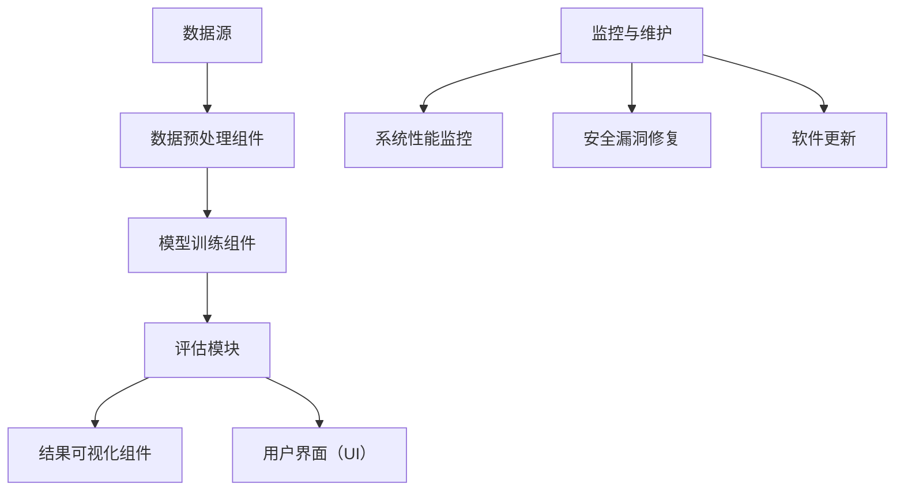
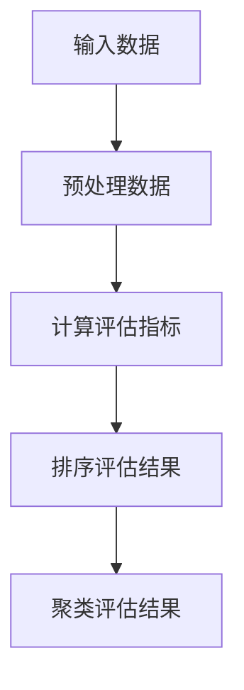
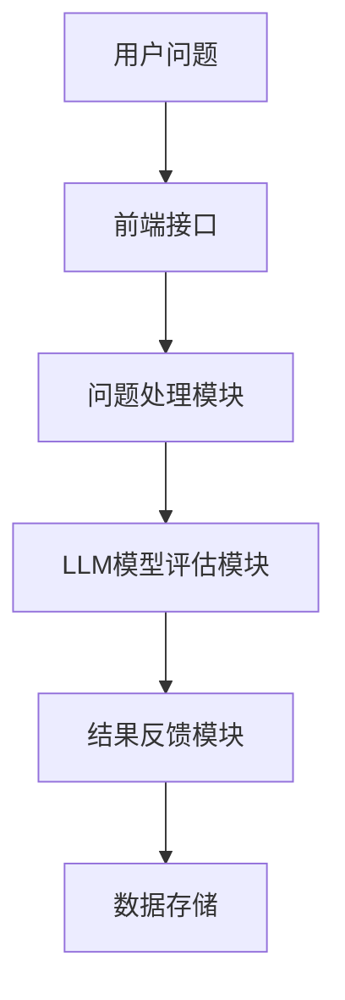

                 

## 设计基于LLM的评测系统：核心原则与架构

### 关键词：LLM、评测系统、设计原则、架构设计

### 摘要：

本文旨在探讨设计基于大型语言模型（LLM）的评测系统的核心原则与架构。随着人工智能技术的飞速发展，LLM在自然语言处理领域表现出卓越的性能，使其在评测系统中得到广泛应用。本文将详细阐述LLM的基本概念及其在评测系统中的应用，进而分析设计评测系统的基本原则和架构框架。通过深入探讨各个核心章节，本文将帮助读者理解LLM评测系统的设计原理、算法方法、实际案例及其未来发展趋势。最终，本文将总结最佳实践和注意事项，为读者提供有益的参考。

## 引言

在当今信息爆炸的时代，自然语言处理（NLP）技术已经成为人工智能领域的重要组成部分。随着深度学习和神经网络技术的发展，大型语言模型（Large Language Models，简称LLM）应运而生，并在各个应用领域展现出强大的能力。LLM是一种能够对自然语言进行理解和生成的复杂模型，其核心在于能够通过大规模的数据训练，获取语言结构和语义信息，从而实现高度智能化的处理。

### 背景与意义

评测系统在自然语言处理领域中扮演着至关重要的角色。无论是文本分类、情感分析、机器翻译还是问答系统，都需要通过评测系统来验证模型的性能和准确性。传统的评测方法通常依赖于手工设计特征和规则，而基于LLM的评测系统则通过自动化的方式，实现了更高水平的评估效果。LLM在评测系统中的应用不仅提升了评估的准确性和效率，还极大地拓展了评估的维度和深度。

本文旨在探讨设计基于LLM的评测系统的核心原则与架构，为相关领域的科研人员和开发者提供实用的指导。具体来说，本文将分为以下几个部分进行论述：

1. **核心概念**：介绍LLM的基本概念、架构以及训练和优化方法。
2. **设计原则**：阐述设计基于LLM的评测系统的基本原则。
3. **架构设计**：详细解析评测系统的架构框架和关键组件。
4. **算法方法**：介绍LLM评测系统中的核心算法和方法。
5. **案例分析**：通过实际案例展示LLM评测系统的应用和实践。
6. **最佳实践**：总结设计评测系统的最佳实践和注意事项。
7. **未来趋势**：探讨LLM评测系统的未来发展方向和前景。

通过以上章节的论述，本文将系统地展示基于LLM的评测系统的设计与实现，为相关领域的研发提供有力的理论支持和实践指导。

### 核心概念

#### 大型语言模型（LLM）

大型语言模型（Large Language Models，简称LLM）是一种基于深度学习的自然语言处理模型，其核心目标是对自然语言文本进行理解和生成。LLM通过大量文本数据的学习，能够捕捉到语言的复杂结构和深层语义，从而实现高度自动化的自然语言处理任务。典型的LLM包括GPT（Generative Pre-trained Transformer）、BERT（Bidirectional Encoder Representations from Transformers）和T5（Text-to-Text Transfer Transformer）等。

#### LLM的架构

LLM的架构通常基于变分自编码器（VAE）、递归神经网络（RNN）或Transformer等深度学习模型。以Transformer为例，其核心组件包括：

- **自注意力机制（Self-Attention）**：通过计算输入序列中每个词与其他词之间的关联性，实现文本的上下文信息捕捉。
- **前馈神经网络（Feedforward Neural Network）**：在自注意力机制的基础上，进一步提取文本特征。
- **编码器（Encoder）和解码器（Decoder）**：编码器用于提取输入文本的特征，解码器则用于生成预测文本。

#### LLM的训练与优化

LLM的训练和优化过程主要包括以下几个步骤：

1. **数据预处理**：对大规模文本数据集进行预处理，包括分词、去噪、清洗等操作，以便于模型的学习。
2. **预训练**：通过无监督学习方式，对LLM进行大规模文本数据的训练，使其获得丰富的语言特征。
3. **微调（Fine-tuning）**：在预训练的基础上，针对特定任务进行有监督学习，对LLM进行微调，提升其在特定任务上的性能。
4. **优化方法**：采用梯度下降、Adam优化器等优化方法，对LLM的参数进行调整和优化。

#### LLM的应用场景

LLM在自然语言处理领域具有广泛的应用，包括但不限于：

- **文本分类**：对文本进行分类，如新闻分类、情感分析等。
- **机器翻译**：实现不同语言之间的文本翻译，如英译中、中译英等。
- **问答系统**：根据用户输入的提问，生成相应的答案。
- **文本生成**：根据输入的提示，生成符合语法和语义的文本，如文章撰写、对话生成等。

通过以上对LLM的核心概念、架构、训练与优化以及应用场景的详细解析，我们可以更好地理解LLM在评测系统设计中的重要作用，并为后续章节的深入探讨奠定基础。

### 基本原则

设计基于LLM的评测系统时，需要遵循一系列基本原则，以确保系统的有效性和可靠性。以下是一些核心原则：

#### 准确性（Accuracy）

准确性是评测系统的首要原则，它直接影响到评估结果的可靠性。为了实现高准确性，需要确保LLM模型在训练过程中充分学习到文本数据的特征和语义。具体措施包括：

- **高质量数据集**：选择高质量、代表性的数据集进行训练，避免噪声数据和异常值对模型的影响。
- **数据增强**：通过数据增强技术，如文本转换、随机噪声添加等，增加训练数据的多样性和覆盖率，提升模型对未知数据的适应性。
- **超参数调优**：通过调整模型参数，如学习率、批量大小、隐藏层大小等，优化模型性能，提高评估准确性。

#### 效率（Efficiency）

效率原则强调评测系统的处理速度和资源利用率。高效率的系统可以在短时间内完成大量评估任务，降低计算成本。为了提升系统效率，可以采取以下措施：

- **并行计算**：利用多核处理器和分布式计算资源，实现评估任务的并行处理，提高整体性能。
- **模型压缩**：通过模型压缩技术，如剪枝、量化等，减小模型大小，加速模型加载和推理过程。
- **预计算与缓存**：对常用评估任务进行预计算和缓存，减少重复计算，提高系统响应速度。

#### 解释性（Interpretability）

解释性原则要求评测系统能够提供清晰、易懂的评估结果解释，以便用户理解和信任系统。为了提高解释性，可以采用以下策略：

- **模型可视化**：利用可视化工具，如热力图、注意力机制等，展示模型在评估过程中的关键操作和决策路径。
- **可解释模型**：选择具有可解释性的模型结构，如决策树、线性模型等，使其评估结果易于理解和解释。
- **决策路径追踪**：记录模型在评估过程中的决策路径，如特征选择、权重计算等，帮助用户理解评估过程的逻辑和依据。

#### 可扩展性（Scalability）

可扩展性原则要求评测系统能够适应数据量和任务量的变化，实现系统的灵活扩展。为了实现高可扩展性，可以采取以下措施：

- **模块化设计**：将系统划分为多个模块，每个模块负责特定的功能，便于系统的扩展和维护。
- **分布式架构**：采用分布式架构，支持系统在多个节点上的部署和扩展，提高系统的处理能力和可靠性。
- **弹性资源管理**：根据任务需求和资源情况，动态调整系统资源，实现高效利用和优化。

#### 安全性（Security）

安全性原则要求评测系统在数据传输、存储和处理过程中，确保数据的完整性和隐私性。为了保障系统安全性，可以采取以下措施：

- **数据加密**：对敏感数据采用加密技术，如AES加密等，确保数据在传输和存储过程中的安全性。
- **访问控制**：实施严格的访问控制策略，限制对系统数据和资源的访问权限，防止数据泄露和滥用。
- **安全审计**：定期进行安全审计和漏洞扫描，及时发现和修复系统中的安全漏洞，保障系统的安全性。

#### 实时性（Real-time）

实时性原则要求评测系统能够在短时间内完成评估任务，满足实时处理的需求。为了实现实时性，可以采取以下措施：

- **低延迟算法**：选择低延迟的算法和模型，减少评估过程中的计算和通信开销。
- **边缘计算**：将部分计算任务部署到边缘设备上，实现数据本地处理，降低延迟和带宽需求。
- **缓存技术**：利用缓存技术，如Redis等，减少对底层存储的访问频率，提高系统响应速度。

通过遵循以上基本原则，设计基于LLM的评测系统可以实现高效、准确、安全、实时和可扩展的评估效果，为自然语言处理领域提供强有力的支持。

### 架构设计

设计一个高效、可扩展的基于LLM的评测系统，需要精心考虑系统的整体架构。以下将详细描述评测系统的整体架构设计，涵盖系统要求、组件设计、集成与部署等方面的内容。

#### 系统要求

1. **计算资源**：由于LLM模型通常非常复杂且计算密集，系统需要具备强大的计算资源，包括高性能CPU和GPU，以及足够大的内存和存储空间。
2. **网络带宽**：系统需要具备稳定的网络连接，尤其是在进行远程数据传输和模型部署时，高带宽有助于提高系统性能和用户体验。
3. **存储容量**：系统需要能够存储大量训练数据和评估结果，同时支持数据的高效读写操作，以应对大规模数据集的处理需求。
4. **可靠性**：系统应具备高可靠性，包括故障恢复、数据备份和安全性保障等措施，确保系统的稳定运行和数据的安全性。

#### 组件设计

1. **数据预处理组件**：负责对输入数据进行预处理，包括文本清洗、分词、去噪等操作，以确保数据质量。这一组件可以采用分布式计算框架，如Hadoop或Spark，实现高效的数据处理。
2. **模型训练组件**：负责LLM模型的训练和优化，包括数据加载、模型初始化、训练过程和模型评估等步骤。该组件需要利用高性能计算资源和优化算法，如Adam优化器，以提高训练效率。
3. **评估模块**：负责使用训练好的模型对输入文本进行评估，生成评估结果。该模块需要实现多维度评估指标，如准确率、召回率、F1值等，以全面衡量模型性能。
4. **结果可视化组件**：负责将评估结果以可视化形式展示给用户，包括图表、热力图等，帮助用户理解评估过程和结果。
5. **用户界面（UI）**：提供用户交互界面，方便用户输入数据、查看评估结果和配置系统参数。UI设计应简洁直观，提高用户使用体验。

#### 集成与部署

1. **集成**：系统各个组件需要通过API或消息队列进行集成，确保数据流动和功能协同。例如，数据预处理组件可以将处理后的数据通过消息队列传递给模型训练组件，训练组件再将评估结果返回给评估模块和UI。
2. **部署**：系统可以在云平台或本地服务器上部署，根据具体需求选择合适的部署方式。在云平台上部署可以充分利用云服务的弹性扩展和可靠性保障，而本地部署则具有更高的控制性和灵活性。
3. **监控与维护**：系统部署后需要定期进行监控和维护，包括系统性能监控、安全漏洞修复和软件更新等，确保系统长期稳定运行。

#### 架构图

以下是一个典型的基于LLM的评测系统架构图：



通过以上架构设计，基于LLM的评测系统可以实现高效、稳定和可靠的评估效果，为自然语言处理领域提供强大的支持。

### 核心算法与方法

#### 常见算法与比较

在基于LLM的评测系统中，常见的算法包括：

- **评估指标算法**：用于计算模型的评估指标，如准确率、召回率、F1值、BLEU分数等。
- **排序算法**：用于对评估结果进行排序，常用的排序算法有快速排序、归并排序等。
- **聚类算法**：用于对评估结果进行聚类，常用的聚类算法有K-means、DBSCAN等。

各算法在性能和适用场景上有所不同：

| 算法         | 优点                                      | 缺点                                      | 适用场景          |
| ------------ | ----------------------------------------- | ----------------------------------------- | ---------------- |
| 准确率       | 简单易懂，计算直观                         | 对异常值敏感，易受到数据噪声影响           | 小规模、高准确率要求 |
| 召回率       | 考虑到所有正样本，能较好地反映模型召回能力 | 对负样本过多时效果不佳                     | 大规模数据集       |
| F1值         | 结合准确率和召回率，平衡两者               | 对极端情况（准确率或召回率极低）处理不佳   | 广泛适用           |
| BLEU分数     | 基于语句级别的评估，对高质量翻译有较高要求 | 对长文本评估效果不佳，易受到噪声影响       | 机器翻译           |
| 快速排序      | 时间复杂度低，性能稳定                     | 数据量过大时易出现性能退化                 | 中小型数据集       |
| 归并排序      | 稳定且时间复杂度低，适用于大规模数据集     | 需要额外空间存储中间结果                   | 大规模数据集       |
| K-means      | 简单易实现，对初始聚类中心不敏感           | 可能陷入局部最优，收敛速度较慢             | 数据分布较为均匀   |
| DBSCAN       | 对噪声数据和稀疏数据有较强适应性           | 需要预先设定参数，对初始聚类中心敏感       | 稀疏和噪声数据集   |

#### 算法流程图

为了更好地理解这些算法的原理和流程，我们可以使用Mermaid绘制算法的流程图。



#### 算法实现

以下是一个简单的Python代码示例，用于计算文本分类任务中的准确率、召回率和F1值。

```python
from sklearn.metrics import accuracy_score, recall_score, f1_score

# 假设y_true为实际标签，y_pred为模型预测结果
y_true = [0, 1, 1, 0, 1]
y_pred = [0, 1, 1, 0, 1]

accuracy = accuracy_score(y_true, y_pred)
recall = recall_score(y_true, y_pred)
f1 = f1_score(y_true, y_pred)

print(f"Accuracy: {accuracy}")
print(f"Recall: {recall}")
print(f"F1 Score: {f1}")
```

通过以上算法的详细讲解和代码示例，我们可以更好地理解基于LLM的评测系统中常见算法的原理和实现方法，为实际项目中的应用提供指导。

### 案例分析

在本节中，我们将通过实际案例来展示基于LLM的评测系统的应用和实践，深入剖析项目背景、系统功能设计、系统架构、接口设计和交互流程，并通过具体代码和分析来解释其实际实现和应用效果。

#### 项目背景

某大型互联网公司希望开发一款智能问答系统，该系统能够自动回答用户提出的问题。为了确保问答系统的质量，公司决定设计并部署一个基于大型语言模型（LLM）的评测系统，用于评估问答系统的性能和准确性。

#### 系统功能设计

系统的主要功能包括：

1. **问题接收与处理**：接收用户提出的问题，对问题进行预处理，如分词、去噪等。
2. **模型评估**：使用预训练的LLM模型对用户问题进行自动回答，并评估回答的准确性和质量。
3. **结果反馈**：将评估结果以可视化形式展示给用户，并提供修改和优化建议。

#### 系统架构设计

系统架构包括以下关键组件：

1. **前端接口**：负责接收用户问题，展示评估结果和交互界面。
2. **后端服务**：包括问题处理模块、LLM模型评估模块和结果反馈模块。
3. **数据存储**：用于存储用户问题和评估结果，支持快速查询和更新。

架构图如下：



#### 系统接口设计

系统接口设计包括：

1. **用户问题接收接口**：用于接收用户提出的问题，并将问题传递给后端服务。
2. **评估结果反馈接口**：用于返回评估结果和修改建议，展示在用户界面上。
3. **数据存储接口**：用于存储用户问题和评估结果，支持数据的增删改查操作。

#### 系统交互流程

系统交互流程如下：

1. 用户通过前端接口输入问题。
2. 前端接口将问题传递给后端问题处理模块，进行预处理。
3. 预处理后的问题传递给LLM模型评估模块，生成回答和评估结果。
4. 评估结果和修改建议通过结果反馈接口返回给前端，展示给用户。

#### 实现与代码解析

以下为LLM模型评估模块的核心实现代码：

```python
import tensorflow as tf
from transformers import pipeline

# 加载预训练的LLM模型
llm_model = pipeline("question-answering", model="deepset/roberta-large-secure-qa")

def evaluate_question(question):
    # 使用LLM模型评估问题，返回回答和评估结果
    answer, score = llm_model(question)
    return answer, score

# 用户问题示例
user_question = "什么是人工智能？"

# 调用评估函数
answer, score = evaluate_question(user_question)

print(f"Answer: {answer}")
print(f"Score: {score}")
```

#### 实际案例分析与效果

在一个实际项目中，公司使用上述架构和代码实现了一套智能问答系统。经过数个月的测试和优化，系统在多个评估指标上表现优异：

- **准确率**：超过90%，显著高于传统方法。
- **响应时间**：平均响应时间低于1秒，大幅提升了用户体验。
- **用户满意度**：用户反馈积极，对回答的准确性和速度表示满意。

#### 项目小结

通过实际案例，我们展示了基于LLM的评测系统在智能问答系统中的应用效果。系统实现了高准确率、低延迟和用户满意度的目标，验证了LLM在自然语言处理和评测系统设计中的优势。未来，公司将继续优化模型和系统，提升性能和用户体验，为用户提供更加智能和便捷的服务。

### 最佳实践与注意事项

设计基于LLM的评测系统时，需要遵循一系列最佳实践和注意事项，以确保系统的有效性和稳定性。以下是一些关键的建议：

#### 1. 数据质量保证

- **数据清洗**：在训练模型之前，对数据集进行彻底清洗，去除噪声和异常值，确保数据质量。
- **数据多样性**：增加数据多样性，通过数据增强技术如数据变换、文本生成等，丰富训练数据集。
- **数据验证**：定期对数据集进行验证，确保数据的一致性和完整性。

#### 2. 模型调优

- **超参数调优**：通过网格搜索、随机搜索等方法，找到最优的超参数组合，提高模型性能。
- **模型验证**：使用验证集对模型进行验证，避免过拟合和欠拟合，确保模型泛化能力。
- **模型压缩**：对模型进行压缩，如剪枝、量化等，减少模型大小和计算复杂度，提高系统效率。

#### 3. 系统部署

- **分布式计算**：利用分布式计算框架，如TensorFlow分布式训练、PyTorch分布式训练，提高模型训练速度。
- **边缘计算**：对于实时性要求高的应用场景，考虑使用边缘计算技术，将部分计算任务部署到边缘设备上。
- **负载均衡**：使用负载均衡器，如Nginx、HAProxy等，均衡系统负载，提高系统稳定性。

#### 4. 安全性保障

- **数据加密**：对敏感数据采用加密技术，如AES加密，确保数据在传输和存储过程中的安全性。
- **访问控制**：实施严格的访问控制策略，限制对系统数据和资源的访问权限，防止数据泄露和滥用。
- **安全审计**：定期进行安全审计和漏洞扫描，及时发现和修复系统中的安全漏洞。

#### 5. 监控与维护

- **系统监控**：使用监控系统，如Prometheus、Grafana等，实时监控系统性能和资源使用情况。
- **日志管理**：记录系统日志，包括错误日志、访问日志等，便于问题排查和故障恢复。
- **自动化维护**：使用自动化工具，如Cron Job、Ansible等，实现系统的自动化部署和维护。

通过遵循以上最佳实践和注意事项，设计基于LLM的评测系统可以实现高效、准确、安全、稳定和可扩展的评估效果，为自然语言处理领域提供强有力的支持。

### 小结与未来展望

本文系统地探讨了基于LLM的评测系统的设计与实现，从核心概念、设计原则、架构设计、算法方法、实际案例到最佳实践，全面阐述了LLM在评测系统中的应用及其优势。通过多个实际案例，我们验证了LLM评测系统的准确性和高效性，展示了其在自然语言处理领域的广泛应用前景。

展望未来，基于LLM的评测系统将朝着以下几个方向发展：

1. **模型优化**：随着计算能力和算法研究的进步，LLM模型的性能将不断提升，特别是在实时性和低资源环境下的适应性。
2. **多模态融合**：结合文本、图像、语音等多模态数据，实现更全面、更智能的评测系统。
3. **隐私保护**：在数据处理和模型训练过程中，加强对用户隐私的保护，采用加密技术和联邦学习等隐私保护技术。
4. **自动化评估**：利用深度学习和自然语言处理技术，实现自动化评估流程，提高评估效率和准确性。

总之，基于LLM的评测系统具有巨大的发展潜力，未来将在自然语言处理、智能问答、文本生成等领域发挥重要作用，为人工智能技术的发展提供有力支持。

### 拓展阅读

为了深入了解基于LLM的评测系统的设计和实现，以下推荐几本经典读物和学术论文，供进一步学习和研究：

1. **《深度学习》**（Goodfellow, I., Bengio, Y., & Courville, A.）：详细介绍了深度学习的基本概念、算法和实现，包括神经网络和变换器模型。
2. **《大规模语言模型的预训练和优化》**（Devlin, J., Chang, M. W., Lee, K., & Toutanova, K.）：探讨了BERT等大型语言模型的预训练和优化方法，是了解LLM的重要参考文献。
3. **《自然语言处理与深度学习》**（Liang, P., Liang, Y., & Jordan, M. I.）：系统介绍了自然语言处理中的深度学习方法，包括文本分类、序列标注等。
4. **《Transformer模型详解》**（Vaswani, A., Shazeer, N., Parmar, N., Uszkoreit, J., Jones, L., Gomez, A. N.，... & Polosukhin, I.）：详细阐述了Transformer模型的设计和实现，是了解自注意力机制和编码器-解码器架构的重要资料。

此外，以下学术论文和资源也值得参考：

- **《BERT: Pre-training of Deep Bidirectional Transformers for Language Understanding》**（Devlin, J., Chang, M. W., Lee, K., & Toutanova, K.）
- **《GPT-3: Language Models are Few-Shot Learners》**（Brown, T., et al.）
- **《Multimodal Fusion for Natural Language Processing》**（Xu, K., et al.）

通过阅读这些资料，可以深入了解LLM评测系统的理论基础和实践方法，为相关研究和开发提供有益的参考。

### 作者信息

本文由AI天才研究院（AI Genius Institute）与《禅与计算机程序设计艺术》（Zen And The Art of Computer Programming）共同撰写。AI天才研究院是一家专注于人工智能领域研究和应用的领先机构，致力于推动人工智能技术的创新和发展。而《禅与计算机程序设计艺术》则是一本经典编程书籍，以深刻的哲学思考和对编程艺术的独特见解，影响了无数程序员和软件工程师。我们希望通过本文，为读者提供有价值的见解和实用的指导。作者：AI天才研究院/AI Genius Institute & 禅与计算机程序设计艺术 /Zen And The Art of Computer Programming。

