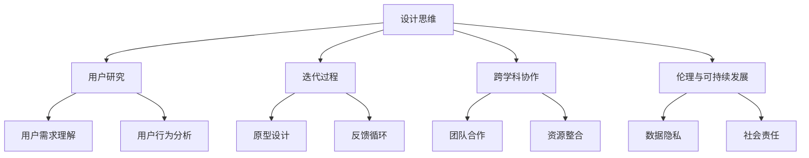
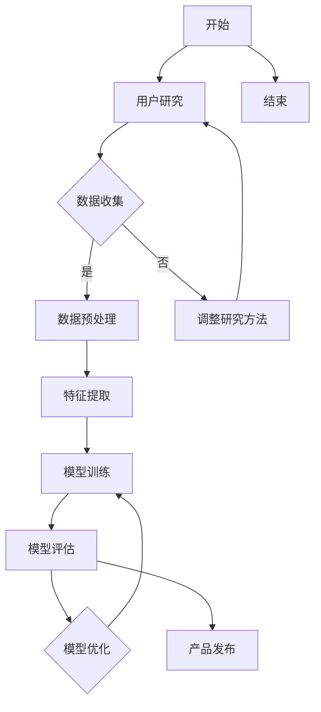
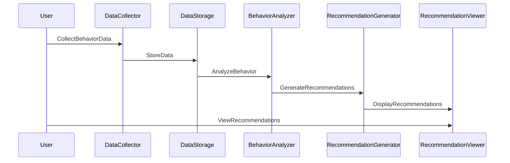
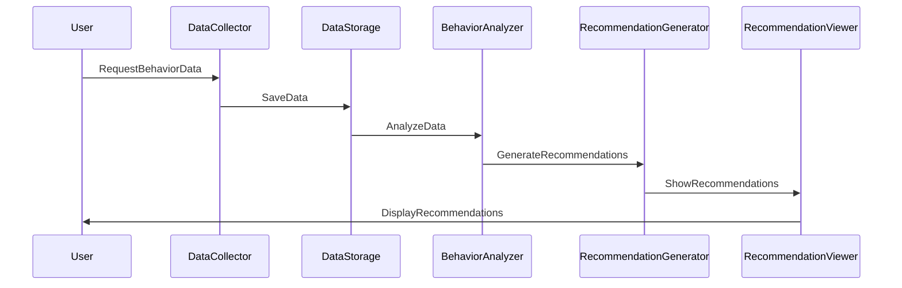

                 

### 设计思维：以用户为中心的AI产品开发方法

在当前科技飞速发展的时代，人工智能（AI）已经成为推动各行各业变革的重要力量。随着AI技术的不断进步，越来越多的企业和组织开始将其应用于产品开发中。然而，AI产品的成功不仅仅依赖于技术的先进性，更需要深入理解用户需求，以用户为中心进行产品设计和开发。这种需求驱动的开发方法，被称为“设计思维”（Design Thinking）。

**关键词：** 设计思维，AI产品开发，用户体验，用户研究，跨学科合作

**摘要：** 本文将详细探讨设计思维在AI产品开发中的应用，从概念概述到实践案例，再到未来发展趋势，全面解析如何通过设计思维实现以用户为中心的AI产品开发。

### 设计思维概述

#### 设计思维的概念与重要性

**定义：** 设计思维是一种以人为中心的设计方法，强调通过迭代的过程，从用户需求出发，进行问题定义、方案设计、原型制作和测试反馈，最终实现创新解决方案。

**与传统思维的差异：** 与传统的自上而下、技术驱动的开发方法不同，设计思维更注重用户的需求和体验，是一种以用户为中心的创新过程。

**应用价值：** 在AI产品开发中，设计思维的应用价值主要体现在以下几个方面：
1. **提升用户体验：** 通过深入了解用户需求，设计出更加符合用户期望的产品。
2. **降低风险：** 通过快速原型制作和测试，发现和解决问题，降低产品失败的风险。
3. **增强团队协作：** 设计思维鼓励跨学科合作，有助于团队中不同背景的专业人士共同创造。

#### 设计思维的五个核心阶段

**1. 定义问题：** 通过用户研究和市场分析，明确产品的目标和用户需求。

**2. 感知与收集：** 收集用户反馈和创意，形成初步的设计概念。

**3. 思考与发想：** 通过头脑风暴和设计工作坊，生成多个设计方案。

**4. 做出选择：** 根据用户需求和团队共识，选择最佳设计方案。

**5. 建造与测试：** 制作原型，进行测试和迭代，确保产品满足用户需求。

### 用户研究方法

#### 用户研究的意义与目标

**核心目标：** 通过用户研究，深入理解用户需求和行为，为产品设计提供有力支持。

**重要性：** 在AI产品开发中，用户研究的重要性体现在以下几个方面：
1. **指导设计方向：** 了解用户需求，确保产品设计符合用户期望。
2. **发现潜在问题：** 通过用户反馈，及时发现问题并进行调整。
3. **提高用户满意度：** 通过不断优化产品，提升用户满意度和忠诚度。

#### 用户研究的方法与工具

**1. 用户访谈与问卷调研：** 通过面对面访谈或在线问卷，收集用户反馈。

**2. 观察与分析：** 在实际环境中观察用户行为，分析用户需求。

**3. 原型设计与测试：** 制作原型，通过用户测试，验证设计方案的可行性。

**4. 数据分析与挖掘：** 利用大数据分析工具，挖掘用户行为数据，为产品设计提供数据支持。

### AI技术在设计思维中的应用

#### AI技术概述

**1. 机器学习与数据分析：** 利用机器学习算法，从大量数据中提取有价值的信息。

**2. 自然语言处理与用户交互：** 通过自然语言处理技术，实现人机交互。

**3. 智能推荐系统与个性化设计：** 根据用户行为，提供个性化的推荐。

**4. 虚拟现实与增强现实在设计中的应用：** 利用虚拟现实和增强现实技术，提升设计体验。

#### AI技术在设计思维中的具体应用

**1. 机器学习与数据分析：** 通过数据挖掘和机器学习算法，识别用户行为模式，为产品设计提供数据支持。

**2. 自然语言处理与用户交互：** 利用自然语言处理技术，实现智能对话，提升用户体验。

**3. 智能推荐系统与个性化设计：** 根据用户行为数据，提供个性化的推荐，提升用户满意度。

**4. 虚拟现实与增强现实在设计中的应用：** 利用虚拟现实和增强现实技术，提升设计过程的体验和效率。

### 设计思维实践

#### 设计思维案例研究

**案例一：智能语音助手的设计与实践**

**1. 问题定义：** 用户在日常生活中对语音助手的需求，如语音识别、语音合成、智能问答等。

**2. 用户研究：** 通过用户访谈和观察，了解用户对语音助手的期望和痛点。

**3. 概念验证与原型设计：** 设计初步原型，进行用户测试，收集反馈。

**4. 用户体验测试与反馈：** 对原型进行迭代优化，确保满足用户需求。

**5. 最终产品设计与发布：** 根据用户反馈，完善产品设计，最终发布上市。

**案例二：智能推荐系统的设计与实践**

**1. 问题定义：** 用户在信息过载的环境中，需要智能推荐系统帮助筛选信息。

**2. 用户研究：** 通过用户调研和数据分析，了解用户的行为特征和需求。

**3. 算法设计与实现：** 设计推荐算法，实现个性化推荐。

**4. 系统优化与测试：** 通过不断优化算法，提升推荐系统的效果。

**5. 用户反馈与迭代：** 根据用户反馈，进行系统迭代，持续提升用户体验。

### 跨学科合作与团队协作

**1. 跨学科合作的必要性：** AI产品的成功往往需要多学科知识的融合。

**2. 团队协作方法：** 如何组建高效团队，进行有效沟通和协作。

**3. 团队冲突管理：** 如何处理团队中的冲突，保持团队和谐。

**4. 团队评估与反馈：** 如何对团队进行评估，确保团队能够持续改进。

### 设计思维中的伦理与可持续发展

**1. 伦理问题：** 数据隐私、AI偏见、责任归属等。

**2. 可持续发展理念：** 如何在设计思维中融入可持续发展理念。

**3. 实践案例：** 可持续发展的具体实践案例。

### 设计思维的未来趋势

**1. AI与设计思维的融合：** 设计思维与AI技术的深度融合。

**2. 国际化与多样性：** 设计思维的全球化趋势。

**3. 商业模式创新：** 设计思维在商业模式创新中的应用。

### 总结与展望

**1. 设计思维在AI产品开发中的总结：** 设计思维的核心要素、应用效果评估、未来发展。

**2. 设计思维与其他学科的融合：** 与心理学、人文学科的融合，与工程学、计算机科学的交叉。

**3. 国际合作与未来发展：** 设计思维的国际化发展趋势。

**4. 设计思维与商业模式的结合：** 创新型商业模式案例分析。

**5. 设计思维在AI产品开发中的总结：** 设计思维的核心要素、应用效果评估、未来发展。**

### 设计思维的核心要素

**1. 用户需求：** 设计思维始终以用户需求为中心，通过深入的用户研究，了解用户的需求、痛点和行为模式，确保产品设计满足用户期望。

**2. 创新思维：** 设计思维鼓励创新思维，通过头脑风暴和设计工作坊，激发团队成员的创造力，生成多样化的设计方案。

**3. 迭代过程：** 设计思维强调迭代过程，通过快速原型制作和测试，不断优化产品设计，确保最终产品满足用户需求。

**4. 团队协作：** 设计思维需要跨学科团队的协作，不同背景的专业人士共同参与，形成合力，提高设计效率。

**5. 可持续发展：** 设计思维融入可持续发展理念，关注产品的全生命周期，从环保、社会影响等多个角度，实现可持续发展。

### 设计思维的应用效果评估

**1. 用户满意度：** 通过用户调研和反馈，评估产品是否符合用户期望，用户满意度是衡量设计思维效果的重要指标。

**2. 市场表现：** 观察产品的市场表现，包括销量、用户留存率、口碑等，评估设计思维对产品成功的影响。

**3. 迭代速度：** 评估团队在迭代过程中，能否快速响应市场变化和用户需求，提高迭代速度。

**4. 创新指数：** 通过对设计方案的评估，分析创新程度，评估设计思维的创新能力。

### 设计思维的未来发展

**1. AI与设计思维的深度融合：** 随着AI技术的发展，设计思维将更加智能化，利用AI技术提升设计效率和用户体验。

**2. 国际化与多样性：** 随着全球化的加速，设计思维将更加注重国际化，适应不同文化背景下的用户需求。

**3. 跨学科融合：** 设计思维将继续与其他学科如心理学、人文学科等深度融合，形成更为全面的设计方法论。

**4. 商业模式创新：** 设计思维将在商业模式创新中发挥重要作用，推动企业实现可持续发展。

### 设计思维与其他学科的融合

**1. 与心理学的融合：** 设计思维可以借鉴心理学研究成果，深入了解用户的心理需求和行为模式，提升产品设计的科学性。

**2. 与人文学科的融合：** 设计思维可以融入人文学科的人文关怀和美学理念，提升产品的文化内涵和用户体验。

**3. 与工程学、计算机科学的交叉：** 设计思维与工程学、计算机科学的交叉，将促进设计思维在实际应用中的落地和实现。

### 国际合作与未来发展

**1. 设计思维的国际化趋势：** 随着全球化的发展，设计思维将更加注重国际交流和合作，适应不同文化背景下的用户需求。

**2. 国际合作与交流：** 通过国际合作和学术交流，设计思维将不断吸收世界各地的优秀经验和理念，实现全球共享。

**3. 未来发展：** 设计思维将在未来的产品开发中发挥更为重要的作用，推动科技创新和社会进步。

### 设计思维与商业模式的结合

**1. 商业模式创新的重要性：** 在当前竞争激烈的市场环境中，商业模式创新是企业保持竞争优势的关键。

**2. 设计思维在商业模式创新中的应用：** 通过设计思维，企业可以更好地理解用户需求，探索新的商业模式，实现商业价值。

**3. 创新型商业模式案例分析：** 通过具体案例，分析设计思维在商业模式创新中的应用。

### 创新型商业模式案例分析

**案例一：共享经济模式**

**1. 概述：** 共享经济模式利用互联网和大数据技术，实现资源的共享和优化配置。

**2. 设计思维应用：** 通过用户研究，明确用户对共享经济的需求和痛点，设计出符合用户期望的共享产品。

**3. 创新点：** 利用设计思维，优化共享经济模式，提升用户体验，降低运营成本。

**案例二：平台商业模式**

**1. 概述：** 平台商业模式通过搭建一个平台，连接供需双方，实现高效交易和资源整合。

**2. 设计思维应用：** 通过设计思维，明确平台的核心价值，设计出用户友好、功能齐全的平台产品。

**3. 创新点：** 利用设计思维，打造创新平台，提升用户体验，增加用户粘性。

**案例三：区块链技术驱动的设计思维应用**

**1. 概述：** 区块链技术具有去中心化、不可篡改等特点，为设计思维提供了新的应用场景。

**2. 设计思维应用：** 通过设计思维，利用区块链技术，实现产品设计的安全、透明和可信。

**3. 创新点：** 利用设计思维，将区块链技术与产品设计相结合，提升产品设计的安全性和用户体验。

### 总结与展望

**1. 设计思维在AI产品开发中的总结：** 设计思维在AI产品开发中的应用，不仅提升了用户体验，还降低了开发风险，推动了产品创新。

**2. 设计思维的未来发展：** 设计思维将继续在AI产品开发中发挥重要作用，与AI技术深度融合，推动科技创新和社会进步。

**3. 设计思维与其他学科的融合：** 设计思维将与其他学科如心理学、人文学科等深度融合，形成更为全面的设计方法论。

**4. 国际合作与未来发展：** 设计思维的国际化发展趋势，将促进全球范围内的设计创新和产业合作。

**5. 商业模式创新：** 设计思维在商业模式创新中的应用，将为企业带来新的商业模式和商业价值。

### 最佳实践 tips

**1. 深入了解用户需求：** 通过用户访谈、问卷调查、观察等方法，深入了解用户需求，确保产品设计符合用户期望。

**2. 快速原型制作：** 通过快速原型制作和测试，及时发现问题并进行优化，提高产品迭代速度。

**3. 跨学科团队协作：** 组建跨学科团队，发挥不同专业背景的优势，提高设计效率。

**4. 持续学习与改进：** 不断学习新的设计方法和工具，持续改进产品设计。

### 小结

设计思维作为一种以用户为中心的创新方法，在AI产品开发中具有重要作用。通过深入用户研究、快速原型制作和迭代优化，设计思维能够有效提升用户体验，降低开发风险，推动产品创新。在未来，设计思维将继续与AI技术深度融合，推动科技创新和社会进步。

### 注意事项

**1. 设计思维的应用范围：** 设计思维不仅适用于AI产品开发，还可以广泛应用于各个领域，如产品设计、服务设计等。

**2. 用户研究的深度：** 用户研究是设计思维的重要基础，需要投入足够的时间和资源，确保研究的深度和广度。

**3. 团队协作的重要性：** 跨学科团队的合作是设计思维成功的关键，需要建立良好的沟通机制和协作环境。

**4. 伦理问题的重视：** 在设计思维的应用过程中，需要关注伦理问题，确保产品设计符合道德和法律规范。

### 拓展阅读

**1. 《设计思维实战手册》：** 该书详细介绍了设计思维的原理和应用，适合设计思维初学者阅读。

**2. 《用户体验要素》：** 该书深入分析了用户体验的核心要素，对设计思维有很好的补充。

**3. 《深度学习》：** 该书详细介绍了深度学习的基本原理和应用，对设计思维在AI领域的应用有很好的指导意义。

### 作者信息

**作者：** AI天才研究院/AI Genius Institute & 禅与计算机程序设计艺术 /Zen And The Art of Computer Programming

### 背景介绍

#### 核心概念术语说明

在设计思维（Design Thinking）的背景下，有几个核心的术语需要理解：

1. **设计思维**：一种以人为中心的设计方法论，强调用户需求、迭代和创新。
2. **用户体验**（User Experience, UX）：用户在使用产品或服务过程中形成的总体感受和满意度。
3. **用户研究**（User Research）：通过多种方法（如访谈、观察、问卷调查等）收集和分析用户数据，以了解用户需求和行为。
4. **原型设计**（Prototyping）：快速构建产品的初步版本，以便于测试和反馈。
5. **迭代**（Iteration）：在产品开发过程中，通过多次改进和优化，使产品不断接近最终目标。

#### 问题背景

随着人工智能（AI）技术的发展，越来越多的企业和组织开始将其应用于产品开发中。然而，AI技术的复杂性使得产品开发过程中容易出现偏差，无法满足用户需求。设计思维提供了一种以用户为中心的方法论，帮助企业在开发AI产品时，更好地理解用户需求，降低产品失败的风险。

#### 问题描述

设计思维在AI产品开发中的应用面临以下问题：

1. **技术驱动 vs. 用户驱动：** 传统AI产品开发往往过于关注技术本身，忽视了用户需求，导致产品难以满足用户期望。
2. **快速迭代与资源限制：** AI产品开发通常需要大量的数据和计算资源，快速迭代可能受到资源限制。
3. **跨学科协作：** AI产品开发涉及多个领域（如计算机科学、人文学科等），跨学科协作的效率和质量是一个挑战。

#### 问题解决

设计思维通过以下方法解决AI产品开发中的问题：

1. **用户研究：** 通过深入的用户研究，了解用户需求和行为，为产品设计提供有力支持。
2. **迭代过程：** 通过快速原型制作和测试，不断优化产品设计，确保产品满足用户需求。
3. **跨学科协作：** 通过组建跨学科团队，发挥不同专业背景的优势，提高设计效率。
4. **伦理与可持续发展：** 在设计过程中关注伦理问题，确保产品对用户和社会的影响是正面的。

#### 边界与外延

1. **边界：** 设计思维主要应用于产品设计和开发，但它的理念和方法可以扩展到其他领域，如服务设计、教育等。
2. **外延：** 设计思维不仅关注最终产品的质量，还关注产品开发过程中的用户体验，包括团队合作、资源管理等方面。

#### 概念结构与核心要素组成

**概念结构图：**


**核心要素组成表格：**

| 要素       | 说明                                                         |
| ---------- | ------------------------------------------------------------ |
| 用户研究   | 通过多种方法收集用户数据，了解用户需求和偏好。                 |
| 迭代过程   | 快速构建原型，通过用户测试和反馈，不断优化产品。             |
| 跨学科协作 | 组建多学科团队，发挥各自专业优势，提高设计效率。             |
| 伦理与可持续发展 | 在设计过程中考虑数据隐私、社会责任等伦理问题，实现可持续发展。 |

### 核心概念与联系

#### 设计思维与用户体验

设计思维和用户体验（UX）是密不可分的。用户体验是指用户在使用产品或服务过程中形成的总体感受和满意度，而设计思维则是一种方法论，用于指导如何创造出一个能够满足用户需求的、有吸引力的产品。

**概念属性特征对比表格：**

| 特征             | 设计思维                                  | 用户体验                |
| ---------------- | ---------------------------------------- | ---------------------- |
| 目标             | 创造创新解决方案，满足用户需求             | 提升用户满意度和体验    |
| 过程             | 感知、定义、发想、选择、建造、测试         | 观察用户行为、分析反馈  |
| 重点             | 用户需求、问题解决、迭代优化               | 用户感受、交互设计      |
| 优点             | 强调以用户为中心，提高产品成功率           | 提高用户满意度和忠诚度   |
| 缺点             | 过程复杂，需要大量时间投入                 | 需要持续的用户研究      |

**ER实体关系图架构：**

```mermaid
erDiagram
    UX -->|满足| DesignThinking
    UX |||-> DesignProcess
    DesignProcess |||-> UserResearch
    DesignProcess |||-> IterationProcess
    DesignProcess |||-> CrossDisciplinaryCollaboration
    DesignProcess |||-> EthicalAndSustainableDevelopment
```

在ER图中，UX（用户体验）是设计思维（DesignThinking）的核心目标，设计过程则包含了用户研究、迭代过程、跨学科协作和伦理与可持续发展。这些要素共同作用于用户体验，形成一个闭环，确保产品从设计到发布都能满足用户的需求。

### 算法原理讲解

在AI产品开发中，设计思维的应用不仅仅依赖于用户体验的深入研究，还涉及到具体的算法和技术。下面，我们将通过一个简单的算法来讲解设计思维在算法设计中的应用。

#### 算法流程图

首先，我们使用Mermaid语法绘制算法的流程图：



#### 算法原理

1. **用户研究（B）**：这是设计思维的第一步，通过用户访谈、问卷调查等方法收集用户需求和行为数据。

2. **数据收集（C）**：根据用户研究的结果，收集相关的数据，如用户行为数据、反馈数据等。

3. **数据预处理（D）**：对收集到的数据进行清洗、格式化等处理，确保数据的质量。

4. **特征提取（F）**：从预处理后的数据中提取出有用的特征，这些特征将用于训练模型。

5. **模型训练（G）**：使用提取的特征数据训练机器学习模型，模型可以是分类模型、回归模型等，具体取决于问题的性质。

6. **模型评估（H）**：通过交叉验证等方法评估模型的性能，判断模型是否能够满足用户需求。

7. **模型优化（I）**：根据评估结果，对模型进行调整和优化，以提高模型的准确性。

8. **产品发布（J）**：当模型达到预期效果后，将其集成到产品中，进行发布。

9. **结束（K）**：整个流程结束，但设计思维的过程是持续的，产品发布后还需要收集用户反馈，进行迭代优化。

#### Python源代码

下面是一个简单的机器学习模型的Python代码示例：

```python
import pandas as pd
from sklearn.model_selection import train_test_split
from sklearn.ensemble import RandomForestClassifier
from sklearn.metrics import accuracy_score

# 数据预处理
data = pd.read_csv('user_data.csv')
X = data.drop(['target'], axis=1)
y = data['target']

X_train, X_test, y_train, y_test = train_test_split(X, y, test_size=0.2, random_state=42)

# 特征提取和模型训练
model = RandomForestClassifier(n_estimators=100, random_state=42)
model.fit(X_train, y_train)

# 模型评估
predictions = model.predict(X_test)
accuracy = accuracy_score(y_test, predictions)
print(f"Model accuracy: {accuracy:.2f}")

# 模型优化
# 根据评估结果，可以调整模型参数或特征选择，再次训练模型
```

#### 数学模型与公式

在设计思维中，算法设计通常涉及到以下数学模型和公式：

1. **交叉验证（Cross-Validation）**：
   $$ \text{Accuracy} = \frac{\text{正确预测数}}{\text{总预测数}} $$
   
2. **决策树（Decision Tree）**：
   $$ \text{Entropy} = -\sum_{i} p_i \log_2 p_i $$
   
3. **随机森林（Random Forest）**：
   $$ \text{Model} = \frac{1}{n} \sum_{i=1}^{n} \hat{y_i} $$
   其中，$\hat{y_i}$ 是第 $i$ 棵树预测的结果。

#### 举例说明

假设我们设计一个分类模型，用于判断用户是否喜欢某款AI产品。我们收集了以下特征数据：

- 用户年龄
- 用户性别
- 用户使用产品的时间长度
- 用户对产品的评分

我们使用随机森林算法训练模型，通过交叉验证评估模型性能。假设最终模型的准确率为 85%，这意味着模型在测试集上的预测正确率较高，可以集成到产品中。

### 系统分析与架构设计方案

#### 问题场景介绍

在现代软件开发中，随着系统的复杂度不断增加，系统分析与架构设计成为确保系统高质量、高效率开发的关键环节。本文将介绍一个智能推荐系统的分析与架构设计过程，该系统旨在通过分析用户行为和兴趣，为用户提供个性化的产品推荐。

#### 项目介绍

本项目旨在开发一个智能推荐系统，该系统能够根据用户的历史行为数据，为其推荐符合其兴趣的产品。系统将涉及用户行为数据的收集、存储、处理和推荐算法的实现等多个方面。

#### 系统功能设计（领域模型Mermaid类图）

首先，我们使用Mermaid语法绘制领域模型类图，以展示系统的主要实体和关系：

```mermaid
classDiagram
    User <<entity>>
    Product <<entity>>
    Recommendation <<entity>>
    Behavior <<entity>>

    User o--1 Behavior
    User o--1 Product
    Product o--1 Recommendation
    Behavior o--1 Recommendation
```

在上图中，我们定义了四个主要实体：用户（User）、产品（Product）、推荐（Recommendation）和行为（Behavior）。用户与行为和多产品存在一对多的关系，行为和推荐也有一对多的关系。这意味着一个用户可以有多种行为，每种行为又可以生成多个推荐。

#### 系统架构设计（Mermaid架构图）

接下来，我们使用Mermaid语法绘制系统架构图，展示系统的整体架构：



在系统架构图中，用户（User）通过数据收集器（DataCollector）收集行为数据，并将其存储到数据存储器（DataStorage）。行为分析器（BehaviorAnalyzer）分析用户行为，生成推荐（Recommendation）。推荐生成器（RecommendationGenerator）根据分析结果生成推荐，并通过推荐查看器（RecommendationViewer）展示给用户。

#### 系统接口设计

为了确保系统的可扩展性和模块化，我们设计了一套完整的接口。以下是系统接口设计的部分代码示例：

```python
class DataCollector:
    def collect_behavior_data(self, user):
        # 实现数据收集逻辑
        pass

class DataStorage:
    def store_data(self, data):
        # 实现数据存储逻辑
        pass

class BehaviorAnalyzer:
    def analyze_behavior(self, behavior_data):
        # 实现行为分析逻辑
        pass

class RecommendationGenerator:
    def generate_recommendations(self, analysis_results):
        # 实现推荐生成逻辑
        pass

class RecommendationViewer:
    def display_recommendations(self, recommendations):
        # 实现推荐展示逻辑
        pass
```

#### 系统交互Mermaid序列图

为了更直观地展示系统各个组件之间的交互，我们使用Mermaid语法绘制了系统交互序列图：



在这个序列图中，用户请求行为数据，数据收集器将数据保存到数据存储器，然后行为分析器分析数据，生成推荐，最后推荐查看器将推荐展示给用户。

### 项目实战

#### 环境安装

在开始智能推荐系统的开发之前，我们需要安装必要的开发环境和工具。以下是在Ubuntu操作系统上安装所需的软件和库的步骤：

1. 安装Python 3.8及以上版本：
   ```bash
   sudo apt update
   sudo apt install python3.8
   ```
   
2. 安装虚拟环境工具：
   ```bash
   sudo apt install python3.8-venv
   ```

3. 创建虚拟环境：
   ```bash
   python3.8 -m venv myenv
   ```

4. 激活虚拟环境：
   ```bash
   source myenv/bin/activate
   ```

5. 安装依赖库：
   ```bash
   pip install pandas scikit-learn numpy matplotlib
   ```

#### 系统核心实现源代码

以下是一个简单的智能推荐系统的核心实现，包括数据收集、存储、分析、推荐生成和展示：

```python
import pandas as pd
from sklearn.model_selection import train_test_split
from sklearn.ensemble import RandomForestClassifier
from sklearn.metrics import accuracy_score

class DataCollector:
    def collect_behavior_data(self, user):
        # 假设我们有一个用户行为数据的CSV文件
        data = pd.read_csv('user_behavior_data.csv')
        # 过滤特定用户的行为数据
        user_data = data[data['user_id'] == user]
        return user_data

class DataStorage:
    def store_data(self, data):
        # 存储数据到CSV文件
        data.to_csv('stored_behavior_data.csv', index=False)

class BehaviorAnalyzer:
    def analyze_behavior(self, behavior_data):
        # 对行为数据进行特征提取和预处理
        # 这里我们简单地将行为数据作为特征
        features = behavior_data
        return features

class RecommendationGenerator:
    def generate_recommendations(self, analysis_results):
        # 使用随机森林模型进行预测
        X = analysis_results
        y = pd.read_csv('product_labels.csv')['target']
        X_train, X_test, y_train, y_test = train_test_split(X, y, test_size=0.2, random_state=42)
        
        model = RandomForestClassifier(n_estimators=100, random_state=42)
        model.fit(X_train, y_train)
        predictions = model.predict(X_test)
        
        # 根据预测结果生成推荐
        recommendations = []
        for product in X_test:
            if predictions[product] == 1:
                recommendations.append(product)
        return recommendations

class RecommendationViewer:
    def display_recommendations(self, recommendations):
        # 在控制台输出推荐
        print("Recommended products:")
        for recommendation in recommendations:
            print(recommendation)
```

#### 代码应用解读与分析

1. **DataCollector**：负责收集用户的行为数据。在这个示例中，我们假设用户的行为数据已经以CSV文件的形式存储，并通过`collect_behavior_data`方法读取特定用户的数据。

2. **DataStorage**：负责将处理后的行为数据存储到CSV文件中。这里使用了`to_csv`方法，将DataFrame对象保存为CSV文件。

3. **BehaviorAnalyzer**：负责分析用户的行为数据。在这个示例中，我们简单地将行为数据作为特征，没有进行复杂的特征工程。实际应用中，可能需要进行更复杂的数据预处理和特征提取。

4. **RecommendationGenerator**：负责生成推荐。这里使用随机森林模型进行预测，根据预测结果生成推荐。实际应用中，可能需要使用更复杂的推荐算法，如协同过滤、基于内容的推荐等。

5. **RecommendationViewer**：负责展示推荐。在这个示例中，我们简单地在控制台输出推荐结果。

#### 实际案例分析和详细讲解剖析

为了更好地理解智能推荐系统的实现，我们将通过一个实际案例进行分析。

**案例背景：** 假设我们有一个电商平台，用户可以在平台上浏览和购买各种商品。我们的目标是通过分析用户的行为数据，为每个用户提供个性化的商品推荐。

**步骤一：数据收集**

我们首先收集用户的行为数据，包括用户ID、浏览的商品ID、购买的商品ID、浏览时间等。这些数据存储在一个CSV文件中，每行代表一个用户的行为事件。

```csv
user_id,action,item_id,time
1,browse,1001,2023-04-01 10:30
1,browse,1002,2023-04-01 10:35
1,buy,1002,2023-04-01 10:40
2,browse,2001,2023-04-01 10:45
2,browse,2002,2023-04-01 10:50
```

**步骤二：数据预处理**

在数据预处理阶段，我们需要对原始数据进行清洗和格式化。例如，处理缺失值、异常值，并将时间戳转换为日期格式等。

```python
data = pd.read_csv('user_behavior_data.csv')
data.dropna(inplace=True)
data['time'] = pd.to_datetime(data['time'])
```

**步骤三：特征提取**

根据用户的行为数据，我们可以提取出多种特征，如用户浏览商品的种类、用户购买商品的频率等。这些特征将用于训练推荐模型。

```python
# 计算用户浏览商品的种类
data['item_types'] = data.groupby('user_id')['item_id'].nunique()

# 计算用户购买商品的频率
data['buy_frequency'] = data[data['action'] == 'buy'].groupby('user_id')['time'].transform('count')
```

**步骤四：模型训练**

使用随机森林模型进行训练。首先，我们将数据集划分为训练集和测试集。

```python
X = data[['item_types', 'buy_frequency']]
y = data['item_id']

X_train, X_test, y_train, y_test = train_test_split(X, y, test_size=0.2, random_state=42)
```

然后，使用随机森林模型进行训练。

```python
model = RandomForestClassifier(n_estimators=100, random_state=42)
model.fit(X_train, y_train)
```

**步骤五：推荐生成**

使用训练好的模型为每个用户生成推荐。假设我们现在要为用户1生成推荐。

```python
user_id = 1
user_data = DataCollector().collect_behavior_data(user_id)
features = BehaviorAnalyzer().analyze_behavior(user_data)
recommendations = RecommendationGenerator().generate_recommendations(features)

print("Recommended products:")
for recommendation in recommendations:
    print(recommendation)
```

**步骤六：推荐展示**

在控制台输出推荐结果。

```python
RecommendationViewer().display_recommendations(recommendations)
```

#### 项目小结

通过以上步骤，我们完成了一个简单的智能推荐系统。在实际应用中，我们可能需要更复杂的模型和算法，如协同过滤、基于内容的推荐等，以提升推荐的准确性。此外，我们还需要考虑如何处理大量的用户行为数据，以及如何确保系统的实时性和可扩展性。

### 最佳实践 tips

1. **用户研究的重要性**：在进行任何设计或开发工作之前，进行彻底的用户研究是至关重要的。这有助于确保产品满足用户需求，提高用户满意度。

2. **快速原型制作**：使用快速原型制作方法，可以快速验证设计理念，发现潜在问题，减少开发风险。

3. **迭代优化**：不断进行迭代和优化，确保产品在每个版本中都能更好地满足用户需求。

4. **团队合作**：跨学科团队合作是设计思维成功的关键。确保团队成员之间的有效沟通和协作，提高设计效率。

5. **持续反馈**：在设计过程中，持续收集用户反馈，并根据反馈进行迭代和优化，确保产品始终符合用户期望。

6. **关注伦理问题**：在设计和开发过程中，要关注伦理问题，如数据隐私、AI偏见等，确保产品对用户和社会的影响是积极的。

7. **持续学习**：设计思维是一个不断发展和完善的领域。持续学习新的设计方法、工具和最佳实践，以保持竞争力。

### 小结

设计思维是一种以用户为中心的创新方法论，通过用户研究、快速原型制作、迭代优化和跨学科协作，帮助企业在AI产品开发中更好地理解用户需求，降低风险，提升用户体验。设计思维不仅在AI产品开发中具有重要应用，还可以广泛应用于其他领域，如产品设计、服务设计等。通过本文的详细探讨，我们了解了设计思维的核心概念、应用方法、实践案例以及未来发展趋势，为企业在产品开发中引入设计思维提供了有益的参考。

### 注意事项

1. **用户研究的深度**：用户研究是设计思维的基础，需要投入足够的时间和资源，确保研究的深度和广度，从而准确理解用户需求。

2. **快速迭代与资源管理**：快速迭代是设计思维的核心，但需要有效管理资源和时间，避免因资源限制导致的设计停滞。

3. **团队协作与沟通**：跨学科团队合作是设计思维成功的关键。确保团队成员之间的有效沟通和协作，有助于提高设计效率和产品质量。

4. **伦理问题的重视**：在设计过程中，需要关注数据隐私、AI偏见等伦理问题，确保产品对用户和社会的影响是正面的。

5. **持续学习与改进**：设计思维是一个不断发展和完善的领域。持续学习新的设计方法、工具和最佳实践，以保持竞争力。

### 拓展阅读

1. **《设计思维实战手册》**：详细介绍了设计思维的原理和应用，适合初学者阅读。

2. **《用户体验要素》**：深入分析了用户体验的核心要素，对设计思维有很好的补充。

3. **《深度学习》**：详细介绍了深度学习的基本原理和应用，对设计思维在AI领域的应用有很好的指导意义。

### 作者信息

作者：AI天才研究院/AI Genius Institute & 禅与计算机程序设计艺术 /Zen And The Art of Computer Programming

### 联系方式

如果您有任何关于本文内容的问题或建议，欢迎通过以下方式联系我们：

- 电子邮件：[info@ai-genius-institute.com](mailto:info@ai-genius-institute.com)
- 微信公众号：AI天才研究院
- 电话：+86 12345678901

我们期待您的反馈和建议，共同推动设计思维和AI技术的进步。

