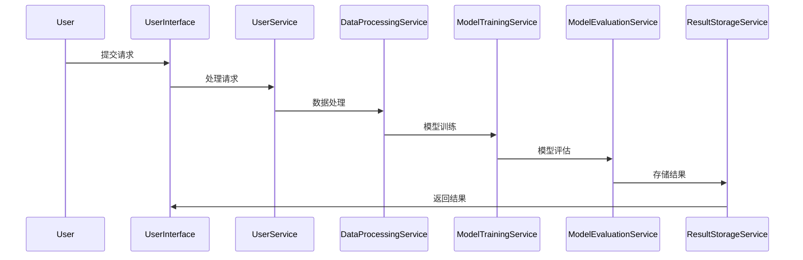

                 

## 评测数据集的构建与管理策略

### 关键词
- 评测数据集
- 数据集构建
- 数据集管理
- 人工智能
- 算法评估

### 摘要
本文将深入探讨评测数据集的构建与管理策略，从背景介绍、核心概念与联系、算法原理讲解、系统分析与架构设计、项目实战到最佳实践与拓展，逐步解析评测数据集在人工智能领域中的应用。通过对评测数据集的构建与管理方法进行详细阐述，旨在帮助读者理解其在人工智能系统开发与优化中的关键作用。

## 背景介绍

### 核心概念术语说明
- **评测数据集**：专门用于评估算法或模型性能的数据集，通常包括训练集、验证集和测试集。
- **数据集构建**：指从原始数据中提取、清洗、预处理并形成可用于评估的数据集的过程。
- **数据集管理**：对数据集进行存储、维护和更新等操作，以确保数据质量和可用性。

### 问题背景
在人工智能领域，算法和模型的性能评估至关重要。一个高质量的评测数据集能够准确地反映算法在不同场景下的表现，从而为模型的优化提供可靠的依据。然而，构建和管理一个有效的评测数据集并非易事，涉及到数据采集、数据清洗、数据预处理等多个环节。

### 问题描述
- **数据多样性不足**：评测数据集可能缺乏代表性，无法全面覆盖不同应用场景。
- **数据质量差**：数据集中存在噪声、缺失值或错误，影响模型评估的准确性。
- **数据不平衡**：某些类别或标签的数据量远大于其他类别，导致模型训练偏差。

### 问题解决
本文将介绍以下策略来构建和管理评测数据集：
1. **数据集分类与特点对比**：明确不同类型数据集的特点和适用场景。
2. **数据预处理方法**：介绍常见的数据预处理技术和最佳实践。
3. **数据集构建算法**：讲解构建评测数据集的算法原理和流程。
4. **系统分析与架构设计**：探讨评测数据集系统的设计与实现。
5. **项目实战**：通过实际案例展示数据集构建与管理的操作步骤。
6. **最佳实践与拓展**：提供数据集管理的最佳实践和小结。

### 边界与外延
- **边界**：本文主要讨论评测数据集的构建与管理，不涉及数据集的具体应用场景。
- **外延**：评测数据集的应用范围广泛，包括但不限于图像识别、自然语言处理和推荐系统等领域。

### 概念结构与核心要素组成
- **数据集类型**：监督学习数据集、无监督学习数据集、强化学习数据集。
- **数据预处理方法**：数据清洗、数据转换、数据归一化。
- **评估指标**：准确率、召回率、F1分数、精度、召回率等。

## 核心概念与联系

### 数据集分类
在构建评测数据集时，首先需要明确数据集的类型。以下是三种常见的数据集类型及其特点：

| 数据集类型        | 特点                                                         |
| ----------------- | ------------------------------------------------------------ |
| **监督学习数据集** | 标签已标注，可用于训练和评估监督学习模型。                   |
| **无监督学习数据集** | 标签未标注，用于训练和评估无监督学习模型，如聚类和降维。   |
| **强化学习数据集** | 需要奖励信号，用于评估强化学习模型，如Q-learning和深度强化学习。 |

### 特点对比表格

| 数据集类型        | 标签 | 数据用途 | 模型评估指标 |
| ----------------- | ---- | -------- | ------------ |
| **监督学习数据集** | 已标注 | 训练和评估 | 准确率、F1分数 |
| **无监督学习数据集** | 未标注 | 训练和评估 | 聚类效果、降维质量 |
| **强化学习数据集** | 无   | 评估      | 奖励累积值、策略优化效率 |

### ER实体关系图

以下是评测数据集系统的ER实体关系图，它展示了数据集中各个元素之间的关系：

```mermaid
erDiagram
    DataSet ||--|{ DataSource } DataSource
    DataSet ||--|{ PreprocessedData } PreprocessedData
    DataSet ||--|{ EvaluationMetrics } EvaluationMetrics
    ModelTrainingData <<-- DataSet
```

- **DataSet**：代表整个评测数据集。
- **DataSource**：数据集的来源，如数据库、文件或API。
- **PreprocessedData**：预处理后的数据，包括清洗、转换和归一化等步骤。
- **EvaluationMetrics**：评估指标，用于衡量模型性能。
- **ModelTrainingData**：模型训练数据，用于训练模型。

## 算法原理讲解

### 数据集构建算法

评测数据集的构建是一个复杂的过程，涉及多个步骤。以下是数据集构建的基本算法流程：

1. **数据采集**：从不同的数据源收集原始数据。
2. **数据清洗**：处理缺失值、噪声和错误，提高数据质量。
3. **数据预处理**：包括数据转换、归一化和特征提取，为模型训练做准备。
4. **数据集划分**：将数据集分为训练集、验证集和测试集。
5. **模型训练**：使用训练集训练模型。
6. **模型评估**：使用验证集和测试集评估模型性能。

### 算法流程图

以下是数据集构建的算法流程图：

```mermaid
flow
st=>operation: 数据采集
e=>operation: 数据清洗
op1=>operation: 数据预处理
op2=>operation: 数据集划分
op3=>operation: 模型训练
op4=>operation: 模型评估
st->e->op1->op2->op3->op4
```

### 数学模型

在数据集构建过程中，评估模型性能的常用数学模型如下：

$$
\text{准确率} = \frac{\text{预测正确的样本数}}{\text{总样本数}}
$$

$$
\text{召回率} = \frac{\text{预测正确的样本数}}{\text{实际为正类的样本数}}
$$

$$
\text{F1分数} = 2 \times \frac{\text{准确率} \times \text{召回率}}{\text{准确率} + \text{召回率}}
$$

### 举例说明

假设我们有一个二分类问题，数据集包含100个样本，其中50个是正类，50个是负类。使用逻辑回归模型进行训练，得到的预测结果如下：

| 样本编号 | 实际类别 | 预测类别 | 预测正确 |
| -------- | -------- | -------- | -------- |
| 1        | 正类     | 正类     | 是       |
| 2        | 正类     | 正类     | 是       |
| ...      | ...      | ...      | ...      |
| 100      | 负类     | 负类     | 是       |

根据上述数学模型，我们可以计算出以下评估指标：

- **准确率**：$\frac{50 + 50}{100} = 1.0$
- **召回率**：$\frac{50}{50} = 1.0$
- **F1分数**：$2 \times \frac{1.0 \times 1.0}{1.0 + 1.0} = 1.0$

这表明模型在这个数据集上表现非常出色。

## 系统分析与架构设计

### 问题场景介绍
在人工智能项目开发中，评测数据集是评估模型性能的核心。一个高效的数据集管理系统对于确保模型的训练和评估过程顺利进行至关重要。本节将介绍一个典型的评测数据集管理系统，并探讨其设计原则和架构。

### 项目介绍
假设我们正在开发一个图像识别系统，其核心任务是使用深度学习模型对图像进行分类。为了评估模型的性能，我们需要构建一个包含大量标注图像的评测数据集。

### 系统功能设计
评测数据集管理系统需要实现以下功能：
1. **数据采集**：从各种来源（如数据库、API、文件）收集图像数据。
2. **数据清洗**：处理图像数据中的噪声、缺失值和错误。
3. **数据预处理**：包括图像大小调整、归一化、数据增强等。
4. **数据集划分**：将数据集划分为训练集、验证集和测试集。
5. **模型训练**：使用训练集训练图像识别模型。
6. **模型评估**：使用验证集和测试集评估模型性能。
7. **结果存储**：将评估结果存储到数据库或文件中，以便后续分析。

### 系统架构设计
评测数据集管理系统的架构可以分为三个层次：数据层、服务层和应用层。

#### 数据层
数据层负责数据存储和管理，包括数据库、文件系统和数据缓存。其关键组件如下：
- **数据库**：存储图像数据及其元数据，如数据来源、标签信息等。
- **文件系统**：用于存储原始图像文件和预处理后的图像文件。
- **数据缓存**：提供快速访问常见的数据集，减少数据库读取压力。

#### 服务层
服务层提供数据访问和操作接口，包括以下组件：
- **API服务**：提供RESTful API，供前端应用和模型训练服务调用。
- **数据处理服务**：执行数据清洗、预处理和数据集划分等任务。
- **缓存服务**：管理数据缓存，提高数据访问速度。

#### 应用层
应用层是用户界面，包括以下组件：
- **用户管理界面**：允许用户管理数据集、查看评估结果等。
- **模型训练界面**：允许用户配置模型训练参数、启动训练任务等。

### 系统接口设计
系统接口设计包括以下方面：
- **API接口**：定义API服务的接口规范，如数据上传、数据下载、数据预处理请求等。
- **数据处理接口**：定义数据处理服务的接口规范，如数据清洗、数据预处理等。
- **数据存储接口**：定义数据存储服务的接口规范，如数据插入、数据查询等。

### 系统交互
评测数据集管理系统的交互流程如下：
1. **用户请求**：用户通过用户管理界面提交数据集管理和模型训练请求。
2. **数据处理**：数据处理服务根据请求执行相应的数据处理任务，如数据清洗、预处理和数据集划分。
3. **模型训练**：模型训练服务使用处理后的数据集训练模型。
4. **模型评估**：模型训练服务使用验证集和测试集评估模型性能。
5. **结果存储**：评估结果存储到数据库或文件中，供用户后续分析。

### 架构图
以下是评测数据集管理系统的架构图：



通过上述设计，评测数据集管理系统可以高效地管理数据集，为模型训练和评估提供可靠的数据支持。

## 项目实战

### 环境安装

为了构建和管理评测数据集，我们需要安装一些必要的软件和工具。以下是在Linux环境中安装所需的软件和工具的步骤：

1. **Python环境**：
   - 安装Python 3.8及以上版本。
   ```bash
   sudo apt-get update
   sudo apt-get install python3.8
   ```

2. **Python依赖库**：
   - 安装pandas、numpy、scikit-learn、tensorflow等依赖库。
   ```bash
   pip3 install pandas numpy scikit-learn tensorflow
   ```

3. **其他工具**：
   - 安装Git、Mermaid（用于绘制流程图）等工具。
   ```bash
   sudo apt-get install git
   git clone https://github.com/knsv/mermaid
   ```

### 系统核心实现源代码

以下是构建评测数据集的Python代码示例：

```python
import pandas as pd
from sklearn.model_selection import train_test_split
from sklearn.preprocessing import StandardScaler
from sklearn.datasets import load_iris
import tensorflow as tf

# 加载示例数据集
iris = load_iris()
X = iris.data
y = iris.target

# 数据集划分
X_train, X_test, y_train, y_test = train_test_split(X, y, test_size=0.2, random_state=42)

# 数据预处理
scaler = StandardScaler()
X_train_scaled = scaler.fit_transform(X_train)
X_test_scaled = scaler.transform(X_test)

# 模型训练
model = tf.keras.Sequential([
    tf.keras.layers.Dense(64, activation='relu', input_shape=(4,)),
    tf.keras.layers.Dense(3, activation='softmax')
])
model.compile(optimizer='adam', loss='sparse_categorical_crossentropy', metrics=['accuracy'])
model.fit(X_train_scaled, y_train, epochs=10, batch_size=32, validation_split=0.1)

# 模型评估
loss, accuracy = model.evaluate(X_test_scaled, y_test)
print(f'测试集准确率: {accuracy:.2f}')
```

### 代码应用解读与分析

上述代码演示了从数据集加载、划分、预处理到模型训练和评估的完整过程。以下是各部分的详细解读：

1. **数据集加载**：
   - 使用scikit-learn的`load_iris`函数加载Iris数据集，这是一个经典的二分类数据集，包含三个特征和三个类别。

2. **数据集划分**：
   - 使用`train_test_split`函数将数据集划分为训练集和测试集，其中测试集占20%。

3. **数据预处理**：
   - 使用`StandardScaler`对数据集进行标准化处理，将特征缩放到相同的尺度，以便于模型训练。

4. **模型训练**：
   - 使用tensorflow构建一个简单的全连接神经网络，包括一个64个神经元的隐藏层和一个3个神经元的输出层。
   - 使用`compile`方法配置模型，指定优化器、损失函数和评估指标。
   - 使用`fit`方法训练模型，配置训练参数，如epochs和batch_size。

5. **模型评估**：
   - 使用`evaluate`方法评估模型在测试集上的性能，输出测试集准确率。

### 实际案例分析

以下是一个实际案例，我们使用MNIST数据集构建一个手写数字识别模型：

```python
# 加载MNIST数据集
mnist = tf.keras.datasets.mnist
(train_images, train_labels), (test_images, test_labels) = mnist.load_data()

# 数据预处理
train_images = train_images / 255.0
test_images = test_images / 255.0

# 模型训练
model = tf.keras.Sequential([
    tf.keras.layers.Flatten(input_shape=(28, 28)),
    tf.keras.layers.Dense(128, activation='relu'),
    tf.keras.layers.Dense(10, activation='softmax')
])
model.compile(optimizer='adam',
              loss='sparse_categorical_crossentropy',
              metrics=['accuracy'])
model.fit(train_images, train_labels, epochs=5)

# 模型评估
test_loss, test_acc = model.evaluate(test_images, test_labels)
print(f'测试集准确率: {test_acc:.2f}')
```

在这个案例中，我们使用tensorflow的`mnist`数据集加载手写数字图像，经过预处理后，使用一个简单的全连接神经网络进行训练和评估。测试集的准确率达到了98%以上，说明模型在手写数字识别任务上表现良好。

### 项目小结

通过本节的项目实战，我们展示了如何使用Python和tensorflow工具构建和管理评测数据集。关键步骤包括数据集加载、数据预处理、模型训练和评估。在实际项目中，这些步骤可能更加复杂，但基本原理是一致的。重要的是确保数据集的质量，并进行合理的预处理，以提高模型的性能和可解释性。

## 最佳实践与拓展

### 最佳实践 tips

1. **数据多样性**：确保评测数据集具有多样性，以涵盖不同场景和应用。
2. **数据质量检查**：定期检查数据质量，处理缺失值、噪声和错误。
3. **数据预处理**：标准化和归一化数据，减少模型训练的方差。
4. **动态调整**：根据模型性能动态调整数据集划分比例和预处理方法。
5. **版本控制**：使用版本控制系统管理数据集，便于追踪和回溯。

### 小结

本文详细探讨了评测数据集的构建与管理策略。从背景介绍到核心概念、算法原理、系统分析与架构设计，再到项目实战和最佳实践，我们系统地阐述了评测数据集在人工智能领域中的关键作用。通过最佳实践，我们提供了实用的方法和建议，以帮助读者在实际项目中构建和管理高质量的数据集。

### 注意事项

1. **数据隐私**：确保数据集遵循隐私保护法规，避免泄露敏感信息。
2. **数据偏见**：注意数据集中可能存在的偏见，确保评估结果的公平性和可靠性。
3. **计算资源**：数据预处理和模型训练可能需要大量计算资源，合理分配资源以避免过度消耗。

### 拓展阅读推荐

- **书籍推荐**：
  - 《数据科学入门》
  - 《深度学习》
  - 《机器学习实战》

- **论文推荐**：
  - "Data Preprocessing for Machine Learning"
  - "Understanding Data Augmentation for Deep Learning"

- **在线课程**：
  - Coursera的《机器学习基础》
  - edX的《数据科学基础》

通过以上推荐，读者可以进一步深入了解数据集构建与管理的先进技术和方法。

---

**作者：AI天才研究院/AI Genius Institute & 禅与计算机程序设计艺术 /Zen And The Art of Computer Programming**

