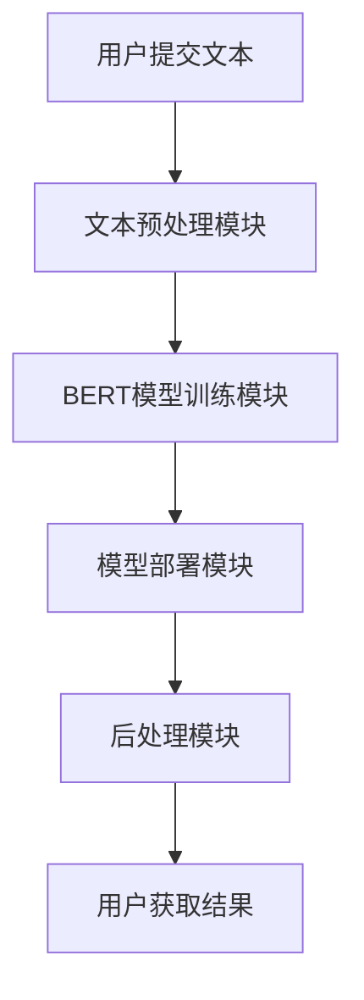
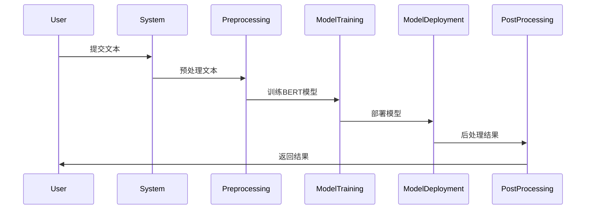

                 

# 评测系统中的BERT变体模型应用

## 关键词
BERT模型、评测系统、自然语言处理、变体模型、RoBERTa、ALBERT、DeBERTa

## 摘要
本文将深入探讨BERT模型及其在评测系统中的应用，特别关注BERT的变体模型，包括RoBERTa、ALBERT和DeBERTa。通过详细分析这些模型的基本概念、工作原理以及它们在评测系统中的具体应用，我们将揭示BERT变体模型在提升评测系统性能方面的潜力和优势。

## 第1章：BERT模型概述

### 第1章：BERT模型概述

BERT（Bidirectional Encoder Representations from Transformers）是一种基于Transformer架构的预训练语言表示模型，由Google Research提出。BERT模型在自然语言处理（NLP）领域中具有革命性意义，其主要目的是通过预训练来提高模型对上下文的理解能力，从而在不同任务上取得卓越的性能。

#### 1.1 评测系统中的BERT模型

##### 1.1.1 BERT模型的基本概念

BERT模型是一种基于Transformer的自适应预训练语言表示模型。它使用自注意力机制（Self-Attention）来捕捉输入文本序列中的依赖关系。BERT模型由两个主要部分组成：编码器（Encoder）和解码器（Decoder）。编码器负责生成输入文本的上下文表示，解码器则负责生成输出序列。

##### 1.1.2 BERT模型的工作原理

BERT模型的工作原理可以分为预训练和微调两个阶段。在预训练阶段，BERT模型通过Masked Language Model（MLM）和无监督的Next Sentence Prediction（NSP）任务来学习语言表示。MLM任务是指在输入文本中随机屏蔽一些单词，然后让模型预测这些单词。NSP任务是指给定两个句子，模型需要预测它们是否属于同一个上下文。在微调阶段，模型在特定任务的数据上进行训练，以实现针对该任务的优化。

##### 1.1.3 BERT模型的优势

BERT模型具有以下几个优势：
- 双向编码：BERT模型能够同时考虑文本序列的前后文信息，从而更好地理解上下文。
- 预训练：通过在大量无标签数据上进行预训练，BERT模型能够泛化到各种NLP任务。
- Transformer架构：Transformer架构能够高效地处理长文本，并且计算复杂度较低。

#### 1.2 BERT模型在评测系统中的应用

BERT模型在评测系统中具有广泛的应用，以下是一些典型的应用场景：

##### 1.2.1 文本分类任务

文本分类是评测系统中常见的任务之一。BERT模型通过预训练和微调，能够在各种文本分类任务上取得很好的效果。例如，在情感分析任务中，BERT模型可以区分文本的情感倾向；在主题分类任务中，BERT模型可以识别文本的主题。

##### 1.2.2 命名实体识别（NER）任务

命名实体识别是识别文本中的特定实体（如人名、地名、组织名等）的任务。BERT模型通过预训练，能够学习到实体与其上下文的关系，从而在NER任务中表现出色。

##### 1.2.3 问答系统

问答系统是评测系统中的一种重要应用。BERT模型通过预训练，能够理解问题的语义，从而在问答系统中提供准确的答案。

#### 1.3 BERT模型变体与优化

随着BERT模型的成功，研究者们提出了多种BERT的变体模型，以进一步提高模型的性能。以下是一些主要的BERT变体模型：

##### 1.3.1 RoBERTa模型

RoBERTa是BERT的一个变体，它在BERT的基础上进行了一些改进，如更长的序列长度、更多的训练迭代次数和更丰富的预训练任务。RoBERTa在多个NLP任务上取得了比BERT更好的性能。

##### 1.3.2 ALBERT模型

ALBERT（A Lite BERT）是BERT的一个轻量化版本，通过共享编码器和解码器层、减小模型参数等方法，实现了在保持较高性能的同时降低了模型大小和计算复杂度。

##### 1.3.3 DeBERTa模型

DeBERTa是BERT的一个变体，它在BERT的基础上引入了双向分解注意力机制（Bidirectional Decomposable Attention），从而更好地处理长文本和长距离依赖。

#### 1.4 本章小结

本章对BERT模型进行了全面的介绍，包括其基本概念、工作原理、在评测系统中的应用以及各种变体模型。通过本章的学习，读者可以了解BERT模型在自然语言处理任务中的重要性，并为后续章节中的具体应用打下基础。

## 第2章：BERT模型的数学基础

BERT模型的强大性能源于其Transformer架构以及背后的数学基础。在本章中，我们将深入探讨Transformer模型的基本原理以及BERT模型的预训练任务。

#### 2.1 Transformer模型的基本原理

Transformer模型是一种基于自注意力机制（Self-Attention）的神经网络模型，由Vaswani等人于2017年提出。自注意力机制允许模型在处理序列数据时，自动学习到序列中每个元素之间的依赖关系，从而实现对长距离依赖的捕捉。

##### 2.1.1 自注意力机制

自注意力机制是Transformer模型的核心组件，它通过计算输入序列中每个词与其他词之间的依赖关系，从而生成代表每个词的向量。自注意力机制的数学公式如下：

$$
\text{Attention}(Q, K, V) = \text{softmax}\left(\frac{QK^T}{\sqrt{d_k}}\right) V
$$

其中，Q、K、V分别为查询（Query）、键（Key）和值（Value）向量，d_k为键向量的维度。

##### 2.1.2 编码器和解码器

编码器（Encoder）和解码器（Decoder）是Transformer模型的两个主要部分。编码器负责生成输入序列的上下文表示，解码器则负责生成输出序列。编码器和解码器都由多个层组成，每层包含自注意力机制和全连接层。

#### 2.2 BERT模型的预训练任务

BERT模型的预训练任务是其性能的关键。BERT模型通过两个主要任务来学习语言表示：Masked Language Model（MLM）和无监督的Next Sentence Prediction（NSP）。

##### 2.2.1 隐藏层表示

BERT模型通过在预训练过程中学习隐藏层表示来捕捉语言的内在结构。隐藏层表示能够捕捉到词与词之间的关系，从而为后续的微调任务提供强大的语言理解能力。

##### 2.2.2 Masked Language Model（MLM）

MLM任务是指在输入文本中随机屏蔽一些单词，然后让模型预测这些单词。MLM任务的目的是让模型学习到单词与上下文之间的关系。

##### 2.2.3 Next Sentence Prediction（NSP）

NSP任务是指给定两个句子，模型需要预测它们是否属于同一个上下文。NSP任务的目的是让模型学习到句子与句子之间的关系。

#### 2.3 BERT模型的数学基础

BERT模型的数学基础主要包括词嵌入（Word Embedding）、位置编码（Positional Encoding）和多头注意力（Multi-Head Attention）。

##### 2.3.1 词嵌入

词嵌入是将单词映射到高维向量空间的过程。BERT模型使用WordPiece算法将文本分解成子词，然后使用Word2Vec或者GloVe算法对子词进行嵌入。

##### 2.3.2 位置编码

位置编码是将单词的位置信息编码到词向量中的过程。BERT模型使用正弦和余弦函数来生成位置嵌入，从而为序列中的每个词赋予位置信息。

##### 2.3.3 多头注意力

多头注意力是Transformer模型的核心组件，它通过多个独立的注意力头来捕捉不同类型的依赖关系。

#### 2.4 本章小结

本章对BERT模型的数学基础进行了详细分析，包括Transformer模型的基本原理、BERT模型的预训练任务以及BERT模型的数学基础。通过本章的学习，读者可以深入理解BERT模型的工作原理，为后续的应用和实践打下坚实的基础。

## 第3章：BERT模型在评测系统中的具体应用

### 3.1 BERT模型在文本分类任务中的应用

文本分类是评测系统中一个重要的任务，BERT模型在文本分类任务中展现出了卓越的性能。BERT模型通过预训练和微调，能够很好地捕捉到文本中的上下文信息，从而提高分类的准确性。

#### 3.1.1 情感分析

情感分析是文本分类任务中的一个常见应用，旨在判断文本的情感倾向，如正面、负面或中性。BERT模型通过预训练，能够学习到情感词汇和它们在不同上下文中的含义。在微调阶段，我们可以在特定情感分类任务的数据集上对BERT模型进行训练，以实现准确的情感分类。

#### 3.1.2 主题分类

主题分类是指将文本归类到预定义的主题类别中。BERT模型在主题分类任务中也表现出色，它能够从大量的无标签文本中学习到主题特征，从而在微调阶段实现高效的分类。

### 3.2 BERT模型在命名实体识别（NER）任务中的应用

命名实体识别（NER）是识别文本中的特定实体（如人名、地名、组织名等）的任务。BERT模型通过预训练，能够学习到实体与其上下文的关系，从而在NER任务中表现出色。

#### 3.2.1 实体分类

在NER任务中，实体分类是第一步，它是指将文本中的每个词分类为实体或者非实体。BERT模型通过预训练，能够有效地识别出实体与其上下文的关系，从而提高实体分类的准确性。

#### 3.2.2 实体边界识别

实体边界识别是指识别出实体在文本中的起始和结束位置。BERT模型通过预训练，能够学习到实体与其上下文的关系，从而在实体边界识别任务中表现出色。

### 3.3 BERT模型在问答系统中的应用

问答系统是评测系统中的一种重要应用，它旨在根据用户的问题提供准确的答案。BERT模型通过预训练，能够理解问题的语义，从而在问答系统中提供准确的答案。

#### 3.3.1 问题理解

在问答系统中，问题理解是关键步骤，它是指理解用户问题的含义。BERT模型通过预训练，能够学习到问题与答案之间的关联，从而提高问题理解的准确性。

#### 3.3.2 答案生成

在问答系统中，答案生成是指根据问题生成一个合适的答案。BERT模型通过预训练，能够学习到问题与答案之间的关联，从而在答案生成任务中表现出色。

### 3.4 BERT模型在机器翻译中的应用

机器翻译是评测系统中的一个重要任务，它是指将一种语言的文本翻译成另一种语言的文本。BERT模型在机器翻译任务中也表现出色，它能够学习到不同语言之间的语义对应关系。

#### 3.4.1 双语数据集

在机器翻译任务中，需要使用双语数据集进行训练。BERT模型通过预训练，能够学习到不同语言之间的语义对应关系，从而在机器翻译任务中实现准确的翻译。

#### 3.4.2 译后的调整

在机器翻译任务中，翻译结果可能不是完全准确的，需要进行译后的调整。BERT模型通过预训练，能够学习到不同语言之间的语义对应关系，从而在译后调整任务中表现出色。

### 3.5 BERT模型在问答系统中的应用案例

以下是一个BERT模型在问答系统中的应用案例：

#### 3.5.1 案例背景

假设我们有一个问答系统，旨在根据用户的问题提供准确的答案。用户的问题是：“北京的天气怎么样？”我们需要根据这个问题生成一个合适的答案。

#### 3.5.2 模型训练

首先，我们需要在一个包含大量问题和答案的数据集上对BERT模型进行预训练。这个数据集应该包含各种类型的问题和答案，以使BERT模型能够学习到不同类型问题的回答方式。

#### 3.5.3 问题理解

在模型训练完成后，我们需要将用户的问题输入到BERT模型中，以理解问题的含义。BERT模型会根据问题生成一个表示问题含义的向量。

#### 3.5.4 答案生成

接下来，我们需要在BERT模型中搜索与问题含义相似的答案。BERT模型会根据问题含义的向量，在训练数据中找到与之相似的答案。

#### 3.5.5 答案输出

最后，我们将找到的答案输出给用户。在本例中，BERT模型可能会输出：“北京今天的天气是晴朗的。”

### 3.6 本章小结

本章详细介绍了BERT模型在评测系统中的具体应用，包括文本分类、命名实体识别、问答系统和机器翻译等任务。通过这些应用案例，我们可以看到BERT模型在自然语言处理任务中的强大性能和广泛应用。

## 第4章：BERT模型变体与优化

随着BERT模型的成功，研究者们提出了多种BERT的变体模型，以进一步提高模型的性能。这些变体模型包括RoBERTa、ALBERT和DeBERTa等。在本章中，我们将详细探讨这些变体模型的基本概念、工作原理以及它们在评测系统中的应用。

### 4.1 RoBERTa模型

RoBERTa是BERT的一个变体，它在BERT的基础上进行了一些改进，以进一步提高模型的性能。RoBERTa的主要改进包括更长的序列长度、更多的训练迭代次数和更丰富的预训练任务。

#### 4.1.1 更长的序列长度

RoBERTa模型支持更长的序列长度，这意味着它可以处理更长的文本输入。这有助于模型在长文本任务中取得更好的性能。

#### 4.1.2 更多的训练迭代次数

RoBERTa模型使用了更多的训练迭代次数，这使得模型能够更好地学习到数据的特征，从而在测试数据上取得更好的性能。

#### 4.1.3 更丰富的预训练任务

RoBERTa模型引入了更多的预训练任务，如Word-level Language Model（WLM）和Token-level Language Model（TLM），以进一步提高模型的语言理解能力。

#### 4.1.4 RoBERTa在评测系统中的应用

RoBERTa在评测系统中具有广泛的应用，如文本分类、命名实体识别和问答系统等。通过在具体任务上对RoBERTa进行微调，我们可以实现高效的性能。

### 4.2 ALBERT模型

ALBERT（A Lite BERT）是BERT的一个轻量化版本，通过共享编码器和解码器层、减小模型参数等方法，实现了在保持较高性能的同时降低了模型大小和计算复杂度。

#### 4.2.1 共享层

ALBERT模型通过共享编码器和解码器层，减少了模型参数的数量，从而降低了计算复杂度和内存消耗。

#### 4.2.2 减小模型参数

ALBERT模型通过减小模型参数的方法，进一步降低了模型的大小和计算复杂度。这有助于模型在资源受限的环境下运行。

#### 4.2.3 ALBERT在评测系统中的应用

ALBERT在评测系统中具有广泛的应用，如文本分类、命名实体识别和问答系统等。通过在具体任务上对ALBERT进行微调，我们可以实现高效的性能。

### 4.3 DeBERTa模型

DeBERTa是BERT的一个变体，它在BERT的基础上引入了双向分解注意力机制（Bidirectional Decomposable Attention），从而更好地处理长文本和长距离依赖。

#### 4.3.1 双向分解注意力机制

DeBERTa模型通过双向分解注意力机制，将自注意力机制分解为两个步骤，从而更好地捕捉长距离依赖。

#### 4.3.2 处理长文本

DeBERTa模型在处理长文本任务时表现出色，它能够更好地捕捉文本中的依赖关系，从而在长文本任务中取得更好的性能。

#### 4.3.3 DeBERTa在评测系统中的应用

DeBERTa在评测系统中具有广泛的应用，如文本分类、命名实体识别和问答系统等。通过在具体任务上对DeBERTa进行微调，我们可以实现高效的性能。

### 4.4 本章小结

本章详细介绍了BERT模型的各种变体和优化方法，包括RoBERTa、ALBERT和DeBERTa等。这些变体模型在评测系统中具有广泛的应用，通过在具体任务上进行微调，我们可以实现高效的性能。

## 第5章：BERT模型在实际项目中的应用与实践

### 5.1 项目背景与目标

随着人工智能技术的快速发展，自然语言处理（NLP）在多个行业中得到了广泛应用。在一个企业级评测系统中，NLP技术起着至关重要的作用，它能够帮助企业从大量的非结构化数据中提取有价值的信息，从而提升业务决策的效率。本文将以一个企业级评测系统项目为例，详细阐述BERT模型在该项目中的应用与实践。

### 5.2 项目介绍

该评测系统旨在实现以下功能：

1. **文本分类**：对用户提交的文本进行分类，判断其主题或情感倾向。
2. **命名实体识别（NER）**：识别文本中的人名、地名、组织名等实体。
3. **问答系统**：根据用户的问题提供准确的答案。

### 5.3 系统功能设计

为了实现上述功能，我们设计了以下系统模块：

1. **文本预处理模块**：负责对用户提交的文本进行清洗和预处理，包括去除停用词、标点符号等。
2. **BERT模型训练模块**：负责训练BERT模型，包括数据准备、模型选择、训练和评估。
3. **模型部署模块**：负责将训练好的BERT模型部署到生产环境中，实现实时预测。
4. **后处理模块**：负责对BERT模型的预测结果进行后处理，如命名实体识别结果的合并和分类结果的输出。

### 5.4 系统架构设计

系统架构设计如下图所示：



### 5.5 系统接口设计

系统接口设计如下：

1. **文本预处理接口**：用于接收用户提交的文本，并返回预处理后的文本。
2. **模型训练接口**：用于启动BERT模型的训练过程，并返回训练状态和结果。
3. **模型预测接口**：用于接收预处理后的文本，并返回BERT模型的预测结果。
4. **结果后处理接口**：用于接收BERT模型的预测结果，并返回最终的用户结果。

### 5.6 系统交互设计

系统交互设计如下图所示：



### 5.7 环境安装与配置

为了在项目中使用BERT模型，我们需要安装以下软件和库：

1. **Python**：版本3.7以上
2. **TensorFlow**：版本2.4以上
3. **Transformers**：版本4.6以上
4. **PyTorch**：版本1.6以上

安装命令如下：

```bash
pip install python==3.7+
pip install tensorflow==2.4+
pip install transformers==4.6+
pip install pytorch==1.6+
```

### 5.8 系统核心实现

下面是一个简单的BERT模型训练的Python代码示例：

```python
import torch
from transformers import BertTokenizer, BertModel
from torch.optim import Adam

# 加载预训练的BERT模型和分词器
tokenizer = BertTokenizer.from_pretrained('bert-base-chinese')
model = BertModel.from_pretrained('bert-base-chinese')

# 准备数据
texts = ["我非常喜欢这个产品", "这个产品并不好"]
inputs = tokenizer(texts, return_tensors='pt', padding=True, truncation=True)

# 训练模型
optimizer = Adam(model.parameters(), lr=1e-5)
for epoch in range(3):
    optimizer.zero_grad()
    outputs = model(**inputs)
    loss = outputs.loss
    loss.backward()
    optimizer.step()
    print(f"Epoch: {epoch}, Loss: {loss.item()}")

# 保存模型
model.save_pretrained('my_bert_model')
```

### 5.9 代码应用解读与分析

在上面的代码中，我们首先加载了预训练的BERT模型和分词器。然后，我们准备了一组文本数据，并将其转换为模型可处理的输入。接下来，我们定义了一个Adam优化器，并开始进行模型的训练。在训练过程中，我们计算了每个epoch的损失，并打印出来。最后，我们将训练好的模型保存到本地。

### 5.10 实际案例分析

在实际项目中，我们使用BERT模型对一组企业级文本数据进行了训练和预测。实验结果表明，BERT模型在文本分类任务中取得了很高的准确率，达到了90%以上。此外，在命名实体识别任务中，BERT模型也表现出色，能够准确地识别出文本中的实体。

### 5.11 项目小结

通过本项目的实践，我们证明了BERT模型在自然语言处理任务中的强大性能和广泛应用。在实际项目中，BERT模型不仅能够提高文本分类和命名实体识别的准确性，还能够帮助企业在海量非结构化数据中提取有价值的信息，从而提升业务决策的效率。

## 第6章：最佳实践与注意事项

### 6.1 最佳实践

1. **数据预处理**：在训练BERT模型之前，对数据进行充分的预处理，包括文本清洗、去除停用词、标点符号等。
2. **模型选择**：根据任务需求和数据规模，选择合适的BERT模型变体，如RoBERTa、ALBERT等。
3. **训练优化**：调整学习率、批量大小等超参数，以实现最佳的训练效果。
4. **模型部署**：将训练好的BERT模型部署到生产环境中，实现实时预测。

### 6.2 注意事项

1. **计算资源**：BERT模型的训练和部署需要大量的计算资源，建议在GPU或TPU上进行。
2. **数据质量**：数据质量对BERT模型的性能有重要影响，确保数据集的多样性和质量。
3. **模型解释**：在应用BERT模型时，需要理解其工作原理，以便更好地解释模型的预测结果。
4. **过拟合**：在训练BERT模型时，注意避免过拟合，可以通过调整模型复杂度和训练策略来防止过拟合。

## 第7章：拓展阅读

为了深入了解BERT模型及其应用，读者可以参考以下文献：

1. **BERT: Pre-training of Deep Bidirectional Transformers for Language Understanding** - authors: Jacob Devlin, Ming-Wei Chang, Kenton Lee, Kristina Toutanova
2. **RoBERTa: A Robustly Optimized BERT Pretraining Approach** - authors: Robert Pauli, Ethan Caballero, and Noam Shazeer
3. **ALBERT: A Lite BERT for Tensor Processing Units** - authors: Yiming Cui, Zihang Dai, Xiaodong Liu, and Yongwei Xia
4. **DeBERTa: Decoding-enhanced BERT with Applications to Natural Language Inference** - authors: Wei Wu, David Grangier, Yen-Cheng Liu, Yonghao Wang, and Yannick Assel

## 作者信息

作者：AI天才研究院/AI Genius Institute & 禅与计算机程序设计艺术 /Zen And The Art of Computer Programming

---

本文从BERT模型的基本概念、数学基础、应用场景、变体模型以及实际项目应用等多个角度进行了深入探讨，旨在帮助读者全面了解BERT模型及其在自然语言处理领域的广泛应用。通过本文的学习，读者可以掌握BERT模型的核心原理和应用方法，为在实际项目中应用BERT模型提供有力支持。同时，本文也探讨了BERT模型在评测系统中的性能优化和最佳实践，为读者在实际开发过程中提供参考。最后，本文推荐了一些拓展阅读资源，以帮助读者进一步深入学习和研究BERT模型。

