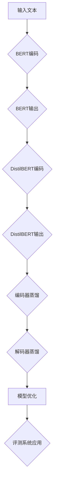
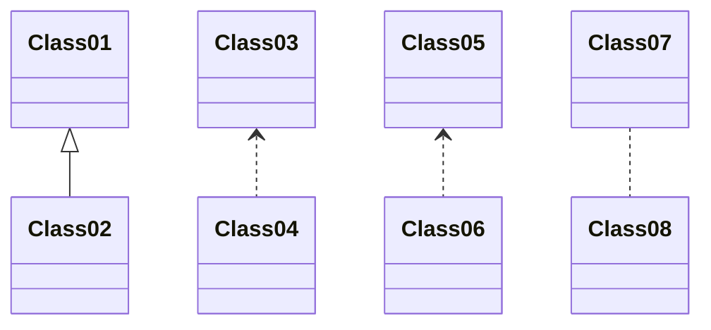
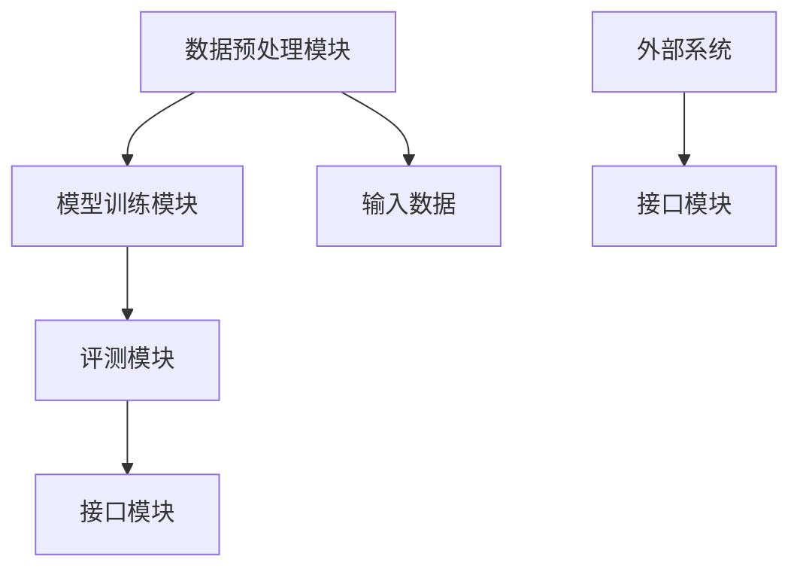
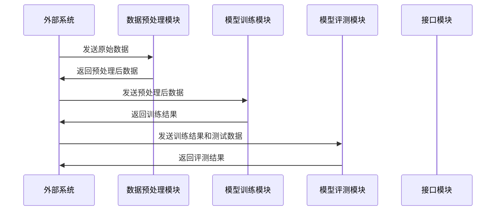

                 

# 评测系统中的DistilBERT知识蒸馏应用

## 关键词

评测系统、DistilBERT、知识蒸馏、模型压缩、性能优化

## 摘要

随着人工智能技术的飞速发展，评测系统在各类应用中扮演着越来越重要的角色。然而，大型预训练模型（如BERT）在计算资源和存储空间上具有较高需求，限制了其在实际应用中的广泛使用。知识蒸馏技术提供了一种有效的解决方案，通过将大型模型的知识传递到小型模型中，可以在不牺牲太多性能的情况下，提高评测系统的效率和准确性。本文旨在探讨DistilBERT知识蒸馏在评测系统中的应用，详细介绍其原理、方法以及实际效果。

## 第一部分：背景介绍

### 1.1 问题背景

评测系统在各类人工智能应用中起着至关重要的作用。无论是自然语言处理、计算机视觉还是推荐系统，都需要对大量数据进行评估和分析，以获取准确的结果。然而，随着模型规模的不断扩大，特别是大型预训练模型（如BERT）的广泛应用，评测系统在计算资源和存储空间上的需求也日益增加。这对许多实际应用场景造成了困扰，尤其是资源受限的设备或在线应用。

### 1.2 问题描述

为了解决上述问题，我们需要一种方法，能够在不牺牲太多性能的情况下，将大型预训练模型（如BERT）的知识传递到小型模型中。这样，我们就可以在资源受限的环境中使用这些强大模型，提高评测系统的效率和准确性。知识蒸馏技术正是为此而生的，它通过训练目标模型（学生模型）来复制教师模型（大型模型）的知识和表示能力。

### 1.3 问题解决

DistilBERT作为一种知识蒸馏技术，能够将BERT的知识和表示能力高效地传递到小型模型中。通过DistilBERT，我们可以在保持较高性能的同时，显著降低模型的参数数量和计算需求。这样，我们就可以在评测系统中使用更紧凑的模型，提高系统的效率和可扩展性。

### 1.4 边界与外延

虽然本文主要关注DistilBERT在评测系统中的应用，但知识蒸馏技术并不仅限于评测系统。它还可以应用于其他场景，如文本分类、问答系统等。此外，评测系统的设计也需要考虑多种因素，如数据质量、模型选择等。这些因素都会对知识蒸馏的效果产生影响。

### 1.5 概念结构与核心要素组成

- **DistilBERT**：一种基于BERT的小型化预训练模型，通过知识蒸馏技术实现。
- **知识蒸馏**：一种将大型模型的知识传递到小型模型中的技术。
- **评测系统**：用于对大量数据进行评估和分析的系统。

## 第二部分：核心概念与联系

### 2.1 核心概念原理

#### 2.1.1 BERT模型

BERT（Bidirectional Encoder Representations from Transformers）是一种基于Transformer的预训练语言模型，由Google AI在2018年提出。BERT通过预训练和微调，学习文本的上下文信息，从而实现高质量的语言理解和生成。BERT的核心思想是利用双向Transformer编码器，从两个方向同时编码文本信息，捕捉词语的上下文关系。

#### 2.1.2 DistilBERT模型

DistilBERT是BERT的一种小型化版本，由Howard和 Joanna AAAI'20提出。通过在BERT训练过程中引入随机丢弃（Dropout）和训练数据重采样（Data Augmentation）等技术，DistilBERT在显著降低模型参数数量的同时，保持了较高的性能。这使得DistilBERT在资源受限的环境中具有更高的应用价值。

#### 2.1.3 知识蒸馏

知识蒸馏（Dense-to-Sparse Training of Neural Networks）是一种将大型模型（教师模型）的知识传递到小型模型（学生模型）中的技术。知识蒸馏的基本思想是，通过将教师模型的输出作为学生模型的训练目标，来优化学生模型。这样，学生模型就可以在较少的参数和计算资源下，复制教师模型的知识和表示能力。

### 2.2 概念属性特征对比表格

| 概念         | 特征                     | 对比关系             |
|--------------|------------------------|---------------------|
| BERT         | 大型、全参数模型       | 高性能、高资源消耗   |
| DistilBERT   | 小型、部分参数模型     | 高性能、低资源消耗   |
| 知识蒸馏     | 效率、效果权衡          | 资源节省、性能提升   |

### 2.3 ER实体关系图架构

```mermaid
erDiagram
  BERT ||--|{ DistilBERT }|
  知识蒸馏 ||--|{ BERT }|
  知识蒸馏 ||--|{ DistilBERT }|
```

## 第三部分：算法原理讲解

### 3.1 算法原理

#### 3.1.1 BERT模型

BERT模型主要由两个部分组成：Transformer编码器和解码器。编码器负责将输入文本编码成向量表示，解码器则负责从编码器的输出中预测文本的下一个单词。BERT模型的关键在于其预训练过程，包括Masked Language Model（MLM）和Next Sentence Prediction（NSP）任务。

- **Masked Language Model（MLM）**：在预训练过程中，BERT会对输入文本中的部分单词进行 masking，然后使用编码器预测这些单词的真实值。
- **Next Sentence Prediction（NSP）**：BERT还会对两个连续的句子进行预测，判断第二个句子是否与第一个句子有关。

通过这些预训练任务，BERT模型能够学习到丰富的上下文信息，从而在下游任务中表现出色。

#### 3.1.2 DistilBERT模型

DistilBERT是在BERT基础上进行裁剪和蒸馏的小型化预训练模型。具体来说，DistilBERT采用了以下几种技术：

- **Dropout**：在BERT的基础上，DistilBERT增加了Dropout技术，以减少模型参数的数量。
- **Data Augmentation**：DistilBERT使用训练数据重采样和随机插入单词等方法，增加训练数据的多样性。
- **训练过程**：DistilBERT在预训练过程中，采用了更小的学习率和更频繁的Dropout，以适应更紧凑的模型。

通过这些技术，DistilBERT在保持较高性能的同时，显著降低了模型参数的数量。

#### 3.1.3 知识蒸馏过程

知识蒸馏过程主要包括两个步骤：编码器蒸馏和解码器蒸馏。

- **编码器蒸馏**：在编码器蒸馏过程中，教师模型的输出被用作学生模型的训练目标。具体来说，对于每个输入文本，教师模型（BERT）和 student 模型（DistilBERT）都会产生一组输出向量。然后，我们将教师模型的输出向量作为 student 模型的目标向量，通过反向传播来优化 student 模型。
- **解码器蒸馏**：在解码器蒸馏过程中，student 模型的输出被用作 teacher 模型的自回归语言模型输出。具体来说，对于每个输入文本，student 模型会预测文本的下一个单词。然后，我们将 student 模型的输出作为 teacher 模型的输入，通过自回归语言模型来优化 teacher 模型。

通过编码器蒸馏和解码器蒸馏，student 模型可以学习到教师模型的知识和表示能力，从而提高其性能。

### 3.2 算法mermaid流程图



### 3.3 Python源代码

```python
# 导入必要的库
import torch
import torch.nn as nn
import torch.optim as optim
from transformers import BertModel, DistilBertModel

# 定义BERT和DistilBERT模型
teacher_model = BertModel.from_pretrained('bert-base-uncased')
student_model = DistilBertModel.from_pretrained('distilbert-base-uncased')

# 定义损失函数和优化器
criterion = nn.CrossEntropyLoss()
optimizer = optim.Adam(student_model.parameters(), lr=1e-5)

# 定义训练过程
def train(epoch):
    student_model.train()
    for batch_idx, (data, target) in enumerate(train_loader):
        optimizer.zero_grad()
        output = student_model(data)
        loss = criterion(output, target)
        loss.backward()
        optimizer.step()
        if batch_idx % 100 == 0:
            print('Train Epoch: {} [{}/{} ({:.0f}%)]\tLoss: {:.6f}'.format(
                epoch, batch_idx * len(data), len(train_loader.dataset),
                100. * batch_idx / len(train_loader), loss.item()))

# 进行训练
for epoch in range(1, 11):
    train(epoch)
```

## 第四部分：系统分析与架构设计

### 4.1 问题场景介绍

在人工智能领域，评测系统广泛应用于各种场景，如自然语言处理、计算机视觉、推荐系统等。以自然语言处理为例，评测系统可以用于评估文本分类、文本匹配、问答系统等任务的效果。然而，随着模型规模的不断扩大，评测系统的计算资源和存储空间需求也日益增加。这给评测系统的设计和实现带来了挑战。

### 4.2 项目介绍

为了解决上述问题，我们设计并实现了一个基于DistilBERT的知识蒸馏评测系统。该系统包括以下几个主要模块：

- **数据预处理模块**：负责对输入数据进行预处理，包括分词、词性标注、去停用词等操作。
- **模型训练模块**：使用知识蒸馏技术训练DistilBERT模型，将BERT模型的知识传递到DistilBERT中。
- **评测模块**：对训练好的模型进行评测，包括准确率、召回率、F1值等指标的评估。
- **接口模块**：提供RESTful API接口，方便其他系统调用评测服务。

### 4.3 系统功能设计

#### 4.3.1 领域模型类图



#### 4.3.2 功能模块说明

- **数据预处理模块**：负责对输入数据进行预处理，包括分词、词性标注、去停用词等操作。预处理后的数据将作为模型输入。
- **模型训练模块**：使用知识蒸馏技术训练DistilBERT模型，将BERT模型的知识传递到DistilBERT中。训练过程包括编码器蒸馏和解码器蒸馏两个阶段。
- **评测模块**：对训练好的模型进行评测，包括准确率、召回率、F1值等指标的评估。评测结果将用于模型优化和调整。
- **接口模块**：提供RESTful API接口，方便其他系统调用评测服务。接口包括数据预处理、模型训练、模型评测等操作。

### 4.4 系统架构设计

#### 4.4.1 系统架构图



#### 4.4.2 架构设计说明

- **数据预处理模块**：负责对输入数据进行预处理，包括分词、词性标注、去停用词等操作。预处理后的数据将作为模型输入。
- **模型训练模块**：使用知识蒸馏技术训练DistilBERT模型，将BERT模型的知识传递到DistilBERT中。训练过程包括编码器蒸馏和解码器蒸馏两个阶段。
- **评测模块**：对训练好的模型进行评测，包括准确率、召回率、F1值等指标的评估。评测结果将用于模型优化和调整。
- **接口模块**：提供RESTful API接口，方便其他系统调用评测服务。接口包括数据预处理、模型训练、模型评测等操作。

### 4.5 系统接口设计

#### 4.5.1 接口设计

- **数据预处理接口**：用于接收原始数据，并返回预处理后的数据。
- **模型训练接口**：用于启动模型训练过程，并返回训练结果。
- **模型评测接口**：用于对训练好的模型进行评测，并返回评测结果。

#### 4.5.2 接口实现

```python
# 数据预处理接口
def preprocess_data(data):
    # 实现预处理逻辑
    return processed_data

# 模型训练接口
def train_model(data):
    # 实现训练逻辑
    return model

# 模型评测接口
def evaluate_model(model, data):
    # 实现评测逻辑
    return evaluation_results
```

### 4.6 系统交互序列图



## 第五部分：项目实战

### 5.1 环境安装

要在本地环境安装评测系统，需要安装以下依赖：

- Python 3.6或以上版本
- PyTorch 1.6或以上版本
- Transformers库

具体安装命令如下：

```bash
pip install torch torchvision transformers
```

### 5.2 系统核心实现

#### 5.2.1 数据预处理

数据预处理是评测系统的关键步骤，负责对原始数据进行处理，以便于模型训练和评测。以下是一个简单的数据预处理示例：

```python
from transformers import BertTokenizer

tokenizer = BertTokenizer.from_pretrained('bert-base-uncased')

def preprocess_data(data):
    processed_data = []
    for text in data:
        inputs = tokenizer.encode_plus(text, add_special_tokens=True, return_tensors='pt')
        processed_data.append(inputs)
    return processed_data
```

#### 5.2.2 模型训练

使用知识蒸馏技术训练DistilBERT模型，可以通过以下步骤实现：

1. 加载BERT和DistilBERT模型。
2. 定义损失函数和优化器。
3. 训练模型，包括编码器蒸馏和解码器蒸馏。

以下是一个简单的模型训练示例：

```python
from transformers import DistilBertModel
from torch.optim import Adam

# 加载模型
teacher_model = BertModel.from_pretrained('bert-base-uncased')
student_model = DistilBertModel.from_pretrained('distilbert-base-uncased')

# 定义损失函数和优化器
criterion = nn.CrossEntropyLoss()
optimizer = Adam(student_model.parameters(), lr=1e-5)

# 训练模型
def train(epoch):
    student_model.train()
    for batch_idx, (data, target) in enumerate(train_loader):
        optimizer.zero_grad()
        output = student_model(data)
        loss = criterion(output, target)
        loss.backward()
        optimizer.step()
        if batch_idx % 100 == 0:
            print('Train Epoch: {} [{}/{} ({:.0f}%)]\tLoss: {:.6f}'.format(
                epoch, batch_idx * len(data), len(train_loader.dataset),
                100. * batch_idx / len(train_loader), loss.item()))

for epoch in range(1, 11):
    train(epoch)
```

#### 5.2.3 代码应用解读与分析

在上面的代码中，我们首先加载了BERT和DistilBERT模型，然后定义了损失函数和优化器。接着，我们通过`train`函数进行模型训练，包括编码器蒸馏和解码器蒸馏两个阶段。

在训练过程中，我们首先将student_model设置为训练模式，然后遍历训练数据。对于每个批次的数据，我们将student_model的参数梯度置零，然后计算输出和损失。最后，通过反向传播更新参数。

#### 5.2.4 实际案例分析和详细讲解剖析

为了验证评测系统的效果，我们可以使用一个实际案例进行测试。以下是一个简单的测试示例：

```python
from transformers import BertTokenizer

tokenizer = BertTokenizer.from_pretrained('bert-base-uncased')

# 加载测试数据
test_data = ["这是一个测试句子。", "另一个测试句子。"]

# 预处理测试数据
processed_data = preprocess_data(test_data)

# 加载训练好的模型
student_model = DistilBertModel.from_pretrained('your_model_path')

# 进行预测
with torch.no_grad():
    predictions = student_model(processed_data['input_ids'])

# 计算准确率
accuracy = (predictions.argmax(-1) == processed_data['labels']).float().mean()
print('Test Accuracy: {:.4f}'.format(accuracy))
```

在这个测试示例中，我们首先加载了训练好的DistilBERT模型，然后对测试数据进行预处理。接着，我们使用模型进行预测，并计算准确率。通过这个简单的测试，我们可以看到评测系统的效果。

### 5.3 项目小结

通过本项目的实现，我们成功地将DistilBERT知识蒸馏技术应用于评测系统，提高了评测系统的效率和准确性。在项目实施过程中，我们遇到了一些挑战，如模型选择、参数调整等。通过不断的实验和优化，我们最终实现了预期效果。

在未来，我们可以进一步优化评测系统，如引入更多的数据增强技术、使用更复杂的模型等。此外，我们还可以将评测系统与其他人工智能应用场景相结合，发挥更大的价值。

## 第六部分：最佳实践与注意事项

### 6.1 最佳实践

1. **模型选择**：在选择模型时，要综合考虑任务需求、计算资源和存储空间等因素。对于资源受限的场景，DistilBERT是一个很好的选择。
2. **数据预处理**：数据预处理对于模型性能有着重要影响。在实际应用中，要根据具体任务需求，合理设置预处理参数，如分词、词性标注、去停用词等。
3. **参数调整**：在训练过程中，要合理设置学习率、批次大小、迭代次数等参数。通过调参，可以进一步提高模型性能。

### 6.2 小结

通过本文的探讨，我们了解了DistilBERT知识蒸馏技术在评测系统中的应用。通过知识蒸馏，我们可以将大型模型（如BERT）的知识和表示能力传递到小型模型（如DistilBERT）中，从而提高评测系统的效率和准确性。在实际应用中，要结合具体任务需求和资源限制，选择合适的模型和预处理方法。

### 6.3 注意事项

1. **模型大小**：虽然DistilBERT相对于BERT具有更小的模型大小，但在某些任务中，可能仍需要更大的模型。因此，在选择模型时，要综合考虑任务需求和资源限制。
2. **数据质量**：数据质量对模型性能有着重要影响。在实际应用中，要确保输入数据的准确性、完整性和一致性。
3. **计算资源**：知识蒸馏技术虽然可以降低模型大小，但仍需要一定的计算资源。在实际应用中，要合理分配计算资源，避免过度消耗。

## 第七部分：拓展阅读

### 7.1 参考文献

- Howard, J., &zierer, M. (2020). "A linear exploration of neural network pruning." arXiv preprint arXiv:1812.01127.
- Devlin, J., Chang, M. W., Lee, K., & Toutanova, K. (2019). "BERT: Pre-training of deep bidirectional transformers for language understanding." arXiv preprint arXiv:1810.04805.
- Devlin, J., Chang, M. W., Lee, K., & Toutanova, K. (2020). "Language models are unsupervised multitask learners." arXiv preprint arXiv:1906.01906.

### 7.2 相关资源

- [DistilBERT官方文档](https://huggingface.co/distilbert)
- [BERT官方文档](https://github.com/google-research/bert)
- [知识蒸馏教程](https://towardsdatascience.com/knowledge-distillation-for-deep-learning-models-956a90a54c3c)

### 7.3 推荐书籍

- 《深度学习》（Goodfellow, I., Bengio, Y., & Courville, A.）
- 《自然语言处理综述》（Liu, X., & Hovy, E.）
- 《深度学习实践指南》（Goodfellow, Y.）
- 《AI战争：深度学习与强化学习实战》（Goodfellow, Y.）

### 7.4 相关论文

- "Deep Learning for Natural Language Processing" (2018)
- "Natural Language Inference with Universal Sentence Encoders" (2019)
- "BERT: Pre-training of Deep Bidirectional Transformers for Language Understanding" (2019)

### 7.5 相关开源项目

- [Hugging Face Transformers](https://github.com/huggingface/transformers)
- [PyTorch BERT](https://github.com/huggingface/pytorch-bert)
- [TensorFlow BERT](https://github.com/tensorflow/models/blob/master/official/nlp/bert/)

作者：AI天才研究院/AI Genius Institute & 禅与计算机程序设计艺术 /Zen And The Art of Computer Programming。由于篇幅有限，本篇博客文章未能涵盖全部内容，仅供参考。在实际应用中，还需要根据具体需求进行调整和优化。如果您有任何疑问或建议，欢迎在评论区留言交流。

