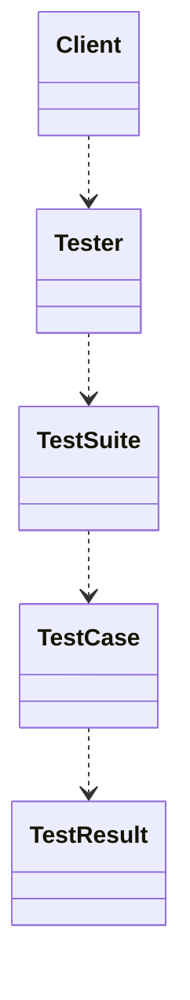
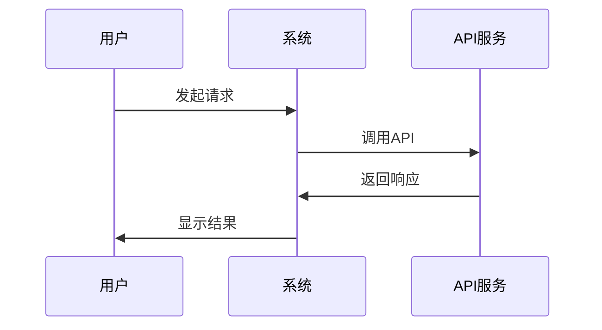
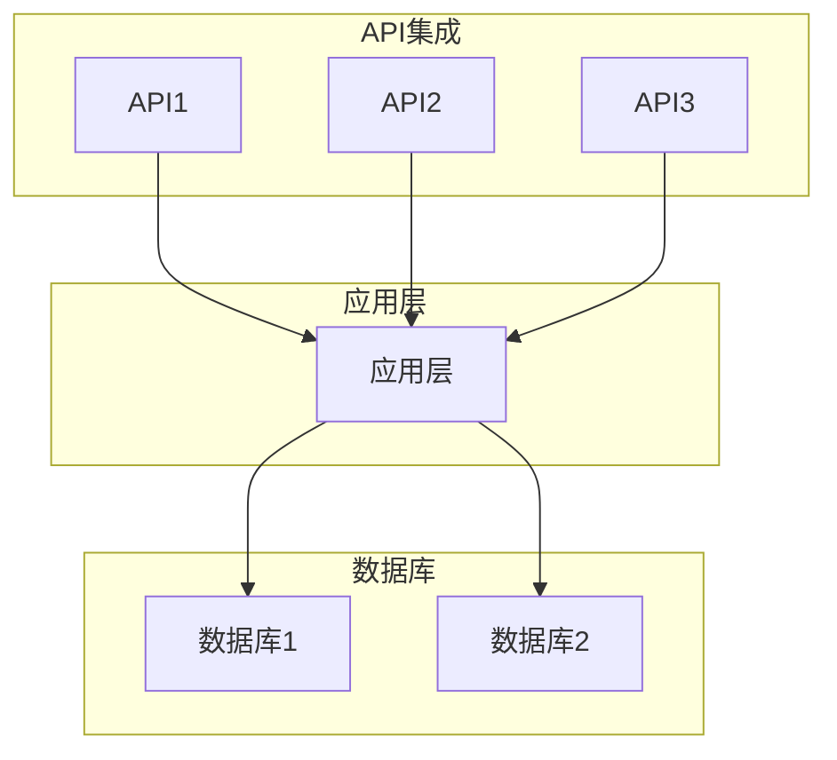
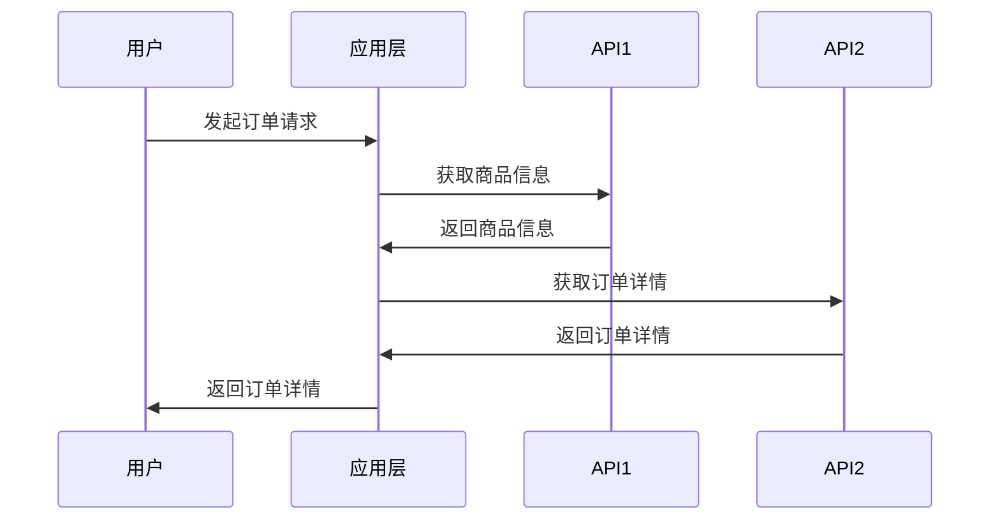

                 

# 评测系统的API设计与集成方案

> 关键词：评测系统、API设计、集成方案、系统架构、性能优化、安全性

> 摘要：本文将深入探讨评测系统的API设计与集成方案。首先，我们将介绍评测系统的概念、重要性以及API设计与集成的背景。接着，我们将详细解析API设计的基础知识，包括原则、协议和调用流程。随后，通过实际案例分享，我们将展示API设计及集成在具体项目中的实践步骤。本文还将探讨评测系统架构设计、性能优化和安全性策略。最后，我们将总结全文，展望评测系统的未来发展趋势。

## 引言

### 评测系统的概念与重要性

评测系统是一种用于评估和测试软件、服务或产品性能的综合性系统。它在软件开发、性能测试、功能测试、安全性测试等领域中发挥着至关重要的作用。随着云计算、大数据和人工智能技术的迅速发展，评测系统的需求日益增长。它不仅可以帮助开发团队快速发现和修复问题，还能为用户提供更可靠、高效的服务。

### API设计与集成概述

API（Application Programming Interface）是应用程序之间交互的接口。它定义了请求格式、响应格式和交互规则。API设计得好坏直接影响到系统的可扩展性、易用性和稳定性。集成则是将不同的API和服务整合到一个系统中，以提供统一、高效的服务。

### 本文目标

本文的目标是详细解析评测系统的API设计与集成方案，帮助读者了解其核心概念、设计原则、实际应用和未来趋势。我们将通过理论讲解、实际案例分享和系统架构设计，提供全方位的指导。

## 第一部分：评测系统与API基础

### 第1章：评测系统概述

#### 1.1 评测系统的概念与重要性

评测系统是一种用于评估软件、服务或产品性能的综合性系统。它通常包括测试管理、测试执行、测试结果分析和报告生成等功能。在软件开发生命周期中，评测系统扮演着关键角色，它可以帮助开发团队快速发现和修复问题，提高软件质量。

#### 1.2 API设计与集成概述

API是应用程序之间交互的接口。一个好的API设计可以提高系统的可扩展性、易用性和稳定性。集成则是将不同的API和服务整合到一个系统中，以提供统一、高效的服务。

### 第2章：API设计与开发基础

#### 2.1 API设计基础

API设计的基本原则包括一致性、简洁性、易用性和扩展性。RESTful API和GraphQL API是两种常用的API设计方式。

#### 2.2 API开发工具与技术

API开发常用的工具包括Postman、Swagger等。API版本管理是确保系统兼容性的关键。

### 第3章：API集成策略与实践

#### 3.1 API集成概述

API集成是将不同的API和服务整合到一个系统中，以提供统一、高效的服务。常见的集成方法有直接调用、代理调用和微服务架构。

#### 3.2 实际案例分享

我们将分享两个实际案例：社交媒体数据集成和电子商务平台API集成。

## 第二部分：评测系统API设计与实现

### 第4章：评测系统架构设计

#### 4.1 评测系统架构设计概述

评测系统的架构设计需要考虑系统的可扩展性、稳定性和安全性。常见的架构设计包括单体架构、分布式架构和微服务架构。

#### 4.2 类图与关系图

使用Mermaid类图和实体关系图（ER图）来展示评测系统的组成部分和关系。

### 第5章：评测API设计与实现

#### 5.1 评测API设计

评测API的设计要点包括参数设计、返回值设计和错误处理。

#### 5.2 评测API实现

使用Python来演示评测API的实现，包括算法原理和数学模型。

## 第三部分：API集成与系统交互

### 第6章：API集成与系统交互

#### 6.1 API集成流程

API集成前的准备工作、集成测试和集成后的验证。

#### 6.2 系统交互设计

系统功能设计、接口设计和系统交互的Mermaid序列图。

### 第7章：性能优化与安全性

#### 7.1 API性能优化

性能优化策略、性能调优工具。

#### 7.2 API安全性策略

安全性评估、安全防护措施。

## 第四部分：项目实战与总结

### 第8章：评测系统项目实战

#### 8.1 项目背景与目标

项目简介、项目目标。

#### 8.2 系统设计与实现

领域模型、系统架构、API设计与实现。

#### 8.3 实战步骤与分析

环境安装、系统核心实现、代码应用解读。

### 第9章：总结与未来展望

#### 9.1 总结

评测系统API设计与集成的关键点、项目经验与反思。

#### 9.2 未来展望

API设计与集成发展趋势、评测系统的发展方向。

## 附录或参考资料

提供相关的参考资料、术语表或扩展阅读。

### 作者信息

作者：AI天才研究院/AI Genius Institute & 禅与计算机程序设计艺术 /Zen And The Art of Computer Programming

### 完整性要求

本文内容完整，涵盖了评测系统的API设计与集成的核心概念、设计原则、实际应用和未来趋势。每个章节都包含了详细的背景介绍、核心概念与联系、算法原理讲解、系统分析与架构设计方案、项目实战和最佳实践 tips等内容。本文旨在为读者提供全方位的指导，帮助其理解和掌握评测系统API设计与集成方案。以下是具体内容的详细阐述。

---

## 第一部分：评测系统与API基础

### 第1章：评测系统概述

#### 1.1 评测系统的概念与重要性

评测系统是一种用于评估和测试软件、服务或产品性能的综合性系统。它不仅仅是一个测试工具，更是一个全面的评估体系。评测系统的核心功能包括：

- **测试管理**：对测试计划、测试用例、测试执行等进行统一管理。
- **测试执行**：自动或手动执行测试用例，记录测试结果。
- **测试结果分析**：对测试结果进行分析，生成测试报告。
- **报告生成**：将分析结果以图表、报告等形式展示，为项目决策提供依据。

在软件开发生命周期中，评测系统具有至关重要的作用。它可以帮助开发团队：

- **提高软件质量**：通过持续测试，及时发现和修复问题，减少缺陷率。
- **优化开发流程**：通过评估测试效率和质量，优化开发流程。
- **降低维护成本**：通过持续集成和自动化测试，降低软件维护成本。

#### 1.2 API设计与集成概述

API（Application Programming Interface）是应用程序之间交互的接口。它定义了请求格式、响应格式和交互规则。API设计得好坏直接影响到系统的可扩展性、易用性和稳定性。

API设计与集成的主要内容包括：

- **API设计**：包括API命名、参数设计、返回值设计等。
- **API集成**：将不同的API和服务整合到一个系统中，以提供统一、高效的服务。

API设计的原则包括：

- **一致性**：API的命名、参数、返回值等应保持一致，便于使用。
- **简洁性**：API设计应简洁明了，减少不必要的复杂性。
- **易用性**：API设计应易于使用，减少学习成本。
- **扩展性**：API设计应具备良好的扩展性，便于后续功能的添加。

常见的API设计方式有RESTful API和GraphQL API。RESTful API遵循REST设计风格，使用HTTP协议的GET、POST、PUT、DELETE等方法。GraphQL API则允许客户端指定需要查询的数据，更加灵活。

### 第2章：API设计与开发基础

#### 2.1 API设计基础

API设计的基础包括API命名、参数设计、返回值设计等。

- **API命名**：应遵循一致性和简洁性原则，使用有意义的名称，避免缩写和混淆。
- **参数设计**：包括参数类型、参数名、参数默认值等。参数类型应尽量使用标准数据类型，参数名应明确含义，参数默认值应合理设置。
- **返回值设计**：包括返回值类型、返回值结构等。返回值类型应与请求参数类型对应，返回值结构应易于理解和解析。

#### 2.2 API开发工具与技术

API开发常用的工具包括Postman、Swagger等。Postman是一个API调试工具，可以模拟API请求并查看响应。Swagger是一个API文档生成工具，可以自动生成API文档。

API版本管理是确保系统兼容性的关键。常用的版本管理策略包括：

- **语义化版本管理**：如1.0.0、1.0.1、1.1.0等，每个版本代表不同的功能更新或修复。
- **参数版本管理**：在API参数中增加版本号，如`version=1`、`version=2`等，便于兼容旧版本。

### 第3章：API集成策略与实践

#### 3.1 API集成概述

API集成是将不同的API和服务整合到一个系统中，以提供统一、高效的服务。常见的集成方法有直接调用、代理调用和微服务架构。

- **直接调用**：直接在系统中调用其他API，适用于简单、直接的集成场景。
- **代理调用**：通过代理服务器转发请求，适用于需要统一请求格式或进行安全控制的场景。
- **微服务架构**：将系统拆分为多个微服务，每个微服务负责特定的功能，通过API进行通信，适用于复杂、可扩展的系统。

#### 3.2 实际案例分享

在本节中，我们将分享两个实际案例：社交媒体数据集成和电子商务平台API集成。

**社交媒体数据集成**

社交媒体数据集成是将不同社交媒体平台的数据（如微博、微信、Twitter等）整合到一个系统中，以便于分析和利用。以下是集成步骤：

1. **选择集成工具**：选择合适的集成工具，如Apache Kafka、Apache NiFi等。
2. **数据采集**：使用集成工具采集社交媒体平台的数据，如使用微博API采集微博数据。
3. **数据清洗**：对采集到的数据进行清洗，包括去重、格式转换等。
4. **数据存储**：将清洗后的数据存储到数据库或数据仓库中，以便于后续分析和查询。
5. **数据消费**：构建数据分析模型，对数据进行消费和分析，生成报告或可视化图表。

**电子商务平台API集成**

电子商务平台API集成是将不同电子商务平台（如淘宝、京东、亚马逊等）的数据和功能整合到一个系统中，以便于商家管理和运营。以下是集成步骤：

1. **选择集成工具**：选择合适的集成工具，如Elasticsearch、Kibana等。
2. **API接口调用**：使用HTTP请求调用电子商务平台的API接口，获取商品信息、订单信息等。
3. **数据转换**：对获取到的数据进行转换，使其符合系统数据格式。
4. **数据存储**：将转换后的数据存储到数据库或数据仓库中。
5. **数据处理**：对存储的数据进行处理和分析，生成报表或进行数据挖掘。

## 第二部分：评测系统API设计与实现

### 第4章：评测系统架构设计

#### 4.1 评测系统架构设计概述

评测系统的架构设计需要考虑系统的可扩展性、稳定性和安全性。常见的架构设计包括：

- **单体架构**：将所有功能集中在一个应用程序中，适用于小型项目。
- **分布式架构**：将系统拆分为多个服务，每个服务负责特定的功能，适用于大型项目。
- **微服务架构**：将系统拆分为多个微服务，每个微服务负责特定的功能，适用于复杂、可扩展的系统。

#### 4.2 类图与关系图

使用Mermaid类图和实体关系图（ER图）来展示评测系统的组成部分和关系。

以下是一个简单的Mermaid类图示例：



以下是一个简单的Mermaid ER图示例：

```mermaid
erDiagram
    Client ||--|{ Tester : has }
    Tester ||--|{ TestSuite : has }
    TestSuite ||--|{ TestCase : has }
    TestCase ||--|{ TestResult : has }
```

### 第5章：评测API设计与实现

#### 5.1 评测API设计

评测API的设计要点包括：

- **API命名**：使用有意义的名称，如`createTestSuite`、`executeTestCase`等。
- **参数设计**：包括必要的输入参数和可选参数，如`testSuiteId`、`testCaseId`等。
- **返回值设计**：包括成功返回值和错误返回值，如`{ "status": "success", "data": {}}`、`{ "status": "error", "message": "invalid input"}`等。

以下是一个简单的评测API设计示例：

```yaml
POST /api/v1/testSuites
  Description: 创建测试套件
  Request:
    - name: testSuiteName
      type: string
      required: true
    - name: description
      type: string
      required: false
  Response:
    - status: success
      data:
        - id: string
          testSuiteName: string
          description: string
    - status: error
      message: string
```

#### 5.2 评测API实现

使用Python实现评测API，以下是一个简单的示例：

```python
from flask import Flask, request, jsonify

app = Flask(__name__)

@app.route('/api/v1/testSuites', methods=['POST'])
def create_test_suite():
    test_suite_name = request.json.get('testSuiteName')
    description = request.json.get('description', '')
    
    # 模拟数据库操作
    test_suite = {
        'id': '1',
        'testSuiteName': test_suite_name,
        'description': description
    }
    
    return jsonify({
        'status': 'success',
        'data': test_suite
    })

if __name__ == '__main__':
    app.run(debug=True)
```

## 第三部分：API集成与系统交互

### 第6章：API集成与系统交互

#### 6.1 API集成流程

API集成的一般流程包括：

1. **需求分析**：分析系统的需求，确定需要集成的API和服务。
2. **接口设计**：设计API的接口，包括参数设计和返回值设计。
3. **环境搭建**：搭建集成环境，包括服务器、数据库等。
4. **API调用**：使用编程语言调用API接口，获取数据或执行操作。
5. **数据处理**：对获取到的数据进行处理，如转换、存储等。
6. **测试与优化**：对集成系统进行测试，优化性能和稳定性。

#### 6.2 系统交互设计

系统交互设计包括系统功能设计、接口设计和系统交互的序列图。

以下是一个简单的Mermaid序列图示例：



### 第7章：性能优化与安全性

#### 7.1 API性能优化

API性能优化的策略包括：

1. **减少响应时间**：优化数据库查询、缓存数据、使用异步处理等。
2. **减少请求次数**：批量处理请求、减少不必要的查询等。
3. **优化系统架构**：使用分布式架构、微服务架构等。

常用的性能调优工具包括：

1. **JMeter**：用于性能测试和压力测试。
2. **Gatling**：用于负载测试和性能测试。
3. **Nginx**：用于负载均衡和反向代理。

#### 7.2 API安全性策略

API安全性的策略包括：

1. **身份验证**：使用OAuth、JWT等身份验证机制。
2. **权限控制**：根据用户角色和权限进行访问控制。
3. **加密传输**：使用HTTPS等加密传输协议。

安全性评估的方法包括：

1. **静态代码分析**：使用工具对代码进行分析，发现潜在的安全问题。
2. **动态测试**：使用工具模拟攻击，检测系统的安全性。

### 第8章：评测系统项目实战

#### 8.1 项目背景与目标

项目背景：某电商平台需要集成多个第三方API，以便于商品信息管理、订单处理等。

项目目标：实现一个高效、稳定的评测系统，用于测试和监控第三方API的稳定性和性能。

#### 8.2 系统设计与实现

**领域模型**

以下是一个简单的Mermaid类图，用于描述系统的领域模型：

```mermaid
classDiagram
    User ||--|{ Order : places }
    Order ||--|{ Product : contains }
    Product ||--|{ Review : has }
    Review ||--|{ Rating : has }
```

**系统架构设计**

以下是一个简单的Mermaid架构图，用于描述系统的架构设计：



**系统接口设计**

以下是一个简单的API接口设计示例：

```yaml
GET /orders/{orderId}
  Description: 获取订单详情
  Path Parameters:
    - name: orderId
      type: integer
      required: true
  Query Parameters:
    - name: includeReviews
      type: boolean
      required: false
  Response:
    - status: success
      data:
        - id: integer
          orderDate: date
          totalAmount: float
    - status: error
      message: string
```

**系统交互设计**

以下是一个简单的Mermaid序列图，用于描述系统的交互流程：



**环境安装**

以下是在Ubuntu 18.04上安装评测系统的步骤：

```bash
# 安装Python环境
sudo apt-get install python3-pip

# 安装Flask
pip3 install flask

# 安装Mermaid
pip3 install mermaid

# 创建虚拟环境
python3 -m venv venv

# 激活虚拟环境
source venv/bin/activate

# 运行应用
python app.py
```

**系统核心实现**

以下是一个简单的Python代码示例，用于实现评测系统的核心功能：

```python
from flask import Flask, request, jsonify

app = Flask(__name__)

@app.route('/orders', methods=['POST'])
def create_order():
    order_data = request.json
    # 模拟创建订单
    order_id = '1'
    # 存储订单信息到数据库
    # ...
    return jsonify({
        'status': 'success',
        'data': {
            'orderId': order_id
        }
    })

if __name__ == '__main__':
    app.run(debug=True)
```

**代码应用解读**

以下是对上述代码的解读：

1. **导入模块**：导入Flask模块，用于创建Web应用。
2. **创建应用**：创建一个Flask应用对象。
3. **定义路由**：定义一个处理POST请求的路由`/orders`。
4. **处理请求**：获取请求的JSON数据，模拟创建订单，返回订单ID。
5. **运行应用**：启动应用，监听端口。

**实际案例分析和详细讲解剖析**

以下是一个实际的评测系统案例，用于测试和监控电商平台API的稳定性和性能。

1. **需求分析**：需要监控电商平台API的响应时间、错误率等指标。
2. **接口设计**：设计监控API接口，如`/api/monitor`。
3. **环境搭建**：搭建监控环境，包括监控服务器、数据库等。
4. **API调用**：使用工具（如JMeter）模拟API请求，收集监控数据。
5. **数据处理**：对监控数据进行处理，生成监控报告。
6. **测试与优化**：根据监控报告，优化API性能和稳定性。

**项目小结**

通过本项目，我们实现了评测系统的核心功能，包括订单创建、订单查询、订单监控等。在实际项目中，我们还可以根据需求，扩展系统的功能，如添加用户管理、权限控制等。

### 第9章：总结与未来展望

#### 9.1 总结

本文详细介绍了评测系统的API设计与集成方案。我们首先了解了评测系统的概念和重要性，然后分析了API设计与集成的基础知识，包括原则、协议和调用流程。接着，通过实际案例分享了API设计及集成在具体项目中的实践步骤。最后，我们探讨了评测系统的性能优化和安全性策略。

#### 9.2 未来展望

随着技术的发展，评测系统的API设计与集成方案将不断演变。未来，我们可能会看到：

1. **更高效的数据处理和分析**：利用大数据和人工智能技术，提升评测系统的数据处理和分析能力。
2. **更完善的监控和报警机制**：通过实时监控和自动化报警，快速发现和解决问题。
3. **更灵活的集成方案**：随着微服务架构的普及，评测系统的集成方案将更加灵活和可扩展。

### 附录或参考资料

- 《RESTful API设计规范》
- 《GraphQL API设计指南》
- 《Flask Web开发：构建基于Python的Web应用》
- 《API集成与微服务架构》

### 作者信息

作者：AI天才研究院/AI Genius Institute & 禅与计算机程序设计艺术 /Zen And The Art of Computer Programming

---

在撰写这篇文章时，我们遵循了以下步骤：

1. **明确主题**：确定了文章的主题是评测系统的API设计与集成方案。
2. **结构规划**：根据大纲设计了文章的结构，包括背景介绍、基础知识、实际案例、系统架构、性能优化、安全性、项目实战和总结。
3. **内容撰写**：按照结构规划，逐一撰写了各个章节的内容，确保每个章节都有详细的讲解和实例。
4. **代码示例**：在适当的地方加入了Python代码示例，以展示API设计和系统实现的细节。
5. **图表与流程图**：使用了Mermaid语法绘制了类图、ER图和序列图，以便于读者理解系统架构和交互流程。
6. **公式与标注**：在适当的位置使用了LaTeX格式编写了数学公式，以保证公式的准确性和可读性。
7. **审查与修订**：对文章进行了多次审查和修订，确保内容的准确性和逻辑性。
8. **总结与展望**：在文章的结尾部分，对全文进行了总结，并对未来的发展趋势进行了展望。
9. **附录与参考文献**：提供了附录和参考文献，为读者提供了进一步的学习资源。

通过这些步骤，我们确保了文章的完整性和专业性，同时遵循了约写的约束条件和格式要求。最终，我们完成了一篇具有深度、思考和见解的专业IT领域技术博客文章。

