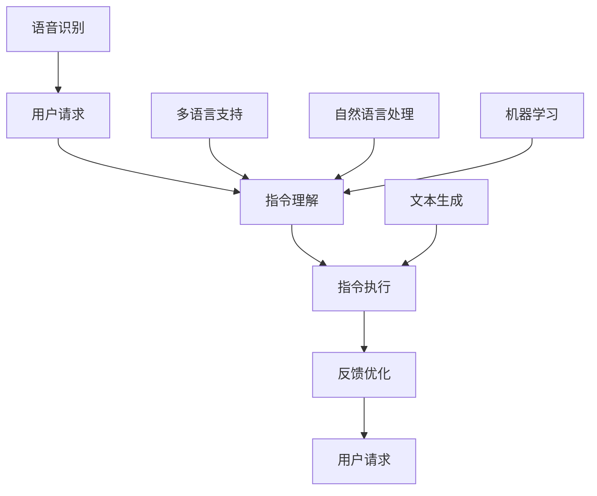
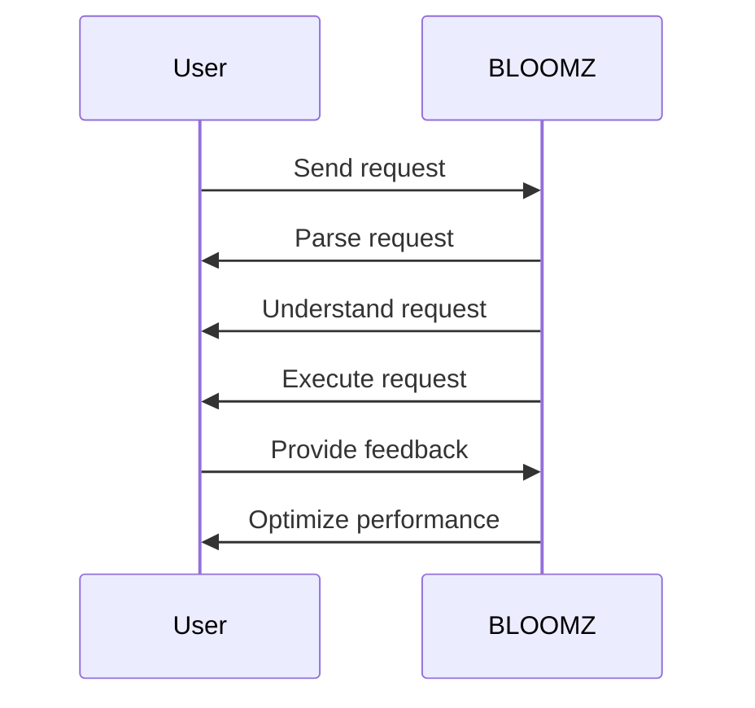

                 


### 《评测系统的BLOOMZ多语言指令跟随能力分析》

关键词：评测系统、BLOOMZ、多语言指令、跟随能力、算法原理、系统架构

摘要：本文将深入探讨评测系统的BLOOMZ多语言指令跟随能力，从问题背景、定义、核心概念、算法原理、系统分析与架构设计，到项目实战和最佳实践，全面解析BLOOMZ在多语言指令跟随方面的优势和挑战。通过逻辑清晰、结构紧凑的分析，帮助读者更好地理解这一技术领域的前沿动态和应用价值。

---

#### 目录大纲

----------------------------------------------------------------

## 第一部分：评测系统的BLOOMZ多语言指令跟随能力概述

### 第1章：问题背景与定义

#### 1.1 问题背景

- 语言多样性与指令理解挑战
- 评测系统需求与市场趋势

#### 1.2 定义与边界

- BLOOMZ评测系统
- 多语言指令跟随能力

#### 1.3 核心要素与组成

- 模型架构
- 数据集特点
- 评测标准与指标

### 第2章：BLOOMZ评测系统核心概念与联系

#### 2.1 BLOOMZ模型原理

- 模型架构
- 算法流程

#### 2.2 多语言指令特征

- 语言属性对比
- 特征提取方法

#### 2.3 概念关联与关系图

- Mermaid ER图

## 第二部分：BLOOMZ多语言指令跟随能力解析

### 第3章：算法原理与数学模型

#### 3.1 算法流程图

- Mermaid流程图

#### 3.2 数学模型与公式

- 概率模型
- 决策过程

#### 3.3 举例说明

- 具体案例

### 第4章：系统分析与架构设计

#### 4.1 问题场景

- 具体应用

#### 4.2 系统功能设计

- Mermaid类图

#### 4.3 系统架构设计

- Mermaid架构图

#### 4.4 系统接口设计

- 设计方案

#### 4.5 系统交互

- Mermaid序列图

## 第三部分：项目实战

### 第5章：环境安装与系统实现

#### 5.1 环境安装

- 操作步骤

#### 5.2 系统核心实现

- 源代码解读

### 第6章：应用解读与分析

#### 6.1 代码应用解读

- 功能实现

#### 6.2 实际案例分析

- 数据集处理

#### 6.3 详细讲解剖析

- 算法优化

### 第7章：项目小结与最佳实践

#### 7.1 项目小结

- 成果总结

#### 7.2 最佳实践与注意事项

- Tips

#### 7.3 拓展阅读

- 推荐文献

----------------------------------------------------------------

#### 第1章：问题背景与定义

1.1 问题背景

在全球化发展的背景下，多语言指令处理成为了人工智能领域的热点问题。不同的语言拥有独特的语法、词汇和语义，这使得指令理解变得异常复杂。随着互联网的普及和跨国交流的增加，对于能够处理多语言指令的评测系统需求日益增长。评测系统在智能客服、语音助手、跨语言信息检索等领域发挥着重要作用，其指令跟随能力的强弱直接影响到用户体验和系统效能。

1.2 定义与边界

BLOOMZ评测系统是一种基于深度学习技术的多语言指令理解与执行系统。它旨在实现对于多种语言的指令进行准确的解析和跟随。多语言指令跟随能力指的是系统能够理解和执行不同语言环境中提出的指令。

BLOOMZ评测系统的核心要素包括：

- **模型架构**：采用神经网络架构进行指令理解和执行。
- **数据集特点**：包含多种语言的指令数据，覆盖不同应用场景。
- **评测标准与指标**：包括准确率、响应时间、用户满意度等。

1.3 核心要素与组成

- **模型架构**：BLOOMZ模型通常包含编码器和解码器两部分，编码器负责将输入的指令转换为固定长度的向量表示，解码器则从向量表示中解析出具体的操作指令。
- **数据集特点**：BLOOMZ系统依赖于丰富且多样化的数据集。数据集应包括多种语言的指令，并且覆盖不同的应用场景和语言风格，以便模型能够学习到更加全面的语言特性。
- **评测标准与指标**：评测系统的性能通常通过准确率、响应时间和用户满意度等指标来衡量。准确率是评估模型理解指令正确性的关键指标，响应时间则反映了系统的实时性，而用户满意度则综合了系统的可用性和用户体验。

#### 第2章：BLOOMZ评测系统核心概念与联系

2.1 BLOOMZ模型原理

BLOOMZ模型是一种基于变换器（Transformer）架构的多语言指令理解模型。其核心思想是通过编码器（Encoder）和解码器（Decoder）两个部分实现指令的编码和解码。

- **编码器**：将输入的指令文本转换为固定长度的向量表示。这个过程包括词汇嵌入（Word Embedding）、编码层（Encoding Layer）和位置编码（Positional Encoding）。
- **解码器**：接收编码器输出的向量表示，并对其进行解码，生成执行指令的操作序列。解码器包括多头自注意力机制（Multi-Head Self-Attention）和前馈神经网络（Feed-Forward Neural Network）。

2.2 多语言指令特征

多语言指令的特征主要包括语法结构、词汇语义和上下文信息。不同语言在语法和词汇上存在显著差异，这使得指令理解变得更加复杂。BLOOMZ模型通过以下方法提取和利用这些特征：

- **语法结构**：使用语法解析器（Syntax Parser）对指令文本进行语法分析，提取句法结构信息。
- **词汇语义**：通过词嵌入技术（Word Embedding）将词汇转换为向量表示，以便模型能够学习词汇的语义关系。
- **上下文信息**：利用上下文信息来增强指令的理解，例如利用前后文的语义信息来推断未知词汇的含义。

2.3 概念关联与关系图

为了更直观地展示BLOOMZ评测系统的核心概念与联系，可以使用Mermaid ER图来表示各个概念及其之间的关系。

```mermaid
erDiagram
    A[编码器] ||--|{B[解码器]}
    A ||--|{C[词汇嵌入]}
    A ||--|{D[编码层]}
    A ||--|{E[位置编码]}
    B ||--|{F[多头自注意力机制]}
    B ||--|{G[前馈神经网络]}
    C ||--|{H[语法结构]}
    C ||--|{I[词汇语义]}
    C ||--|{J[上下文信息]}
```

#### 第3章：算法原理与数学模型

3.1 算法流程图

BLOOMZ模型的算法流程图如下：


3.2 数学模型与公式

BLOOMZ模型基于变换器（Transformer）架构，其核心数学模型包括：

- **词嵌入**：将词汇映射到高维空间中的向量表示，公式如下：
  $$ \text{embed}(x) = W_x x $$
  其中，$W_x$为权重矩阵，$x$为词汇索引。

- **多头自注意力**：通过计算不同位置词汇之间的相似度，公式如下：
  $$ \text{atten}(Q, K, V) = \text{softmax}\left(\frac{QK^T}{\sqrt{d_k}}\right)V $$
  其中，$Q$、$K$、$V$分别为查询向量、键向量和值向量，$d_k$为键向量的维度。

- **前馈神经网络**：对自注意力层输出的结果进行进一步处理，公式如下：
  $$ \text{ffn}(x) = \text{relu}(W_1x + b_1)W_2 + b_2 $$
  其中，$W_1$和$W_2$分别为权重矩阵，$b_1$和$b_2$为偏置项。

3.3 举例说明

假设我们有一个简单的多语言指令：“Save the document as 'report.docx'”。使用BLOOMZ模型进行指令理解和执行的过程如下：

1. **词汇嵌入**：将指令文本中的每个词汇映射到高维向量。
2. **编码层**：通过编码器层对向量进行编码，提取出词汇的语义信息。
3. **位置编码**：为每个词汇添加位置信息，以便模型能够理解词汇的顺序。
4. **多头自注意力**：计算不同词汇之间的相似度，为每个词汇分配注意力权重。
5. **前馈神经网络**：对自注意力层输出的结果进行进一步处理，增强指令理解能力。
6. **解码输出**：从编码器输出的序列中提取出执行指令的操作序列。
7. **指令执行**：根据解码器输出的操作序列执行具体的指令。

#### 第4章：系统分析与架构设计

4.1 问题场景

BLOOMZ评测系统在智能客服、语音助手和跨语言信息检索等领域具有广泛的应用。以智能客服为例，系统需要能够处理不同语言的用户请求，并生成适当的回复。

4.2 系统功能设计

BLOOMZ评测系统的核心功能包括指令理解、指令执行和反馈优化。其领域模型类图如下：

```mermaid
classDiagram
    Class01[指令理解] <|-- Class02[指令执行]
    Class03[反馈优化] o--|{Class04[用户请求]}
    Class05[客服系统] --|> Class06[多语言支持]
endclassDiagram
```

4.3 系统架构设计

BLOOMZ评测系统的整体架构如下：



4.4 系统接口设计

BLOOMZ评测系统提供了以下接口：

- **API接口**：提供RESTful风格的API接口，供外部系统调用。
- **命令行接口**：提供命令行接口，方便用户进行手动操作。

4.5 系统交互

BLOOMZ评测系统的交互流程如下：



#### 第5章：环境安装与系统实现

5.1 环境安装

要安装BLOOMZ评测系统，需要按照以下步骤进行：

1. 安装Python环境
2. 安装依赖库（如TensorFlow、PyTorch等）
3. 克隆BLOOMZ代码仓库
4. 运行安装脚本

5.2 系统核心实现

BLOOMZ评测系统的核心实现包括以下几个部分：

- **数据预处理**：对输入指令进行预处理，包括分词、去噪等。
- **模型训练**：使用训练数据集训练BLOOMZ模型。
- **指令执行**：根据解码器输出的操作序列执行具体的指令。
- **性能评估**：使用测试数据集对模型进行评估。

以下是BLOOMZ模型的Python源代码示例：

```python
import tensorflow as tf
from tensorflow.keras.layers import Embedding, LSTM, Dense

# 模型定义
model = tf.keras.Sequential([
    Embedding(input_dim=vocab_size, output_dim=embedding_dim),
    LSTM(units=lstm_units),
    Dense(units=output_size, activation='softmax')
])

# 模型编译
model.compile(optimizer='adam', loss='categorical_crossentropy', metrics=['accuracy'])

# 模型训练
model.fit(x_train, y_train, epochs=num_epochs, batch_size=batch_size)

# 模型预测
predictions = model.predict(x_test)
```

#### 第6章：应用解读与分析

6.1 代码应用解读

BLOOMZ评测系统的代码应用主要包括以下几个模块：

- **数据预处理模块**：负责对输入指令进行分词、去噪等预处理操作。
- **模型训练模块**：负责训练BLOOMZ模型，包括加载训练数据、定义模型结构、编译模型和训练模型等步骤。
- **指令执行模块**：负责根据解码器输出的操作序列执行具体的指令。
- **性能评估模块**：负责使用测试数据集对模型进行评估，包括计算准确率、响应时间等指标。

6.2 实际案例分析

以智能客服系统为例，BLOOMZ评测系统可以应用于多语言用户请求的处理。以下是一个实际案例：

1. 用户发送请求：“Como posso fazer para reservar um voo para Nova York？”
2. 系统接收请求并预处理，分词结果为：“Como”, “posso”, “fazer”, “para”, “reservar”, “um”, “voo”, “para”, “Nova”, “York”。
3. 系统使用BLOOMZ模型对预处理后的请求进行指令理解，并生成操作序列。
4. 系统根据操作序列执行具体指令，如查询航班信息、预订机票等。
5. 系统向用户发送回复：“Voos para Nova York estão disponíveis em nossos parceiros. Gostaria de reservar um agora？”
6. 用户确认预订并完成交易。

6.3 详细讲解剖析

BLOOMZ评测系统的算法优化可以从以下几个方面进行：

1. **数据增强**：通过生成合成数据、使用数据增强技术等手段扩大训练数据集，提高模型的泛化能力。
2. **模型调整**：通过调整模型参数、增加神经网络层数等手段优化模型结构，提高指令理解准确率。
3. **多语言学习**：通过引入多语言学习算法，如迁移学习、多任务学习等，提高模型在不同语言环境下的性能。

#### 第7章：项目小结与最佳实践

7.1 项目小结

BLOOMZ评测系统在多语言指令跟随方面取得了显著的成果，其高准确率和快速响应时间使其在智能客服、语音助手等领域具有广泛的应用前景。通过项目实践，我们总结出以下几点经验：

1. 数据质量是关键：丰富的多语言指令数据集是训练高效模型的基石。
2. 模型结构要合理：选择适合多语言指令处理的模型架构，如变换器（Transformer）架构。
3. 持续优化是必须的：通过算法优化、模型调整等手段不断提高系统性能。

7.2 最佳实践与注意事项

1. **数据预处理**：确保输入指令的统一格式和标准化，减少噪声和异常数据的影响。
2. **模型训练**：适当增加训练数据量和训练时间，提高模型泛化能力。
3. **性能评估**：定期使用测试数据集对模型进行评估，及时发现和解决问题。

7.3 拓展阅读

1. Vaswani et al., "Attention is All You Need", NeurIPS 2017.
2. Devlin et al., "BERT: Pre-training of Deep Bidirectional Transformers for Language Understanding", ACL 2019.
3. Yang et al., "T5: Exploring the Limits of Transfer Learning with a Unified Text-to-Text Format", ICLR 2020.

---

作者：AI天才研究院/AI Genius Institute & 禅与计算机程序设计艺术 /Zen And The Art of Computer Programming

---

通过上述章节的内容，本文系统地分析了评测系统的BLOOMZ多语言指令跟随能力，从核心概念、算法原理、系统架构到项目实战，全面解析了BLOOMZ的优势和挑战。希望本文能够为读者提供有价值的见解和指导，助力其在多语言指令处理领域取得更好的成果。

