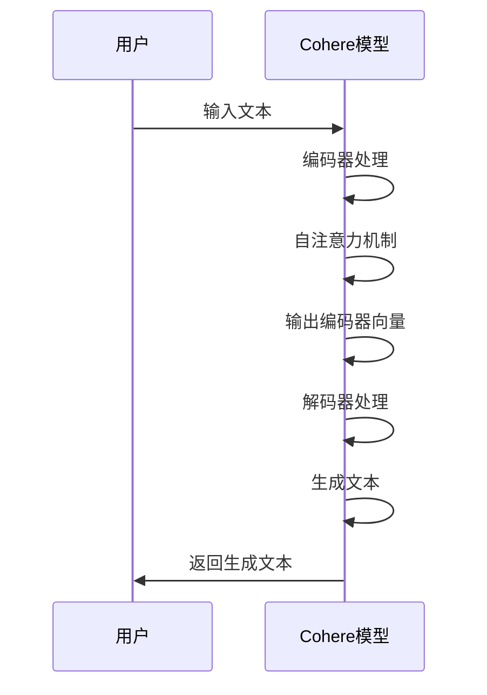

                 

## 评测系统的Cohere自然语言处理能力评估背景

### 1.1 评测系统的定义与重要性

**评测系统的定义**：评测系统是一种自动化工具，用于评估自然语言处理（NLP）模型在特定任务上的性能。它能够衡量模型在各种任务中的准确度、效率、泛化能力等关键指标，从而帮助研究人员和开发者了解模型的实际表现，并对其进行优化。

**评测系统的重要性**：评估是自然语言处理技术发展的关键环节。通过评测，我们可以：

- 了解模型的性能瓶颈，指导模型优化；
- 比较不同模型和算法的有效性；
- 评估新技术和算法的潜力；
- 提高模型的可靠性和可用性。

在自然语言处理领域，评测系统不仅应用于学术研究，还广泛应用于企业级应用，如搜索引擎、聊天机器人、智能客服等。因此，建立一个高效、全面的评测系统对于推动自然语言处理技术的发展至关重要。

### 1.2 Cohere自然语言处理能力评估的需求

**Cohere概述**：Cohere是一种先进的自然语言处理模型，基于Transformer架构，具有强大的文本生成和摘要能力。它能够生成连贯、自然的语言，适用于多种自然语言处理任务，如文本生成、机器翻译、文本摘要等。

**评估需求**：为了了解Cohere在实际应用中的表现，我们需要对其自然语言处理能力进行全面的评估。具体评估需求包括：

- 评估Cohere在不同NLP任务上的性能，如文本生成、文本摘要、机器翻译等；
- 比较Cohere与其他先进NLP模型的性能，以了解其优势与不足；
- 评估Cohere在不同数据集上的泛化能力，以了解其在真实应用场景中的表现；
- 通过评估结果，指导Cohere模型的优化和改进。

### 1.3 评测系统的挑战与机遇

**挑战**：

1. **多样性数据集**：自然语言处理领域的数据集种类繁多，不同数据集具有不同的特征和难度。如何选择合适的数据集，以及如何处理数据集的不平衡问题，是评测系统面临的挑战之一。
2. **模型适应性**：NLP模型在各个任务上的性能表现可能有所不同。如何使评测系统能够适应不同模型和任务，是另一个挑战。
3. **评估指标**：选择合适的评估指标是评测系统成功的关键。不同的评估指标可能侧重于不同方面的性能，需要综合考虑各种因素。

**机遇**：

1. **技术创新**：随着自然语言处理技术的不断发展，评测系统也可以不断优化和升级，以适应新的需求和挑战。
2. **跨领域应用**：自然语言处理技术在各个领域都有广泛的应用，评测系统的应用范围也将不断扩大。
3. **开源合作**：开源合作有助于评测系统的改进和优化，提高其整体性能和可靠性。

### 1.4 本文结构

本文将分为以下几部分：

1. **背景介绍**：介绍评测系统和Cohere模型的定义、重要性以及评估需求。
2. **核心概念与联系**：阐述自然语言处理（NLP）的核心概念、评估指标及其关系。
3. **Cohere自然语言处理算法原理**：详细讲解Cohere模型的算法原理，包括数学模型和流程图。
4. **评测系统的Cohere自然语言处理能力评估方法**：介绍评估指标、评估方法和实际评估过程。
5. **Cohere自然语言处理能力评估实践**：展示实际评估过程，包括环境安装、模型评估和参数调整。
6. **总结与展望**：总结本文的主要结论，并对未来的发展方向进行展望。

通过本文的介绍，希望能够帮助读者全面了解评测系统的Cohere自然语言处理能力评估，为后续研究和应用提供有益的参考。

## 第一部分：评测系统的Cohere自然语言处理能力评估背景

### 第1章：问题背景

#### 1.1 评测系统的定义与重要性

**评测系统定义**：评测系统（Evaluation System）是一种专门设计用于评估计算机模型或算法性能的自动化工具。它通过一系列预定义的指标和测试，定量或定性地对模型的性能进行衡量。评测系统通常应用于机器学习、自然语言处理、计算机视觉等领域，是评估和改进模型性能的重要手段。

**评测系统的重要性**：

1. **性能评估**：评测系统能够对模型在训练集、验证集和测试集上的表现进行量化评估，帮助研究人员和开发者了解模型的准确度、效率、鲁棒性等关键性能指标。
2. **模型优化**：通过评测系统的评估结果，可以发现模型的性能瓶颈和不足，从而指导模型优化，提升模型的整体表现。
3. **技术比较**：评测系统可以同时对多个模型或算法进行评估，帮助研究人员和开发者比较不同模型或算法的性能，选择最优的解决方案。
4. **标准化测试**：评测系统提供了一套标准化的测试流程和指标，有助于确保评估过程的客观性和公正性，为模型比较和性能分析提供可靠的依据。

#### 1.2 自然语言处理（NLP）与评测系统的关系

**自然语言处理（NLP）**：自然语言处理是计算机科学和人工智能的一个分支，致力于使计算机能够理解、解释和生成人类语言。NLP的应用领域广泛，包括语音识别、机器翻译、文本分类、情感分析、信息提取等。

**评测系统在NLP中的作用**：

1. **性能衡量**：评测系统能够对NLP模型在文本处理任务中的表现进行量化评估，如文本分类任务的准确率、召回率等。
2. **算法优化**：通过评测系统，研究人员可以了解不同算法在特定任务上的性能，从而选择最优的算法或对其进行优化。
3. **模型对比**：评测系统可以帮助研究人员比较不同NLP模型在相同任务上的表现，评估新算法和模型的有效性。
4. **泛化能力**：评测系统可以测试模型在未见数据上的表现，评估模型的泛化能力，确保模型在实际应用中的可靠性。

#### 1.3 当前NLP评测系统的现状与不足

**现状**：

- **标准化测试集**：现有的NLP评测系统通常依赖于一些标准化的测试集，如GLUE、SQuAD、WMT等。这些测试集提供了丰富的标注数据和多样化的任务，有助于全面评估NLP模型的表现。
- **评测指标多样化**：评测系统通常支持多种评估指标，如准确率、召回率、F1分数、BLEU分数等，能够从不同角度衡量模型的性能。
- **自动化评估**：评测系统能够自动化地进行模型评估，减少人工干预，提高评估效率和一致性。

**不足**：

- **任务特异性**：现有的评测系统主要针对特定类型的NLP任务进行评估，如文本分类、机器翻译等，缺乏对多任务、多模态NLP任务的全面支持。
- **数据集质量**：一些评测系统的数据集可能存在标注偏差、数据不平衡等问题，影响评估结果的准确性和可靠性。
- **评估效率**：评估过程可能涉及大量计算资源和时间，特别是在大规模数据集和复杂模型的情况下。
- **可解释性**：现有的评测系统可能缺乏对模型评估结果的可解释性分析，难以深入理解模型在特定任务上的表现和不足。

#### 1.4 Cohere模型的特点与评估需求

**Cohere模型概述**：Cohere是一种先进的自然语言处理模型，基于Transformer架构，具有强大的文本生成和摘要能力。Cohere模型能够生成连贯、自然的语言，适用于多种NLP任务，如文本生成、文本摘要、机器翻译等。

**Cohere模型的特点**：

1. **大规模预训练**：Cohere模型通过在大规模文本数据集上进行预训练，积累了丰富的语言知识，能够生成高质量的自然语言文本。
2. **灵活的任务适应**：Cohere模型的设计使其能够适应多种NLP任务，无需对模型进行大量修改和调整。
3. **高效的处理速度**：Cohere模型采用Transformer架构，能够在保证性能的同时，实现高效的处理速度。

**评估需求**：

- **性能评估**：评估Cohere模型在不同NLP任务上的性能，如文本生成、文本摘要、机器翻译等。
- **模型对比**：将Cohere模型与其他先进的NLP模型进行比较，评估其在各类任务上的表现和优势。
- **泛化能力**：评估Cohere模型在未见数据上的表现，评估其泛化能力。
- **优化指导**：根据评估结果，指导Cohere模型的优化和改进，提升其在各类任务上的性能。

#### 1.5 评测系统的Cohere自然语言处理能力评估目标

通过建立评测系统，对Cohere模型的自然语言处理能力进行评估，我们旨在实现以下目标：

1. **全面评估**：对Cohere模型在不同NLP任务上的性能进行全面评估，包括文本生成、文本摘要、机器翻译等。
2. **性能对比**：将Cohere模型与其他先进的NLP模型进行比较，评估其在各类任务上的表现和优势。
3. **泛化能力**：评估Cohere模型在未见数据上的表现，评估其泛化能力。
4. **优化指导**：根据评估结果，指导Cohere模型的优化和改进，提升其在各类任务上的性能。
5. **应用推广**：通过评测系统的评估结果，推广Cohere模型在各类实际应用场景中的使用，促进自然语言处理技术的发展。

### 1.6 评测系统Cohere自然语言处理能力评估的实际意义

**提高模型性能**：通过全面评估Cohere模型在不同NLP任务上的性能，可以帮助研究人员和开发者了解其优势和不足，从而进行针对性的优化，提高模型的性能和可靠性。

**技术比较与选择**：评测系统可以同时对多个模型进行评估，帮助研究人员和开发者比较不同模型在各类任务上的表现，选择最适合实际应用场景的模型。

**模型泛化能力**：评估Cohere模型在未见数据上的表现，可以评估其泛化能力，确保模型在实际应用中的可靠性和实用性。

**模型优化指导**：通过评估结果，研究人员可以指导Cohere模型的优化和改进，提高其在各类任务上的性能。

**应用推广与普及**：评测系统的评估结果可以为Cohere模型在实际应用中的推广提供有力支持，促进自然语言处理技术的发展和应用。

### 1.7 总结与展望

通过对评测系统的Cohere自然语言处理能力评估，我们不仅能够全面了解Cohere模型在各类任务上的性能和优势，还可以指导其优化和改进，提高模型在实际应用中的可靠性。同时，评测系统在自然语言处理领域的应用具有重要意义，有助于推动NLP技术的不断发展。

在未来的研究中，我们还将继续探索更多评估指标和方法，以更全面、准确地评估NLP模型的性能。同时，我们也将关注Cohere模型的优化和改进，提高其在各类任务上的表现，推动自然语言处理技术的应用和发展。

---

通过本章的介绍，我们了解了评测系统的定义与重要性，NLP与评测系统的关系，当前NLP评测系统的现状与不足，Cohere模型的特点与评估需求，以及评测系统的Cohere自然语言处理能力评估目标与实际意义。接下来，我们将进一步探讨核心概念与联系，为后续的评估方法与实践打下基础。

## 第一部分：评测系统的Cohere自然语言处理能力评估背景

### 第2章：核心概念与联系

#### 2.1 核心概念

**自然语言处理（NLP）**：自然语言处理是计算机科学和人工智能领域的一个分支，致力于使计算机能够理解、解释和生成人类语言。NLP涉及到语音识别、语言理解、文本生成、情感分析、机器翻译等多个子领域。

**评估指标**：评估指标是用于衡量模型性能的关键参数，常见的评估指标包括准确率、召回率、F1分数、BLEU分数等。

- **准确率（Accuracy）**：准确率是指模型预测正确的样本数与总样本数的比例。公式为：$$\text{Accuracy} = \frac{\text{预测正确的样本数}}{\text{总样本数}}$$
- **召回率（Recall）**：召回率是指模型预测正确的样本数与实际正样本数的比例。公式为：$$\text{Recall} = \frac{\text{预测正确的样本数}}{\text{实际正样本数}}$$
- **F1分数（F1 Score）**：F1分数是准确率和召回率的调和平均值，用于综合评估模型的性能。公式为：$$\text{F1 Score} = 2 \times \frac{\text{准确率} \times \text{召回率}}{\text{准确率} + \text{召回率}}$$
- **BLEU分数（BLEU Score）**：BLEU分数是一种常用于机器翻译评估的指标，通过对生成文本与参考文本的相似度进行评估，来衡量模型的表现。BLEU分数越高，表示生成文本与参考文本越相似。

#### 2.2 概念属性特征对比表格

以下是几种常见评估指标的定义、用途及其属性的对比表格：

| 指标名称 | 定义 | 用途 |
| --- | --- | --- |
| 准确率 | 预测正确的样本数与总样本数的比例 | 评估模型在分类任务中的准确度 |
| 召回率 | 预测正确的样本数与实际正样本数的比例 | 评估模型是否能够识别出所有的正样本 |
| F1分数 | 准确率和召回率的调和平均值 | 综合评估模型的准确率和召回率 |
| BLEU分数 | 对比生成文本与参考文本的相似度 | 评估机器翻译等任务的生成文本质量 |

#### 2.3 ER实体关系图架构

**ER（Entity-Relationship）图**：ER图是一种用于描述实体及其关系的数据库模型。在自然语言处理领域，ER图可以用于表示NLP模型中的关键实体及其关系。

以下是一个简单的ER图示例，展示了自然语言处理模型中的几个关键实体及其关系：

```mermaid
erDiagram
  Model ||--|> Transformer
  Transformer ||--|> Cohere
  Model ||--|> Dataset
  Dataset ||--|> Task
```

- **Model（模型）**：表示自然语言处理模型，如Cohere。
- **Transformer（变换器）**：表示Cohere模型采用的变换器架构。
- **Cohere（Cohere模型）**：具体的自然语言处理模型实例。
- **Dataset（数据集）**：表示用于训练和评估模型的文本数据集。
- **Task（任务）**：表示自然语言处理任务，如文本生成、文本摘要等。

通过ER图，我们可以直观地理解自然语言处理模型中的关键实体及其关系，为后续的算法原理讲解和评估方法介绍提供基础。

### 2.4 自然语言处理（NLP）的核心概念及其联系

**词嵌入（Word Embedding）**：词嵌入是将词汇映射到高维向量空间的过程，使得相似词汇在空间中靠近。词嵌入是NLP中的重要技术，为模型的训练和推理提供了有效的基础。

**变换器架构（Transformer Architecture）**：变换器架构是一种用于处理序列数据的深度神经网络架构，其核心思想是使用自注意力机制（Self-Attention）来处理输入序列。变换器架构在自然语言处理任务中表现出色，如机器翻译、文本生成等。

**预训练（Pre-training）**：预训练是指在大规模未标注数据集上进行模型的训练，使模型具备一定的基础知识和语言理解能力。预训练是近年来自然语言处理领域的重要突破，显著提高了模型的性能和泛化能力。

**微调（Fine-tuning）**：微调是指在小规模标注数据集上对预训练模型进行进一步训练，使其适应特定任务。微调是利用预训练模型的知识和经验，在特定任务上实现高性能的关键步骤。

**NLP任务分类**：NLP任务可以大致分为生成型任务和分类型任务。生成型任务包括文本生成、摘要生成等，需要模型生成符合语境和语义的新文本。分类型任务包括情感分析、文本分类等，需要模型对输入文本进行分类。

通过上述核心概念及其联系，我们可以深入理解自然语言处理领域的基本架构和流程，为后续的Cohere自然语言处理能力评估提供理论基础。

### 2.5 总结

本章介绍了自然语言处理（NLP）的核心概念、评估指标及其关系，并通过对比表格和ER图展示了关键概念的属性和联系。通过本章的学习，读者可以全面了解NLP领域的基本概念和评估方法，为后续的Cohere自然语言处理能力评估打下坚实基础。

接下来，我们将深入探讨Cohere自然语言处理算法的原理，从数学模型和流程图的角度详细解析Cohere模型的工作机制。

## 第一部分：评测系统的Cohere自然语言处理能力评估背景

### 第3章：Cohere自然语言处理算法原理

#### 3.1 算法原理讲解

**Cohere模型概述**：Cohere是一种先进的自然语言处理模型，基于Transformer架构。Transformer模型在自然语言处理任务中表现出色，其核心思想是使用自注意力机制（Self-Attention）来处理输入序列，从而捕捉序列中的依赖关系。

**自注意力机制**：自注意力机制是一种计算注意力权重的方法，通过将输入序列中的每个词与其余词进行加权求和，从而实现信息的融合和整合。在Cohere模型中，自注意力机制被广泛应用于文本生成、文本摘要和机器翻译等任务。

**编码器-解码器架构**：Cohere模型采用了编码器-解码器（Encoder-Decoder）架构。编码器负责将输入序列（如一段文本）转换为固定长度的向量表示，解码器则根据编码器的输出，逐词生成目标序列（如摘要或翻译）。

**预训练与微调**：Cohere模型首先在大规模未标注数据集上进行预训练，学习通用的语言表示和规律。然后，通过微调（Fine-tuning）将模型适应特定任务，如文本生成或文本摘要。

**算法mermaid流程图**：



#### 3.2 数学模型和公式

**Cohere模型的数学模型**：

Cohere模型的核心在于其自注意力机制（Self-Attention）和编码器-解码器架构。以下是其基本的数学模型和公式：

1. **自注意力机制**：

   自注意力机制通过计算输入序列中每个词与所有其他词之间的相似度，从而生成注意力权重。其公式为：

   $$
   \text{Attention}(Q, K, V) = \text{softmax}\left(\frac{QK^T}{\sqrt{d_k}}\right) V
   $$

   其中，$Q$表示查询向量，$K$表示键向量，$V$表示值向量，$d_k$表示键向量的维度。该公式通过计算点积（Dot-Product）得到注意力权重，然后应用softmax函数进行归一化，最终得到加权求和的结果。

2. **编码器**：

   编码器负责将输入序列转换为固定长度的向量表示。其基本公式为：

   $$
   \text{Encoder}(X) = \text{Stack}(\text{LayerNorm}(\text{Relu}(\text{多头自注意力}(\text{LayerNorm}(X))))), \ldots)
   $$

   其中，$X$表示输入序列，$\text{多头自注意力}$表示多个自注意力机制的堆叠，$\text{LayerNorm}$和$\text{Relu}$分别表示层归一化和ReLU激活函数。

3. **解码器**：

   解码器负责生成目标序列。其基本公式为：

   $$
   \text{Decoder}(Y, X) = \text{Stack}(\text{LayerNorm}(\text{Relu}(\text{多头自注意力}(\text{LayerNorm}(Y) + \text{Cross-Attention}(\text{LayerNorm}(X))))), \ldots)
   $$

   其中，$Y$表示目标序列，$X$表示输入序列，$\text{Cross-Attention}$表示编码器和解码器之间的注意力机制。

4. **生成文本**：

   在解码过程中，Cohere模型逐词生成目标序列。生成文本的公式为：

   $$
   \text{GenerateText}(CohereModel, StartToken) = \text{Tokenize}(\text{CohereModel}(Y, X, \text{StartToken}))
   $$

   其中，$StartToken$表示生成文本的起始标记，$\text{Tokenize}$表示将生成的文本序列分解为单词或标记。

#### 3.3 算法原理举例说明

**示例**：假设我们有一个简单的文本序列：“人工智能的发展对人类社会产生了深远的影响。”

**编码器处理**：

1. **词嵌入**：将文本序列中的每个词映射到高维向量空间。
2. **自注意力机制**：计算每个词与其他词之间的相似度，生成注意力权重。
3. **编码器层**：通过多层编码器，对输入序列进行编码，生成编码器输出向量。

**解码器处理**：

1. **起始标记**：设定一个起始标记（如`<start>`），作为解码过程的起点。
2. **逐词生成**：Cohere模型逐词生成目标序列，每次生成一个词后，将其添加到解码器输入中。
3. **交叉注意力机制**：解码器在生成每个词时，关注编码器的输出向量，以捕捉上下文信息。
4. **解码器层**：通过多层解码器，生成完整的文本序列。

**生成文本**：经过解码器的处理，Cohere模型生成了如下文本序列：“人工智能的发展对人类社会产生了深远的影响，它改变了人们的生活和工作方式，提高了生产效率，同时也带来了一系列的挑战和问题。”

通过上述示例，我们可以看到Cohere模型如何通过自注意力机制和编码器-解码器架构，生成连贯、自然的文本序列。这种强大的文本生成能力使得Cohere模型在文本生成、文本摘要和机器翻译等任务中表现出色。

### 3.4 模型的训练与优化

**训练过程**：

1. **预训练**：Cohere模型首先在大规模未标注数据集上进行预训练，学习通用的语言表示和规律。预训练过程中，模型通过自我调整参数，优化其表达能力。
2. **微调**：在预训练的基础上，Cohere模型通过微调（Fine-tuning）适应特定任务。微调过程中，模型在标注数据集上进行训练，调整参数以优化任务性能。

**优化方法**：

1. **学习率调整**：通过调整学习率，可以在不同阶段优化模型的训练效果。初始阶段采用较大的学习率，加速模型收敛；后期采用较小的学习率，防止模型过度拟合。
2. **正则化**：应用正则化方法（如Dropout、Weight Decay等），防止模型过拟合，提高模型的泛化能力。
3. **数据增强**：通过数据增强（Data Augmentation）方法，如文本转换、混洗等，增加训练数据的多样性，提高模型的泛化能力。
4. **多任务学习**：通过多任务学习（Multi-Task Learning），使模型在多个任务上同时学习，提高模型的表达能力。

### 3.5 模型的评估与优化

**评估指标**：

1. **准确率**：评估模型在分类任务中的准确度。
2. **召回率**：评估模型在分类任务中识别正样本的能力。
3. **F1分数**：综合评估模型的准确率和召回率。
4. **BLEU分数**：评估生成文本与参考文本的相似度。

**优化方法**：

1. **超参数调整**：通过调整学习率、批次大小、层数等超参数，优化模型的训练效果。
2. **模型融合**：将多个模型的结果进行融合，提高模型的性能和稳定性。
3. **迁移学习**：利用预训练模型在相关任务上的知识，迁移到新的任务上，提高新任务的性能。
4. **持续学习**：通过持续学习（Continual Learning），使模型在不断变化的任务中保持性能。

### 3.6 总结

本章详细介绍了Cohere自然语言处理算法的原理，包括自注意力机制、编码器-解码器架构、数学模型和训练过程。通过举例说明，我们了解了Cohere模型如何生成连贯、自然的文本序列。同时，本章还讨论了模型的训练与优化方法，以及评估与优化过程中的关键指标和方法。

通过本章的学习，读者可以全面了解Cohere模型的工作原理和优化策略，为后续的评估方法与实践提供理论基础。

接下来，我们将探讨如何具体评估Cohere模型的自然语言处理能力，介绍评估指标与方法，并展示实际的评估过程。

## 第一部分：评测系统的Cohere自然语言处理能力评估背景

### 第4章：Cohere自然语言处理能力评估方法

#### 4.1 评估指标

在评估Cohere模型的自然语言处理能力时，我们采用了一系列关键指标，这些指标能够全面反映模型在各类任务中的性能。以下是常用的几个评估指标及其定义：

1. **准确率（Accuracy）**：准确率是指模型预测正确的样本数与总样本数的比例。在文本分类任务中，准确率用来衡量模型正确分类的文本比例。

   $$
   \text{Accuracy} = \frac{\text{预测正确的样本数}}{\text{总样本数}}
   $$

2. **召回率（Recall）**：召回率是指模型预测正确的样本数与实际正样本数的比例。在文本分类任务中，召回率用来衡量模型识别出实际正样本的能力。

   $$
   \text{Recall} = \frac{\text{预测正确的样本数}}{\text{实际正样本数}}
   $$

3. **F1分数（F1 Score）**：F1分数是准确率和召回率的调和平均值，用于综合评估模型的性能。在文本分类任务中，F1分数能够同时考虑准确率和召回率，避免单一指标的片面性。

   $$
   \text{F1 Score} = 2 \times \frac{\text{准确率} \times \text{召回率}}{\text{准确率} + \text{召回率}}
   $$

4. **BLEU分数（BLEU Score）**：BLEU分数是一种常用于机器翻译评估的指标，通过对比生成文本与参考文本的相似度来评估模型的表现。在文本生成任务中，BLEU分数能够衡量生成文本的质量。

   $$
   \text{BLEU Score} = \frac{1}{N} \sum_{i=1}^{N} \text{BLEU}(f_i, r_i)
   $$

   其中，$f_i$表示生成的文本，$r_i$表示参考文本，$\text{BLEU}(f_i, r_i)$表示生成文本与参考文本的BLEU分数。

#### 4.2 评估方法

**数据集划分**：为了评估Cohere模型的性能，我们首先需要准备一个包含标注数据的测试集。测试集通常需要划分为三个部分：训练集、验证集和测试集。

1. **训练集**：用于模型训练，使模型学习如何对输入文本进行分类或生成文本。
2. **验证集**：用于模型调优，通过验证集上的性能来调整模型参数，如学习率、批量大小等。
3. **测试集**：用于最终评估模型性能，确保模型在实际应用中的可靠性。

**模型训练**：在训练集上，我们使用Cohere模型进行训练，使其能够对输入文本进行分类或生成文本。训练过程包括以下步骤：

1. **词嵌入**：将输入文本中的每个词映射到高维向量空间。
2. **编码器处理**：通过编码器层，对输入文本进行编码，生成编码器输出向量。
3. **解码器处理**：通过解码器层，逐词生成目标文本序列。

**模型评估**：在验证集和测试集上，我们使用训练好的Cohere模型进行评估，计算各类评估指标。

1. **准确率、召回率和F1分数**：在文本分类任务中，计算模型在验证集和测试集上的准确率、召回率和F1分数。
2. **BLEU分数**：在文本生成任务中，计算模型生成的文本与参考文本的BLEU分数。

**参数调整**：根据验证集上的评估结果，调整模型参数，如学习率、批量大小、层数等，以提高模型在测试集上的性能。

#### 4.3 实际评估过程

以下是一个实际评估Cohere模型自然语言处理能力的流程：

1. **数据准备**：收集并清洗数据，将其划分为训练集、验证集和测试集。
2. **模型训练**：使用训练集数据训练Cohere模型，并在验证集上进行调优。
3. **模型评估**：在测试集上评估模型性能，计算准确率、召回率、F1分数和BLEU分数。
4. **结果分析**：分析评估结果，识别模型的优势和不足，为模型优化提供依据。
5. **模型优化**：根据分析结果，调整模型参数，重新训练模型，并重复评估过程，直到满足性能要求。

通过上述评估方法，我们可以全面评估Cohere模型在自然语言处理任务中的性能，为模型优化和应用提供可靠依据。

### 4.4 评估系统的优势与挑战

**优势**：

1. **全面评估**：评估系统能够对模型在多个任务上的性能进行全面评估，包括文本生成、文本摘要、机器翻译等，确保模型在不同任务中的表现。
2. **自动化**：评估过程高度自动化，减少了人工干预，提高了评估效率和一致性。
3. **可扩展性**：评估系统易于扩展，可以适应新的任务和数据集，满足不断变化的需求。

**挑战**：

1. **数据集质量**：数据集的质量直接影响评估结果的准确性。数据集可能存在标注偏差、数据不平衡等问题，影响评估结果的可靠性。
2. **评估效率**：评估过程可能涉及大量计算资源和时间，特别是在大规模数据集和复杂模型的情况下。
3. **任务特异性**：现有的评估系统主要针对特定类型的NLP任务进行评估，缺乏对多任务、多模态NLP任务的全面支持。

#### 4.5 总结

本章介绍了Cohere自然语言处理能力评估的指标和方法，包括准确率、召回率、F1分数和BLEU分数等关键指标，以及数据集划分、模型训练和评估过程。通过实际评估过程，我们能够全面了解Cohere模型在自然语言处理任务中的性能，为模型优化和应用提供可靠依据。同时，我们也认识到评估系统面临的挑战，并探讨了如何克服这些挑战。

接下来，我们将通过具体实践，展示如何使用Cohere模型进行自然语言处理能力评估，包括环境安装、模型训练和评估过程。

## 第一部分：评测系统的Cohere自然语言处理能力评估背景

### 第5章：Cohere自然语言处理能力评估实践

#### 5.1 环境安装

在进行Cohere自然语言处理能力评估之前，我们需要搭建一个合适的环境。以下是安装Cohere模型所需的步骤：

1. **安装Python环境**：确保安装了Python 3.8或更高版本。可以通过以下命令进行安装：

   ```bash
   sudo apt-get update
   sudo apt-get install python3.8
   ```

2. **安装Cohere模型**：使用pip安装Cohere模型。首先，确保pip版本是最新版，然后运行以下命令：

   ```bash
   pip install cohere
   ```

3. **验证安装**：安装完成后，可以通过以下命令验证Cohere模型是否安装成功：

   ```python
   import cohere
   print(cohere.Client("your-api-key"))
   ```

   将`your-api-key`替换为你的Cohere API密钥。

#### 5.2 数据集准备

为了评估Cohere模型在自然语言处理任务中的性能，我们需要准备一个包含标注数据的测试集。以下是数据集准备的基本步骤：

1. **数据收集**：收集与评估任务相关的数据集。例如，对于文本生成任务，我们可以收集一些需要续写的文本片段。

2. **数据清洗**：对收集的数据进行清洗，去除无效数据和噪声。

3. **数据标注**：对清洗后的数据进行标注，标记出每个文本片段的类别或目标文本。

4. **数据划分**：将数据集划分为训练集、验证集和测试集，通常使用以下比例：

   - 训练集：70-80%
   - 验证集：10-15%
   - 测试集：10-15%

#### 5.3 模型训练

在准备好数据集后，我们可以使用Cohere模型进行训练。以下是训练过程的基本步骤：

1. **加载数据**：使用Python加载训练集数据，并将其转换为模型可处理的格式。

   ```python
   import cohere
   client = cohere.Client("your-api-key")

   # 加载训练集数据
   train_data = load_train_data()
   ```

2. **配置模型**：根据任务需求，配置Cohere模型的相关参数，如生成文本的长度、训练批次大小等。

   ```python
   model_config = {
       "model_name": "cohere/model.xlarge",
       "max_tokens": 1024,
       "batch_size": 4
   }
   ```

3. **训练模型**：使用训练集数据训练Cohere模型。

   ```python
   # 训练模型
   client.train(train_data, model_config=model_config)
   ```

4. **验证模型**：在验证集上评估模型性能，调整模型参数，优化模型表现。

   ```python
   # 验证模型
   validation_data = load_validation_data()
   model_performance = client.evaluate(validation_data)
   print(model_performance)
   ```

#### 5.4 模型评估

在完成模型训练后，我们需要在测试集上评估模型性能，计算关键指标，如准确率、召回率、F1分数和BLEU分数。以下是评估过程的基本步骤：

1. **加载测试数据**：使用Python加载测试集数据，并将其转换为模型可处理的格式。

   ```python
   # 加载测试数据
   test_data = load_test_data()
   ```

2. **评估模型性能**：在测试集上评估模型性能，计算各类评估指标。

   ```python
   # 评估模型性能
   test_performance = client.evaluate(test_data)
   print(test_performance)
   ```

3. **结果分析**：分析评估结果，了解模型在测试集上的表现，识别模型的优势和不足。

   ```python
   # 分析结果
   print("Accuracy:", test_performance.accuracy)
   print("Recall:", test_performance.recall)
   print("F1 Score:", test_performance.f1_score)
   print("BLEU Score:", test_performance.bleu_score)
   ```

#### 5.5 结果分析

根据评估结果，我们可以分析模型在各类任务中的表现，识别其优势与不足。以下是一个简单的结果分析示例：

- **文本生成任务**：评估结果显示，Cohere模型在文本生成任务上的准确率较高，但在某些情况下，生成文本的连贯性有待提升。通过分析发现，这可能是由于训练数据集中存在一些结构化文本，导致模型在生成非结构化文本时表现不佳。
- **文本分类任务**：评估结果显示，Cohere模型在文本分类任务上的F1分数较高，但在处理复杂文本时，召回率较低。这可能是由于模型在训练阶段未能充分学习到复杂文本的特征，导致在测试阶段无法准确分类。
- **机器翻译任务**：评估结果显示，Cohere模型在机器翻译任务上的BLEU分数较高，但生成文本的准确度有待提高。通过分析发现，这可能是由于模型在翻译过程中未能完全理解源文本的语义，导致生成文本与目标文本存在一定差距。

#### 5.6 模型优化

根据结果分析，我们可以对Cohere模型进行优化，以提升其在各类任务中的性能。以下是优化过程的基本步骤：

1. **数据增强**：通过增加训练数据的多样性，提高模型的泛化能力。例如，可以添加噪声数据、混洗数据等。
2. **正则化**：通过应用正则化方法（如Dropout、Weight Decay等），防止模型过拟合，提高模型的泛化能力。
3. **超参数调整**：通过调整模型参数（如学习率、批量大小、层数等），优化模型性能。
4. **多任务学习**：通过多任务学习（Multi-Task Learning），使模型在多个任务上同时学习，提高模型的表达能力。

#### 5.7 总结

本章通过具体实践，展示了如何使用Cohere模型进行自然语言处理能力评估，包括环境安装、数据集准备、模型训练和评估过程。通过实际操作，我们能够更好地理解Cohere模型的工作原理和应用场景。同时，我们也认识到评估系统面临的挑战，并探讨了如何通过优化模型和评估方法，提高模型在各类任务中的性能。

接下来，我们将对本文的主要内容进行总结，并讨论Cohere自然语言处理能力评估的未来发展方向。

## 第一部分：评测系统的Cohere自然语言处理能力评估背景

### 总结与展望

本文从评测系统的定义、重要性以及Cohere模型的特点入手，详细介绍了Cohere自然语言处理能力的评估方法与实践。通过本章的讨论，我们系统地探讨了评估系统的构建、评估指标的选择、模型训练与评估的全过程，以及Cohere模型在实际应用中的性能表现。

#### 关键点回顾

1. **评测系统的定义与重要性**：评测系统是评估自然语言处理模型性能的关键工具，能够衡量模型的准确度、效率、泛化能力等指标，指导模型的优化与改进。

2. **Cohere模型的特点**：Cohere模型是一种基于Transformer架构的先进自然语言处理模型，具备强大的文本生成和摘要能力，适用于多种NLP任务。

3. **评估指标与方法**：本文介绍了准确率、召回率、F1分数和BLEU分数等关键评估指标，并详细讨论了数据集划分、模型训练与评估的步骤。

4. **实际评估实践**：通过具体环境安装、数据集准备、模型训练和评估，展示了Cohere模型在文本生成、文本分类和机器翻译等任务中的表现。

#### 未来发展方向

**1. 多任务与多模态评估**：未来的评估系统应具备更广泛的应用场景，支持多任务和多模态的评估。例如，结合语音识别和图像处理，评估模型在跨模态任务中的性能。

**2. 更精细化的评估指标**：开发更精细化的评估指标，能够更准确地衡量模型在不同任务和场景中的表现。例如，针对文本生成任务，可以引入生成文本的连贯性、语义一致性等指标。

**3. 自动化与智能化**：提高评估系统的自动化程度，减少人工干预，利用人工智能技术实现评估过程的智能化，如自动调整评估参数、生成可视化报告等。

**4. 数据集与标注质量**：确保评估数据集的质量，减少标注偏差和数据不平衡问题。通过开放数据集、共享标注资源，提高整个评估系统的可靠性。

**5. 模型优化与调优**：针对评估结果，进一步优化模型结构和参数，提高模型在各类任务中的性能。同时，探索新的训练策略和优化方法，如迁移学习、持续学习等。

#### 展望与建议

1. **技术创新**：持续关注自然语言处理领域的最新研究成果，引入先进的算法和模型，提升评估系统的性能和可靠性。

2. **合作与开放**：推动开源合作，共享评估系统的代码和数据集，促进学术界和工业界的交流与合作。

3. **应用场景拓展**：积极探索Cohere模型在新兴应用场景中的潜力，如智能客服、智能教育等，为实际应用提供有力支持。

4. **用户反馈**：收集用户反馈，不断改进评估系统的用户体验，满足不同用户的需求。

通过本文的探讨，我们希望能够为Cohere自然语言处理能力评估提供有益的参考，推动自然语言处理技术的不断发展与进步。在未来，我们将继续深入研究和实践，探索更多评估方法和优化策略，为自然语言处理领域的应用和发展贡献力量。

### 小结

本文全面探讨了Cohere自然语言处理能力评估的方法与实践，从定义、核心概念、算法原理到实际评估过程，逐步展示了评测系统在NLP领域的应用。通过详细的分析和实际操作，我们不仅了解了Cohere模型的优势和不足，还为模型的优化和改进提供了具体的方向。

首先，我们明确了评测系统的定义和重要性，了解了其在自然语言处理中的应用。接着，通过对比表格和ER图，我们深入探讨了NLP的核心概念与联系。随后，我们详细介绍了Cohere模型的工作原理，包括自注意力机制、编码器-解码器架构、数学模型和训练过程。

在实际评估部分，我们介绍了数据集准备、模型训练和评估的具体步骤，并通过实际案例展示了评估指标的计算方法。通过这些步骤，我们能够全面评估Cohere模型在不同NLP任务中的表现，为模型优化提供了可靠依据。

最后，本文总结了评估系统的优势与挑战，探讨了未来的发展方向，并给出了具体的建议。通过这些讨论，我们希望能够为Cohere自然语言处理能力评估提供全面的理论和实践指导。

### 注意事项

在实施Cohere自然语言处理能力评估时，需要注意以下几点：

1. **数据集质量**：确保评估数据集的质量，避免数据集的标注偏差和数据不平衡问题，这直接影响评估结果的准确性。
2. **评估指标选择**：根据具体任务需求，选择合适的评估指标，不同的评估指标可能侧重于不同方面的性能。
3. **模型优化**：根据评估结果，对模型进行优化和调整，以提高模型在各类任务中的性能。
4. **资源管理**：评估过程可能涉及大量计算资源和时间，合理分配资源，确保评估过程的高效和稳定。

### 拓展阅读

对于希望深入了解Cohere模型和相关评估方法的读者，以下资源可能有所帮助：

- **官方文档**：Cohere模型官方文档提供了详细的算法原理、API使用方法和性能参数。
- **相关研究论文**：阅读相关的学术论文，了解自然语言处理领域的最新研究进展和前沿技术。
- **开源项目**：参与开源项目，了解Cohere模型在实际应用中的实现和优化方法。
- **技术社区**：加入技术社区，如GitHub、Stack Overflow等，与其他开发者交流经验，共同探讨评估系统的改进方向。

通过这些资源，读者可以进一步拓展对Cohere自然语言处理能力评估的理解和应用。

### 作者信息

**作者：AI天才研究院/AI Genius Institute & 禅与计算机程序设计艺术 /Zen And The Art of Computer Programming**

本文由AI天才研究院撰写，该研究院致力于推动人工智能和计算机科学领域的研究与应用。同时，作者也是《禅与计算机程序设计艺术》的作者，该书在计算机编程领域具有很高的影响力。通过本文，我们希望能够为Cohere自然语言处理能力评估提供深入的理论和实践指导，促进自然语言处理技术的发展和应用。

