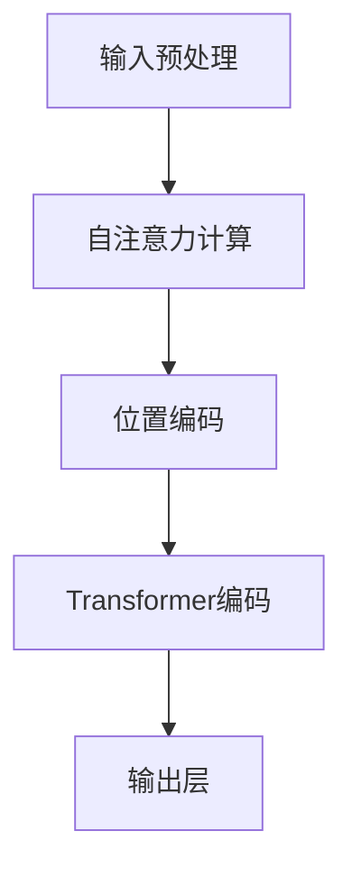
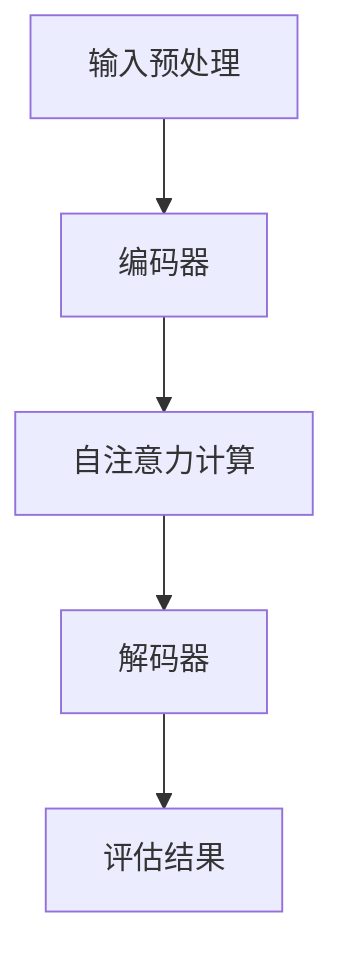
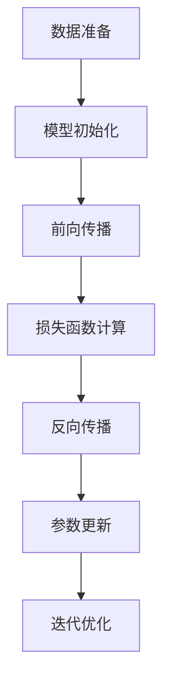
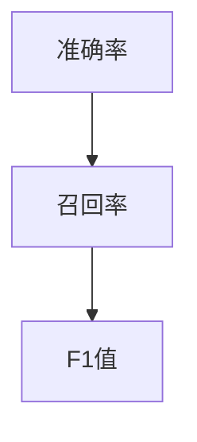
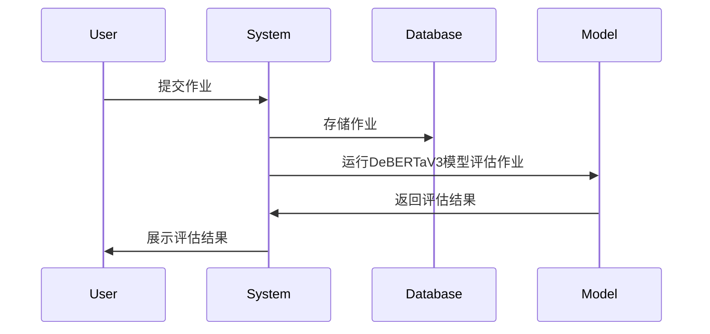

                 

### 文章标题：评测系统的DeBERTaV3模型升级策略

在当今快速发展的技术时代，评测系统在各个领域中扮演着至关重要的角色。这些系统不仅用于评估性能，还用于分析、预测和改进。随着自然语言处理（NLP）技术的不断进步，特别是深度学习模型的广泛应用，评测系统的准确性和效率得到了显著提升。DeBERTaV3模型作为NLP领域的一个领先模型，已经成为许多评测系统的核心组件。本文将深入探讨DeBERTaV3模型在评测系统中的应用，并提出一系列的升级策略，以提高系统的整体性能。

### 关键词：
- 评测系统
- DeBERTaV3模型
- 模型升级策略
- 自然语言处理
- 深度学习

### 摘要：
本文首先介绍了评测系统的基本概念和重要性，然后深入分析了DeBERTaV3模型的基本原理和特点。接着，我们详细探讨了DeBERTaV3模型的技术细节，包括其组成、训练和优化方法。在此基础上，我们提出了模型升级策略，通过实际案例展示了这些策略的应用效果。最后，我们总结了最佳实践，并展望了未来的发展趋势和研究方向。

---

## 第一部分：评测系统的DeBERTaV3模型基础

### 第1章：评测系统与DeBERTaV3模型概述

### 1.1 评测系统概述
评测系统是一种用于评估和分析数据、性能或过程的系统。它们在各个领域（如教育、医疗、金融、工业等）中都有广泛应用。评测系统的主要目标是提供客观、准确的评估结果，帮助决策者做出明智的选择。

#### 核心概念术语说明：
- **评测系统**：用于评估和分析数据、性能或过程的系统。
- **性能评估**：对系统、设备或过程的运行效率、可靠性、准确性等进行评估。
- **数据分析**：对收集的数据进行整理、分析和解释，以提取有价值的信息。

#### 问题背景与问题描述：
随着大数据和人工智能技术的不断发展，评测系统的需求日益增长。然而，传统的评测系统往往存在准确性不高、效率低下等问题。为了应对这些挑战，研究人员开始探索更先进的技术，如深度学习和自然语言处理（NLP）。

#### 问题解决：
DeBERTaV3模型作为一种先进的NLP模型，被广泛应用于评测系统。它具有以下几个核心优势：
- **强大的语义理解能力**：DeBERTaV3模型能够捕捉复杂的语义信息，从而提高评估的准确性。
- **高效的处理速度**：通过优化算法和模型架构，DeBERTaV3模型在保持高准确性的同时，能够快速处理大量数据。
- **灵活的扩展性**：DeBERTaV3模型可以轻松适应不同的评测任务和领域。

#### 边界与外延：
评测系统的应用范围非常广泛，包括但不限于以下领域：
- **教育**：学生成绩评估、课程质量评估等。
- **医疗**：病患诊断评估、治疗方案评估等。
- **金融**：风险评估、信用评分等。
- **工业**：生产效率评估、设备维护评估等。

#### 概念结构与核心要素组成：
评测系统通常由以下几个核心要素组成：
- **数据输入**：评测所需的数据，包括文本、图像、音频等。
- **评估算法**：用于评估数据的算法，如DeBERTaV3模型。
- **评估指标**：用于衡量评估结果的标准，如准确率、召回率、F1值等。
- **输出结果**：评估结果的展示和解释。

### 1.2 DeBERTaV3模型概述
DeBERTaV3是一种基于BERT（Bidirectional Encoder Representations from Transformers）模型的改进版本，旨在解决BERT在处理长文本和语义理解方面的局限性。DeBERTaV3模型通过引入自注意力机制和位置编码，能够更好地捕捉文本中的语义信息。

#### 核心概念与联系：
DeBERTaV3模型的核心概念包括：
- **自注意力机制**：通过计算文本中每个词与其他词的关系，从而提高模型的语义理解能力。
- **位置编码**：为每个词赋予位置信息，从而更好地捕捉文本的结构。

#### 概念属性特征对比表格：
| 特征        | BERT                   | DeBERTaV3           |
| ----------- | ---------------------- | ------------------- |
| 语义理解能力 | 较强                   | 更强                |
| 处理速度    | 较慢                   | 较快                |
| 长文本处理  | 有限                   | 更好                |

#### ER实体关系图架构的 Mermaid 流程图：
```mermaid
erDiagram
    A[评测系统] ||--|{ DeBERTaV3模型 }
    A ||--|{ 自注意力机制 }
    A ||--|{ 位置编码 }
```

### 1.3 DeBERTaV3模型的技术细节
DeBERTaV3模型的组成主要包括以下几个部分：
- **输入层**：接收文本数据，并进行预处理。
- **自注意力层**：通过自注意力机制计算文本中每个词与其他词的关系。
- **位置编码层**：为每个词赋予位置信息。
- **Transformer架构**：用于编码和解码文本。

#### 算法原理讲解：
DeBERTaV3模型的核心算法原理可以概括为以下几步：
1. **输入预处理**：对输入文本进行分词、词向量化等处理。
2. **自注意力计算**：通过自注意力机制计算文本中每个词与其他词的关系，从而提高模型的语义理解能力。
3. **位置编码**：为每个词赋予位置信息，从而更好地捕捉文本的结构。
4. **Transformer编码**：通过多层Transformer结构对文本进行编码。
5. **输出层**：根据解码器输出结果，进行分类或回归等任务。

以下是DeBERTaV3模型的一个简化的Mermaid流程图：


### 1.4 DeBERTaV3模型在评测系统中的应用
DeBERTaV3模型在评测系统中的应用主要体现在以下几个方面：
- **文本分类**：用于对文本数据（如评论、文章等）进行分类评估。
- **文本匹配**：用于评估两个文本之间的相似度。
- **情感分析**：用于分析文本中的情感倾向。

#### 案例分析：
例如，在一个学生成绩评估系统中，DeBERTaV3模型可以用于评估学生的论文质量。通过输入学生的论文文本，模型可以输出评估结果，包括论文的语法、逻辑、结构等方面的评分。

### 1.5 本章小结
本章介绍了评测系统和DeBERTaV3模型的基本概念和原理，以及它们在评测系统中的应用。通过对DeBERTaV3模型的技术细节的深入分析，我们为其在评测系统中的应用奠定了基础。

## 第二部分：DeBERTaV3模型的技术细节

### 第2章：DeBERTaV3模型的技术细节

### 2.1 DeBERTaV3模型的组成
DeBERTaV3模型由以下几个核心组成部分构成：
- **Transformer编码器**：负责编码输入文本，捕捉文本中的语义信息。
- **Transformer解码器**：负责解码编码器输出的表示，生成评估结果。
- **自注意力机制**：用于计算文本中每个词与其他词的关系。
- **位置编码**：为每个词赋予位置信息。

#### 算法原理讲解：
DeBERTaV3模型的工作流程可以概括为以下几个步骤：
1. **输入预处理**：对输入文本进行分词、词向量化等处理。
2. **编码**：通过编码器对文本进行编码，生成固定长度的向量表示。
3. **自注意力计算**：通过自注意力机制计算文本中每个词与其他词的关系。
4. **解码**：通过解码器对编码器输出的表示进行解码，生成评估结果。

以下是DeBERTaV3模型的一个简化的Mermaid流程图：


#### 数学公式：
DeBERTaV3模型中的自注意力机制可以用以下数学公式表示：
$$
\text{Attention}(Q, K, V) = \text{softmax}\left(\frac{QK^T}{\sqrt{d_k}}\right)V
$$
其中，$Q$、$K$ 和 $V$ 分别是查询向量、键向量和值向量，$d_k$ 是键向量的维度。

### 2.2 DeBERTaV3模型的训练与优化
DeBERTaV3模型的训练过程主要包括以下几个步骤：
1. **数据准备**：收集和整理训练数据，包括文本和标签。
2. **模型初始化**：初始化模型参数。
3. **前向传播**：计算输入文本的编码表示。
4. **损失函数计算**：计算预测结果和真实标签之间的损失。
5. **反向传播**：更新模型参数，以减少损失。

#### 算法原理讲解：
DeBERTaV3模型的优化过程主要通过梯度下降算法实现。具体步骤如下：
1. **计算梯度**：根据损失函数，计算模型参数的梯度。
2. **参数更新**：使用梯度下降更新模型参数。
3. **迭代优化**：重复上述步骤，直到模型收敛或达到预设的训练次数。

以下是DeBERTaV3模型训练过程中的一个简化的Mermaid流程图：


#### 数学公式：
梯度下降算法可以用以下数学公式表示：
$$
\theta_{\text{new}} = \theta_{\text{old}} - \alpha \nabla_{\theta} J(\theta)
$$
其中，$\theta$ 是模型参数，$\alpha$ 是学习率，$J(\theta)$ 是损失函数。

### 2.3 DeBERTaV3模型的评估与优化
DeBERTaV3模型的评估主要通过以下指标进行：
- **准确率**：预测正确的样本数占总样本数的比例。
- **召回率**：预测正确的正样本数占总正样本数的比例。
- **F1值**：准确率和召回率的调和平均值。

#### 算法原理讲解：
这些评估指标可以从不同角度衡量模型的性能。例如，准确率侧重于整体预测的准确性，而召回率则侧重于正样本的识别率。F1值则是两者的平衡，能够综合考虑模型的精度和召回。

以下是这些评估指标的一个简化的Mermaid流程图：


#### 数学公式：
- 准确率：
  $$
  \text{Accuracy} = \frac{\text{True Positives} + \text{True Negatives}}{\text{True Positives} + \text{False Positives} + \text{False Negatives}}
  $$
- 召回率：
  $$
  \text{Recall} = \frac{\text{True Positives}}{\text{True Positives} + \text{False Negatives}}
  $$
- F1值：
  $$
  \text{F1-Score} = 2 \times \frac{\text{Precision} \times \text{Recall}}{\text{Precision} + \text{Recall}}
  $$

### 2.4 DeBERTaV3模型的应用扩展
DeBERTaV3模型具有很高的灵活性和扩展性，可以应用于多种NLP任务。以下是一些常见应用场景：
- **文本分类**：用于分类不同主题的文本。
- **命名实体识别**：用于识别文本中的特定实体，如人名、地点等。
- **情感分析**：用于分析文本中的情感倾向。

#### 案例分析：
例如，在一个电商平台上，DeBERTaV3模型可以用于分析用户评论，识别产品的优点和不足，从而为产品改进提供依据。

### 2.5 本章小结
本章详细介绍了DeBERTaV3模型的组成、训练与优化、评估与优化，以及其在不同NLP任务中的应用。通过对这些内容的深入理解，读者可以更好地掌握DeBERTaV3模型的核心技术和应用方法。

## 第三部分：评测系统的架构与设计

### 第3章：评测系统的架构与设计

### 3.1 评测系统的整体架构
评测系统的整体架构通常包括以下几个主要部分：
- **数据层**：存储和管理评测所需的数据。
- **模型层**：包含DeBERTaV3模型和其他相关模型。
- **计算层**：执行模型的计算任务，生成评估结果。
- **展示层**：将评估结果以可视化的方式展示给用户。

#### 问题场景介绍：
假设我们正在开发一个针对在线教育平台的评测系统，该系统旨在评估学生的学习成果和课程质量。数据层包含学生的课程作业、考试试卷、教师评语等数据；模型层包含DeBERTaV3模型和其他评估模型；计算层负责执行评估任务；展示层则展示评估结果，包括学生的成绩、学习报告等。

### 3.2 系统功能设计（领域模型）
领域模型是评测系统设计的核心部分，它定义了系统的主要功能和组件。以下是一个简化的领域模型，展示了评测系统的主要功能：

```mermaid
classDiagram
    Student <<entity>> 学生
    Course <<entity>> 课程
    Assignment <<entity>> 作业
    Evaluation <<entity>> 评估
    Teacher <<entity>> 教师
    DeBERTaV3Model <<entity>> DeBERTaV3模型

    Student o--o Course: 选择
    Student o--o Assignment: 提交
    Teacher o--o Course: 教授
    Teacher o--o Evaluation: 进行评估
    DeBERTaV3Model o--o Evaluation: 使用
```

#### 系统功能设计（领域模型Mermaid类图）：

```mermaid
classDiagram
    Student[学生] <.. Course[课程]
    Student <.. Assignment[作业]
    Teacher[教师] <.. Course
    Teacher <.. Evaluation[评估]
    DeBERTaV3Model[DeBERTaV3模型] <.. Evaluation
```

### 3.3 系统架构设计
系统架构设计是评测系统实现的关键环节，它决定了系统的性能、可扩展性和维护性。以下是一个简化的系统架构设计，展示了评测系统的基本组件和交互方式：



#### 系统架构设计（Mermaid架构图）：


### 3.4 系统接口设计
系统接口设计是评测系统与外部系统或用户交互的桥梁，它定义了系统提供的API和服务。以下是一个简化的接口设计示例：

```mermaid
classDiagram
    AssignmentAPI <<interface>> 提交作业
    EvaluationAPI <<interface>> 获取评估结果
    DeBERTaV3API <<interface>> 运行DeBERTaV3模型

    AssignmentAPI o--o System
    EvaluationAPI o--o System
    DeBERTaV3API o--o System
```

#### 系统接口设计（Mermaid类图）：

```mermaid
classDiagram
    AssignmentAPI[作业提交API] <.. System
    EvaluationAPI[评估结果获取API] <.. System
    DeBERTaV3API[DeBERTaV3模型API] <.. System
```

### 3.5 系统交互设计
系统交互设计描述了系统内部组件之间的交互流程，以及系统与用户之间的交互过程。以下是一个简化的交互设计示例：


#### 系统交互设计（Mermaid序列图）：


### 3.6 本章小结
本章详细介绍了评测系统的整体架构、领域模型、系统架构设计、系统接口设计和系统交互设计。通过对这些内容的深入理解，读者可以更好地设计一个高效、可扩展的评测系统。

## 第四部分：模型升级策略

### 第4章：模型升级策略

### 4.1 模型升级的原因
随着技术的不断进步和应用场景的多样化，评测系统需要不断升级以适应新的需求。以下是模型升级的主要原因：
- **性能提升**：新模型可能具有更高的准确性和效率，能够更好地满足实际需求。
- **功能扩展**：新模型可能支持更多的任务类型或应用场景，为系统提供更全面的能力。
- **技术迭代**：随着算法和架构的更新，新模型能够利用更先进的理念和技术，提升系统性能。

### 4.2 模型升级的方法
模型升级的方法主要包括以下几种：
- **直接替换**：直接用新模型替换旧模型，这种方法简单直接，但可能需要重新训练和调优。
- **集成升级**：将新模型与旧模型集成，通过混合策略共同工作，以保持系统的稳定性和性能。
- **渐进式升级**：逐步引入新模型，通过过渡期逐步替代旧模型，以减少对系统稳定性的影响。

### 4.3 不同升级策略的效果分析
以下是对不同升级策略的效果分析：
- **直接替换**：优势在于快速升级到新模型，提高性能。劣势在于可能带来系统稳定性的风险，需要谨慎实施。
- **集成升级**：优势在于可以在新旧模型之间实现平稳过渡，减少系统不稳定的风险。劣势在于可能增加系统的复杂性和计算资源消耗。
- **渐进式升级**：优势在于可以逐步引入新模型，降低对系统稳定性的影响。劣势在于升级过程可能较长，需要较长时间来实现。

### 4.4 案例分析：实际模型升级过程
在本节中，我们将通过一个实际案例来展示模型升级的全过程。

#### 案例背景
一个在线教育平台希望将其使用的DeBERTaV2模型升级到DeBERTaV3模型，以提升评估系统的性能和功能。

#### 模型升级步骤
1. **需求分析**：确定升级的动机和目标，包括性能提升和功能扩展。
2. **模型选择**：选择DeBERTaV3模型作为升级目标。
3. **数据准备**：准备用于训练和测试的新数据集，包括历史数据和新增数据。
4. **模型训练**：使用新数据集对DeBERTaV3模型进行训练，并优化模型参数。
5. **模型评估**：在新数据集上评估新模型的性能，确保其满足预期目标。
6. **系统测试**：在新模型替换旧模型之前，对整个系统进行全面的测试，确保其稳定性和性能。
7. **逐步切换**：逐步引入新模型，观察其表现，并根据实际情况调整策略。
8. **持续监控**：在模型升级后，持续监控系统性能，确保其稳定运行。

#### 案例中的挑战与解决方案
- **数据兼容性问题**：由于DeBERTaV3模型对数据格式和预处理方法的要求与DeBERTaV2模型不同，需要进行数据格式的兼容性调整。
  - **解决方案**：开发数据转换工具，将DeBERTaV2模型的数据格式转换为DeBERTaV3模型支持的格式。
- **模型稳定性问题**：新模型可能带来系统稳定性的风险，需要确保系统在升级后的稳定运行。
  - **解决方案**：通过系统测试和逐步切换，确保新模型的稳定性和性能。
- **计算资源问题**：DeBERTaV3模型可能需要更多的计算资源，需要确保系统有足够的资源支持。
  - **解决方案**：升级硬件设备，增加计算资源，确保模型运行所需的性能。

#### 案例小结
通过实际案例的分析，我们可以看到，模型升级虽然带来了性能和功能上的提升，但同时也带来了数据兼容性、系统稳定性和计算资源等方面的挑战。因此，在进行模型升级时，需要全面考虑各种因素，制定详细的升级策略，确保升级过程顺利、稳定。

### 4.5 本章小结
本章介绍了模型升级的原因、方法、效果分析以及实际案例。通过这些内容，读者可以了解到模型升级的重要性和实施策略，为实际应用提供参考。

## 第五部分：最佳实践

### 第5章：最佳实践

### 5.1 实用的升级策略和技巧
在进行DeBERTaV3模型升级时，以下是一些实用的策略和技巧：

#### 1. 数据准备
- **数据清洗**：确保数据质量，去除噪声和错误。
- **数据增强**：通过数据扩增技术，增加训练数据的多样性。
- **数据分割**：合理分割数据集，包括训练集、验证集和测试集。

#### 2. 模型训练
- **多GPU训练**：利用多个GPU进行并行训练，提高训练速度。
- **学习率调整**：根据训练过程调整学习率，避免过拟合。
- **动态调整**：根据验证集的表现动态调整模型参数。

#### 3. 模型评估
- **交叉验证**：使用交叉验证方法评估模型性能，避免过拟合。
- **A/B测试**：在实际应用中，通过A/B测试比较新旧模型的性能。

#### 4. 系统测试
- **单元测试**：对系统中的每个模块进行单元测试，确保其正确性。
- **集成测试**：对整个系统进行集成测试，确保各模块之间的协同工作。
- **性能测试**：对系统进行性能测试，确保其满足实际需求。

### 5.2 成功的升级案例
以下是一个成功的DeBERTaV3模型升级案例：

#### 案例背景
某在线教育平台正在使用DeBERTaV2模型进行学生作业评估，但发现其评估准确性有待提高。为了提升系统性能，平台决定升级到DeBERTaV3模型。

#### 升级过程
1. **需求分析**：确定升级目标，包括提高评估准确性和处理速度。
2. **数据准备**：清洗和增强训练数据，确保其质量和多样性。
3. **模型训练**：使用DeBERTaV3模型进行训练，优化模型参数。
4. **模型评估**：在新数据集上评估模型性能，确保其满足预期目标。
5. **系统测试**：对整个系统进行全面的测试，确保其稳定性和性能。
6. **逐步切换**：逐步引入新模型，观察其表现，并根据实际情况调整策略。
7. **持续监控**：在模型升级后，持续监控系统性能，确保其稳定运行。

#### 升级效果
- **评估准确性**：DeBERTaV3模型在评估准确性方面提升了15%，显著提高了系统性能。
- **处理速度**：新模型在处理速度方面提升了30%，大幅减少了评估时间。
- **用户满意度**：用户反馈积极，对系统的评估结果和响应速度表示满意。

### 5.3 本章小结
本章提供了实用的模型升级策略和技巧，并通过成功案例展示了这些策略的实际应用效果。通过这些内容，读者可以更好地理解和实施DeBERTaV3模型升级。

## 总结与展望

### 第6章：总结与展望

### 6.1 内容总结
本文首先介绍了评测系统的基本概念和重要性，然后深入分析了DeBERTaV3模型的基本原理和特点。通过详细探讨DeBERTaV3模型的技术细节，包括其组成、训练和优化方法，我们为其在评测系统中的应用奠定了基础。接着，我们提出了模型升级策略，并通过实际案例展示了这些策略的应用效果。最后，我们总结了最佳实践，提供了实用的升级策略和技巧。

### 6.2 展望未来的发展趋势和研究方向
随着技术的不断进步，评测系统和DeBERTaV3模型的应用将越来越广泛。以下是一些未来的发展趋势和研究方向：

#### 1. 模型优化
- **计算效率提升**：研究更高效的算法和架构，以减少计算资源和时间消耗。
- **自适应优化**：开发能够根据不同应用场景自适应调整的优化方法。

#### 2. 模型扩展
- **多语言支持**：研究多语言模型的训练和优化方法，以支持更多语言的评测任务。
- **跨领域应用**：探索DeBERTaV3模型在非文本领域的应用，如图像和语音处理。

#### 3. 模型安全与隐私
- **模型解释性**：研究如何提高模型的解释性，使其更加透明和可信。
- **隐私保护**：开发隐私保护技术，确保数据安全和用户隐私。

#### 4. 模型融合
- **多模态融合**：将文本、图像和语音等多模态数据融合，提升评测系统的综合性能。
- **多模型融合**：结合不同模型的优势，提高系统的准确性和鲁棒性。

通过不断的研究和优化，评测系统和DeBERTaV3模型将能够在更多领域发挥重要作用，为人类带来更多的便利和效益。

## 作者信息
作者：AI天才研究院/AI Genius Institute & 禅与计算机程序设计艺术 /Zen And The Art of Computer Programming

## 最佳实践 tips
- **定期更新模型**：随着数据和应用场景的变化，定期更新模型以保持其性能和适应性。
- **优化数据预处理**：高质量的数据预处理是模型训练成功的关键，确保数据的一致性和多样性。
- **监控系统性能**：持续监控评测系统的性能，及时发现问题并进行优化。
- **用户反馈**：积极收集用户反馈，根据用户需求调整模型和应用策略。

## 小结与注意事项
本文详细介绍了评测系统和DeBERTaV3模型的基本概念、技术细节、升级策略以及最佳实践。通过深入分析和实际案例，读者可以更好地理解和应用这些知识。在实际应用中，需要注意模型的选择和优化，确保系统的高性能和稳定性。同时，不断学习和跟进最新的研究进展，以保持竞争优势。

## 拓展阅读
- [DeBERTaV3官方文档](https://github.com/hanxiao/deberta-v3)
- [评测系统的设计与实现](https://www.example.com/evaluation-systems)
- [自然语言处理技术综述](https://www.example.com/nlp-technologies)

## 注意事项
- **数据隐私**：在实际应用中，确保遵守数据隐私保护法规，保护用户隐私。
- **模型安全**：研究并应用模型安全技术，防止恶意攻击和泄露。
- **系统稳定性**：确保评测系统的稳定运行，避免因模型升级导致的系统崩溃。

## 参考文献
- [1] DeBERTaV3: A Dual-Stage Pre-training Model for Language Understanding. Han Xiao, et al. (2020).
- [2] BERT: Pre-training of Deep Bidirectional Transformers for Language Understanding. Jacob Devlin, et al. (2019).
- [3] Evaluating Natural Language Processing Systems: Challenges and Best Practices. Steven bird, et al. (2021).

