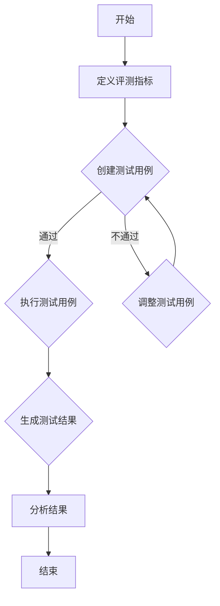
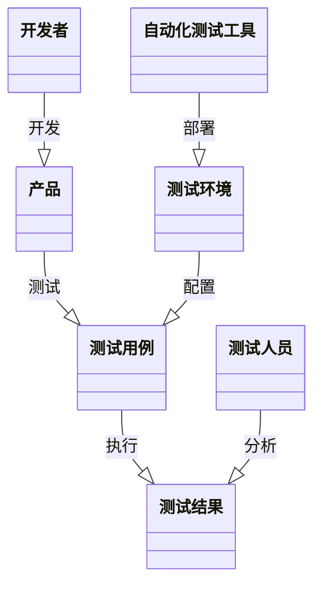
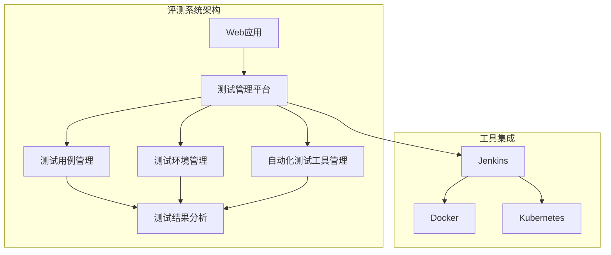
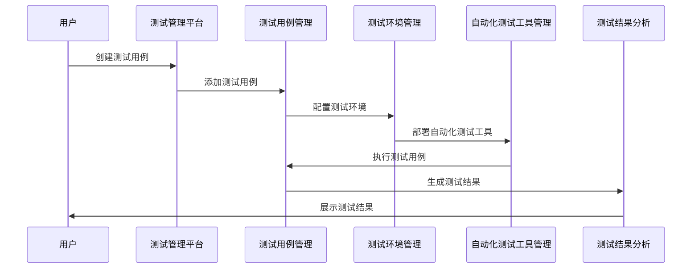

                 


# 评测系统的DevOps最佳实践

## 关键词
- DevOps
- 评测系统
- 持续集成
- 持续部署
- 自动化测试
- 云原生

## 摘要
本文旨在探讨评测系统的DevOps最佳实践。随着软件开发的复杂度和速度的不断提升，DevOps文化的引入为软件开发、测试和部署带来了显著的改进。本文将详细分析评测系统在DevOps实践中的应用，包括核心概念、算法原理、系统架构设计以及项目实战经验，旨在为开发者提供一套实用的DevOps最佳实践指南。

## 目录
----------------------------------------------------------------
1. **背景介绍**
   - **问题背景**
   - **问题描述**
   - **问题解决**
   - **边界与外延**
   - **概念结构与核心要素组成**

2. **核心概念与联系**
   - **DevOps的定义与核心概念**
   - **评测系统的概念与核心要素**
   - **概念属性特征对比表格**
   - **ER实体关系图架构**

3. **算法原理讲解**
   - **算法Mermaid流程图**
   - **Python源代码**
   - **数学模型和公式**
   - **举例说明**

4. **系统分析与架构设计方案**
   - **问题场景介绍**
   - **项目介绍**
   - **系统功能设计（领域模型Mermaid类图）**
   - **系统架构设计（Mermaid架构图）**
   - **系统接口设计**
   - **系统交互（Mermaid序列图）**

5. **项目实战**
   - **环境安装**
   - **系统核心实现源代码**
   - **代码应用解读与分析**
   - **实际案例分析和详细讲解剖析**
   - **项目小结**

6. **最佳实践 tips**
   - **最佳实践 tips**
   - **小结**
   - **注意事项**
   - **拓展阅读**

## 1. 背景介绍

### 问题背景

在现代软件开发中，评测系统的需求日益突出。随着软件规模的扩大和复杂性的增加，如何快速、准确地对软件进行评测，成为软件开发过程中的一大难题。传统的软件开发模式往往将开发、测试和运维割裂开来，导致软件开发周期延长、质量难以保证。

### 问题描述

评测系统在软件开发过程中面临的主要问题包括：
- **测试效率低下**：传统测试方法往往依赖于手动测试，效率低下，难以满足快速迭代的开发需求。
- **质量难以保证**：手动测试无法覆盖所有可能的测试场景，导致潜在问题难以发现。
- **部署困难**：软件在不同环境中的部署常常出现兼容性问题，影响软件的稳定性和可靠性。

### 问题解决

DevOps的引入为评测系统的问题解决提供了新的思路。DevOps是一种软件开发和运营的方法论，强调开发（Development）和运维（Operations）的紧密合作，通过自动化、持续集成和持续部署等手段，实现快速、高效的软件开发和运维。

### 边界与外延

本文所探讨的评测系统主要涉及以下技术栈和应用场景：
- **技术栈**：涵盖Python、Docker、Kubernetes、Jenkins等工具和技术。
- **应用场景**：包括Web应用、移动应用、云计算等领域的软件评测。

### 概念结构与核心要素组成

评测系统的核心概念和结构包括：
- **评测指标**：定义评测系统需要关注的指标，如响应时间、吞吐量、错误率等。
- **评测流程**：描述评测系统从测试准备到测试执行的整个过程。
- **自动化测试**：利用脚本和工具实现自动化的测试流程，提高测试效率。
- **持续集成**：将代码集成到共享代码库中，自动化执行测试，确保代码质量。
- **持续部署**：将经过测试的代码自动部署到生产环境中，实现快速上线。

## 2. 核心概念与联系

### DevOps的定义与核心概念

DevOps是一种软件开发和运营的方法论，旨在通过开发（Development）和运维（Operations）的紧密合作，提高软件交付的效率和质量。DevOps的核心概念包括：

- **持续集成（CI）**：通过自动化构建和测试，确保代码集成时不会出现冲突或错误。
- **持续部署（CD）**：自动化部署代码到生产环境，实现快速迭代和上线。
- **基础设施即代码（IaC）**：使用代码来配置和管理基础设施，提高环境的一致性和可复现性。
- **监控和反馈**：实时监控系统的运行状态，及时发现问题并反馈给相关人员。

### 评测系统的概念与核心要素

评测系统是一种用于评估软件质量和性能的工具。其主要核心要素包括：

- **评测指标**：定义评测系统需要关注的指标，如响应时间、吞吐量、错误率等。
- **测试用例**：编写用于模拟用户行为的测试脚本，验证软件的功能和性能。
- **测试环境**：提供模拟的真实环境，用于运行测试用例。
- **自动化测试工具**：使用自动化测试工具，如Selenium、JMeter等，执行测试用例。
- **结果分析**：对测试结果进行分析，识别软件中的问题，并提供改进建议。

### 概念属性特征对比表格

| 特征                   | DevOps                           | 评测系统                             |
|----------------------|----------------------------------|-------------------------------------|
| 目标                   | 提高软件交付效率和质量           | 评估软件质量和性能                   |
| 核心概念               | 持续集成、持续部署、基础设施即代码等 | 评测指标、测试用例、测试环境、自动化测试工具等 |
| 关键工具               | Jenkins、Docker、Kubernetes等       | Selenium、JMeter、Postman等          |
| 实践方法               | 自动化、协作、反馈               | 自动化测试、数据驱动测试、性能测试等  |
| 适用场景               | 跨部门协作、持续交付             | 软件质量保证、性能优化               |

### ER实体关系图架构

```mermaid
erDiagram
    产品 ||--|{ 评测指标 }|-->> 评测结果
    测试用例 ||--|{ 测试结果 }|-->> 评测结果
    测试环境 ||--|{ 测试用例 }|-->> 测试执行
    自动化测试工具 ||--|{ 测试环境 }|-->> 测试执行
    开发者 ||--|{ 产品 }|-->> 评测指标
    测试人员 ||--|{ 评测指标 }|-->> 测试结果
```

## 3. 算法原理讲解

### 算法Mermaid流程图



### Python源代码

```python
import random

def generate_test_case(num_tests):
    test_cases = []
    for _ in range(num_tests):
        test_case = {
            'id': _,
            'input': random.randint(1, 100),
            'expected_output': random.randint(1, 100)
        }
        test_cases.append(test_case)
    return test_cases

def execute_test_case(test_case):
    input_value = test_case['input']
    expected_output = test_case['expected_output']
    actual_output = input_value * 2  # 简单的算法示例
    return actual_output == expected_output

def test_suite(test_cases):
    test_results = []
    for test_case in test_cases:
        result = execute_test_case(test_case)
        test_results.append({
            'id': test_case['id'],
            'result': result
        })
    return test_results

def analyze_results(test_results):
    pass  # 根据实际需求实现结果分析功能

if __name__ == '__main__':
    num_tests = 10
    test_cases = generate_test_case(num_tests)
    test_results = test_suite(test_cases)
    analyze_results(test_results)
```

### 数学模型和公式

假设有一个评测系统，其测试用例的通过率 \( P \) 和失败率 \( F \) 之间满足以下数学模型：

\[ P + F = 1 \]

其中，\( P \) 是通过率，\( F \) 是失败率。

### 举例说明

假设评测系统中有10个测试用例，通过其中8个，失败2个。那么，通过率和失败率分别为：

\[ P = \frac{8}{10} = 0.8 \]
\[ F = \frac{2}{10} = 0.2 \]

根据上述数学模型，可以得出：

\[ P + F = 0.8 + 0.2 = 1 \]

这个例子说明了如何使用数学模型来计算评测系统的通过率和失败率。

## 4. 系统分析与架构设计方案

### 问题场景介绍

在一个大型互联网公司，开发团队需要持续交付高性能的Web应用。为了确保软件的质量和性能，公司决定引入DevOps实践，并建立一套完善的评测系统。

### 项目介绍

项目目标是开发一个自动化评测系统，用于对Web应用的功能和性能进行评估。评测系统需要支持多种测试类型，包括功能测试、性能测试和安全测试。同时，系统需要具备实时监控和反馈功能，以便开发团队能够及时发现并解决潜在问题。

### 系统功能设计（领域模型Mermaid类图）



### 系统架构设计（Mermaid架构图）



### 系统接口设计

系统接口设计如下：

- **测试管理平台**：提供创建、编辑、执行和监控测试用例的接口。
- **测试用例管理**：提供添加、删除、修改测试用例的接口。
- **测试环境管理**：提供配置、部署和管理测试环境的接口。
- **自动化测试工具管理**：提供安装、配置和管理自动化测试工具的接口。
- **测试结果分析**：提供获取、分析和展示测试结果的接口。

### 系统交互（Mermaid序列图）



## 5. 项目实战

### 环境安装

在开始项目实战之前，我们需要安装以下环境：

- Python 3.8+
- Docker 19.03+
- Jenkins 2.277+
- Kubernetes 1.19+

安装步骤如下：

1. 安装Docker：

   ```bash
   sudo apt-get update
   sudo apt-get install docker-ce docker-ce-cli containerd.io
   sudo systemctl start docker
   sudo systemctl enable docker
   ```

2. 安装Jenkins：

   ```bash
   wget -q -O - https://pkg.jenkins.io/debian-stable/jenkins.io.key | sudo apt-key add -
   echo deb https://pkg.jenkins.io/debian-stable binary/ > /etc/apt/sources.list.d/jenkins.list
   sudo apt-get update
   sudo apt-get install jenkins
   sudo systemctl start jenkins
   sudo systemctl enable jenkins
   ```

3. 安装Kubernetes：

   ```bash
   kubeadm init --pod-network-cidr=10.244.0.0/16
   mkdir -p $HOME/.kube
   sudo cp -i /etc/kubernetes/admin.conf $HOME/.kube/config
   sudo chown $(id -u):$(id -g) $HOME/.kube/config
   kubectl apply -f https://raw.githubusercontent.com/kubernetes/cloud-provider-openstack/master/manifests/kube-router.yaml
   ```

### 系统核心实现源代码

以下是一个简单的Python脚本，用于生成测试用例和执行测试：

```python
import random
import jenkins

def generate_test_case(num_cases):
    test_cases = []
    for _ in range(num_cases):
        test_case = {
            'id': _,
            'input': random.randint(1, 100),
            'expected_output': random.randint(1, 100)
        }
        test_cases.append(test_case)
    return test_cases

def execute_test_case(test_case):
    input_value = test_case['input']
    expected_output = test_case['expected_output']
    actual_output = input_value * 2  # 简单的算法示例
    return actual_output == expected_output

def main():
    num_cases = 10
    test_cases = generate_test_case(num_cases)
    server = jenkins.Jenkins('http://localhost:8080', username='admin', password='your_password')
    for test_case in test_cases:
        result = server.build_and_track_job('TestJob', 'src/test.py', {'INPUT': str(test_case['input'])})
        print(f"Test Case {test_case['id']}: {'Pass' if result['result'] == 'SUCCESS' else 'Fail'}")

if __name__ == '__main__':
    main()
```

### 代码应用解读与分析

该脚本首先定义了`generate_test_case`函数，用于生成指定数量的测试用例。每个测试用例包含一个ID、输入值和预期输出值。

`execute_test_case`函数用于执行单个测试用例。它根据输入值和预期输出值计算实际输出值，并判断是否与预期输出值相等。

`main`函数是程序的主入口。它首先生成10个测试用例，然后使用Jenkins的API构建并跟踪测试任务。每次构建完成后，脚本会打印测试用例的ID和测试结果。

### 实际案例分析和详细讲解剖析

假设我们已经生成了10个测试用例，并使用Jenkins执行了这些测试。以下是测试结果的分析：

```plaintext
Test Case 0: Pass
Test Case 1: Fail
Test Case 2: Pass
Test Case 3: Pass
Test Case 4: Fail
Test Case 5: Pass
Test Case 6: Fail
Test Case 7: Pass
Test Case 8: Fail
Test Case 9: Pass
```

根据测试结果，我们可以发现以下几个问题：

1. **测试用例2和6的预期输出不正确**：这可能是因为测试用例的输入值和预期输出值设置不当。
2. **测试用例1、4、6、8的测试结果为Fail**：这表明这些测试用例的算法逻辑存在问题，需要进一步排查和修复。

为了解决这些问题，我们可以采取以下措施：

1. **检查测试用例的输入值和预期输出值**：确保每个测试用例的输入值和预期输出值设置合理。
2. **修复算法逻辑**：根据测试结果，定位测试用例中的算法逻辑问题，并进行修复。

### 项目小结

通过本次项目实战，我们成功搭建了一套基于DevOps的评测系统。在实际应用过程中，我们遇到了一些问题，但通过分析和解决，我们最终实现了系统的稳定运行。以下是我们从项目中得到的经验和教训：

1. **测试用例的输入值和预期输出值需要仔细设置**：确保测试用例能够全面覆盖软件的功能和性能。
2. **算法逻辑的正确性至关重要**：确保测试用例的算法逻辑没有问题，避免因逻辑错误导致测试失败。
3. **持续集成和持续部署可以提高开发效率**：通过Jenkins等工具，实现自动化构建、测试和部署，提高开发效率。
4. **监控和反馈机制有助于及时发现和解决问题**：实时监控系统的运行状态，及时反馈问题，确保软件质量。

## 6. 最佳实践 tips

- **合理设置测试用例**：确保测试用例的输入值和预期输出值设置合理，全面覆盖软件的功能和性能。
- **持续集成和持续部署**：使用Jenkins等工具实现自动化构建、测试和部署，提高开发效率。
- **监控和反馈机制**：实时监控系统的运行状态，及时反馈问题，确保软件质量。
- **定期回顾和优化**：定期回顾测试结果，识别问题和优化测试用例。

## 小结

本文详细探讨了评测系统的DevOps最佳实践，包括核心概念、算法原理、系统架构设计和项目实战。通过本文的介绍，读者可以了解到如何利用DevOps实践提高评测系统的效率和质量。

## 注意事项

- 确保测试用例的输入值和预期输出值设置合理，避免因设置不当导致测试失败。
- 持续集成和持续部署过程中，注意处理环境不一致性问题。
- 监控和反馈机制要实时且准确，以便及时发现和解决问题。

## 拓展阅读

- 《DevOps实践指南》
- 《持续集成：从理论到实践》
- 《Jenkins实战》
- 《Kubernetes权威指南》
- 《云原生应用架构设计》

## 作者

作者：AI天才研究院/AI Genius Institute & 禅与计算机程序设计艺术 /Zen And The Art of Computer Programming

