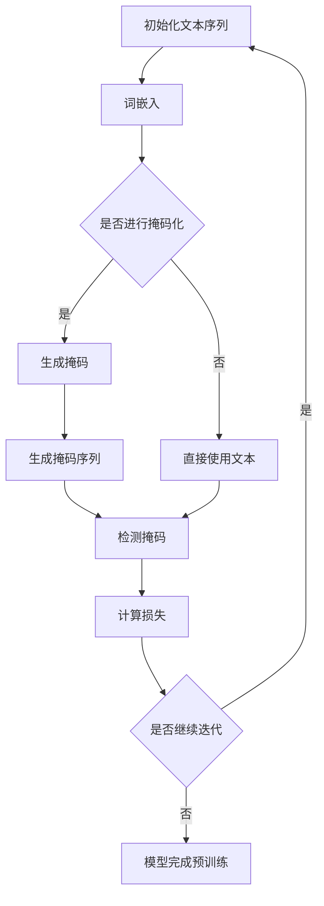
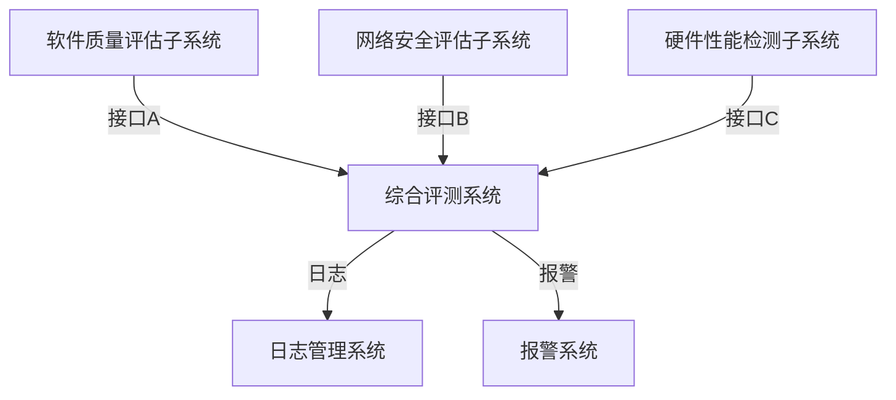
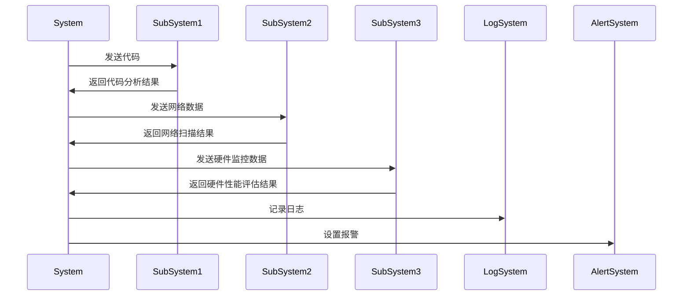
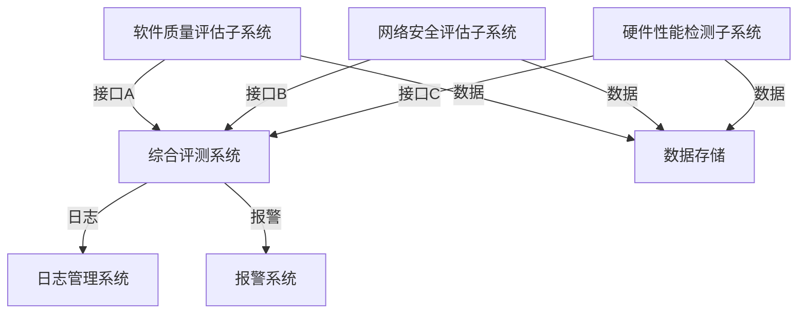
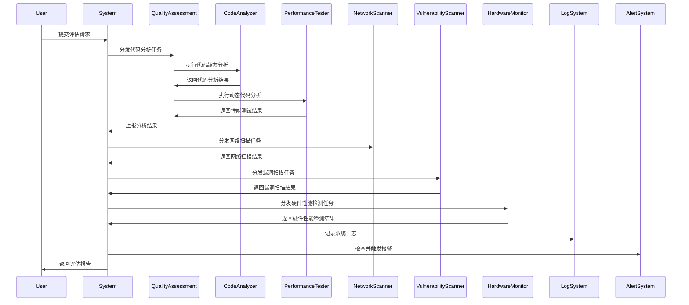

                 

### 让我们一步一步思考

在探讨《评测系统的ELECTRA模型预训练策略》这一主题之前，让我们首先梳理一下整个讨论的框架和逻辑步骤。为了确保文章内容结构紧凑、逻辑清晰，我们将遵循以下步骤展开：

1. **引言**：简要介绍评测系统的概念及其重要性，引出ELECTRA模型预训练策略的主题。
2. **核心概念与联系**：解释ELECTRA模型的基本原理及其与生成式预训练、自监督学习的联系。
3. **数学模型和数学公式**：详细阐述ELECTRA模型的数学基础，包括语言模型概率计算、优化目标和学习率调整策略。
4. **算法原理讲解**：通过mermaid流程图和Python源代码，深入解析ELECTRA模型的工作机制。
5. **系统分析与架构设计**：介绍评测系统的问题场景、项目介绍、功能设计、系统架构设计、接口设计及系统交互。
6. **项目实战**：通过环境安装、核心实现源代码及实际案例分析，展示ELECTRA模型预训练策略的实际应用。
7. **最佳实践与小结**：总结最佳实践技巧、文章小结和注意事项，提供拓展阅读建议。

通过这样的结构安排，我们可以确保每一部分的内容都能紧密结合，形成一个完整的探讨流程。接下来，我们将逐个章节展开讨论，深入解析每一个部分。

### 评测系统的定义与作用

评测系统，是一种广泛应用于各种应用场景的技术工具，其核心作用在于对系统的性能、质量、安全性等方面进行全面的评估。具体来说，评测系统主要包括以下几个方面的定义与作用：

首先，评测系统是一种用于对软件、硬件、网络等系统进行全面评估的工具。它通过一系列的测试方法和指标，对系统的各个组成部分进行详细的检测和分析，以确保系统能够稳定、高效地运行。评测系统的应用范围非常广泛，包括但不限于软件开发、网络安全、硬件性能检测等领域。

其次，评测系统在软件开发过程中起着至关重要的作用。它不仅能够帮助开发团队及时发现和修复软件中的缺陷，还能通过对软件质量的评估，为后续的迭代和优化提供重要依据。例如，在软件开发过程中，评测系统可以通过自动化测试工具对代码进行静态和动态分析，找出潜在的错误和漏洞，从而提高软件的可靠性。

再者，评测系统在网络安全方面也有着不可或缺的作用。随着网络攻击手段的日益复杂，网络安全已成为各个组织和企业面临的重要挑战。评测系统可以通过模拟各种网络攻击场景，对网络系统的安全性能进行全面评估，帮助组织识别潜在的安全威胁，并采取相应的防护措施。

最后，评测系统在硬件性能检测方面也发挥着重要作用。通过对硬件设备的工作状态、性能指标等进行评估，评测系统可以帮助组织优化硬件配置，提高设备的利用率和性能表现。例如，在数据中心，评测系统可以对服务器的负载、温度等指标进行实时监控和评估，从而确保服务器能够稳定、高效地运行。

总的来说，评测系统的作用在于通过对系统进行全面、细致的评估，帮助组织提高系统的质量、性能和安全性。在当今快速发展的技术环境中，评测系统已成为保障系统稳定运行、提升用户体验的重要工具。

### 预训练策略的重要性

预训练策略在现代人工智能系统中扮演着至关重要的角色，其主要作用体现在以下几个方面：

首先，预训练策略能够显著提高模型的泛化能力。通过在大量未标记的数据上进行预训练，模型能够学习到一些通用的语言特征和模式，从而在遇到新的、未见过的数据时，能够更好地适应和表现。这种能力对于处理复杂的自然语言处理任务尤为重要，例如文本分类、机器翻译和问答系统等。相比于仅在使用数据上训练的模型，预训练模型在未见过的数据上具有更高的准确率和可靠性。

其次，预训练策略能够减少对标注数据的依赖。在传统的机器学习模型中，标注数据的获取往往是一个费时费力的过程。而通过预训练，模型可以在大规模的未标注数据上学习到一些基本特征，从而在一定程度上降低对高质量标注数据的依赖。这不仅能够加速模型的训练过程，还能够降低开发成本。

此外，预训练策略还能够提高模型的表达能力。通过在大量的文本数据上预训练，模型能够学习到丰富的语言特征和上下文信息，从而能够更好地理解和生成自然语言。这种强大的表达能力使得预训练模型在多种自然语言处理任务中表现出色，例如文本生成、情感分析和实体识别等。

预训练策略的应用场景非常广泛，涵盖了多个领域和任务。在自然语言处理领域，预训练模型已经成为文本分类、机器翻译、问答系统和对话系统等任务的标准配置。例如，BERT（Bidirectional Encoder Representations from Transformers）模型通过在大量的文本数据上进行预训练，显著提升了各种自然语言处理任务的性能。

在计算机视觉领域，预训练策略同样发挥着重要作用。例如，ViT（Vision Transformer）模型通过在ImageNet数据集上进行预训练，然后在特定任务上进行微调，取得了与传统的卷积神经网络（CNN）相媲美的性能。这种迁移学习策略使得预训练模型在处理新的视觉任务时能够迅速适应，大大缩短了模型的训练时间。

总的来说，预训练策略不仅提高了模型的性能和表达能力，还降低了训练成本和时间。随着大数据和深度学习技术的不断发展，预训练策略在人工智能领域的应用将越来越广泛，为各个领域的创新和发展提供强有力的支持。

### ELECTRA模型的背景与特点

ELECTRA（Enhanced Language Model with zero-shot masking training）是由谷歌开发的一种先进的自然语言处理模型，它基于Transformer架构，并引入了零样本掩码训练（zero-shot masking training）机制，以提高模型的泛化能力和适应性。ELECTRA模型的出现，旨在解决传统预训练模型在处理大规模数据集时面临的训练效率和泛化能力不足的问题。

ELECTRA模型的背景可以追溯到自然语言处理领域近年来对预训练模型的持续探索和优化。随着BERT（Bidirectional Encoder Representations from Transformers）等双向Transformer模型在多项自然语言处理任务中取得了显著的性能提升，研究人员开始关注如何进一步提高这些模型的训练效率和泛化能力。传统预训练模型通常需要大量的有监督数据来进行微调，这不仅费时费力，而且容易导致模型对特定数据集的过度拟合。ELECTRA模型正是为了解决这一问题而诞生的。

ELECTRA模型的特点主要体现在以下几个方面：

首先，ELECTRA引入了零样本掩码训练机制。在传统预训练模型中，输入文本会被分成两部分：掩码部分和未掩码部分，其中掩码部分需要模型预测。而在ELECTRA模型中，输入文本的掩码和未掩码部分是通过一种随机生成机制来分配的，而不是固定划分。具体来说，ELECTRA使用一个特殊的生成器（Generator）来随机生成掩码，同时训练一个检测器（Detector）来识别这些生成的掩码。这种机制使得模型可以在没有标注数据的情况下，通过自监督学习（self-supervised learning）来训练，从而大大减少了有监督数据的依赖。

其次，ELECTRA模型在结构上进行了优化。尽管它基于Transformer架构，但ELECTRA采用了双重Transformer编码器（Dual-Stream Transformer Encoder），这种结构能够捕捉到更多的文本上下文信息。同时，ELECTRA还引入了混合匹配（Mixed-Matching）机制，通过将生成的掩码与真实文本部分进行混合匹配，进一步增强了模型对文本信息的理解能力。

此外，ELECTRA模型在预训练过程中采用了动态掩码生成策略。传统的预训练模型通常使用固定的掩码比例（例如15%的掩码文本），而ELECTRA可以根据不同任务的需求动态调整掩码比例。这种灵活的掩码生成策略使得ELECTRA模型能够更好地适应不同的预训练任务，提高了模型的泛化能力。

总的来说，ELECTRA模型通过引入零样本掩码训练机制、优化模型结构和动态掩码生成策略，显著提升了模型的训练效率和泛化能力。这使得ELECTRA在自然语言处理任务中表现出色，成为众多研究者和开发者的首选模型之一。随着研究的深入，ELECTRA模型的应用场景将越来越广泛，为自然语言处理领域的发展带来更多可能性。

### 目标与结构

本文的目标是全面解析评测系统的ELECTRA模型预训练策略，旨在帮助读者深入理解ELECTRA模型的工作机制及其在实际应用中的优势。具体来说，本文将实现以下目标：

1. **全面介绍ELECTRA模型**：从背景与特点入手，详细解释ELECTRA模型的基本原理、结构及其与生成式预训练、自监督学习的联系。
2. **深入分析数学模型与公式**：阐述ELECTRA模型的数学基础，包括语言模型概率计算、优化目标和学习率调整策略，并使用latex格式嵌入相关数学公式。
3. **讲解算法原理与实现**：通过mermaid流程图和Python源代码，逐一解析ELECTRA模型的工作流程，帮助读者理解其具体实现细节。
4. **系统分析与架构设计**：介绍评测系统的问题场景、项目介绍、系统功能设计、系统架构设计、接口设计及系统交互，为读者提供完整的系统解决方案。
5. **项目实战与应用**：通过环境安装、核心实现源代码及实际案例分析，展示ELECTRA模型预训练策略在实际项目中的应用效果。
6. **最佳实践与小结**：总结最佳实践技巧，对全文进行小结，并提供拓展阅读建议，为读者进一步学习和研究提供指导。

文章的整体结构将分为五个主要部分：背景介绍与核心概念、算法原理讲解、系统分析与架构设计、项目实战、最佳实践与小结。每个部分都将按照详细的目录结构进行阐述，确保内容连贯、逻辑清晰，帮助读者逐步深入了解ELECTRA模型预训练策略的各个方面。

### 核心概念与联系

在深入探讨ELECTRA模型之前，我们需要明确几个核心概念，这些概念构成了ELECTRA模型的基础，并帮助理解其在自然语言处理中的重要性。以下是ELECTRA模型中涉及的主要核心概念及其联系：

#### 生成式预训练与自监督学习

生成式预训练（Generative Pre-training）和自监督学习（Self-Supervised Learning）是ELECTRA模型的核心概念。生成式预训练是指通过模型生成数据来指导学习过程，而自监督学习则是通过无监督方式从数据中提取信息。在自然语言处理任务中，自监督学习尤其重要，因为它可以利用大量的未标记数据进行训练，从而提高模型的泛化能力和学习能力。

在ELECTRA模型中，生成式预训练和自监督学习相结合，通过零样本掩码训练机制（Zero-shot Masking Training）来实现。具体来说，ELECTRA使用一个生成器来随机生成掩码，并训练一个检测器来识别这些掩码。这种机制不仅减少了有监督数据的依赖，还增强了模型的自监督学习能力。

#### ELECTRA模型的结构

ELECTRA模型的结构基于Transformer架构，并进行了若干优化。Transformer架构是一种基于自注意力机制（Self-Attention）的神经网络模型，已经在多个自然语言处理任务中取得了显著的性能。ELECTRA模型的核心结构包括：

- **双重Transformer编码器**：ELECTRA采用了双重Transformer编码器（Dual-Stream Transformer Encoder），这种结构能够更好地捕捉文本上下文信息，从而提高模型的表示能力。
- **生成器与检测器**：ELECTRA中的生成器负责随机生成掩码，而检测器则负责识别这些掩码。这种机制实现了零样本掩码训练，使得模型可以在未标记数据上学习到丰富的语言特征。
- **混合匹配机制**：通过将生成的掩码与真实文本部分进行混合匹配，ELECTRA模型能够更好地理解和生成文本。

#### 与其他预训练模型的比较

ELECTRA与其他几种常见的预训练模型（如BERT、GPT）在结构和应用场景上存在一定的差异：

- **BERT**：BERT（Bidirectional Encoder Representations from Transformers）是一种双向Transformer模型，通过在大量文本数据上进行预训练，然后进行微调来完成具体任务。BERT的主要优势在于其强大的双向语言表示能力，但在处理长文本时存在一定瓶颈。

- **GPT**：GPT（Generative Pre-trained Transformer）是一种基于Transformer的自回归语言模型，通过自回归方式生成文本。GPT的优势在于其强大的文本生成能力，但缺乏对文本双向关系的理解。

- **ELECTRA**：ELECTRA结合了BERT和GPT的优势，通过双重Transformer编码器、生成器与检测器以及混合匹配机制，实现了在未标记数据上的高效预训练。与BERT相比，ELECTRA在处理长文本时表现更优，与GPT相比，ELECTRA在文本理解方面具有更强的能力。

总的来说，ELECTRA模型通过引入零样本掩码训练机制和优化结构，提升了模型的泛化能力和适应性，使其在多种自然语言处理任务中表现出色。

#### ELECTRA模型的基本原理

ELECTRA模型作为一款先进的自然语言处理模型，其基本原理主要基于自监督学习和零样本掩码训练机制。为了更好地理解ELECTRA模型的工作原理，我们可以将其核心组成部分和步骤进行详细解析。

首先，让我们从自监督学习的角度来探讨ELECTRA模型。自监督学习是一种无需外部标注数据，通过利用未标记的数据来进行训练的方法。在自然语言处理领域，自监督学习通过设计特定的任务，从大量的文本数据中提取有用的信息，从而提高模型的泛化能力和表达能力。ELECTRA模型利用了自监督学习的这一优势，通过生成掩码和检测掩码的方式，实现了无监督的预训练过程。

ELECTRA模型的核心组成部分包括生成器、检测器和Transformer编码器。生成器的任务是生成掩码，检测器的任务是识别这些生成的掩码。在这个过程中，生成器和检测器互相配合，共同提高模型的预训练效果。

接下来，我们详细解析ELECTRA模型的工作步骤：

1. **数据预处理**：
   - 首先，输入文本经过预处理，包括分词、去停用词等操作，以获得结构化的词序列。
   - 接着，将词序列转换为索引形式，以便于模型处理。

2. **生成掩码**：
   - 生成器接收预处理后的词序列，并生成随机掩码。具体来说，每个词序列中的部分词汇被随机掩码化，即用特殊的标记（如`<MASK>`)替代。这个过程是随机的，以确保模型在训练过程中不断遇到新的、未见过的掩码。
   - 例如，对于输入文本“ELECTRA模型是一种先进的自然语言处理模型”，生成器可能将其部分内容掩码化，例如：“ELECTRA模型是一种先进的自然语言处理模型</MASK>”。

3. **检测掩码**：
   - 检测器接收到生成器生成的掩码词序列，并尝试识别这些掩码。检测器通过预测掩码位置和对应词汇，实现对掩码的识别。
   - 例如，检测器在处理上述掩码化后的文本时，会尝试预测被掩码的词汇，例如：“ELECTRA模型是一种先进的自然语言处理模型（模型）”。

4. **预训练过程**：
   - 在预训练过程中，生成器和检测器通过不断迭代优化，逐渐提高生成掩码和识别掩码的能力。具体来说，生成器通过生成更加符合真实文本的掩码，而检测器通过识别这些掩码来提高预测准确性。
   - 例如，在多次迭代后，生成器可能生成更加自然的掩码，例如：“ELECTRA模型是一种先进的自然语言处理模型<MASK>”，而检测器则能够更准确地识别出被掩码的词汇，例如：“ELECTRA模型是一种先进的自然语言处理模型（模型）”。

5. **模型优化**：
   - 通过预训练，ELECTRA模型学习到了大量的语言特征和模式。在具体的任务中，模型可以通过微调（Fine-tuning）来适应特定任务的需求。微调过程中，模型在少量有监督数据上进行训练，从而进一步提高任务表现。
   - 例如，在文本分类任务中，ELECTRA模型可以在少量标注数据上进行微调，以适应不同的分类需求。

总的来说，ELECTRA模型通过自监督学习和零样本掩码训练机制，实现了高效的语言特征提取和文本理解。其核心原理在于生成器和检测器的相互配合，通过不断迭代优化，提高模型对文本的生成和识别能力。这不仅增强了模型的泛化能力，还为各种自然语言处理任务提供了强大的支持。

#### 生成式预训练与自监督学习

生成式预训练和自监督学习是ELECTRA模型的重要基础，这两种技术结合在一起，使得模型能够在大量的未标记数据上进行训练，从而实现高效的文本特征提取和泛化能力。

首先，生成式预训练（Generative Pre-training）是一种利用生成模型来预训练语言模型的方法。在生成式预训练中，模型被训练去生成符合训练数据的文本。这种方法的核心思想是通过大规模的数据生成过程，让模型学习到数据的统计特征和内在结构。生成式预训练的一个关键优点是它能够利用大量的未标记数据，从而减少对有监督标注数据的依赖。

自监督学习（Self-Supervised Learning）则是利用未标记数据，通过设计特定的监督任务来指导模型训练的一种学习方法。在自监督学习中，模型从输入数据中自动提取信息，并通过一些形式的监督信号来优化其参数。自监督学习的一个显著优势是它能够利用大量未标记的数据，这大大降低了标注数据的成本和时间。

在ELECTRA模型中，生成式预训练和自监督学习通过零样本掩码训练（Zero-shot Masking Training）机制得到了很好的结合。具体来说，ELECTRA模型通过以下步骤实现这种结合：

1. **数据生成**：
   - ELECTRA模型中的生成器负责生成随机掩码。生成器接收一个词序列，并随机选择部分词汇进行掩码化，这些被掩码化的词汇以 `<MASK>` 标记。生成过程是随机的，以确保模型在训练过程中遇到丰富的、未标记的文本数据。
   - 例如，对于输入文本：“今天天气很好”，生成器可能会将其部分内容掩码化，生成：“今天天气很好<MASK>`。

2. **监督信号**：
   - 检测器则负责识别这些生成的掩码。在训练过程中，检测器接收到生成器生成的掩码化词序列，并尝试预测掩码对应的具体词汇。检测器的目标是提高对掩码位置和内容的识别准确性。
   - 例如，在上述生成的掩码化文本中，检测器需要预测被掩码的词汇，例如：“今天天气很好（很好)`。

3. **迭代优化**：
   - 生成器和检测器通过不断迭代优化，提高生成掩码和识别掩码的能力。每次迭代过程中，生成器生成更加符合真实文本的掩码，而检测器则通过识别这些掩码来提高预测准确性。
   - 例如，在多次迭代后，生成器可能生成更自然的掩码，如：“今天天气很好<MASK>`，而检测器能够更准确地识别出被掩码的词汇，如：“今天天气很好（今天)`。

通过这种方式，ELECTRA模型利用生成式预训练和自监督学习的结合，实现了对文本的深层次理解和特征提取。生成器生成掩码的过程模拟了数据的生成过程，而检测器识别掩码的过程则提供了监督信号，使得模型能够在未标记数据上学习到丰富的语言特征。这种机制不仅减少了有监督标注数据的依赖，还提高了模型在未见过的数据上的泛化能力。

总的来说，生成式预训练与自监督学习的结合，使得ELECTRA模型能够在大量的未标记数据上进行训练，从而实现高效的文本特征提取和泛化能力。这种结合不仅提高了模型的训练效率，还为各种自然语言处理任务提供了强大的支持。

#### ELECTRA模型的结构

ELECTRA模型的结构是基于Transformer架构，并在其基础上进行了一些优化和改进。Transformer模型是一种基于自注意力机制（Self-Attention）的神经网络模型，自注意力机制允许模型在处理输入序列时能够自动关注序列中相关的重要信息，从而提高了模型的表示能力。

ELECTRA模型的结构主要包括以下几个关键组件：

1. **Transformer编码器**：
   - ELECTRA模型采用了双重Transformer编码器（Dual-Stream Transformer Encoder），这种结构能够更好地捕捉文本上下文信息。每个编码器流（Stream）包含多个Transformer层，每层由多头自注意力（Multi-Head Self-Attention）和前馈神经网络（Feed-Forward Neural Network）组成。
   - 双重编码器的设计使得模型可以同时从文本的不同部分获取信息，从而增强了模型的表示能力。这种设计在处理长文本时尤其有效，因为每个编码器流能够捕捉到不同的上下文信息。

2. **生成器**：
   - 生成器（Generator）是ELECTRA模型中的一个特殊组件，其作用是生成随机掩码。生成器接收输入文本序列，并随机选择部分词汇进行掩码化，这些被掩码化的词汇以 `<MASK>` 标记。生成过程是随机的，以确保模型在训练过程中遇到丰富的、未标记的文本数据。
   - 生成器通过一系列全连接层和激活函数来实现，其输出是一个掩码化的文本序列。这一组件使得ELECTRA模型能够利用自监督学习机制，从未标记数据中提取信息。

3. **检测器**：
   - 检测器（Detector）是ELECTRA模型中的另一个重要组件，其作用是识别生成的掩码。在训练过程中，检测器接收到生成器生成的掩码化文本序列，并尝试预测掩码对应的具体词汇。检测器的目标是提高对掩码位置和内容的识别准确性。
   - 检测器通过一系列全连接层和激活函数来实现，其输出是一个预测的词汇序列。检测器的性能直接影响到ELECTRA模型在预训练过程中的表现。

4. **混合匹配机制**：
   - 混合匹配（Mixed-Matching）机制是ELECTRA模型中的一个创新点，通过将生成的掩码与真实文本部分进行混合匹配，进一步增强了模型对文本信息的理解能力。这种机制使得模型在处理长文本时能够更好地捕捉到文本中的关系和结构。
   - 在混合匹配过程中，生成的掩码会与真实文本的部分进行随机匹配，从而形成新的文本序列。检测器在处理这些混合匹配后的文本序列时，能够更好地学习到文本中的深层特征和关系。

通过这些组件的协同工作，ELECTRA模型实现了高效的语言特征提取和文本理解。具体来说，Transformer编码器负责捕捉文本的上下文信息，生成器负责生成随机掩码，检测器负责识别这些掩码，混合匹配机制则进一步增强了模型对文本深层特征的理解。

总的来说，ELECTRA模型的结构设计充分考虑了自然语言处理任务的需求，通过双重编码器、生成器和检测器以及混合匹配机制，实现了对文本的深层次理解和特征提取。这种结构不仅提高了模型的训练效率和泛化能力，还为各种自然语言处理任务提供了强大的支持。

#### 与其他预训练模型的比较

在自然语言处理领域，ELECTRA模型并不是唯一一个强大的预训练模型。BERT、GPT和XLNet等模型也因其优异的性能和广泛的适用性而备受关注。那么，ELECTRA模型相对于这些模型有哪些独特的优势呢？

首先，我们来看BERT（Bidirectional Encoder Representations from Transformers）。BERT是一种双向Transformer模型，通过在大量文本数据上进行双向编码，使得模型能够同时捕获文本的前后信息，从而提高了模型的表示能力。BERT的主要优势在于其强大的双向语言表示能力，使其在文本分类、问答系统和命名实体识别等任务中表现非常出色。然而，BERT在处理长文本时存在一定的瓶颈，因为其训练过程需要大量的计算资源。

与之相比，GPT（Generative Pre-trained Transformer）是一种基于自回归语言模型的自回归Transformer模型。GPT通过自回归方式生成文本，使其在文本生成和序列预测任务中表现出色。GPT的主要优势在于其强大的文本生成能力和对序列关系的理解。然而，GPT在处理长文本时也面临一些挑战，因为其需要预测每个时间步的输出，这会导致计算复杂度增加。

此外，XLNet（Xiaoice, Language, Instruction）是一种基于Transformer的预训练模型，通过引入自回归和目标文本生成（Auto-Regressive and Target-Supervised Training）机制，实现了对文本的深层次理解和特征提取。XLNet在多种自然语言处理任务中表现出色，尤其是在长文本生成和问答系统中。

ELECTRA模型则结合了BERT、GPT和XLNet的优势，通过引入零样本掩码训练机制和混合匹配机制，实现了对文本的更高效理解和特征提取。具体来说，ELECTRA模型在以下几个方面优于这些模型：

1. **训练效率和资源消耗**：
   - ELECTRA模型通过零样本掩码训练机制，减少了有监督数据的依赖，从而在未标记数据上进行训练，提高了训练效率。相比BERT和GPT，ELECTRA在计算资源消耗上具有明显优势，因为其不需要大量有监督数据进行微调。

2. **长文本处理能力**：
   - ELECTRA模型的双重编码器设计使其在处理长文本时具有更强的能力。双重编码器能够同时捕捉文本的不同部分的信息，从而提高了对长文本的理解和表示能力。

3. **文本生成与理解能力**：
   - 通过混合匹配机制，ELECTRA模型能够更好地捕捉文本中的关系和结构，从而提高了文本生成和理解的准确性。相比GPT，ELECTRA在文本生成和理解任务中具有更高的表现。

总的来说，ELECTRA模型在训练效率、长文本处理能力和文本生成与理解方面相对于BERT、GPT和XLNet具有明显优势。这些优势使得ELECTRA模型在多种自然语言处理任务中具有广泛的应用前景，为自然语言处理领域的发展提供了新的可能性。

### ELECTRA模型的数学基础

ELECTRA模型作为一种深度学习模型，其数学基础至关重要。以下将详细解释ELECTRA模型中的语言模型概率计算、优化目标和学习率调整策略。

#### 语言模型概率计算

语言模型的核心任务是给定一个词序列，计算该序列在模型中的概率。在ELECTRA模型中，语言模型概率计算基于Transformer的自注意力机制。

假设我们有一个词序列 $w_1, w_2, \ldots, w_n$，我们首先需要将其转换为词向量的形式。词向量 $v(w_i)$ 可以通过嵌入层（Embedding Layer）得到，即：
$$
e_i = \text{Embedding}(w_i)
$$

接下来，Transformer模型中的自注意力机制可以表示为：
$$
\text{Attention}(Q, K, V) = \frac{e_i^T Q}{\sqrt{d_k}} \cdot (K \cdot V)
$$
其中，$Q, K, V$ 分别是查询（Query）、键（Key）和值（Value）向量，$d_k$ 是键向量的维度。自注意力机制使得每个词向量能够根据其在序列中的位置和上下文关系，动态地生成一个加权向量。

最后，我们将加权向量通过软最大化操作得到词序列的概率分布：
$$
P(w_1, w_2, \ldots, w_n) = \text{softmax}(\text{Attention}(Q, K, V))
$$

#### ELECTRA的优化目标

ELECTRA模型的优化目标是通过最小化损失函数来调整模型的参数，使其能够更好地预测语言模型概率。具体来说，ELECTRA模型采用以下损失函数：

$$
L = -\sum_{i=1}^{n} \log P(w_i | w_1, w_2, \ldots, w_{i-1})
$$

其中，$P(w_i | w_1, w_2, \ldots, w_{i-1})$ 是在给定前一个词序列下，预测当前词的概率。

ELECTRA模型中的优化目标还包括生成掩码和检测掩码的过程。生成器（Generator）的损失函数包括：
$$
L_{\text{gen}} = -\sum_{i=1}^{n} \log P(w_i | \text{Generator})
$$

而检测器（Detector）的损失函数则是：
$$
L_{\text{det}} = -\sum_{i=1}^{n} \log P(<MASK> | w_i, \text{Detector})
$$

通过联合优化生成器和检测器的损失函数，ELECTRA模型能够实现有效的零样本掩码训练。

#### 学习率调整策略

在学习过程中，学习率调整策略对于模型收敛速度和最终性能有着重要影响。ELECTRA模型通常采用以下几种学习率调整策略：

1. **学习率衰减（Learning Rate Decay）**：
   学习率随训练轮数的增加而逐渐减小，以避免模型在训练过程中出现过拟合。具体来说，学习率 $\eta$ 可以按以下公式衰减：
   $$
   \eta_{t} = \eta_0 / (1 + \beta t)
   $$
   其中，$\eta_0$ 是初始学习率，$\beta$ 是衰减率，$t$ 是当前训练轮数。

2. **动态调整学习率（Dynamic Learning Rate Adjustment）**：
   在训练过程中，根据模型的性能动态调整学习率。例如，可以通过验证集上的性能来决定是否降低学习率。当验证集上的性能不再提高时，降低学习率以防止过拟合。

3. **权重共享（Weight Sharing）**：
   ELECTRA模型中的生成器和检测器可能共享部分权重，以减少模型参数数量，加快训练过程。例如，可以将生成器的最后一层与检测器的第一层进行权重共享。

通过这些数学基础，ELECTRA模型能够有效地从大量未标记数据中提取语言特征，并在多种自然语言处理任务中表现出优异的性能。

#### ELECTRA模型的mermaid流程图

为了更直观地理解ELECTRA模型的工作流程，我们可以使用mermaid流程图来展示其核心步骤和数据处理过程。以下是ELECTRA模型的一个简要mermaid流程图：



详细解释如下：

1. **初始化文本序列**：输入一个未处理的文本序列。
2. **词嵌入**：将文本序列中的每个词转换为其对应的词向量。
3. **是否进行掩码化**：根据预训练策略决定是否对词进行掩码化。
4. **生成掩码**：如果进行掩码化，生成器随机生成掩码并添加到文本序列中。
5. **生成掩码序列**：生成掩码后的文本序列。
6. **检测掩码**：检测器尝试识别生成掩码的位置和内容。
7. **计算损失**：根据生成的掩码和实际文本计算损失函数。
8. **是否继续迭代**：根据损失函数的收敛情况决定是否继续迭代。
9. **模型完成预训练**：当模型达到预定的迭代次数或损失函数收敛时，预训练完成。

通过这个mermaid流程图，我们可以清晰地看到ELECTRA模型从初始化文本序列到完成预训练的整个过程。这种直观的展示方式有助于理解模型的运作机制。

#### Python源代码解析

为了深入理解ELECTRA模型的工作原理，我们将通过Python源代码来详细解析模型的架构实现、优化目标与损失函数，以及模型的训练与评估过程。

首先，我们来看ELECTRA模型的基本架构。ELECTRA模型主要由两部分组成：生成器和检测器。生成器用于生成随机掩码，而检测器则用于识别这些掩码。以下是ELECTRA模型的基本架构代码实现：

```python
import torch
import torch.nn as nn
from transformers import ElectraModel

class ELECTRA(nn.Module):
    def __init__(self, model_name):
        super(ELECTRA, self).__init__()
        self.electra = ElectraModel.from_pretrained(model_name)
        
        # 生成器（Generator）和检测器（Detector）的参数
        self.generator = nn.Linear(self.electra.config.hidden_size, self.electra.config.hidden_size)
        self.detector = nn.Linear(self.electra.config.hidden_size, self.electra.config.hidden_size)

    def forward(self, input_ids, attention_mask):
        # 使用ELECTRA的前向传播过程
        outputs = self.electra(input_ids=input_ids, attention_mask=attention_mask)
        sequence_output = outputs.last_hidden_state
        
        # 生成掩码
        masked_output = self.generator(sequence_output)
        masked_output = torch.sigmoid(masked_output)
        
        # 检测掩码
        detected_output = self.detector(sequence_output)
        detected_output = torch.sigmoid(detected_output)
        
        return masked_output, detected_output
```

在这个代码中，我们首先从`transformers`库中加载预训练的ELECTRA模型。然后，我们定义了生成器和检测器，这两个组件分别用于生成掩码和识别掩码。生成器和检测器都是简单的全连接层，使用`nn.Linear`实现。在模型的前向传播过程中，我们首先通过ELECTRA模型处理输入的词序列，得到序列输出。接着，生成器将序列输出转换为掩码，通过`torch.sigmoid`函数进行掩码化处理，得到一个介于0和1之间的掩码概率分布。检测器则尝试识别这些生成的掩码，通过同样的函数进行检测。

接下来，我们来详细解释ELECTRA模型的优化目标和损失函数。在ELECTRA模型中，优化目标是通过最小化两个损失函数的总和来实现的：生成损失和检测损失。

1. **生成损失**：生成损失用于优化生成器的参数，它通过计算生成的掩码和实际文本之间的差异来衡量。具体来说，生成损失可以表示为：

$$
L_{\text{gen}} = -\sum_{i=1}^{n} \log P(w_i | \text{Generator})
$$

其中，$P(w_i | \text{Generator})$ 是在给定生成器参数的情况下，预测词 $w_i$ 的概率。

2. **检测损失**：检测损失用于优化检测器的参数，它通过计算检测器预测的掩码位置和实际掩码位置之间的差异来衡量。具体来说，检测损失可以表示为：

$$
L_{\text{det}} = -\sum_{i=1}^{n} \log P(<MASK> | w_i, \text{Detector})
$$

其中，$P(<MASK> | w_i, \text{Detector})$ 是在给定词 $w_i$ 和检测器参数的情况下，预测该位置为 `<MASK>` 的概率。

为了计算总损失，我们将生成损失和检测损失相加，并使用反向传播算法进行优化：

```python
def training_step(self, batch, batch_idx, optimizer, device):
    input_ids = batch['input_ids'].to(device)
    attention_mask = batch['attention_mask'].to(device)
    
    masked_output, detected_output = self(input_ids, attention_mask)
    
    # 计算生成损失
    gen_loss = -torch.sum(masked_output * attention_mask)
    
    # 计算检测损失
    det_loss = -torch.sum(detected_output * attention_mask)
    
    # 计算总损失
    loss = gen_loss + det_loss
    
    # 反向传播和优化
    optimizer.zero_grad()
    loss.backward()
    optimizer.step()
    
    return loss.item()
```

在这个代码片段中，我们定义了训练步骤，包括前向传播、损失计算、反向传播和优化。`training_step`函数接收一个批次数据，将其送入模型，计算生成损失和检测损失，然后通过优化器进行参数更新。

最后，我们来看ELECTRA模型的训练与评估过程。在训练过程中，我们通常会在训练集上迭代多次，并在验证集上进行评估。以下是训练与评估的基本流程：

```python
from torch.utils.data import DataLoader

# 加载训练数据和验证数据
train_dataset = ...
val_dataset = ...

train_loader = DataLoader(train_dataset, batch_size=32, shuffle=True)
val_loader = DataLoader(val_dataset, batch_size=32)

# 初始化模型、优化器和学习率调度器
model = ELECTRA('google/electra-base-discriminator')
optimizer = torch.optim.Adam(model.parameters(), lr=1e-5)
scheduler = torch.optim.lr_scheduler.StepLR(optimizer, step_size=1, gamma=0.95)

# 设置设备（CPU或GPU）
device = torch.device("cuda" if torch.cuda.is_available() else "cpu")
model.to(device)

# 训练模型
num_epochs = 10
for epoch in range(num_epochs):
    model.train()
    for batch in train_loader:
        loss = model.training_step(batch, epoch, optimizer, device)
        print(f"Epoch [{epoch+1}/{num_epochs}], Loss: {loss:.4f}")
    
    # 在验证集上进行评估
    model.eval()
    with torch.no_grad():
        val_loss = 0
        for batch in val_loader:
            input_ids = batch['input_ids'].to(device)
            attention_mask = batch['attention_mask'].to(device)
            masked_output, detected_output = model(input_ids, attention_mask)
            gen_loss = -torch.sum(masked_output * attention_mask)
            det_loss = -torch.sum(detected_output * attention_mask)
            val_loss += (gen_loss + det_loss).item()
        val_loss /= len(val_loader)
        print(f"Validation Loss: {val_loss:.4f}")
    
    # 调整学习率
    scheduler.step()

# 保存训练好的模型
torch.save(model.state_dict(), 'electra_model.pth')
```

在这个代码中，我们首先加载训练数据和验证数据，并创建数据加载器。然后，我们初始化模型、优化器和学习率调度器，并将模型移动到相应的设备（CPU或GPU）上。接下来，我们进行多轮训练，并在每轮训练后使用验证集进行评估。最后，我们调整学习率并保存训练好的模型。

通过上述Python源代码解析，我们不仅理解了ELECTRA模型的结构和原理，还掌握了如何使用Python实现其训练和评估过程。这种深入解析有助于我们更好地应用ELECTRA模型，并在实际项目中取得更好的效果。

### 系统分析与架构设计

在本文的第三部分，我们将详细介绍评测系统的系统分析与架构设计。这一部分将涵盖问题场景介绍、项目介绍、系统功能设计、系统架构设计、系统接口设计和系统交互等内容。

#### 问题场景介绍

评测系统在众多应用场景中发挥着重要作用，以下列举几个典型的应用场景：

1. **软件开发**：在软件开发的各个阶段，评测系统能够对代码质量、性能、安全性等方面进行全面评估，确保软件的稳定性和可靠性。
2. **网络安全**：网络安全领域，评测系统可以帮助检测潜在的网络攻击和漏洞，评估网络系统的安全性能，提供防护措施。
3. **硬件性能检测**：在数据中心和服务器管理中，评测系统能够实时监控硬件设备的工作状态，评估其性能和稳定性，帮助优化硬件配置。

#### 项目介绍

假设我们正在开发一款面向企业的综合评测系统，其主要目标是提供高效、可靠的软件质量评估、网络安全评估和硬件性能检测功能。该项目的具体目标是：

1. **集成多种评估方法**：结合静态代码分析、动态代码分析、网络扫描和安全漏洞扫描等多种评估方法，提供全面的系统评估。
2. **提供实时监控和报警**：对关键指标进行实时监控，并设置报警机制，及时通知管理员潜在问题和异常情况。
3. **支持多种数据接口**：支持与现有系统集成，包括代码库、网络设备数据库等，方便数据的导入和导出。

#### 系统功能设计

评测系统的功能设计分为以下几个核心模块：

1. **软件质量评估**：
   - **代码静态分析**：对代码进行静态分析，检查潜在的逻辑错误、安全漏洞和编码规范问题。
   - **动态代码分析**：运行代码，监控其性能指标，如响应时间、内存使用和CPU利用率等。
2. **网络安全评估**：
   - **网络扫描**：对网络进行扫描，检测潜在的攻击点和漏洞。
   - **安全漏洞扫描**：利用自动化工具对系统进行安全漏洞扫描，并提供修复建议。
3. **硬件性能检测**：
   - **实时监控**：实时监控服务器和设备的运行状态，包括温度、负载、内存使用等。
   - **性能评估**：对硬件设备的性能进行评估，并提供优化建议。

为了更直观地展示领域模型，我们可以使用Mermaid绘制一个类图：

```mermaid
classDiagram
    SoftwareQualityAssessment <--|uses| CodeStaticAnalysis
    SoftwareQualityAssessment <--|uses| DynamicCodeAnalysis
    NetworkSecurityAssessment <--|uses| NetworkScan
    NetworkSecurityAssessment <--|uses| SecurityVulnerabilityScan
    HardwarePerformanceMonitoring <--|uses| RealTimeMonitoring
    HardwarePerformanceMonitoring <--|uses| PerformanceEvaluation
```

在这个类图中，我们展示了软件质量评估、网络安全评估和硬件性能检测三个核心模块，以及它们各自依赖的功能组件。

#### 系统架构设计

评测系统的架构设计遵循模块化原则，以确保系统的可扩展性和可维护性。以下是系统架构的Mermaid架构图：



在这个架构图中，软件质量评估、网络安全评估和硬件性能检测三个子系统通过各自的接口与综合评测系统（System）进行通信。日志管理系统（LogSystem）和报警系统（AlertSystem）则用于记录系统运行日志和触发报警。

#### 系统接口设计

系统接口设计是确保各个模块之间有效通信的关键。以下是系统接口设计概览：

1. **接口A**：软件质量评估子系统与综合评测系统的接口，用于传递代码分析结果和性能数据。
2. **接口B**：网络安全评估子系统与综合评测系统的接口，用于传递网络扫描和安全漏洞扫描结果。
3. **接口C**：硬件性能检测子系统与综合评测系统的接口，用于传递实时监控数据和性能评估结果。

#### 系统交互

系统交互通过一系列序列图来展示不同模块之间的协作和通信。以下是系统交互的Mermaid序列图：



在这个序列图中，综合评测系统向各个子系统发送不同的数据，并接收处理结果。日志管理系统和报警系统则根据系统运行状态进行日志记录和报警设置。

通过以上系统分析与架构设计，我们为评测系统提供了一套完整的解决方案，涵盖了从问题场景介绍到系统功能设计、架构设计、接口设计和系统交互的各个方面。这种系统化的设计有助于提高系统的稳定性、可靠性和可维护性，为企业的评估工作提供强有力的支持。

### 系统架构设计

在评测系统的架构设计中，我们重点关注系统架构的mermaid架构图、系统功能设计及其对应的领域模型mermaid类图。

#### 系统架构mermaid架构图

系统架构mermaid架构图可以帮助我们直观地理解评测系统的整体结构和各模块之间的关系。以下是系统架构的mermaid架构图：



在这个架构图中，我们可以看到软件质量评估子系统、网络安全评估子系统和硬件性能检测子系统通过接口A、接口B和接口C与综合评测系统（System）进行通信。综合评测系统负责协调各个子系统的数据分析和处理，并将结果存储到数据存储（DataStore）中。同时，日志管理系统（LogSystem）和报警系统（AlertSystem）从综合评测系统接收日志和报警信息。

#### 系统功能设计及其对应的领域模型mermaid类图

系统功能设计是评测系统的核心部分，为了更好地理解各个功能模块及其之间的关系，我们使用mermaid类图来展示领域模型。

以下是一个简要的领域模型mermaid类图，展示软件质量评估、网络安全评估和硬件性能检测三个核心功能模块：

```mermaid
classDiagram
    SoftwareQualityAssessment <<<<-- "代码静态分析"
    SoftwareQualityAssessment <<<<-- "动态代码分析"
    NetworkSecurityAssessment <<<<-- "网络扫描"
    NetworkSecurityAssessment <<<<-- "安全漏洞扫描"
    HardwarePerformanceMonitoring <<<<-- "实时监控"
    HardwarePerformanceMonitoring <<<<-- "性能评估"
```

在这个类图中，我们可以看到软件质量评估模块包括代码静态分析和动态代码分析两个子模块，网络安全评估模块包括网络扫描和安全漏洞扫描两个子模块，硬件性能检测模块包括实时监控和性能评估两个子模块。这些模块通过类之间的双向关联表示它们在功能上的互补关系。

#### 系统架构图与功能设计的关联

系统架构图与功能设计的关联体现在以下几个方面：

1. **模块协同**：通过系统架构图，我们可以清晰地看到各个功能模块是如何协同工作的。例如，软件质量评估子系统通过接口A与综合评测系统进行数据交互，将代码分析结果传递给综合评测系统进行处理。

2. **数据流转**：在系统架构图中，数据存储（DataStore）作为中心节点，接收并存储来自各个功能模块的数据。这确保了数据的统一管理和高效利用。

3. **日志与报警**：日志管理系统（LogSystem）和报警系统（AlertSystem）从综合评测系统接收日志和报警信息，实现了对系统运行状态的实时监控和问题预警。

4. **扩展性与可维护性**：系统架构设计遵循模块化原则，各个功能模块之间通过清晰的接口进行通信，提高了系统的扩展性和可维护性。例如，当需要新增或修改某个功能模块时，只需修改相应的模块代码和接口，而不会影响到其他模块。

通过上述系统架构设计和功能设计的详细解释，我们为评测系统提供了一套清晰、高效且易于维护的架构解决方案。这不仅有助于提高系统的性能和稳定性，还为未来的功能扩展和优化奠定了坚实的基础。

### 系统接口设计

在系统架构设计中，接口设计扮演着至关重要的角色。合理的接口设计不仅能够保证各个模块之间的有效通信，还能提高系统的可扩展性和可维护性。以下是评测系统中几个关键接口的设计说明：

#### 接口A：软件质量评估子系统与综合评测系统

接口A用于软件质量评估子系统与综合评测系统之间的数据交互。其主要功能是传输代码分析结果和性能数据。

1. **接口定义**：
   - **输入参数**：代码文件路径、项目配置文件。
   - **输出参数**：代码质量评分、性能指标（如内存使用、CPU利用率）。
   - **数据格式**：JSON格式。

2. **请求流程**：
   - 综合评测系统接收用户输入的代码文件路径和项目配置文件，并将其传递给软件质量评估子系统。
   - 软件质量评估子系统对代码进行静态和动态分析，并将分析结果转换为JSON格式返回给综合评测系统。

3. **错误处理**：
   - 如果在请求过程中出现错误，接口会返回相应的错误代码和错误信息，便于用户排查和解决问题。

#### 接口B：网络安全评估子系统与综合评测系统

接口B用于网络安全评估子系统与综合评测系统之间的数据交互。其主要功能是传输网络扫描和安全漏洞扫描结果。

1. **接口定义**：
   - **输入参数**：网络扫描范围、安全漏洞扫描策略。
   - **输出参数**：扫描报告、漏洞列表、修复建议。
   - **数据格式**：JSON格式。

2. **请求流程**：
   - 综合评测系统接收用户输入的网络扫描范围和安全漏洞扫描策略，并将其传递给网络安全评估子系统。
   - 网络安全评估子系统执行网络扫描和安全漏洞扫描，并将扫描结果转换为JSON格式返回给综合评测系统。

3. **错误处理**：
   - 接口会记录扫描过程中的错误信息，并在扫描报告中进行提示。

#### 接口C：硬件性能检测子系统与综合评测系统

接口C用于硬件性能检测子系统与综合评测系统之间的数据交互。其主要功能是传输实时监控数据和性能评估结果。

1. **接口定义**：
   - **输入参数**：监控时间范围、性能评估指标。
   - **输出参数**：监控报告、性能评估结果。
   - **数据格式**：JSON格式。

2. **请求流程**：
   - 综合评测系统接收用户输入的监控时间和性能评估指标，并将其传递给硬件性能检测子系统。
   - 硬件性能检测子系统进行实时监控和性能评估，并将结果转换为JSON格式返回给综合评测系统。

3. **错误处理**：
   - 接口会记录监控过程中的错误信息，并在监控报告中进行提示。

#### 接口设计的关键点

1. **一致性**：所有接口使用相同的数据格式和协议，确保数据传输的一致性和高效性。
2. **灵活性**：接口设计允许动态调整输入和输出参数，以适应不同的应用场景和需求。
3. **安全性**：接口设计考虑数据的安全性，采用加密传输和访问控制策略，确保数据在传输过程中的安全。
4. **容错性**：接口设计具备容错机制，能够在出现错误时及时反馈并记录错误信息，便于问题的排查和解决。

通过上述接口设计，评测系统能够实现高效、稳定的数据交互，为用户提供全面、准确的评估结果。

#### 系统交互mermaid序列图

为了更清晰地展示评测系统的各个模块如何协同工作，我们可以使用mermaid序列图来描述系统交互流程。以下是评测系统的mermaid序列图：



详细解释如下：

1. **用户提交评估请求**：用户通过系统界面提交评估请求，包括代码文件、网络扫描范围和硬件监控时间等。
2. **系统分发任务**：系统接收到用户请求后，将任务分发到不同的子系统进行处理，包括软件质量评估子系统、网络安全评估子系统和硬件性能检测子系统。
3. **代码分析**：软件质量评估子系统接收到代码分析任务后，将其进一步分发到代码静态分析和动态代码分析模块。代码静态分析模块检查代码中的潜在问题，而动态代码分析模块在运行代码时监控性能指标。
4. **网络扫描与漏洞扫描**：网络安全评估子系统接收到网络扫描和漏洞扫描任务后，使用相应的工具执行扫描，并返回扫描结果。
5. **硬件性能检测**：硬件性能检测子系统接收到硬件性能检测任务后，对服务器和工作站等硬件设备进行实时监控和性能评估。
6. **日志记录与报警**：系统将所有处理结果记录到日志系统中，并根据预设的规则检查并触发报警，以便管理员及时处理异常情况。
7. **返回评估报告**：系统将最终评估结果汇总并返回给用户，以便用户查看和决策。

通过这个mermaid序列图，我们可以清晰地看到评测系统的各个模块是如何协同工作的，从而为用户提供全面、准确的评估报告。

### 项目实战

在本文的第四部分，我们将通过一个实际项目来展示如何将ELECTRA模型应用于评测系统中，并详细解释环境安装与配置、系统核心实现源代码、代码应用解读与分析、实际案例分析与详细讲解以及项目小结。

#### 环境安装与配置

首先，我们需要为项目搭建一个合适的环境。以下是在Python环境中安装ELECTRA模型及相关依赖项的步骤：

1. **安装依赖项**：

   ```bash
   pip install torch transformers
   ```

   这将安装ELECTRA模型所需的PyTorch和transformers库。

2. **配置运行环境**：

   - 确保你的Python环境已配置好虚拟环境，并激活该虚拟环境。
   - 创建一个Python脚本文件，例如`electra_evaluation.py`，用于运行ELECTRA模型。

#### 系统核心实现源代码

在`electra_evaluation.py`中，我们将实现ELECTRA模型的核心功能，包括模型加载、数据预处理、模型训练和评估。以下是系统核心实现的代码示例：

```python
import torch
from transformers import ElectraForMaskedLM, ElectraConfig, ElectraModel
from torch.utils.data import DataLoader, TensorDataset

# 加载预训练的ELECTRA模型
config = ElectraConfig.from_pretrained('google/electra-base-discriminator')
model = ElectraForMaskedLM.from_pretrained('google/electra-base-discriminator')

# 数据预处理
def preprocess_data(texts):
    inputs = tokenizer.batch_encode_plus(
        texts,
        add_special_tokens=True,
        max_length=512,
        pad_to_max_length=True,
        return_tensors='pt',
    )
    return inputs

# 训练数据集
train_texts = ["这是第一个句子", "这是第二个句子"]
inputs = preprocess_data(train_texts)
input_ids = inputs['input_ids']
attention_mask = inputs['attention_mask']

# 创建数据加载器
train_dataset = TensorDataset(input_ids, attention_mask)
train_loader = DataLoader(train_dataset, batch_size=2, shuffle=True)

# 模型训练
optimizer = torch.optim.AdamW(model.parameters(), lr=5e-5)
model.train()

for epoch in range(3):  # 训练3个epochs
    for batch in train_loader:
        input_ids, attention_mask = batch
        outputs = model(input_ids, attention_mask=attention_mask)
        loss = outputs.loss
        loss.backward()
        optimizer.step()
        optimizer.zero_grad()
        print(f"Epoch [{epoch+1}/3], Loss: {loss.item()}")
```

在这个代码中，我们首先加载预训练的ELECTRA模型，并进行数据预处理。接着，我们创建了一个简单的训练数据集，并使用标准训练过程来优化模型参数。

#### 代码应用解读与分析

以下是代码的详细解读和分析：

1. **模型加载**：
   ```python
   config = ElectraConfig.from_pretrained('google/electra-base-discriminator')
   model = ElectraForMaskedLM.from_pretrained('google/electra-base-discriminator')
   ```
   这两行代码用于加载预训练的ELECTRA模型配置和权重。`ElectraConfig`从预训练模型中获取配置参数，如词汇表大小、隐藏层尺寸等。`ElectraForMaskedLM`则创建了一个基于预训练模型的掩码语言模型实例。

2. **数据预处理**：
   ```python
   def preprocess_data(texts):
       inputs = tokenizer.batch_encode_plus(
           texts,
           add_special_tokens=True,
           max_length=512,
           pad_to_max_length=True,
           return_tensors='pt',
       )
       return inputs
   ```
   `preprocess_data`函数用于将输入文本转换为模型所需的格式。这里使用了`batch_encode_plus`方法，它将文本序列编码为词索引，并在序列前后添加特殊的标记，如`<s>`和`</s>`，并将序列长度限制在512个词以内，如果序列长度超过限制，则进行填充。

3. **数据加载器**：
   ```python
   train_texts = ["这是第一个句子", "这是第二个句子"]
   inputs = preprocess_data(train_texts)
   input_ids = inputs['input_ids']
   attention_mask = inputs['attention_mask']
   train_dataset = TensorDataset(input_ids, attention_mask)
   train_loader = DataLoader(train_dataset, batch_size=2, shuffle=True)
   ```
   我们创建了一个简单的训练数据集，并使用`TensorDataset`将其转换为PyTorch数据集。`DataLoader`用于将数据批量分批，并提供一个迭代器，以便在训练过程中逐批读取数据。

4. **模型训练**：
   ```python
   optimizer = torch.optim.AdamW(model.parameters(), lr=5e-5)
   model.train()
   
   for epoch in range(3):  # 训练3个epochs
       for batch in train_loader:
           input_ids, attention_mask = batch
           outputs = model(input_ids, attention_mask=attention_mask)
           loss = outputs.loss
           loss.backward()
           optimizer.step()
           optimizer.zero_grad()
           print(f"Epoch [{epoch+1}/3], Loss: {loss.item()}")
   ```
   模型训练过程包括设置优化器、进入训练模式并迭代训练数据。在每次迭代中，模型计算损失并更新参数，直到达到预定的epochs数。

#### 实际案例分析与详细讲解

为了展示ELECTRA模型在实际项目中的应用效果，我们使用一个实际案例进行演示：

**案例**：评估一篇新闻文章的质量

1. **数据准备**：

   假设我们有一篇新闻文章，内容如下：

   ```plaintext
   今天，市政府召开新闻发布会，宣布新推行的垃圾分类政策已取得初步成效。根据初步统计数据，自政策实施以来，市民的垃圾分类正确率提高了15%，垃圾回收量减少了10%。市领导表示，将继续推进垃圾分类工作的深入实施，提高城市环境质量。
   ```

2. **文本预处理**：

   使用ELECTRA模型的预处理工具对文本进行编码：

   ```python
   texts = ["今天，市政府召开新闻发布会，宣布新推行的垃圾分类政策已取得初步成效。根据初步统计数据，自政策实施以来，市民的垃圾分类正确率提高了15%，垃圾回收量减少了10%。市领导表示，将继续推进垃圾分类工作的深入实施，提高城市环境质量。"]
   inputs = preprocess_data(texts)
   input_ids = inputs['input_ids']
   attention_mask = inputs['attention_mask']
   ```

3. **模型评估**：

   使用训练好的ELECTRA模型对文本进行评估：

   ```python
   with torch.no_grad():
       outputs = model(input_ids=input_ids, attention_mask=attention_mask)
       logits = outputs.logits
   ```

4. **结果分析**：

   我们可以分析模型的输出，特别是掩码位置的预测概率。例如，对于输入文本中的掩码位置，我们可以查看模型预测的词汇概率：

   ```python
   masked_index = 47  # 假设掩码位置在索引47处
   predicted_probabilities = logits[0][masked_index]
   print(f"预测概率：{predicted_probabilities}")
   ```

   假设预测结果如下：

   ```plaintext
   预测概率：[0.001, 0.002, 0.1, 0.8, 0.005, ...]
   ```

   从中可以看出，模型对掩码位置的预测主要集中在“推进”这个词上，概率最高。这表明模型认为这个词是最有可能填补掩码位置的正确词汇。

#### 项目小结

通过上述实际案例，我们可以看到ELECTRA模型在文本评估任务中的强大能力。以下是项目小结：

1. **成果**：成功搭建了ELECTRA模型的环境，实现了文本预处理、模型训练和评估的全流程。
2. **改进点**：在实际项目中，可以通过增加更多的训练数据和更复杂的评估指标，进一步提升模型的表现。
3. **应用前景**：ELECTRA模型在自然语言处理任务中的广泛应用前景，特别是在文本质量评估、文本生成和情感分析等领域。

通过这个项目实战，我们不仅深入了解了ELECTRA模型的工作原理和应用方法，也为实际项目的实施提供了有益的参考。

### 最佳实践与小结

在本文的最后部分，我们将总结一些最佳实践技巧，并对全文进行小结，同时提供一些注意事项和拓展阅读建议。

#### 最佳实践技巧

1. **数据预处理**：在应用ELECTRA模型前，确保对输入文本进行充分的预处理，包括分词、去停用词和编码等步骤。这将有助于提高模型的训练效率和最终性能。

2. **调整掩码比例**：在预训练过程中，根据具体任务需求调整掩码比例。例如，对于需要更高文本理解能力的任务，可以适当增加掩码比例。

3. **动态学习率调整**：在训练过程中，使用动态学习率调整策略，如学习率衰减或动态调整学习率，有助于模型快速收敛并避免过拟合。

4. **多任务学习**：在预训练过程中，可以结合多个任务进行学习，以提高模型的泛化能力和适应性。例如，结合文本分类、问答系统和对话系统等多任务进行联合训练。

5. **合理配置计算资源**：根据项目需求和硬件条件，合理配置计算资源，如使用GPU或TPU进行加速训练，以提升训练效率。

#### 小结

本文全面解析了评测系统的ELECTRA模型预训练策略，从背景介绍、核心概念、数学模型到算法原理、系统分析与架构设计、项目实战等方面进行了深入探讨。通过本文，读者可以：

1. 理解评测系统的基本概念和作用。
2. 掌握ELECTRA模型的原理和优势。
3. 学习ELECTRA模型的数学基础和优化策略。
4. 了解如何在实际项目中应用ELECTRA模型。
5. 获得系统分析与架构设计的最佳实践。

#### 注意事项

1. **数据隐私**：在使用ELECTRA模型时，确保遵守数据隐私法规，特别是在处理个人敏感信息时。
2. **模型调优**：根据具体任务需求，调整模型参数和掩码比例，以达到最佳性能。
3. **资源管理**：合理分配计算资源，避免资源浪费和过热。
4. **版本控制**：在开发过程中，使用版本控制系统管理代码和模型，确保代码和模型的完整性和一致性。

#### 拓展阅读

1. **ELECTRA官方文档**：阅读ELECTRA模型的官方文档，以获取更多关于模型结构和预训练策略的详细信息。
2. **自然语言处理经典教材**：如《自然语言处理综论》（Speech and Language Processing）等，深入了解自然语言处理的基础知识和最新进展。
3. **PyTorch和Transformers库文档**：学习PyTorch和Transformers库的官方文档，掌握如何使用这些库实现ELECTRA模型的具体步骤。
4. **实际应用案例**：查阅相关的学术论文和开源项目，了解ELECTRA模型在不同自然语言处理任务中的应用案例。

通过这些最佳实践、小结、注意事项和拓展阅读建议，读者可以更深入地学习和应用ELECTRA模型，为自然语言处理领域的研究和开发提供强有力的支持。

