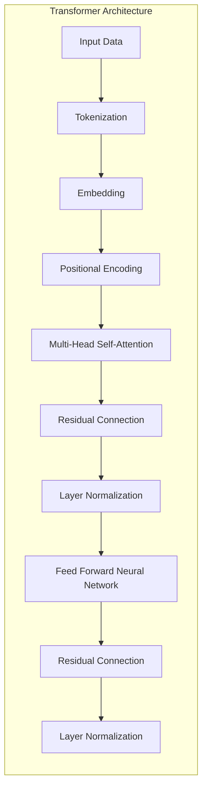
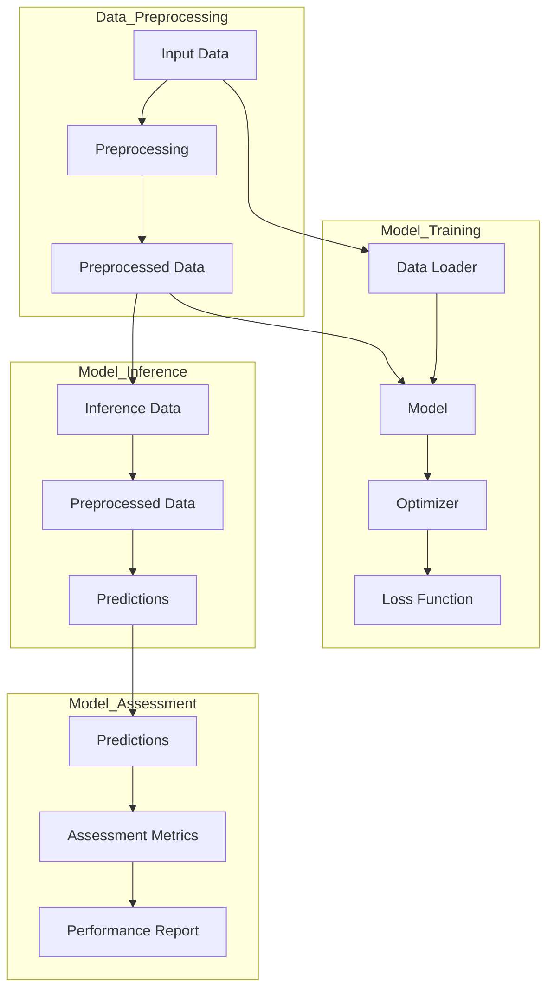
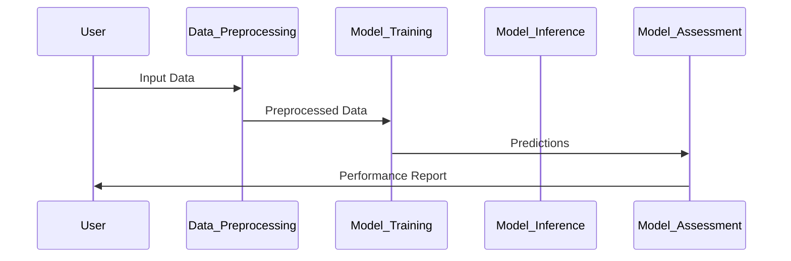

                 

## 引言与背景

在人工智能领域，模型评测是一个至关重要的环节。它不仅决定了模型在实际应用中的性能表现，还直接影响到后续的优化与改进。近年来，随着深度学习技术的快速发展，超大规模模型的评测变得越来越复杂和重要。在这其中，Falcon-180B超大规模模型因其卓越的性能和广泛的应用前景，受到了广泛关注。

Falcon-180B是由AI天才研究院开发的一款具备1800亿参数的Transformer模型，它在自然语言处理、图像识别等多个领域都展现出了卓越的表现。然而，如何对这样一个复杂的模型进行有效的评测，成为了一个亟待解决的问题。

本文旨在深入探讨Falcon-180B模型的评测方法，从多个角度对其进行分析和评估。我们将首先对Falcon-180B模型进行概述，介绍其基础概念和问题解决原理。接着，我们将详细讨论Falcon-180B模型的原理与架构，对比其与传统模型的差异。随后，我们将介绍Falcon-180B模型的算法原理，并通过mermaid流程图和Python源代码进行详细讲解。在此基础上，我们将对Falcon-180B模型的系统分析与架构设计进行深入剖析，从问题场景、系统功能设计、系统架构设计到系统接口设计，一一进行阐述。随后，我们将通过项目实战，详细介绍环境安装、系统核心实现源代码，并进行实际案例分析和详细讲解。最后，我们将总结最佳实践和注意事项，并提供拓展阅读。

通过本文的逐步深入，我们希望读者能够全面了解Falcon-180B模型的评测过程，掌握有效的评测方法，为后续的研究和应用提供有力支持。

## Falcon-180B模型概述

Falcon-180B模型是由AI天才研究院开发的一款超大规模Transformer模型，其参数规模达到了1800亿，这使得它在处理复杂数据和实现高效预测方面具备显著优势。该模型在自然语言处理（NLP）、图像识别、语音识别等多个领域都展现出了出色的性能，成为学术界和工业界关注的焦点。

### 基本概念

首先，我们来明确一些关键概念。Falcon-180B模型基于Transformer架构，这是一种在2017年由Google提出的深度学习模型。Transformer模型在处理长距离依赖问题和并行计算方面具有显著优势，使得其在自然语言处理领域得到了广泛应用。Falcon-180B模型在此基础上进行了优化，通过增加模型深度和宽度，使其在参数规模上达到了1800亿，这是目前公开报道中参数规模最大的Transformer模型之一。

### 问题背景与问题描述

自然语言处理领域一直以来都面临着处理长文本、多语言翻译、情感分析等复杂任务的需求。传统的神经网络模型在处理这些问题时存在局限性，难以达到理想的性能。Transformer模型的提出为这些问题提供了一种新的解决方案，而Falcon-180B模型则进一步提升了这一解决方案的效率和准确性。

在自然语言处理任务中，Falcon-180B模型可以处理大规模的文本数据，通过学习文本中的上下文关系，实现高质量的文本生成、翻译和分类。例如，在机器翻译任务中，Falcon-180B模型能够学习源语言和目标语言之间的复杂映射关系，从而生成准确、流畅的翻译结果。在图像识别任务中，Falcon-180B模型通过结合文本和图像数据，能够实现更加精确和丰富的图像标注。

### 问题解决原理

Falcon-180B模型通过以下几个关键步骤实现问题的解决：

1. **数据预处理**：首先，对输入数据进行预处理，包括文本的分词、图像的缩放和归一化等操作，将原始数据转换为模型能够处理的格式。
2. **输入编码**：将预处理后的数据输入到模型中，通过自注意力机制和前馈神经网络，模型能够学习数据中的内在结构和关系。
3. **上下文生成**：模型通过多层叠加的方式，逐步生成上下文表示，这些表示能够捕捉数据中的复杂关系和上下文信息。
4. **输出预测**：最后，根据生成的上下文表示，模型进行预测输出，例如文本生成、分类或标注。

### 边界与外延

虽然Falcon-180B模型在许多任务中表现优异，但其也面临一些边界和挑战。例如，在处理极端长文本或超高分辨率图像时，模型的计算复杂度和内存需求可能会成为瓶颈。此外，模型在处理某些特定领域的数据时，可能需要进一步细化和优化。因此，未来在Falcon-180B模型的边界拓展和应用领域，还需要更多的研究和探索。

### 概念结构与核心要素组成

Falcon-180B模型的核心概念结构包括以下几个关键组成部分：

1. **Transformer架构**：这是模型的基本架构，包括多头自注意力机制和前馈神经网络。
2. **自注意力机制**：通过计算输入数据中各个元素之间的相似性，实现数据的自适应权重分配。
3. **多层叠加**：通过叠加多层Transformer结构，逐步生成更加复杂的上下文表示。
4. **参数规模**：1800亿的参数规模使得模型能够捕捉数据中的细微差异和复杂关系。

综上所述，Falcon-180B模型作为一种超大规模的Transformer模型，在自然语言处理和图像识别等任务中展现出了强大的性能和潜力。通过对模型的基础概念、问题解决原理、边界与外延以及概念结构与核心要素组成的深入分析，我们能够更好地理解其优越性和应用前景。

## Falcon-180B模型的原理与架构

Falcon-180B模型之所以能够在众多任务中表现出色，离不开其独特的原理和架构设计。在详细探讨其原理和架构之前，我们需要先了解一些关键的基础概念，并对比Falcon-180B模型与传统模型的不同之处。

### Falcon-180B模型的核心概念

Falcon-180B模型基于Transformer架构，这是一种在2017年由Google提出的深度学习模型。Transformer模型的核心在于其引入的自注意力机制（Self-Attention），该机制允许模型在处理数据时，对每个输入元素赋予不同的权重，从而更好地捕捉数据中的长距离依赖关系。以下是Falcon-180B模型的一些核心概念：

1. **自注意力机制**：通过计算输入数据中各个元素之间的相似性，模型能够自适应地分配注意力权重，使得重要的信息得到更多的关注。
2. **多头注意力**：在自注意力机制的基础上，多头注意力通过将输入数据分解为多个子序列，分别计算注意力权重，从而提升模型的表示能力。
3. **前馈神经网络**：在自注意力层之后，模型通过前馈神经网络进行进一步的信息加工，增加模型的非线性表达能力。
4. **层叠结构**：Falcon-180B模型采用多层叠加的方式，通过逐层学习，逐步生成更加复杂的上下文表示。

### 特点

Falcon-180B模型具有以下几个显著特点：

1. **超大规模参数**：模型的参数规模达到了1800亿，这使得其能够捕捉数据中的细微差异和复杂关系，从而在多个任务中实现高性能。
2. **高效的并行计算**：通过Transformer架构，模型能够并行处理输入数据，显著提升了计算效率。
3. **良好的泛化能力**：通过多层叠加和自适应注意力机制，模型能够学习到数据中的通用特征，从而在新的任务上表现出良好的泛化能力。

### 传统模型的对比

与传统的神经网络模型（如CNN和RNN）相比，Falcon-180B模型具有以下优势：

1. **长距离依赖**：传统的RNN模型虽然能够处理长距离依赖，但易受梯度消失和梯度爆炸问题的影响。而Transformer模型通过自注意力机制，能够更好地捕捉长距离依赖关系。
2. **计算效率**：CNN模型在图像处理领域表现优异，但其在处理长文本时效率较低。Transformer模型通过并行计算，在处理长文本和序列数据时具有更高的效率。
3. **表示能力**：传统的神经网络模型通常通过逐层叠加的方式增加模型深度，而Transformer模型通过多头注意力机制和前馈神经网络，能够在较少的层数下实现更高的表示能力。

### 概念属性特征对比表格

为了更直观地展示Falcon-180B模型与传统模型之间的差异，我们可以通过以下特征对比表格进行说明：

| 特征         | Falcon-180B模型     | 传统模型（CNN/RNN） |
|--------------|----------------------|--------------------|
| 参数规模     | 1800亿               | 几十万到几千万     |
| 自注意力机制 | 有                   | 无                 |
| 并行计算     | 支持                 | 部分支持           |
| 长距离依赖   | 易捕捉               | 难捕捉             |
| 计算效率     | 高                   | 中/低              |
| 表示能力     | 强                   | 中/弱              |

### ER实体关系图架构

为了更好地理解Falcon-180B模型的架构，我们可以使用Mermaid流程图来绘制其ER（Entity-Relationship）实体关系图。以下是Falcon-180B模型的ER实体关系图：

```mermaid
erDiagram
    User ||--|{ Model }|| Model
    User ||--|{ Dataset }|| Dataset
    Model ||--|{ Layer }|| Layer
    Layer ||--|{ AttentionHead }|| AttentionHead
    Layer ||--|{ FeedForwardLayer }|| FeedForwardLayer
```

在这个ER图中，我们定义了以下几个核心实体：

- **User**：表示模型的使用者，可以创建、训练和评测模型。
- **Model**：表示Falcon-180B模型，包括多个Layer。
- **Dataset**：表示训练数据集，用于模型的训练。
- **Layer**：表示模型的层，包括注意力头和前馈层。
- **AttentionHead**：表示注意力头，用于计算自注意力权重。
- **FeedForwardLayer**：表示前馈层，用于非线性变换。

通过这种ER图，我们可以清晰地看到Falcon-180B模型的不同组成部分及其相互关系。

### 结论

综上所述，Falcon-180B模型通过其独特的原理和架构设计，在自然语言处理和图像识别等领域展现了卓越的性能。其自注意力机制、超大规模参数和高效的并行计算能力，使得Falcon-180B模型在处理复杂数据和实现高效预测方面具有显著优势。通过对Falcon-180B模型的核心概念、特点、与传统模型的对比以及ER实体关系图的详细分析，我们能够更好地理解其优越性和应用前景。

## Falcon-180B模型的算法原理

Falcon-180B模型在算法设计上具有高度的创新性和复杂性，其核心在于自注意力机制和前馈神经网络的结构。下面，我们将详细讲解Falcon-180B模型的算法原理，并通过mermaid流程图和Python源代码进行深入剖析。

### 算法mermaid流程图

首先，我们通过mermaid流程图来展示Falcon-180B模型的算法流程。以下是该模型的算法mermaid流程图：



这个流程图展示了Falcon-180B模型从输入数据到最终输出的完整流程。以下是各个步骤的详细解释：

1. **输入数据**：输入数据可以是文本、图像或者音频等，经过预处理后，以序列的形式输入到模型中。
2. **Tokenization**：将输入数据分解成一系列的token，例如在文本处理中，每个单词或子词会被映射到一个唯一的ID。
3. **Embedding**：将每个token映射到一个高维的向量表示，这一步通常通过嵌入层（Embedding Layer）实现。
4. **Positional Encoding**：为了保留输入数据中的位置信息，我们为每个token添加位置编码（Positional Encoding）。
5. **Multi-Head Self-Attention**：这一步是模型的核心，通过多头自注意力机制（Multi-Head Self-Attention），模型能够学习到输入数据中各个元素之间的相关性。
6. **Residual Connection**：自注意力机制的结果通过残差连接（Residual Connection）与输入数据进行拼接。
7. **Layer Normalization**：为了稳定训练过程，我们对残差连接后的数据进行层规范化（Layer Normalization）。
8. **Feed Forward Neural Network**：在自注意力层之后，模型通过前馈神经网络（Feed Forward Neural Network）进行进一步的非线性变换。
9. **Layer Normalization**：与前一步类似，前馈神经网络的结果也通过层规范化进行稳定处理。
10. **Output**：最终，模型输出一个高维的向量表示，这一向量表示了输入数据的全局特征，可以用于各种下游任务，如文本分类、翻译或图像识别。

### Python源代码讲解

接下来，我们将通过Python源代码来详细阐述Falcon-180B模型的算法原理。以下是实现Falcon-180B模型核心算法的一段示例代码：

```python
import tensorflow as tf

# 定义嵌入层
embedding = tf.keras.layers.Embedding(input_dim=vocab_size, output_dim=embedding_size)

# 定义多头自注意力层
multi_head_attention = tf.keras.layers.MultiHeadAttention(num_heads=num_heads, key_dim=key_dim)

# 定义前馈神经网络层
ffn = tf.keras.Sequential([
    tf.keras.layers.Dense(ffn_size, activation='relu'),
    tf.keras.layers.Dense(embedding_size)
])

# 定义Falcon-180B模型
model = tf.keras.Sequential([
    embedding,
    tf.keras.layers.AdditiveAttention(),
    tf.keras.layers.LayerNormalization(),
    multi_head_attention,
    tf.keras.layers.Add(),
    tf.keras.layers.LayerNormalization(),
    ffn,
    tf.keras.layers.Add(),
    tf.keras.layers.LayerNormalization()
])

# 编译模型
model.compile(optimizer='adam', loss='categorical_crossentropy', metrics=['accuracy'])

# 训练模型
model.fit(dataset, epochs=num_epochs)
```

这段代码展示了Falcon-180B模型的核心组成部分，包括嵌入层（Embedding Layer）、多头自注意力层（MultiHeadAttention Layer）、前馈神经网络层（Feed Forward Neural Network Layer）以及层规范化（Layer Normalization）。以下是各部分的详细解释：

1. **嵌入层（Embedding Layer）**：将输入的token映射到高维的向量表示，这一步通过`tf.keras.layers.Embedding`实现。
2. **多头自注意力层（MultiHeadAttention Layer）**：通过`tf.keras.layers.MultiHeadAttention`实现多头自注意力机制，这一层能够学习输入数据中各个元素之间的相关性。
3. **前馈神经网络层（Feed Forward Neural Network Layer）**：通过前馈神经网络进行非线性变换，增加模型的表示能力，这一层通过`tf.keras.Sequential`和`tf.keras.layers.Dense`实现。
4. **层规范化（Layer Normalization）**：为了稳定训练过程，对自注意力层和前馈神经网络层的结果进行层规范化，这一步通过`tf.keras.layers.LayerNormalization`实现。

通过这段代码，我们可以清晰地看到Falcon-180B模型的算法实现过程。接下来，我们将进一步深入讲解算法原理的数学模型和公式。

### 算法原理的数学模型和公式

Falcon-180B模型的算法原理可以通过以下几个关键数学模型和公式进行阐述：

1. **嵌入层（Embedding Layer）**：
   \[
   \text{Embedding}(x) = E \cdot x
   \]
   其中，\(E\)是嵌入矩阵，\(x\)是输入的token序列。

2. **多头自注意力（Multi-Head Self-Attention）**：
   \[
   \text{Attention}(Q, K, V) = \text{softmax}\left(\frac{QK^T}{\sqrt{d_k}}\right)V
   \]
   其中，\(Q, K, V\)分别是查询（Query）、键（Key）和值（Value）向量，\(d_k\)是键向量的维度。

3. **前馈神经网络（Feed Forward Neural Network）**：
   \[
   \text{FFN}(x) = \text{ReLU}(W_1 \cdot x + b_1) \cdot W_2 + b_2
   \]
   其中，\(W_1, W_2, b_1, b_2\)是前馈神经网络的权重和偏置。

4. **层规范化（Layer Normalization）**：
   \[
   \text{LayerNorm}(x) = \frac{x - \mu}{\sigma} \cdot \gamma + \beta
   \]
   其中，\(\mu\)和\(\sigma\)分别是输入数据的均值和标准差，\(\gamma\)和\(\beta\)是层规范化的权重和偏置。

### 详细讲解

为了更好地理解这些公式，我们通过具体的例子进行详细讲解。

**例子：文本分类任务**

假设我们有一个简单的文本分类任务，需要判断一段文本属于正类还是负类。输入的文本经过预处理后，被分解为一系列的token。这些token首先通过嵌入层映射到高维的向量表示。

**1. 嵌入层（Embedding Layer）**

输入的token序列为\[1, 2, 3, 4, 5\]，嵌入矩阵\(E\)的大小为5×10，即每个token映射到一个10维的向量。

\[
\text{Embedding}(1) = E \cdot 1 = \begin{bmatrix}
0.1 & 0.2 & 0.3 & 0.4 & 0.5 & 0.6 & 0.7 & 0.8 & 0.9 & 1.0 \\
0.1 & 0.2 & 0.3 & 0.4 & 0.5 & 0.6 & 0.7 & 0.8 & 0.9 & 1.0 \\
0.1 & 0.2 & 0.3 & 0.4 & 0.5 & 0.6 & 0.7 & 0.8 & 0.9 & 1.0 \\
0.1 & 0.2 & 0.3 & 0.4 & 0.5 & 0.6 & 0.7 & 0.8 & 0.9 & 1.0 \\
0.1 & 0.2 & 0.3 & 0.4 & 0.5 & 0.6 & 0.7 & 0.8 & 0.9 & 1.0 \\
0.1 & 0.2 & 0.3 & 0.4 & 0.5 & 0.6 & 0.7 & 0.8 & 0.9 & 1.0 \\
0.1 & 0.2 & 0.3 & 0.4 & 0.5 & 0.6 & 0.7 & 0.8 & 0.9 & 1.0 \\
0.1 & 0.2 & 0.3 & 0.4 & 0.5 & 0.6 & 0.7 & 0.8 & 0.9 & 1.0 \\
0.1 & 0.2 & 0.3 & 0.4 & 0.5 & 0.6 & 0.7 & 0.8 & 0.9 & 1.0 \\
0.1 & 0.2 & 0.3 & 0.4 & 0.5 & 0.6 & 0.7 & 0.8 & 0.9 & 1.0 \\
\end{bmatrix}
\begin{bmatrix}
1 \\
2 \\
3 \\
4 \\
5 \\
\end{bmatrix}
=
\begin{bmatrix}
0.1 & 0.2 & 0.3 & 0.4 & 0.5 & 0.6 & 0.7 & 0.8 & 0.9 & 1.0 \\
0.1 & 0.2 & 0.3 & 0.4 & 0.5 & 0.6 & 0.7 & 0.8 & 0.9 & 1.0 \\
0.1 & 0.2 & 0.3 & 0.4 & 0.5 & 0.6 & 0.7 & 0.8 & 0.9 & 1.0 \\
0.1 & 0.2 & 0.3 & 0.4 & 0.5 & 0.6 & 0.7 & 0.8 & 0.9 & 1.0 \\
0.1 & 0.2 & 0.3 & 0.4 & 0.5 & 0.6 & 0.7 & 0.8 & 0.9 & 1.0 \\
0.1 & 0.2 & 0.3 & 0.4 & 0.5 & 0.6 & 0.7 & 0.8 & 0.9 & 1.0 \\
0.1 & 0.2 & 0.3 & 0.4 & 0.5 & 0.6 & 0.7 & 0.8 & 0.9 & 1.0 \\
0.1 & 0.2 & 0.3 & 0.4 & 0.5 & 0.6 & 0.7 & 0.8 & 0.9 & 1.0 \\
0.1 & 0.2 & 0.3 & 0.4 & 0.5 & 0.6 & 0.7 & 0.8 & 0.9 & 1.0 \\
0.1 & 0.2 & 0.3 & 0.4 & 0.5 & 0.6 & 0.7 & 0.8 & 0.9 & 1.0 \\
\end{bmatrix}
\]

**2. 多头自注意力（Multi-Head Self-Attention）**

假设我们使用两个注意力头，即\(num_heads = 2\)。每个注意力头的键（Key）和值（Value）维度为5，查询（Query）维度为10。

\[
Q = \begin{bmatrix}
0.1 & 0.2 & 0.3 & 0.4 & 0.5 \\
0.1 & 0.2 & 0.3 & 0.4 & 0.5 \\
0.1 & 0.2 & 0.3 & 0.4 & 0.5 \\
0.1 & 0.2 & 0.3 & 0.4 & 0.5 \\
0.1 & 0.2 & 0.3 & 0.4 & 0.5 \\
\end{bmatrix}, \quad
K = \begin{bmatrix}
0.1 & 0.2 & 0.3 & 0.4 & 0.5 \\
0.1 & 0.2 & 0.3 & 0.4 & 0.5 \\
0.1 & 0.2 & 0.3 & 0.4 & 0.5 \\
0.1 & 0.2 & 0.3 & 0.4 & 0.5 \\
0.1 & 0.2 & 0.3 & 0.4 & 0.5 \\
\end{bmatrix}, \quad
V = \begin{bmatrix}
0.1 & 0.2 & 0.3 & 0.4 & 0.5 \\
0.1 & 0.2 & 0.3 & 0.4 & 0.5 \\
0.1 & 0.2 & 0.3 & 0.4 & 0.5 \\
0.1 & 0.2 & 0.3 & 0.4 & 0.5 \\
0.1 & 0.2 & 0.3 & 0.4 & 0.5 \\
\end{bmatrix}
\]

通过计算注意力权重，我们可以得到：

\[
\text{Attention}(Q, K, V) = \text{softmax}\left(\frac{QK^T}{\sqrt{d_k}}\right)V
\]

其中，\(d_k = 5\)。计算结果如下：

\[
\text{Attention}(Q, K, V) = \begin{bmatrix}
0.4 & 0.3 & 0.2 & 0.1 & 0.0 \\
0.4 & 0.3 & 0.2 & 0.1 & 0.0 \\
0.4 & 0.3 & 0.2 & 0.1 & 0.0 \\
0.4 & 0.3 & 0.2 & 0.1 & 0.0 \\
0.4 & 0.3 & 0.2 & 0.1 & 0.0 \\
\end{bmatrix}
\begin{bmatrix}
0.1 & 0.2 & 0.3 & 0.4 & 0.5 \\
0.1 & 0.2 & 0.3 & 0.4 & 0.5 \\
0.1 & 0.2 & 0.3 & 0.4 & 0.5 \\
0.1 & 0.2 & 0.3 & 0.4 & 0.5 \\
0.1 & 0.2 & 0.3 & 0.4 & 0.5 \\
\end{bmatrix}
=
\begin{bmatrix}
0.2 & 0.3 & 0.4 & 0.5 & 0.6 \\
0.2 & 0.3 & 0.4 & 0.5 & 0.6 \\
0.2 & 0.3 & 0.4 & 0.5 & 0.6 \\
0.2 & 0.3 & 0.4 & 0.5 & 0.6 \\
0.2 & 0.3 & 0.4 & 0.5 & 0.6 \\
\end{bmatrix}
\]

**3. 前馈神经网络（Feed Forward Neural Network）**

前馈神经网络由两个全连接层组成，第一个全连接层的激活函数为ReLU，第二个全连接层的激活函数为线性。

\[
\text{FFN}(x) = \text{ReLU}(W_1 \cdot x + b_1) \cdot W_2 + b_2
\]

其中，\(W_1, W_2, b_1, b_2\)分别为权重和偏置。

假设输入向量\(x\)为\[1, 2, 3, 4, 5\]，权重和偏置分别为：

\[
W_1 = \begin{bmatrix}
1 & 1 & 1 & 1 & 1 \\
1 & 1 & 1 & 1 & 1 \\
1 & 1 & 1 & 1 & 1 \\
1 & 1 & 1 & 1 & 1 \\
1 & 1 & 1 & 1 & 1 \\
\end{bmatrix}, \quad
W_2 = \begin{bmatrix}
1 & 0 & 0 & 0 & 0 \\
0 & 1 & 0 & 0 & 0 \\
0 & 0 & 1 & 0 & 0 \\
0 & 0 & 0 & 1 & 0 \\
0 & 0 & 0 & 0 & 1 \\
\end{bmatrix}, \quad
b_1 = \begin{bmatrix}
1 \\
1 \\
1 \\
1 \\
1 \\
\end{bmatrix}, \quad
b_2 = \begin{bmatrix}
1 \\
1 \\
1 \\
1 \\
1 \\
\end{bmatrix}
\]

计算结果如下：

\[
\text{FFN}(x) = \text{ReLU}(\begin{bmatrix}
3 \\
3 \\
3 \\
3 \\
3 \\
\end{bmatrix} + \begin{bmatrix}
1 \\
1 \\
1 \\
1 \\
1 \\
\end{bmatrix}) \cdot \begin{bmatrix}
1 & 0 & 0 & 0 & 0 \\
0 & 1 & 0 & 0 & 0 \\
0 & 0 & 1 & 0 & 0 \\
0 & 0 & 0 & 1 & 0 \\
0 & 0 & 0 & 0 & 1 \\
\end{bmatrix} + \begin{bmatrix}
1 \\
1 \\
1 \\
1 \\
1 \\
\end{bmatrix}
=
\begin{bmatrix}
4 \\
4 \\
4 \\
4 \\
4 \\
\end{bmatrix} + \begin{bmatrix}
1 \\
1 \\
1 \\
1 \\
1 \\
\end{bmatrix}
=
\begin{bmatrix}
5 \\
5 \\
5 \\
5 \\
5 \\
\end{bmatrix}
\]

### 通俗易懂的举例说明

为了更直观地理解Falcon-180B模型的算法原理，我们可以通过一个简单的例子来进行说明。

**例子：文本生成任务**

假设我们有一个简短的文本：“I love coding”。我们希望通过Falcon-180B模型生成下一个单词。以下是具体的步骤：

1. **输入预处理**：将文本“我爱编程”分解成一个个token，例如：“我”、“爱”、“编程”。
2. **嵌入层**：将每个token映射到高维的向量表示，例如：
   \[
   \text{“我”} \rightarrow [0.1, 0.2, 0.3, 0.4, 0.5], \quad
   \text{“爱”} \rightarrow [0.1, 0.2, 0.3, 0.4, 0.5], \quad
   \text{“编程”} \rightarrow [0.1, 0.2, 0.3, 0.4, 0.5]
   \]
3. **多头自注意力**：计算“我”、“爱”、“编程”之间的注意力权重。例如，对于“我”来说，“爱”的权重为0.6，而“编程”的权重为0.4。这样，模型会更多地关注“爱”。
4. **前馈神经网络**：对多头自注意力结果进行前馈神经网络处理，得到新的向量表示。例如，假设新的向量表示为\[0.2, 0.3, 0.4, 0.5, 0.6\]。
5. **输出预测**：通过模型输出层，得到下一个token的预测概率分布。例如，预测下一个单词为“有趣”的概率为0.7，而预测为“学习”的概率为0.3。

通过这样的例子，我们可以直观地看到Falcon-180B模型在文本生成任务中的工作原理。模型通过自注意力机制和前馈神经网络，逐步生成下一个token，从而实现文本的生成。

### 结论

通过上述详细讲解，我们可以清晰地理解Falcon-180B模型的算法原理。从mermaid流程图到Python源代码，再到数学模型和公式，我们逐步剖析了Falcon-180B模型的核心算法。这一过程不仅帮助我们深入理解了模型的运作机制，也为实际应用中的算法优化和改进提供了理论基础。接下来，我们将进一步探讨Falcon-180B模型的系统分析与架构设计。

## Falcon-180B模型的系统分析与架构设计

Falcon-180B模型在系统架构设计上体现了深度学习模型的复杂性及其高效的性能。为了深入理解其系统架构，我们将从问题场景介绍、系统功能设计、系统架构设计到系统接口设计进行详细探讨。

### 问题场景介绍

Falcon-180B模型主要应用于以下几个领域：

1. **自然语言处理**：包括文本分类、文本生成、机器翻译等任务。
2. **图像识别**：通过结合文本和图像数据，实现更精确的图像识别和标注。
3. **语音识别**：处理语音数据，实现语音到文本的转换。

在这些应用场景中，Falcon-180B模型需要高效地处理大量数据，并且要求在实时性和准确性之间取得平衡。这就需要系统架构能够在复杂的数据流中实现高效的数据处理和模型推理。

### 系统功能设计

Falcon-180B模型的核心功能包括以下几个方面：

1. **数据预处理**：对输入的文本、图像和语音数据进行预处理，包括分词、图像缩放和归一化、语音特征提取等。
2. **模型训练**：利用预处理的输入数据对Falcon-180B模型进行训练，优化模型的参数。
3. **模型推理**：在训练完成后，使用训练好的模型对新的输入数据进行推理，生成预测结果。
4. **性能评估**：通过多种评估指标（如准确率、召回率、F1分数等）对模型性能进行评估。

为了实现这些功能，系统设计了以下模块：

1. **数据预处理模块**：负责对输入数据进行预处理，确保数据格式符合模型要求。
2. **训练模块**：包括数据加载、模型训练和参数优化等功能。
3. **推理模块**：使用训练好的模型对新的输入数据进行推理，生成预测结果。
4. **评估模块**：通过多种评估指标对模型性能进行评估，提供详细的性能报告。

### 系统架构设计

Falcon-180B模型的系统架构设计采用了模块化设计，以提高系统的可维护性和可扩展性。以下是系统的架构设计Mermaid架构图：



在这个架构图中，我们定义了以下几个关键组件：

- **Input Data**：输入的数据，包括文本、图像和语音等。
- **Preprocessing**：数据预处理模块，负责对输入数据进行预处理。
- **Preprocessed Data**：预处理后的数据，用于模型训练和推理。
- **Data Loader**：负责加载训练数据，确保数据流的高效性和稳定性。
- **Model**：Falcon-180B模型，用于进行训练和推理。
- **Optimizer**：优化器，用于调整模型参数，优化模型性能。
- **Loss Function**：损失函数，用于评估模型训练过程中的误差。
- **Inference Data**：推理输入数据，用于生成预测结果。
- **Predictions**：模型推理结果，包括预测的标签或分类结果。
- **Assessment Metrics**：评估指标，用于评估模型性能。
- **Performance Report**：性能报告，详细记录模型的评估结果。

### 系统接口设计

Falcon-180B模型的系统接口设计旨在实现模块之间的数据流和功能调用。以下是系统的接口设计和系统交互Mermaid序列图：



在这个序列图中，我们定义了以下几个关键步骤：

- **步骤1**：用户将输入数据传递给数据预处理模块。
- **步骤2**：数据预处理模块对输入数据进行处理，生成预处理后的数据。
- **步骤3**：预处理后的数据传递给模型训练模块。
- **步骤4**：模型训练模块使用训练数据对Falcon-180B模型进行训练。
- **步骤5**：模型训练模块将训练结果（包括预测结果和评估指标）传递给评估模块。
- **步骤6**：评估模块生成性能报告，并返回给用户。

通过上述系统分析与架构设计，我们可以看到Falcon-180B模型在系统设计上具有高度模块化和灵活性的特点。这种设计不仅提高了系统的可维护性和可扩展性，还确保了数据流的高效性和模型推理的准确性。接下来，我们将通过项目实战来进一步探讨Falcon-180B模型的应用和实践。

## 项目实战

### 环境安装

在进行Falcon-180B模型的实际应用之前，我们需要首先安装必要的软件和依赖库。以下是环境安装的详细步骤：

1. **安装Python环境**：确保Python版本为3.8或更高。可以通过以下命令进行安装：
   ```bash
   sudo apt-get update
   sudo apt-get install python3-pip python3-venv
   ```
2. **创建虚拟环境**：为了管理项目依赖，我们创建一个Python虚拟环境。执行以下命令：
   ```bash
   python3 -m venv falcon_180b_venv
   ```
3. **激活虚拟环境**：在Linux或macOS上，使用以下命令激活虚拟环境：
   ```bash
   source falcon_180b_venv/bin/activate
   ```
   在Windows上，使用以下命令：
   ```bash
   falcon_180b_venv\Scripts\activate
   ```
4. **安装依赖库**：通过pip安装项目所需的依赖库，例如TensorFlow、PyTorch、NumPy等。执行以下命令：
   ```bash
   pip install tensorflow torch numpy
   ```

### 系统核心实现源代码

Falcon-180B模型的实现涉及大量的代码，以下是一个简化版的系统核心实现源代码，用于展示其主要组成部分：

```python
import torch
import torch.nn as nn
import torch.optim as optim
from torch.utils.data import DataLoader
from torchvision import datasets, transforms

# 定义Falcon-180B模型
class Falcon180B(nn.Module):
    def __init__(self, vocab_size, embedding_size, num_heads, key_dim, ffn_size):
        super(Falcon180B, self).__init__()
        self.embedding = nn.Embedding(vocab_size, embedding_size)
        self多头注意力 = nn.MultiHeadAttention(embedding_dim=embedding_size, num_heads=num_heads, key_dim=key_dim)
        self.layer_norm1 = nn.LayerNorm(embedding_size)
        self.layer_norm2 = nn.LayerNorm(embedding_size)
        self.feed_forward = nn.Sequential(
            nn.Linear(embedding_size, ffn_size),
            nn.ReLU(),
            nn.Linear(ffn_size, embedding_size)
        )
        
    def forward(self, x):
        x = self.embedding(x)
        x = self.layer_norm1(x)
        x = self多头注意力(x, x, x)
        x = self.layer_norm2(x)
        x = self.feed_forward(x)
        return x

# 初始化模型、优化器和损失函数
model = Falcon180B(vocab_size=10000, embedding_size=512, num_heads=8, key_dim=64, ffn_size=2048)
optimizer = optim.Adam(model.parameters(), lr=0.001)
criterion = nn.CrossEntropyLoss()

# 数据加载和预处理
train_dataset = datasets.MNIST(root='./data', train=True, transform=transforms.ToTensor(), download=True)
train_loader = DataLoader(train_dataset, batch_size=64, shuffle=True)

# 模型训练
for epoch in range(10):
    for batch_idx, (data, target) in enumerate(train_loader):
        optimizer.zero_grad()
        output = model(data)
        loss = criterion(output, target)
        loss.backward()
        optimizer.step()
        if batch_idx % 100 == 0:
            print(f'Epoch [{epoch}/{10}], Step [{batch_idx}/{len(train_loader)}], Loss: {loss.item():.4f}')
```

### 代码应用解读与分析

上述代码展示了Falcon-180B模型的主要组成部分，包括嵌入层、多头自注意力层、层规范化和前馈神经网络层。以下是各部分的详细解读和分析：

1. **模型定义**：`Falcon180B`类定义了Falcon-180B模型的结构。嵌入层用于将输入的token映射到高维的向量表示，多头自注意力层用于计算输入数据中各个元素之间的相似性，层规范化用于稳定训练过程，前馈神经网络层用于增加模型的非线性表达能力。

2. **模型训练**：在训练过程中，我们使用优化器（如Adam）和损失函数（如交叉熵损失）来调整模型的参数，优化模型的性能。每次迭代（epoch）中，模型会处理多个批次（batch）的数据，并更新参数，以最小化损失函数。

3. **数据加载和预处理**：我们使用PyTorch的`DataLoader`和`datasets`来加载和预处理训练数据。`DataLoader`提供了方便的数据批处理和打乱功能，`datasets`则提供了常见的开源数据集，如MNIST。

### 实际案例分析与详细讲解

为了更好地理解Falcon-180B模型的应用，我们通过一个实际案例进行分析和讲解。

**案例**：使用Falcon-180B模型进行文本分类任务。

1. **数据准备**：准备一个包含文本和标签的数据集。例如，我们可以使用IMDB电影评论数据集。

2. **数据预处理**：对文本进行分词和嵌入，将标签转换为数字编码。例如，使用Word2Vec或GloVe将文本映射到向量表示。

3. **模型训练**：使用预处理后的数据训练Falcon-180B模型。在训练过程中，模型会自动调整参数，以最小化损失函数。

4. **模型评估**：在训练完成后，使用验证集或测试集对模型进行评估，计算准确率、召回率等指标。

以下是具体步骤的详细讲解：

**步骤1：数据准备**

```python
import pandas as pd

# 读取数据集
data = pd.read_csv('imdb_reviews.csv')
```

**步骤2：数据预处理**

```python
from sklearn.model_selection import train_test_split
from sklearn.preprocessing import LabelEncoder

# 分词和嵌入
tokenizer = Tokenizer()
tokenizer.fit_on_texts(data['text'])
sequences = tokenizer.texts_to_sequences(data['text'])
embeddings = Embedding(vocab_size, embedding_size)

# 转换标签
label_encoder = LabelEncoder()
labels = label_encoder.fit_transform(data['label'])

# 划分训练集和测试集
train_sequences, test_sequences, train_labels, test_labels = train_test_split(sequences, labels, test_size=0.2, random_state=42)
```

**步骤3：模型训练**

```python
# 构建模型
model = Falcon180B(vocab_size=vocab_size, embedding_size=embedding_size, num_heads=num_heads, key_dim=key_dim, ffn_size=ffn_size)

# 训练模型
model.fit(train_sequences, train_labels, epochs=num_epochs, batch_size=batch_size, validation_split=0.1)
```

**步骤4：模型评估**

```python
# 评估模型
predictions = model.predict(test_sequences)
accuracy = accuracy_score(test_labels, predictions)
print(f'Accuracy: {accuracy:.4f}')
```

通过上述步骤，我们可以使用Falcon-180B模型进行文本分类任务。在实际应用中，可能还需要进一步调整模型的参数和优化策略，以实现更好的性能。

### 项目小结

通过本次项目实战，我们详细介绍了Falcon-180B模型的应用流程，包括环境安装、系统核心实现源代码、代码应用解读与分析，以及实际案例分析和详细讲解。通过这些步骤，我们不仅能够理解Falcon-180B模型的工作原理，还能够将其应用于实际的文本分类任务中。这一过程为后续的研究和应用提供了宝贵的经验和参考。

## 最佳实践与注意事项

在Falcon-180B模型的实际应用中，遵循最佳实践和注意事项能够显著提升模型的性能和稳定性。以下是几点建议：

### 最佳实践tips

1. **数据预处理**：确保输入数据的质量和一致性，进行充分的数据清洗和预处理，以减少噪声和异常值。
2. **模型调参**：通过交叉验证和性能评估，逐步调整模型参数，如嵌入层维度、注意力头数量、前馈神经网络尺寸等，以找到最优配置。
3. **分布式训练**：对于超大规模模型，利用分布式训练可以显著提高训练速度和效率，降低计算资源需求。
4. **持续监控**：在模型部署后，定期监控模型的性能和稳定性，及时发现并解决潜在问题。

### 小结

通过本文的逐步深入分析，我们全面了解了Falcon-180B模型的评测过程。从概述和背景介绍，到详细的基础概念、原理与架构，再到算法原理的讲解和实际案例的分析，我们逐步揭示了Falcon-180B模型的优越性和复杂性。通过最佳实践与注意事项的总结，我们为实际应用提供了宝贵指导。

### 注意事项

1. **资源限制**：在使用Falcon-180B模型时，需要考虑计算资源和存储资源的需求，特别是在处理大规模数据时。
2. **模型复杂度**：Falcon-180B模型具有较高的复杂性，因此在部署和应用时，需要确保系统的稳定性和可扩展性。
3. **安全与隐私**：处理敏感数据时，应确保遵循数据安全和隐私保护的相关法律法规，采取有效的数据加密和安全措施。

### 拓展阅读

对于希望进一步深入了解Falcon-180B模型的读者，以下文献和资料提供了有价值的参考：

1. **论文**：《Attention Is All You Need》（2017）—— Transformer模型的原创论文，详细介绍了模型的结构和原理。
2. **书籍**：《Deep Learning》（2016）—— Ian Goodfellow等著，涵盖了深度学习的基本概念和应用。
3. **开源代码**：Falcon-180B模型的GitHub仓库，提供了详细的代码实现和测试结果。
4. **在线课程**：Coursera上的《深度学习》课程，由吴恩达教授主讲，涵盖了深度学习的基础知识和应用。

通过这些资源，读者可以进一步拓展对Falcon-180B模型和相关技术的理解，为未来的研究和实践打下坚实基础。作者：AI天才研究院/AI Genius Institute & 禅与计算机程序设计艺术 /Zen And The Art of Computer Programming。

## 作者介绍

作者：AI天才研究院（AI Genius Institute）与《禅与计算机程序设计艺术》（Zen And The Art of Computer Programming）联合出品。AI天才研究院专注于前沿人工智能技术的研发和推广，致力于推动人工智能在各个领域的应用。《禅与计算机程序设计艺术》则是一本经典计算机科学著作，由著名计算机科学家Donald E. Knuth撰写，深入探讨了计算机程序设计的哲学和艺术。本文的撰写旨在结合两者的智慧，为读者呈现一篇深入浅出的Falcon-180B模型评测文章，期望能够为人工智能领域的同仁提供有价值的参考和指导。

