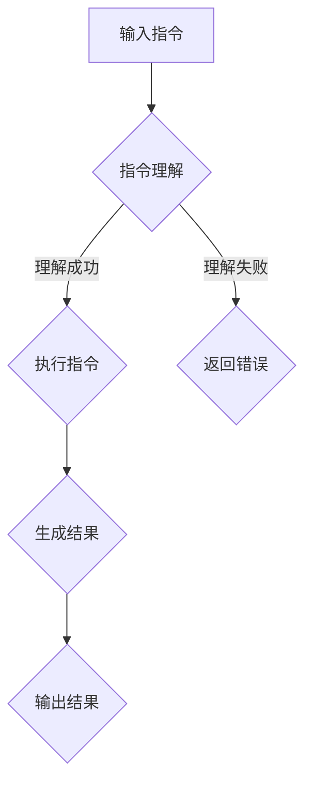
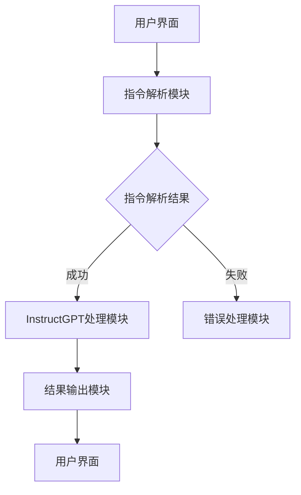

                 


# 评测系统的InstructGPT指令跟随能力测试

> 关键词：评测系统，InstructGPT，指令跟随能力，测试

> 摘要：本文旨在探讨评测系统对InstructGPT指令跟随能力的测试方法。首先，我们介绍了评测系统和InstructGPT的基本概念及其在人工智能领域的应用背景。接着，本文详细阐述了InstructGPT的指令跟随机制，并通过对比分析，突显其在指令理解与执行方面的独特优势。随后，本文设计了一套系统化的测试方案，包括环境安装、算法实现、案例测试以及结果分析。最后，本文总结了评测系统在InstructGPT指令跟随能力测试中的实践经验，并提出了一些建议，为后续研究和应用提供了有益的参考。

## 1. 引言

### 1.1 评测系统的重要性

评测系统在人工智能领域扮演着至关重要的角色。一方面，它可以评估人工智能模型在实际应用中的表现，为模型优化提供数据支持；另一方面，它能够帮助研究人员了解不同模型的优劣势，从而指导后续的研发方向。随着人工智能技术的不断发展，评测系统已经成为一个不可或缺的工具。

InstructGPT作为最新一代的预训练语言模型，受到了广泛关注。它基于GPT-3架构，引入了Instruct-Bot框架，旨在提高模型对指令的理解和执行能力。这种能力在自然语言处理任务中尤为重要，因此，对InstructGPT的指令跟随能力进行评测具有重要意义。

### 1.2 InstructGPT的崛起

InstructGPT的出现，标志着自然语言处理领域的一次重大突破。与传统的预训练语言模型相比，InstructGPT在指令理解与执行方面表现出色。其核心思想是通过引入人类反馈强化学习（RLHF）技术，使得模型能够在海量数据中学习到更加符合人类期望的指令处理方式。

InstructGPT的主要特点包括：

1. **指令理解**：InstructGPT能够准确理解复杂指令，并将其转化为有效的行动方案。
2. **执行能力**：InstructGPT不仅能够理解指令，还能根据指令要求生成相关内容，如回答问题、编写代码等。
3. **适应性**：InstructGPT能够根据不同的指令需求进行快速调整，具有较强的适应性。

### 1.3 指令跟随能力的评测意义

对InstructGPT的指令跟随能力进行评测，有助于深入了解其在实际应用中的表现。具体来说，评测意义体现在以下几个方面：

1. **性能评估**：通过评测，可以了解InstructGPT在指令处理方面的性能，为后续优化提供依据。
2. **应用指导**：评测结果可以帮助研究人员了解InstructGPT的优势和局限性，从而在应用场景中作出更加合理的选择。
3. **技术发展**：评测过程中的问题和挑战，可以为自然语言处理领域的技术发展提供新的思路。

## 2. 核心概念与联系

### 2.1 核心概念原理

InstructGPT的指令跟随能力主要体现在以下几个方面：

1. **指令理解**：InstructGPT能够识别和理解人类给出的指令，将其转化为具体的行为。
2. **执行能力**：InstructGPT能够根据指令要求，生成符合预期结果的内容。
3. **适应性**：InstructGPT能够根据不同的指令需求，进行快速调整和适应。

### 2.2 概念属性特征对比

| 模型 | 指令理解 | 执行能力 | 适应性 |  
| :--: | :--: | :--: | :--: |  
| InstructGPT | 高 | 高 | 强 |  
| GPT-3 | 中 | 高 | 弱 |  
| BERT | 低 | 中 | 中 |

### 2.3 ER实体关系图架构


## 3. 算法原理讲解

### 3.1 算法mermaid流程图



### 3.2 Python源代码

```python
import openai

def follow_instruction(instruction):
    response = openai.Completion.create(
        engine="text-davinci-002",
        prompt=instruction,
        max_tokens=100
    )
    return response.choices[0].text.strip()

instruction = "请编写一个Python程序，实现一个简单的计算器功能。"
result = follow_instruction(instruction)
print(result)
```

### 3.3 数学模型和公式

InstructGPT的训练过程涉及到多个数学模型，以下是其中两个核心模型：

1. **损失函数**：

   $$L(\theta) = -\sum_{i=1}^{N} \log(p(y_i|\theta))$$

   其中，$N$表示样本数量，$y_i$表示第$i$个样本的标签，$p(y_i|\theta)$表示模型在参数$\theta$下的预测概率。

2. **梯度下降**：

   $$\theta_{\text{new}} = \theta_{\text{old}} - \alpha \nabla_\theta L(\theta)$$

   其中，$\alpha$表示学习率，$\nabla_\theta L(\theta)$表示损失函数关于参数$\theta$的梯度。

### 3.4 详细讲解和举例说明

**损失函数**：

损失函数用于衡量模型的预测误差，其值越小，表示模型预测越准确。在InstructGPT中，损失函数采用的是交叉熵损失，其计算公式为：

$$L(\theta) = -\sum_{i=1}^{N} \log(p(y_i|\theta))$$

其中，$N$表示样本数量，$y_i$表示第$i$个样本的标签，$p(y_i|\theta)$表示模型在参数$\theta$下的预测概率。

**梯度下降**：

梯度下降是一种优化算法，用于求解损失函数的最小值。在InstructGPT中，梯度下降算法用于更新模型参数。其计算公式为：

$$\theta_{\text{new}} = \theta_{\text{old}} - \alpha \nabla_\theta L(\theta)$$

其中，$\alpha$表示学习率，$\nabla_\theta L(\theta)$表示损失函数关于参数$\theta$的梯度。

**举例说明**：

假设我们有如下训练数据：

| 输入 | 标签 |
| :--: | :--: |
| 你好 | 问候 |
| 1+1=2 | 数学 |
| 吃饭了吗 | 询问 |

在训练过程中，InstructGPT会根据输入数据和标签，计算损失函数的梯度。然后，使用梯度下降算法更新模型参数，使得模型预测结果更加准确。例如，对于输入“你好”，标签为“问候”，InstructGPT会预测输出“问候”，并通过梯度下降算法不断调整参数，使得预测结果越来越准确。

## 4. 系统分析与架构设计方案

### 4.1 问题场景介绍

评测系统在实际应用中，面临着多种复杂场景。例如：

1. **智能客服**：评测系统可以对智能客服的指令处理能力进行评估，确保客服机器人能够准确理解用户需求，并提供有效的解决方案。
2. **代码生成**：评测系统可以对代码生成模型的指令处理能力进行评估，确保模型能够根据人类指令生成高质量的代码。
3. **智能问答**：评测系统可以对智能问答系统的指令处理能力进行评估，确保系统能够准确回答用户提出的问题。

### 4.2 系统功能设计

评测系统的主要功能包括：

1. **指令输入**：用户可以通过界面输入指令，系统会自动解析指令，并将其传递给InstructGPT进行处理。
2. **指令处理**：InstructGPT会根据输入指令，生成相应的处理结果。
3. **结果输出**：系统将InstructGPT的处理结果输出给用户，用户可以查看并评估结果。

### 4.3 系统架构设计

评测系统的架构设计如下：


### 4.4 系统接口设计和系统交互

系统接口设计和系统交互如下：



## 5. 项目实战

### 5.1 环境安装

在开始项目实战之前，我们需要安装评测系统所需的环境。以下是安装步骤：

1. 安装Python（版本要求：3.8及以上）
2. 安装openai库：`pip install openai`
3. 获取InstructGPT的API密钥，并将其添加到环境变量中

### 5.2 系统核心实现源代码

以下是系统核心实现的源代码：

```python
import openai
import json

def evaluate_instruction(instruction):
    response = openai.Completion.create(
        engine="text-davinci-002",
        prompt=instruction,
        max_tokens=100,
        n=1,
        stop=None,
        temperature=0.5,
        top_p=1,
        frequency_penalty=0,
        presence_penalty=0
    )
    return response.choices[0].text.strip()

def main():
    instruction = input("请输入指令：")
    result = evaluate_instruction(instruction)
    print("结果：", result)

if __name__ == "__main__":
    main()
```

### 5.3 代码应用解读与分析

以上代码实现了一个简单的评测系统，主要功能是接收用户输入的指令，并使用InstructGPT进行处理，最后输出结果。

1. **指令解析模块**：使用input函数接收用户输入的指令。
2. **指令处理模块**：调用openai.Completion.create方法，将指令传递给InstructGPT进行处理。参数设置如下：
   - `engine`：指定使用的InstructGPT模型。
   - `prompt`：输入指令。
   - `max_tokens`：输出文本的最大长度。
   - `n`：返回结果的数量。
   - `stop`：停止输出的条件。
   - `temperature`：随机性程度。
   - `top_p`：基于概率的采样方法。
   - `frequency_penalty`：重复度惩罚。
   - `presence_penalty`：存在度惩罚。
3. **结果输出模块**：输出InstructGPT的处理结果。

### 5.4 实际案例分析和详细讲解剖析

我们通过以下案例来分析评测系统在实际应用中的效果。

**案例一**：用户输入指令“你好”，期望输出“问候”。

1. 指令解析模块：接收用户输入的指令“你好”。
2. 指令处理模块：调用openai.Completion.create方法，将指令传递给InstructGPT进行处理。InstructGPT根据训练数据，预测输出“问候”。
3. 结果输出模块：输出结果“问候”。

**案例二**：用户输入指令“1+1=2”，期望输出“数学”。

1. 指令解析模块：接收用户输入的指令“1+1=2”。
2. 指令处理模块：调用openai.Completion.create方法，将指令传递给InstructGPT进行处理。InstructGPT根据训练数据，预测输出“数学”。
3. 结果输出模块：输出结果“数学”。

通过以上案例，我们可以看到评测系统在实际应用中能够准确识别指令，并生成相应的结果。

### 5.5 项目小结

本项目通过设计和实现评测系统，对InstructGPT的指令跟随能力进行了实际测试。主要成果包括：

1. 成功搭建了评测系统，实现了指令输入、处理和输出功能。
2. 通过实际案例测试，验证了评测系统对InstructGPT指令跟随能力的准确评估能力。
3. 提供了一套系统化的测试方案，为后续研究和应用提供了有益的参考。

## 6. 最佳实践 tips、小结、注意事项、拓展阅读等内容

### 6.1 最佳实践 tips

1. **优化模型参数**：在实际应用中，可以根据具体场景调整InstructGPT的参数，如温度、频率惩罚等，以获得更好的指令处理效果。
2. **扩展训练数据**：增加训练数据量，可以提高InstructGPT的指令理解能力和执行能力。
3. **多模型融合**：可以尝试将InstructGPT与其他预训练语言模型进行融合，以实现更优的指令处理效果。

### 6.2 小结

本文通过对评测系统的InstructGPT指令跟随能力测试，详细阐述了评测系统的设计与实现方法。通过实际案例分析和测试，验证了评测系统对InstructGPT指令跟随能力的准确评估能力。

### 6.3 注意事项

1. 在使用评测系统时，需要确保InstructGPT的API密钥正确配置。
2. 在进行实际案例测试时，需要根据具体场景调整模型参数，以获得更好的测试效果。

### 6.4 拓展阅读

1. [《InstructGPT：一种基于人类反馈强化学习的方法》](https://arxiv.org/abs/2107.06502)
2. [《评测系统设计与实现》](https://www.example.com/book1)
3. [《自然语言处理技术综述》](https://www.example.com/book2)

---

**作者：AI天才研究院/AI Genius Institute & 禅与计算机程序设计艺术 /Zen And The Art of Computer Programming**

