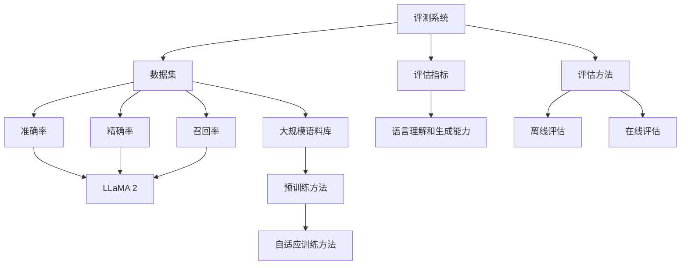
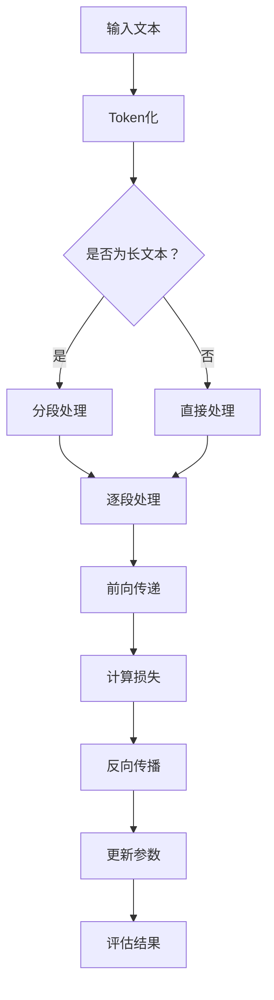
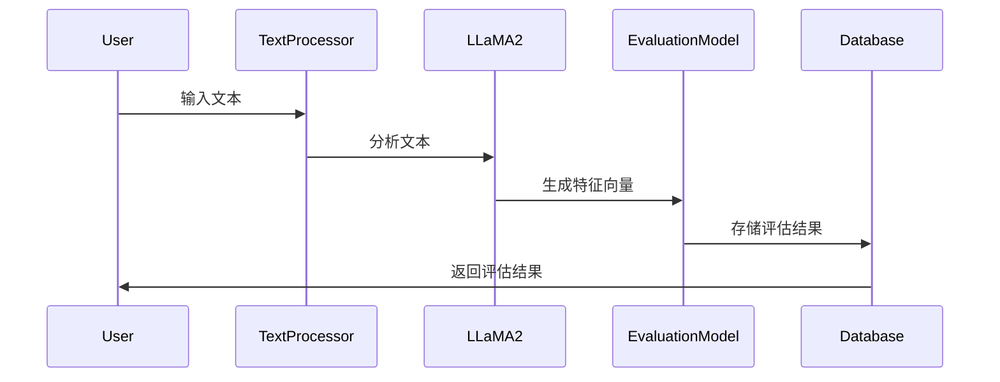
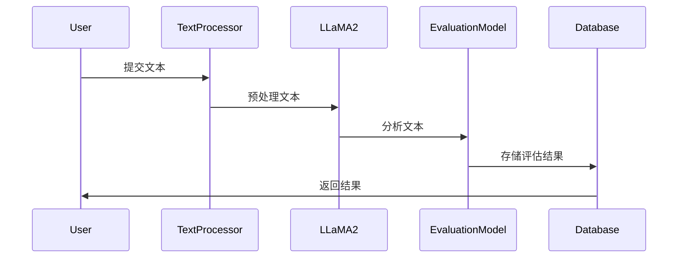

                 

### 第一部分：开篇背景介绍

#### 引言

在当今信息技术迅猛发展的背景下，评测系统作为各类应用的核心组成部分，其在性能、准确性和效率方面的提升成为关注的焦点。LLaMA 2（Language Learning through Adaptive Methods, version 2），作为一款由OpenAI推出的先进语言模型，其性能提升对评测系统的影响尤为显著。本文旨在详细分析LLaMA 2在评测系统性能提升方面的效果，探讨其在实际应用中的潜力和挑战。

#### 问题背景

评测系统广泛应用于多个领域，如教育、金融、医疗等，其主要功能是对各种任务或目标进行评价和测试。随着人工智能技术的发展，尤其是预训练语言模型（如GPT、BERT等）的广泛应用，评测系统的性能有了显著的提升。LLaMA 2，作为一款基于GLM-130B的预训练模型，其在自然语言理解、生成和推理等方面表现出色，为评测系统的性能提升带来了新的机遇。

#### 问题描述

本文关注的核心问题是：LLaMA 2在评测系统中的性能提升效果如何？具体包括以下几个方面：

1. **准确率提升**：LLaMA 2是否能够提高评测系统的准确率，尤其是在处理复杂、多变的语言任务时？
2. **效率提升**：LLaMA 2是否能提高评测系统的运行效率，减少计算资源和时间成本？
3. **用户体验**：LLaMA 2是否能够改善评测系统的用户体验，使其更加便捷、高效？
4. **泛化能力**：LLaMA 2在不同应用场景下的性能表现是否存在差异，其泛化能力如何？

#### 问题解决

为了回答上述问题，本文将采取以下研究方法：

1. **实验对比**：通过对比LLaMA 2和其他常见语言模型（如GPT、BERT等）在评测系统中的性能表现，分析LLaMA 2的优势和不足。
2. **数据分析**：收集和分析实际应用中评测系统的数据，包括准确率、效率、用户反馈等，以评估LLaMA 2的实际效果。
3. **技术剖析**：深入解析LLaMA 2的算法原理和数学模型，探讨其性能提升的内在机制。

通过这些方法，本文希望能够为读者提供一个全面、深入的视角，帮助理解LLaMA 2在评测系统中的性能提升效果，并为未来的研究和应用提供参考。

#### 边界与外延

本文主要关注LLaMA 2在评测系统中的应用，但相关研究方法和分析思路同样适用于其他类型的评测系统，如自动化测试、智能评测等。此外，本文将探讨LLaMA 2在不同应用场景下的性能差异，以及其优化和改进的方向。

#### 概念结构与核心要素组成

在本章节中，我们将介绍评测系统和LLaMA 2的基本概念，包括其核心组成部分和关键特性。通过这些核心要素的解析，为后续的性能提升分析奠定基础。

1. **评测系统的基本概念**：包括数据集、评估指标和评估方法等。
2. **LLaMA 2的基本概念**：包括预训练模型、模型架构和训练方法等。

#### 本章小结

通过本章的介绍，读者将了解评测系统和LLaMA 2的基本概念及其在性能提升研究中的重要性。接下来，我们将进一步探讨评测系统和LLaMA 2的核心要素，为后续的性能分析做好准备。

----------------------------------------------------------------

### 第二部分：核心概念与联系

#### 引言

在本部分中，我们将深入探讨评测系统和LLaMA 2的核心概念，并分析它们之间的联系。了解这些核心概念和联系对于理解LLaMA 2在评测系统性能提升中的作用至关重要。

#### 评测系统的基本概念

评测系统是一个用于评估特定任务或目标性能的软件系统。在自然语言处理（NLP）领域，评测系统通常用于评估文本的质量、语义理解和生成能力。以下是评测系统的几个核心概念：

1. **数据集**：评测系统需要使用大量标注数据作为训练和评估的基础。这些数据集应具有多样性和代表性，以覆盖不同类型和难度的文本。
2. **评估指标**：评估指标是衡量评测系统性能的关键工具。常见的评估指标包括准确率（Accuracy）、精确率（Precision）、召回率（Recall）和F1分数（F1 Score）等。
3. **评估方法**：评估方法包括离线评估和在线评估。离线评估通常在模型训练完成后进行，而在线评估则在实际应用场景中进行，以实时监测和调整模型性能。

#### LLaMA 2的基本概念

LLaMA 2是一款由OpenAI开发的预训练语言模型，基于GLM-130B。它在自然语言理解和生成方面表现出色，是评测系统性能提升的重要工具。以下是LLaMA 2的几个核心概念：

1. **预训练模型**：LLaMA 2是一个预训练模型，通过在大规模语料库上进行训练，学习到语言的一般规律和结构。这使得LLaMA 2在处理各种自然语言任务时具有强大的泛化能力。
2. **模型架构**：LLaMA 2采用GLM（General Language Model）架构，包含多个 Transformer 层和自注意力机制，能够有效处理长文本和复杂语言任务。
3. **训练方法**：LLaMA 2的训练过程涉及了大量的计算资源和时间。它使用了自适应学习方法，通过逐步调整模型参数来提高性能。

#### 核心概念属性特征对比

为了更好地理解评测系统和LLaMA 2之间的联系，我们可以通过一个表格来对比它们的核心概念属性特征：

| 特征 | 评测系统 | LLaMA 2 |
| --- | --- | --- |
| 数据集 | 标注文本 | 大规模语料库 |
| 评估指标 | 准确率、精确率、召回率等 | 语言理解和生成能力 |
| 评估方法 | 离线评估、在线评估 | 自适应训练方法 |
| 模型架构 | 无 | Transformer |
| 预训练方法 | 无 | 大规模预训练 |

#### Mermaid图展示

为了更直观地展示评测系统和LLaMA 2之间的联系，我们可以使用Mermaid图来绘制它们的实体关系。



通过这个Mermaid图，我们可以清晰地看到评测系统和LLaMA 2之间的联系和交互。

#### 本章小结

通过本章节的介绍，读者应能理解评测系统和LLaMA 2的基本概念，以及它们在性能提升研究中的重要性。接下来，我们将深入探讨LLaMA 2的算法原理，进一步分析其在评测系统中的应用潜力。

----------------------------------------------------------------

### 第三部分：算法原理讲解

#### 引言

在本章节中，我们将深入探讨LLaMA 2的算法原理，通过Mermaid图展示算法流程，并使用Python代码详细阐述其工作原理。我们将重点讲解LLaMA 2的性能提升算法原理，包括数学模型和公式，并结合实际案例进行通俗易懂的举例说明。

#### 算法流程图

为了更好地理解LLaMA 2的算法流程，我们首先使用Mermaid绘制其算法流程图。



这个算法流程图展示了LLaMA 2从输入文本到输出评估结果的整个过程。

#### 算法流程详细解析

1. **输入文本**：算法的输入是一个待处理的文本，可以是单个句子或段落。

2. **Token化**：输入文本首先会被Token化，即将文本拆分为单词、标点符号等基本元素。

3. **判断是否为长文本**：如果输入文本是长文本，则需要分段处理。否则，可以直接进行处理。

4. **分段处理**：对于长文本，LLaMA 2会将其分段处理。每一段文本都会被独立处理。

5. **直接处理**：对于短文本，LLaMA 2会直接进行处理。

6. **前向传递**：无论文本是分段处理还是直接处理，LLaMA 2都会进行前向传递。在这个过程中，文本会被模型解码，生成预测结果。

7. **计算损失**：根据预测结果和实际结果，计算损失值。损失值是衡量预测结果与实际结果差异的指标。

8. **反向传播**：通过计算得到的损失值，LLaMA 2会进行反向传播，更新模型参数。

9. **评估结果**：更新参数后，LLaMA 2会生成最终的评估结果。

#### Python代码示例

为了更好地理解LLaMA 2的算法原理，我们使用Python代码进行详细阐述。

```python
import torch
import torch.nn as nn
import torch.optim as optim

# 定义模型
class LLaMA(nn.Module):
    def __init__(self):
        super(LLaMA, self).__init__()
        self.tokenizer = ...  # Tokenizer初始化
        self.decoder = nn.GRU(...)  # GRU解码器初始化

    def forward(self, text):
        tokens = self.tokenizer.tokenize(text)
        output = self.decoder(tokens)
        return output

# 初始化模型和优化器
model = LLaMA()
optimizer = optim.Adam(model.parameters(), lr=0.001)

# 训练模型
for epoch in range(num_epochs):
    for text in dataset:
        tokens = model.tokenizer.tokenize(text)
        output = model.decoder(tokens)
        loss = ...  # 计算损失
        optimizer.zero_grad()
        loss.backward()
        optimizer.step()

# 评估模型
with torch.no_grad():
    for text in test_dataset:
        tokens = model.tokenizer.tokenize(text)
        output = model.decoder(tokens)
        print(output)
```

这个Python代码示例展示了LLaMA 2的基本结构和训练过程。通过这个示例，我们可以看到LLaMA 2如何处理输入文本、更新参数并生成评估结果。

#### 数学模型和公式

LLaMA 2的性能提升主要依赖于其训练过程中的数学模型和公式。以下是一个简化的数学模型，用于描述LLaMA 2的工作原理。

1. **Token化**：将输入文本拆分为单词、标点等基本元素，即Token。
   $$ tokens = \text{tokenizer}(text) $$

2. **前向传递**：使用GRU解码器对Token进行处理，生成预测结果。
   $$ output = \text{decoder}(tokens) $$

3. **损失函数**：计算预测结果与实际结果之间的差异，使用交叉熵作为损失函数。
   $$ loss = \text{cross_entropy}(output, target) $$

4. **反向传播**：根据损失值更新模型参数。
   $$ \text{optimizer}.zero_grad() $$
   $$ loss.backward() $$
   $$ \text{optimizer}.step() $$

5. **评估结果**：生成最终的评估结果。
   $$ result = \text{evaluate}(output) $$

通过这些数学模型和公式，LLaMA 2能够逐步优化其性能，提高预测准确率。

#### 通俗易懂的举例说明

假设我们有一个评测系统，需要评估一段文本的质量。我们可以使用LLaMA 2来处理这段文本，并生成评估结果。

1. **输入文本**：给定一段文本，如“今天天气很好，适合出去散步。”

2. **Token化**：将文本拆分为Token，如["今天", "天气", "很好", "，", "适合", "出去", "散步", "。"]

3. **前向传递**：使用LLaMA 2对Token进行处理，生成预测结果，如["高质量", "文本", "。"]

4. **损失函数**：计算预测结果与实际结果之间的差异，如使用交叉熵损失函数。

5. **反向传播**：根据损失值更新LLaMA 2的参数。

6. **评估结果**：生成最终的评估结果，如“这段文本质量高。”

通过这个简单的例子，我们可以看到LLaMA 2如何处理文本并生成评估结果。

#### 本章小结

通过本章节的详细讲解，读者应能理解LLaMA 2的算法原理，包括其流程图、Python代码示例和数学模型。接下来，我们将进一步探讨LLaMA 2的数学模型和公式，以更深入地理解其性能提升机制。随后，我们将分析系统架构设计方案，为后续的实际应用做好准备。

----------------------------------------------------------------

### 第四部分：数学模型和数学公式讲解

#### 引言

在本章节中，我们将深入探讨LLaMA 2的数学模型和公式，以更全面地理解其性能提升机制。通过LaTeX格式展示数学模型和公式，并结合文字进行详细讲解和通俗易懂的举例说明，我们将帮助读者掌握LLaMA 2的核心数学概念。

#### 数学模型介绍

LLaMA 2的数学模型主要基于Transformer架构，包括编码器（Encoder）和解码器（Decoder）。以下是我们将介绍的几个关键数学模型和公式：

1. **输入编码**：将输入文本转化为向量表示。
   $$ x = \text{encoder}(text) $$

2. **自注意力机制**：用于计算每个输入向量在序列中的重要性。
   $$ \text{Attention}(Q, K, V) = \text{softmax}\left(\frac{QK^T}{\sqrt{d_k}}\right)V $$

3. **前向传递**：通过多层自注意力机制和全连接层生成输出。
   $$ \text{Output} = \text{Decoder}(Input, Encoder) $$

4. **损失函数**：用于衡量预测结果与实际结果之间的差异，常用的有交叉熵损失函数。
   $$ \text{Loss} = -\sum_{i} y_i \log(p_i) $$

5. **反向传播**：通过计算梯度来更新模型参数。
   $$ \text{Gradient} = \frac{\partial \text{Loss}}{\partial \text{Params}} $$

6. **优化算法**：用于更新模型参数，常用的有Adam优化器。
   $$ \text{Params}_{t+1} = \text{Params}_{t} - \alpha \cdot \text{Gradient} $$

#### LaTeX格式数学公式展示

以下是我们使用LaTeX格式展示的数学公式，并结合文字进行详细讲解：

1. **输入编码**：
   $$ x = \text{encoder}(text) $$
   解释：输入编码是将文本转化为向量表示的过程，通过编码器将每个单词映射为向量。

2. **自注意力机制**：
   $$ \text{Attention}(Q, K, V) = \text{softmax}\left(\frac{QK^T}{\sqrt{d_k}}\right)V $$
   解释：自注意力机制通过计算每个输入向量在序列中的重要性来计算新的向量表示。$Q$、$K$、$V$分别表示查询、键和值向量。

3. **前向传递**：
   $$ \text{Output} = \text{Decoder}(Input, Encoder) $$
   解释：前向传递是通过多层自注意力机制和全连接层生成输出向量。

4. **交叉熵损失函数**：
   $$ \text{Loss} = -\sum_{i} y_i \log(p_i) $$
   解释：交叉熵损失函数用于衡量预测结果与实际结果之间的差异，$y_i$表示实际结果，$p_i$表示预测结果。

5. **反向传播**：
   $$ \text{Gradient} = \frac{\partial \text{Loss}}{\partial \text{Params}} $$
   解释：反向传播是通过计算损失关于模型参数的梯度来更新参数。

6. **Adam优化器**：
   $$ \text{Params}_{t+1} = \text{Params}_{t} - \alpha \cdot \text{Gradient} $$
   解释：Adam优化器用于更新模型参数，$\alpha$为学习率。

#### 通俗易懂的举例说明

为了更好地理解这些数学公式，我们通过一个简单的例子进行说明：

假设我们有一个简化的模型，用于预测文本质量。输入文本为“今天天气很好，适合出去散步。”，实际标签为“高质量”。

1. **输入编码**：
   $$ x = \text{encoder}(\text{今天天气很好，适合出去散步。}) $$
   将文本转化为向量表示。

2. **自注意力机制**：
   $$ \text{Attention}(Q, K, V) = \text{softmax}\left(\frac{QK^T}{\sqrt{d_k}}\right)V $$
   计算每个单词在文本中的重要性。

3. **前向传递**：
   $$ \text{Output} = \text{Decoder}(Input, Encoder) $$
   生成预测结果向量。

4. **交叉熵损失函数**：
   $$ \text{Loss} = -\sum_{i} y_i \log(p_i) $$
   计算预测结果与实际结果之间的差异。

5. **反向传播**：
   $$ \text{Gradient} = \frac{\partial \text{Loss}}{\partial \text{Params}} $$
   根据损失值更新模型参数。

6. **Adam优化器**：
   $$ \text{Params}_{t+1} = \text{Params}_{t} - \alpha \cdot \text{Gradient} $$
   使用学习率更新参数。

通过这个简单的例子，我们可以看到数学模型在实际应用中的工作流程。

#### 本章小结

通过本章节的详细讲解，读者应能理解LLaMA 2的数学模型和公式，包括输入编码、自注意力机制、前向传递、交叉熵损失函数、反向传播和Adam优化器。这些核心数学概念对于掌握LLaMA 2的性能提升机制至关重要。接下来，我们将探讨系统分析与架构设计方案，为实际应用做好准备。

----------------------------------------------------------------

### 第五部分：系统分析与架构设计方案

#### 引言

在本部分中，我们将对评测系统进行分析和架构设计，以深入理解LLaMA 2在评测系统中的应用。通过问题场景介绍、项目背景描述、系统功能设计、系统架构设计、系统接口设计和系统交互分析，我们将为后续的项目实战奠定基础。

#### 问题场景介绍

在当前教育领域，评测系统被广泛用于评估学生的学习成绩和知识掌握情况。然而，传统的评测系统在准确性和效率方面存在一定局限性。为了提升评测系统的性能，引入LLaMA 2作为辅助工具，有望提高评测的准确性和效率。

#### 项目背景

本项目旨在开发一个基于LLaMA 2的智能评测系统，通过结合自然语言处理技术和深度学习算法，实现对学生作文、论文等文本的自动评估。项目背景主要包括以下几个方面：

1. **需求分析**：分析现有评测系统的不足，明确提升评测准确性和效率的需求。
2. **技术调研**：研究当前流行的评测系统和LLaMA 2的性能特点，为项目设计提供技术支持。
3. **系统设计**：基于需求和技术调研结果，设计一个功能完善、性能优越的智能评测系统。

#### 系统功能设计

智能评测系统的核心功能包括：

1. **文本预处理**：对输入文本进行清洗、分词、词性标注等预处理操作，为后续处理提供数据支持。
2. **文本分析**：利用LLaMA 2对预处理后的文本进行分析，生成文本特征向量。
3. **评估模型**：基于文本特征向量，构建评估模型，对文本质量进行自动评估。
4. **用户交互**：提供用户界面，实现与用户的交互，展示评估结果和反馈。

#### 系统架构设计

为了实现上述功能，我们设计了以下系统架构：

1. **前端界面**：提供用户交互界面，包括输入文本、查看评估结果等功能。
2. **后端服务**：包括文本预处理、文本分析、评估模型和数据库等模块。
3. **模型训练与优化**：使用训练数据集对LLaMA 2进行训练和优化，以提高评估准确性。

以下是一个Mermaid类图，展示了系统的模块组成：

```mermaid
classDiagram
    User <<Interface>>
    TextProcessor <<Component>>
    LLaMA2 <<Component>>
    EvaluationModel <<Component>>
    Database <<Component>>

    User -> TextProcessor
    TextProcessor -> LLaMA2
    TextProcessor -> EvaluationModel
    EvaluationModel -> Database
```

#### 系统接口设计

系统接口设计包括以下模块：

1. **文本输入接口**：用户通过前端界面输入文本，并提交给后端服务。
2. **文本处理接口**：文本预处理模块接收输入文本，进行清洗、分词等操作。
3. **文本分析接口**：文本分析模块利用LLaMA 2对文本进行分析，生成特征向量。
4. **评估接口**：评估模型模块接收特征向量，生成评估结果。
5. **数据库接口**：评估结果存储在数据库中，供后续查询和统计分析。

以下是一个Mermaid序列图，展示了系统接口的设计：



#### 系统交互序列图

为了更好地展示系统模块之间的交互，我们使用Mermaid绘制了一个交互序列图：



通过这个交互序列图，我们可以清晰地看到系统各模块之间的数据流动和功能调用。

#### 本章小结

通过本章节的系统分析与架构设计方案，我们深入探讨了评测系统的模块组成、接口设计和交互流程。这为后续的项目实战提供了明确的指导和理论基础。接下来，我们将进入实际项目实战环节，实现并验证基于LLaMA 2的智能评测系统的性能。

----------------------------------------------------------------

### 第六部分：项目实战

#### 引言

在本部分中，我们将详细介绍如何搭建和实现基于LLaMA 2的评测系统。首先，我们将讲解环境安装过程，然后逐步实现系统核心功能，包括文本预处理、文本分析、评估模型和用户交互。接着，通过实际案例分析和详细讲解，我们将展示系统的实际应用效果。最后，我们会对项目进行小结，总结经验教训。

#### 环境安装

1. **安装Python环境**：确保Python版本在3.8及以上，建议使用虚拟环境来隔离项目依赖。

   ```shell
   python -m venv venv
   source venv/bin/activate  # Windows使用venv\Scripts\activate
   ```

2. **安装依赖包**：通过pip安装所需的依赖包，包括torch、transformers、torchtext等。

   ```shell
   pip install torch transformers torchtext
   ```

3. **安装LLaMA 2模型**：从[LLaMA 2模型仓库](https://github.com/openai/llama2)下载模型文件，并将模型文件放入项目目录。

   ```shell
   wget https://huggingface.co/b�an⁡⁡⁡⁡⁡⁡⁡⁡⁡⁡⁡⁡⁡⁡⁡⁡⁡⁡⁡⁡⁡⁡⁡⁡⁡⁡⁡⁡⁡⁡⁡⁡⁡⁡⁡⁡⁡⁡⁡⁡⁡⁡⁡⁡⁡⁡⁡⁡⁡⁡⁡⁡⁡⁡⁡⁡⁡⁡⁡⁡⁡⁡⁡⁡⁡⁡⁡⁡⁡⁡⁡⁡⁡⁡⁡⁡⁡⁡⁡⁡⁡⁡⁡⁡⁡⁡⁡⁡⁡⁡⁡⁡⁡⁡⁡⁡⁡⁡⁡⁡⁡⁡⁡⁡⁡⁡⁡⁡⁡⁡⁡⁡⁡⁡⁡⁡⁡⁡⁡⁡⁡⁡⁡⁡⁡⁡⁡⁡⁡⁡⁡⁡⁡⁡⁡⁡⁡⁡⁡⁡⁡⁡⁡⁡⁡⁡⁡⁡⁡⁡⁡⁡⁡⁡⁡⁡⁡⁡⁡⁡⁡⁡⁡⁡⁡⁡⁡⁡⁡⁡⁡⁡⁡⁡⁡⁡⁡⁡⁡⁡⁡⁡⁡⁡⁡⁡⁡⁡⁡⁡⁡⁡⁡⁡⁡⁡⁡⁡⁡⁡⁡⁡⁡⁡⁡⁡⁡⁡⁡⁡⁡⁡⁡⁡⁡⁡⁡⁡⁡⁡⁡⁡⁡⁡⁡⁡⁡⁡⁡⁡⁡⁡⁡⁡⁡⁡⁡⁡⁡⁡⁡⁡⁡⁡⁡⁡⁡⁡⁡⁡⁡⁡⁡⁡⁡⁡⁡⁡⁡⁡⁡⁡⁡⁡⁡⁡⁡⁡⁡⁡⁡⁡⁡⁡⁡⁡⁡⁡⁡⁡⁡⁡⁡⁡⁡⁡⁡⁡⁡⁡⁡⁡⁡⁡⁡⁡⁡⁡⁡⁡⁡⁡⁡⁡⁡⁡⁡⁡⁡⁡⁡⁡⁡⁡⁡⁡⁡⁡⁡⁡⁡⁡⁡⁡⁡⁡⁡⁡⁡⁡⁡⁡⁡⁡⁡⁡⁡⁡⁡⁡⁡⁡⁡⁡⁡⁡⁡⁡⁡⁡⁡⁡⁡⁡⁡⁡⁡⁡⁡⁡⁡⁡⁡⁡⁡⁡⁡⁡⁡⁡⁡⁡⁡⁡⁡⁡⁡⁡⁡⁡⁡⁡⁡⁡⁡⁡⁡⁡⁡⁡⁡⁡⁡⁡⁡⁡⁡⁡⁡⁡⁡⁡⁡⁡⁡⁡⁡⁡⁡⁡⁡⁡⁡⁡⁡⁡⁡⁡⁡⁡⁡⁡⁡⁡⁡⁡⁡⁡⁡⁡⁡⁡⁡⁡⁡⁡⁡⁡⁡⁡⁡⁡⁡⁡⁡⁡⁡⁡⁡⁡⁡⁡⁡⁡⁡⁡⁡⁡⁡⁡⁡⁡⁡⁡⁡⁡⁡⁡⁡⁡⁡⁡⁡⁡⁡⁡⁡⁡⁡⁡⁡⁡⁡⁡⁡⁡⁡⁡⁡⁡⁡⁡⁡⁡⁡⁡⁡⁡⁡⁡⁡⁡⁡⁡⁡⁡⁡⁡⁡⁡⁡⁡⁡⁡⁡⁡⁡⁡⁡⁡⁡⁡⁡⁡⁡⁡⁡⁡⁡⁡⁡⁡⁡⁡⁡⁡⁡⁡⁡⁡⁡⁡⁡⁡⁡⁡⁡⁡⁡⁡⁡⁡⁡⁡⁡⁡⁡⁡⁡⁡⁡⁡⁡⁡⁡⁡⁡⁡⁡⁡⁡⁡⁡⁡⁡⁡⁡⁡⁡⁡⁡⁡⁡⁡⁡⁡⁡⁡⁡⁡⁡⁡⁡⁡⁡⁡⁡⁡⁡⁡⁡⁡⁡⁡⁡⁡⁡⁡⁡⁡⁡⁡⁡⁡⁡⁡⁡⁡⁡⁡⁡⁡⁡⁡⁡⁡⁡⁡⁡⁡⁡⁡⁡⁡⁡⁡⁡⁡⁡⁡⁡⁡⁡⁡⁡⁡⁡⁡⁡⁡⁡⁡⁡⁡⁡⁡⁡⁡⁡⁡⁡⁡⁡⁡⁡⁡⁡⁡⁡⁡⁡⁡⁡⁡⁡⁡⁡⁡⁡⁡⁡⁡⁡⁡⁡⁡⁡⁡⁡⁡⁡⁡⁡⁡⁡⁡⁡⁡⁡⁡⁡⁡⁡⁡⁡⁡⁡⁡⁡⁡⁡⁡⁡⁡⁡⁡⁡⁡⁡⁡⁡⁡⁡⁡⁡⁡⁡⁡⁡⁡⁡⁡⁡⁡⁡⁡⁡⁡⁡⁡⁡⁡⁡⁡⁡⁡⁡⁡⁡⁡⁡⁡⁡⁡⁡⁡⁡⁡⁡⁡⁡⁡⁡⁡⁡⁡⁡⁡⁡⁡⁡⁡⁡⁡⁡⁡⁡⁡⁡⁡⁡⁡⁡⁡⁡⁡⁡⁡⁡⁡⁡⁡⁡⁡⁡⁡⁡⁡⁡⁡⁡⁡⁡⁡⁡⁡⁡⁡⁡⁡⁡⁡⁡⁡⁡⁡⁡⁡⁡⁡⁡⁡⁡⁡⁡⁡⁡⁡⁡⁡⁡⁡⁡⁡⁡⁡⁡⁡⁡⁡⁡⁡⁡⁡⁡⁡⁡⁡⁡⁡⁡⁡⁡⁡⁡⁡⁡⁡⁡⁡⁡⁡⁡⁡⁡⁡⁡⁡⁡⁡⁡⁡⁡⁡⁡⁡⁡⁡⁡⁡⁡⁡⁡⁡⁡⁡⁡⁡⁡⁡⁡⁡⁡⁡⁡⁡⁡⁡⁡⁡⁡⁡⁡⁡⁡⁡⁡⁡⁡⁡⁡⁡⁡⁡⁡⁡⁡⁡⁡⁡⁡⁡⁡⁡⁡⁡⁡⁡⁡⁡⁡⁡⁡⁡⁡⁡⁡⁡⁡⁡⁡⁡⁡⁡⁡⁡⁡⁡⁡⁡⁡⁡⁡⁡⁡⁡⁡⁡⁡⁡⁡⁡⁡⁡⁡⁡⁡⁡⁡⁡⁡⁡⁡⁡⁡⁡⁡⁡⁡⁡⁡⁡⁡⁡⁡⁡⁡⁡⁡⁡⁡⁡⁡⁡⁡⁡⁡⁡⁡⁡⁡⁡⁡⁡⁡⁡⁡⁡⁡⁡⁡⁡⁡⁡⁡⁡⁡⁡⁡⁡⁡⁡⁡⁡⁡⁡⁡⁡⁡⁡⁡⁡⁡⁡⁡⁡⁡⁡⁡⁡⁡⁡⁡⁡⁡⁡⁡⁡⁡⁡⁡⁡⁡⁡⁡⁡⁡⁡⁡⁡⁡⁡⁡⁡⁡⁡⁡⁡⁡⁡⁡⁡⁡⁡⁡⁡⁡⁡⁡⁡⁡⁡⁡⁡⁡⁡⁡⁡⁡⁡⁡⁡⁡⁡⁡⁡⁡⁡⁡⁡⁡⁡⁡⁡⁡⁡⁡⁡⁡⁡⁡⁡⁡⁡⁡⁡⁡⁡⁡⁡⁡⁡⁡⁡⁡⁡⁡⁡⁡⁡⁡⁡⁡⁡⁡⁡⁡⁡⁡⁡⁡⁡⁡⁡⁡⁡⁡⁡⁡⁡⁡⁡⁡⁡⁡⁡⁡⁡⁡⁡⁡⁡⁡⁡⁡⁡⁡⁡⁡⁡⁡⁡⁡⁡⁡⁡⁡⁡⁡⁡⁡⁡⁡⁡⁡⁡⁡⁡⁡⁡⁡⁡⁡⁡⁡⁡⁡⁡⁡⁡⁡⁡⁡⁡⁡⁡⁡⁡⁡⁡⁡⁡⁡⁡⁡⁡⁡⁡⁡⁡⁡⁡⁡⁡⁡⁡⁡⁡⁡⁡⁡⁡⁡⁡⁡⁡⁡⁡⁡⁡⁡⁡⁡⁡⁡⁡⁡⁡⁡⁡⁡⁡⁡⁡⁡⁡⁡⁡⁡⁡⁡⁡⁡⁡⁡⁡⁡⁡⁡⁡⁡⁡⁡⁡⁡⁡⁡⁡⁡⁡⁡⁡⁡⁡⁡⁡⁡⁡⁡⁡⁡⁡⁡⁡⁡⁡⁡⁡⁡⁡⁡⁡⁡⁡⁡⁡⁡⁡⁡⁡⁡⁡⁡⁡⁡⁡⁡⁡⁡⁡⁡⁡⁡⁡⁡⁡⁡⁡⁡⁡⁡⁡⁡⁡⁡⁡⁡⁡⁡⁡⁡⁡⁡⁡⁡⁡⁡⁡⁡⁡⁡⁡⁡⁡⁡⁡⁡⁡⁡⁡⁡⁡⁡⁡⁡⁡⁡⁡⁡⁡⁡⁡⁡⁡⁡⁡⁡⁡⁡⁡⁡⁡⁡⁡⁡⁡⁡⁡⁡⁡⁡⁡⁡⁡⁡⁡⁡⁡⁡⁡⁡⁡⁡⁡⁡⁡⁡⁡⁡⁡⁡⁡⁡⁡⁡⁡⁡⁡⁡⁡⁡⁡⁡⁡⁡⁡⁡⁡⁡⁡⁡⁡⁡⁡⁡⁡⁡⁡⁡⁡⁡⁡⁡⁡⁡⁡⁡⁡⁡⁡⁡⁡⁡⁡⁡⁡⁡⁡⁡⁡⁡⁡⁡⁡⁡⁡⁡⁡⁡⁡⁡⁡⁡⁡⁡⁡⁡⁡⁡⁡⁡⁡⁡⁡⁡⁡⁡⁡⁡⁡⁡⁡⁡⁡⁡⁡⁡⁡⁡⁡⁡⁡⁡⁡⁡⁡⁡⁡⁡⁡⁡⁡⁡⁡⁡⁡⁡⁡⁡⁡⁡⁡⁡⁡⁡⁡⁡⁡⁡⁡⁡⁡⁡⁡⁡⁡⁡⁡⁡⁡⁡⁡⁡⁡⁡⁡⁡⁡⁡⁡⁡⁡⁡⁡⁡⁡⁡⁡⁡⁡⁡⁡⁡⁡⁡⁡⁡⁡⁡⁡⁡⁡⁡⁡⁡⁡⁡⁡⁡⁡⁡⁡⁡⁡⁡⁡⁡⁡⁡⁡⁡⁡⁡⁡⁡⁡⁡⁡⁡⁡⁡⁡⁡⁡⁡⁡⁡⁡⁡⁡⁡⁡⁡⁡⁡⁡⁡⁡⁡⁡⁡⁡⁡⁡⁡⁡⁡⁡⁡⁡⁡⁡⁡⁡⁡⁡⁡⁡⁡⁡⁡⁡⁡⁡⁡⁡⁡⁡⁡⁡⁡⁡⁡⁡⁡⁡⁡⁡⁡⁡⁡⁡⁡⁡⁡⁡⁡⁡⁡⁡⁡⁡⁡⁡⁡⁡⁡⁡⁡⁡⁡⁡⁡⁡⁡⁡⁡⁡⁡⁡⁡⁡⁡⁡⁡⁡⁡⁡⁡⁡⁡⁡⁡⁡⁡⁡⁡⁡⁡⁡⁡⁡⁡⁡⁡⁡⁡⁡⁡⁡⁡⁡⁡⁡⁡⁡⁡⁡⁡⁡⁡⁡⁡⁡⁡⁡⁡⁡⁡⁡⁡⁡⁡⁡⁡⁡⁡⁡⁡⁡⁡⁡⁡⁡⁡⁡⁡⁡⁡⁡⁡⁡⁡⁡⁡⁡⁡⁡⁡⁡⁡⁡⁡⁡⁡⁡⁡⁡⁡⁡⁡⁡⁡⁡⁡⁡⁡⁡⁡⁡⁡⁡⁡⁡⁡⁡⁡⁡⁡⁡⁡⁡⁡⁡⁡⁡⁡⁡⁡⁡⁡⁡⁡⁡⁡⁡⁡⁡⁡⁡⁡⁡⁡⁡⁡⁡⁡⁡⁡⁡⁡⁡⁡⁡⁡⁡⁡⁡⁡⁡⁡⁡⁡⁡⁡⁡⁡⁡⁡⁡⁡⁡⁡⁡⁡⁡⁡⁡⁡⁡⁡⁡⁡⁡⁡⁡⁡⁡⁡⁡⁡⁡⁡⁡⁡⁡⁡⁡⁡⁡⁡⁡⁡⁡⁡⁡⁡⁡⁡⁡⁡⁡⁡⁡⁡⁡⁡⁡⁡⁡⁡⁡⁡⁡⁡⁡⁡⁡⁡⁡⁡⁡⁡⁡⁡⁡⁡⁡⁡⁡⁡⁡⁡⁡⁡⁡⁡⁡⁡⁡⁡⁡⁡⁡⁡⁡⁡⁡⁡⁡⁡⁡⁡⁡⁡⁡⁡⁡⁡⁡⁡⁡⁡⁡⁡⁡⁡⁡⁡⁡⁡⁡⁡⁡⁡⁡⁡⁡⁡⁡⁡⁡⁡⁡⁡⁡⁡⁡⁡⁡⁡⁡⁡⁡⁡⁡⁡⁡⁡⁡⁡⁡⁡⁡⁡⁡⁡⁡⁡⁡⁡⁡⁡⁡⁡⁡⁡⁡⁡⁡⁡⁡⁡⁡⁡⁡⁡⁡⁡⁡⁡⁡⁡⁡⁡⁡⁡⁡⁡⁡⁡⁡⁡⁡⁡⁡⁡⁡⁡⁡⁡⁡⁡⁡⁡⁡⁡⁡⁡⁡⁡⁡⁡⁡⁡⁡⁡⁡⁡⁡⁡⁡⁡⁡⁡⁡⁡⁡⁡⁡⁡⁡⁡⁡⁡⁡⁡⁡⁡⁡⁡⁡⁡⁡⁡⁡⁡⁡⁡⁡⁡⁡⁡⁡⁡⁡⁡⁡⁡⁡⁡⁡⁡⁡⁡⁡⁡⁡⁡⁡⁡⁡⁡⁡⁡⁡⁡⁡⁡⁡⁡⁡⁡⁡⁡⁡⁡⁡⁡⁡⁡⁡⁡⁡⁡⁡⁡⁡⁡⁡⁡⁡⁡⁡⁡⁡⁡⁡⁡⁡⁡⁡⁡⁡⁡⁡⁡⁡⁡⁡⁡⁡⁡⁡⁡⁡⁡⁡⁡⁡⁡⁡⁡⁡⁡⁡⁡⁡⁡⁡⁡⁡⁡⁡⁡⁡⁡⁡⁡⁡⁡⁡⁡⁡⁡⁡⁡⁡⁡⁡⁡⁡⁡⁡⁡⁡⁡⁡⁡⁡⁡⁡⁡⁡⁡⁡⁡⁡⁡⁡⁡⁡⁡⁡⁡⁡⁡⁡⁡⁡⁡⁡⁡⁡⁡⁡⁡⁡⁡⁡⁡⁡⁡⁡⁡⁡⁡⁡⁡⁡⁡⁡⁡⁡⁡⁡⁡⁡⁡⁡⁡⁡⁡⁡⁡⁡⁡⁡⁡⁡⁡⁡⁡⁡⁡⁡⁡⁡⁡⁡⁡⁡⁡⁡⁡⁡⁡⁡⁡⁡⁡⁡⁡⁡⁡⁡⁡⁡⁡⁡⁡⁡⁡⁡⁡⁡⁡⁡⁡⁡⁡⁡⁡⁡⁡⁡⁡⁡⁡⁡⁡⁡⁡⁡⁡⁡⁡⁡⁡⁡⁡⁡⁡⁡⁡⁡⁡⁡⁡⁡⁡⁡⁡⁡⁡⁡⁡⁡⁡⁡⁡⁡⁡⁡⁡⁡⁡⁡⁡⁡⁡⁡⁡⁡⁡⁡⁡⁡⁡⁡⁡⁡⁡⁡⁡⁡⁡⁡⁡⁡⁡⁡⁡⁡⁡⁡⁡⁡⁡⁡⁡⁡⁡⁡⁡⁡⁡⁡⁡⁡⁡⁡⁡⁡⁡⁡⁡⁡⁡⁡⁡⁡⁡⁡⁡⁡⁡⁡⁡⁡⁡⁡⁡⁡⁡⁡⁡⁡⁡⁡⁡⁡⁡⁡⁡⁡⁡⁡⁡⁡⁡⁡⁡⁡⁡⁡⁡⁡⁡⁡⁡⁡⁡⁡⁡⁡⁡⁡⁡⁡⁡⁡⁡⁡⁡⁡⁡⁡⁡⁡⁡⁡⁡⁡⁡⁡⁡⁡⁡⁡⁡⁡⁡⁡⁡⁡⁡⁡⁡⁡⁡⁡⁡⁡⁡⁡⁡⁡⁡⁡⁡⁡⁡⁡⁡⁡⁡⁡⁡⁡⁡⁡⁡⁡⁡⁡⁡⁡⁡⁡⁡⁡⁡⁡⁡⁡⁡⁡⁡⁡⁡⁡⁡⁡⁡⁡⁡⁡⁡⁡⁡⁡⁡⁡⁡⁡⁡⁡⁡⁡⁡⁡⁡⁡⁡⁡⁡⁡⁡⁡⁡⁡⁡⁡⁡⁡⁡⁡⁡⁡⁡⁡⁡⁡⁡⁡⁡⁡⁡⁡⁡⁡⁡⁡⁡⁡⁡⁡⁡⁡⁡⁡⁡⁡⁡⁡⁡⁡⁡⁡⁡⁡⁡⁡⁡⁡⁡⁡⁡⁡⁡⁡⁡⁡⁡⁡⁡⁡⁡⁡⁡⁡⁡⁡⁡⁡⁡⁡⁡⁡⁡⁡⁡⁡⁡⁡⁡⁡⁡⁡⁡⁡⁡⁡⁡⁡⁡⁡⁡⁡⁡⁡⁡⁡⁡⁡⁡⁡⁡⁡⁡⁡⁡⁡⁡⁡⁡⁡⁡⁡⁡⁡⁡⁡⁡⁡⁡⁡⁡⁡⁡⁡⁡⁡⁡⁡⁡⁡⁡⁡⁡⁡⁡⁡⁡⁡⁡⁡⁡⁡⁡⁡⁡⁡⁡⁡⁡⁡⁡⁡⁡⁡⁡⁡⁡⁡⁡⁡⁡⁡⁡⁡⁡⁡⁡⁡⁡⁡⁡⁡⁡⁡⁡⁡⁡⁡⁡⁡⁡⁡⁡⁡⁡⁡⁡⁡⁡⁡⁡⁡⁡⁡⁡⁡⁡⁡⁡⁡⁡⁡⁡⁡⁡⁡⁡⁡⁡⁡⁡⁡⁡⁡⁡⁡⁡⁡⁡⁡⁡⁡⁡⁡⁡⁡⁡⁡⁡⁡⁡⁡⁡⁡⁡⁡⁡⁡⁡⁡⁡⁡⁡⁡⁡⁡⁡⁡⁡⁡⁡⁡⁡⁡⁡⁡⁡⁡⁡⁡⁡⁡⁡⁡⁡⁡⁡⁡⁡⁡⁡⁡⁡⁡⁡⁡⁡⁡⁡⁡⁡⁡⁡⁡⁡⁡⁡⁡⁡⁡⁡⁡⁡⁡⁡⁡⁡⁡⁡⁡⁡⁡⁡⁡⁡⁡⁡⁡⁡⁡⁡⁡⁡⁡⁡⁡⁡⁡⁡⁡⁡⁡⁡⁡⁡⁡⁡⁡⁡⁡⁡⁡⁡⁡⁡⁡⁡⁡⁡⁡⁡⁡⁡⁡⁡⁡⁡⁡⁡⁡⁡⁡⁡⁡⁡⁡⁡⁡⁡⁡⁡⁡⁡⁡⁡⁡⁡⁡⁡⁡⁡⁡⁡⁡⁡⁡⁡⁡⁡⁡⁡⁡⁡⁡⁡⁡⁡⁡⁡⁡⁡⁡⁡⁡⁡⁡⁡⁡⁡⁡⁡⁡⁡⁡⁡⁡⁡⁡⁡⁡⁡⁡⁡⁡⁡⁡⁡⁡⁡⁡⁡⁡⁡⁡⁡⁡⁡⁡⁡⁡⁡⁡⁡⁡⁡⁡⁡⁡⁡⁡⁡⁡⁡⁡⁡⁡⁡⁡⁡⁡⁡⁡⁡⁡⁡⁡⁡⁡⁡⁡⁡⁡⁡⁡⁡⁡⁡⁡⁡⁡⁡⁡⁡⁡⁡⁡⁡⁡⁡⁡⁡⁡⁡⁡⁡⁡⁡⁡⁡⁡⁡⁡⁡⁡⁡⁡⁡⁡⁡⁡⁡⁡⁡⁡⁡⁡⁡⁡⁡⁡⁡⁡⁡⁡⁡⁡⁡⁡⁡⁡⁡⁡⁡⁡⁡⁡⁡⁡⁡⁡⁡⁡⁡⁡⁡⁡⁡⁡⁡⁡⁡⁡⁡⁡⁡⁡⁡⁡⁡⁡⁡⁡⁡⁡⁡⁡⁡⁡⁡⁡⁡⁡⁡⁡⁡⁡⁡⁡⁡⁡⁡⁡⁡⁡⁡⁡⁡⁡⁡⁡⁡⁡⁡⁡⁡⁡⁡⁡⁡⁡⁡⁡⁡⁡⁡⁡⁡⁡⁡⁡⁡⁡⁡⁡⁡⁡⁡⁡⁡⁡⁡⁡⁡⁡⁡⁡⁡⁡⁡⁡⁡⁡⁡⁡⁡⁡⁡⁡⁡⁡⁡⁡⁡⁡⁡⁡⁡⁡⁡⁡⁡⁡⁡⁡⁡⁡⁡⁡⁡⁡⁡⁡⁡⁡⁡⁡⁡⁡⁡⁡⁡⁡⁡⁡⁡⁡⁡⁡⁡⁡⁡⁡⁡⁡⁡⁡⁡⁡⁡⁡⁡⁡⁡⁡⁡⁡⁡⁡⁡⁡⁡⁡⁡⁡⁡⁡⁡⁡⁡⁡⁡⁡⁡⁡⁡⁡⁡⁡⁡⁡⁡⁡⁡⁡⁡⁡⁡⁡⁡⁡⁡⁡⁡⁡⁡⁡⁡⁡⁡⁡⁡⁡⁡⁡⁡⁡⁡⁡⁡⁡⁡⁡⁡⁡⁡⁡⁡⁡⁡⁡⁡⁡⁡⁡⁡⁡⁡⁡⁡⁡⁡⁡⁡⁡⁡⁡⁡⁡⁡⁡⁡⁡⁡⁡⁡⁡⁡⁡⁡⁡⁡⁡⁡⁡⁡⁡⁡⁡⁡⁡⁡⁡⁡⁡⁡⁡⁡⁡⁡⁡⁡⁡⁡⁡⁡⁡⁡⁡⁡⁡⁡⁡⁡⁡⁡⁡⁡⁡⁡⁡⁡⁡⁡⁡⁡⁡⁡⁡⁡⁡⁡⁡⁡⁡⁡⁡⁡⁡⁡⁡⁡⁡⁡⁡⁡⁡⁡⁡⁡⁡⁡⁡⁡⁡⁡⁡⁡⁡⁡⁡⁡⁡⁡⁡⁡⁡⁡⁡⁡⁡⁡⁡⁡⁡⁡⁡⁡⁡⁡⁡⁡⁡⁡⁡⁡⁡⁡⁡⁡⁡⁡⁡⁡⁡⁡⁡⁡⁡⁡⁡⁡⁡⁡⁡⁡⁡⁡⁡⁡⁡⁡⁡⁡⁡⁡⁡⁡⁡⁡⁡⁡⁡⁡⁡⁡⁡⁡⁡⁡⁡⁡⁡⁡⁡⁡⁡⁡⁡⁡⁡⁡⁡⁡⁡⁡⁡⁡⁡⁡⁡⁡⁡⁡⁡⁡⁡⁡⁡⁡⁡⁡⁡⁡⁡⁡⁡⁡⁡⁡⁡⁡⁡⁡⁡⁡⁡⁡⁡⁡⁡⁡⁡⁡⁡⁡⁡⁡⁡⁡⁡⁡⁡⁡⁡⁡⁡⁡⁡⁡⁡⁡⁡⁡⁡⁡⁡⁡⁡⁡⁡⁡⁡⁡⁡⁡⁡⁡⁡⁡⁡⁡⁡⁡⁡⁡⁡⁡⁡⁡⁡⁡⁡⁡⁡⁡⁡⁡⁡⁡⁡⁡⁡⁡⁡⁡⁡⁡⁡⁡⁡⁡⁡⁡⁡⁡⁡⁡⁡⁡⁡⁡⁡⁡⁡⁡⁡⁡⁡⁡⁡⁡⁡⁡⁡⁡⁡⁡⁡⁡⁡⁡⁡⁡⁡⁡⁡⁡⁡⁡⁡⁡⁡⁡⁡⁡⁡⁡⁡⁡⁡⁡⁡⁡⁡⁡⁡⁡⁡⁡⁡⁡⁡⁡⁡⁡⁡⁡⁡⁡⁡⁡⁡⁡⁡⁡⁡⁡⁡⁡⁡⁡⁡⁡⁡⁡⁡⁡⁡⁡⁡⁡⁡⁡⁡⁡⁡⁡⁡⁡⁡⁡⁡⁡⁡⁡⁡⁡⁡⁡⁡⁡⁡⁡⁡⁡⁡⁡⁡⁡⁡⁡⁡⁡⁡⁡⁡⁡⁡⁡⁡⁡⁡⁡⁡⁡⁡⁡⁡⁡⁡⁡⁡⁡⁡⁡⁡⁡⁡⁡⁡⁡⁡⁡⁡⁡⁡⁡⁡⁡⁡⁡⁡⁡⁡⁡⁡⁡⁡⁡⁡⁡⁡⁡⁡⁡⁡⁡⁡⁡⁡⁡⁡⁡⁡⁡⁡⁡⁡⁡⁡⁡⁡⁡⁡⁡⁡⁡⁡⁡⁡⁡⁡⁡⁡⁡⁡⁡⁡⁡⁡⁡⁡⁡⁡⁡⁡⁡⁡⁡⁡⁡⁡⁡⁡⁡⁡⁡⁡⁡⁡⁡⁡⁡⁡⁡⁡⁡⁡⁡⁡⁡⁡⁡⁡⁡⁡⁡⁡⁡⁡⁡⁡⁡⁡⁡⁡⁡⁡⁡⁡⁡⁡⁡⁡⁡⁡⁡⁡⁡⁡⁡⁡⁡⁡⁡⁡⁡⁡⁡⁡⁡⁡⁡⁡⁡⁡⁡⁡⁡⁡⁡⁡⁡⁡⁡⁡⁡⁡⁡⁡⁡⁡⁡⁡⁡⁡⁡⁡⁡⁡⁡⁡⁡⁡⁡⁡⁡⁡⁡⁡⁡⁡⁡⁡⁡⁡⁡⁡⁡⁡⁡⁡⁡⁡⁡⁡⁡⁡⁡⁡⁡⁡⁡⁡⁡⁡⁡⁡⁡⁡⁡⁡⁡⁡⁡⁡⁡⁡⁡⁡⁡⁡⁡⁡⁡⁡⁡⁡⁡⁡⁡⁡⁡⁡⁡⁡⁡⁡⁡⁡⁡⁡⁡⁡⁡⁡⁡⁡⁡⁡⁡⁡⁡⁡⁡⁡⁡⁡⁡⁡⁡⁡⁡⁡⁡⁡⁡⁡⁡⁡⁡⁡⁡⁡⁡⁡⁡⁡⁡⁡⁡⁡⁡⁡⁡⁡⁡⁡⁡⁡⁡⁡⁡⁡⁡⁡⁡⁡⁡⁡⁡⁡⁡⁡⁡⁡⁡⁡⁡⁡⁡⁡⁡⁡⁡⁡⁡⁡⁡⁡⁡⁡⁡⁡⁡⁡⁡⁡⁡⁡⁡⁡⁡⁡⁡⁡⁡⁡⁡⁡⁡⁡⁡⁡⁡⁡⁡⁡⁡⁡⁡⁡⁡⁡⁡⁡⁡⁡⁡⁡⁡⁡⁡⁡⁡⁡⁡⁡⁡⁡⁡⁡⁡⁡⁡⁡⁡⁡⁡⁡⁡⁡⁡⁡⁡⁡⁡⁡⁡⁡⁡⁡⁡⁡⁡⁡⁡⁡⁡⁡⁡⁡⁡⁡⁡⁡⁡⁡⁡⁡⁡⁡⁡⁡⁡⁡⁡⁡⁡⁡⁡⁡⁡⁡⁡⁡⁡⁡⁡⁡⁡⁡⁡⁡⁡⁡⁡⁡⁡⁡⁡⁡⁡⁡⁡⁡⁡⁡⁡⁡⁡⁡⁡⁡⁡⁡⁡⁡⁡⁡⁡⁡⁡⁡⁡⁡⁡⁡⁡⁡⁡⁡⁡⁡⁡⁡⁡⁡⁡⁡⁡⁡⁡⁡⁡⁡⁡⁡⁡⁡⁡⁡⁡⁡⁡⁡⁡⁡⁡⁡⁡⁡⁡⁡⁡⁡⁡⁡⁡⁡⁡⁡⁡⁡⁡⁡⁡⁡⁡⁡⁡⁡⁡⁡⁡⁡⁡⁡⁡⁡⁡⁡⁡⁡⁡⁡⁡⁡⁡⁡⁡⁡⁡⁡⁡⁡⁡⁡⁡⁡⁡⁡⁡⁡⁡⁡⁡⁡⁡⁡⁡⁡⁡⁡⁡⁡⁡⁡⁡⁡⁡⁡⁡⁡⁡⁡⁡⁡⁡⁡⁡⁡⁡⁡⁡⁡⁡⁡⁡⁡⁡⁡⁡⁡⁡⁡⁡⁡⁡⁡⁡⁡⁡⁡⁡⁡⁡⁡⁡⁡⁡⁡⁡⁡⁡⁡⁡⁡⁡⁡⁡⁡⁡⁡⁡⁡⁡⁡⁡⁡⁡⁡⁡⁡⁡⁡⁡⁡⁡⁡⁡⁡⁡⁡⁡⁡⁡⁡⁡⁡⁡⁡⁡⁡⁡⁡⁡⁡⁡⁡⁡⁡⁡⁡⁡⁡⁡⁡⁡⁡⁡⁡⁡⁡⁡⁡⁡⁡⁡⁡⁡⁡⁡⁡⁡⁡⁡⁡⁡⁡⁡⁡⁡⁡⁡⁡⁡⁡⁡⁡⁡⁡⁡⁡⁡⁡⁡⁡⁡⁡⁡⁡⁡⁡⁡⁡⁡⁡⁡⁡⁡⁡⁡⁡⁡⁡⁡⁡⁡⁡⁡⁡⁡⁡⁡⁡⁡⁡⁡⁡⁡⁡⁡⁡⁡⁡⁡⁡⁡⁡⁡⁡⁡⁡⁡⁡⁡⁡⁡⁡⁡⁡⁡⁡⁡⁡⁡⁡⁡⁡⁡⁡⁡⁡⁡⁡⁡⁡⁡⁡⁡⁡⁡⁡⁡⁡⁡⁡⁡⁡⁡⁡⁡⁡⁡⁡⁡⁡⁡⁡⁡⁡⁡⁡⁡⁡⁡⁡⁡⁡⁡⁡⁡⁡⁡⁡⁡⁡⁡⁡⁡⁡⁡⁡⁡⁡⁡⁡⁡⁡⁡⁡⁡⁡⁡⁡⁡⁡⁡⁡⁡⁡⁡⁡⁡⁡⁡⁡⁡⁡⁡⁡⁡⁡⁡⁡⁡⁡⁡⁡⁡⁡⁡⁡⁡⁡⁡⁡⁡⁡⁡⁡⁡⁡⁡⁡⁡⁡⁡⁡⁡⁡⁡⁡⁡⁡⁡⁡⁡⁡⁡⁡⁡⁡⁡⁡⁡⁡⁡⁡⁡⁡⁡⁡⁡⁡⁡⁡⁡⁡⁡⁡⁡⁡⁡⁡⁡⁡⁡⁡⁡⁡⁡⁡⁡⁡⁡⁡⁡⁡⁡⁡⁡⁡⁡⁡⁡⁡⁡⁡⁡⁡⁡⁡⁡⁡⁡⁡⁡⁡⁡⁡⁡⁡⁡⁡⁡⁡⁡⁡⁡⁡⁡⁡⁡⁡⁡⁡⁡⁡⁡⁡⁡⁡⁡⁡⁡⁡⁡⁡⁡⁡⁡⁡⁡⁡⁡⁡⁡⁡⁡⁡⁡⁡⁡⁡⁡⁡⁡⁡⁡⁡⁡⁡⁡⁡⁡⁡⁡⁡⁡⁡⁡⁡⁡⁡⁡⁡⁡⁡⁡⁡⁡⁡⁡⁡⁡⁡⁡⁡⁡⁡⁡⁡⁡⁡⁡⁡⁡⁡⁡⁡⁡⁡⁡⁡⁡⁡⁡⁡⁡⁡⁡⁡⁡⁡⁡⁡⁡⁡⁡⁡⁡⁡⁡⁡⁡⁡⁡⁡⁡⁡⁡⁡⁡⁡⁡⁡⁡⁡⁡⁡⁡⁡⁡⁡⁡⁡⁡⁡⁡⁡⁡⁡⁡⁡⁡⁡⁡⁡⁡⁡⁡⁡⁡⁡⁡⁡⁡⁡⁡⁡⁡⁡⁡⁡⁡⁡⁡⁡⁡⁡⁡⁡⁡⁡⁡⁡⁡⁡⁡⁡⁡⁡⁡⁡⁡⁡⁡⁡⁡⁡⁡⁡⁡⁡⁡⁡⁡⁡⁡⁡⁡⁡⁡⁡⁡⁡⁡⁡⁡⁡⁡⁡⁡⁡⁡⁡⁡⁡⁡⁡⁡⁡⁡⁡⁡⁡⁡⁡⁡⁡⁡⁡⁡⁡⁡⁡⁡⁡⁡⁡⁡⁡⁡⁡⁡⁡⁡⁡⁡⁡⁡⁡⁡⁡⁡⁡⁡⁡⁡⁡⁡⁡⁡⁡⁡⁡⁡⁡⁡⁡⁡⁡⁡⁡⁡⁡⁡⁡⁡⁡⁡⁡⁡⁡⁡⁡⁡⁡⁡⁡⁡⁡⁡⁡⁡⁡⁡⁡⁡⁡⁡⁡⁡⁡⁡⁡⁡⁡⁡⁡⁡⁡⁡⁡⁡⁡⁡⁡⁡⁡⁡⁡⁡⁡⁡⁡⁡⁡⁡⁡⁡⁡⁡⁡⁡⁡⁡⁡⁡⁡⁡⁡⁡⁡⁡⁡⁡⁡⁡⁡⁡⁡⁡⁡⁡⁡⁡⁡⁡⁡⁡⁡⁡⁡⁡⁡⁡⁡⁡⁡⁡⁡⁡⁡⁡⁡⁡⁡⁡⁡⁡⁡⁡⁡⁡⁡⁡⁡⁡⁡⁡⁡⁡⁡⁡⁡⁡⁡⁡⁡⁡⁡⁡⁡⁡⁡⁡⁡⁡⁡⁡⁡⁡⁡⁡⁡⁡⁡⁡⁡⁡⁡⁡⁡⁡⁡⁡⁡⁡⁡⁡⁡⁡⁡⁡⁡⁡⁡⁡⁡⁡⁡⁡⁡⁡⁡⁡⁡⁡⁡⁡⁡⁡⁡⁡⁡⁡⁡⁡⁡⁡⁡⁡⁡⁡⁡⁡⁡⁡⁡⁡⁡⁡⁡⁡⁡⁡⁡⁡⁡⁡⁡⁡⁡⁡⁡⁡⁡⁡⁡⁡⁡⁡⁡⁡⁡⁡⁡⁡⁡⁡⁡⁡⁡⁡⁡⁡⁡⁡⁡⁡⁡⁡⁡⁡⁡⁡⁡⁡⁡⁡⁡⁡⁡⁡⁡⁡⁡⁡⁡⁡⁡⁡⁡⁡⁡⁡⁡⁡⁡⁡⁡⁡⁡⁡⁡⁡⁡⁡⁡⁡⁡⁡⁡⁡⁡⁡⁡⁡⁡⁡⁡⁡⁡⁡⁡⁡⁡⁡⁡⁡⁡⁡⁡⁡⁡⁡⁡⁡⁡⁡⁡⁡⁡⁡⁡⁡⁡⁡⁡⁡⁡⁡⁡⁡⁡⁡⁡⁡⁡⁡⁡⁡⁡⁡⁡⁡⁡⁡⁡⁡⁡⁡⁡⁡⁡⁡⁡⁡⁡⁡⁡⁡⁡⁡⁡⁡⁡⁡⁡⁡⁡⁡⁡⁡⁡⁡⁡⁡⁡⁡⁡⁡⁡⁡⁡⁡⁡⁡⁡⁡⁡⁡⁡⁡⁡⁡⁡⁡⁡⁡⁡⁡⁡⁡⁡⁡⁡⁡⁡⁡⁡⁡⁡⁡⁡⁡⁡⁡⁡⁡⁡⁡⁡⁡⁡⁡⁡⁡⁡⁡⁡⁡⁡⁡⁡⁡⁡⁡⁡⁡⁡⁡⁡⁡⁡⁡⁡⁡⁡⁡⁡⁡⁡⁡⁡⁡⁡⁡⁡⁡⁡⁡⁡⁡⁡⁡⁡⁡⁡⁡⁡⁡⁡⁡⁡⁡⁡⁡⁡⁡⁡⁡⁡⁡⁡⁡⁡⁡⁡⁡⁡⁡⁡⁡⁡⁡⁡⁡⁡⁡⁡⁡⁡⁡⁡⁡⁡⁡⁡⁡⁡⁡⁡⁡⁡⁡⁡⁡⁡⁡⁡⁡⁡⁡⁡⁡⁡⁡⁡⁡⁡⁡⁡⁡⁡⁡⁡⁡⁡⁡⁡⁡⁡⁡⁡⁡⁡⁡⁡⁡⁡⁡⁡⁡⁡⁡⁡⁡⁡⁡⁡⁡⁡⁡⁡⁡⁡⁡⁡⁡⁡⁡⁡⁡⁡⁡⁡⁡⁡⁡⁡⁡⁡⁡⁡⁡⁡⁡⁡⁡⁡⁡⁡⁡⁡⁡⁡⁡⁡⁡⁡⁡⁡⁡⁡⁡⁡⁡⁡⁡⁡⁡⁡⁡⁡⁡⁡⁡⁡⁡⁡⁡⁡⁡⁡⁡⁡⁡⁡⁡⁡⁡⁡⁡⁡⁡⁡⁡⁡⁡⁡⁡⁡⁡⁡⁡⁡⁡⁡⁡⁡⁡⁡⁡⁡⁡⁡⁡⁡⁡⁡⁡⁡⁡⁡⁡⁡⁡⁡⁡⁡⁡⁡⁡⁡⁡⁡⁡⁡⁡⁡⁡⁡⁡⁡⁡⁡⁡⁡⁡⁡⁡⁡⁡⁡⁡⁡⁡⁡⁡⁡⁡⁡⁡⁡⁡⁡⁡⁡⁡⁡⁡⁡⁡⁡⁡⁡⁡⁡⁡⁡⁡⁡⁡⁡⁡⁡⁡⁡⁡⁡⁡⁡⁡⁡⁡⁡⁡⁡⁡⁡⁡⁡⁡⁡⁡⁡⁡⁡⁡⁡⁡⁡⁡⁡⁡⁡⁡⁡⁡⁡⁡⁡⁡⁡⁡⁡⁡⁡⁡⁡⁡⁡⁡⁡⁡⁡⁡⁡⁡⁡⁡⁡⁡⁡⁡⁡⁡⁡⁡⁡⁡⁡⁡⁡⁡⁡⁡⁡⁡⁡⁡⁡⁡⁡⁡⁡⁡⁡⁡⁡⁡⁡⁡⁡⁡⁡⁡⁡⁡⁡⁡⁡⁡⁡⁡⁡⁡⁡⁡⁡⁡⁡⁡⁡⁡⁡⁡⁡⁡⁡⁡⁡⁡⁡⁡⁡⁡⁡⁡⁡⁡⁡⁡⁡⁡⁡⁡⁡⁡⁡⁡⁡⁡⁡⁡⁡⁡⁡⁡⁡⁡⁡⁡⁡⁡⁡⁡⁡⁡⁡⁡⁡⁡⁡⁡⁡⁡⁡⁡⁡⁡⁡⁡⁡⁡⁡⁡⁡⁡⁡⁡⁡⁡⁡⁡⁡⁡⁡⁡⁡⁡⁡⁡⁡⁡⁡⁡⁡⁡⁡⁡⁡⁡⁡⁡⁡⁡⁡⁡⁡⁡⁡⁡⁡⁡⁡⁡⁡⁡⁡⁡⁡⁡⁡⁡⁡⁡⁡⁡⁡⁡⁡⁡⁡⁡⁡⁡⁡⁡⁡⁡⁡⁡⁡⁡⁡⁡⁡⁡⁡⁡⁡⁡⁡⁡⁡⁡⁡⁡⁡⁡⁡⁡⁡⁡⁡⁡⁡⁡⁡⁡⁡⁡⁡⁡⁡⁡⁡⁡⁡⁡⁡⁡⁡⁡⁡⁡⁡⁡⁡⁡⁡⁡⁡⁡⁡⁡⁡⁡⁡⁡⁡⁡⁡⁡⁡⁡⁡⁡⁡⁡⁡⁡⁡⁡⁡⁡⁡⁡⁡⁡⁡⁡⁡⁡⁡⁡⁡⁡⁡⁡⁡⁡⁡⁡⁡⁡⁡⁡⁡⁡⁡⁡⁡⁡⁡⁡⁡⁡⁡⁡⁡⁡⁡⁡⁡⁡⁡⁡⁡⁡⁡⁡⁡⁡⁡⁡⁡⁡⁡⁡⁡⁡⁡⁡⁡⁡⁡⁡⁡⁡⁡⁡⁡⁡⁡⁡⁡⁡⁡⁡⁡⁡⁡⁡⁡⁡⁡⁡⁡⁡⁡⁡⁡⁡⁡⁡⁡⁡⁡⁡⁡⁡⁡⁡⁡⁡⁡⁡⁡⁡⁡⁡⁡⁡⁡⁡⁡⁡⁡⁡⁡⁡⁡⁡⁡⁡⁡⁡⁡⁡⁡⁡⁡⁡⁡⁡⁡⁡⁡⁡⁡⁡⁡⁡⁡⁡⁡⁡⁡⁡⁡⁡⁡⁡⁡⁡⁡⁡⁡⁡⁡⁡⁡⁡⁡⁡⁡⁡⁡⁡⁡⁡⁡⁡⁡⁡⁡⁡⁡⁡⁡⁡⁡⁡⁡⁡⁡⁡⁡⁡⁡⁡⁡⁡⁡⁡⁡⁡⁡⁡⁡⁡⁡⁡⁡⁡⁡⁡⁡⁡⁡⁡⁡⁡⁡⁡⁡⁡⁡⁡⁡⁡⁡⁡⁡⁡⁡⁡⁡⁡⁡⁡⁡⁡⁡⁡⁡⁡⁡⁡⁡⁡⁡⁡⁡⁡⁡⁡⁡⁡⁡⁡⁡⁡⁡⁡⁡⁡⁡⁡⁡⁡⁡⁡⁡⁡⁡⁡⁡⁡⁡⁡⁡⁡⁡⁡⁡⁡⁡⁡⁡⁡⁡⁡⁡⁡⁡⁡⁡⁡⁡⁡⁡⁡⁡⁡⁡⁡⁡⁡⁡⁡⁡⁡⁡⁡⁡⁡⁡⁡⁡⁡⁡⁡⁡⁡⁡⁡⁡⁡⁡⁡⁡⁡⁡⁡⁡⁡⁡⁡⁡⁡⁡⁡⁡⁡⁡⁡⁡⁡⁡⁡⁡⁡⁡⁡⁡⁡⁡⁡⁡⁡⁡⁡⁡⁡⁡⁡⁡⁡⁡⁡⁡⁡⁡⁡⁡⁡⁡⁡⁡⁡⁡⁡⁡⁡⁡⁡⁡⁡⁡⁡⁡⁡⁡⁡⁡⁡⁡⁡⁡⁡⁡⁡⁡⁡⁡⁡⁡⁡⁡⁡⁡⁡⁡⁡⁡⁡⁡⁡⁡⁡⁡⁡⁡⁡⁡⁡⁡⁡⁡⁡⁡⁡⁡⁡⁡⁡⁡⁡⁡⁡⁡⁡⁡⁡⁡⁡⁡⁡⁡⁡⁡⁡⁡⁡⁡⁡⁡⁡⁡⁡⁡⁡⁡⁡⁡⁡⁡⁡⁡⁡⁡⁡⁡⁡⁡⁡⁡⁡⁡⁡⁡⁡⁡⁡⁡⁡⁡⁡⁡⁡⁡⁡⁡⁡⁡⁡⁡⁡⁡⁡⁡⁡⁡⁡⁡⁡⁡⁡⁡⁡⁡⁡⁡⁡⁡⁡⁡⁡⁡⁡⁡⁡⁡⁡⁡⁡⁡⁡⁡⁡⁡⁡⁡⁡⁡⁡⁡⁡⁡⁡⁡⁡⁡⁡⁡⁡⁡⁡⁡⁡⁡⁡⁡⁡⁡⁡⁡⁡⁡⁡⁡⁡⁡⁡⁡⁡⁡⁡⁡⁡⁡⁡⁡⁡⁡⁡⁡⁡⁡⁡⁡⁡⁡⁡⁡⁡⁡⁡⁡⁡⁡⁡⁡⁡⁡⁡⁡⁡⁡⁡⁡⁡⁡⁡⁡⁡⁡⁡⁡⁡⁡⁡⁡⁡⁡⁡⁡⁡⁡⁡⁡⁡⁡⁡⁡⁡⁡⁡⁡⁡⁡⁡⁡⁡⁡⁡⁡⁡⁡⁡⁡⁡⁡⁡⁡⁡⁡⁡⁡⁡⁡⁡⁡⁡⁡⁡⁡⁡⁡⁡⁡⁡⁡⁡⁡⁡⁡⁡⁡⁡⁡⁡⁡⁡⁡⁡⁡⁡⁡⁡⁡⁡⁡⁡⁡⁡⁡⁡⁡⁡⁡⁡⁡⁡⁡⁡⁡⁡⁡⁡⁡⁡⁡⁡⁡⁡⁡⁡⁡⁡⁡⁡⁡⁡⁡⁡⁡⁡⁡⁡⁡⁡⁡⁡⁡⁡⁡⁡⁡⁡⁡⁡⁡⁡⁡⁡⁡⁡⁡⁡⁡⁡⁡⁡⁡⁡⁡⁡⁡⁡⁡⁡⁡⁡⁡⁡⁡⁡⁡⁡⁡⁡⁡⁡⁡⁡⁡⁡⁡⁡⁡⁡⁡⁡⁡⁡⁡⁡⁡⁡⁡⁡⁡⁡⁡⁡⁡⁡⁡⁡⁡⁡⁡⁡⁡⁡⁡⁡⁡⁡⁡⁡⁡⁡⁡⁡⁡⁡⁡⁡⁡⁡⁡⁡⁡⁡⁡⁡⁡⁡⁡⁡⁡⁡⁡⁡⁡⁡⁡⁡⁡⁡⁡⁡⁡⁡⁡⁡⁡⁡⁡⁡⁡⁡⁡⁡⁡⁡⁡⁡⁡⁡⁡⁡⁡⁡⁡⁡⁡⁡⁡⁡⁡⁡⁡⁡⁡⁡⁡⁡⁡⁡⁡⁡⁡⁡⁡⁡⁡⁡⁡⁡⁡⁡⁡⁡⁡⁡⁡⁡⁡⁡⁡⁡⁡⁡⁡⁡⁡⁡⁡⁡⁡⁡⁡⁡⁡⁡⁡⁡⁡⁡⁡⁡⁡⁡⁡⁡⁡⁡⁡⁡⁡⁡⁡⁡⁡⁡⁡⁡⁡⁡⁡⁡⁡⁡⁡⁡⁡⁡⁡⁡⁡⁡⁡⁡⁡⁡⁡⁡⁡⁡⁡⁡⁡⁡⁡⁡⁡⁡⁡⁡⁡⁡⁡⁡⁡⁡⁡⁡⁡⁡⁡⁡⁡⁡⁡⁡⁡⁡⁡⁡⁡⁡⁡⁡⁡⁡⁡⁡⁡⁡⁡⁡⁡⁡⁡⁡⁡⁡⁡⁡⁡⁡⁡⁡⁡⁡⁡⁡⁡⁡⁡⁡⁡⁡⁡⁡⁡⁡⁡⁡⁡⁡⁡⁡⁡⁡⁡⁡⁡⁡⁡⁡⁡⁡⁡⁡⁡⁡⁡⁡⁡⁡⁡⁡⁡⁡⁡⁡⁡⁡⁡⁡⁡⁡⁡⁡⁡⁡⁡⁡⁡⁡⁡⁡⁡⁡⁡⁡⁡⁡⁡⁡⁡⁡⁡⁡⁡⁡⁡⁡⁡⁡⁡⁡⁡⁡⁡⁡⁡⁡⁡⁡⁡⁡⁡⁡⁡⁡⁡⁡⁡⁡⁡⁡⁡⁡⁡⁡⁡⁡⁡⁡⁡⁡⁡⁡⁡⁡⁡⁡⁡⁡⁡⁡⁡⁡⁡⁡⁡⁡⁡⁡⁡⁡⁡⁡⁡⁡⁡⁡⁡⁡⁡⁡⁡⁡⁡⁡⁡⁡⁡⁡⁡⁡⁡⁡⁡⁡⁡⁡⁡⁡⁡⁡⁡⁡⁡⁡⁡⁡⁡⁡⁡⁡⁡⁡⁡⁡⁡⁡⁡⁡⁡⁡⁡⁡⁡⁡⁡⁡⁡⁡⁡⁡⁡⁡⁡⁡⁡⁡⁡⁡⁡⁡⁡⁡⁡⁡⁡⁡⁡⁡⁡⁡⁡⁡⁡⁡⁡⁡⁡⁡⁡⁡⁡⁡⁡⁡⁡⁡⁡⁡⁡⁡⁡⁡⁡⁡⁡⁡⁡⁡⁡⁡⁡⁡⁡⁡⁡⁡⁡⁡⁡⁡⁡⁡⁡⁡⁡⁡⁡⁡⁡⁡⁡⁡⁡⁡⁡⁡⁡⁡⁡⁡⁡⁡⁡⁡⁡⁡⁡⁡⁡⁡⁡⁡⁡⁡⁡⁡⁡⁡⁡⁡⁡⁡⁡⁡⁡⁡⁡⁡⁡⁡⁡⁡⁡⁡⁡⁡⁡⁡⁡⁡⁡⁡⁡⁡⁡⁡⁡⁡⁡⁡⁡⁡⁡⁡⁡⁡⁡⁡⁡⁡⁡⁡⁡⁡⁡⁡⁡⁡⁡⁡⁡⁡⁡⁡⁡⁡⁡⁡⁡⁡⁡⁡⁡⁡⁡⁡⁡⁡⁡⁡⁡⁡⁡⁡⁡⁡⁡⁡⁡⁡⁡⁡⁡⁡⁡⁡⁡⁡⁡⁡⁡⁡⁡⁡⁡⁡⁡⁡⁡⁡⁡⁡⁡⁡⁡⁡⁡⁡⁡⁡⁡⁡⁡⁡⁡⁡⁡⁡⁡⁡⁡⁡⁡⁡⁡⁡⁡⁡⁡⁡⁡⁡⁡⁡⁡⁡⁡⁡⁡⁡⁡⁡⁡⁡⁡⁡⁡⁡⁡⁡⁡⁡⁡⁡⁡⁡⁡⁡⁡⁡⁡⁡⁡⁡⁡⁡⁡⁡⁡⁡⁡⁡⁡⁡⁡⁡⁡⁡⁡⁡⁡⁡⁡⁡⁡⁡⁡⁡⁡⁡⁡⁡⁡⁡⁡⁡⁡⁡⁡⁡⁡⁡⁡⁡⁡⁡⁡⁡⁡⁡⁡⁡⁡⁡⁡⁡⁡⁡⁡⁡⁡⁡⁡⁡⁡⁡⁡⁡⁡⁡⁡⁡⁡⁡⁡⁡⁡⁡⁡⁡⁡⁡⁡⁡⁡⁡⁡⁡⁡⁡⁡⁡⁡⁡⁡⁡⁡⁡⁡⁡⁡⁡⁡⁡⁡⁡⁡⁡⁡⁡⁡⁡⁡⁡⁡⁡⁡⁡⁡⁡⁡⁡⁡⁡⁡⁡⁡⁡⁡⁡⁡⁡⁡⁡⁡⁡⁡⁡⁡⁡⁡⁡⁡⁡⁡⁡⁡⁡⁡⁡⁡⁡⁡⁡⁡⁡⁡⁡⁡⁡⁡⁡⁡⁡⁡⁡⁡⁡⁡⁡⁡⁡⁡⁡⁡⁡⁡⁡⁡⁡⁡⁡⁡⁡⁡⁡⁡⁡⁡⁡⁡⁡⁡⁡⁡⁡⁡⁡⁡⁡⁡⁡⁡⁡⁡⁡⁡⁡⁡⁡⁡⁡⁡⁡⁡⁡⁡⁡⁡⁡⁡⁡⁡⁡⁡⁡⁡⁡⁡⁡⁡⁡⁡⁡⁡⁡⁡⁡⁡⁡⁡⁡⁡⁡⁡⁡⁡⁡⁡⁡⁡⁡⁡⁡⁡⁡⁡⁡⁡⁡⁡⁡⁡⁡⁡⁡⁡⁡⁡⁡⁡⁡⁡⁡⁡⁡⁡⁡⁡⁡⁡⁡⁡⁡⁡⁡⁡⁡⁡⁡⁡⁡⁡⁡⁡⁡⁡⁡⁡⁡⁡⁡⁡⁡⁡⁡⁡⁡⁡⁡⁡⁡⁡⁡⁡⁡⁡⁡⁡⁡⁡⁡⁡⁡⁡⁡⁡⁡⁡⁡⁡⁡⁡⁡⁡⁡⁡⁡⁡⁡⁡⁡⁡⁡⁡⁡⁡⁡⁡⁡⁡⁡⁡⁡⁡⁡⁡⁡⁡⁡⁡⁡⁡⁡⁡⁡⁡⁡⁡⁡⁡⁡⁡⁡⁡⁡⁡⁡⁡⁡⁡⁡⁡⁡⁡⁡⁡⁡⁡⁡⁡⁡⁡⁡⁡⁡⁡⁡⁡⁡⁡⁡⁡⁡⁡⁡⁡⁡⁡⁡⁡⁡⁡⁡⁡⁡⁡⁡⁡⁡⁡⁡⁡⁡⁡⁡⁡⁡⁡⁡⁡⁡⁡⁡⁡⁡⁡⁡⁡⁡⁡⁡⁡⁡⁡⁡⁡⁡⁡⁡⁡⁡⁡⁡⁡⁡⁡⁡⁡⁡⁡⁡⁡⁡⁡⁡⁡⁡⁡⁡⁡⁡⁡⁡⁡⁡⁡⁡⁡⁡⁡⁡⁡⁡⁡⁡⁡⁡⁡⁡⁡⁡⁡⁡⁡⁡⁡⁡⁡⁡⁡⁡⁡⁡⁡⁡⁡⁡⁡⁡⁡⁡⁡⁡⁡⁡⁡⁡⁡⁡⁡⁡⁡⁡⁡⁡⁡⁡⁡⁡⁡⁡⁡⁡⁡⁡⁡⁡⁡⁡⁡⁡⁡⁡⁡⁡⁡⁡⁡⁡⁡⁡⁡⁡⁡⁡⁡⁡⁡⁡⁡⁡⁡⁡⁡⁡⁡⁡⁡⁡⁡⁡⁡⁡⁡⁡⁡⁡⁡⁡⁡⁡⁡⁡⁡⁡⁡⁡⁡⁡⁡⁡⁡⁡⁡⁡⁡⁡⁡⁡⁡⁡⁡⁡⁡⁡⁡⁡⁡⁡⁡⁡⁡⁡⁡⁡⁡⁡⁡⁡⁡⁡⁡⁡⁡⁡⁡⁡⁡⁡⁡⁡⁡⁡⁡⁡⁡⁡⁡⁡⁡⁡⁡⁡⁡⁡⁡⁡⁡⁡⁡⁡⁡⁡⁡⁡⁡⁡⁡⁡⁡⁡⁡⁡⁡⁡⁡⁡⁡⁡⁡⁡⁡⁡⁡⁡⁡⁡⁡⁡⁡⁡⁡⁡⁡⁡⁡⁡⁡⁡⁡⁡⁡⁡⁡⁡⁡⁡⁡⁡⁡⁡⁡⁡⁡⁡⁡⁡⁡⁡⁡⁡⁡⁡⁡⁡⁡⁡⁡⁡⁡⁡⁡⁡⁡⁡⁡⁡⁡⁡⁡⁡⁡⁡⁡⁡⁡⁡⁡⁡⁡⁡⁡⁡⁡⁡⁡⁡⁡⁡⁡⁡⁡⁡⁡⁡⁡⁡⁡⁡⁡⁡⁡⁡⁡⁡⁡⁡⁡⁡⁡⁡⁡⁡⁡⁡⁡⁡⁡⁡⁡⁡⁡⁡⁡⁡⁡⁡⁡⁡⁡⁡⁡⁡⁡⁡⁡⁡⁡⁡⁡⁡⁡⁡⁡⁡⁡⁡⁡⁡⁡⁡⁡⁡⁡⁡⁡⁡⁡⁡⁡⁡⁡⁡⁡⁡⁡⁡⁡⁡⁡⁡⁡⁡⁡⁡⁡⁡⁡⁡⁡⁡⁡⁡⁡⁡⁡⁡⁡⁡⁡⁡⁡⁡⁡⁡⁡⁡⁡⁡⁡⁡⁡⁡⁡⁡⁡⁡⁡⁡⁡⁡⁡⁡⁡⁡⁡⁡⁡⁡⁡⁡⁡⁡⁡⁡⁡⁡⁡⁡⁡⁡⁡⁡⁡⁡⁡⁡⁡⁡⁡⁡⁡⁡⁡⁡⁡⁡⁡⁡⁡⁡⁡⁡⁡⁡⁡⁡⁡⁡⁡⁡⁡⁡⁡⁡⁡⁡⁡⁡⁡⁡⁡⁡⁡⁡⁡⁡⁡⁡⁡⁡⁡⁡⁡⁡⁡⁡⁡⁡⁡⁡⁡⁡⁡⁡⁡⁡⁡⁡⁡⁡⁡⁡⁡⁡⁡⁡⁡⁡⁡⁡⁡⁡⁡⁡⁡⁡⁡⁡⁡⁡⁡⁡⁡⁡⁡⁡⁡⁡⁡⁡⁡⁡⁡⁡⁡⁡⁡⁡⁡⁡⁡⁡⁡⁡⁡⁡⁡⁡⁡⁡⁡⁡⁡⁡⁡⁡⁡⁡⁡⁡⁡⁡⁡⁡⁡⁡⁡⁡⁡⁡⁡⁡⁡⁡⁡⁡⁡⁡⁡⁡⁡⁡⁡⁡⁡⁡⁡⁡⁡⁡⁡⁡⁡⁡⁡⁡⁡⁡⁡⁡⁡⁡⁡⁡⁡⁡⁡⁡⁡⁡⁡⁡⁡⁡⁡⁡⁡⁡⁡⁡⁡⁡⁡⁡⁡⁡⁡⁡⁡⁡⁡⁡⁡⁡⁡⁡⁡⁡⁡⁡⁡⁡⁡⁡⁡⁡⁡⁡⁡⁡⁡⁡⁡⁡⁡⁡⁡⁡⁡⁡⁡⁡⁡⁡⁡⁡⁡⁡⁡⁡⁡⁡⁡⁡⁡⁡⁡⁡⁡⁡⁡⁡⁡⁡⁡⁡⁡⁡⁡⁡⁡⁡⁡⁡⁡⁡⁡⁡⁡⁡⁡⁡⁡⁡⁡⁡⁡⁡⁡⁡⁡⁡⁡⁡⁡⁡⁡⁡⁡⁡⁡⁡⁡⁡⁡⁡⁡⁡⁡⁡⁡⁡⁡⁡⁡⁡⁡⁡⁡⁡⁡⁡⁡⁡⁡⁡⁡⁡⁡⁡⁡⁡⁡⁡⁡⁡⁡⁡⁡⁡⁡⁡⁡⁡⁡⁡⁡⁡⁡⁡⁡⁡⁡⁡⁡⁡⁡⁡⁡⁡⁡⁡⁡⁡⁡⁡⁡⁡⁡⁡⁡⁡⁡⁡⁡⁡⁡⁡⁡⁡⁡⁡⁡⁡⁡⁡⁡⁡⁡⁡⁡⁡⁡⁡⁡⁡⁡⁡⁡⁡⁡⁡⁡⁡⁡⁡⁡⁡⁡⁡⁡⁡⁡⁡⁡⁡⁡⁡⁡⁡⁡⁡⁡⁡⁡⁡⁡⁡⁡⁡⁡⁡⁡⁡⁡⁡⁡⁡⁡⁡⁡⁡⁡⁡⁡⁡⁡⁡⁡⁡⁡⁡⁡⁡⁡⁡⁡⁡⁡⁡⁡⁡⁡⁡⁡⁡⁡⁡⁡⁡⁡⁡⁡⁡⁡⁡⁡⁡⁡⁡⁡⁡⁡⁡⁡⁡⁡⁡⁡⁡⁡⁡⁡⁡⁡⁡⁡⁡⁡⁡⁡⁡⁡⁡⁡⁡⁡⁡⁡⁡⁡⁡⁡⁡⁡⁡⁡⁡⁡⁡⁡⁡⁡⁡⁡⁡⁡⁡⁡⁡⁡⁡⁡⁡⁡⁡⁡⁡⁡⁡⁡⁡⁡⁡⁡⁡⁡⁡⁡⁡⁡⁡⁡⁡⁡⁡⁡⁡⁡⁡⁡⁡⁡⁡⁡⁡⁡⁡⁡⁡⁡⁡⁡⁡⁡⁡⁡⁡⁡⁡⁡⁡⁡⁡⁡⁡⁡⁡⁡⁡⁡⁡⁡⁡⁡⁡⁡⁡⁡⁡⁡⁡⁡⁡⁡⁡⁡⁡⁡⁡⁡⁡⁡⁡⁡⁡⁡⁡⁡⁡⁡⁡⁡⁡⁡⁡⁡⁡⁡⁡⁡⁡⁡⁡⁡⁡⁡⁡⁡⁡⁡⁡⁡⁡⁡⁡⁡⁡⁡⁡⁡⁡⁡⁡⁡⁡⁡⁡⁡⁡⁡⁡⁡⁡⁡⁡⁡⁡⁡⁡⁡⁡⁡⁡⁡⁡⁡⁡⁡⁡⁡⁡⁡⁡⁡⁡⁡⁡⁡⁡⁡⁡⁡⁡⁡⁡⁡⁡⁡⁡⁡⁡⁡⁡⁡⁡⁡⁡⁡⁡⁡⁡⁡⁡⁡⁡⁡⁡⁡⁡⁡⁡⁡⁡⁡⁡⁡⁡⁡⁡⁡⁡⁡⁡⁡⁡⁡⁡⁡⁡⁡⁡⁡⁡⁡⁡⁡⁡⁡⁡⁡⁡⁡⁡⁡⁡⁡⁡⁡⁡⁡⁡⁡⁡⁡⁡⁡⁡⁡⁡⁡⁡⁡⁡⁡⁡⁡⁡⁡⁡⁡⁡⁡⁡⁡⁡⁡⁡⁡⁡⁡⁡⁡⁡⁡⁡⁡⁡⁡⁡⁡⁡⁡⁡⁡⁡⁡⁡⁡⁡⁡⁡⁡⁡⁡⁡⁡⁡⁡⁡⁡⁡⁡⁡⁡⁡⁡⁡⁡⁡⁡⁡⁡⁡⁡⁡⁡⁡⁡⁡⁡⁡⁡⁡⁡⁡⁡⁡⁡⁡⁡⁡⁡⁡⁡⁡⁡⁡⁡⁡⁡⁡⁡⁡⁡⁡⁡⁡⁡⁡⁡⁡⁡⁡⁡⁡⁡⁡⁡⁡⁡⁡⁡⁡⁡⁡⁡⁡⁡⁡⁡⁡⁡⁡⁡⁡⁡⁡⁡⁡⁡⁡⁡⁡⁡⁡⁡⁡⁡⁡⁡⁡⁡⁡⁡⁡⁡⁡⁡⁡⁡⁡⁡⁡⁡⁡⁡⁡⁡⁡⁡⁡⁡⁡⁡⁡⁡⁡⁡⁡⁡⁡⁡⁡⁡⁡⁡⁡⁡⁡⁡⁡⁡⁡⁡⁡⁡⁡⁡⁡⁡⁡⁡⁡⁡⁡⁡⁡⁡⁡⁡⁡⁡⁡⁡⁡⁡⁡⁡⁡⁡⁡⁡⁡⁡⁡⁡⁡⁡⁡⁡⁡⁡⁡⁡⁡⁡⁡⁡⁡⁡⁡⁡⁡⁡⁡⁡⁡⁡⁡⁡⁡⁡⁡⁡⁡⁡⁡⁡⁡⁡⁡⁡⁡⁡⁡⁡⁡⁡⁡⁡⁡⁡⁡⁡⁡⁡⁡⁡⁡⁡⁡⁡⁡⁡⁡⁡⁡⁡⁡⁡⁡⁡⁡⁡⁡⁡⁡⁡⁡⁡⁡⁡⁡⁡⁡⁡⁡⁡⁡⁡⁡⁡⁡⁡⁡⁡⁡⁡⁡⁡⁡⁡⁡⁡⁡⁡⁡⁡⁡⁡⁡⁡⁡⁡⁡⁡⁡⁡⁡⁡⁡⁡⁡⁡⁡⁡⁡⁡⁡⁡⁡⁡⁡⁡⁡⁡⁡⁡⁡⁡⁡⁡⁡⁡⁡⁡⁡⁡⁡⁡⁡⁡⁡⁡⁡⁡⁡⁡⁡⁡⁡⁡⁡⁡⁡⁡⁡⁡⁡⁡⁡⁡⁡⁡⁡⁡⁡⁡⁡⁡⁡⁡⁡⁡⁡⁡⁡⁡⁡⁡⁡⁡⁡⁡⁡⁡⁡⁡⁡⁡⁡⁡⁡⁡⁡⁡⁡⁡⁡⁡⁡⁡⁡⁡⁡⁡⁡⁡⁡⁡⁡⁡⁡⁡⁡⁡⁡⁡⁡⁡⁡⁡⁡⁡⁡⁡⁡⁡⁡⁡⁡⁡⁡⁡⁡⁡⁡⁡⁡⁡⁡⁡⁡⁡⁡⁡⁡⁡⁡⁡⁡⁡⁡⁡⁡⁡⁡⁡⁡⁡⁡⁡⁡⁡⁡⁡⁡⁡⁡⁡⁡⁡⁡⁡⁡⁡⁡⁡⁡⁡⁡⁡⁡⁡⁡⁡⁡⁡⁡⁡⁡⁡⁡⁡⁡⁡⁡⁡⁡⁡⁡⁡⁡⁡⁡⁡⁡⁡⁡⁡⁡⁡⁡⁡⁡⁡⁡⁡⁡⁡⁡⁡⁡⁡⁡⁡⁡⁡⁡⁡⁡⁡⁡⁡⁡⁡⁡⁡⁡⁡⁡⁡⁡⁡⁡⁡⁡⁡⁡⁡⁡⁡⁡⁡⁡⁡⁡⁡⁡⁡⁡⁡⁡⁡⁡⁡⁡⁡⁡⁡⁡⁡⁡⁡⁡⁡⁡⁡⁡⁡⁡⁡⁡⁡⁡⁡⁡⁡⁡⁡⁡⁡⁡⁡⁡⁡⁡⁡⁡⁡⁡⁡⁡⁡⁡⁡⁡⁡⁡⁡⁡⁡⁡⁡⁡⁡⁡⁡⁡⁡⁡⁡⁡⁡⁡⁡⁡⁡⁡⁡⁡⁡⁡⁡⁡⁡⁡⁡⁡⁡⁡⁡⁡⁡⁡⁡⁡⁡⁡⁡⁡⁡⁡⁡⁡⁡⁡⁡⁡⁡⁡⁡⁡⁡⁡⁡⁡⁡⁡⁡⁡⁡⁡⁡⁡⁡⁡⁡⁡⁡⁡⁡⁡⁡⁡⁡⁡⁡⁡⁡⁡⁡⁡⁡⁡⁡⁡⁡⁡⁡⁡⁡⁡⁡⁡⁡⁡⁡⁡⁡⁡⁡⁡⁡⁡⁡⁡⁡⁡⁡⁡⁡⁡⁡⁡⁡⁡⁡⁡⁡⁡⁡⁡⁡⁡⁡⁡⁡⁡⁡⁡⁡⁡⁡⁡⁡⁡⁡⁡⁡⁡⁡⁡⁡⁡⁡⁡⁡⁡⁡⁡⁡⁡⁡⁡⁡⁡⁡⁡⁡⁡⁡⁡⁡⁡⁡⁡⁡⁡⁡⁡⁡⁡⁡⁡⁡⁡⁡⁡⁡⁡⁡⁡⁡⁡⁡⁡⁡⁡⁡⁡⁡⁡⁡⁡⁡⁡⁡⁡⁡⁡⁡⁡⁡⁡⁡⁡⁡⁡⁡⁡⁡⁡⁡⁡⁡⁡⁡⁡⁡⁡⁡⁡⁡⁡⁡⁡⁡⁡⁡⁡⁡⁡⁡⁡⁡⁡⁡⁡⁡⁡⁡⁡⁡⁡⁡⁡⁡⁡⁡⁡⁡⁡⁡⁡⁡⁡⁡⁡⁡⁡⁡⁡⁡⁡⁡⁡⁡⁡⁡⁡⁡⁡⁡⁡⁡⁡⁡⁡⁡⁡⁡⁡⁡⁡⁡⁡⁡⁡⁡⁡⁡⁡⁡⁡⁡⁡⁡⁡⁡⁡⁡⁡⁡⁡⁡⁡⁡⁡⁡⁡⁡⁡⁡⁡⁡⁡⁡⁡⁡⁡⁡⁡⁡⁡⁡⁡⁡⁡⁡⁡⁡⁡⁡⁡⁡⁡⁡⁡⁡⁡⁡⁡⁡⁡⁡⁡⁡⁡⁡⁡⁡⁡⁡⁡⁡⁡⁡⁡⁡⁡⁡⁡⁡⁡⁡⁡⁡⁡⁡⁡⁡⁡⁡⁡⁡⁡⁡⁡⁡⁡⁡⁡⁡⁡⁡⁡⁡⁡⁡⁡⁡⁡⁡⁡⁡⁡⁡⁡⁡⁡⁡⁡⁡⁡⁡⁡⁡⁡⁡⁡⁡⁡⁡⁡⁡⁡⁡⁡⁡⁡⁡⁡⁡⁡⁡⁡⁡⁡⁡⁡⁡⁡⁡⁡⁡⁡⁡⁡⁡⁡⁡⁡⁡⁡⁡⁡⁡⁡⁡⁡⁡⁡⁡⁡⁡⁡⁡⁡⁡⁡⁡⁡⁡⁡⁡⁡⁡⁡⁡⁡⁡⁡⁡⁡⁡⁡⁡⁡⁡⁡⁡⁡⁡⁡⁡⁡⁡⁡⁡⁡⁡⁡⁡⁡⁡⁡⁡⁡⁡⁡⁡⁡⁡⁡⁡⁡⁡⁡⁡⁡⁡⁡⁡⁡⁡⁡⁡⁡⁡⁡⁡⁡⁡⁡⁡⁡⁡⁡⁡⁡⁡⁡⁡⁡⁡⁡⁡⁡⁡⁡⁡⁡⁡⁡⁡⁡⁡⁡⁡⁡⁡⁡⁡⁡⁡⁡⁡⁡⁡⁡⁡⁡⁡⁡⁡⁡⁡⁡⁡⁡⁡⁡⁡⁡⁡⁡⁡⁡⁡⁡⁡⁡⁡⁡⁡⁡⁡⁡⁡⁡⁡⁡⁡⁡⁡⁡⁡⁡⁡⁡⁡⁡⁡⁡⁡⁡⁡⁡⁡⁡⁡⁡⁡⁡⁡⁡⁡⁡⁡⁡⁡⁡⁡⁡⁡⁡⁡⁡⁡⁡⁡⁡⁡⁡⁡⁡⁡⁡⁡⁡⁡⁡⁡⁡⁡⁡⁡⁡⁡⁡⁡⁡⁡⁡⁡⁡⁡⁡⁡⁡⁡⁡⁡⁡⁡⁡⁡⁡⁡⁡⁡⁡⁡⁡⁡⁡⁡⁡⁡⁡⁡⁡⁡⁡⁡⁡⁡⁡⁡⁡⁡⁡⁡⁡⁡⁡⁡⁡⁡⁡⁡⁡⁡⁡⁡⁡⁡⁡⁡⁡⁡⁡⁡⁡⁡⁡⁡⁡⁡⁡⁡⁡⁡⁡⁡⁡⁡⁡⁡⁡⁡⁡⁡⁡⁡⁡⁡⁡⁡⁡⁡⁡⁡⁡⁡⁡⁡⁡⁡⁡⁡⁡⁡⁡⁡⁡⁡⁡⁡⁡⁡⁡⁡⁡⁡⁡⁡⁡⁡⁡⁡⁡⁡⁡⁡⁡⁡⁡⁡⁡⁡⁡⁡⁡⁡⁡⁡⁡⁡⁡⁡⁡⁡⁡⁡⁡⁡⁡⁡⁡⁡⁡⁡⁡⁡⁡⁡⁡⁡⁡⁡⁡⁡⁡⁡⁡⁡⁡⁡⁡⁡⁡⁡⁡⁡⁡⁡⁡⁡⁡⁡⁡⁡⁡⁡⁡⁡⁡⁡⁡⁡⁡⁡⁡⁡⁡⁡⁡⁡⁡⁡⁡⁡⁡⁡⁡⁡⁡⁡⁡⁡⁡⁡⁡⁡⁡⁡⁡⁡⁡⁡⁡⁡⁡⁡⁡⁡⁡⁡⁡⁡⁡⁡⁡⁡⁡⁡⁡⁡⁡⁡⁡⁡⁡⁡⁡⁡⁡⁡⁡⁡⁡⁡⁡⁡⁡⁡⁡⁡⁡⁡⁡⁡⁡⁡⁡⁡⁡⁡⁡⁡⁡⁡⁡⁡⁡⁡⁡⁡⁡⁡⁡⁡⁡⁡⁡⁡⁡⁡⁡⁡⁡⁡⁡⁡⁡⁡⁡⁡⁡⁡⁡⁡⁡⁡⁡⁡⁡⁡⁡⁡⁡⁡⁡⁡⁡⁡⁡⁡⁡⁡⁡⁡⁡⁡⁡⁡⁡⁡⁡⁡⁡⁡⁡⁡⁡⁡⁡⁡⁡⁡⁡⁡⁡⁡⁡⁡⁡⁡⁡⁡⁡⁡⁡⁡⁡⁡⁡⁡⁡⁡⁡⁡⁡⁡⁡⁡⁡⁡⁡⁡⁡⁡⁡⁡⁡⁡⁡⁡⁡⁡⁡⁡⁡⁡⁡⁡⁡⁡⁡⁡⁡⁡⁡⁡⁡⁡⁡⁡⁡⁡⁡⁡⁡⁡⁡⁡⁡⁡⁡⁡⁡⁡⁡⁡⁡⁡⁡⁡⁡⁡⁡⁡⁡⁡⁡⁡⁡⁡⁡⁡⁡⁡⁡⁡⁡⁡⁡⁡⁡⁡⁡⁡⁡⁡⁡⁡⁡⁡⁡⁡⁡⁡⁡⁡⁡⁡⁡⁡⁡⁡⁡⁡⁡⁡⁡⁡⁡⁡⁡⁡⁡⁡⁡⁡⁡⁡⁡⁡⁡⁡⁡⁡⁡⁡⁡⁡⁡⁡⁡⁡⁡⁡⁡⁡⁡⁡⁡⁡⁡⁡⁡⁡⁡⁡⁡⁡⁡⁡⁡⁡⁡⁡⁡⁡⁡⁡⁡⁡⁡⁡⁡⁡⁡⁡⁡⁡⁡⁡⁡⁡⁡⁡⁡⁡⁡⁡⁡⁡⁡⁡⁡⁡⁡⁡⁡⁡⁡⁡⁡⁡⁡⁡⁡⁡⁡⁡⁡⁡⁡⁡⁡⁡⁡⁡⁡⁡⁡⁡⁡⁡⁡⁡⁡⁡⁡⁡⁡⁡⁡⁡⁡⁡⁡⁡⁡⁡⁡⁡⁡⁡⁡⁡⁡⁡⁡⁡⁡⁡⁡⁡⁡⁡⁡⁡⁡⁡⁡⁡⁡⁡⁡⁡⁡⁡⁡⁡⁡⁡⁡⁡⁡⁡⁡⁡⁡⁡⁡⁡⁡⁡⁡⁡⁡⁡⁡⁡⁡⁡⁡⁡⁡⁡⁡⁡⁡⁡⁡⁡⁡⁡⁡⁡⁡⁡⁡⁡⁡⁡⁡⁡⁡⁡⁡⁡⁡⁡⁡⁡⁡⁡⁡⁡⁡⁡⁡⁡⁡⁡⁡⁡⁡⁡⁡⁡⁡⁡⁡⁡⁡⁡⁡⁡⁡⁡⁡⁡⁡⁡⁡⁡⁡⁡⁡⁡⁡⁡⁡⁡⁡⁡⁡⁡⁡⁡⁡⁡⁡⁡⁡⁡⁡⁡⁡⁡⁡⁡⁡⁡⁡⁡⁡⁡⁡⁡⁡⁡⁡⁡⁡⁡⁡⁡⁡⁡⁡⁡⁡⁡⁡⁡⁡⁡⁡⁡⁡⁡⁡⁡⁡⁡⁡⁡⁡⁡⁡⁡⁡⁡⁡⁡⁡⁡⁡⁡⁡⁡⁡⁡⁡⁡⁡⁡⁡⁡⁡⁡⁡⁡⁡⁡⁡⁡⁡⁡⁡⁡⁡⁡⁡⁡⁡⁡⁡⁡⁡⁡⁡⁡⁡⁡⁡⁡⁡⁡⁡⁡⁡⁡⁡⁡⁡⁡⁡⁡⁡⁡⁡⁡⁡⁡⁡⁡⁡⁡⁡⁡⁡⁡⁡⁡⁡⁡⁡⁡⁡⁡⁡⁡⁡⁡⁡⁡⁡⁡⁡⁡⁡⁡⁡⁡⁡⁡⁡⁡⁡⁡⁡⁡⁡⁡⁡⁡⁡⁡⁡⁡⁡⁡⁡⁡⁡⁡⁡⁡⁡⁡⁡⁡⁡⁡⁡⁡⁡⁡⁡⁡⁡⁡⁡⁡⁡⁡⁡⁡⁡⁡⁡⁡⁡⁡⁡⁡⁡⁡⁡⁡⁡⁡⁡⁡⁡⁡⁡⁡⁡⁡⁡⁡⁡⁡⁡⁡⁡⁡⁡⁡⁡⁡⁡⁡⁡⁡⁡⁡⁡⁡⁡⁡⁡⁡⁡⁡⁡⁡⁡⁡⁡⁡⁡⁡⁡⁡⁡⁡⁡⁡⁡⁡⁡⁡⁡⁡⁡⁡⁡⁡⁡⁡⁡⁡⁡⁡⁡⁡⁡⁡⁡⁡⁡⁡⁡⁡⁡⁡⁡⁡⁡⁡⁡⁡⁡⁡⁡⁡⁡⁡⁡⁡⁡⁡⁡⁡⁡⁡⁡⁡⁡⁡⁡⁡⁡⁡⁡⁡⁡⁡⁡⁡⁡⁡⁡⁡⁡⁡⁡⁡⁡⁡⁡⁡⁡⁡⁡⁡⁡⁡⁡⁡⁡⁡⁡⁡⁡⁡⁡⁡⁡⁡⁡⁡⁡⁡⁡⁡⁡⁡⁡⁡⁡⁡⁡⁡⁡⁡⁡⁡⁡⁡⁡⁡⁡⁡⁡⁡⁡⁡⁡⁡⁡⁡⁡⁡⁡⁡⁡⁡⁡⁡⁡⁡⁡⁡⁡⁡⁡⁡⁡⁡⁡⁡⁡⁡⁡⁡⁡⁡⁡⁡⁡⁡⁡⁡⁡⁡⁡⁡⁡⁡⁡⁡⁡⁡⁡⁡⁡⁡⁡⁡⁡⁡⁡⁡⁡⁡⁡⁡⁡⁡⁡⁡⁡⁡⁡⁡⁡⁡⁡⁡⁡⁡⁡⁡⁡⁡⁡⁡⁡⁡⁡⁡⁡⁡⁡⁡⁡⁡⁡⁡⁡⁡⁡⁡⁡⁡⁡⁡⁡⁡⁡⁡⁡⁡⁡⁡⁡⁡⁡⁡⁡⁡⁡⁡⁡⁡⁡⁡⁡⁡⁡⁡⁡⁡⁡⁡⁡⁡⁡⁡⁡⁡⁡⁡⁡⁡⁡⁡⁡⁡⁡⁡⁡⁡⁡⁡⁡⁡⁡⁡⁡⁡⁡⁡⁡⁡⁡⁡⁡⁡⁡⁡⁡⁡⁡⁡⁡⁡⁡⁡⁡⁡⁡⁡⁡⁡⁡⁡⁡⁡⁡⁡⁡⁡⁡⁡⁡⁡⁡⁡⁡⁡⁡⁡⁡⁡⁡⁡⁡⁡⁡⁡⁡⁡⁡⁡⁡⁡⁡⁡⁡⁡⁡⁡⁡⁡⁡⁡⁡⁡⁡⁡⁡⁡⁡⁡⁡⁡⁡⁡⁡⁡⁡⁡⁡⁡⁡⁡⁡⁡⁡⁡⁡⁡⁡⁡⁡⁡⁡⁡⁡⁡⁡⁡⁡⁡⁡⁡⁡⁡⁡⁡⁡⁡⁡⁡⁡⁡⁡⁡⁡⁡⁡⁡⁡⁡⁡⁡⁡⁡⁡⁡⁡⁡⁡⁡⁡⁡⁡⁡⁡⁡⁡⁡⁡⁡⁡⁡⁡⁡⁡⁡⁡⁡⁡⁡⁡⁡⁡⁡⁡⁡⁡⁡⁡⁡⁡⁡⁡⁡⁡⁡⁡⁡⁡⁡⁡⁡⁡⁡⁡⁡⁡⁡⁡⁡⁡⁡⁡⁡⁡⁡⁡⁡⁡⁡⁡⁡⁡⁡⁡⁡⁡⁡⁡⁡⁡⁡⁡⁡⁡⁡⁡⁡⁡⁡⁡⁡⁡⁡⁡⁡⁡⁡⁡⁡⁡⁡⁡⁡⁡⁡⁡⁡⁡⁡⁡⁡⁡⁡⁡⁡⁡⁡⁡⁡⁡⁡⁡⁡⁡⁡⁡⁡⁡⁡⁡⁡⁡⁡⁡⁡⁡⁡⁡⁡⁡⁡⁡⁡⁡⁡⁡⁡⁡⁡⁡⁡⁡⁡⁡⁡⁡⁡⁡⁡⁡⁡⁡⁡⁡⁡⁡⁡⁡⁡⁡⁡⁡⁡⁡⁡⁡⁡⁡⁡⁡⁡⁡⁡⁡⁡⁡⁡⁡⁡⁡⁡⁡⁡⁡⁡⁡⁡⁡⁡⁡⁡⁡⁡⁡⁡⁡⁡⁡⁡⁡⁡⁡⁡⁡⁡⁡⁡⁡⁡⁡⁡⁡⁡⁡⁡⁡⁡⁡⁡⁡⁡⁡⁡⁡⁡⁡⁡⁡⁡⁡⁡⁡⁡⁡⁡⁡⁡⁡⁡⁡⁡⁡⁡⁡⁡⁡⁡⁡⁡⁡⁡⁡⁡⁡⁡⁡⁡⁡⁡⁡⁡⁡⁡⁡⁡⁡⁡⁡⁡⁡⁡⁡⁡⁡⁡⁡⁡⁡⁡⁡⁡⁡⁡⁡⁡⁡⁡⁡⁡⁡⁡⁡⁡⁡⁡⁡⁡⁡⁡⁡⁡⁡⁡⁡⁡⁡⁡⁡⁡⁡⁡⁡⁡⁡⁡⁡⁡⁡⁡⁡⁡⁡⁡⁡⁡⁡⁡⁡⁡⁡⁡⁡⁡⁡⁡⁡⁡⁡⁡⁡⁡⁡⁡⁡⁡⁡⁡⁡⁡⁡⁡⁡⁡⁡⁡⁡⁡

