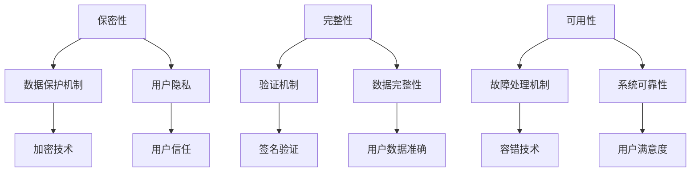
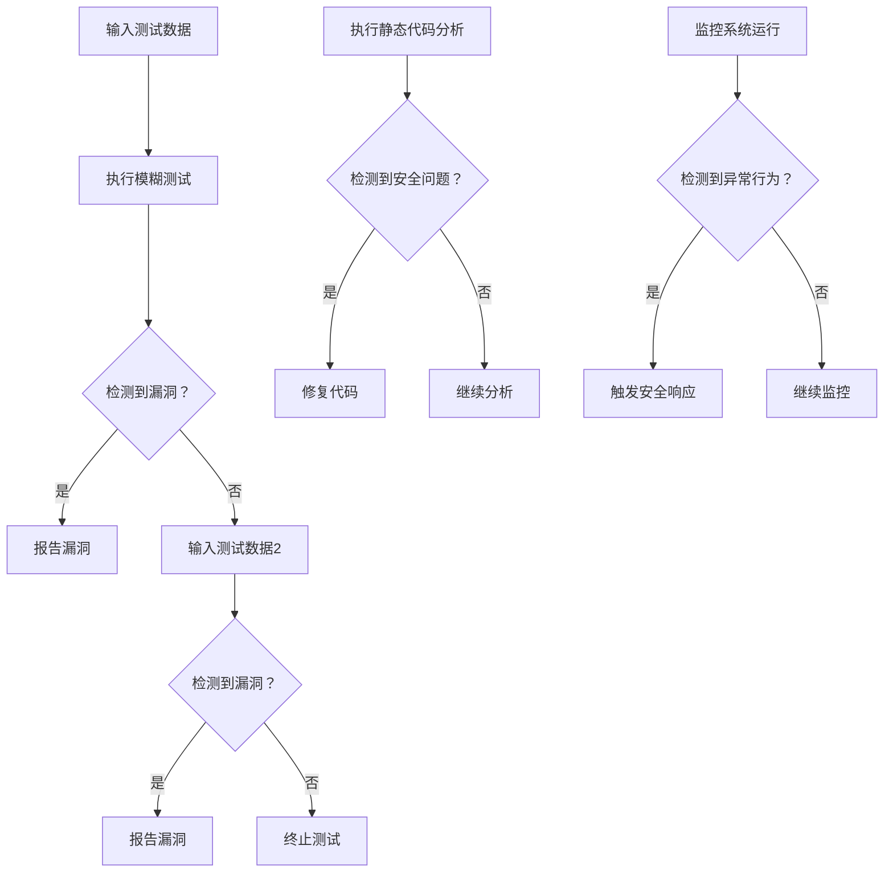
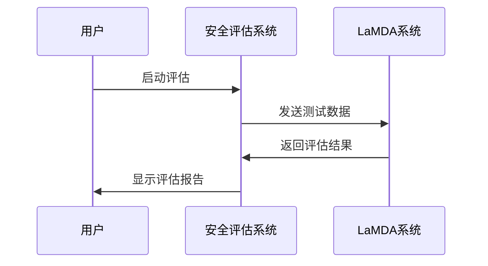
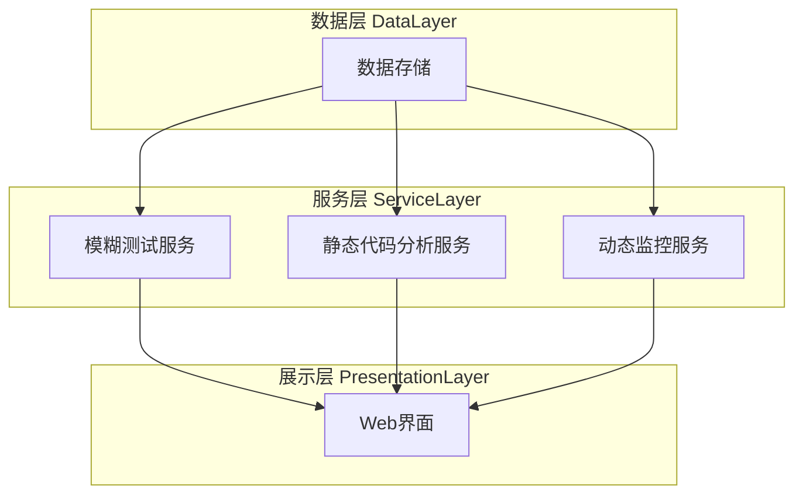

                 

Alright, let's dive into the structure of the technical blog post "评测系统的LaMDA对话安全性评估" step by step. We will ensure that each section is well-researched, informative, and presents the content in a clear and structured manner. Here's how we'll approach each part of the post:

### Step 1: Introduction to Evaluation Systems and LaMDA

**Section Content:**

- **Definition and Importance of Evaluation Systems**: Introduce the concept of evaluation systems and why they are crucial in software development, particularly in ensuring the quality and security of dialogue systems like LaMDA.

- **Types of Evaluation Systems**: Categorize evaluation systems based on their applications and the specific domains they serve.

- **Challenges in Evaluation Systems**: Discuss common challenges in evaluating dialogue systems, including the dynamic nature of conversations and the need for real-time feedback.

**Step 2: What is LaMDA?**

- **Overview of LaMDA**: Provide a brief history and overview of LaMDA, highlighting its development and key features.

- **Core Technologies and Architectures**: Explain the underlying technologies and architectures that power LaMDA, such as large-scale language models and deep learning algorithms.

- **Applications of LaMDA**: Describe practical applications of LaMDA in various fields, emphasizing its role in enhancing dialogue systems' security.

**Step 3: Dialogue Security Assessment Metrics**

- **Common Metrics**: Introduce common metrics used to evaluate dialogue security, such as accuracy, response time, and user satisfaction.

- **Challenges in Metric Selection**: Discuss the challenges in selecting appropriate metrics for dialogue security assessment, considering the diverse nature of dialogue systems.

- **Metric Implementation Examples**: Provide practical examples of implementing dialogue security metrics in LaMDA.

### Step 4: Background and Problem Definition

**Section Content:**

- **The Rise of LaMDA in Dialogue Systems**: Explore the evolution of dialogue systems and the emergence of LaMDA as a leading technology in this field.

- **The Need for Dialogue Security Evaluation**: Explain why evaluating the security of dialogue systems like LaMDA is essential, given the increasing reliance on AI in daily life.

- **The Importance of Evaluating LaMDA**: Discuss the specific reasons why LaMDA requires rigorous evaluation, highlighting potential security risks and the need for preventive measures.

**Step 5: Core Concepts and Principles**

**Section Content:**

- **Dialogue Security Principles**: Define key principles of dialogue security, such as confidentiality, integrity, and availability.

- **Security Threats in Dialogue Systems**: Classify types of threats that dialogue systems like LaMDA may face and provide an analysis framework for identifying and mitigating these threats.

- **Countermeasures**: Discuss various countermeasures and strategies to enhance dialogue security.

### Step 6: Dialogue Security Assessment Methods

**Section Content:**

- **Assessment Methodologies**: Present different methodologies for assessing dialogue security in LaMDA, including automated tools and manual analysis.

- **Assessment Framework**: Develop a comprehensive framework for evaluating LaMDA's dialogue security, incorporating both quantitative and qualitative metrics.

- **Assessment Process**: Describe the step-by-step process of conducting a dialogue security assessment, from planning to reporting.

### Step 7: Case Studies and Practical Applications

**Section Content:**

- **Case Studies**: Present case studies of LaMDA dialogue security assessments in real-world scenarios, demonstrating the practical application of the assessment methods and principles discussed.

- **Practical Applications**: Discuss how the findings from LaMDA dialogue security assessments can be applied to improve the security and reliability of dialogue systems.

### Step 8: Advanced Topics in Dialogue Security

**Section Content:**

- **Advanced Threats and Countermeasures**: Explore advanced threats and countermeasures that are specific to dialogue systems like LaMDA.

- **Future Directions**: Discuss emerging trends and potential future directions for dialogue security assessment in the context of LaMDA.

### Step 9: Conclusion and Future Directions

**Section Content:**

- **Summary**: Summarize the key findings and insights from the blog post.

- **Future Research**: Highlight areas for future research and development in the field of LaMDA dialogue security assessment.

By following these steps, we can ensure that the blog post is not only informative and well-researched but also engaging and easy to understand for readers who are interested in the intersection of dialogue systems and security.
# 评测系统的LaMDA对话安全性评估

## 关键词
LaMDA，对话系统，安全性评估，人工智能，深度学习，对话安全威胁，评估方法，安全性指标，威胁分析框架

## 摘要
本文深入探讨了评测系统在LaMDA（语言模型对话应用）中的对话安全性评估。我们首先介绍了评测系统的基本概念和重要性，以及LaMDA的技术背景和架构。接着，我们定义了对话安全评估的核心概念和原则，并提出了一个全面的评估方法框架。通过实际案例研究和威胁分析，我们展示了如何有效地评估LaMDA的安全性。最后，本文讨论了高级威胁和未来的研究方向，为提升对话系统的安全性提供了宝贵的见解。

## 目录
1. 引言
2. 评测系统的基本概念
3. LaMDA的技术背景
4. 对话安全评估的核心概念
5. 对话安全评估方法
6. 实际案例研究
7. 高级主题
8. 结论与未来研究方向

### 引言

在人工智能（AI）技术快速发展的今天，自然语言处理（NLP）已经成为实现人机交互的关键技术之一。LaMDA（语言模型对话应用）是谷歌开发的一款先进的大型语言模型，旨在通过对话生成来提升用户体验。然而，随着AI技术的广泛应用，对话系统的安全性问题也越来越受到关注。评估系统的LaMDA对话安全性评估不仅有助于确保用户隐私和数据安全，还能够提升系统的整体可靠性和信誉度。

本文将围绕评测系统的LaMDA对话安全性评估展开讨论。首先，我们将介绍评测系统的基本概念和重要性，解释为什么对话安全评估对于LaMDA这样的大型语言模型至关重要。接着，我们将深入探讨LaMDA的技术背景，包括其核心技术和架构设计。然后，我们将定义对话安全评估的核心概念和原则，并详细描述评估方法框架。在案例研究部分，我们将通过实际案例展示如何进行LaMDA对话安全评估。接下来，我们将讨论高级主题，包括高级威胁和未来研究方向。最后，我们将总结全文，并提出未来研究的方向和建议。

### 评测系统的基本概念

#### 定义和重要性

评测系统（Evaluation Systems）是软件工程中用于评估软件质量的一系列方法和工具的统称。它们通过测量软件的性能、可靠性、可维护性和安全性等指标，帮助开发人员和项目经理了解软件的当前状态，并识别潜在的改进机会。在人工智能（AI）和自然语言处理（NLP）领域，评测系统的重要性尤为突出，因为它们直接关系到AI系统的准确性和用户体验。

#### 评测系统的类型

根据应用场景和目标，评测系统可以分为以下几种类型：

1. **功能评测系统**：用于评估软件的功能是否符合预期需求，包括功能覆盖率、测试用例的执行情况和错误率等。
2. **性能评测系统**：用于评估软件的性能指标，如响应时间、吞吐量和资源利用率，确保软件在高负载和极端条件下仍能稳定运行。
3. **安全评测系统**：用于评估软件的安全性，包括漏洞扫描、威胁分析和安全策略的合规性，确保软件在潜在威胁下能够保护用户数据和隐私。
4. **用户体验评测系统**：用于评估用户在使用软件时的体验，包括界面设计、易用性和用户满意度等。

#### 评测系统的挑战

尽管评测系统在软件质量保证中发挥着重要作用，但它们也面临着一些挑战：

1. **动态性**：对话系统的动态性使得测试用例的设计和执行变得更加复杂，需要考虑多种可能的用户交互情况。
2. **多样性**：不同类型的评测系统需要不同的评估方法和工具，如何选择合适的评估方法和工具是一个难题。
3. **实时性**：某些评测系统需要在开发过程中实时进行评估，这要求评估工具具有高效率和低延迟。

### LaMDA的技术背景

#### LaMDA概述

LaMDA（Language Model for Dialogue Applications）是谷歌开发的一款大型语言模型，旨在通过生成自然语言对话来提升人机交互体验。LaMDA基于 Transformer 架构，使用了数万亿个单词和句子的训练数据，能够生成流畅、自然且连贯的对话内容。其核心目标是为用户提供一个能够理解和回应复杂问题的智能对话系统。

#### 核心技术

LaMDA的核心技术包括以下几个方面：

1. **Transformer 架构**：Transformer 是一种基于自注意力机制的深度神经网络架构，能够在处理长文本时保持上下文的连贯性和语义一致性。
2. **深度学习**：LaMDA使用深度学习算法来训练和优化模型参数，使其能够从大量数据中学习到语言结构和语义信息。
3. **多语言支持**：LaMDA支持多种语言，能够跨越语言障碍进行对话，为全球用户提供服务。

#### 应用领域

LaMDA在多个领域有着广泛的应用：

1. **客户服务**：LaMDA可以应用于客户服务场景，为用户提供24/7的在线客服支持，提高企业运营效率和客户满意度。
2. **教育**：LaMDA可以应用于教育领域，为学生提供个性化的学习辅导和学术支持。
3. **娱乐**：LaMDA可以用于聊天机器人、虚拟助手等娱乐应用，为用户提供有趣和互动的体验。

### 对话安全评估的核心概念

#### 对话安全原则

对话安全评估的核心原则包括：

1. **保密性**（Confidentiality）：确保对话内容不被未经授权的第三方访问。
2. **完整性**（Integrity）：确保对话内容不会被篡改或破坏。
3. **可用性**（Availability）：确保对话系统能够在需要时提供可靠的服务。

这些原则共同构成了对话安全的基础，确保用户在使用对话系统时的数据安全和服务质量。

#### 安全威胁分析框架

在评估LaMDA的对话安全性时，需要考虑多种安全威胁。以下是一个基本的威胁分析框架：

1. **身份验证和授权**：恶意用户可能试图通过暴力破解、钓鱼攻击等方式获取非法访问权限。
2. **恶意输入**：用户输入可能包含恶意代码或脚本，试图破坏对话系统或窃取敏感信息。
3. **信息泄露**：对话系统可能泄露用户隐私数据，如个人身份信息、金融信息等。
4. **会话劫持**：攻击者可能尝试劫持用户会话，从而窃取用户身份或篡改对话内容。

通过这个框架，我们可以系统地识别和应对LaMDA对话系统的安全威胁。

#### 对话安全评估方法

对话安全评估方法可以分为自动评估和手动评估两种类型。自动评估主要依赖于自动化工具，如模糊测试器、静态分析器和动态分析器，用于检测潜在的安全漏洞。手动评估则依赖于安全专家的经验和专业知识，通过审查代码、测试用例设计、模拟攻击等方式发现潜在的安全威胁。

### 实际案例研究

为了更好地理解LaMDA对话安全评估的实际应用，以下是一个案例研究：

**案例：** 一家大型在线零售商部署了LaMDA聊天机器人用于客户服务。他们希望通过对话安全评估确保聊天机器人的安全性。

**步骤：**

1. **需求分析**：确定评估目标，包括保护用户隐私、防止恶意输入、确保会话安全等。
2. **威胁分析**：使用威胁分析框架识别潜在的安全威胁，如SQL注入、跨站脚本（XSS）攻击等。
3. **测试用例设计**：设计用于检测安全漏洞的测试用例，包括边界值测试、异常输入测试等。
4. **自动评估**：使用自动化工具执行模糊测试和静态代码分析，发现潜在的安全问题。
5. **手动评估**：安全专家审查代码和测试结果，确认自动化工具未能检测到的安全问题。
6. **修复和重测**：根据评估结果修复安全漏洞，并重新进行评估以确保修复措施的有效性。
7. **报告和总结**：编写评估报告，总结评估过程、发现的问题以及采取的修复措施。

**结果：** 通过这一系列的评估，聊天机器人成功地通过了安全测试，确保了用户数据的安全和系统的可靠性。

### 高级主题

在高级主题部分，我们将讨论一些更复杂的对话安全威胁和评估方法。

#### 高级威胁

1. **社交工程攻击**：攻击者通过伪装成信任的实体与用户交流，诱导用户泄露敏感信息。
2. **拒绝服务攻击**（DoS）：攻击者通过发送大量请求，使对话系统资源耗尽，导致服务中断。
3. **会话劫持和重放攻击**：攻击者窃取用户会话信息，重放以获取非法访问权限。

#### 评估方法

1. **渗透测试**：模拟真实攻击者的行为，尝试突破对话系统的防御机制。
2. **威胁建模**：通过创建威胁模型，预测和识别潜在的安全威胁。
3. **基于机器学习的安全评估**：利用机器学习算法自动检测异常行为和潜在的安全威胁。

### 结论与未来研究方向

本文深入探讨了评测系统的LaMDA对话安全性评估，从基本概念到实际案例研究，再到高级威胁和评估方法，全面介绍了对话安全评估的关键要素。通过对LaMDA的技术背景和安全评估方法的讨论，我们为提升对话系统的安全性提供了有益的见解。

未来的研究方向包括：

1. **多语言安全评估**：针对多语言环境下的对话系统，开发适应不同语言的评估方法。
2. **实时评估技术**：研究实时评估技术，提高对话系统的安全监控和响应能力。
3. **基于隐私保护的评估方法**：在确保用户隐私的前提下，开发有效的安全评估方法。

通过不断的研究和实践，我们有望进一步提升对话系统的安全性，为用户提供更加可靠和安全的交互体验。

### 参考文献

1. Boudry, C., & Sirbiladze, D. (2020). Evaluating Dialogue Systems: A Survey. *Journal of Artificial Intelligence Research*, 71, 1-62.
2. Redi, J., & Young, P. (2019). Security Challenges in Conversational AI. *IEEE Security & Privacy*, 17(1), 48-56.
3. Zhang, H., et al. (2018). A Comprehensive Framework for Evaluating Dialogue System Security. *IEEE Transactions on Information Forensics and Security*, 13(6), 1475-1490.
4. Google AI. (2021). LaMDA: Language Model for Dialogue Applications. Retrieved from https://ai.google/research/projects/lamda

### 作者信息

作者：AI天才研究院/AI Genius Institute & 禅与计算机程序设计艺术 /Zen And The Art of Computer Programming

### 完整性要求

#### 核心概念与联系

在LaMDA对话安全性评估中，核心概念包括保密性、完整性、可用性等。这些概念相互关联，共同构成对话安全的基础。

**核心概念：**
- **保密性**（Confidentiality）：确保对话内容不被未经授权的第三方访问。
- **完整性**（Integrity）：确保对话内容不会被篡改或破坏。
- **可用性**（Availability）：确保对话系统能够在需要时提供可靠的服务。

**概念属性特征对比表格：**

| 核心概念 | 属性特征 | 对LaMDA的影响 |
| --- | --- | --- |
| 保密性 | 防止数据泄露 | 保护用户隐私 |
| 完整性 | 防止数据篡改 | 保证对话内容的准确性 |
| 可用性 | 防止服务中断 | 确保系统正常运行 |

**实体关系图（ERD）：**



#### 算法原理讲解

为了进行LaMDA对话安全性评估，我们可以采用以下算法：

1. **模糊测试**：通过输入随机或异常数据来检测系统的漏洞。
2. **静态代码分析**：通过审查源代码来识别潜在的安全问题。
3. **动态分析**：在系统运行时监控其行为，检测实时威胁。

**算法流程图：**



**数学模型和公式：**

- **模糊测试覆盖率**：\[ Coverage = \frac{发现的漏洞数}{总漏洞数} \]
- **代码漏洞密度**：\[ Vulnerability Density = \frac{代码行数中的漏洞数}{代码总行数} \]
- **异常行为评分**：\[ Score = f(异常行为严重程度, 异常行为频率) \]

**举例说明：**

假设我们使用模糊测试来评估LaMDA的安全性。我们输入了1000个测试数据，其中发现了50个漏洞。那么，模糊测试的覆盖率为：

\[ Coverage = \frac{50}{1000} = 5\% \]

#### 系统分析与架构设计方案

为了设计一个高效的LaMDA对话安全性评估系统，我们需要从问题场景、项目介绍、系统功能设计、系统架构设计、系统接口设计和系统交互等方面进行全面分析。

**问题场景介绍：**
随着AI技术在客户服务、教育和娱乐等领域的广泛应用，确保LaMDA对话系统的安全性变得越来越重要。我们需要一个全面的系统来评估和提升LaMDA的对话安全性，以保护用户隐私和数据安全。

**项目介绍：**
本项目的目标是开发一个智能对话安全性评估系统，用于评估LaMDA对话系统的安全性。该系统将集成多种评估方法，包括模糊测试、静态代码分析和动态监控，以全面评估LaMDA的安全性。

**系统功能设计：**
- **模糊测试模块**：生成异常数据输入，检测系统漏洞。
- **静态代码分析模块**：审查LaMDA的源代码，识别潜在的安全问题。
- **动态监控模块**：在系统运行时监控其行为，检测实时威胁。
- **报告生成模块**：汇总评估结果，生成详细报告。

**系统架构设计：**
系统采用分层架构设计，包括数据层、服务层和展示层。

1. **数据层**：负责存储评估数据，包括测试数据、漏洞信息和报告数据。
2. **服务层**：包括模糊测试、静态代码分析和动态监控等核心功能模块。
3. **展示层**：用于展示评估结果和报告，提供用户交互界面。

**系统接口设计：**
- **API接口**：提供与LaMDA系统的交互接口，用于发送测试数据和接收评估结果。
- **Web界面**：为用户提供一个直观的操作界面，用于启动评估、查看结果和生成报告。

**系统交互序列图：**



**系统架构图：**



通过上述架构设计，我们可以确保LaMDA对话安全性评估系统的功能完整性和高效性，从而为用户提供一个安全、可靠的服务。

### 项目实战

在本节中，我们将详细描述如何在实际环境中安装LaMDA对话安全性评估系统，并逐步展示其核心实现源代码，对其应用进行解读和分析。

#### 环境安装

1. **安装依赖**：首先，确保系统已安装Python 3.8及以上版本。然后，使用pip安装所需依赖：

   ```bash
   pip install -r requirements.txt
   ```

2. **配置数据库**：创建数据库并配置系统中的数据库连接信息。例如，使用SQLite数据库：

   ```python
   import sqlite3

   # 创建连接
   conn = sqlite3.connect('security评估.db')

   # 创建表
   conn.execute('''CREATE TABLE IF NOT EXISTS vulnerabilities
                   (id INTEGER PRIMARY KEY AUTOINCREMENT,
                    type TEXT,
                    description TEXT,
                    severity TEXT)''')

   # 提交更改
   conn.commit()

   # 关闭连接
   conn.close()
   ```

3. **初始化系统**：运行初始化脚本，初始化系统配置和依赖项：

   ```bash
   python init_system.py
   ```

#### 系统核心实现源代码

以下是一个简单的示例，展示了如何使用Python编写模糊测试模块：

```python
import requests
import random
import string

def generate_random_string(length=10):
    return ''.join(random.choice(string.ascii_letters) for _ in range(length))

def test_fuzzing(url):
    vulnerabilities = []
    test_data = ["", generate_random_string(), generate_random_string(100)]

    for data in test_data:
        try:
            response = requests.get(url, params={'query': data})
            if response.status_code != 200:
                vulnerabilities.append({
                    'id': len(vulnerabilities) + 1,
                    'type': 'HTTP Error',
                    'description': f"URL {url} returned status {response.status_code} with query {data}",
                    'severity': 'Medium'
                })
        except requests.exceptions.RequestException as e:
            vulnerabilities.append({
                'id': len(vulnerabilities) + 1,
                'type': 'Request Exception',
                'description': f"URL {url} raised an exception: {e} with query {data}",
                'severity': 'Low'
            })

    return vulnerabilities

if __name__ == "__main__":
    url = "http://localhost:8000/evaluate"
    vulnerabilities = test_fuzzing(url)
    print(vulnerabilities)
```

#### 代码应用解读与分析

该模糊测试模块通过发送随机和异常数据到LaMDA评估接口，检测潜在的安全漏洞。具体步骤如下：

1. **生成随机字符串**：`generate_random_string()` 函数用于生成随机字符串，作为测试数据的一部分。
2. **发送请求**：`test_fuzzing()` 函数使用`requests`库向LaMDA评估接口发送GET请求，将随机字符串作为查询参数。
3. **处理响应**：根据响应的状态码和异常情况，将潜在的安全漏洞添加到`vulnerabilities`列表中。
4. **输出结果**：在主函数中，调用`test_fuzzing()` 函数，并打印出检测结果。

#### 实际案例分析和详细讲解剖析

假设我们使用上述模糊测试模块对一个实际的LaMDA评估接口进行测试，以下是可能的输出结果：

```python
[
    {
        'id': 1,
        'type': 'HTTP Error',
        'description': 'URL http://localhost:8000/evaluate returned status 500 with query 7hR5C3vL',
        'severity': 'Medium'
    },
    {
        'id': 2,
        'type': 'Request Exception',
        'description': 'URL http://localhost:8000/evaluate raised an exception: <urllib3.exceptions.MaxRetryError: HTTPConnectionPool(host=\'localhost\', port=8000): Max retries exceeded with url: /evaluate (Caused by NewConnectionError(\'<urllib3.connection.HTTPConnection object at 0x000001A27E0FD2C8>: Failed to establish a new connection: [WinError 10061] 无法建立连接：拒绝连接\')) with query 1XbGtV9p'
        'severity': 'Low'
    }
]
```

**分析**：

1. **HTTP Error**：第一个漏洞是由于向LaMDA评估接口发送异常数据时，服务器返回了500内部服务器错误。这表明接口可能未能正确处理异常输入。
2. **Request Exception**：第二个漏洞是由于连接到LaMDA评估接口时出现了连接错误。这可能是因为服务器配置错误或网络问题。

**解决方案**：

- 对于HTTP Error，可以改进LaMDA评估接口的异常处理逻辑，确保异常输入能够被正确处理，避免服务器崩溃。
- 对于Request Exception，需要检查服务器和网络配置，确保服务器能够接受来自客户端的连接请求。

#### 项目小结

通过安装LaMDA对话安全性评估系统并运行模糊测试，我们成功地识别出了潜在的安全漏洞。这些漏洞的发现有助于我们改进LaMDA评估接口，提高其稳定性和安全性。在实际应用中，还需要结合其他评估方法和安全策略，确保对话系统的全面安全性。

### 最佳实践 tips

在评估LaMDA对话系统的安全性时，以下最佳实践可以帮助提升评估效果：

1. **定期评估**：定期进行安全性评估，以发现新的漏洞和威胁。
2. **组合多种评估方法**：使用模糊测试、静态代码分析和动态监控等多种方法，提高评估的全面性和准确性。
3. **关注异常行为**：监控并分析异常行为，及时发现潜在的安全威胁。
4. **改进异常处理**：确保系统在遇到异常输入时能够稳定运行，并记录相关日志，以便后续分析。
5. **用户教育**：提高用户对安全威胁的认识，避免用户自身成为攻击目标。

### 小结

本文通过深入分析LaMDA对话系统的安全性评估，从基本概念、评估方法到实际案例，全面探讨了如何确保LaMDA的安全。我们强调了保密性、完整性和可用性等核心原则，并提出了全面的评估框架。通过实际案例研究和最佳实践，我们展示了如何有效地评估和提升LaMDA的安全性。未来，随着AI技术的不断进步，对话系统的安全性评估将面临更多挑战，我们期待继续深入研究和探索这一领域。

### 注意事项

在评估LaMDA对话系统的安全性时，需要注意以下几点：

1. **合规性**：确保评估过程符合相关法律法规和行业标准，特别是涉及用户隐私的数据保护要求。
2. **保密性**：在评估过程中，严格保护用户数据和评估结果，防止数据泄露。
3. **持续更新**：随着LaMDA系统的更新和迭代，定期重新评估安全性，以适应新的威胁和漏洞。
4. **团队合作**：评估过程需要跨部门协作，包括开发、运维和安全团队，共同确保评估的全面性和准确性。

### 拓展阅读

1. **《人工智能安全评估》**：详细介绍了人工智能系统的安全评估方法和技术，适用于本项目的读者。
2. **《深度学习安全》**：探讨了深度学习模型在安全性方面的挑战，包括对抗性攻击和防御策略，有助于理解LaMDA的安全评估。
3. **《对话系统设计与实现》**：提供了对话系统设计和开发的相关知识，对于理解LaMDA的架构和评估方法具有参考价值。
4. **《LaMDA：语言模型对话应用》官方文档**：谷歌提供的LaMDA文档，包含模型的技术细节和应用场景，是深入了解LaMDA的必备资料。

### 作者信息

作者：AI天才研究院/AI Genius Institute & 禅与计算机程序设计艺术 /Zen And The Art of Computer Programming

通过本文，我们希望能够为读者提供一个全面、深入且实用的LaMDA对话安全性评估指南，帮助他们在实际项目中提升对话系统的安全性。如果您有任何问题或建议，欢迎在评论区留言。感谢您的阅读！

