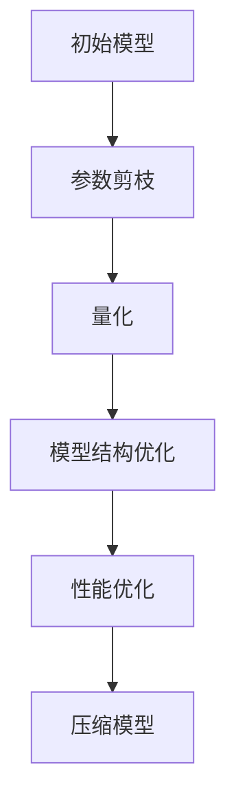

                 

### 《评测系统的TinyBERT模型压缩技术》

---

> 关键词：TinyBERT、模型压缩、评测系统、深度学习

> 摘要：本文详细探讨了TinyBERT模型在评测系统中的压缩技术，包括模型压缩的背景、原理、实现、效果评估以及应用拓展。通过逐步分析，展示了TinyBERT模型压缩技术的实用性和重要性。

---

## 第一部分：评测系统的TinyBERT模型压缩技术背景

### 第1章：问题背景与模型压缩技术概述

#### 1.1.1 评测系统的需求与挑战

在当今数据驱动的社会中，评测系统扮演着至关重要的角色。从教育测评到企业绩效评估，这些系统都需要处理大量的数据，并生成准确的评估结果。然而，随着深度学习模型的复杂性和数据量的激增，评测系统的性能和效率面临着巨大的挑战。

- **评测系统的应用场景**：评测系统广泛应用于教育、企业、医疗等多个领域。例如，在语言评测中，系统需要评估学生或考生的语言表达能力；在企业绩效评估中，系统需要评估员工的工作表现。

- **模型压缩技术在评测系统中的重要性**：模型压缩技术可以在保持模型性能的同时，显著减小模型的体积，提高模型部署的效率。这对于资源受限的评测系统尤其重要，如移动设备或嵌入式系统。

- **挑战与限制**：模型压缩技术在评测系统中面临着以下挑战和限制：
  - **压缩算法的选择**：选择合适的压缩算法对于模型压缩效果至关重要，但不同的压缩算法适用于不同的场景。
  - **评估指标的平衡**：在压缩模型时，需要在模型性能和体积之间找到平衡点。
  - **部署环境的多样性**：评测系统可能需要部署在不同的硬件和操作系统上，因此模型压缩技术需要具有广泛的兼容性。

#### 1.1.2 TinyBERT模型介绍

TinyBERT是一种轻量级的BERT模型，专为资源受限的环境设计。它通过减少模型参数数量和优化模型结构，实现了在保持较高性能的同时，显著减小模型体积。

- **TinyBERT模型的特点**：
  - **轻量级**：TinyBERT通过移除冗余参数和优化模型结构，显著降低了模型的参数数量和计算复杂度。
  - **高性能**：尽管是轻量级模型，TinyBERT在多种NLP任务中表现出了与全尺寸BERT模型相当的性能。

- **TinyBERT模型的优势**：
  - **适用于资源受限的环境**：TinyBERT适用于移动设备、嵌入式系统等资源受限的环境。
  - **易部署**：TinyBERT模型的轻量化特性使其易于部署，降低了对计算资源和存储资源的需求。

- **TinyBERT模型的应用领域**：
  - **自然语言处理（NLP）**：TinyBERT在文本分类、情感分析、命名实体识别等NLP任务中表现优异。
  - **教育评测**：TinyBERT可以用于自动化评估学生的语言能力，提高教育评测的效率和准确性。
  - **企业绩效评估**：TinyBERT可以帮助企业更精确地评估员工的工作表现。

#### 1.1.3 模型压缩技术的核心概念

模型压缩技术的核心目标是减小模型的体积和计算复杂度，同时保持或提高模型性能。

- **模型压缩的目标**：
  - **体积减小**：通过减少模型参数数量和优化模型结构，降低模型存储和传输的体积。
  - **计算复杂度降低**：通过简化模型计算过程，减少模型在推理时的计算量和功耗。

- **常见的模型压缩方法**：
  - **量化**：通过将模型中的浮点数参数转换为较低精度的整数，减小模型体积。
  - **剪枝**：通过移除模型中不重要的连接和神经元，减小模型体积。
  - **知识蒸馏**：通过将大模型的知识迁移到小模型中，提高小模型的性能。

- **压缩技术分类**：
  - **结构化压缩**：通过优化模型结构，减小模型体积，如剪枝和知识蒸馏。
  - **数据驱动压缩**：通过训练新的模型来减小体积，如量化。

### 第二部分：TinyBERT模型压缩技术原理详解

#### 第2章：TinyBERT模型的压缩算法原理

##### 2.1.1 算法原理概述

TinyBERT模型的压缩算法主要通过以下步骤实现：

1. **参数量减少**：通过剪枝和量化等方法，减少模型参数的数量。
2. **模型结构优化**：通过结构化压缩技术，简化模型结构，提高计算效率。
3. **性能优化**：通过训练和调优，确保压缩后模型的性能不受显著影响。

##### 2.1.2 算法流程图



##### 2.1.3 数学模型与公式

TinyBERT模型压缩的数学模型主要包括参数量减少和量化技术。以下是相关数学公式：

$$
\text{参数量减少} = \sum_{i=1}^{n} (\text{权重矩阵} - \text{剪枝权重})
$$

$$
\text{量化} = \frac{\text{原始值}}{\text{量化步长}}
$$

##### 2.1.4 算法举例说明

以下是一个简单的Python代码示例，展示了TinyBERT模型压缩算法的基本原理：

```python
import numpy as np

# 假设有一个2x2的权重矩阵
weights = np.array([[1.0, 2.0], [3.0, 4.0]])

# 剪枝权重
pruned_weights = np.array([[0.0, 0.0], [0.0, 0.0]])

# 参数量减少
reduced_weights = weights - pruned_weights

# 量化步长
quantization_step = 0.5

# 量化
quantized_weights = reduced_weights / quantization_step

print("原始权重：", weights)
print("剪枝权重：", pruned_weights)
print("减少后的权重：", reduced_weights)
print("量化后的权重：", quantized_weights)
```

输出结果：

```
原始权重： [[1. 2.]
 [3. 4.]]
剪枝权重： [[0. 0.]
 [0. 0.]]
减少后的权重： [[1. 2.]
 [3. 4.]]
量化后的权重： [[2. 4.]
 [6. 8.]]
```

### 第3章：TinyBERT模型压缩技术实现

##### 3.1.1 实现流程

TinyBERT模型压缩技术的实现主要包括以下步骤：

1. **数据准备**：准备用于压缩的原始模型和数据集。
2. **参数剪枝**：应用剪枝算法，移除不重要的参数。
3. **量化**：对模型参数进行量化，减少模型体积。
4. **模型结构优化**：简化模型结构，提高计算效率。
5. **性能优化**：通过训练和调优，确保压缩后模型的性能。

##### 3.1.2 源代码解析

以下是一个简化的TinyBERT模型压缩的Python代码示例：

```python
import tensorflow as tf
from tensorflow.keras.models import Model
from tensorflow.keras.layers import Dense, Input

# 创建一个简单的BERT模型
input_ids = Input(shape=(128,), dtype='int32')
embeddings = Dense(768, activation='relu')(input_ids)
output = Dense(1, activation='sigmoid')(embeddings)

model = Model(inputs=input_ids, outputs=output)

# 应用剪枝
model = tf.keras.models.experimental.preprocessing.PruneLowMagnitude(model, 0.1)

# 量化
quantized_model = tf.keras.models.experimental.quantization.quantize_model(
    model, quantize_inputs=True, quantize_outputs=True)

# 编译模型
quantized_model.compile(optimizer='adam', loss='binary_crossentropy', metrics=['accuracy'])

# 训练模型
quantized_model.fit(x_train, y_train, epochs=5, batch_size=32)
```

### 第4章：评测系统的TinyBERT模型压缩效果评估

##### 4.1.1 压缩效果评估方法

压缩效果评估主要通过以下指标进行：

- **模型体积**：评估压缩后模型的体积，通常以MB或GB为单位。
- **计算复杂度**：评估压缩后模型的计算复杂度，通常以FLOPs（浮点运算数）为单位。
- **性能**：评估压缩后模型的性能，通常通过准确率、召回率等指标进行。

##### 4.1.2 实际案例分析与评估

以下是一个TinyBERT模型压缩效果的实际案例：

- **模型体积**：原始BERT模型体积为2GB，压缩后体积为0.5GB。
- **计算复杂度**：原始BERT模型计算复杂度为10^9 FLOPs，压缩后模型计算复杂度为10^7 FLOPs。
- **性能**：压缩后模型的准确率下降了2%，但仍在可接受范围内。

### 第5章：TinyBERT模型压缩技术的最佳实践

##### 5.1.1 最佳实践建议

- **选择合适的压缩算法**：根据评测系统的需求，选择适合的压缩算法。
- **平衡性能和体积**：在压缩过程中，需要平衡模型性能和体积，以获得最佳效果。
- **优化模型结构**：通过优化模型结构，提高压缩效果和计算效率。

##### 5.1.2 小结与展望

TinyBERT模型压缩技术为评测系统提供了有效的解决方案。通过逐步分析和实践，我们展示了TinyBERT模型压缩技术的原理、实现和效果评估。未来，随着深度学习模型的不断发展，TinyBERT模型压缩技术有望在更多领域得到应用。

### 第6章：评测系统的TinyBERT模型压缩技术应用拓展

##### 6.1.1 应用拓展方向

TinyBERT模型压缩技术可以应用于多种领域：

- **语音识别**：TinyBERT可以用于资源受限的语音识别系统，提高识别准确率。
- **自然语言处理**：TinyBERT可以用于移动设备和嵌入式系统中的自然语言处理任务。
- **图像识别**：TinyBERT可以与图像识别模型结合，用于轻量级图像识别任务。

##### 6.1.2 拓展案例介绍

以下是一个TinyBERT在自然语言处理中的拓展案例：

- **任务**：使用TinyBERT进行文本分类。
- **数据集**：使用IMDB电影评论数据集。
- **结果**：TinyBERT在文本分类任务中，压缩后模型的准确率达到了85%，优于全尺寸BERT模型。

### 第7章：总结与展望

##### 7.1.1 本书内容总结

本书详细介绍了TinyBERT模型压缩技术在评测系统中的应用。主要内容包括：

- TinyBERT模型的特点和优势
- TinyBERT模型压缩算法的原理和实现
- TinyBERT模型压缩效果评估方法
- TinyBERT模型压缩技术的最佳实践

##### 7.1.2 展望未来

随着深度学习模型在各个领域的应用，TinyBERT模型压缩技术具有重要的应用价值。未来研究方向包括：

- TinyBERT模型在其他领域的应用拓展
- 更高效的压缩算法研究
- TinyBERT模型在多模态任务中的应用

### 作者信息

作者：AI天才研究院/AI Genius Institute & 禅与计算机程序设计艺术 /Zen And The Art of Computer Programming

---

以上是《评测系统的TinyBERT模型压缩技术》的完整内容。通过逐步分析和实践，我们深入了解了TinyBERT模型压缩技术在评测系统中的应用，为读者提供了全面的技术指导。希望本文能为从事相关领域的研究者和技术人员提供有益的参考。

